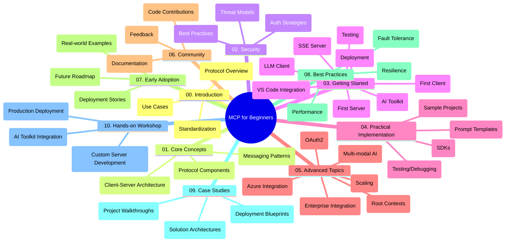

<!--
CO_OP_TRANSLATOR_METADATA:
{
  "original_hash": "a607d4febc94caee9a12b77795f7fc9a",
  "translation_date": "2025-07-13T15:09:25+00:00",
  "source_file": "study_guide.md",
  "language_code": "es"
}
-->
# Protocolo de Contexto de Modelo (MCP) para Principiantes - Guía de Estudio

Esta guía de estudio ofrece una visión general de la estructura y el contenido del repositorio para el currículo "Protocolo de Contexto de Modelo (MCP) para Principiantes". Usa esta guía para navegar el repositorio de manera eficiente y aprovechar al máximo los recursos disponibles.

## Resumen del Repositorio

El Protocolo de Contexto de Modelo (MCP) es un marco estandarizado para las interacciones entre modelos de IA y aplicaciones cliente. Este repositorio proporciona un currículo completo con ejemplos prácticos de código en C#, Java, JavaScript, Python y TypeScript, diseñado para desarrolladores de IA, arquitectos de sistemas e ingenieros de software.

## Mapa Visual del Currículo

## Estructura del Repositorio

El repositorio está organizado en diez secciones principales, cada una enfocada en diferentes aspectos del MCP:

1. **Introducción (00-Introduction/)**
   - Visión general del Protocolo de Contexto de Modelo
   - Por qué la estandarización es importante en las canalizaciones de IA
   - Casos de uso prácticos y beneficios

2. **Conceptos Básicos (01-CoreConcepts/)**
   - Arquitectura cliente-servidor
   - Componentes clave del protocolo
   - Patrones de mensajería en MCP

3. **Seguridad (02-Security/)**
   - Amenazas de seguridad en sistemas basados en MCP
   - Mejores prácticas para asegurar las implementaciones
   - Estrategias de autenticación y autorización

4. **Primeros Pasos (03-GettingStarted/)**
   - Configuración y preparación del entorno
   - Creación de servidores y clientes MCP básicos
   - Integración con aplicaciones existentes
   - Subsecciones para primer servidor, primer cliente, cliente LLM, integración con VS Code, servidor SSE, AI Toolkit, pruebas y despliegue

5. **Implementación Práctica (04-PracticalImplementation/)**
   - Uso de SDKs en diferentes lenguajes de programación
   - Técnicas de depuración, pruebas y validación
   - Creación de plantillas de prompts reutilizables y flujos de trabajo
   - Proyectos de ejemplo con casos de implementación

6. **Temas Avanzados (05-AdvancedTopics/)**
   - Flujos de trabajo multimodales de IA y extensibilidad
   - Estrategias seguras para escalabilidad
   - MCP en ecosistemas empresariales
   - Temas especializados incluyendo integración con Azure, multimodalidad, OAuth2, contextos raíz, enrutamiento, muestreo, escalado, seguridad, integración con búsqueda web y streaming.

7. **Contribuciones de la Comunidad (06-CommunityContributions/)**
   - Cómo contribuir con código y documentación
   - Colaboración a través de GitHub
   - Mejoras impulsadas por la comunidad y retroalimentación

8. **Lecciones de la Adopción Temprana (07-LessonsfromEarlyAdoption/)**
   - Implementaciones reales y casos de éxito
   - Construcción y despliegue de soluciones basadas en MCP
   - Tendencias y hoja de ruta futura

9. **Mejores Prácticas (08-BestPractices/)**
   - Optimización y ajuste de rendimiento
   - Diseño de sistemas MCP tolerantes a fallos
   - Estrategias de pruebas y resiliencia

10. **Estudios de Caso (09-CaseStudy/)**
    - Análisis detallados de arquitecturas de soluciones MCP
    - Planos de despliegue y consejos de integración
    - Diagramas anotados y recorridos por proyectos

11. **Taller Práctico (10-StreamliningAIWorkflowsBuildingAnMCPServerWithAIToolkit/)**
    - Taller práctico integral que combina MCP con AI Toolkit de Microsoft para VS Code
    - Construcción de aplicaciones inteligentes que conectan modelos de IA con herramientas del mundo real
    - Módulos prácticos que cubren fundamentos, desarrollo de servidores personalizados y estrategias de despliegue en producción

## Proyectos de Ejemplo

El repositorio incluye varios proyectos de ejemplo que demuestran la implementación de MCP en diferentes lenguajes de programación:

### Ejemplos Básicos de Calculadora MCP
- Ejemplo de Servidor MCP en C#
- Calculadora MCP en Java
- Demo MCP en JavaScript
- Servidor MCP en Python
- Ejemplo MCP en TypeScript

### Proyectos Avanzados de Calculadora MCP
- Ejemplo Avanzado en C#
- Aplicación Contenedor en Java
- Ejemplo Avanzado en JavaScript
- Implementación Compleja en Python
- Ejemplo Contenedor en TypeScript

## Recursos Adicionales

El repositorio incluye recursos complementarios:

- **Carpeta de imágenes**: Contiene diagramas e ilustraciones usadas a lo largo del currículo
- **Traducciones**: Soporte multilingüe con traducciones automáticas de la documentación
- **Recursos oficiales de MCP**:
  - [MCP Documentation](https://modelcontextprotocol.io/)
  - [MCP Specification](https://spec.modelcontextprotocol.io/)
  - [MCP GitHub Repository](https://github.com/modelcontextprotocol)

## Cómo Usar Este Repositorio

1. **Aprendizaje Secuencial**: Sigue los capítulos en orden (del 00 al 10) para una experiencia de aprendizaje estructurada.
2. **Enfoque por Lenguaje**: Si te interesa un lenguaje de programación en particular, explora los directorios de ejemplos para encontrar implementaciones en tu lenguaje preferido.
3. **Implementación Práctica**: Comienza con la sección "Primeros Pasos" para configurar tu entorno y crear tu primer servidor y cliente MCP.
4. **Exploración Avanzada**: Una vez que domines lo básico, profundiza en los temas avanzados para ampliar tus conocimientos.
5. **Participación Comunitaria**: Únete al [Azure AI Foundry Discord](https://discord.com/invite/ByRwuEEgH4) para conectar con expertos y otros desarrolladores.

## Contribuciones

Este repositorio recibe con gusto contribuciones de la comunidad. Consulta la sección Contribuciones de la Comunidad para obtener orientación sobre cómo contribuir.

---

*Esta guía de estudio fue creada el 11 de junio de 2025 y ofrece una visión general del repositorio hasta esa fecha. El contenido del repositorio puede haber sido actualizado desde entonces.*

**Aviso legal**:  
Este documento ha sido traducido utilizando el servicio de traducción automática [Co-op Translator](https://github.com/Azure/co-op-translator). Aunque nos esforzamos por la precisión, tenga en cuenta que las traducciones automáticas pueden contener errores o inexactitudes. El documento original en su idioma nativo debe considerarse la fuente autorizada. Para información crítica, se recomienda la traducción profesional realizada por humanos. No nos hacemos responsables de malentendidos o interpretaciones erróneas derivadas del uso de esta traducción.