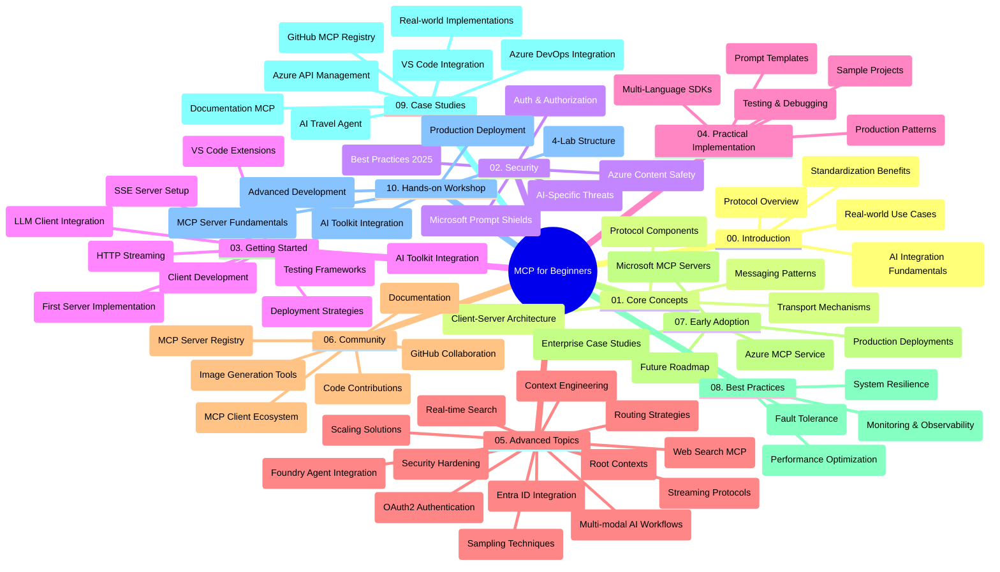

<!--
CO_OP_TRANSLATOR_METADATA:
{
  "original_hash": "719117a0a5f34ade7b5dfb61ee06fb13",
  "translation_date": "2025-09-26T17:35:33+00:00",
  "source_file": "study_guide.md",
  "language_code": "es"
}
-->
# Protocolo de Contexto de Modelo (MCP) para Principiantes - Guía de Estudio

Esta guía de estudio ofrece una visión general de la estructura y contenido del repositorio para el currículo "Protocolo de Contexto de Modelo (MCP) para Principiantes". Utiliza esta guía para navegar por el repositorio de manera eficiente y aprovechar al máximo los recursos disponibles.

## Descripción del Repositorio

El Protocolo de Contexto de Modelo (MCP) es un marco estandarizado para las interacciones entre modelos de IA y aplicaciones cliente. Inicialmente creado por Anthropic, MCP ahora es mantenido por la comunidad MCP a través de la organización oficial en GitHub. Este repositorio proporciona un currículo completo con ejemplos prácticos de código en C#, Java, JavaScript, Python y TypeScript, diseñado para desarrolladores de IA, arquitectos de sistemas e ingenieros de software.

## Mapa Visual del Currículo

## Estructura del Repositorio

El repositorio está organizado en diez secciones principales, cada una enfocada en diferentes aspectos de MCP:

1. **Introducción (00-Introduction/)**
   - Descripción general del Protocolo de Contexto de Modelo
   - Por qué la estandarización es importante en los flujos de trabajo de IA
   - Casos prácticos y beneficios

2. **Conceptos Básicos (01-CoreConcepts/)**
   - Arquitectura cliente-servidor
   - Componentes clave del protocolo
   - Patrones de mensajería en MCP

3. **Seguridad (02-Security/)**
   - Amenazas de seguridad en sistemas basados en MCP
   - Mejores prácticas para asegurar implementaciones
   - Estrategias de autenticación y autorización
   - **Documentación Completa de Seguridad**:
     - Mejores Prácticas de Seguridad MCP 2025
     - Guía de Implementación de Seguridad de Contenido en Azure
     - Controles y Técnicas de Seguridad MCP
     - Referencia Rápida de Mejores Prácticas MCP
   - **Temas Clave de Seguridad**:
     - Inyección de prompts y ataques de envenenamiento de herramientas
     - Secuestro de sesiones y problemas de delegación confusa
     - Vulnerabilidades de paso de tokens
     - Permisos excesivos y control de acceso
     - Seguridad en la cadena de suministro para componentes de IA
     - Integración de Microsoft Prompt Shields

4. **Primeros Pasos (03-GettingStarted/)**
   - Configuración del entorno
   - Creación de servidores y clientes MCP básicos
   - Integración con aplicaciones existentes
   - Incluye secciones sobre:
     - Implementación del primer servidor
     - Desarrollo de clientes
     - Integración de clientes LLM
     - Integración con VS Code
     - Servidor de Eventos Enviados por el Servidor (SSE)
     - Streaming HTTP
     - Integración con AI Toolkit
     - Estrategias de prueba
     - Directrices de despliegue

5. **Implementación Práctica (04-PracticalImplementation/)**
   - Uso de SDKs en diferentes lenguajes de programación
   - Técnicas de depuración, prueba y validación
   - Creación de plantillas de prompts y flujos de trabajo reutilizables
   - Proyectos de muestra con ejemplos de implementación

6. **Temas Avanzados (05-AdvancedTopics/)**
   - Técnicas de ingeniería de contexto
   - Integración de agentes Foundry
   - Flujos de trabajo de IA multimodal
   - Demos de autenticación OAuth2
   - Capacidades de búsqueda en tiempo real
   - Streaming en tiempo real
   - Implementación de contextos raíz
   - Estrategias de enrutamiento
   - Técnicas de muestreo
   - Enfoques de escalabilidad
   - Consideraciones de seguridad
   - Integración de seguridad Entra ID
   - Integración de búsqueda web

7. **Contribuciones de la Comunidad (06-CommunityContributions/)**
   - Cómo contribuir con código y documentación
   - Colaboración a través de GitHub
   - Mejoras y comentarios impulsados por la comunidad
   - Uso de varios clientes MCP (Claude Desktop, Cline, VSCode)
   - Trabajo con servidores MCP populares, incluyendo generación de imágenes

8. **Lecciones de la Adopción Temprana (07-LessonsfromEarlyAdoption/)**
   - Implementaciones reales y casos de éxito
   - Construcción y despliegue de soluciones basadas en MCP
   - Tendencias y hoja de ruta futura
   - **Guía de Servidores MCP de Microsoft**: Guía completa de 10 servidores MCP de Microsoft listos para producción, incluyendo:
     - Servidor MCP de Microsoft Learn Docs
     - Servidor MCP de Azure (15+ conectores especializados)
     - Servidor MCP de GitHub
     - Servidor MCP de Azure DevOps
     - Servidor MCP de MarkItDown
     - Servidor MCP de SQL Server
     - Servidor MCP de Playwright
     - Servidor MCP de Dev Box
     - Servidor MCP de Azure AI Foundry
     - Servidor MCP de Microsoft 365 Agents Toolkit

9. **Mejores Prácticas (08-BestPractices/)**
   - Ajuste de rendimiento y optimización
   - Diseño de sistemas MCP tolerantes a fallos
   - Estrategias de prueba y resiliencia

10. **Estudios de Caso (09-CaseStudy/)**
    - **Siete estudios de caso completos** que demuestran la versatilidad de MCP en diversos escenarios:
    - **Agentes de Viaje de Azure AI**: Orquestación multi-agente con Azure OpenAI y AI Search
    - **Integración con Azure DevOps**: Automatización de procesos de flujo de trabajo con actualizaciones de datos de YouTube
    - **Recuperación de Documentación en Tiempo Real**: Cliente de consola Python con streaming HTTP
    - **Generador Interactivo de Planes de Estudio**: Aplicación web Chainlit con IA conversacional
    - **Documentación en el Editor**: Integración de VS Code con flujos de trabajo de GitHub Copilot
    - **Gestión de API de Azure**: Integración empresarial de API con creación de servidores MCP
    - **Registro MCP de GitHub**: Desarrollo de ecosistemas y plataforma de integración agentica
    - Ejemplos de implementación que abarcan integración empresarial, productividad del desarrollador y desarrollo de ecosistemas

11. **Taller Práctico (10-StreamliningAIWorkflowsBuildingAnMCPServerWithAIToolkit/)**
    - Taller práctico completo que combina MCP con AI Toolkit
    - Construcción de aplicaciones inteligentes que conectan modelos de IA con herramientas del mundo real
    - Módulos prácticos que cubren fundamentos, desarrollo de servidores personalizados y estrategias de despliegue en producción
    - **Estructura del Taller**:
      - Laboratorio 1: Fundamentos del Servidor MCP
      - Laboratorio 2: Desarrollo Avanzado de Servidores MCP
      - Laboratorio 3: Integración con AI Toolkit
      - Laboratorio 4: Despliegue y Escalabilidad en Producción
    - Enfoque de aprendizaje basado en laboratorios con instrucciones paso a paso

## Recursos Adicionales

El repositorio incluye recursos de apoyo:

- **Carpeta de Imágenes**: Contiene diagramas e ilustraciones utilizados a lo largo del currículo
- **Traducciones**: Soporte multilingüe con traducciones automáticas de la documentación
- **Recursos Oficiales de MCP**:
  - [Documentación MCP](https://modelcontextprotocol.io/)
  - [Especificación MCP](https://spec.modelcontextprotocol.io/)
  - [Repositorio GitHub MCP](https://github.com/modelcontextprotocol)

## Cómo Usar Este Repositorio

1. **Aprendizaje Secuencial**: Sigue los capítulos en orden (00 al 10) para una experiencia de aprendizaje estructurada.
2. **Enfoque Específico por Lenguaje**: Si te interesa un lenguaje de programación en particular, explora los directorios de ejemplos para implementaciones en tu lenguaje preferido.
3. **Implementación Práctica**: Comienza con la sección "Primeros Pasos" para configurar tu entorno y crear tu primer servidor y cliente MCP.
4. **Exploración Avanzada**: Una vez que domines los conceptos básicos, profundiza en los temas avanzados para ampliar tus conocimientos.
5. **Participación Comunitaria**: Únete a la comunidad MCP a través de discusiones en GitHub y canales de Discord para conectarte con expertos y otros desarrolladores.

## Clientes y Herramientas MCP

El currículo cubre varios clientes y herramientas MCP:

1. **Clientes Oficiales**:
   - Visual Studio Code 
   - MCP en Visual Studio Code
   - Claude Desktop
   - Claude en VSCode 
   - Claude API

2. **Clientes de la Comunidad**:
   - Cline (basado en terminal)
   - Cursor (editor de código)
   - ChatMCP
   - Windsurf

3. **Herramientas de Gestión MCP**:
   - MCP CLI
   - MCP Manager
   - MCP Linker
   - MCP Router

## Servidores MCP Populares

El repositorio presenta varios servidores MCP, incluyendo:

1. **Servidores MCP Oficiales de Microsoft**:
   - Servidor MCP de Microsoft Learn Docs
   - Servidor MCP de Azure (15+ conectores especializados)
   - Servidor MCP de GitHub
   - Servidor MCP de Azure DevOps
   - Servidor MCP de MarkItDown
   - Servidor MCP de SQL Server
   - Servidor MCP de Playwright
   - Servidor MCP de Dev Box
   - Servidor MCP de Azure AI Foundry
   - Servidor MCP de Microsoft 365 Agents Toolkit

2. **Servidores de Referencia Oficiales**:
   - Sistema de Archivos
   - Fetch
   - Memoria
   - Pensamiento Secuencial

3. **Generación de Imágenes**:
   - Azure OpenAI DALL-E 3
   - Stable Diffusion WebUI
   - Replicate

4. **Herramientas de Desarrollo**:
   - Git MCP
   - Control de Terminal
   - Asistente de Código

5. **Servidores Especializados**:
   - Salesforce
   - Microsoft Teams
   - Jira & Confluence

## Contribuciones

Este repositorio da la bienvenida a contribuciones de la comunidad. Consulta la sección de Contribuciones de la Comunidad para obtener orientación sobre cómo contribuir eficazmente al ecosistema MCP.

## Registro de Cambios

| Fecha | Cambios |
|------|---------|
| 26 de septiembre de 2025 | - Se agregó el estudio de caso Registro MCP de GitHub a la sección 09-CaseStudy - Se actualizaron los Estudios de Caso para reflejar siete estudios de caso completos - Se mejoraron las descripciones de los estudios de caso con detalles específicos de implementación - Se actualizó el Mapa Visual del Currículo para incluir el Registro MCP de GitHub - Se revisó la estructura de la guía de estudio para reflejar el enfoque en desarrollo de ecosistemas |
| 18 de julio de 2025 | - Se actualizó la estructura del repositorio para incluir la Guía de Servidores MCP de Microsoft - Se agregó una lista completa de 10 servidores MCP de Microsoft listos para producción - Se mejoró la sección Servidores MCP Populares con Servidores MCP Oficiales de Microsoft - Se actualizó la sección Estudios de Caso con ejemplos reales - Se agregaron detalles de la Estructura del Taller para el Taller Práctico |
| 16 de julio de 2025 | - Se actualizó la estructura del repositorio para reflejar el contenido actual - Se agregó la sección Clientes y Herramientas MCP - Se agregó la sección Servidores MCP Populares - Se actualizó el Mapa Visual del Currículo con todos los temas actuales - Se mejoró la sección Temas Avanzados con todas las áreas especializadas - Se actualizaron los Estudios de Caso para reflejar ejemplos reales - Se aclaró el origen de MCP como creado por Anthropic |
| 11 de junio de 2025 | - Creación inicial de la guía de estudio - Se agregó el Mapa Visual del Currículo - Se delineó la estructura del repositorio - Se incluyeron proyectos de muestra y recursos adicionales |

---

*Esta guía de estudio fue actualizada el 26 de septiembre de 2025 y proporciona una visión general del repositorio hasta esa fecha. El contenido del repositorio puede ser actualizado después de esta fecha.*

---

