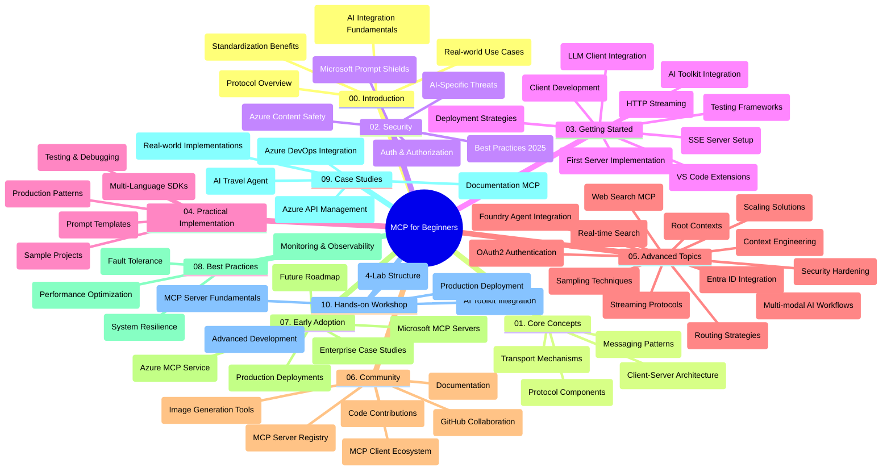

<!--
CO_OP_TRANSLATOR_METADATA:
{
  "original_hash": "e2c6ed897fa98fa08e0146101776c7ff",
  "translation_date": "2025-07-18T09:08:22+00:00",
  "source_file": "study_guide.md",
  "language_code": "es"
}
-->
# Protocolo de Contexto de Modelo (MCP) para Principiantes - Guía de Estudio

Esta guía de estudio ofrece una visión general de la estructura y contenido del repositorio para el currículo "Protocolo de Contexto de Modelo (MCP) para Principiantes". Usa esta guía para navegar el repositorio de manera eficiente y aprovechar al máximo los recursos disponibles.

## Resumen del Repositorio

El Protocolo de Contexto de Modelo (MCP) es un marco estandarizado para las interacciones entre modelos de IA y aplicaciones cliente. Inicialmente creado por Anthropic, MCP ahora es mantenido por la comunidad MCP a través de la organización oficial en GitHub. Este repositorio ofrece un currículo completo con ejemplos prácticos en C#, Java, JavaScript, Python y TypeScript, diseñado para desarrolladores de IA, arquitectos de sistemas e ingenieros de software.

## Mapa Visual del Currículo

## Estructura del Repositorio

El repositorio está organizado en diez secciones principales, cada una enfocada en diferentes aspectos del MCP:

1. **Introducción (00-Introduction/)**
   - Visión general del Protocolo de Contexto de Modelo
   - Por qué la estandarización es importante en las cadenas de IA
   - Casos prácticos y beneficios

2. **Conceptos Básicos (01-CoreConcepts/)**
   - Arquitectura cliente-servidor
   - Componentes clave del protocolo
   - Patrones de mensajería en MCP

3. **Seguridad (02-Security/)**
   - Amenazas de seguridad en sistemas basados en MCP
   - Mejores prácticas para asegurar implementaciones
   - Estrategias de autenticación y autorización
   - **Documentación Completa de Seguridad**:
     - MCP Security Best Practices 2025
     - Azure Content Safety Implementation Guide
     - MCP Security Controls and Techniques
     - MCP Best Practices Quick Reference
   - **Temas Clave de Seguridad**:
     - Ataques de inyección de prompt y envenenamiento de herramientas
     - Secuestro de sesión y problemas de delegado confundido
     - Vulnerabilidades de paso de tokens
     - Permisos excesivos y control de acceso
     - Seguridad en la cadena de suministro para componentes de IA
     - Integración con Microsoft Prompt Shields

4. **Primeros Pasos (03-GettingStarted/)**
   - Configuración y preparación del entorno
   - Creación de servidores y clientes MCP básicos
   - Integración con aplicaciones existentes
   - Incluye secciones para:
     - Primera implementación de servidor
     - Desarrollo de cliente
     - Integración de cliente LLM
     - Integración con VS Code
     - Servidor de Server-Sent Events (SSE)
     - Streaming HTTP
     - Integración con AI Toolkit
     - Estrategias de pruebas
     - Guías de despliegue

5. **Implementación Práctica (04-PracticalImplementation/)**
   - Uso de SDKs en diferentes lenguajes de programación
   - Técnicas de depuración, pruebas y validación
   - Creación de plantillas de prompt reutilizables y flujos de trabajo
   - Proyectos de ejemplo con casos de implementación

6. **Temas Avanzados (05-AdvancedTopics/)**
   - Técnicas de ingeniería de contexto
   - Integración con agentes Foundry
   - Flujos de trabajo multimodales de IA
   - Demos de autenticación OAuth2
   - Capacidades de búsqueda en tiempo real
   - Streaming en tiempo real
   - Implementación de contextos raíz
   - Estrategias de enrutamiento
   - Técnicas de muestreo
   - Enfoques de escalabilidad
   - Consideraciones de seguridad
   - Integración de seguridad Entra ID
   - Integración de búsqueda web

7. **Contribuciones de la Comunidad (06-CommunityContributions/)**
   - Cómo contribuir con código y documentación
   - Colaboración a través de GitHub
   - Mejoras y retroalimentación impulsadas por la comunidad
   - Uso de varios clientes MCP (Claude Desktop, Cline, VSCode)
   - Trabajo con servidores MCP populares, incluyendo generación de imágenes

8. **Lecciones de la Adopción Temprana (07-LessonsfromEarlyAdoption/)**
   - Implementaciones reales y casos de éxito
   - Construcción y despliegue de soluciones basadas en MCP
   - Tendencias y hoja de ruta futura
   - **Guía de Servidores MCP de Microsoft**: Guía completa de 10 servidores MCP de Microsoft listos para producción, incluyendo:
     - Microsoft Learn Docs MCP Server
     - Azure MCP Server (más de 15 conectores especializados)
     - GitHub MCP Server
     - Azure DevOps MCP Server
     - MarkItDown MCP Server
     - SQL Server MCP Server
     - Playwright MCP Server
     - Dev Box MCP Server
     - Azure AI Foundry MCP Server
     - Microsoft 365 Agents Toolkit MCP Server

9. **Mejores Prácticas (08-BestPractices/)**
   - Optimización y ajuste de rendimiento
   - Diseño de sistemas MCP tolerantes a fallos
   - Estrategias de pruebas y resiliencia

10. **Estudios de Caso (09-CaseStudy/)**
    - Ejemplo de integración con Azure API Management
    - Ejemplo de implementación para agencia de viajes
    - Integración de Azure DevOps con actualizaciones de YouTube
    - Ejemplos de implementación MCP con documentación detallada

11. **Taller Práctico (10-StreamliningAIWorkflowsBuildingAnMCPServerWithAIToolkit/)**
    - Taller práctico completo que combina MCP con AI Toolkit
    - Construcción de aplicaciones inteligentes que conectan modelos de IA con herramientas del mundo real
    - Módulos prácticos que cubren fundamentos, desarrollo de servidores personalizados y estrategias de despliegue en producción
    - **Estructura del Laboratorio**:
      - Laboratorio 1: Fundamentos del Servidor MCP
      - Laboratorio 2: Desarrollo Avanzado de Servidor MCP
      - Laboratorio 3: Integración con AI Toolkit
      - Laboratorio 4: Despliegue y Escalado en Producción
    - Aprendizaje basado en laboratorios con instrucciones paso a paso

## Recursos Adicionales

El repositorio incluye recursos complementarios:

- **Carpeta de imágenes**: Contiene diagramas e ilustraciones usadas a lo largo del currículo
- **Traducciones**: Soporte multilingüe con traducciones automáticas de la documentación
- **Recursos Oficiales MCP**:
  - [MCP Documentation](https://modelcontextprotocol.io/)
  - [MCP Specification](https://spec.modelcontextprotocol.io/)
  - [MCP GitHub Repository](https://github.com/modelcontextprotocol)

## Cómo Usar Este Repositorio

1. **Aprendizaje Secuencial**: Sigue los capítulos en orden (del 00 al 10) para una experiencia de aprendizaje estructurada.
2. **Enfoque por Lenguaje**: Si te interesa un lenguaje de programación específico, explora los directorios de ejemplos para implementaciones en tu lenguaje preferido.
3. **Implementación Práctica**: Comienza con la sección "Primeros Pasos" para configurar tu entorno y crear tu primer servidor y cliente MCP.
4. **Exploración Avanzada**: Una vez familiarizado con lo básico, profundiza en los temas avanzados para ampliar tus conocimientos.
5. **Participación Comunitaria**: Únete a la comunidad MCP a través de discusiones en GitHub y canales de Discord para conectar con expertos y otros desarrolladores.

## Clientes y Herramientas MCP

El currículo cubre varios clientes y herramientas MCP:

1. **Clientes Oficiales**:
   - Visual Studio Code
   - MCP en Visual Studio Code
   - Claude Desktop
   - Claude en VSCode
   - Claude API

2. **Clientes de la Comunidad**:
   - Cline (basado en terminal)
   - Cursor (editor de código)
   - ChatMCP
   - Windsurf

3. **Herramientas de Gestión MCP**:
   - MCP CLI
   - MCP Manager
   - MCP Linker
   - MCP Router

## Servidores MCP Populares

El repositorio presenta varios servidores MCP, incluyendo:

1. **Servidores MCP Oficiales de Microsoft**:
   - Microsoft Learn Docs MCP Server
   - Azure MCP Server (más de 15 conectores especializados)
   - GitHub MCP Server
   - Azure DevOps MCP Server
   - MarkItDown MCP Server
   - SQL Server MCP Server
   - Playwright MCP Server
   - Dev Box MCP Server
   - Azure AI Foundry MCP Server
   - Microsoft 365 Agents Toolkit MCP Server

2. **Servidores de Referencia Oficiales**:
   - Filesystem
   - Fetch
   - Memory
   - Sequential Thinking

3. **Generación de Imágenes**:
   - Azure OpenAI DALL-E 3
   - Stable Diffusion WebUI
   - Replicate

4. **Herramientas de Desarrollo**:
   - Git MCP
   - Terminal Control
   - Code Assistant

5. **Servidores Especializados**:
   - Salesforce
   - Microsoft Teams
   - Jira & Confluence

## Contribuciones

Este repositorio da la bienvenida a contribuciones de la comunidad. Consulta la sección de Contribuciones de la Comunidad para obtener orientación sobre cómo contribuir eficazmente al ecosistema MCP.

## Registro de Cambios

| Fecha | Cambios |
|-------|---------|
| 18 de julio de 2025 | - Actualizada la estructura del repositorio para incluir la Guía de Servidores MCP de Microsoft - Añadida lista completa de 10 servidores MCP de Microsoft listos para producción - Mejorada la sección de Servidores MCP Populares con Servidores Oficiales de Microsoft - Actualizada la sección de Estudios de Caso con ejemplos reales de archivos - Añadidos detalles de la Estructura del Laboratorio para el Taller Práctico |
| 16 de julio de 2025 | - Actualizada la estructura del repositorio para reflejar el contenido actual - Añadida sección de Clientes y Herramientas MCP - Añadida sección de Servidores MCP Populares - Actualizado el Mapa Visual del Currículo con todos los temas actuales - Mejorada la sección de Temas Avanzados con todas las áreas especializadas - Actualizados los Estudios de Caso para reflejar ejemplos reales - Aclarado el origen de MCP como creado por Anthropic |
| 11 de junio de 2025 | - Creación inicial de la guía de estudio - Añadido Mapa Visual del Currículo - Esbozada la estructura del repositorio - Incluidos proyectos de ejemplo y recursos adicionales |

---

*Esta guía de estudio fue actualizada el 18 de julio de 2025 y ofrece una visión general del repositorio hasta esa fecha. El contenido del repositorio puede actualizarse después de esta fecha.*

**Aviso legal**:  
Este documento ha sido traducido utilizando el servicio de traducción automática [Co-op Translator](https://github.com/Azure/co-op-translator). Aunque nos esforzamos por la precisión, tenga en cuenta que las traducciones automáticas pueden contener errores o inexactitudes. El documento original en su idioma nativo debe considerarse la fuente autorizada. Para información crítica, se recomienda la traducción profesional realizada por humanos. No nos hacemos responsables de malentendidos o interpretaciones erróneas derivadas del uso de esta traducción.