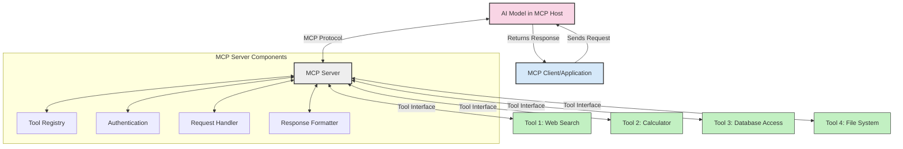
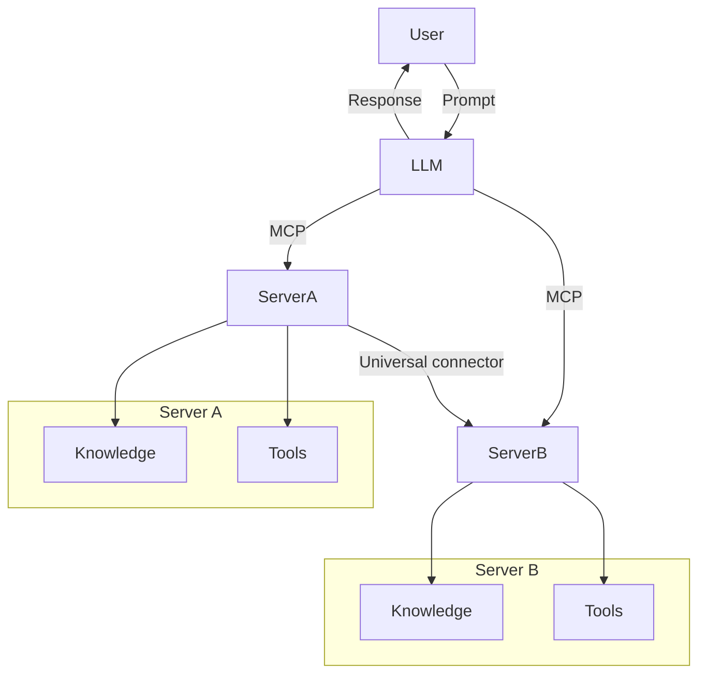
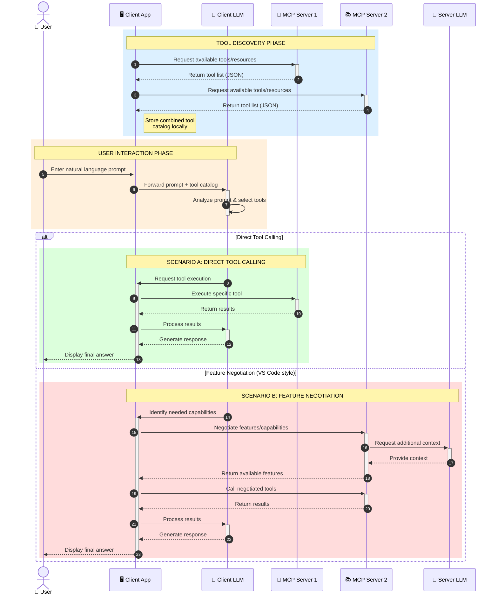

<!--
CO_OP_TRANSLATOR_METADATA:
{
  "original_hash": "25a94c681cf43612ff394d8cf78a74de",
  "translation_date": "2025-05-27T15:55:39+00:00",
  "source_file": "00-Introduction/README.md",
  "language_code": "fa"
}
-->
# مقدمه‌ای بر پروتکل زمینه مدل (MCP): چرا برای برنامه‌های هوش مصنوعی مقیاس‌پذیر اهمیت دارد

برنامه‌های هوش مصنوعی مولد گامی بزرگ به جلو هستند چون اغلب به کاربر اجازه می‌دهند با استفاده از دستورات زبان طبیعی با برنامه تعامل داشته باشد. با این حال، هر چه زمان و منابع بیشتری در چنین برنامه‌هایی سرمایه‌گذاری شود، می‌خواهید مطمئن شوید که می‌توانید قابلیت‌ها و منابع را به گونه‌ای به هم متصل کنید که توسعه آن آسان باشد، برنامه شما بتواند از بیش از یک مدل استفاده کند و پیچیدگی‌های مختلف مدل‌ها را مدیریت کند. به طور خلاصه، ساخت برنامه‌های هوش مصنوعی مولد در ابتدا آسان است، اما با رشد و پیچیده‌تر شدن آن‌ها، نیاز به تعریف معماری و احتمالاً اتکا به یک استاندارد برای اطمینان از ساخت برنامه‌ها به صورت منسجم دارید. اینجاست که MCP وارد می‌شود تا امور را سازماندهی کرده و یک استاندارد ارائه دهد.

---

## **🔍 پروتکل زمینه مدل (MCP) چیست؟**

**پروتکل زمینه مدل (MCP)** یک **رابط باز و استاندارد شده** است که به مدل‌های زبان بزرگ (LLM) اجازه می‌دهد به طور یکپارچه با ابزارها، APIها و منابع داده خارجی تعامل داشته باشند. این پروتکل معماری ثابتی فراهم می‌کند تا عملکرد مدل‌های هوش مصنوعی فراتر از داده‌های آموزشی آن‌ها افزایش یابد و سیستم‌های هوشمندتر، مقیاس‌پذیرتر و پاسخگوتر ایجاد شود.

---

## **🎯 چرا استانداردسازی در هوش مصنوعی اهمیت دارد**

با پیچیده‌تر شدن برنامه‌های هوش مصنوعی مولد، ضروری است استانداردهایی پذیرفته شوند که **مقیاس‌پذیری، توسعه‌پذیری** و **قابلیت نگهداری** را تضمین کنند. MCP این نیازها را با موارد زیر برطرف می‌کند:

- یکپارچه‌سازی مدل‌ها با ابزارها
- کاهش راه‌حل‌های شکننده و سفارشی یک‌بار مصرف
- امکان coexistence چند مدل در یک اکوسیستم واحد

---

## **📚 اهداف آموزشی**

تا پایان این مقاله، شما قادر خواهید بود:

- تعریف پروتکل زمینه مدل (MCP) و موارد کاربرد آن  
- درک چگونگی استانداردسازی ارتباط مدل با ابزار توسط MCP  
- شناسایی اجزای اصلی معماری MCP  
- بررسی کاربردهای واقعی MCP در زمینه‌های سازمانی و توسعه

---

## **💡 چرا پروتکل زمینه مدل (MCP) تحول‌آفرین است**

### **🔗 MCP مشکل تکه‌تکه بودن تعاملات در هوش مصنوعی را حل می‌کند**

قبل از MCP، اتصال مدل‌ها به ابزارها نیازمند بود:

- کد سفارشی برای هر جفت مدل-ابزار  
- APIهای غیر استاندارد برای هر فروشنده  
- وقفه‌های مکرر به دلیل به‌روزرسانی‌ها  
- مقیاس‌پذیری ضعیف با افزایش تعداد ابزارها

### **✅ مزایای استانداردسازی MCP**

| **مزیت**                 | **توضیح**                                                                       |
|--------------------------|---------------------------------------------------------------------------------|
| قابلیت همکاری            | مدل‌های زبان بزرگ به طور یکپارچه با ابزارهای مختلف از فروشندگان گوناگون کار می‌کنند |
| ثبات                     | رفتار یکنواخت در سراسر پلتفرم‌ها و ابزارها                                    |
| قابلیت استفاده مجدد     | ابزارهایی که یک بار ساخته شده‌اند، در پروژه‌ها و سیستم‌های مختلف قابل استفاده‌اند |
| توسعه سریع‌تر            | کاهش زمان توسعه با استفاده از رابط‌های استاندارد و آماده استفاده             |

---

## **🧱 نمای کلی معماری سطح بالا MCP**

MCP از مدل **کلاینت-سرور** پیروی می‌کند، که در آن:

- **میزبان‌های MCP** مدل‌های هوش مصنوعی را اجرا می‌کنند  
- **کلاینت‌های MCP** درخواست‌ها را آغاز می‌کنند  
- **سرورهای MCP** زمینه، ابزارها و قابلیت‌ها را ارائه می‌دهند

### **اجزای کلیدی:**

- **Resources** – داده‌های ثابت یا پویا برای مدل‌ها  
- **Prompts** – جریان‌های کاری از پیش تعریف شده برای تولید هدایت شده  
- **Tools** – توابع اجرایی مانند جستجو، محاسبات  
- **Sampling** – رفتار عاملی از طریق تعاملات بازگشتی

---

## نحوه عملکرد سرورهای MCP

سرورهای MCP به این صورت کار می‌کنند:

- **روند درخواست**:  
    ۱. کلاینت MCP درخواست را به مدل هوش مصنوعی در یک میزبان MCP ارسال می‌کند.  
    ۲. مدل هوش مصنوعی تشخیص می‌دهد که به ابزارها یا داده‌های خارجی نیاز دارد.  
    ۳. مدل با استفاده از پروتکل استاندارد با سرور MCP ارتباط برقرار می‌کند.

- **عملکرد سرور MCP**:  
    - فهرست ابزارها: نگهداری فهرستی از ابزارهای موجود و قابلیت‌های آن‌ها  
    - احراز هویت: تأیید مجوزهای دسترسی به ابزارها  
    - پردازش درخواست: مدیریت درخواست‌های ابزار ورودی از مدل  
    - قالب‌بندی پاسخ: ساختاردهی خروجی ابزارها به فرمتی که مدل بتواند بفهمد

- **اجرای ابزار**:  
    - سرور درخواست‌ها را به ابزارهای خارجی مناسب هدایت می‌کند  
    - ابزارها عملکرد تخصصی خود (جستجو، محاسبه، پرس‌وجوی پایگاه داده و غیره) را اجرا می‌کنند  
    - نتایج به صورت قالبی یکنواخت به مدل بازگردانده می‌شوند

- **تکمیل پاسخ**:  
    - مدل هوش مصنوعی خروجی ابزارها را در پاسخ خود وارد می‌کند  
    - پاسخ نهایی به برنامه کلاینت ارسال می‌شود

## 👨‍💻 چگونه یک سرور MCP بسازیم (با مثال‌ها)

سرورهای MCP به شما امکان می‌دهند قابلیت‌های LLM را با ارائه داده و عملکرد گسترش دهید.

آماده‌اید امتحان کنید؟ در اینجا نمونه‌هایی از ایجاد یک سرور ساده MCP در زبان‌های مختلف آورده شده است:

- **مثال Python**: https://github.com/modelcontextprotocol/python-sdk

- **مثال TypeScript**: https://github.com/modelcontextprotocol/typescript-sdk

- **مثال Java**: https://github.com/modelcontextprotocol/java-sdk

- **مثال C#/.NET**: https://github.com/modelcontextprotocol/csharp-sdk

## 🌍 موارد کاربرد واقعی MCP

MCP طیف گسترده‌ای از برنامه‌ها را با گسترش قابلیت‌های هوش مصنوعی ممکن می‌سازد:

| **کاربرد**                  | **توضیح**                                                                      |
|-----------------------------|--------------------------------------------------------------------------------|
| یکپارچه‌سازی داده‌های سازمانی | اتصال LLMها به پایگاه‌های داده، CRMها یا ابزارهای داخلی                       |
| سیستم‌های هوش مصنوعی عاملی  | فعال‌سازی عامل‌های خودمختار با دسترسی به ابزارها و جریان‌های تصمیم‌گیری      |
| برنامه‌های چندرسانه‌ای      | ترکیب ابزارهای متن، تصویر و صدا در یک برنامه هوش مصنوعی یکپارچه               |
| یکپارچه‌سازی داده‌های بلادرنگ | وارد کردن داده‌های زنده در تعاملات هوش مصنوعی برای خروجی‌های دقیق‌تر و به‌روز  |

### 🧠 MCP = استاندارد جهانی برای تعاملات هوش مصنوعی

پروتکل زمینه مدل (MCP) مانند استاندارد USB-C برای اتصال فیزیکی دستگاه‌ها، به عنوان یک استاندارد جهانی برای تعاملات هوش مصنوعی عمل می‌کند. در دنیای هوش مصنوعی، MCP یک رابط ثابت فراهم می‌کند که به مدل‌ها (کلاینت‌ها) اجازه می‌دهد به طور یکپارچه با ابزارها و ارائه‌دهندگان داده خارجی (سرورها) ارتباط برقرار کنند. این نیاز به پروتکل‌های متنوع و سفارشی برای هر API یا منبع داده را از بین می‌برد.

در MCP، ابزاری که با MCP سازگار است (که به عنوان سرور MCP شناخته می‌شود) از یک استاندارد واحد پیروی می‌کند. این سرورها می‌توانند ابزارها یا عملکردهای ارائه شده را فهرست کنند و در صورت درخواست عامل هوش مصنوعی آن‌ها را اجرا نمایند. پلتفرم‌های عامل هوش مصنوعی که MCP را پشتیبانی می‌کنند قادر به کشف ابزارهای موجود از سرورها و فراخوانی آن‌ها از طریق این پروتکل استاندارد هستند.

### 💡 تسهیل دسترسی به دانش

علاوه بر ارائه ابزارها، MCP دسترسی به دانش را نیز تسهیل می‌کند. این پروتکل به برنامه‌ها امکان می‌دهد زمینه‌ای به مدل‌های زبان بزرگ ارائه دهند با اتصال آن‌ها به منابع داده مختلف. برای مثال، یک سرور MCP ممکن است مخزن اسناد یک شرکت را نمایندگی کند و به عامل‌ها اجازه دهد در صورت نیاز اطلاعات مرتبط را بازیابی کنند. سرور دیگری می‌تواند عملکردهای خاصی مانند ارسال ایمیل یا به‌روزرسانی سوابق را انجام دهد. از دیدگاه عامل، این‌ها صرفاً ابزارهایی هستند که می‌تواند استفاده کند—برخی ابزارها داده (زمینه دانش) بازمی‌گردانند، در حالی که برخی دیگر عملیات انجام می‌دهند. MCP هر دو را به طور مؤثر مدیریت می‌کند.

یک عامل که به یک سرور MCP متصل می‌شود به طور خودکار قابلیت‌ها و داده‌های قابل دسترسی سرور را از طریق قالبی استاندارد می‌آموزد. این استانداردسازی امکان دسترسی پویا به ابزارها را فراهم می‌کند. برای مثال، افزودن یک سرور MCP جدید به سیستم عامل باعث می‌شود عملکردهای آن فوراً قابل استفاده شوند بدون نیاز به سفارشی‌سازی بیشتر دستورالعمل‌های عامل.

این یکپارچه‌سازی روان با جریان نشان داده شده در نمودار mermaid هماهنگ است، جایی که سرورها هم ابزارها و هم دانش را فراهم می‌کنند و همکاری بی‌وقفه بین سیستم‌ها را تضمین می‌کنند.

### 👉 مثال: راه‌حل عامل مقیاس‌پذیر

### 🔄 سناریوهای پیشرفته MCP با ادغام LLM در سمت کلاینت

فراتر از معماری پایه MCP، سناریوهای پیشرفته‌ای وجود دارد که در آن‌ها هم کلاینت و هم سرور حاوی LLM هستند و امکان تعاملات پیچیده‌تر فراهم می‌شود:

## 🔐 مزایای عملی MCP

در اینجا مزایای عملی استفاده از MCP آمده است:

- **به‌روزبودن**: مدل‌ها می‌توانند به اطلاعات به‌روز فراتر از داده‌های آموزشی دسترسی داشته باشند  
- **گسترش قابلیت‌ها**: مدل‌ها می‌توانند از ابزارهای تخصصی برای وظایفی که آموزش ندیده‌اند استفاده کنند  
- **کاهش توهمات**: منابع داده خارجی پایه‌های واقعی فراهم می‌کنند  
- **حریم خصوصی**: داده‌های حساس می‌توانند در محیط‌های امن باقی بمانند به جای آنکه در دستورات جای‌گذاری شوند

## 📌 نکات کلیدی

نکات کلیدی برای استفاده از MCP عبارتند از:

- **MCP** استانداردسازی نحوه تعامل مدل‌های هوش مصنوعی با ابزارها و داده‌ها را فراهم می‌کند  
- ترویج **گسترش‌پذیری، ثبات و قابلیت همکاری**  
- MCP کمک می‌کند تا **زمان توسعه کاهش یافته، قابلیت اطمینان افزایش یافته و قابلیت‌های مدل توسعه یابد**  
- معماری کلاینت-سرور **امکان برنامه‌های هوش مصنوعی انعطاف‌پذیر و توسعه‌پذیر را فراهم می‌کند**

## 🧠 تمرین

به برنامه هوش مصنوعی که می‌خواهید بسازید فکر کنید.

- کدام **ابزارها یا داده‌های خارجی** می‌توانند قابلیت‌های آن را بهبود بخشند؟  
- MCP چگونه می‌تواند یکپارچه‌سازی را **ساده‌تر و قابل اعتمادتر** کند؟

## منابع اضافی

- [مخزن GitHub MCP](https://github.com/modelcontextprotocol)

## مرحله بعد

بعدی: [فصل ۱: مفاهیم اصلی](/01-CoreConcepts/README.md)

**سلب مسئولیت**:  
این سند با استفاده از سرویس ترجمه هوش مصنوعی [Co-op Translator](https://github.com/Azure/co-op-translator) ترجمه شده است. در حالی که ما در تلاش برای دقت هستیم، لطفاً توجه داشته باشید که ترجمه‌های خودکار ممکن است حاوی خطاها یا نادرستی‌هایی باشند. سند اصلی به زبان بومی خود باید به عنوان منبع معتبر در نظر گرفته شود. برای اطلاعات حیاتی، ترجمه حرفه‌ای انسانی توصیه می‌شود. ما مسئول هیچ گونه سوءتفاهم یا تفسیر نادرستی که ناشی از استفاده از این ترجمه باشد، نیستیم.