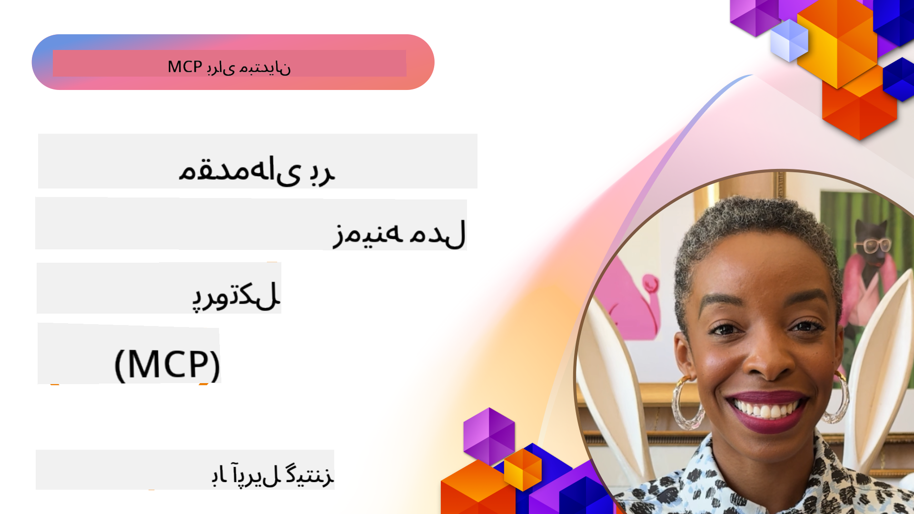
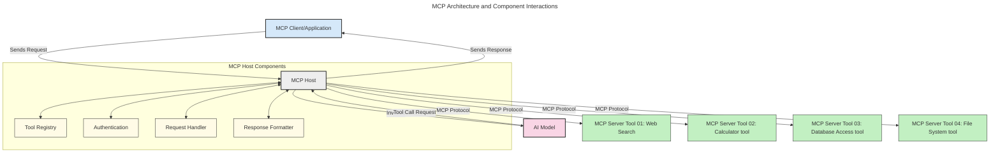
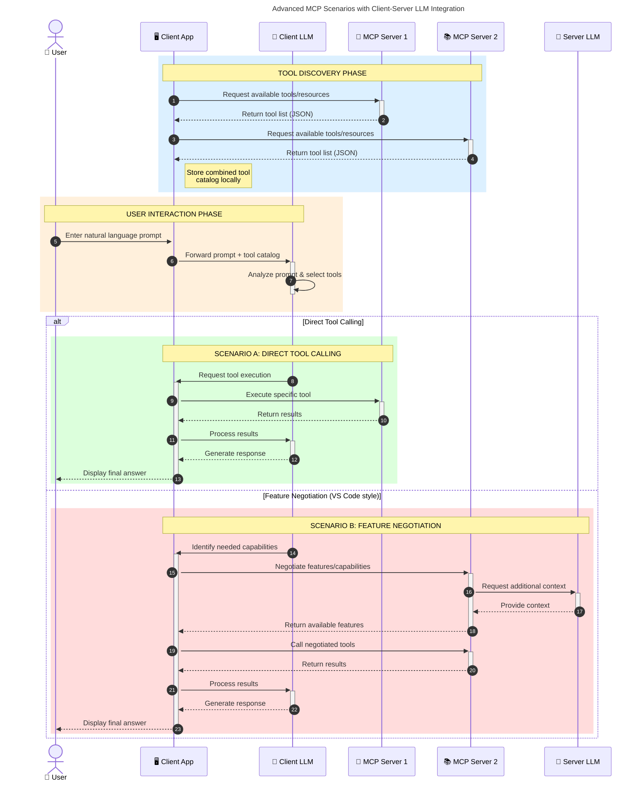

<!--
CO_OP_TRANSLATOR_METADATA:
{
  "original_hash": "0df1ee78a6dd8300f3a040ca5b411c2e",
  "translation_date": "2025-08-12T08:08:24+00:00",
  "source_file": "00-Introduction/README.md",
  "language_code": "fa"
}
-->
# مقدمه‌ای بر پروتکل زمینه مدل (MCP): چرا برای برنامه‌های مقیاس‌پذیر هوش مصنوعی اهمیت دارد

_(برای مشاهده ویدئوی این درس روی تصویر بالا کلیک کنید)_

برنامه‌های هوش مصنوعی مولد یک گام بزرگ به جلو هستند، زیرا اغلب به کاربران اجازه می‌دهند با استفاده از دستورات زبان طبیعی با برنامه تعامل داشته باشند. با این حال، هرچه زمان و منابع بیشتری در این برنامه‌ها سرمایه‌گذاری شود، باید مطمئن شوید که می‌توانید قابلیت‌ها و منابع را به گونه‌ای ادغام کنید که گسترش آن‌ها آسان باشد، برنامه شما بتواند بیش از یک مدل را پشتیبانی کند و پیچیدگی‌های مختلف مدل‌ها را مدیریت کند. به طور خلاصه، ساخت برنامه‌های هوش مصنوعی مولد در ابتدا آسان است، اما با رشد و پیچیده‌تر شدن آن‌ها، نیاز به تعریف یک معماری خواهید داشت و احتمالاً باید به یک استاندارد تکیه کنید تا اطمینان حاصل شود که برنامه‌هایتان به صورت یکپارچه ساخته می‌شوند. اینجاست که MCP وارد عمل می‌شود تا همه چیز را سازماندهی کرده و یک استاندارد ارائه دهد.

---

## **🔍 پروتکل زمینه مدل (MCP) چیست؟**

**پروتکل زمینه مدل (MCP)** یک **رابط باز و استاندارد شده** است که به مدل‌های زبانی بزرگ (LLM) اجازه می‌دهد به طور یکپارچه با ابزارها، APIها و منابع داده خارجی تعامل داشته باشند. این پروتکل یک معماری سازگار ارائه می‌دهد تا عملکرد مدل‌های هوش مصنوعی را فراتر از داده‌های آموزشی آن‌ها افزایش دهد و سیستم‌های هوش مصنوعی هوشمندتر، مقیاس‌پذیرتر و پاسخگوتر ایجاد کند.

---

## **🎯 چرا استانداردسازی در هوش مصنوعی اهمیت دارد**

با پیچیده‌تر شدن برنامه‌های هوش مصنوعی مولد، ضروری است که استانداردهایی اتخاذ شوند که **مقیاس‌پذیری، گسترش‌پذیری، نگهداری‌پذیری** و **اجتناب از قفل شدن به یک فروشنده خاص** را تضمین کنند. MCP این نیازها را با:

- یکپارچه‌سازی مدل‌ها و ابزارها  
- کاهش راه‌حل‌های سفارشی و شکننده  
- امکان همزیستی چندین مدل از فروشندگان مختلف در یک اکوسیستم  

**توجه:** اگرچه MCP خود را به عنوان یک استاندارد باز معرفی می‌کند، هیچ برنامه‌ای برای استانداردسازی MCP از طریق نهادهای استاندارد موجود مانند IEEE، IETF، W3C، ISO یا سایر نهادهای استاندارد وجود ندارد.

---

## **📚 اهداف آموزشی**

در پایان این مقاله، شما قادر خواهید بود:

- **پروتکل زمینه مدل (MCP)** و موارد استفاده آن را تعریف کنید  
- درک کنید که چگونه MCP ارتباط بین مدل‌ها و ابزارها را استاندارد می‌کند  
- اجزای اصلی معماری MCP را شناسایی کنید  
- کاربردهای واقعی MCP در زمینه‌های سازمانی و توسعه را بررسی کنید  

---

## **💡 چرا پروتکل زمینه مدل (MCP) یک تحول‌آفرین است**

### **🔗 MCP مشکل پراکندگی در تعاملات هوش مصنوعی را حل می‌کند**

پیش از MCP، ادغام مدل‌ها با ابزارها نیازمند:

- کدنویسی سفارشی برای هر جفت ابزار-مدل  
- APIهای غیر استاندارد برای هر فروشنده  
- خرابی‌های مکرر به دلیل به‌روزرسانی‌ها  
- مقیاس‌پذیری ضعیف با افزایش تعداد ابزارها  

### **✅ مزایای استانداردسازی MCP**

| **مزیت**                  | **توضیح**                                                                      |
|---------------------------|--------------------------------------------------------------------------------|
| تعامل‌پذیری               | مدل‌های زبانی بزرگ به طور یکپارچه با ابزارهای فروشندگان مختلف کار می‌کنند       |
| سازگاری                  | رفتار یکنواخت در پلتفرم‌ها و ابزارها                                           |
| قابلیت استفاده مجدد       | ابزارهایی که یک بار ساخته می‌شوند، می‌توانند در پروژه‌ها و سیستم‌های مختلف استفاده شوند |
| توسعه سریع‌تر             | کاهش زمان توسعه با استفاده از رابط‌های استاندارد و آماده به کار              |

---

## **🧱 نمای کلی معماری سطح بالا MCP**

MCP از یک **مدل کلاینت-سرور** پیروی می‌کند، که در آن:

- **میزبان‌های MCP** مدل‌های هوش مصنوعی را اجرا می‌کنند  
- **کلاینت‌های MCP** درخواست‌ها را آغاز می‌کنند  
- **سرورهای MCP** زمینه، ابزارها و قابلیت‌ها را ارائه می‌دهند  

### **اجزای کلیدی:**

- **منابع** – داده‌های ایستا یا پویا برای مدل‌ها  
- **دستورات** – جریان‌های کاری از پیش تعریف‌شده برای تولید هدایت‌شده  
- **ابزارها** – توابع اجرایی مانند جستجو، محاسبات  
- **نمونه‌گیری** – رفتار عامل‌محور از طریق تعاملات بازگشتی  

---

## نحوه کار سرورهای MCP

سرورهای MCP به این صورت عمل می‌کنند:

- **جریان درخواست**:  
    1. یک درخواست توسط کاربر نهایی یا نرم‌افزاری که از طرف او عمل می‌کند، آغاز می‌شود.  
    2. **کلاینت MCP** درخواست را به **میزبان MCP** ارسال می‌کند، که زمان اجرای مدل هوش مصنوعی را مدیریت می‌کند.  
    3. **مدل هوش مصنوعی** درخواست کاربر را دریافت می‌کند و ممکن است برای دسترسی به ابزارها یا داده‌های خارجی درخواست دهد.  
    4. **میزبان MCP**، نه مدل به طور مستقیم، با **سرورهای MCP** مناسب از طریق پروتکل استاندارد ارتباط برقرار می‌کند.  
- **عملکرد میزبان MCP**:  
    - **ثبت ابزار**: فهرستی از ابزارهای موجود و قابلیت‌های آن‌ها را نگهداری می‌کند.  
    - **احراز هویت**: مجوزهای دسترسی به ابزارها را تأیید می‌کند.  
    - **مدیریت درخواست**: درخواست‌های ابزار ورودی از مدل را پردازش می‌کند.  
    - **فرمت‌دهنده پاسخ**: خروجی ابزارها را در قالبی که مدل بتواند درک کند، ساختاردهی می‌کند.  
- **اجرای سرور MCP**:  
    - **میزبان MCP** درخواست‌های ابزار را به یک یا چند **سرور MCP** هدایت می‌کند که توابع تخصصی (مانند جستجو، محاسبات، پرس‌وجوهای پایگاه داده) را ارائه می‌دهند.  
    - **سرورهای MCP** عملیات مربوطه را انجام داده و نتایج را در قالبی سازگار به **میزبان MCP** بازمی‌گردانند.  
    - **میزبان MCP** این نتایج را فرمت‌دهی کرده و به **مدل هوش مصنوعی** منتقل می‌کند.  
- **تکمیل پاسخ**:  
    - **مدل هوش مصنوعی** خروجی ابزارها را در یک پاسخ نهایی ادغام می‌کند.  
    - **میزبان MCP** این پاسخ را به **کلاینت MCP** ارسال می‌کند، که آن را به کاربر نهایی یا نرم‌افزار فراخواننده تحویل می‌دهد.  

## 👨‍💻 چگونه یک سرور MCP بسازیم (با مثال‌ها)

سرورهای MCP به شما امکان می‌دهند قابلیت‌های مدل‌های زبانی بزرگ را با ارائه داده‌ها و عملکرد گسترش دهید.

آماده امتحان کردن هستید؟ در اینجا SDKهای زبان یا پشته خاص با مثال‌هایی از ایجاد سرورهای ساده MCP در زبان‌ها/پشته‌های مختلف آورده شده است:

- **Python SDK**: https://github.com/modelcontextprotocol/python-sdk  
- **TypeScript SDK**: https://github.com/modelcontextprotocol/typescript-sdk  
- **Java SDK**: https://github.com/modelcontextprotocol/java-sdk  
- **C#/.NET SDK**: https://github.com/modelcontextprotocol/csharp-sdk  

---

## 🌍 موارد استفاده واقعی از MCP

MCP طیف گسترده‌ای از برنامه‌ها را با گسترش قابلیت‌های هوش مصنوعی امکان‌پذیر می‌کند:

| **کاربرد**                 | **توضیح**                                                                      |
|----------------------------|--------------------------------------------------------------------------------|
| یکپارچه‌سازی داده‌های سازمانی | اتصال مدل‌های زبانی بزرگ به پایگاه‌های داده، CRMها یا ابزارهای داخلی            |
| سیستم‌های هوش مصنوعی عامل‌محور | فعال‌سازی عوامل خودمختار با دسترسی به ابزارها و جریان‌های کاری تصمیم‌گیری       |
| برنامه‌های چندوجهی          | ترکیب ابزارهای متنی، تصویری و صوتی در یک برنامه هوش مصنوعی یکپارچه             |
| یکپارچه‌سازی داده‌های بلادرنگ | آوردن داده‌های زنده به تعاملات هوش مصنوعی برای خروجی‌های دقیق‌تر و به‌روزتر      |

---

### 🧠 MCP = استاندارد جهانی برای تعاملات هوش مصنوعی

پروتکل زمینه مدل (MCP) به عنوان یک استاندارد جهانی برای تعاملات هوش مصنوعی عمل می‌کند، مشابه نحوه استانداردسازی USB-C برای اتصالات فیزیکی دستگاه‌ها. در دنیای هوش مصنوعی، MCP یک رابط سازگار ارائه می‌دهد که به مدل‌ها (کلاینت‌ها) اجازه می‌دهد به طور یکپارچه با ابزارها و ارائه‌دهندگان داده خارجی (سرورها) ادغام شوند. این امر نیاز به پروتکل‌های متنوع و سفارشی برای هر API یا منبع داده را از بین می‌برد.

---

### 💡 تسهیل دسترسی به دانش

فراتر از ارائه ابزارها، MCP دسترسی به دانش را نیز تسهیل می‌کند. این پروتکل به برنامه‌ها اجازه می‌دهد زمینه را به مدل‌های زبانی بزرگ (LLM) ارائه دهند، با اتصال آن‌ها به منابع داده مختلف. برای مثال، یک سرور MCP ممکن است مخزن اسناد یک شرکت را نمایندگی کند و به عوامل اجازه دهد اطلاعات مرتبط را در صورت نیاز بازیابی کنند. سرور دیگری می‌تواند اقدامات خاصی مانند ارسال ایمیل یا به‌روزرسانی سوابق را مدیریت کند. از دیدگاه عامل، این‌ها صرفاً ابزارهایی هستند که می‌تواند استفاده کند—برخی ابزارها داده (زمینه دانش) بازمی‌گردانند، در حالی که برخی دیگر اقدامات را انجام می‌دهند. MCP هر دو را به طور کارآمد مدیریت می‌کند.

---

### 🔄 سناریوهای پیشرفته MCP با ادغام LLM در سمت کلاینت

فراتر از معماری پایه MCP، سناریوهای پیشرفته‌ای وجود دارد که در آن هم کلاینت و هم سرور شامل مدل‌های زبانی بزرگ (LLM) هستند و تعاملات پیچیده‌تری را امکان‌پذیر می‌کنند. در نمودار زیر، **برنامه کلاینت** می‌تواند یک IDE باشد که تعدادی ابزار MCP برای استفاده توسط LLM در دسترس دارد:

---

## 🔐 مزایای عملی MCP

در اینجا مزایای عملی استفاده از MCP آورده شده است:

- **به‌روز بودن**: مدل‌ها می‌توانند به اطلاعات به‌روز فراتر از داده‌های آموزشی خود دسترسی داشته باشند  
- **گسترش قابلیت‌ها**: مدل‌ها می‌توانند از ابزارهای تخصصی برای وظایفی که برای آن‌ها آموزش ندیده‌اند استفاده کنند  
- **کاهش توهمات**: منابع داده خارجی زمینه واقعی ارائه می‌دهند  
- **حریم خصوصی**: داده‌های حساس می‌توانند در محیط‌های امن باقی بمانند و در دستورات جاسازی نشوند  

---

## 📌 نکات کلیدی

نکات کلیدی استفاده از MCP عبارتند از:

- **MCP** نحوه تعامل مدل‌های هوش مصنوعی با ابزارها و داده‌ها را استاندارد می‌کند  
- **گسترش‌پذیری، سازگاری و تعامل‌پذیری** را ترویج می‌دهد  
- MCP به **کاهش زمان توسعه، بهبود قابلیت اطمینان و گسترش قابلیت‌های مدل** کمک می‌کند  
- معماری کلاینت-سرور **برنامه‌های هوش مصنوعی انعطاف‌پذیر و گسترش‌پذیر** را امکان‌پذیر می‌کند  

---

## 🧠 تمرین

به یک برنامه هوش مصنوعی که به ساخت آن علاقه دارید فکر کنید.

- کدام **ابزارها یا داده‌های خارجی** می‌توانند قابلیت‌های آن را افزایش دهند؟  
- MCP چگونه می‌تواند ادغام را **ساده‌تر و قابل اطمینان‌تر** کند؟  

---

## منابع اضافی

- [مخزن GitHub MCP](https://github.com/modelcontextprotocol)

---

## مرحله بعد

بعدی: [فصل ۱: مفاهیم اصلی](../01-CoreConcepts/README.md)  

**سلب مسئولیت**:  
این سند با استفاده از سرویس ترجمه هوش مصنوعی [Co-op Translator](https://github.com/Azure/co-op-translator) ترجمه شده است. در حالی که ما تلاش می‌کنیم دقت را حفظ کنیم، لطفاً توجه داشته باشید که ترجمه‌های خودکار ممکن است شامل خطاها یا نادرستی‌ها باشند. سند اصلی به زبان اصلی آن باید به عنوان منبع معتبر در نظر گرفته شود. برای اطلاعات حساس، توصیه می‌شود از ترجمه حرفه‌ای انسانی استفاده کنید. ما مسئولیتی در قبال سوء تفاهم‌ها یا تفسیرهای نادرست ناشی از استفاده از این ترجمه نداریم.