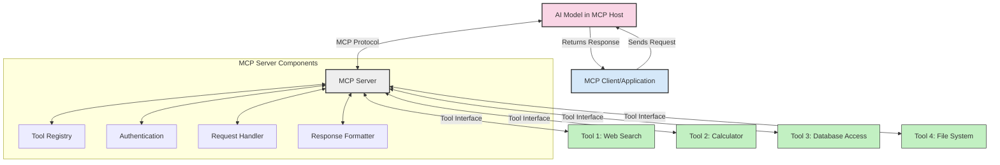
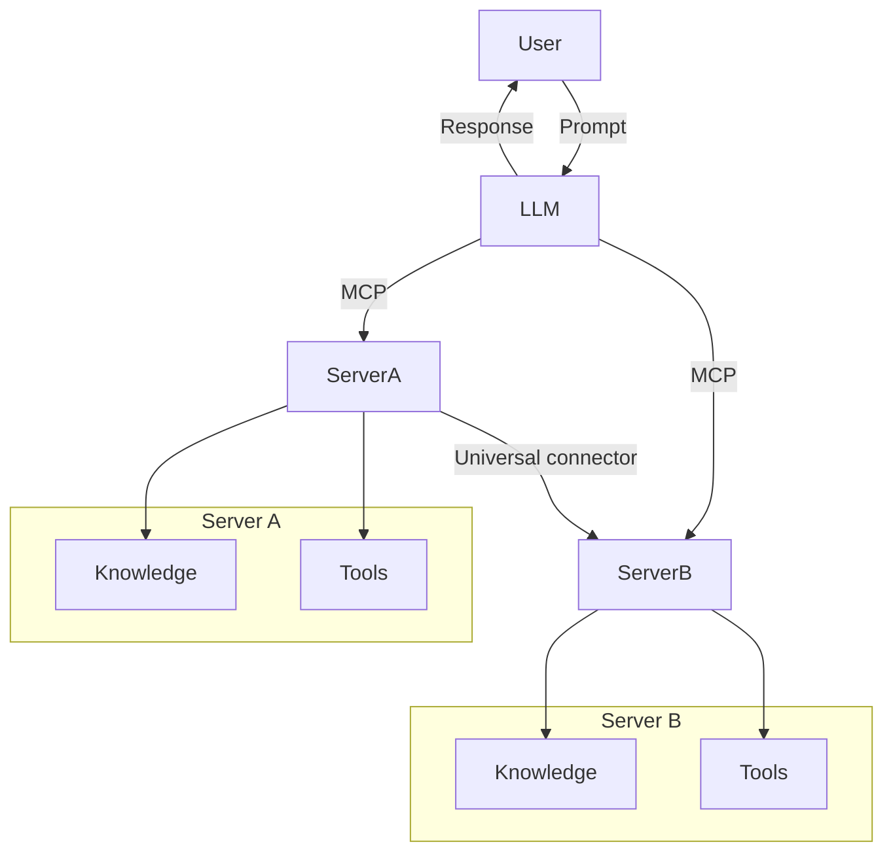

<!--
CO_OP_TRANSLATOR_METADATA:
{
  "original_hash": "cf84f987e1b771d2201408e110dfd2db",
  "translation_date": "2025-05-20T15:50:08+00:00",
  "source_file": "00-Introduction/README.md",
  "language_code": "fa"
}
-->
# معرفی پروتکل مدل کانتکست (MCP): چرا برای برنامه‌های هوش مصنوعی مقیاس‌پذیر اهمیت دارد

برنامه‌های هوش مصنوعی مولد گامی بزرگ به جلو هستند چون اغلب به کاربر اجازه می‌دهند با استفاده از دستورات زبان طبیعی با برنامه تعامل داشته باشد. با این حال، هرچه زمان و منابع بیشتری روی چنین برنامه‌هایی سرمایه‌گذاری شود، می‌خواهید مطمئن شوید که می‌توانید قابلیت‌ها و منابع را به‌گونه‌ای به هم متصل کنید که توسعه‌پذیر باشد، برنامه شما بتواند از بیش از یک مدل استفاده کند و پیچیدگی‌های آن را مدیریت کند. به طور خلاصه، ساخت برنامه‌های هوش مصنوعی مولد در ابتدا آسان است، اما با رشد و پیچیده‌تر شدن آن، باید معماری مشخصی تعریف کنید و احتمالاً به یک استاندارد تکیه کنید تا مطمئن شوید برنامه‌ها به شکلی منسجم ساخته شده‌اند. اینجاست که MCP وارد می‌شود تا همه چیز را سازماندهی کند و یک استاندارد ارائه دهد.

---

## **🔍 پروتکل مدل کانتکست (MCP) چیست؟**

**پروتکل مدل کانتکست (MCP)** یک **رابط باز و استاندارد شده** است که به مدل‌های زبان بزرگ (LLMها) اجازه می‌دهد به‌طور یکپارچه با ابزارها، APIها و منابع داده خارجی تعامل داشته باشند. این پروتکل معماری ثابتی ارائه می‌دهد تا عملکرد مدل‌های هوش مصنوعی را فراتر از داده‌های آموزشی‌شان بهبود بخشد و سیستم‌های هوش مصنوعی هوشمندتر، مقیاس‌پذیرتر و پاسخگوتر ایجاد کند.

---

## **🎯 چرا استانداردسازی در هوش مصنوعی اهمیت دارد**

با پیچیده‌تر شدن برنامه‌های هوش مصنوعی مولد، ضروری است استانداردهایی پذیرفته شود که **مقیاس‌پذیری، توسعه‌پذیری** و **قابلیت نگهداری** را تضمین کنند. MCP این نیازها را با موارد زیر پاسخ می‌دهد:

- یکپارچه‌سازی مدل و ابزارها
- کاهش راه‌حل‌های سفارشی شکننده و یک‌بار مصرف
- امکان همزیستی چند مدل در یک اکوسیستم

---

## **📚 اهداف یادگیری**

در پایان این مقاله، شما قادر خواهید بود:

- تعریف **پروتکل مدل کانتکست (MCP)** و موارد کاربرد آن
- درک چگونگی استانداردسازی ارتباط مدل با ابزار توسط MCP
- شناسایی اجزای اصلی معماری MCP
- بررسی کاربردهای واقعی MCP در زمینه‌های سازمانی و توسعه

---

## **💡 چرا پروتکل مدل کانتکست (MCP) تحول‌آفرین است**

### **🔗 MCP مشکل پراکندگی در تعاملات هوش مصنوعی را حل می‌کند**

قبل از MCP، اتصال مدل‌ها به ابزارها نیازمند:

- کد سفارشی برای هر جفت ابزار-مدل
- APIهای غیر استاندارد برای هر فروشنده
- قطعی‌های مکرر به دلیل به‌روزرسانی‌ها
- مقیاس‌پذیری ضعیف با افزایش تعداد ابزارها

### **✅ مزایای استانداردسازی MCP**

| **مزیت**                 | **توضیح**                                                                      |
|--------------------------|--------------------------------------------------------------------------------|
| قابلیت همکاری            | مدل‌های زبان بزرگ به‌طور یکپارچه با ابزارهای مختلف از فروشندگان گوناگون کار می‌کنند |
| یکپارچگی                 | رفتار یکنواخت در سراسر پلتفرم‌ها و ابزارها                                   |
| قابلیت استفاده مجدد     | ابزارهای ساخته‌شده یکبار می‌توانند در پروژه‌ها و سیستم‌های مختلف استفاده شوند |
| تسریع توسعه             | کاهش زمان توسعه با استفاده از رابط‌های استاندارد و آماده استفاده             |

---

## **🧱 نمای کلی معماری سطح بالا MCP**

MCP از مدل **کلاینت-سرور** پیروی می‌کند که در آن:

- **MCP Hosts** مدل‌های هوش مصنوعی را اجرا می‌کنند
- **MCP Clients** درخواست‌ها را آغاز می‌کنند
- **MCP Servers** کانتکست، ابزارها و قابلیت‌ها را ارائه می‌دهند

### **اجزای کلیدی:**

- **Resources** – داده‌های ایستا یا پویا برای مدل‌ها  
- **Prompts** – جریان‌های کاری از پیش تعریف‌شده برای تولید هدایت‌شده  
- **Tools** – توابع اجرایی مانند جستجو، محاسبات  
- **Sampling** – رفتار عاملی از طریق تعاملات بازگشتی

---

## نحوه عملکرد MCP Servers

MCP سرورها به شکل زیر عمل می‌کنند:

- **جریان درخواست**:  
    1. MCP Client درخواست را به مدل هوش مصنوعی در MCP Host ارسال می‌کند.  
    2. مدل هوش مصنوعی تشخیص می‌دهد که به ابزارها یا داده‌های خارجی نیاز دارد.  
    3. مدل با استفاده از پروتکل استاندارد با MCP Server ارتباط برقرار می‌کند.

- **وظایف MCP Server**:  
    - فهرست ابزارها: نگهداری کاتالوگ ابزارهای موجود و قابلیت‌های آن‌ها  
    - احراز هویت: تأیید دسترسی به ابزارها  
    - پردازشگر درخواست: پردازش درخواست‌های ورودی ابزار از مدل  
    - قالب‌بندی پاسخ: ساختاردهی خروجی ابزار به فرمتی که مدل بتواند درک کند

- **اجرای ابزار**:  
    - سرور درخواست‌ها را به ابزارهای خارجی مناسب هدایت می‌کند  
    - ابزارها عملکردهای تخصصی خود را اجرا می‌کنند (جستجو، محاسبه، پرس‌وجوی پایگاه داده و غیره)  
    - نتایج به شکل ثابتی به مدل بازگردانده می‌شود

- **تکمیل پاسخ**:  
    - مدل هوش مصنوعی خروجی ابزارها را در پاسخ خود وارد می‌کند  
    - پاسخ نهایی به برنامه کلاینت ارسال می‌شود

## 👨‍💻 چگونه یک MCP Server بسازیم (با مثال‌ها)

MCP سرورها به شما امکان می‌دهند قابلیت‌های LLM را با ارائه داده و عملکرد گسترش دهید.

آماده امتحان هستید؟ در اینجا نمونه‌هایی از ساخت یک MCP Server ساده در زبان‌های مختلف آورده شده است:

- **مثال پایتون**: https://github.com/modelcontextprotocol/python-sdk

- **مثال تایپ‌اسکریپت**: https://github.com/modelcontextprotocol/typescript-sdk

- **مثال جاوا**: https://github.com/modelcontextprotocol/java-sdk

- **مثال C#/.NET**: https://github.com/modelcontextprotocol/csharp-sdk

## 🌍 کاربردهای واقعی MCP

MCP با گسترش قابلیت‌های هوش مصنوعی دامنه وسیعی از کاربردها را ممکن می‌کند:

| **کاربرد**                  | **توضیح**                                                                      |
|-----------------------------|--------------------------------------------------------------------------------|
| یکپارچه‌سازی داده‌های سازمانی | اتصال LLMها به پایگاه‌های داده، CRMها یا ابزارهای داخلی                      |
| سیستم‌های هوش مصنوعی عاملی  | فعال‌سازی عامل‌های خودمختار با دسترسی به ابزارها و جریان‌های تصمیم‌گیری      |
| برنامه‌های چندرسانه‌ای       | ترکیب ابزارهای متن، تصویر و صدا در یک برنامه هوش مصنوعی یکپارچه               |
| یکپارچه‌سازی داده‌های بلادرنگ | وارد کردن داده‌های زنده در تعاملات هوش مصنوعی برای خروجی‌های دقیق‌تر و به‌روز  |

### 🧠 MCP = استاندارد جهانی برای تعاملات هوش مصنوعی

پروتکل مدل کانتکست (MCP) مانند استاندارد USB-C برای اتصال فیزیکی دستگاه‌ها، به عنوان یک استاندارد جهانی برای تعاملات هوش مصنوعی عمل می‌کند. در دنیای هوش مصنوعی، MCP رابطی ثابت فراهم می‌کند که به مدل‌ها (کلاینت‌ها) اجازه می‌دهد به‌طور یکپارچه با ابزارها و ارائه‌دهندگان داده خارجی (سرورها) ارتباط برقرار کنند. این نیاز به پروتکل‌های متنوع و سفارشی برای هر API یا منبع داده را از بین می‌برد.

در چارچوب MCP، یک ابزار سازگار با MCP (که به آن MCP Server گفته می‌شود) از یک استاندارد واحد پیروی می‌کند. این سرورها می‌توانند ابزارها یا عملکردهایی که ارائه می‌دهند را فهرست کنند و هنگام درخواست توسط عامل هوش مصنوعی آن‌ها را اجرا کنند. پلتفرم‌های عامل هوش مصنوعی که از MCP پشتیبانی می‌کنند قادرند ابزارهای موجود در سرورها را کشف کرده و از طریق این پروتکل استاندارد فراخوانی کنند.

### 💡 تسهیل دسترسی به دانش

علاوه بر ارائه ابزارها، MCP دسترسی به دانش را نیز تسهیل می‌کند. این امکان را به برنامه‌ها می‌دهد تا کانتکست را به مدل‌های زبان بزرگ (LLMها) ارائه دهند و آن‌ها را به منابع داده مختلف متصل کنند. برای مثال، یک MCP Server ممکن است مخزن اسناد یک شرکت را نمایندگی کند و به عامل‌ها اجازه دهد اطلاعات مرتبط را در زمان نیاز بازیابی کنند. سرور دیگری می‌تواند عملکردهای خاصی مانند ارسال ایمیل یا به‌روزرسانی رکوردها را انجام دهد. از دیدگاه عامل، این‌ها صرفاً ابزارهایی هستند که می‌تواند استفاده کند — برخی ابزارها داده (کانتکست دانش) بازمی‌گردانند و برخی دیگر عملیات انجام می‌دهند. MCP هر دو را به طور مؤثر مدیریت می‌کند.

یک عامل هنگام اتصال به MCP Server به‌طور خودکار قابلیت‌ها و داده‌های قابل دسترسی سرور را از طریق قالب استاندارد می‌آموزد. این استانداردسازی امکان در دسترس بودن پویا ابزارها را فراهم می‌کند. برای مثال، اضافه کردن یک MCP Server جدید به سیستم عامل باعث می‌شود عملکردهای آن بلافاصله قابل استفاده باشند بدون نیاز به سفارشی‌سازی بیشتر دستورالعمل‌های عامل.

این یکپارچه‌سازی روان با جریان نشان داده شده در نمودار مرمید هماهنگ است، جایی که سرورها هم ابزارها و هم دانش را فراهم می‌کنند و همکاری بی‌وقفه بین سیستم‌ها را تضمین می‌کنند.

### 👉 مثال: راهکار عامل مقیاس‌پذیر

## 🔐 مزایای عملی MCP

در اینجا مزایای عملی استفاده از MCP آمده است:

- **به‌روزبودن**: مدل‌ها می‌توانند به اطلاعات به‌روز فراتر از داده‌های آموزشی خود دسترسی داشته باشند  
- **گسترش قابلیت‌ها**: مدل‌ها می‌توانند از ابزارهای تخصصی برای وظایفی که آموزش ندیده‌اند بهره ببرند  
- **کاهش توهمات**: منابع داده خارجی پایه‌های واقعی فراهم می‌کنند  
- **حریم خصوصی**: داده‌های حساس می‌توانند در محیط‌های امن باقی بمانند و در دستورات جاسازی نشوند

## 📌 نکات کلیدی

نکات کلیدی برای استفاده از MCP عبارتند از:

- **MCP** نحوه تعامل مدل‌های هوش مصنوعی با ابزارها و داده‌ها را استاندارد می‌کند  
- ارتقاء **توسعه‌پذیری، یکپارچگی و قابلیت همکاری**  
- MCP کمک می‌کند **زمان توسعه کاهش یابد، قابلیت اطمینان بهبود یابد و قابلیت‌های مدل گسترش یابد**  
- معماری کلاینت-سرور **برنامه‌های هوش مصنوعی انعطاف‌پذیر و توسعه‌پذیر را ممکن می‌سازد**

## 🧠 تمرین

به یک برنامه هوش مصنوعی که علاقه‌مند به ساخت آن هستید فکر کنید.

- کدام **ابزارها یا داده‌های خارجی** می‌توانند قابلیت‌های آن را افزایش دهند؟  
- چگونه MCP می‌تواند ادغام را **ساده‌تر و قابل اعتمادتر** کند؟

## منابع بیشتر

- [مخزن GitHub MCP](https://github.com/modelcontextprotocol)

## مرحله بعد

بعدی: [فصل ۱: مفاهیم اصلی](/01-CoreConcepts/README.md)

**سلب مسئولیت**:  
این سند با استفاده از سرویس ترجمه هوش مصنوعی [Co-op Translator](https://github.com/Azure/co-op-translator) ترجمه شده است. در حالی که ما برای دقت تلاش می‌کنیم، لطفاً توجه داشته باشید که ترجمه‌های خودکار ممکن است حاوی اشتباهات یا نواقصی باشند. سند اصلی به زبان بومی آن باید به عنوان منبع معتبر در نظر گرفته شود. برای اطلاعات حیاتی، ترجمه حرفه‌ای انسانی توصیه می‌شود. ما مسئول هیچ گونه سوءتفاهم یا برداشت نادرستی که ناشی از استفاده از این ترجمه باشد، نیستیم.