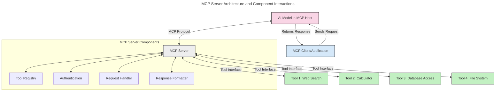
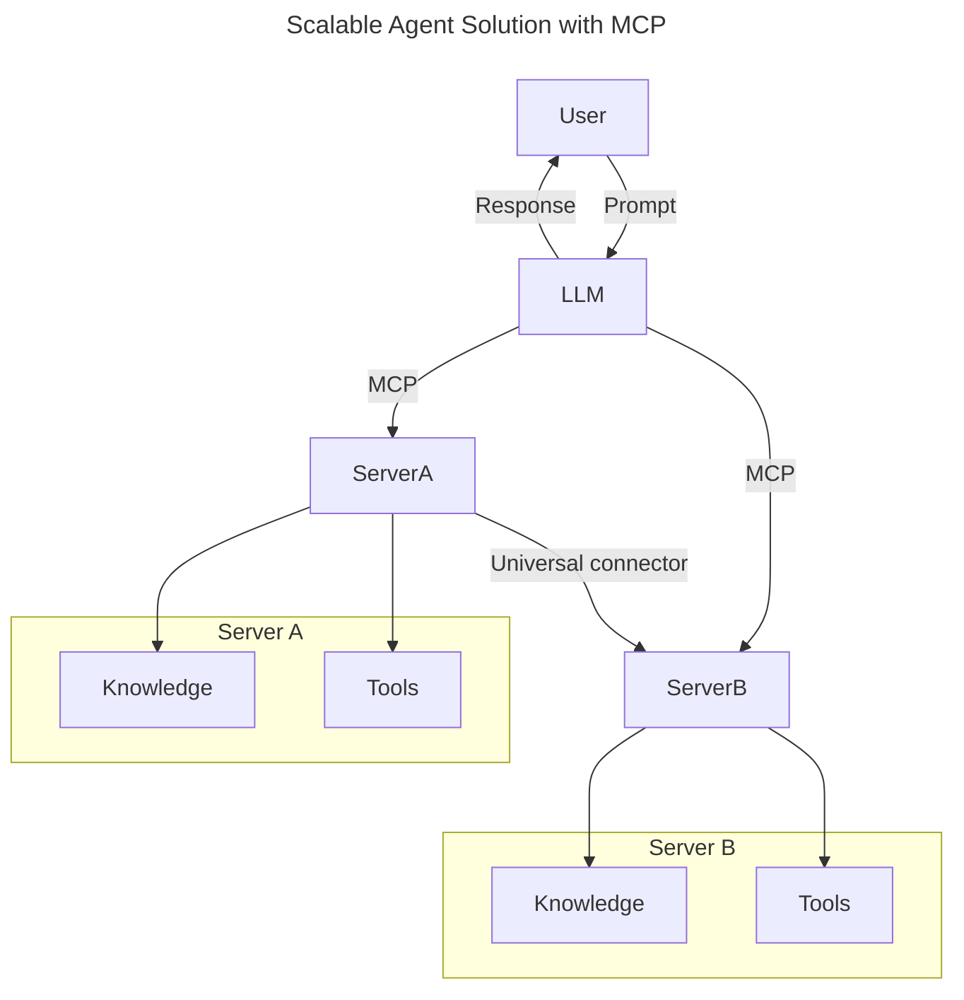
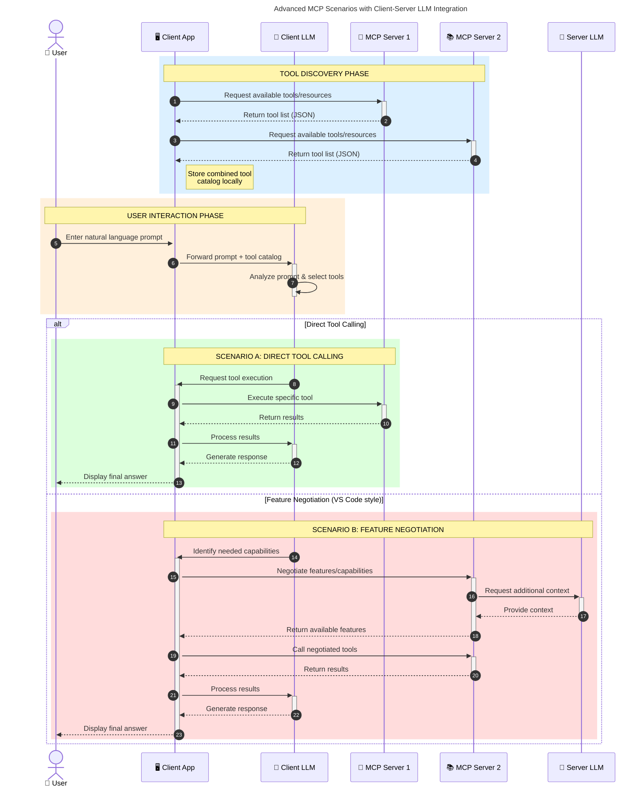

<!--
CO_OP_TRANSLATOR_METADATA:
{
  "original_hash": "105c2ddbb77bc38f7e9df009e1b06e45",
  "translation_date": "2025-07-04T15:42:18+00:00",
  "source_file": "00-Introduction/README.md",
  "language_code": "fa"
}
-->
# مقدمه‌ای بر پروتکل زمینه مدل (MCP): چرا برای برنامه‌های هوش مصنوعی مقیاس‌پذیر اهمیت دارد

برنامه‌های هوش مصنوعی مولد گامی بزرگ به جلو هستند چون اغلب به کاربر اجازه می‌دهند با استفاده از دستورات زبان طبیعی با برنامه تعامل داشته باشد. اما هرچه زمان و منابع بیشتری در این برنامه‌ها سرمایه‌گذاری شود، می‌خواهید مطمئن شوید که می‌توانید به‌راحتی قابلیت‌ها و منابع را به گونه‌ای ادغام کنید که توسعه‌پذیر باشد، برنامه شما بتواند بیش از یک مدل را پشتیبانی کند و پیچیدگی‌های مختلف مدل‌ها را مدیریت کند. به طور خلاصه، ساخت برنامه‌های هوش مصنوعی مولد در ابتدا آسان است، اما با رشد و پیچیده‌تر شدن آن‌ها، باید معماری مشخصی تعریف کنید و احتمالاً به یک استاندارد تکیه کنید تا اطمینان حاصل شود برنامه‌ها به صورت یکپارچه ساخته شده‌اند. اینجاست که MCP وارد می‌شود تا همه چیز را سازماندهی کرده و یک استاندارد ارائه دهد.

---

## **🔍 پروتکل زمینه مدل (MCP) چیست؟**

**پروتکل زمینه مدل (MCP)** یک **رابط باز و استاندارد شده** است که به مدل‌های زبان بزرگ (LLMها) اجازه می‌دهد به‌صورت یکپارچه با ابزارها، APIها و منابع داده خارجی تعامل داشته باشند. این پروتکل معماری ثابتی فراهم می‌کند تا عملکرد مدل‌های هوش مصنوعی فراتر از داده‌های آموزشی آن‌ها ارتقا یابد و سیستم‌های هوشمند، مقیاس‌پذیر و پاسخگو ایجاد شود.

---

## **🎯 چرا استانداردسازی در هوش مصنوعی اهمیت دارد**

با پیچیده‌تر شدن برنامه‌های هوش مصنوعی مولد، ضروری است استانداردهایی اتخاذ شود که **مقیاس‌پذیری، توسعه‌پذیری** و **قابلیت نگهداری** را تضمین کند. MCP این نیازها را با موارد زیر برطرف می‌کند:

- یکپارچه‌سازی مدل و ابزارها
- کاهش راه‌حل‌های شکننده و سفارشی یک‌باره
- امکان coexistence چند مدل در یک اکوسیستم واحد

---

## **📚 اهداف یادگیری**

در پایان این مقاله، شما قادر خواهید بود:

- تعریف **پروتکل زمینه مدل (MCP)** و موارد استفاده آن
- درک چگونگی استانداردسازی ارتباط مدل با ابزارها توسط MCP
- شناسایی اجزای اصلی معماری MCP
- بررسی کاربردهای واقعی MCP در زمینه‌های سازمانی و توسعه

---

## **💡 چرا پروتکل زمینه مدل (MCP) یک تحول بزرگ است**

### **🔗 MCP مشکل پراکندگی در تعاملات هوش مصنوعی را حل می‌کند**

قبل از MCP، ادغام مدل‌ها با ابزارها نیازمند:

- کد سفارشی برای هر جفت ابزار-مدل
- APIهای غیر استاندارد برای هر فروشنده
- شکست‌های مکرر به دلیل به‌روزرسانی‌ها
- مقیاس‌پذیری ضعیف با افزایش تعداد ابزارها

### **✅ مزایای استانداردسازی MCP**

| **مزیت**                 | **توضیح**                                                                     |
|--------------------------|-------------------------------------------------------------------------------|
| قابلیت همکاری            | LLMها به‌صورت یکپارچه با ابزارهای مختلف از فروشندگان متفاوت کار می‌کنند     |
| ثبات                     | رفتار یکنواخت در پلتفرم‌ها و ابزارهای مختلف                                  |
| قابلیت استفاده مجدد     | ابزارهای ساخته شده یک بار می‌توانند در پروژه‌ها و سیستم‌های مختلف استفاده شوند |
| تسریع توسعه             | کاهش زمان توسعه با استفاده از رابط‌های استاندارد و قابل اتصال سریع          |

---

## **🧱 نمای کلی معماری سطح بالا MCP**

MCP از مدل **کلاینت-سرور** پیروی می‌کند، که در آن:

- **میزبان‌های MCP** مدل‌های هوش مصنوعی را اجرا می‌کنند
- **کلاینت‌های MCP** درخواست‌ها را آغاز می‌کنند
- **سرورهای MCP** زمینه، ابزارها و قابلیت‌ها را ارائه می‌دهند

### **اجزای کلیدی:**

- **منابع** – داده‌های ایستا یا پویا برای مدل‌ها  
- **دستورات** – جریان‌های کاری از پیش تعریف شده برای تولید هدایت شده  
- **ابزارها** – توابع اجرایی مانند جستجو، محاسبات  
- **نمونه‌گیری** – رفتار عامل‌محور از طریق تعاملات بازگشتی

---

## نحوه کار سرورهای MCP

سرورهای MCP به این صورت عمل می‌کنند:

- **جریان درخواست**:  
    1. کلاینت MCP درخواست را به مدل هوش مصنوعی که در میزبان MCP اجرا می‌شود ارسال می‌کند.  
    2. مدل هوش مصنوعی تشخیص می‌دهد که به ابزارها یا داده‌های خارجی نیاز دارد.  
    3. مدل با استفاده از پروتکل استاندارد با سرور MCP ارتباط برقرار می‌کند.

- **عملکرد سرور MCP**:  
    - فهرست ابزارها: فهرستی از ابزارهای موجود و قابلیت‌های آن‌ها را نگهداری می‌کند.  
    - احراز هویت: مجوزهای دسترسی به ابزارها را تأیید می‌کند.  
    - مدیریت درخواست: درخواست‌های ورودی ابزار از مدل را پردازش می‌کند.  
    - قالب‌بندی پاسخ: خروجی ابزارها را به فرمتی ساختار یافته تبدیل می‌کند که مدل بتواند آن را درک کند.

- **اجرای ابزار**:  
    - سرور درخواست‌ها را به ابزارهای خارجی مناسب هدایت می‌کند  
    - ابزارها عملکرد تخصصی خود را اجرا می‌کنند (جستجو، محاسبه، پرس‌وجوی پایگاه داده و غیره)  
    - نتایج به صورت فرمت یکسان به مدل بازگردانده می‌شود.

- **تکمیل پاسخ**:  
    - مدل هوش مصنوعی خروجی ابزارها را در پاسخ خود وارد می‌کند.  
    - پاسخ نهایی به برنامه کلاینت ارسال می‌شود.

## 👨‍💻 چگونه یک سرور MCP بسازیم (با مثال‌ها)

سرورهای MCP به شما امکان می‌دهند قابلیت‌های LLM را با ارائه داده و عملکرد گسترش دهید.

آماده‌اید امتحان کنید؟ در اینجا نمونه‌هایی از ساخت یک سرور ساده MCP در زبان‌های مختلف آورده شده است:

- **مثال پایتون**: https://github.com/modelcontextprotocol/python-sdk

- **مثال تایپ‌اسکریپت**: https://github.com/modelcontextprotocol/typescript-sdk

- **مثال جاوا**: https://github.com/modelcontextprotocol/java-sdk

- **مثال C#/.NET**: https://github.com/modelcontextprotocol/csharp-sdk

## 🌍 کاربردهای واقعی MCP

MCP دامنه وسیعی از برنامه‌ها را با گسترش قابلیت‌های هوش مصنوعی ممکن می‌سازد:

| **کاربرد**                  | **توضیح**                                                                     |
|-----------------------------|-------------------------------------------------------------------------------|
| یکپارچه‌سازی داده‌های سازمانی | اتصال LLMها به پایگاه‌های داده، CRMها یا ابزارهای داخلی                      |
| سیستم‌های هوش مصنوعی عامل‌محور | فعال‌سازی عامل‌های خودمختار با دسترسی به ابزارها و جریان‌های تصمیم‌گیری    |
| برنامه‌های چندرسانه‌ای       | ترکیب ابزارهای متن، تصویر و صدا در یک برنامه هوش مصنوعی یکپارچه              |
| یکپارچه‌سازی داده‌های زمان واقعی | وارد کردن داده‌های زنده در تعاملات هوش مصنوعی برای خروجی‌های دقیق‌تر و به‌روز |

### 🧠 MCP = استاندارد جهانی برای تعاملات هوش مصنوعی

پروتکل زمینه مدل (MCP) مانند استاندارد USB-C برای اتصال فیزیکی دستگاه‌ها، به عنوان یک استاندارد جهانی برای تعاملات هوش مصنوعی عمل می‌کند. در دنیای هوش مصنوعی، MCP یک رابط ثابت فراهم می‌کند که به مدل‌ها (کلاینت‌ها) اجازه می‌دهد به‌صورت یکپارچه با ابزارها و ارائه‌دهندگان داده خارجی (سرورها) ادغام شوند. این امر نیاز به پروتکل‌های متنوع و سفارشی برای هر API یا منبع داده را از بین می‌برد.

در چارچوب MCP، یک ابزار سازگار با MCP (که به آن سرور MCP گفته می‌شود) از یک استاندارد یکپارچه پیروی می‌کند. این سرورها می‌توانند ابزارها یا عملکردهایی که ارائه می‌دهند را فهرست کنند و هنگام درخواست عامل هوش مصنوعی، آن‌ها را اجرا کنند. پلتفرم‌های عامل هوش مصنوعی که از MCP پشتیبانی می‌کنند قادرند ابزارهای موجود در سرورها را کشف کرده و از طریق این پروتکل استاندارد آن‌ها را فراخوانی کنند.

### 💡 تسهیل دسترسی به دانش

علاوه بر ارائه ابزارها، MCP دسترسی به دانش را نیز تسهیل می‌کند. این پروتکل به برنامه‌ها امکان می‌دهد زمینه را به مدل‌های زبان بزرگ (LLMها) ارائه دهند و آن‌ها را به منابع داده مختلف متصل کنند. برای مثال، یک سرور MCP ممکن است نمایانگر مخزن اسناد یک شرکت باشد که به عامل‌ها اجازه می‌دهد اطلاعات مرتبط را به درخواست بازیابی کنند. سرور دیگری می‌تواند اقدامات خاصی مانند ارسال ایمیل یا به‌روزرسانی رکوردها را انجام دهد. از دیدگاه عامل، این‌ها صرفاً ابزارهایی هستند که می‌تواند استفاده کند — برخی ابزارها داده (زمینه دانش) بازمی‌گردانند و برخی دیگر عملیات انجام می‌دهند. MCP هر دو را به‌صورت کارآمد مدیریت می‌کند.

یک عامل که به سرور MCP متصل می‌شود، به‌طور خودکار قابلیت‌ها و داده‌های قابل دسترس سرور را از طریق قالب استاندارد می‌آموزد. این استانداردسازی امکان در دسترس بودن پویا ابزارها را فراهم می‌کند. برای مثال، افزودن یک سرور MCP جدید به سیستم عامل باعث می‌شود عملکردهای آن بلافاصله قابل استفاده باشند بدون نیاز به سفارشی‌سازی بیشتر دستورالعمل‌های عامل.

این ادغام روان با جریان نشان داده شده در نمودار mermaid هم‌راستا است، جایی که سرورها هم ابزارها و هم دانش را فراهم می‌کنند و همکاری بی‌وقفه بین سیستم‌ها را تضمین می‌کنند.

### 👉 مثال: راه‌حل عامل مقیاس‌پذیر

### 🔄 سناریوهای پیشرفته MCP با ادغام LLM در سمت کلاینت

فراتر از معماری پایه MCP، سناریوهای پیشرفته‌ای وجود دارد که در آن‌ها هر دو سمت کلاینت و سرور دارای LLM هستند و تعاملات پیچیده‌تری را ممکن می‌سازند:

## 🔐 مزایای عملی MCP

در اینجا مزایای عملی استفاده از MCP آمده است:

- **به‌روزرسانی**: مدل‌ها می‌توانند به اطلاعات به‌روز فراتر از داده‌های آموزشی خود دسترسی داشته باشند  
- **گسترش قابلیت‌ها**: مدل‌ها می‌توانند از ابزارهای تخصصی برای وظایفی که آموزش ندیده‌اند استفاده کنند  
- **کاهش توهمات**: منابع داده خارجی پایه‌های واقعی فراهم می‌کنند  
- **حریم خصوصی**: داده‌های حساس می‌توانند در محیط‌های امن باقی بمانند و در دستورات وارد نشوند

## 📌 نکات کلیدی

نکات کلیدی برای استفاده از MCP عبارتند از:

- **MCP** نحوه تعامل مدل‌های هوش مصنوعی با ابزارها و داده‌ها را استاندارد می‌کند  
- ترویج **توسعه‌پذیری، ثبات و قابلیت همکاری**  
- MCP به **کاهش زمان توسعه، بهبود قابلیت اطمینان و گسترش قابلیت‌های مدل** کمک می‌کند  
- معماری کلاینت-سرور امکان برنامه‌های هوش مصنوعی انعطاف‌پذیر و توسعه‌پذیر را فراهم می‌کند

## 🧠 تمرین

به یک برنامه هوش مصنوعی که علاقه‌مند به ساخت آن هستید فکر کنید.

- کدام **ابزارها یا داده‌های خارجی** می‌توانند قابلیت‌های آن را افزایش دهند؟  
- MCP چگونه می‌تواند ادغام را **ساده‌تر و قابل اعتمادتر** کند؟

## منابع بیشتر

- [مخزن GitHub MCP](https://github.com/modelcontextprotocol)

## مرحله بعد

بعدی: [فصل ۱: مفاهیم اصلی](../01-CoreConcepts/README.md)

**سلب مسئولیت**:  
این سند با استفاده از سرویس ترجمه هوش مصنوعی [Co-op Translator](https://github.com/Azure/co-op-translator) ترجمه شده است. در حالی که ما در تلاش برای دقت هستیم، لطفاً توجه داشته باشید که ترجمه‌های خودکار ممکن است حاوی خطاها یا نواقصی باشند. سند اصلی به زبان بومی خود باید به عنوان منبع معتبر در نظر گرفته شود. برای اطلاعات حیاتی، ترجمه حرفه‌ای انسانی توصیه می‌شود. ما مسئول هیچ گونه سوءتفاهم یا تفسیر نادرستی که از استفاده از این ترجمه ناشی شود، نیستیم.