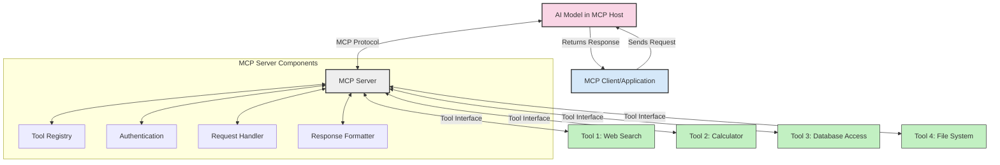
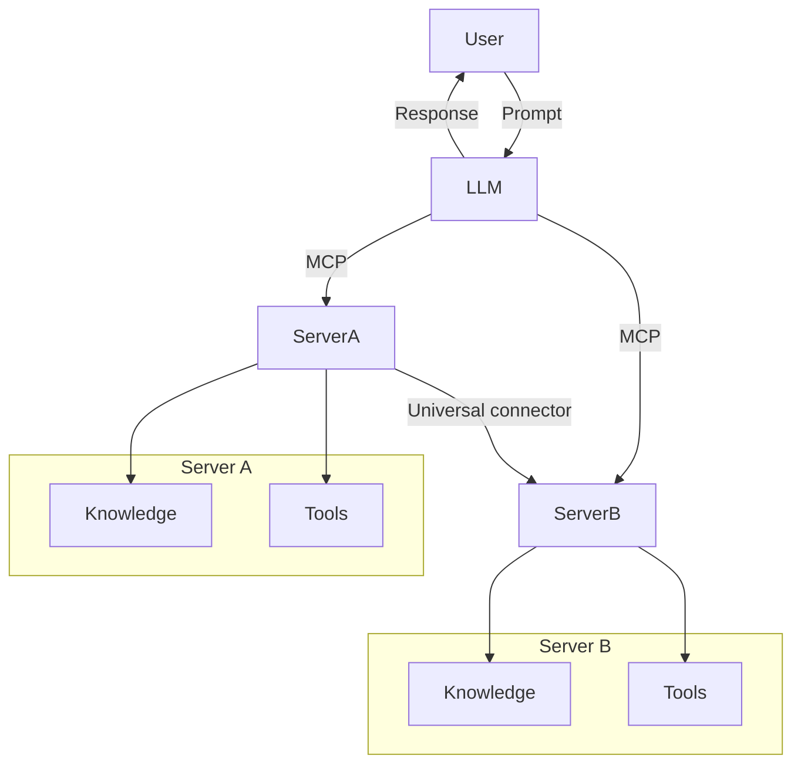

<!--
CO_OP_TRANSLATOR_METADATA:
{
  "original_hash": "02301140adbd807ecf0f17720fa307bc",
  "translation_date": "2025-05-17T05:53:47+00:00",
  "source_file": "00-Introduction/README.md",
  "language_code": "fa"
}
-->
# معرفی پروتکل زمینه مدل (MCP): چرا برای برنامه‌های مقیاس‌پذیر هوش مصنوعی اهمیت دارد

برنامه‌های هوش مصنوعی مولد یک گام بزرگ به جلو هستند زیرا اغلب به کاربر اجازه می‌دهند با استفاده از دستورات زبان طبیعی با برنامه تعامل داشته باشد. با این حال، با سرمایه‌گذاری زمان و منابع بیشتر در چنین برنامه‌هایی، می‌خواهید مطمئن شوید که می‌توانید به راحتی قابلیت‌ها و منابع را به گونه‌ای ادغام کنید که گسترش آن آسان باشد، برنامه شما بتواند بیش از یک مدل را پشتیبانی کند و پیچیدگی‌های آن را مدیریت کند. به طور خلاصه، ساخت برنامه‌های هوش مصنوعی مولد در ابتدا آسان است، اما با رشد و پیچیده‌تر شدن آن، نیاز به تعریف یک معماری دارید و به احتمال زیاد باید به یک استاندارد تکیه کنید تا مطمئن شوید برنامه‌هایتان به صورت سازگار ساخته می‌شوند. در اینجا MCP وارد عمل می‌شود تا چیزها را سازماندهی کند و یک استاندارد ارائه دهد.

---

## **🔍 پروتکل زمینه مدل (MCP) چیست؟**

**پروتکل زمینه مدل (MCP)** یک **رابط باز و استاندارد شده** است که به مدل‌های زبان بزرگ (LLM) اجازه می‌دهد به صورت یکپارچه با ابزارهای خارجی، APIها و منابع داده تعامل داشته باشند. این پروتکل یک معماری سازگار ارائه می‌دهد تا قابلیت‌های مدل هوش مصنوعی را فراتر از داده‌های آموزشی آن‌ها بهبود بخشد و سیستم‌های هوش مصنوعی هوشمندتر، مقیاس‌پذیرتر و پاسخگوتر ایجاد کند.

---

## **🎯 چرا استانداردسازی در هوش مصنوعی اهمیت دارد**

با پیچیده‌تر شدن برنامه‌های هوش مصنوعی مولد، ضروری است که استانداردهایی را بپذیریم که **مقیاس‌پذیری، گسترش‌پذیری** و **نگهداری‌پذیری** را تضمین کنند. MCP با:

- یکپارچه‌سازی مدل-ابزار
- کاهش راه‌حل‌های سفارشی شکننده و یکباره
- اجازه دادن به همزیستی چندین مدل در یک اکوسیستم

به این نیازها پاسخ می‌دهد.

---

## **📚 اهداف یادگیری**

در پایان این مقاله، شما قادر خواهید بود:

- **پروتکل زمینه مدل (MCP)** و موارد استفاده از آن را تعریف کنید
- بفهمید که چگونه MCP ارتباط مدل به ابزار را استاندارد می‌کند
- اجزای اصلی معماری MCP را شناسایی کنید
- کاربردهای واقعی MCP را در زمینه‌های سازمانی و توسعه بررسی کنید

---

## **💡 چرا پروتکل زمینه مدل (MCP) یک تغییر بزرگ است**

### **🔗 MCP شکاف‌ها در تعاملات هوش مصنوعی را حل می‌کند**

پیش از MCP، ادغام مدل‌ها با ابزارها نیاز داشت به:

- کد سفارشی برای هر جفت ابزار-مدل
- APIهای غیر استاندارد برای هر فروشنده
- شکست‌های مکرر به دلیل به‌روزرسانی‌ها
- مقیاس‌پذیری ضعیف با ابزارهای بیشتر

### **✅ مزایای استانداردسازی MCP**

| **مزیت**                  | **توضیحات**                                                                      |
|--------------------------|----------------------------------------------------------------------------------|
| قابلیت همکاری            | LLMها به صورت یکپارچه با ابزارهای مختلف فروشندگان کار می‌کنند                     |
| سازگاری                  | رفتار یکسان در سراسر پلتفرم‌ها و ابزارها                                          |
| قابلیت استفاده مجدد      | ابزارهایی که یک بار ساخته می‌شوند می‌توانند در پروژه‌ها و سیستم‌های مختلف استفاده شوند |
| توسعه سریع‌تر            | کاهش زمان توسعه با استفاده از رابط‌های استاندارد و پلاگ‌-اند-پلی                  |

---

## **🧱 مرور کلی از معماری سطح بالای MCP**

MCP از یک **مدل کلاینت-سرور** پیروی می‌کند، جایی که:

- **میزبان‌های MCP** مدل‌های هوش مصنوعی را اجرا می‌کنند
- **کلاینت‌های MCP** درخواست‌ها را آغاز می‌کنند
- **سرورهای MCP** زمینه، ابزارها و قابلیت‌ها را ارائه می‌دهند

### **اجزای کلیدی:**

- **منابع** – داده‌های ایستا یا پویا برای مدل‌ها  
- **دستورات** – جریان‌های کاری از پیش تعریف شده برای تولید هدایت شده  
- **ابزارها** – توابع اجرایی مانند جستجو، محاسبات  
- **نمونه‌گیری** – رفتار عامل از طریق تعاملات بازگشتی

---

## چگونه سرورهای MCP کار می‌کنند

سرورهای MCP به این صورت عمل می‌کنند:

- **جریان درخواست**: 
    1. کلاینت MCP یک درخواست به مدل هوش مصنوعی در حال اجرا در یک میزبان MCP ارسال می‌کند.
    2. مدل هوش مصنوعی تشخیص می‌دهد که چه زمانی به ابزارها یا داده‌های خارجی نیاز دارد.
    3. مدل با استفاده از پروتکل استاندارد با سرور MCP ارتباط برقرار می‌کند.

- **عملکرد سرور MCP**:
    - ثبت ابزار: فهرستی از ابزارهای موجود و قابلیت‌های آن‌ها را نگهداری می‌کند.
    - احراز هویت: مجوزهای دسترسی به ابزار را تأیید می‌کند.
    - پردازشگر درخواست: درخواست‌های ابزار ورودی از مدل را پردازش می‌کند.
    - قالب‌بندی پاسخ: خروجی‌های ابزار را در قالبی که مدل می‌تواند درک کند ساختار می‌دهد.

- **اجرای ابزار**: 
    - سرور درخواست‌ها را به ابزارهای خارجی مناسب ارسال می‌کند
    - ابزارها توابع تخصصی خود را اجرا می‌کنند (جستجو، محاسبه، پرس‌وجوی پایگاه داده و غیره)
    - نتایج به مدل در قالبی سازگار برگردانده می‌شوند.

- **تکمیل پاسخ**: 
    - مدل هوش مصنوعی خروجی‌های ابزار را در پاسخ خود ترکیب می‌کند.
    - پاسخ نهایی به برنامه کلاینت ارسال می‌شود.

## 👨‍💻 چگونه یک سرور MCP بسازیم (با مثال‌ها)

سرورهای MCP به شما اجازه می‌دهند قابلیت‌های LLM را با ارائه داده و عملکرد گسترش دهید.

آماده‌اید آن را امتحان کنید؟ در اینجا مثال‌هایی از ایجاد یک سرور MCP ساده در زبان‌های مختلف آورده شده است:

- **مثال پایتون**: https://github.com/modelcontextprotocol/python-sdk

- **مثال تایپ‌اسکریپت**: https://github.com/modelcontextprotocol/typescript-sdk

- **مثال جاوا**: https://github.com/modelcontextprotocol/java-sdk

- **مثال C#/.NET**: https://github.com/modelcontextprotocol/csharp-sdk

## 🌍 موارد استفاده واقعی برای MCP

MCP با گسترش قابلیت‌های هوش مصنوعی، طیف گسترده‌ای از برنامه‌ها را ممکن می‌سازد:

| **برنامه**                  | **توضیحات**                                                                      |
|----------------------------|----------------------------------------------------------------------------------|
| ادغام داده‌های سازمانی      | اتصال LLMها به پایگاه‌های داده، CRMها یا ابزارهای داخلی                           |
| سیستم‌های هوش مصنوعی عامل   | فعال‌سازی عوامل خودمختار با دسترسی به ابزار و جریان‌های کاری تصمیم‌گیری          |
| برنامه‌های چندوجهی         | ترکیب ابزارهای متنی، تصویری و صوتی در یک برنامه هوش مصنوعی یکپارچه                |
| ادغام داده‌های بلادرنگ     | آوردن داده‌های زنده به تعاملات هوش مصنوعی برای خروجی‌های دقیق‌تر و به‌روزتر       |

### 🧠 MCP = استاندارد جهانی برای تعاملات هوش مصنوعی

پروتکل زمینه مدل (MCP) به عنوان یک استاندارد جهانی برای تعاملات هوش مصنوعی عمل می‌کند، درست مانند اینکه USB-C اتصالات فیزیکی دستگاه‌ها را استاندارد کرد. در دنیای هوش مصنوعی، MCP یک رابط سازگار فراهم می‌کند که به مدل‌ها (کلاینت‌ها) اجازه می‌دهد به صورت یکپارچه با ابزارها و ارائه‌دهندگان داده خارجی (سرورها) ادغام شوند. این نیاز به پروتکل‌های متنوع و سفارشی برای هر API یا منبع داده را از بین می‌برد.

تحت MCP، یک ابزار سازگار با MCP (که به عنوان سرور MCP شناخته می‌شود) از یک استاندارد یکپارچه پیروی می‌کند. این سرورها می‌توانند فهرستی از ابزارها یا اقداماتی که ارائه می‌دهند را فهرست کنند و این اقدامات را هنگامی که توسط یک عامل هوش مصنوعی درخواست می‌شود اجرا کنند. پلتفرم‌های عامل هوش مصنوعی که از MCP پشتیبانی می‌کنند قادر به کشف ابزارهای موجود از سرورها و فراخوانی آن‌ها از طریق این پروتکل استاندارد هستند.

### 💡 دسترسی به دانش را تسهیل می‌کند

فراتر از ارائه ابزارها، MCP همچنین دسترسی به دانش را تسهیل می‌کند. این امکان را به برنامه‌ها می‌دهد تا با پیوند دادن آن‌ها به منابع داده مختلف، زمینه را به مدل‌های زبان بزرگ (LLM) ارائه دهند. به عنوان مثال، یک سرور MCP ممکن است نماینده مخزن اسناد یک شرکت باشد و به عوامل اجازه دهد اطلاعات مربوطه را به صورت درخواستی بازیابی کنند. یک سرور دیگر می‌تواند اقدامات خاصی مانند ارسال ایمیل یا به‌روزرسانی سوابق را مدیریت کند. از دیدگاه عامل، این‌ها فقط ابزارهایی هستند که می‌تواند استفاده کند—برخی ابزارها داده‌ها (زمینه دانش) را برمی‌گردانند، در حالی که برخی دیگر اقدامات را انجام می‌دهند. MCP هر دو را به طور مؤثری مدیریت می‌کند.

یک عامل که به یک سرور MCP متصل می‌شود به صورت خودکار قابلیت‌های موجود و داده‌های قابل دسترسی سرور را از طریق یک فرمت استاندارد یاد می‌گیرد. این استانداردسازی امکان دسترسی دینامیک به ابزارها را فراهم می‌کند. به عنوان مثال، افزودن یک سرور MCP جدید به سیستم عامل بلافاصله عملکردهای آن را بدون نیاز به سفارشی‌سازی بیشتر دستورالعمل‌های عامل قابل استفاده می‌کند.

این یکپارچگی ساده با جریان نشان داده شده در نمودار مرمید هماهنگ است، جایی که سرورها هم ابزارها و هم دانش را فراهم می‌کنند و همکاری یکپارچه‌ای در سراسر سیستم‌ها تضمین می‌کنند.

### 👉 مثال: راه‌حل عامل مقیاس‌پذیر

## 🔐 مزایای عملی MCP

در اینجا برخی از مزایای عملی استفاده از MCP آمده است:

- **تازگی**: مدل‌ها می‌توانند به اطلاعات به‌روز فراتر از داده‌های آموزشی خود دسترسی داشته باشند
- **گسترش قابلیت‌ها**: مدل‌ها می‌توانند از ابزارهای تخصصی برای وظایفی که برای آن‌ها آموزش ندیده‌اند استفاده کنند
- **کاهش توهمات**: منابع داده خارجی زمینه واقعی را فراهم می‌کنند
- **حریم خصوصی**: داده‌های حساس می‌توانند در محیط‌های امن باقی بمانند به جای اینکه در دستورات جاسازی شوند

## 📌 نکات کلیدی

نکات کلیدی برای استفاده از MCP عبارتند از:

- **MCP** نحوه تعامل مدل‌های هوش مصنوعی با ابزارها و داده‌ها را استاندارد می‌کند
- ترویج **گسترش‌پذیری، سازگاری و قابلیت همکاری**
- MCP کمک می‌کند به **کاهش زمان توسعه، بهبود قابلیت اطمینان و گسترش قابلیت‌های مدل**
- معماری کلاینت-سرور **برنامه‌های هوش مصنوعی انعطاف‌پذیر و گسترش‌پذیر را ممکن می‌سازد**

## 🧠 تمرین

به یک برنامه هوش مصنوعی که به ساخت آن علاقه دارید فکر کنید.

- کدام **ابزارها یا داده‌های خارجی** می‌توانند قابلیت‌های آن را افزایش دهند؟
- چگونه MCP می‌تواند ادغام را **ساده‌تر و قابل اعتمادتر** کند؟

## منابع اضافی

- [مخزن GitHub MCP](https://github.com/modelcontextprotocol)

## مرحله بعدی

بعدی: [فصل 1: مفاهیم اصلی](/01-CoreConcepts/README.md)

**سلب مسئولیت**:  
این سند با استفاده از سرویس ترجمه هوش مصنوعی [Co-op Translator](https://github.com/Azure/co-op-translator) ترجمه شده است. در حالی که ما برای دقت تلاش می‌کنیم، لطفاً توجه داشته باشید که ترجمه‌های خودکار ممکن است حاوی خطاها یا نادرستی‌ها باشند. سند اصلی به زبان مادری باید به عنوان منبع معتبر در نظر گرفته شود. برای اطلاعات حیاتی، ترجمه حرفه‌ای انسانی توصیه می‌شود. ما مسئولیتی در قبال هرگونه سوءتفاهم یا تفسیر نادرست ناشی از استفاده از این ترجمه نداریم.