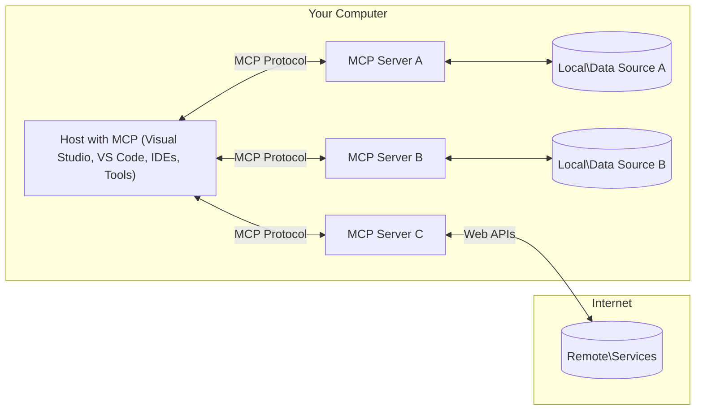

<!--
CO_OP_TRANSLATOR_METADATA:
{
  "original_hash": "904b59de1de9264801242d90a42cdd9d",
  "translation_date": "2025-09-05T10:20:41+00:00",
  "source_file": "01-CoreConcepts/README.md",
  "language_code": "fa"
}
-->
# مفاهیم اصلی MCP: تسلط بر پروتکل زمینه مدل برای یکپارچه‌سازی هوش مصنوعی

[](https://youtu.be/earDzWGtE84)

_(برای مشاهده ویدئوی این درس روی تصویر بالا کلیک کنید)_

[Model Context Protocol (MCP)](https://github.com/modelcontextprotocol) یک چارچوب قدرتمند و استاندارد است که ارتباط بین مدل‌های زبان بزرگ (LLMs) و ابزارها، برنامه‌ها و منابع داده خارجی را بهینه می‌کند.  
این راهنما شما را با مفاهیم اصلی MCP آشنا می‌کند. شما درباره معماری کلاینت-سرور، اجزای ضروری، مکانیک ارتباطات و بهترین روش‌های پیاده‌سازی آن خواهید آموخت.

- **رضایت صریح کاربر**: دسترسی به داده‌ها و عملیات نیازمند تأیید صریح کاربر قبل از اجرا است. کاربران باید به‌وضوح بدانند چه داده‌هایی دسترسی پیدا می‌کنند و چه اقداماتی انجام می‌شود، با کنترل دقیق بر مجوزها و تأییدیه‌ها.

- **حفاظت از حریم خصوصی داده‌ها**: داده‌های کاربران تنها با رضایت صریح آنها افشا می‌شود و باید در طول چرخه تعامل با کنترل‌های دسترسی قوی محافظت شوند. پیاده‌سازی‌ها باید از انتقال غیرمجاز داده‌ها جلوگیری کرده و مرزهای حریم خصوصی را به‌طور دقیق حفظ کنند.

- **ایمنی اجرای ابزارها**: هر فراخوانی ابزار نیازمند رضایت صریح کاربر با درک واضح از عملکرد ابزار، پارامترها و تأثیر احتمالی آن است. مرزهای امنیتی قوی باید از اجرای ناخواسته، ناامن یا مخرب ابزارها جلوگیری کنند.

- **امنیت لایه انتقال**: تمام کانال‌های ارتباطی باید از مکانیزم‌های رمزگذاری و احراز هویت مناسب استفاده کنند. اتصالات از راه دور باید پروتکل‌های انتقال امن و مدیریت صحیح اعتبارنامه‌ها را پیاده‌سازی کنند.

#### دستورالعمل‌های پیاده‌سازی:

- **مدیریت مجوزها**: سیستم‌های مجوز دقیق را پیاده‌سازی کنید که به کاربران اجازه می‌دهد کنترل کنند کدام سرورها، ابزارها و منابع قابل دسترسی هستند  
- **احراز هویت و مجوزدهی**: از روش‌های احراز هویت امن (OAuth، کلیدهای API) با مدیریت صحیح توکن‌ها و انقضا استفاده کنید  
- **اعتبارسنجی ورودی**: تمام پارامترها و ورودی‌های داده را مطابق با طرح‌های تعریف‌شده اعتبارسنجی کنید تا از حملات تزریقی جلوگیری شود  
- **ثبت گزارش‌های حسابرسی**: گزارش‌های جامع از تمام عملیات برای نظارت امنیتی و رعایت قوانین نگهداری کنید  

## مرور کلی

این درس معماری و اجزای اساسی که اکوسیستم Model Context Protocol (MCP) را تشکیل می‌دهند بررسی می‌کند. شما درباره معماری کلاینت-سرور، اجزای کلیدی و مکانیزم‌های ارتباطی که تعاملات MCP را قدرت می‌بخشند یاد خواهید گرفت.

## اهداف اصلی یادگیری

تا پایان این درس، شما:

- معماری کلاینت-سرور MCP را درک خواهید کرد.
- نقش‌ها و مسئولیت‌های میزبان‌ها، کلاینت‌ها و سرورها را شناسایی خواهید کرد.
- ویژگی‌های اصلی که MCP را به یک لایه یکپارچه‌سازی انعطاف‌پذیر تبدیل می‌کند تحلیل خواهید کرد.
- نحوه جریان اطلاعات در اکوسیستم MCP را یاد خواهید گرفت.
- از طریق مثال‌های کدنویسی در .NET، Java، Python و JavaScript بینش عملی کسب خواهید کرد.

## معماری MCP: بررسی عمیق‌تر

اکوسیستم MCP بر اساس مدل کلاینت-سرور ساخته شده است. این ساختار ماژولار به برنامه‌های هوش مصنوعی اجازه می‌دهد به ابزارها، پایگاه‌های داده، APIها و منابع زمینه‌ای به‌طور کارآمد تعامل کنند. بیایید این معماری را به اجزای اصلی آن تقسیم کنیم.

در هسته خود، MCP از معماری کلاینت-سرور پیروی می‌کند که در آن یک برنامه میزبان می‌تواند به چندین سرور متصل شود:



- **میزبان‌های MCP**: برنامه‌هایی مانند VSCode، Claude Desktop، IDEها یا ابزارهای هوش مصنوعی که می‌خواهند از طریق MCP به داده‌ها دسترسی پیدا کنند  
- **کلاینت‌های MCP**: کلاینت‌های پروتکل که ارتباطات 1:1 با سرورها را حفظ می‌کنند  
- **سرورهای MCP**: برنامه‌های سبک که هر کدام قابلیت‌های خاصی را از طریق پروتکل استاندارد Model Context ارائه می‌دهند  
- **منابع داده محلی**: فایل‌ها، پایگاه‌های داده و خدمات کامپیوتر شما که سرورهای MCP می‌توانند به‌طور امن به آنها دسترسی پیدا کنند  
- **خدمات از راه دور**: سیستم‌های خارجی موجود در اینترنت که سرورهای MCP می‌توانند از طریق APIها به آنها متصل شوند  

پروتکل MCP یک استاندارد در حال تکامل است که از نسخه‌بندی مبتنی بر تاریخ (فرمت YYYY-MM-DD) استفاده می‌کند. نسخه فعلی پروتکل **2025-06-18** است. شما می‌توانید آخرین به‌روزرسانی‌های [مشخصات پروتکل](https://modelcontextprotocol.io/specification/2025-06-18/) را مشاهده کنید.

### 1. میزبان‌ها

در پروتکل زمینه مدل (MCP)، **میزبان‌ها** برنامه‌های هوش مصنوعی هستند که به‌عنوان رابط اصلی از طریق آن کاربران با پروتکل تعامل می‌کنند. میزبان‌ها با ایجاد کلاینت‌های MCP اختصاصی برای هر اتصال سرور، ارتباطات با چندین سرور MCP را هماهنگ و مدیریت می‌کنند. نمونه‌هایی از میزبان‌ها عبارتند از:

- **برنامه‌های هوش مصنوعی**: Claude Desktop، Visual Studio Code، Claude Code  
- **محیط‌های توسعه**: IDEها و ویرایشگرهای کد با یکپارچه‌سازی MCP  
- **برنامه‌های سفارشی**: عوامل و ابزارهای هوش مصنوعی طراحی‌شده برای اهداف خاص  

**میزبان‌ها** برنامه‌هایی هستند که تعاملات مدل هوش مصنوعی را هماهنگ می‌کنند. آنها:

- **مدل‌های هوش مصنوعی را هماهنگ می‌کنند**: مدل‌های زبان بزرگ (LLMs) را اجرا یا با آنها تعامل می‌کنند تا پاسخ‌ها تولید کنند و جریان‌های کاری هوش مصنوعی را هماهنگ کنند  
- **اتصالات کلاینت را مدیریت می‌کنند**: یک کلاینت MCP برای هر اتصال سرور MCP ایجاد و حفظ می‌کنند  
- **رابط کاربری را کنترل می‌کنند**: جریان مکالمه، تعاملات کاربر و ارائه پاسخ‌ها را مدیریت می‌کنند  
- **امنیت را اجرا می‌کنند**: مجوزها، محدودیت‌های امنیتی و احراز هویت را کنترل می‌کنند  
- **رضایت کاربر را مدیریت می‌کنند**: تأیید کاربر برای اشتراک‌گذاری داده‌ها و اجرای ابزارها را مدیریت می‌کنند  

### 2. کلاینت‌ها

**کلاینت‌ها** اجزای ضروری هستند که ارتباطات اختصاصی یک‌به‌یک بین میزبان‌ها و سرورهای MCP را حفظ می‌کنند. هر کلاینت MCP توسط میزبان برای اتصال به یک سرور MCP خاص ایجاد می‌شود و کانال‌های ارتباطی سازمان‌یافته و امن را تضمین می‌کند. چندین کلاینت به میزبان‌ها اجازه می‌دهند به‌طور همزمان به چندین سرور متصل شوند.

**کلاینت‌ها** اجزای اتصال‌دهنده درون برنامه میزبان هستند. آنها:

- **ارتباطات پروتکل**: درخواست‌های JSON-RPC 2.0 را با درخواست‌ها و دستورالعمل‌ها به سرورها ارسال می‌کنند  
- **مذاکره قابلیت‌ها**: ویژگی‌های پشتیبانی‌شده و نسخه‌های پروتکل را با سرورها در طول راه‌اندازی مذاکره می‌کنند  
- **اجرای ابزارها**: درخواست‌های اجرای ابزار از مدل‌ها را مدیریت کرده و پاسخ‌ها را پردازش می‌کنند  
- **به‌روزرسانی‌های بلادرنگ**: اعلان‌ها و به‌روزرسانی‌های بلادرنگ از سرورها را مدیریت می‌کنند  
- **پردازش پاسخ‌ها**: پاسخ‌های سرور را برای نمایش به کاربران پردازش و قالب‌بندی می‌کنند  

### 3. سرورها

**سرورها** برنامه‌هایی هستند که زمینه، ابزارها و قابلیت‌ها را به کلاینت‌های MCP ارائه می‌دهند. آنها می‌توانند به‌صورت محلی (در همان دستگاه میزبان) یا از راه دور (در پلتفرم‌های خارجی) اجرا شوند و مسئول پردازش درخواست‌های کلاینت و ارائه پاسخ‌های ساختاریافته هستند. سرورها قابلیت‌های خاصی را از طریق پروتکل استاندارد Model Context ارائه می‌دهند.

**سرورها** خدماتی هستند که زمینه و قابلیت‌ها را ارائه می‌دهند. آنها:

- **ثبت ویژگی‌ها**: قابلیت‌های موجود (منابع، درخواست‌ها، ابزارها) را به کلاینت‌ها ثبت و ارائه می‌دهند  
- **پردازش درخواست‌ها**: درخواست‌های ابزار، منابع و درخواست‌های مدل را از کلاینت‌ها دریافت و اجرا می‌کنند  
- **ارائه زمینه**: اطلاعات زمینه‌ای و داده‌ها را برای بهبود پاسخ‌های مدل ارائه می‌دهند  
- **مدیریت وضعیت**: وضعیت جلسه را حفظ کرده و تعاملات حالت‌دار را در صورت نیاز مدیریت می‌کنند  
- **اعلان‌های بلادرنگ**: اعلان‌هایی درباره تغییرات قابلیت‌ها و به‌روزرسانی‌ها به کلاینت‌های متصل ارسال می‌کنند  

سرورها می‌توانند توسط هر کسی توسعه داده شوند تا قابلیت‌های مدل را با عملکردهای تخصصی گسترش دهند و از سناریوهای استقرار محلی و از راه دور پشتیبانی کنند.

### 4. عناصر اصلی سرور

سرورها در پروتکل زمینه مدل (MCP) سه **عنصر اصلی** ارائه می‌دهند که بلوک‌های سازنده اساسی برای تعاملات غنی بین کلاینت‌ها، میزبان‌ها و مدل‌های زبان را تعریف می‌کنند. این عناصر انواع اطلاعات زمینه‌ای و اقدامات موجود از طریق پروتکل را مشخص می‌کنند.

سرورهای MCP می‌توانند هر ترکیبی از سه عنصر اصلی زیر را ارائه دهند:

#### منابع  

**منابع** منابع داده‌ای هستند که اطلاعات زمینه‌ای را به برنامه‌های هوش مصنوعی ارائه می‌دهند. آنها محتوای ثابت یا پویا را نشان می‌دهند که می‌تواند درک و تصمیم‌گیری مدل را بهبود بخشد:

- **داده‌های زمینه‌ای**: اطلاعات ساختاریافته و زمینه برای مصرف مدل هوش مصنوعی  
- **پایگاه‌های دانش**: مخازن اسناد، مقالات، راهنماها و مقالات تحقیقاتی  
- **منابع داده محلی**: فایل‌ها، پایگاه‌های داده و اطلاعات سیستم محلی  
- **داده‌های خارجی**: پاسخ‌های API، خدمات وب و داده‌های سیستم‌های از راه دور  
- **محتوای پویا**: داده‌های بلادرنگ که بر اساس شرایط خارجی به‌روزرسانی می‌شوند  

منابع با URIs شناسایی می‌شوند و از طریق روش‌های `resources/list` و `resources/read` قابل کشف و بازیابی هستند:

```text
file://documents/project-spec.md
database://production/users/schema
api://weather/current
```

#### درخواست‌ها  

**درخواست‌ها** قالب‌های قابل استفاده مجدد هستند که به ساختار تعاملات با مدل‌های زبان کمک می‌کنند. آنها الگوهای تعامل استاندارد و جریان‌های کاری قالب‌بندی‌شده را ارائه می‌دهند:

- **تعاملات مبتنی بر قالب**: پیام‌های پیش‌ساختار و شروع‌کننده‌های مکالمه  
- **قالب‌های جریان کاری**: توالی‌های استاندارد برای وظایف و تعاملات رایج  
- **نمونه‌های چند‌شات**: قالب‌های مبتنی بر مثال برای دستورالعمل مدل  
- **درخواست‌های سیستمی**: درخواست‌های پایه‌ای که رفتار و زمینه مدل را تعریف می‌کنند  
- **قالب‌های پویا**: درخواست‌های پارامتری که به زمینه‌های خاص تطبیق می‌یابند  

درخواست‌ها از جایگزینی متغیر پشتیبانی می‌کنند و می‌توانند از طریق `prompts/list` کشف و با `prompts/get` بازیابی شوند:

```markdown
Generate a {{task_type}} for {{product}} targeting {{audience}} with the following requirements: {{requirements}}
```

#### ابزارها  

**ابزارها** توابع اجرایی هستند که مدل‌های هوش مصنوعی می‌توانند برای انجام اقدامات خاص فراخوانی کنند. آنها "افعال" اکوسیستم MCP را نشان می‌دهند و به مدل‌ها اجازه می‌دهند با سیستم‌های خارجی تعامل کنند:

- **توابع اجرایی**: عملیات‌های مجزا که مدل‌ها می‌توانند با پارامترهای خاص فراخوانی کنند  
- **یکپارچه‌سازی سیستم خارجی**: فراخوانی‌های API، پرس‌وجوهای پایگاه داده، عملیات فایل، محاسبات  
- **هویت منحصربه‌فرد**: هر ابزار دارای نام، توضیحات و طرح پارامتر متمایز است  
- **ورودی/خروجی ساختاریافته**: ابزارها پارامترهای اعتبارسنجی‌شده را می‌پذیرند و پاسخ‌های ساختاریافته و تایپ‌شده بازمی‌گردانند  
- **قابلیت‌های عملیاتی**: به مدل‌ها اجازه می‌دهند اقدامات واقعی انجام دهند و داده‌های زنده بازیابی کنند  

ابزارها با JSON Schema برای اعتبارسنجی پارامترها تعریف می‌شوند و از طریق `tools/list` کشف و با `tools/call` اجرا می‌شوند:

```typescript
server.tool(
  "search_products", 
  {
    query: z.string().describe("Search query for products"),
    category: z.string().optional().describe("Product category filter"),
    max_results: z.number().default(10).describe("Maximum results to return")
  }, 
  async (params) => {
    // Execute search and return structured results
    return await productService.search(params);
  }
);
```

## عناصر اصلی کلاینت

در پروتکل زمینه مدل (MCP)، **کلاینت‌ها** می‌توانند عناصر اصلی ارائه دهند که به سرورها اجازه می‌دهد قابلیت‌های اضافی را از برنامه میزبان درخواست کنند. این عناصر سمت کلاینت امکان پیاده‌سازی‌های سرور غنی‌تر و تعاملی‌تر را فراهم می‌کنند که می‌توانند به قابلیت‌های مدل هوش مصنوعی و تعاملات کاربر دسترسی داشته باشند.

### نمونه‌گیری

**نمونه‌گیری** به سرورها اجازه می‌دهد تکمیل‌های مدل زبان را از برنامه هوش مصنوعی کلاینت درخواست کنند. این عنصر به سرورها امکان دسترسی به قابلیت‌های LLM را بدون وابستگی به مدل‌های داخلی می‌دهد:

- **دسترسی مستقل از مدل**: سرورها می‌توانند تکمیل‌ها را بدون نیاز به SDKهای LLM یا مدیریت دسترسی مدل درخواست کنند  
- **هوش مصنوعی آغازشده توسط سرور**: به سرورها اجازه می‌دهد به‌طور مستقل محتوا با استفاده از مدل هوش مصنوعی کلاینت تولید کنند  
- **تعاملات بازگشتی LLM**: از سناریوهای پیچیده‌ای که سرورها به کمک هوش مصنوعی برای پردازش نیاز دارند پشتیبانی می‌کند  
- **تولید محتوای پویا**: به سرورها اجازه می‌دهد پاسخ‌های زمینه‌ای با استفاده از مدل میزبان ایجاد کنند  

نمونه‌گیری از طریق روش `sampling/complete` آغاز می‌شود، جایی که سرورها درخواست‌های تکمیل را به کلاینت‌ها ارسال می‌کنند.

### استخراج اطلاعات  

**استخراج اطلاعات** به سرورها اجازه می‌دهد اطلاعات اضافی یا تأییدیه از کاربران از طریق رابط کلاینت درخواست کنند:

- **درخواست‌های ورودی کاربر**: سرورها می‌توانند اطلاعات اضافی را هنگام نیاز برای اجرای ابزار درخواست کنند  
- **دیالوگ‌های تأییدیه**: درخواست تأیید کاربر برای عملیات حساس یا تأثیرگذار  
- **جریان‌های کاری تعاملی**: به سرورها اجازه می‌دهد تعاملات مرحله‌به‌مرحله با کاربران ایجاد کنند  
- **جمع‌آوری پارامترهای پویا**: جمع‌آوری پارامترهای گم‌شده یا اختیاری در طول اجرای ابزار  

درخواست‌های استخراج اطلاعات با استفاده از روش `elicitation/request` برای جمع‌آوری ورودی کاربر از طریق رابط کلاینت انجام می‌شود.

### ثبت گزارش‌ها

**ثبت گزارش‌ها** به سرورها اجازه می‌دهد پیام‌های گزارش ساختاریافته را برای کلاینت‌ها ارسال کنند تا برای اشکال‌زدایی، نظارت و دید عملیاتی استفاده شوند:

- **پشتیبانی اشکال‌زدایی**: به سرورها اجازه می‌دهد گزارش‌های اجرایی دقیق برای رفع اشکال ارائه دهند  
- **نظارت عملیاتی**: ارسال به‌روزرسانی‌های وضعیت و معیارهای عملکرد به کلاینت‌ها  
- **گزارش خطا**: ارائه زمینه خطاهای دقیق و اطلاعات تشخیصی  
- **ردیابی حسابرسی**: ایجاد گزارش‌های جامع از عملیات و تصمیمات سرور  

پیام‌های ثبت گزارش به کلاینت‌ها ارسال می‌شوند تا شفافیت در عملیات سرور را فراهم کنند و اشکال‌زدایی را تسهیل کنند.

## جریان اطلاعات در MCP

پروتکل زمینه مدل (MCP) جریان ساختاریافته‌ای از اطلاعات بین میزبان‌ها، کلاینت‌ها، سرورها و مدل‌ها تعریف می‌کند. درک این جریان کمک می‌کند تا مشخص شود چگونه درخواست‌های کاربران پردازش می‌شوند و چگونه ابزارها و داده‌های خارجی در پاسخ‌های مدل یکپارچه می‌شوند.

- **میزبان اتصال را آغاز می‌کند**  
  برنامه میزبان (مانند یک IDE یا رابط چت) اتصال به یک سرور MCP را برقرار می‌کند، معمولاً از طریق STDIO، WebSocket یا یک روش انتقال پشتیبانی‌شده دیگر.

- **مذاکره قابلیت‌ها**  
  کلاینت (جاسازی‌شده در میزبان) و سرور اطلاعاتی درباره ویژگی‌های پشتیبانی‌شده، ابزارها، منابع و نسخه‌های پروتکل خود تبادل می‌کنند. این اطمینان می‌دهد که هر دو طرف قابلیت‌های موجود برای جلسه را درک می‌کنند.

- **درخواست کاربر**  
  کاربر با میزبان تعامل می‌کند (مثلاً یک درخواست یا فرمان وارد می‌کند). میزبان این ورودی را جمع‌آوری کرده و برای پردازش به کلاینت ارسال می‌کند.

- **استفاده از منابع یا ابزارها**  
  - کلاینت ممکن است زمینه یا منابع اضافی از سرور درخواست کند (مانند فایل‌ها، ورودی‌های پایگاه داده یا مقالات پایگاه دانش) تا درک مدل را غنی‌تر کند.  
  - اگر مدل تعیین کند که به یک ابزار نیاز دارد (مثلاً برای بازیابی داده‌ها، انجام محاسبه یا فراخوانی یک API)، کلاینت درخواست فراخوانی ابزار را به سرور ارسال می‌کند، با مشخص کردن
- **پروتکل JSON-RPC 2.0**: تمام ارتباطات از فرمت استاندارد پیام JSON-RPC 2.0 برای فراخوانی متدها، پاسخ‌ها و اعلان‌ها استفاده می‌کنند.  
- **مدیریت چرخه عمر**: مدیریت اولیه‌سازی اتصال، مذاکره قابلیت‌ها و خاتمه جلسه بین کلاینت‌ها و سرورها.  
- **ابزارهای سرور**: به سرورها امکان ارائه قابلیت‌های اصلی از طریق ابزارها، منابع و قالب‌ها را می‌دهد.  
- **ابزارهای کلاینت**: به سرورها امکان درخواست نمونه‌گیری از مدل‌های زبانی، دریافت ورودی کاربر و ارسال پیام‌های لاگ را می‌دهد.  
- **اعلان‌های بلادرنگ**: پشتیبانی از اعلان‌های غیرهمزمان برای به‌روزرسانی‌های پویا بدون نیاز به درخواست مکرر.  

#### ویژگی‌های کلیدی:

- **مذاکره نسخه پروتکل**: استفاده از نسخه‌بندی مبتنی بر تاریخ (YYYY-MM-DD) برای اطمینان از سازگاری.  
- **کشف قابلیت‌ها**: کلاینت‌ها و سرورها در طول اولیه‌سازی اطلاعات ویژگی‌های پشتیبانی‌شده را تبادل می‌کنند.  
- **جلسات با حالت پایدار**: حفظ وضعیت اتصال در تعاملات متعدد برای تداوم زمینه.  

### لایه انتقال

**لایه انتقال** کانال‌های ارتباطی، قالب‌بندی پیام‌ها و احراز هویت بین شرکت‌کنندگان MCP را مدیریت می‌کند:

#### مکانیزم‌های انتقال پشتیبانی‌شده:

1. **انتقال STDIO**:
   - استفاده از جریان‌های ورودی/خروجی استاندارد برای ارتباط مستقیم بین فرآیندها.  
   - بهینه برای فرآیندهای محلی روی یک ماشین بدون سربار شبکه.  
   - معمولاً برای پیاده‌سازی‌های سرور MCP محلی استفاده می‌شود.  

2. **انتقال HTTP قابل استریم**:
   - استفاده از HTTP POST برای پیام‌های کلاینت به سرور.  
   - امکان استفاده از Server-Sent Events (SSE) برای استریم پیام‌های سرور به کلاینت.  
   - امکان ارتباط با سرورهای راه دور از طریق شبکه‌ها.  
   - پشتیبانی از احراز هویت استاندارد HTTP (توکن‌های حامل، کلیدهای API، هدرهای سفارشی).  
   - MCP استفاده از OAuth را برای احراز هویت امن مبتنی بر توکن توصیه می‌کند.  

#### انتزاع انتقال:

لایه انتقال جزئیات ارتباط را از لایه داده جدا می‌کند و امکان استفاده از همان فرمت پیام JSON-RPC 2.0 را در تمام مکانیزم‌های انتقال فراهم می‌کند. این انتزاع به برنامه‌ها اجازه می‌دهد به‌راحتی بین سرورهای محلی و راه دور جابه‌جا شوند.  

### ملاحظات امنیتی

پیاده‌سازی‌های MCP باید از چندین اصل امنیتی حیاتی پیروی کنند تا تعاملات ایمن، قابل‌اعتماد و مطمئن در تمام عملیات پروتکل تضمین شود:

- **رضایت و کنترل کاربر**: کاربران باید قبل از دسترسی به هر داده یا انجام عملیات، رضایت صریح خود را ارائه دهند. آن‌ها باید کنترل واضحی بر داده‌های به‌اشتراک‌گذاشته‌شده و اقدامات مجاز داشته باشند، که با رابط‌های کاربری شهودی برای بررسی و تأیید فعالیت‌ها پشتیبانی می‌شود.  

- **حریم خصوصی داده‌ها**: داده‌های کاربران فقط با رضایت صریح آن‌ها در دسترس قرار می‌گیرد و باید با کنترل‌های دسترسی مناسب محافظت شود. پیاده‌سازی‌های MCP باید از انتقال غیرمجاز داده‌ها جلوگیری کرده و اطمینان حاصل کنند که حریم خصوصی در تمام تعاملات حفظ می‌شود.  

- **ایمنی ابزارها**: قبل از فراخوانی هر ابزار، رضایت صریح کاربر لازم است. کاربران باید درک روشنی از عملکرد هر ابزار داشته باشند و مرزهای امنیتی قوی باید برای جلوگیری از اجرای ناخواسته یا ناامن ابزارها اعمال شود.  

با پیروی از این اصول امنیتی، MCP اطمینان حاصل می‌کند که اعتماد، حریم خصوصی و ایمنی کاربران در تمام تعاملات پروتکل حفظ می‌شود و در عین حال ادغام‌های قدرتمند هوش مصنوعی را امکان‌پذیر می‌سازد.  

## نمونه کدها: اجزای کلیدی

در زیر نمونه کدهایی در چند زبان برنامه‌نویسی محبوب آورده شده است که نحوه پیاده‌سازی اجزای کلیدی سرور MCP و ابزارها را نشان می‌دهد.  

### مثال .NET: ایجاد یک سرور ساده MCP با ابزارها

در اینجا یک مثال عملی از کد .NET آورده شده است که نحوه پیاده‌سازی یک سرور ساده MCP با ابزارهای سفارشی را نشان می‌دهد. این مثال نحوه تعریف و ثبت ابزارها، مدیریت درخواست‌ها و اتصال سرور با استفاده از پروتکل Model Context را نمایش می‌دهد.  

```csharp
using System;
using System.Threading.Tasks;
using ModelContextProtocol.Server;
using ModelContextProtocol.Server.Transport;
using ModelContextProtocol.Server.Tools;

public class WeatherServer
{
    public static async Task Main(string[] args)
    {
        // Create an MCP server
        var server = new McpServer(
            name: "Weather MCP Server",
            version: "1.0.0"
        );
        
        // Register our custom weather tool
        server.AddTool<string, WeatherData>("weatherTool", 
            description: "Gets current weather for a location",
            execute: async (location) => {
                // Call weather API (simplified)
                var weatherData = await GetWeatherDataAsync(location);
                return weatherData;
            });
        
        // Connect the server using stdio transport
        var transport = new StdioServerTransport();
        await server.ConnectAsync(transport);
        
        Console.WriteLine("Weather MCP Server started");
        
        // Keep the server running until process is terminated
        await Task.Delay(-1);
    }
    
    private static async Task<WeatherData> GetWeatherDataAsync(string location)
    {
        // This would normally call a weather API
        // Simplified for demonstration
        await Task.Delay(100); // Simulate API call
        return new WeatherData { 
            Temperature = 72.5,
            Conditions = "Sunny",
            Location = location
        };
    }
}

public class WeatherData
{
    public double Temperature { get; set; }
    public string Conditions { get; set; }
    public string Location { get; set; }
}
```

### مثال جاوا: اجزای سرور MCP

این مثال همان سرور MCP و ثبت ابزارها را که در مثال .NET بالا آورده شده است، اما با استفاده از جاوا پیاده‌سازی می‌کند.  

```java
import io.modelcontextprotocol.server.McpServer;
import io.modelcontextprotocol.server.McpToolDefinition;
import io.modelcontextprotocol.server.transport.StdioServerTransport;
import io.modelcontextprotocol.server.tool.ToolExecutionContext;
import io.modelcontextprotocol.server.tool.ToolResponse;

public class WeatherMcpServer {
    public static void main(String[] args) throws Exception {
        // Create an MCP server
        McpServer server = McpServer.builder()
            .name("Weather MCP Server")
            .version("1.0.0")
            .build();
            
        // Register a weather tool
        server.registerTool(McpToolDefinition.builder("weatherTool")
            .description("Gets current weather for a location")
            .parameter("location", String.class)
            .execute((ToolExecutionContext ctx) -> {
                String location = ctx.getParameter("location", String.class);
                
                // Get weather data (simplified)
                WeatherData data = getWeatherData(location);
                
                // Return formatted response
                return ToolResponse.content(
                    String.format("Temperature: %.1f°F, Conditions: %s, Location: %s", 
                    data.getTemperature(), 
                    data.getConditions(), 
                    data.getLocation())
                );
            })
            .build());
        
        // Connect the server using stdio transport
        try (StdioServerTransport transport = new StdioServerTransport()) {
            server.connect(transport);
            System.out.println("Weather MCP Server started");
            // Keep server running until process is terminated
            Thread.currentThread().join();
        }
    }
    
    private static WeatherData getWeatherData(String location) {
        // Implementation would call a weather API
        // Simplified for example purposes
        return new WeatherData(72.5, "Sunny", location);
    }
}

class WeatherData {
    private double temperature;
    private String conditions;
    private String location;
    
    public WeatherData(double temperature, String conditions, String location) {
        this.temperature = temperature;
        this.conditions = conditions;
        this.location = location;
    }
    
    public double getTemperature() {
        return temperature;
    }
    
    public String getConditions() {
        return conditions;
    }
    
    public String getLocation() {
        return location;
    }
}
```

### مثال پایتون: ساخت یک سرور MCP

این مثال از fastmcp استفاده می‌کند، بنابراین ابتدا مطمئن شوید که آن را نصب کرده‌اید:  

```python
pip install fastmcp
```  
نمونه کد:  

```python
#!/usr/bin/env python3
import asyncio
from fastmcp import FastMCP
from fastmcp.transports.stdio import serve_stdio

# Create a FastMCP server
mcp = FastMCP(
    name="Weather MCP Server",
    version="1.0.0"
)

@mcp.tool()
def get_weather(location: str) -> dict:
    """Gets current weather for a location."""
    return {
        "temperature": 72.5,
        "conditions": "Sunny",
        "location": location
    }

# Alternative approach using a class
class WeatherTools:
    @mcp.tool()
    def forecast(self, location: str, days: int = 1) -> dict:
        """Gets weather forecast for a location for the specified number of days."""
        return {
            "location": location,
            "forecast": [
                {"day": i+1, "temperature": 70 + i, "conditions": "Partly Cloudy"}
                for i in range(days)
            ]
        }

# Register class tools
weather_tools = WeatherTools()

# Start the server
if __name__ == "__main__":
    asyncio.run(serve_stdio(mcp))
```  

### مثال جاوااسکریپت: ایجاد یک سرور MCP

این مثال نحوه ایجاد یک سرور MCP در جاوااسکریپت و نحوه ثبت دو ابزار مرتبط با آب‌وهوا را نشان می‌دهد.  

```javascript
// Using the official Model Context Protocol SDK
import { McpServer } from "@modelcontextprotocol/sdk/server/mcp.js";
import { StdioServerTransport } from "@modelcontextprotocol/sdk/server/stdio.js";
import { z } from "zod"; // For parameter validation

// Create an MCP server
const server = new McpServer({
  name: "Weather MCP Server",
  version: "1.0.0"
});

// Define a weather tool
server.tool(
  "weatherTool",
  {
    location: z.string().describe("The location to get weather for")
  },
  async ({ location }) => {
    // This would normally call a weather API
    // Simplified for demonstration
    const weatherData = await getWeatherData(location);
    
    return {
      content: [
        { 
          type: "text", 
          text: `Temperature: ${weatherData.temperature}°F, Conditions: ${weatherData.conditions}, Location: ${weatherData.location}` 
        }
      ]
    };
  }
);

// Define a forecast tool
server.tool(
  "forecastTool",
  {
    location: z.string(),
    days: z.number().default(3).describe("Number of days for forecast")
  },
  async ({ location, days }) => {
    // This would normally call a weather API
    // Simplified for demonstration
    const forecast = await getForecastData(location, days);
    
    return {
      content: [
        { 
          type: "text", 
          text: `${days}-day forecast for ${location}: ${JSON.stringify(forecast)}` 
        }
      ]
    };
  }
);

// Helper functions
async function getWeatherData(location) {
  // Simulate API call
  return {
    temperature: 72.5,
    conditions: "Sunny",
    location: location
  };
}

async function getForecastData(location, days) {
  // Simulate API call
  return Array.from({ length: days }, (_, i) => ({
    day: i + 1,
    temperature: 70 + Math.floor(Math.random() * 10),
    conditions: i % 2 === 0 ? "Sunny" : "Partly Cloudy"
  }));
}

// Connect the server using stdio transport
const transport = new StdioServerTransport();
server.connect(transport).catch(console.error);

console.log("Weather MCP Server started");
```  

این مثال جاوااسکریپت نحوه ایجاد یک کلاینت MCP را نشان می‌دهد که به یک سرور متصل می‌شود، یک درخواست ارسال می‌کند و پاسخ را پردازش می‌کند، از جمله هرگونه فراخوانی ابزار که انجام شده است.  

## امنیت و مجوزدهی

MCP شامل چندین مفهوم و مکانیزم داخلی برای مدیریت امنیت و مجوزدهی در سراسر پروتکل است:

1. **کنترل مجوز ابزار**:  
   کلاینت‌ها می‌توانند مشخص کنند که کدام ابزارها در طول یک جلسه برای مدل مجاز هستند. این کار تضمین می‌کند که فقط ابزارهای صریحاً مجاز در دسترس هستند و خطر عملیات ناخواسته یا ناامن کاهش می‌یابد. مجوزها می‌توانند به‌صورت پویا بر اساس ترجیحات کاربر، سیاست‌های سازمانی یا زمینه تعامل پیکربندی شوند.  

2. **احراز هویت**:  
   سرورها می‌توانند قبل از اعطای دسترسی به ابزارها، منابع یا عملیات حساس، احراز هویت را الزامی کنند. این ممکن است شامل کلیدهای API، توکن‌های OAuth یا سایر طرح‌های احراز هویت باشد. احراز هویت مناسب تضمین می‌کند که فقط کلاینت‌ها و کاربران مورداعتماد می‌توانند قابلیت‌های سمت سرور را فراخوانی کنند.  

3. **اعتبارسنجی**:  
   اعتبارسنجی پارامترها برای تمام فراخوانی‌های ابزار اعمال می‌شود. هر ابزار انواع، قالب‌ها و محدودیت‌های مورد انتظار برای پارامترهای خود را تعریف می‌کند و سرور درخواست‌های ورودی را به‌طور مناسب اعتبارسنجی می‌کند. این کار از رسیدن ورودی‌های نادرست یا مخرب به پیاده‌سازی ابزار جلوگیری کرده و به حفظ یکپارچگی عملیات کمک می‌کند.  

4. **محدودیت نرخ**:  
   برای جلوگیری از سوءاستفاده و اطمینان از استفاده منصفانه از منابع سرور، سرورهای MCP می‌توانند محدودیت نرخ را برای فراخوانی ابزارها و دسترسی به منابع اعمال کنند. محدودیت‌های نرخ می‌توانند به‌صورت کاربر، جلسه یا به‌صورت کلی اعمال شوند و به محافظت در برابر حملات انکار سرویس یا مصرف بیش از حد منابع کمک کنند.  

با ترکیب این مکانیزم‌ها، MCP یک پایه امن برای ادغام مدل‌های زبانی با ابزارها و منابع داده خارجی فراهم می‌کند، در حالی که کنترل دقیق بر دسترسی و استفاده را به کاربران و توسعه‌دهندگان می‌دهد.  

## پیام‌های پروتکل و جریان ارتباطات

ارتباطات MCP از پیام‌های ساختاریافته **JSON-RPC 2.0** برای تسهیل تعاملات شفاف و قابل‌اعتماد بین میزبان‌ها، کلاینت‌ها و سرورها استفاده می‌کند. پروتکل الگوهای پیام خاصی را برای انواع مختلف عملیات تعریف می‌کند:  

### انواع اصلی پیام‌ها:

#### **پیام‌های اولیه‌سازی**
- درخواست **`initialize`**: اتصال را برقرار کرده و نسخه پروتکل و قابلیت‌ها را مذاکره می‌کند.  
- پاسخ **`initialize`**: ویژگی‌های پشتیبانی‌شده و اطلاعات سرور را تأیید می‌کند.  
- **`notifications/initialized`**: نشان می‌دهد که اولیه‌سازی کامل شده و جلسه آماده است.  

#### **پیام‌های کشف**
- درخواست **`tools/list`**: ابزارهای موجود در سرور را کشف می‌کند.  
- درخواست **`resources/list`**: منابع موجود (منابع داده) را فهرست می‌کند.  
- درخواست **`prompts/list`**: قالب‌های درخواست موجود را بازیابی می‌کند.  

#### **پیام‌های اجرا**  
- درخواست **`tools/call`**: یک ابزار خاص را با پارامترهای ارائه‌شده اجرا می‌کند.  
- درخواست **`resources/read`**: محتوای یک منبع خاص را بازیابی می‌کند.  
- درخواست **`prompts/get`**: یک قالب درخواست را با پارامترهای اختیاری دریافت می‌کند.  

#### **پیام‌های سمت کلاینت**
- درخواست **`sampling/complete`**: سرور درخواست تکمیل مدل زبانی از کلاینت می‌کند.  
- **`elicitation/request`**: سرور از طریق رابط کلاینت درخواست ورودی کاربر می‌کند.  
- **پیام‌های لاگ**: سرور پیام‌های لاگ ساختاریافته را به کلاینت ارسال می‌کند.  

#### **پیام‌های اعلان**
- **`notifications/tools/list_changed`**: سرور تغییرات ابزارها را به کلاینت اطلاع می‌دهد.  
- **`notifications/resources/list_changed`**: سرور تغییرات منابع را به کلاینت اطلاع می‌دهد.  
- **`notifications/prompts/list_changed`**: سرور تغییرات قالب‌ها را به کلاینت اطلاع می‌دهد.  

### ساختار پیام:

تمام پیام‌های MCP از فرمت JSON-RPC 2.0 پیروی می‌کنند که شامل موارد زیر است:  
- **پیام‌های درخواست**: شامل `id`، `method` و پارامترهای اختیاری.  
- **پیام‌های پاسخ**: شامل `id` و یا `result` یا `error`.  
- **پیام‌های اعلان**: شامل `method` و پارامترهای اختیاری (بدون `id` یا انتظار پاسخ).  

این ارتباط ساختاریافته تعاملات قابل‌اعتماد، قابل‌ردیابی و قابل‌گسترش را پشتیبانی می‌کند که سناریوهای پیشرفته‌ای مانند به‌روزرسانی‌های بلادرنگ، زنجیره‌سازی ابزارها و مدیریت خطای قوی را امکان‌پذیر می‌سازد.  

## نکات کلیدی

- **معماری**: MCP از معماری کلاینت-سرور استفاده می‌کند که در آن میزبان‌ها چندین اتصال کلاینت به سرورها را مدیریت می‌کنند.  
- **شرکت‌کنندگان**: اکوسیستم شامل میزبان‌ها (برنامه‌های هوش مصنوعی)، کلاینت‌ها (اتصال‌دهنده‌های پروتکل) و سرورها (ارائه‌دهندگان قابلیت‌ها) است.  
- **مکانیزم‌های انتقال**: ارتباطات از STDIO (محلی) و HTTP قابل استریم با SSE اختیاری (راه دور) پشتیبانی می‌کند.  
- **ابزارهای اصلی**: سرورها ابزارها (توابع اجرایی)، منابع (منابع داده) و قالب‌ها (الگوها) را ارائه می‌دهند.  
- **ابزارهای کلاینت**: سرورها می‌توانند از کلاینت‌ها درخواست نمونه‌گیری (تکمیل مدل زبانی)، دریافت ورودی (ورودی کاربر) و لاگ‌گیری کنند.  
- **پایه پروتکل**: بر اساس JSON-RPC 2.0 با نسخه‌بندی مبتنی بر تاریخ (نسخه فعلی: 2025-06-18).  
- **قابلیت‌های بلادرنگ**: از اعلان‌ها برای به‌روزرسانی‌های پویا و همگام‌سازی بلادرنگ پشتیبانی می‌کند.  
- **امنیت در اولویت**: رضایت صریح کاربر، حفاظت از حریم خصوصی داده‌ها و انتقال امن از الزامات اصلی هستند.  

## تمرین

یک ابزار ساده MCP طراحی کنید که در حوزه شما مفید باشد. مشخص کنید:  
1. نام ابزار چه خواهد بود.  
2. چه پارامترهایی را می‌پذیرد.  
3. چه خروجی‌ای بازمی‌گرداند.  
4. چگونه یک مدل ممکن است از این ابزار برای حل مشکلات کاربران استفاده کند.  

---

## مرحله بعدی

بعدی: [فصل ۲: امنیت](../02-Security/README.md)  

---

**سلب مسئولیت**:  
این سند با استفاده از سرویس ترجمه هوش مصنوعی [Co-op Translator](https://github.com/Azure/co-op-translator) ترجمه شده است. در حالی که ما برای دقت تلاش می‌کنیم، لطفاً توجه داشته باشید که ترجمه‌های خودکار ممکن است شامل خطاها یا نادقتی‌ها باشند. سند اصلی به زبان اصلی آن باید به عنوان منبع معتبر در نظر گرفته شود. برای اطلاعات حساس، ترجمه حرفه‌ای انسانی توصیه می‌شود. ما هیچ مسئولیتی در قبال سوءتفاهم‌ها یا تفسیرهای نادرست ناشی از استفاده از این ترجمه نداریم.