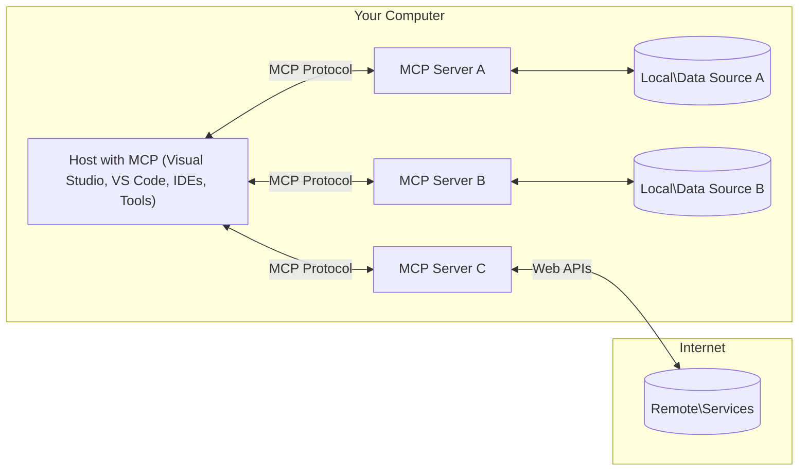

<!--
CO_OP_TRANSLATOR_METADATA:
{
  "original_hash": "11010ad254e48628bb6a457be2211640",
  "translation_date": "2025-08-12T08:06:25+00:00",
  "source_file": "01-CoreConcepts/README.md",
  "language_code": "fa"
}
-->
# 📖 مفاهیم اصلی MCP: تسلط بر پروتکل مدل کانتکست برای یکپارچه‌سازی هوش مصنوعی

[](https://youtu.be/earDzWGtE84)

_(برای مشاهده ویدئوی این درس، روی تصویر بالا کلیک کنید)_

[Model Context Protocol (MCP)](https://github.com/modelcontextprotocol) یک چارچوب استاندارد و قدرتمند است که ارتباط بین مدل‌های زبانی بزرگ (LLMs) و ابزارها، برنامه‌ها و منابع داده خارجی را بهینه می‌کند. این راهنما شما را با مفاهیم اصلی MCP آشنا می‌کند و اطمینان می‌دهد که معماری کلاینت-سرور، اجزای اساسی، مکانیزم‌های ارتباطی و بهترین شیوه‌های پیاده‌سازی آن را درک کنید.

## مرور کلی

این درس به بررسی معماری و اجزای اساسی که اکوسیستم Model Context Protocol (MCP) را تشکیل می‌دهند، می‌پردازد. شما با معماری کلاینت-سرور، اجزای کلیدی و مکانیزم‌های ارتباطی که تعاملات MCP را ممکن می‌سازند، آشنا خواهید شد.

## 👩‍🎓 اهداف کلیدی یادگیری

در پایان این درس، شما:

- معماری کلاینت-سرور MCP را درک خواهید کرد.
- نقش‌ها و مسئولیت‌های میزبان‌ها، کلاینت‌ها و سرورها را شناسایی خواهید کرد.
- ویژگی‌های اصلی که MCP را به یک لایه یکپارچه‌سازی انعطاف‌پذیر تبدیل می‌کند، تحلیل خواهید کرد.
- نحوه جریان اطلاعات در اکوسیستم MCP را یاد خواهید گرفت.
- از طریق مثال‌های کدنویسی در .NET، جاوا، پایتون و جاوااسکریپت، بینش‌های عملی کسب خواهید کرد.

## 🔎 معماری MCP: بررسی عمیق‌تر

اکوسیستم MCP بر اساس یک مدل کلاینت-سرور ساخته شده است. این ساختار ماژولار به برنامه‌های هوش مصنوعی اجازه می‌دهد تا به طور کارآمد با ابزارها، پایگاه‌های داده، APIها و منابع زمینه‌ای تعامل داشته باشند. بیایید این معماری را به اجزای اصلی آن تقسیم کنیم.

در هسته خود، MCP از معماری کلاینت-سرور پیروی می‌کند که در آن یک برنامه میزبان می‌تواند به چندین سرور متصل شود:



- **میزبان‌های MCP**: برنامه‌هایی مانند VSCode، Claude Desktop، IDEها یا ابزارهای هوش مصنوعی که می‌خواهند از طریق MCP به داده‌ها دسترسی پیدا کنند.
- **کلاینت‌های MCP**: کلاینت‌های پروتکل که ارتباطات ۱:۱ با سرورها را حفظ می‌کنند.
- **سرورهای MCP**: برنامه‌های سبک که هر کدام قابلیت‌های خاصی را از طریق پروتکل استاندارد Model Context ارائه می‌دهند.
- **منابع داده محلی**: فایل‌ها، پایگاه‌های داده و خدمات کامپیوتر شما که سرورهای MCP می‌توانند به صورت امن به آنها دسترسی داشته باشند.
- **خدمات راه دور**: سیستم‌های خارجی که از طریق اینترنت در دسترس هستند و سرورهای MCP می‌توانند از طریق APIها به آنها متصل شوند.

پروتکل MCP یک استاندارد در حال تکامل است. می‌توانید آخرین به‌روزرسانی‌های [مشخصات پروتکل](https://modelcontextprotocol.io/specification/2025-06-18/) را مشاهده کنید.

### 1. میزبان‌ها

در پروتکل Model Context (MCP)، میزبان‌ها نقش مهمی به عنوان رابط اصلی که کاربران از طریق آن با پروتکل تعامل دارند، ایفا می‌کنند. میزبان‌ها برنامه‌ها یا محیط‌هایی هستند که ارتباط با سرورهای MCP را برای دسترسی به داده‌ها، ابزارها و درخواست‌ها آغاز می‌کنند. نمونه‌هایی از میزبان‌ها شامل محیط‌های توسعه یکپارچه (IDEs) مانند Visual Studio Code، ابزارهای هوش مصنوعی مانند Claude Desktop یا عوامل سفارشی‌سازی شده برای وظایف خاص هستند.

**میزبان‌ها** برنامه‌هایی هستند که ارتباط با LLMها را آغاز می‌کنند. آنها:

- مدل‌های هوش مصنوعی را اجرا یا با آنها تعامل می‌کنند تا پاسخ‌ها را تولید کنند.
- ارتباط با سرورهای MCP را آغاز می‌کنند.
- جریان مکالمه و رابط کاربری را مدیریت می‌کنند.
- محدودیت‌های مجوز و امنیت را کنترل می‌کنند.
- رضایت کاربر برای اشتراک داده‌ها و اجرای ابزارها را مدیریت می‌کنند.

### 2. کلاینت‌ها

کلاینت‌ها اجزای اساسی هستند که تعامل بین میزبان‌ها و سرورهای MCP را تسهیل می‌کنند. کلاینت‌ها به عنوان واسطه عمل می‌کنند و به میزبان‌ها امکان دسترسی و استفاده از قابلیت‌های ارائه شده توسط سرورهای MCP را می‌دهند. آنها نقش مهمی در تضمین ارتباط روان و تبادل داده کارآمد در معماری MCP ایفا می‌کنند.

**کلاینت‌ها** اتصالاتی درون برنامه میزبان هستند. آنها:

- درخواست‌ها را با درخواست‌ها/دستورالعمل‌ها به سرورها ارسال می‌کنند.
- قابلیت‌ها را با سرورها مذاکره می‌کنند.
- درخواست‌های اجرای ابزار از مدل‌ها را مدیریت می‌کنند.
- پاسخ‌ها را پردازش و به کاربران نمایش می‌دهند.

### 3. سرورها

سرورها مسئول پردازش درخواست‌ها از کلاینت‌های MCP و ارائه پاسخ‌های مناسب هستند. معمولاً سرورها به عنوان ابزارهایی عمل می‌کنند که قابلیت خاصی را به LLM ارائه می‌دهند. آنها عملیات مختلفی مانند بازیابی داده‌ها، اجرای ابزار و تولید درخواست‌ها را مدیریت می‌کنند. سرورها اطمینان حاصل می‌کنند که ارتباط بین کلاینت‌ها و میزبان‌ها کارآمد و قابل اعتماد است و یکپارچگی فرآیند تعامل را حفظ می‌کنند.

**سرورها** خدماتی هستند که زمینه و قابلیت‌ها را ارائه می‌دهند. آنها:

- ویژگی‌های موجود (منابع، درخواست‌ها، ابزارها) را ثبت می‌کنند.
- تماس‌های ابزار را از کلاینت دریافت و اجرا می‌کنند.
- اطلاعات زمینه‌ای را برای بهبود پاسخ‌های مدل ارائه می‌دهند.
- خروجی‌ها را به کلاینت بازمی‌گردانند.
- در صورت نیاز، وضعیت را در تعاملات حفظ می‌کنند.

سرورها می‌توانند توسط هر کسی برای گسترش قابلیت‌های مدل با عملکردهای تخصصی توسعه یابند.

### 4. ویژگی‌های سرور

سرورها در پروتکل Model Context (MCP) بلوک‌های سازنده اساسی را ارائه می‌دهند که تعاملات غنی بین کلاینت‌ها، میزبان‌ها و مدل‌های زبانی را ممکن می‌سازند. این ویژگی‌ها برای افزایش قابلیت‌های MCP با ارائه زمینه ساختاریافته، ابزارها و درخواست‌ها طراحی شده‌اند.

سرورهای MCP می‌توانند هر یک از ویژگی‌های زیر را ارائه دهند:

#### 📑 منابع

منابع در پروتکل Model Context (MCP) شامل انواع مختلفی از زمینه و داده هستند که می‌توانند توسط کاربران یا مدل‌های هوش مصنوعی استفاده شوند. این موارد شامل:

- **داده‌های زمینه‌ای**: اطلاعات و زمینه‌ای که کاربران یا مدل‌های هوش مصنوعی می‌توانند برای تصمیم‌گیری و اجرای وظایف از آن استفاده کنند.
- **پایگاه‌های دانش و مخازن اسناد**: مجموعه‌هایی از داده‌های ساختاریافته و غیرساختاریافته، مانند مقالات، راهنماها و مقالات تحقیقاتی که بینش‌ها و اطلاعات ارزشمندی ارائه می‌دهند.
- **فایل‌ها و پایگاه‌های داده محلی**: داده‌هایی که به صورت محلی روی دستگاه‌ها یا در پایگاه‌های داده ذخیره شده‌اند و برای پردازش و تحلیل قابل دسترسی هستند.
- **APIها و خدمات وب**: رابط‌ها و خدمات خارجی که داده‌ها و قابلیت‌های اضافی ارائه می‌دهند و امکان یکپارچه‌سازی با منابع و ابزارهای آنلاین مختلف را فراهم می‌کنند.

یک نمونه از منبع می‌تواند یک طرح پایگاه داده یا فایلی باشد که می‌توان به این صورت به آن دسترسی داشت:

```text
file://log.txt
database://schema
```

### 🤖 درخواست‌ها

درخواست‌ها در پروتکل Model Context (MCP) شامل الگوهای از پیش تعریف‌شده و الگوهای تعاملی هستند که برای ساده‌سازی جریان‌های کاری کاربران و بهبود ارتباط طراحی شده‌اند. این موارد شامل:

- **پیام‌ها و جریان‌های کاری قالب‌بندی‌شده**: پیام‌ها و فرآیندهای از پیش ساختاریافته که کاربران را در انجام وظایف و تعاملات خاص راهنمایی می‌کنند.
- **الگوهای تعاملی از پیش تعریف‌شده**: توالی‌های استاندارد اقدامات و پاسخ‌ها که ارتباطات سازگار و کارآمد را تسهیل می‌کنند.
- **الگوهای مکالمه تخصصی**: الگوهای قابل تنظیم که برای انواع خاصی از مکالمات طراحی شده‌اند و تعاملات مرتبط و مناسب با زمینه را تضمین می‌کنند.

یک الگوی درخواست می‌تواند به این صورت باشد:

```markdown
Generate a product slogan based on the following {{product}} with the following {{keywords}}
```

#### ⛏️ ابزارها

ابزارها در پروتکل Model Context (MCP) توابعی هستند که مدل هوش مصنوعی می‌تواند برای انجام وظایف خاص اجرا کند. این ابزارها برای افزایش قابلیت‌های مدل هوش مصنوعی با ارائه عملیات ساختاریافته و قابل اعتماد طراحی شده‌اند. جنبه‌های کلیدی شامل:

- **توابعی برای اجرای مدل هوش مصنوعی**: ابزارها توابع اجرایی هستند که مدل هوش مصنوعی می‌تواند برای انجام وظایف مختلف فراخوانی کند.
- **نام و توضیحات منحصربه‌فرد**: هر ابزار دارای نامی متمایز و توضیحی دقیق است که هدف و عملکرد آن را توضیح می‌دهد.
- **پارامترها و خروجی‌ها**: ابزارها پارامترهای خاصی را می‌پذیرند و خروجی‌های ساختاریافته‌ای را بازمی‌گردانند و نتایج سازگار و قابل پیش‌بینی را تضمین می‌کنند.
- **توابع مجزا**: ابزارها وظایف مجزایی مانند جستجوی وب، محاسبات و پرس‌وجوهای پایگاه داده را انجام می‌دهند.

یک نمونه ابزار می‌تواند به این صورت باشد:

```typescript
server.tool(
  "GetProducts",
  {
    pageSize: z.string().optional(),
    pageCount: z.string().optional()
  }, () => {
    // return results from API
  }
)
```

## ویژگی‌های کلاینت

در پروتکل Model Context (MCP)، کلاینت‌ها چندین ویژگی کلیدی به سرورها ارائه می‌دهند و عملکرد کلی و تعامل در پروتکل را افزایش می‌دهند. یکی از ویژگی‌های قابل توجه، نمونه‌گیری است.

### 👉 نمونه‌گیری

- **رفتارهای عامل‌محور آغازشده توسط سرور**: کلاینت‌ها به سرورها اجازه می‌دهند تا اقدامات یا رفتارهای خاصی را به طور خودکار آغاز کنند و قابلیت‌های پویا سیستم را افزایش دهند.
- **تعاملات بازگشتی با LLMها**: این ویژگی امکان تعاملات بازگشتی با مدل‌های زبانی بزرگ (LLMs) را فراهم می‌کند و پردازش پیچیده‌تر و تکراری وظایف را ممکن می‌سازد.
- **درخواست تکمیل‌های اضافی مدل**: سرورها می‌توانند تکمیل‌های اضافی از مدل درخواست کنند و اطمینان حاصل کنند که پاسخ‌ها جامع و مرتبط با زمینه هستند.

## جریان اطلاعات در MCP

پروتکل Model Context (MCP) جریان ساختاریافته‌ای از اطلاعات بین میزبان‌ها، کلاینت‌ها، سرورها و مدل‌ها تعریف می‌کند. درک این جریان به روشن شدن نحوه پردازش درخواست‌های کاربر و نحوه یکپارچه‌سازی ابزارها و داده‌های خارجی در پاسخ‌های مدل کمک می‌کند.

- **آغاز اتصال توسط میزبان**  
  برنامه میزبان (مانند یک IDE یا رابط چت) اتصال به یک سرور MCP را معمولاً از طریق STDIO، WebSocket یا یک لایه انتقال پشتیبانی‌شده دیگر برقرار می‌کند.

- **مذاکره قابلیت‌ها**  
  کلاینت (جاسازی‌شده در میزبان) و سرور اطلاعاتی درباره ویژگی‌های پشتیبانی‌شده، ابزارها، منابع و نسخه‌های پروتکل تبادل می‌کنند. این کار اطمینان می‌دهد که هر دو طرف قابلیت‌های موجود برای جلسه را درک می‌کنند.

- **درخواست کاربر**  
  کاربر با میزبان تعامل می‌کند (مثلاً یک درخواست یا فرمان وارد می‌کند). میزبان این ورودی را جمع‌آوری کرده و برای پردازش به کلاینت ارسال می‌کند.

- **استفاده از منابع یا ابزارها**  
  - کلاینت ممکن است زمینه یا منابع اضافی از سرور درخواست کند (مانند فایل‌ها، ورودی‌های پایگاه داده یا مقالات پایگاه دانش) تا درک مدل را غنی‌تر کند.
  - اگر مدل تشخیص دهد که ابزاری مورد نیاز است (مثلاً برای بازیابی داده، انجام محاسبه یا فراخوانی یک API)، کلاینت درخواست فراخوانی ابزار را به سرور ارسال می‌کند و نام ابزار و پارامترها را مشخص می‌کند.

- **اجرای سرور**  
  سرور درخواست منبع یا ابزار را دریافت می‌کند، عملیات لازم را اجرا می‌کند (مانند اجرای یک تابع، پرس‌وجوی پایگاه داده یا بازیابی یک فایل) و نتایج را به صورت ساختاریافته به کلاینت بازمی‌گرداند.

- **تولید پاسخ**  
  کلاینت پاسخ‌های سرور (داده‌های منابع، خروجی ابزارها و غیره) را در تعامل مدل جاری ادغام می‌کند. مدل از این اطلاعات برای تولید پاسخی جامع و مرتبط با زمینه استفاده می‌کند.

- **ارائه نتیجه**  
  میزبان خروجی نهایی را از کلاینت دریافت کرده و به کاربر ارائه می‌دهد، که اغلب شامل متن تولیدشده توسط مدل و هر نتیجه‌ای از اجرای ابزارها یا جستجوی منابع است.

این جریان به MCP امکان می‌دهد تا از برنامه‌های هوش مصنوعی پیشرفته، تعاملی و آگاه به زمینه با اتصال یکپارچه مدل‌ها به ابزارها و منابع داده خارجی پشتیبانی کند.

## جزئیات پروتکل

MCP (Model Context Protocol) بر اساس [JSON-RPC 2.0](https://www.jsonrpc.org/) ساخته شده است و یک قالب پیام استاندارد و زبان‌محور برای ارتباط بین میزبان‌ها، کلاینت‌ها و سرورها ارائه می‌دهد. این پایه‌گذاری تعاملات قابل اعتماد، ساختاریافته و قابل گسترش را در پلتفرم‌ها و زبان‌های برنامه‌نویسی متنوع ممکن می‌سازد.

### ویژگی‌های کلیدی پروتکل

MCP JSON-RPC 2.0 را با قراردادهای اضافی برای فراخوانی ابزار، دسترسی به منابع و مدیریت درخواست‌ها گسترش می‌دهد. این پروتکل از چندین لایه انتقال (STDIO، WebSocket، SSE) پشتیبانی می‌کند و ارتباط امن، قابل گسترش و زبان‌محور بین اجزا را ممکن می‌سازد.

#### 🧢 پروتکل پایه

- **قالب پیام JSON-RPC**: تمام درخواست‌ها و پاسخ‌ها از مشخصات JSON-RPC 2.0 استفاده می‌کنند و ساختار سازگاری برای فراخوانی متدها، پارامترها، نتایج و مدیریت خطاها تضمین می‌کنند.
- **اتصالات حالت‌دار**: جلسات MCP حالت را در چندین درخواست حفظ می‌کنند و از مکالمات جاری، انباشت زمینه و مدیریت منابع پشتیبانی می‌کنند.
- **مذاکره قابلیت‌ها**: در طول راه‌اندازی اتصال، کلاینت‌ها و سرورها اطلاعاتی درباره ویژگی‌های پشتیبانی‌شده، نسخه‌های پروتکل، ابزارها و منابع موجود تبادل می‌کنند. این کار اطمینان می‌دهد که هر دو طرف قابلیت‌های یکدیگر را درک کرده و می‌توانند به طور مناسب سازگار شوند.

#### ➕ ابزارهای اضافی

در زیر برخی از ابزارهای اضافی و گسترش‌های پروتکل MCP آورده شده است که تجربه توسعه‌دهنده را بهبود می‌بخشند و سناریوهای پیشرفته را ممکن می‌سازند:

- **گزینه‌های پیکربندی**: MCP امکان پیکربندی پویا پارامترهای جلسه، مانند مجوزهای ابزار، دسترسی به منابع و تنظیمات مدل را فراهم می‌کند که برای هر تعامل سفارشی شده است.
- **ردیابی پیشرفت**: عملیات طولانی‌مدت می‌توانند به‌روزرسانی‌های پیشرفت را گزارش دهند و رابط‌های کاربری پاسخگو و تجربه کاربری بهتر را در طول وظایف پیچیده ممکن سازند.
- **لغو درخواست**: کلاینت‌ها می‌توانند درخواست‌های در حال اجرا را لغو کنند و به کاربران اجازه دهند عملیات‌هایی را که دیگر مورد نیاز نیستند یا زمان زیادی می‌برند، متوقف کنند.
- **گزارش خطا**: پیام‌ها و کدهای خطای استاندارد به تشخیص مشکلات، مدیریت شکست‌ها به صورت مناسب و ارائه بازخورد عملی به کاربران و توسعه‌دهندگان کمک می‌کنند.
- **ثبت وقایع**: هم کلاینت‌ها و هم سرورها می‌توانند گزارش‌های ساختاریافته‌ای برای حسابرسی، اشکال‌زدایی و نظارت بر تعاملات پروتکل منتشر کنند.

با استفاده از این ویژگی‌های پروتکل، MCP ارتباطی قوی، امن و انعطاف‌پذیر بین مدل‌های زبانی و ابزارها یا منابع داده خارجی تضمین می‌کند.

### 🔐 ملاحظات امنیتی

پیاده‌سازی‌های MCP باید به چندین اصل کلیدی امنیتی پایبند باشند تا تعاملات ایمن و قابل اعتماد را تضمین کنند:

- **رضایت و کنترل کاربر**: کاربران باید قبل از دسترسی به هر داده یا انجام هر عملیاتی رضایت صریح خود را ارائه دهند. آنها باید کنترل واضحی بر داده‌های به اشتراک گذاشته‌شده و اقدامات مجاز داشته باشند که توسط رابط‌های کاربری شهودی برای بررسی و تأیید فعالیت‌ها پشتیبانی می‌شود.

- **حریم خصوصی داده‌ها**: داده‌های کاربران فقط با رضایت صریح آنها باید افشا شوند و باید توسط کنترل‌های دسترسی مناسب محافظت شوند. پیاده‌سازی‌های MCP باید از انتقال غیرمجاز داده جلوگیری کرده و اطمینان حاصل کنند که حریم خصوصی در تمام تعاملات حفظ می‌شود.

- **ایمنی ابزارها**: قبل از فراخوانی هر ابزاری، رضایت صریح کاربر الزامی است. کاربران باید درک روشنی از عملکرد هر ابزار داشته باشند و مرزهای امنیتی قوی باید برای جلوگیری از اجرای ناخواسته یا ناایمن ابزارها اعمال شوند.

با پیروی از این اصول، MCP اطمینان می‌دهد که اعتماد،
این مثال نحوه ایجاد یک سرور MCP در جاوااسکریپت و ثبت دو ابزار مرتبط با آب‌وهوا را نشان می‌دهد.

```javascript
// Using the official Model Context Protocol SDK
import { McpServer } from "@modelcontextprotocol/sdk/server/mcp.js";
import { StdioServerTransport } from "@modelcontextprotocol/sdk/server/stdio.js";
import { z } from "zod"; // For parameter validation

// Create an MCP server
const server = new McpServer({
  name: "Weather MCP Server",
  version: "1.0.0"
});

// Define a weather tool
server.tool(
  "weatherTool",
  {
    location: z.string().describe("The location to get weather for")
  },
  async ({ location }) => {
    // This would normally call a weather API
    // Simplified for demonstration
    const weatherData = await getWeatherData(location);
    
    return {
      content: [
        { 
          type: "text", 
          text: `Temperature: ${weatherData.temperature}°F, Conditions: ${weatherData.conditions}, Location: ${weatherData.location}` 
        }
      ]
    };
  }
);

// Define a forecast tool
server.tool(
  "forecastTool",
  {
    location: z.string(),
    days: z.number().default(3).describe("Number of days for forecast")
  },
  async ({ location, days }) => {
    // This would normally call a weather API
    // Simplified for demonstration
    const forecast = await getForecastData(location, days);
    
    return {
      content: [
        { 
          type: "text", 
          text: `${days}-day forecast for ${location}: ${JSON.stringify(forecast)}` 
        }
      ]
    };
  }
);

// Helper functions
async function getWeatherData(location) {
  // Simulate API call
  return {
    temperature: 72.5,
    conditions: "Sunny",
    location: location
  };
}

async function getForecastData(location, days) {
  // Simulate API call
  return Array.from({ length: days }, (_, i) => ({
    day: i + 1,
    temperature: 70 + Math.floor(Math.random() * 10),
    conditions: i % 2 === 0 ? "Sunny" : "Partly Cloudy"
  }));
}

// Connect the server using stdio transport
const transport = new StdioServerTransport();
server.connect(transport).catch(console.error);

console.log("Weather MCP Server started");
```

این مثال جاوااسکریپت نشان می‌دهد که چگونه یک کلاینت MCP ایجاد کنید که به سرور متصل شود، یک درخواست ارسال کند و پاسخ را پردازش کند، از جمله هرگونه فراخوانی ابزاری که انجام شده است.

## امنیت و مجوزها

MCP شامل چندین مفهوم و مکانیزم داخلی برای مدیریت امنیت و مجوزها در سراسر پروتکل است:

1. **کنترل مجوز ابزار**:  
   کلاینت‌ها می‌توانند مشخص کنند که کدام ابزارها مجاز به استفاده توسط مدل در طول یک جلسه هستند. این کار تضمین می‌کند که تنها ابزارهای صریحاً مجاز در دسترس باشند و خطر عملیات ناخواسته یا ناامن کاهش یابد. مجوزها می‌توانند به صورت پویا بر اساس ترجیحات کاربر، سیاست‌های سازمانی یا زمینه تعامل تنظیم شوند.

2. **احراز هویت**:  
   سرورها می‌توانند قبل از اعطای دسترسی به ابزارها، منابع یا عملیات حساس، احراز هویت را الزامی کنند. این ممکن است شامل کلیدهای API، توکن‌های OAuth یا سایر روش‌های احراز هویت باشد. احراز هویت مناسب تضمین می‌کند که تنها کلاینت‌ها و کاربران مورد اعتماد می‌توانند قابلیت‌های سمت سرور را فراخوانی کنند.

3. **اعتبارسنجی**:  
   اعتبارسنجی پارامترها برای تمام فراخوانی‌های ابزار اعمال می‌شود. هر ابزار انواع، قالب‌ها و محدودیت‌های مورد انتظار برای پارامترهای خود را تعریف می‌کند و سرور درخواست‌های ورودی را بر این اساس اعتبارسنجی می‌کند. این کار از رسیدن ورودی‌های نادرست یا مخرب به پیاده‌سازی ابزار جلوگیری می‌کند و به حفظ یکپارچگی عملیات کمک می‌کند.

4. **محدودیت نرخ**:  
   برای جلوگیری از سوءاستفاده و اطمینان از استفاده منصفانه از منابع سرور، سرورهای MCP می‌توانند محدودیت نرخ را برای فراخوانی ابزارها و دسترسی به منابع اعمال کنند. محدودیت‌های نرخ می‌توانند به ازای هر کاربر، هر جلسه یا به صورت کلی اعمال شوند و از حملات انکار سرویس یا مصرف بیش از حد منابع جلوگیری کنند.

با ترکیب این مکانیزم‌ها، MCP یک پایه امن برای یکپارچه‌سازی مدل‌های زبانی با ابزارها و منابع داده خارجی فراهم می‌کند، در حالی که کنترل دقیق دسترسی و استفاده را به کاربران و توسعه‌دهندگان می‌دهد.

## پیام‌های پروتکل

ارتباطات MCP از پیام‌های ساختاریافته JSON برای تسهیل تعاملات شفاف و قابل اعتماد بین کلاینت‌ها، سرورها و مدل‌ها استفاده می‌کند. انواع اصلی پیام‌ها شامل موارد زیر است:

- **درخواست کلاینت**  
  این پیام از کلاینت به سرور ارسال می‌شود و معمولاً شامل موارد زیر است:
  - درخواست یا فرمان کاربر
  - تاریخچه مکالمه برای زمینه
  - پیکربندی و مجوزهای ابزار
  - هرگونه اطلاعات اضافی یا اطلاعات جلسه

- **پاسخ مدل**  
  این پیام توسط مدل (از طریق کلاینت) بازگردانده می‌شود و شامل موارد زیر است:
  - متن تولید شده یا تکمیل بر اساس درخواست و زمینه
  - دستورالعمل‌های اختیاری فراخوانی ابزار در صورتی که مدل تشخیص دهد ابزاری باید فراخوانی شود
  - ارجاعات به منابع یا زمینه اضافی در صورت نیاز

- **درخواست ابزار**  
  این پیام زمانی از کلاینت به سرور ارسال می‌شود که ابزاری نیاز به اجرا داشته باشد. این پیام شامل موارد زیر است:
  - نام ابزاری که باید فراخوانی شود
  - پارامترهای مورد نیاز ابزار (اعتبارسنجی شده بر اساس طرح ابزار)
  - اطلاعات زمینه‌ای یا شناسه‌ها برای ردیابی درخواست

- **پاسخ ابزار**  
  این پیام پس از اجرای ابزار توسط سرور بازگردانده می‌شود و شامل موارد زیر است:
  - نتایج اجرای ابزار (داده‌های ساختاریافته یا محتوا)
  - هرگونه خطا یا اطلاعات وضعیت در صورت شکست فراخوانی ابزار
  - در صورت لزوم، اطلاعات اضافی یا گزارش‌های مرتبط با اجرا

این پیام‌های ساختاریافته تضمین می‌کنند که هر مرحله در جریان کار MCP شفاف، قابل ردیابی و قابل گسترش است و از سناریوهای پیشرفته‌ای مانند مکالمات چندمرحله‌ای، زنجیره‌سازی ابزارها و مدیریت خطای قوی پشتیبانی می‌کند.

## نکات کلیدی

- MCP از معماری کلاینت-سرور برای اتصال مدل‌ها به قابلیت‌های خارجی استفاده می‌کند.
- اکوسیستم شامل کلاینت‌ها، میزبان‌ها، سرورها، ابزارها و منابع داده است.
- ارتباطات می‌تواند از طریق STDIO، SSE یا WebSockets انجام شود.
- ابزارها واحدهای اساسی عملکردی هستند که به مدل‌ها ارائه می‌شوند.
- پروتکل‌های ارتباطی ساختاریافته تعاملات سازگار را تضمین می‌کنند.

## تمرین

یک ابزار ساده MCP طراحی کنید که در حوزه شما مفید باشد. مشخص کنید:
1. نام ابزار چه خواهد بود
2. چه پارامترهایی را می‌پذیرد
3. چه خروجی‌ای بازمی‌گرداند
4. چگونه یک مدل ممکن است از این ابزار برای حل مشکلات کاربران استفاده کند

---

## مرحله بعدی

بعدی: [فصل ۲: امنیت](../02-Security/README.md)

**سلب مسئولیت**:  
این سند با استفاده از سرویس ترجمه هوش مصنوعی [Co-op Translator](https://github.com/Azure/co-op-translator) ترجمه شده است. در حالی که ما تلاش می‌کنیم دقت را حفظ کنیم، لطفاً توجه داشته باشید که ترجمه‌های خودکار ممکن است شامل خطاها یا نادرستی‌ها باشند. سند اصلی به زبان اصلی آن باید به عنوان منبع معتبر در نظر گرفته شود. برای اطلاعات حساس، ترجمه حرفه‌ای انسانی توصیه می‌شود. ما مسئولیتی در قبال سوء تفاهم‌ها یا تفسیرهای نادرست ناشی از استفاده از این ترجمه نداریم.