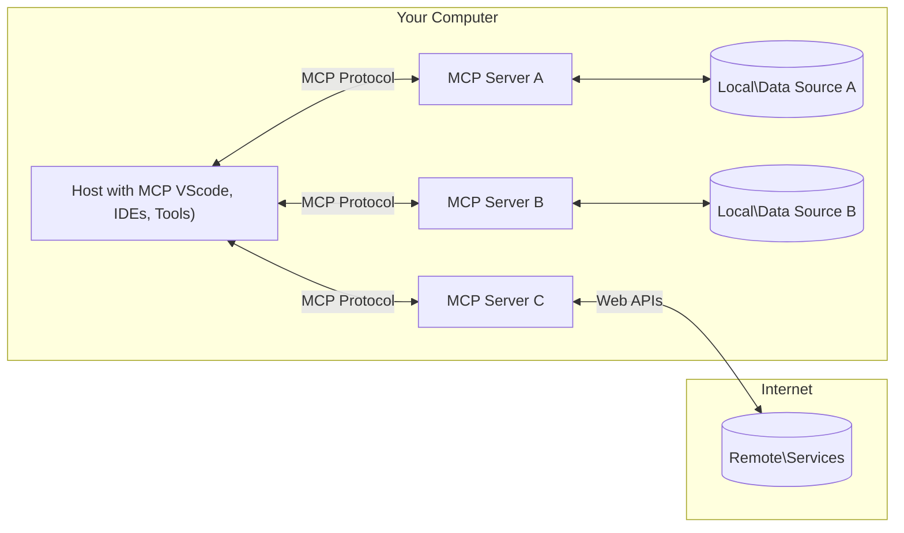

<!--
CO_OP_TRANSLATOR_METADATA:
{
  "original_hash": "355b12a5970c5c9e6db0bee970c751ba",
  "translation_date": "2025-07-04T15:43:17+00:00",
  "source_file": "01-CoreConcepts/README.md",
  "language_code": "fa"
}
-->
# 📖 مفاهیم اصلی MCP: تسلط بر پروتکل مدل کانتکست برای یکپارچه‌سازی هوش مصنوعی

[پروتکل مدل کانتکست (MCP)](https://github.com/modelcontextprotocol) یک چارچوب قدرتمند و استاندارد شده است که ارتباط بین مدل‌های زبانی بزرگ (LLM) و ابزارها، برنامه‌ها و منابع داده خارجی را بهینه می‌کند. این راهنمای بهینه‌شده برای سئو، شما را با مفاهیم اصلی MCP آشنا می‌کند و اطمینان می‌دهد که معماری کلاینت-سرور، اجزای اساسی، مکانیزم‌های ارتباطی و بهترین روش‌های پیاده‌سازی آن را به خوبی درک کنید.

## مرور کلی

این درس به بررسی معماری بنیادی و اجزایی می‌پردازد که اکوسیستم پروتکل مدل کانتکست (MCP) را تشکیل می‌دهند. شما با معماری کلاینت-سرور، اجزای کلیدی و مکانیزم‌های ارتباطی که تعاملات MCP را ممکن می‌سازند، آشنا خواهید شد.

## 👩‍🎓 اهداف کلیدی یادگیری

در پایان این درس، شما قادر خواهید بود:

- معماری کلاینت-سرور MCP را درک کنید.
- نقش‌ها و مسئولیت‌های Hosts، Clients و Servers را شناسایی کنید.
- ویژگی‌های اصلی که MCP را به یک لایه یکپارچه‌سازی انعطاف‌پذیر تبدیل می‌کنند، تحلیل کنید.
- جریان اطلاعات در اکوسیستم MCP را بیاموزید.
- از طریق مثال‌های کد در .NET، Java، Python و JavaScript، دیدگاه‌های عملی کسب کنید.

## 🔎 معماری MCP: نگاهی عمیق‌تر

اکوسیستم MCP بر پایه مدل کلاینت-سرور ساخته شده است. این ساختار مدولار به برنامه‌های هوش مصنوعی اجازه می‌دهد تا به طور مؤثر با ابزارها، پایگاه‌های داده، APIها و منابع متنی تعامل داشته باشند. بیایید این معماری را به اجزای اصلی آن تقسیم کنیم.

در اصل، MCP از معماری کلاینت-سرور پیروی می‌کند که در آن یک برنامه میزبان می‌تواند به چندین سرور متصل شود:



- **MCP Hosts**: برنامه‌هایی مانند VSCode، Claude Desktop، محیط‌های توسعه یکپارچه (IDEs) یا ابزارهای هوش مصنوعی که می‌خواهند از طریق MCP به داده‌ها دسترسی پیدا کنند
- **MCP Clients**: کلاینت‌های پروتکل که ارتباط ۱:۱ با سرورها را حفظ می‌کنند
- **MCP Servers**: برنامه‌های سبک‌وزنی که هر کدام قابلیت‌های خاصی را از طریق پروتکل استاندارد شده مدل کانتکست ارائه می‌دهند
- **منابع داده محلی**: فایل‌ها، پایگاه‌های داده و سرویس‌های کامپیوتر شما که سرورهای MCP می‌توانند به صورت امن به آن‌ها دسترسی داشته باشند
- **سرویس‌های راه دور**: سیستم‌های خارجی که از طریق اینترنت در دسترس هستند و سرورهای MCP می‌توانند از طریق APIها به آن‌ها متصل شوند.

پروتکل MCP یک استاندارد در حال توسعه است و می‌توانید آخرین به‌روزرسانی‌ها را در [مشخصات پروتکل](https://modelcontextprotocol.io/specification/2025-06-18/) مشاهده کنید.

### ۱. Hosts

در پروتکل مدل کانتکست (MCP)، Hosts نقش حیاتی به عنوان رابط اصلی دارند که کاربران از طریق آن با پروتکل تعامل می‌کنند. Hosts برنامه‌ها یا محیط‌هایی هستند که اتصال به سرورهای MCP را برای دسترسی به داده‌ها، ابزارها و پرامپت‌ها آغاز می‌کنند. نمونه‌هایی از Hosts شامل محیط‌های توسعه یکپارچه (IDEs) مانند Visual Studio Code، ابزارهای هوش مصنوعی مانند Claude Desktop یا عوامل سفارشی ساخته شده برای وظایف خاص هستند.

**Hosts** برنامه‌های LLM هستند که اتصال را آغاز می‌کنند. آن‌ها:

- مدل‌های هوش مصنوعی را اجرا یا با آن‌ها تعامل می‌کنند تا پاسخ تولید کنند.
- اتصال به سرورهای MCP را آغاز می‌کنند.
- جریان گفتگو و رابط کاربری را مدیریت می‌کنند.
- کنترل مجوزها و محدودیت‌های امنیتی را بر عهده دارند.
- رضایت کاربر برای اشتراک‌گذاری داده‌ها و اجرای ابزارها را مدیریت می‌کنند.

### ۲. Clients

Clients اجزای ضروری هستند که تعامل بین Hosts و سرورهای MCP را تسهیل می‌کنند. Clients به عنوان واسطه عمل می‌کنند و به Hosts اجازه می‌دهند تا از قابلیت‌های ارائه شده توسط سرورهای MCP استفاده کنند. آن‌ها نقش مهمی در تضمین ارتباط روان و تبادل داده مؤثر در معماری MCP دارند.

**Clients** کانکتورهایی درون برنامه میزبان هستند. آن‌ها:

- درخواست‌ها را با پرامپت‌ها/دستورالعمل‌ها به سرورها ارسال می‌کنند.
- قابلیت‌ها را با سرورها مذاکره می‌کنند.
- درخواست‌های اجرای ابزار از مدل‌ها را مدیریت می‌کنند.
- پاسخ‌ها را پردازش و به کاربران نمایش می‌دهند.

### ۳. Servers

سرورها مسئول رسیدگی به درخواست‌های کلاینت‌های MCP و ارائه پاسخ‌های مناسب هستند. آن‌ها عملیات مختلفی مانند بازیابی داده، اجرای ابزار و تولید پرامپت را مدیریت می‌کنند. سرورها اطمینان می‌دهند که ارتباط بین کلاینت‌ها و Hosts به صورت مؤثر و قابل اعتماد انجام شود و یکپارچگی فرآیند تعامل حفظ شود.

**Servers** سرویس‌هایی هستند که کانتکست و قابلیت‌ها را فراهم می‌کنند. آن‌ها:

- ویژگی‌های موجود (منابع، پرامپت‌ها، ابزارها) را ثبت می‌کنند
- درخواست‌های اجرای ابزار از کلاینت را دریافت و اجرا می‌کنند
- اطلاعات متنی برای بهبود پاسخ‌های مدل فراهم می‌کنند
- خروجی‌ها را به کلاینت بازمی‌گردانند
- در صورت نیاز، وضعیت را در طول تعاملات حفظ می‌کنند

سرورها می‌توانند توسط هر کسی توسعه داده شوند تا قابلیت‌های مدل را با عملکردهای تخصصی گسترش دهند.

### ۴. ویژگی‌های سرور

سرورها در پروتکل مدل کانتکست (MCP) بلوک‌های بنیادی را فراهم می‌کنند که تعاملات غنی بین کلاینت‌ها، میزبان‌ها و مدل‌های زبانی را ممکن می‌سازند. این ویژگی‌ها برای افزایش قابلیت‌های MCP با ارائه کانتکست ساختاریافته، ابزارها و پرامپت‌ها طراحی شده‌اند.

سرورهای MCP می‌توانند هر یک از ویژگی‌های زیر را ارائه دهند:

#### 📑 منابع

منابع در پروتکل مدل کانتکست (MCP) شامل انواع مختلفی از کانتکست و داده‌ها هستند که کاربران یا مدل‌های هوش مصنوعی می‌توانند از آن‌ها استفاده کنند. این موارد شامل:

- **داده‌های متنی**: اطلاعات و کانتکستی که کاربران یا مدل‌های هوش مصنوعی می‌توانند برای تصمیم‌گیری و اجرای وظایف از آن بهره ببرند.
- **پایگاه‌های دانش و مخازن اسناد**: مجموعه‌هایی از داده‌های ساختاریافته و غیرساختاریافته مانند مقالات، راهنماها و مقالات پژوهشی که بینش‌ها و اطلاعات ارزشمندی ارائه می‌دهند.
- **فایل‌ها و پایگاه‌های داده محلی**: داده‌هایی که به صورت محلی روی دستگاه‌ها یا در پایگاه‌های داده ذخیره شده‌اند و برای پردازش و تحلیل در دسترس هستند.
- **APIها و سرویس‌های وب**: رابط‌ها و سرویس‌های خارجی که داده‌ها و قابلیت‌های اضافی ارائه می‌دهند و امکان یکپارچه‌سازی با منابع و ابزارهای آنلاین مختلف را فراهم می‌کنند.

مثالی از یک منبع می‌تواند یک طرح پایگاه داده یا فایلی باشد که به این شکل قابل دسترسی است:

```text
file://log.txt
database://schema
```

### 🤖 پرامپت‌ها

پرامپت‌ها در پروتکل مدل کانتکست (MCP) شامل قالب‌ها و الگوهای تعاملی از پیش تعریف شده هستند که برای ساده‌سازی جریان‌های کاری کاربران و بهبود ارتباط طراحی شده‌اند. این موارد شامل:

- **پیام‌ها و جریان‌های کاری قالب‌بندی شده**: پیام‌ها و فرآیندهای از پیش ساختاربندی شده که کاربران را در انجام وظایف و تعاملات خاص راهنمایی می‌کنند.
- **الگوهای تعاملی از پیش تعریف شده**: توالی‌های استاندارد شده از اقدامات و پاسخ‌ها که ارتباطی سازگار و مؤثر را تسهیل می‌کنند.
- **قالب‌های مکالمه تخصصی**: قالب‌های قابل تنظیم که برای انواع خاصی از مکالمات طراحی شده‌اند تا تعاملات مرتبط و متناسب با کانتکست را تضمین کنند.

یک قالب پرامپت می‌تواند به این شکل باشد:

```markdown
Generate a product slogan based on the following {{product}} with the following {{keywords}}
```

#### ⛏️ ابزارها

ابزارها در پروتکل مدل کانتکست (MCP) توابعی هستند که مدل هوش مصنوعی می‌تواند برای انجام وظایف خاص اجرا کند. این ابزارها برای افزایش قابلیت‌های مدل هوش مصنوعی با ارائه عملیات ساختاریافته و قابل اعتماد طراحی شده‌اند. نکات کلیدی شامل:

- **توابعی که مدل هوش مصنوعی می‌تواند اجرا کند**: ابزارها توابع اجرایی هستند که مدل می‌تواند برای انجام وظایف مختلف فراخوانی کند.
- **نام و توضیح منحصر به فرد**: هر ابزار نامی متمایز و توضیح دقیقی دارد که هدف و عملکرد آن را شرح می‌دهد.
- **پارامترها و خروجی‌ها**: ابزارها پارامترهای خاصی را می‌پذیرند و خروجی‌های ساختاریافته‌ای ارائه می‌دهند که نتایج سازگار و قابل پیش‌بینی را تضمین می‌کند.
- **توابع مجزا**: ابزارها وظایف مجزایی مانند جستجوی وب، محاسبات و پرس‌وجوهای پایگاه داده را انجام می‌دهند.

مثالی از یک ابزار می‌تواند به این شکل باشد:

```typescript
server.tool(
  "GetProducts",
  {
    pageSize: z.string().optional(),
    pageCount: z.string().optional()
  }, () => {
    // return results from API
  }
)
```

## ویژگی‌های کلاینت

در پروتکل مدل کانتکست (MCP)، کلاینت‌ها چندین ویژگی کلیدی به سرورها ارائه می‌دهند که عملکرد کلی و تعامل درون پروتکل را بهبود می‌بخشد. یکی از ویژگی‌های قابل توجه، نمونه‌برداری (Sampling) است.

### 👉 نمونه‌برداری

- **رفتارهای عاملیت‌محور آغاز شده توسط سرور**: کلاینت‌ها به سرورها اجازه می‌دهند تا به طور خودکار اقدامات یا رفتارهای خاصی را آغاز کنند و قابلیت‌های پویا سیستم را افزایش دهند.
- **تعاملات بازگشتی با LLM**: این ویژگی امکان تعاملات بازگشتی با مدل‌های زبانی بزرگ را فراهم می‌کند و پردازش‌های پیچیده‌تر و تکراری وظایف را ممکن می‌سازد.
- **درخواست تکمیل‌های اضافی مدل**: سرورها می‌توانند درخواست تکمیل‌های بیشتری از مدل کنند تا پاسخ‌ها جامع‌تر و متناسب با کانتکست باشند.

## جریان اطلاعات در MCP

پروتکل مدل کانتکست (MCP) جریان ساختاریافته‌ای از اطلاعات بین میزبان‌ها، کلاینت‌ها، سرورها و مدل‌ها تعریف می‌کند. درک این جریان به روشن شدن نحوه پردازش درخواست‌های کاربر و چگونگی یکپارچه‌سازی ابزارها و داده‌های خارجی در پاسخ‌های مدل کمک می‌کند.

- **میزبان اتصال را آغاز می‌کند**  
  برنامه میزبان (مانند یک IDE یا رابط چت) اتصال به سرور MCP را برقرار می‌کند، معمولاً از طریق STDIO، WebSocket یا سایر روش‌های پشتیبانی شده.

- **مذاکره قابلیت‌ها**  
  کلاینت (که در میزبان تعبیه شده) و سرور اطلاعات مربوط به ویژگی‌ها، ابزارها، منابع و نسخه‌های پروتکل پشتیبانی شده را تبادل می‌کنند. این اطمینان می‌دهد که هر دو طرف قابلیت‌های موجود برای جلسه را می‌فهمند.

- **درخواست کاربر**  
  کاربر با میزبان تعامل می‌کند (مثلاً پرامپت یا فرمانی وارد می‌کند). میزبان این ورودی را جمع‌آوری کرده و برای پردازش به کلاینت ارسال می‌کند.

- **استفاده از منبع یا ابزار**  
  - کلاینت ممکن است درخواست کانتکست یا منابع اضافی از سرور کند (مانند فایل‌ها، ورودی‌های پایگاه داده یا مقالات پایگاه دانش) تا درک مدل را غنی‌تر کند.
  - اگر مدل تشخیص دهد که به ابزاری نیاز است (مثلاً برای دریافت داده، انجام محاسبه یا فراخوانی API)، کلاینت درخواست اجرای ابزار را به سرور ارسال می‌کند و نام ابزار و پارامترها را مشخص می‌کند.

- **اجرای سرور**  
  سرور درخواست منبع یا ابزار را دریافت کرده، عملیات لازم را اجرا می‌کند (مانند اجرای تابع، پرس‌وجوی پایگاه داده یا بازیابی فایل) و نتایج را به صورت ساختاریافته به کلاینت بازمی‌گرداند.

- **تولید پاسخ**  
  کلاینت پاسخ‌های سرور (داده‌های منبع، خروجی ابزار و غیره) را در تعامل جاری مدل ادغام می‌کند. مدل از این اطلاعات برای تولید پاسخ جامع و متناسب با کانتکست استفاده می‌کند.

- **ارائه نتیجه**  
  میزبان خروجی نهایی را از کلاینت دریافت کرده و به کاربر نمایش می‌دهد، که معمولاً شامل متن تولید شده توسط مدل و هر نتیجه‌ای از اجرای ابزارها یا جستجوی منابع است.

این جریان به MCP امکان می‌دهد برنامه‌های هوش مصنوعی پیشرفته، تعاملی و آگاه به کانتکست را با اتصال بی‌وقفه مدل‌ها به ابزارها و منابع داده خارجی پشتیبانی کند.

## جزئیات پروتکل

MCP (پروتکل مدل کانتکست) بر پایه [JSON-RPC 2.0](https://www.jsonrpc.org/) ساخته شده است و قالب پیام استاندارد، مستقل از زبان برنامه‌نویسی را برای ارتباط بین میزبان‌ها، کلاینت‌ها و سرورها فراهم می‌کند. این پایه امکان تعاملات قابل اعتماد، ساختاریافته و قابل توسعه را در پلتفرم‌ها و زبان‌های برنامه‌نویسی مختلف فراهم می‌کند.

### ویژگی‌های کلیدی پروتکل

MCP با افزودن قراردادهای اضافی برای فراخوانی ابزار، دسترسی به منابع و مدیریت پرامپت، JSON-RPC 2.0 را گسترش می‌دهد. این پروتکل از چندین لایه انتقال (STDIO، WebSocket، SSE) پشتیبانی می‌کند و ارتباط امن، قابل توسعه و مستقل از زبان را بین اجزا ممکن می‌سازد.

#### 🧢 پروتکل پایه

- **قالب پیام JSON-RPC**: تمام درخواست‌ها و پاسخ‌ها از مشخصات JSON-RPC 2.0 پیروی می‌کنند که ساختار یکسانی برای فراخوانی متدها، پارامترها، نتایج و مدیریت خطاها تضمین می‌کند.
- **اتصالات حالت‌دار**: جلسات MCP وضعیت را در چندین درخواست حفظ می‌کنند و از گفتگوهای مداوم، انباشت کانتکست و مدیریت منابع پشتیبانی می‌کنند.
- **مذاکره قابلیت‌ها**: در هنگام برقراری اتصال، کلاینت‌ها و سرورها اطلاعات مربوط به ویژگی‌های پشتیبانی شده، نسخه‌های پروتکل، ابزارها و منابع را تبادل می‌کنند. این اطمینان می‌دهد که هر دو طرف قابلیت‌های یکدیگر را درک کرده و می‌توانند متناسب با آن سازگار شوند.

#### ➕ ابزارهای اضافی

در ادامه برخی ابزارها و گسترش‌های پروتکل که MCP برای بهبود تجربه توسعه‌دهنده و امکان‌پذیر ساختن سناریوهای پیشرفته ارائه می‌دهد، آمده است:

- **گزینه‌های پیکربندی**: MCP امکان پیکربندی پویا پارامترهای جلسه مانند مجوزهای ابزار، دسترسی به منابع و تنظیمات مدل را فراهم می‌کند که متناسب با هر تعامل تنظیم می‌شوند.
- **ردیابی پیشرفت**: عملیات طولانی می‌توانند به‌روزرسانی‌های پیشرفت را گزارش دهند که رابط‌های کاربری پاسخگو و تجربه کاربری بهتر در طول وظایف پیچیده را ممکن می‌سازد.
- **لغو درخواست**: کلاینت‌ها می‌توانند درخواست‌های در حال انجام را لغو کنند و به کاربران اجازه دهند عملیات‌هایی که دیگر نیاز نیست یا زمان زیادی می‌گیرند را متوقف کنند.
- **گزارش خطا**: پیام‌ها و کدهای خطای استاندارد شده به تشخیص مشکلات، مدیریت شکست‌ها به صورت مناسب و ارائه بازخورد عملی به کاربران و توسعه‌دهندگان کمک می‌کنند.
- **ثبت لاگ**: هم کلاینت‌ها و هم سرورها می‌توانند لاگ‌های ساختاریافته برای حسابرسی، اشکال‌زدایی و نظارت بر تعاملات پروتکل صادر کنند.

با بهره‌گیری از این ویژگی‌های پروتکل، MCP ارتباطی قوی، امن و انعطاف‌پذیر بین مدل‌های زبانی و ابزارها یا منابع داده خارجی تضمین می‌کند.

### 🔐 ملاحظات امنیتی

پیاده‌سازی‌های MCP باید به چند اصل کلیدی امنیتی پایبند باشند تا تعاملات ایمن و قابل اعتماد تضمین شود:

- **رضایت و کنترل کاربر**: کاربران باید پیش از دسترسی به هر داده یا انجام هر عملی، رضایت صریح خود را اعلام کنند. آن‌ها باید کنترل واضحی بر داده‌های به اشتراک گذاشته شده و اقدامات مجاز داشته باشند، که این امر با رابط‌های کاربری شهودی برای بازبینی و تأیید فعالیت‌ها پشتیبانی می‌شود.

- **حریم خصوصی داده‌ها**: داده‌های کاربران تنها با رضایت صریح آن‌ها افشا شود و باید توسط کنترل‌های دسترسی مناسب محافظت شود. پیاده‌سازی‌های MCP باید از انتقال غیرمجاز داده جلوگیری کرده و حفظ حریم خصوصی را در تمام تعاملات تضمین کنند.

- **ایمنی ابزارها**: پیش از فراخوانی هر ابزار، رضایت صریح کاربر لازم است. کاربران باید درک روشنی از عملکرد هر ابزار داشته باشند و مرزهای امنیتی محکمی برای جلوگیری از اجرای ناخواسته یا ناامن ابزارها اعمال شود.

با رعایت این اصول، MCP اطمینان می‌دهد که اعتماد، حریم خصوصی و ایمنی کاربران در تمام تعاملات پروتکل حفظ شود.

## مثال‌های کد: اجزای کلیدی

در ادامه مثال‌هایی از کد در چند زبان برنامه‌نویسی محبوب
MCP شامل چندین مفهوم و مکانیزم داخلی برای مدیریت امنیت و مجوزها در سراسر پروتکل است:

1. **کنترل دسترسی ابزار**:  
  کلاینت‌ها می‌توانند مشخص کنند که مدل در طول یک جلسه مجاز به استفاده از کدام ابزارها است. این اطمینان را می‌دهد که تنها ابزارهای صریحاً مجاز در دسترس هستند و خطر عملیات ناخواسته یا ناامن کاهش می‌یابد. مجوزها می‌توانند به صورت پویا بر اساس ترجیحات کاربر، سیاست‌های سازمانی یا زمینه تعامل تنظیم شوند.

2. **احراز هویت**:  
  سرورها می‌توانند قبل از اعطای دسترسی به ابزارها، منابع یا عملیات حساس، احراز هویت را الزامی کنند. این ممکن است شامل کلیدهای API، توکن‌های OAuth یا سایر روش‌های احراز هویت باشد. احراز هویت صحیح تضمین می‌کند که تنها کلاینت‌ها و کاربران مورد اعتماد قادر به فراخوانی قابلیت‌های سمت سرور هستند.

3. **اعتبارسنجی**:  
  اعتبارسنجی پارامترها برای همه فراخوانی‌های ابزار اعمال می‌شود. هر ابزار نوع، قالب و محدودیت‌های مورد انتظار پارامترهای خود را تعریف می‌کند و سرور درخواست‌های ورودی را بر اساس آن اعتبارسنجی می‌کند. این کار از رسیدن ورودی‌های نادرست یا مخرب به پیاده‌سازی ابزار جلوگیری کرده و به حفظ یکپارچگی عملیات کمک می‌کند.

4. **محدودیت نرخ**:  
  برای جلوگیری از سوءاستفاده و تضمین استفاده عادلانه از منابع سرور، سرورهای MCP می‌توانند محدودیت نرخ برای فراخوانی ابزارها و دسترسی به منابع اعمال کنند. محدودیت‌ها می‌توانند به ازای هر کاربر، هر جلسه یا به صورت کلی اعمال شوند و از حملات انکار سرویس یا مصرف بیش از حد منابع جلوگیری کنند.

با ترکیب این مکانیزم‌ها، MCP پایه‌ای امن برای ادغام مدل‌های زبانی با ابزارها و منابع داده خارجی فراهم می‌کند و در عین حال کنترل دقیق بر دسترسی و استفاده را به کاربران و توسعه‌دهندگان می‌دهد.

## پیام‌های پروتکل

ارتباط MCP از پیام‌های ساختاریافته JSON استفاده می‌کند تا تعاملات واضح و قابل اطمینان بین کلاینت‌ها، سرورها و مدل‌ها را تسهیل کند. انواع اصلی پیام‌ها عبارتند از:

- **درخواست کلاینت**  
  این پیام از کلاینت به سرور ارسال می‌شود و معمولاً شامل موارد زیر است:
  - درخواست یا فرمان کاربر
  - تاریخچه گفتگو برای زمینه
  - پیکربندی و مجوزهای ابزار
  - هرگونه متادیتا یا اطلاعات جلسه اضافی

- **پاسخ مدل**  
  این پیام توسط مدل (از طریق کلاینت) بازگردانده می‌شود و شامل موارد زیر است:
  - متن تولید شده یا تکمیل بر اساس درخواست و زمینه
  - دستورالعمل‌های اختیاری فراخوانی ابزار در صورتی که مدل تشخیص دهد باید ابزاری فراخوانی شود
  - ارجاعات به منابع یا زمینه اضافی در صورت نیاز

- **درخواست ابزار**  
  این پیام زمانی از کلاینت به سرور ارسال می‌شود که نیاز به اجرای یک ابزار باشد. این پیام شامل موارد زیر است:
  - نام ابزاری که باید فراخوانی شود
  - پارامترهای مورد نیاز ابزار (که بر اساس طرح ابزار اعتبارسنجی شده‌اند)
  - اطلاعات زمینه‌ای یا شناسه‌هایی برای پیگیری درخواست

- **پاسخ ابزار**  
  این پیام پس از اجرای ابزار توسط سرور بازگردانده می‌شود و شامل موارد زیر است:
  - نتایج اجرای ابزار (داده‌های ساختاریافته یا محتوا)
  - هرگونه خطا یا اطلاعات وضعیت در صورت شکست فراخوانی ابزار
  - در صورت تمایل، متادیتا یا لاگ‌های اضافی مرتبط با اجرا

این پیام‌های ساختاریافته تضمین می‌کنند که هر مرحله در جریان کاری MCP صریح، قابل ردیابی و قابل توسعه باشد و از سناریوهای پیشرفته‌ای مانند گفتگوهای چندمرحله‌ای، زنجیره‌سازی ابزارها و مدیریت خطای قوی پشتیبانی کند.

## نکات کلیدی

- MCP از معماری کلاینت-سرور برای اتصال مدل‌ها به قابلیت‌های خارجی استفاده می‌کند  
- اکوسیستم شامل کلاینت‌ها، میزبان‌ها، سرورها، ابزارها و منابع داده است  
- ارتباط می‌تواند از طریق STDIO، SSE یا WebSockets انجام شود  
- ابزارها واحدهای اصلی عملکردی هستند که به مدل‌ها ارائه می‌شوند  
- پروتکل‌های ارتباطی ساختاریافته تعاملات سازگار را تضمین می‌کنند

## تمرین

یک ابزار ساده MCP طراحی کنید که در حوزه کاری شما مفید باشد. مشخص کنید:  
1. نام ابزار چیست  
2. چه پارامترهایی را می‌پذیرد  
3. چه خروجی‌ای ارائه می‌دهد  
4. مدل چگونه ممکن است از این ابزار برای حل مشکلات کاربران استفاده کند

---

## مرحله بعد

بعدی: [فصل ۲: امنیت](../02-Security/README.md)

**سلب مسئولیت**:  
این سند با استفاده از سرویس ترجمه هوش مصنوعی [Co-op Translator](https://github.com/Azure/co-op-translator) ترجمه شده است. در حالی که ما در تلاش برای دقت هستیم، لطفاً توجه داشته باشید که ترجمه‌های خودکار ممکن است حاوی خطاها یا نادرستی‌هایی باشند. سند اصلی به زبان بومی خود باید به عنوان منبع معتبر در نظر گرفته شود. برای اطلاعات حیاتی، ترجمه حرفه‌ای انسانی توصیه می‌شود. ما مسئول هیچ گونه سوءتفاهم یا تفسیر نادرستی که از استفاده این ترجمه ناشی شود، نیستیم.