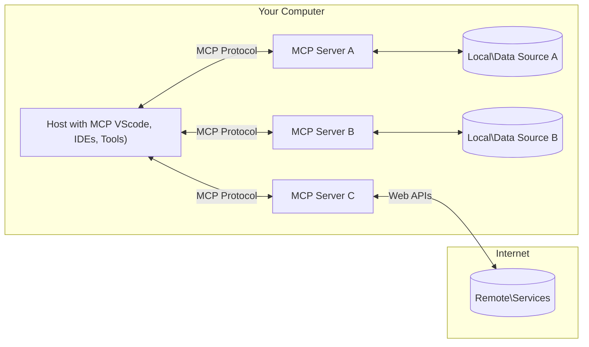

<!--
CO_OP_TRANSLATOR_METADATA:
{
  "original_hash": "b3b4a6ad10c3c0edbf7fa7cfa0ec496b",
  "translation_date": "2025-07-02T06:55:44+00:00",
  "source_file": "01-CoreConcepts/README.md",
  "language_code": "fa"
}
-->
# 📖 مفاهیم اصلی MCP: تسلط بر پروتکل مدل کانتکست برای ادغام هوش مصنوعی

[Model Context Protocol (MCP)](https://github.com/modelcontextprotocol) یک چارچوب استاندارد و قدرتمند است که ارتباط بین مدل‌های زبانی بزرگ (LLM) و ابزارها، برنامه‌ها و منابع داده خارجی را بهینه می‌کند. این راهنمای بهینه‌شده برای سئو، شما را با مفاهیم اصلی MCP آشنا می‌کند و اطمینان می‌دهد که معماری کلاینت-سرور، اجزای اساسی، مکانیزم‌های ارتباطی و بهترین شیوه‌های پیاده‌سازی آن را درک کنید.

## مرور کلی

این درس به معماری پایه و اجزایی که اکوسیستم پروتکل مدل کانتکست (MCP) را تشکیل می‌دهند می‌پردازد. شما با معماری کلاینت-سرور، اجزای کلیدی و مکانیزم‌های ارتباطی که تعاملات MCP را ممکن می‌سازند آشنا خواهید شد.

## 👩‍🎓 اهداف کلیدی یادگیری

تا پایان این درس، شما قادر خواهید بود:

- معماری کلاینت-سرور MCP را درک کنید.
- نقش‌ها و مسئولیت‌های Hosts، Clients و Servers را شناسایی کنید.
- ویژگی‌های اصلی که MCP را به یک لایه ادغام منعطف تبدیل می‌کنند تحلیل کنید.
- جریان اطلاعات در اکوسیستم MCP را یاد بگیرید.
- از طریق مثال‌های کد در .NET، Java، Python و JavaScript بینش‌های عملی کسب کنید.

## 🔎 معماری MCP: نگاهی عمیق‌تر

اکوسیستم MCP بر اساس مدل کلاینت-سرور ساخته شده است. این ساختار مدولار اجازه می‌دهد برنامه‌های هوش مصنوعی به طور مؤثر با ابزارها، پایگاه‌های داده، APIها و منابع متنی تعامل داشته باشند. بیایید این معماری را به اجزای اصلی آن تقسیم کنیم.

در اصل، MCP از معماری کلاینت-سرور پیروی می‌کند که در آن یک برنامه میزبان می‌تواند به چندین سرور متصل شود:



- **MCP Hosts**: برنامه‌هایی مانند VSCode، Claude Desktop، IDEها یا ابزارهای هوش مصنوعی که می‌خواهند از طریق MCP به داده‌ها دسترسی پیدا کنند  
- **MCP Clients**: کلاینت‌های پروتکل که ارتباطات ۱:۱ با سرورها را حفظ می‌کنند  
- **MCP Servers**: برنامه‌های سبک‌وزنی که هر کدام قابلیت‌های خاصی را از طریق پروتکل استاندارد شده مدل کانتکست ارائه می‌دهند  
- **منابع داده محلی**: فایل‌ها، پایگاه‌های داده و سرویس‌های کامپیوتر شما که سرورهای MCP می‌توانند به صورت امن به آن‌ها دسترسی داشته باشند  
- **سرویس‌های راه دور**: سیستم‌های خارجی که از طریق اینترنت و APIها قابل دسترسی هستند و سرورهای MCP می‌توانند به آن‌ها متصل شوند.

پروتکل MCP یک استاندارد در حال تکامل است. می‌توانید آخرین به‌روزرسانی‌ها را در [مشخصات پروتکل](https://modelcontextprotocol.io/specification/2025-06-18/) مشاهده کنید.

### ۱. Hosts

در پروتکل مدل کانتکست (MCP)، Hosts نقش مهمی به عنوان رابط اصلی دارند که کاربران از طریق آن با پروتکل تعامل می‌کنند. Hosts برنامه‌ها یا محیط‌هایی هستند که اتصال به سرورهای MCP را برای دسترسی به داده‌ها، ابزارها و پرامپت‌ها آغاز می‌کنند. مثال‌هایی از Hosts شامل محیط‌های توسعه یکپارچه (IDEs) مانند Visual Studio Code، ابزارهای هوش مصنوعی مانند Claude Desktop یا عامل‌های سفارشی ساخته شده برای وظایف خاص است.

**Hosts** برنامه‌های LLM هستند که اتصال را آغاز می‌کنند. آن‌ها:

- مدل‌های هوش مصنوعی را اجرا یا با آن‌ها تعامل دارند تا پاسخ تولید کنند.  
- اتصال به سرورهای MCP را آغاز می‌کنند.  
- جریان مکالمه و رابط کاربری را مدیریت می‌کنند.  
- کنترل مجوزها و محدودیت‌های امنیتی را بر عهده دارند.  
- رضایت کاربر برای اشتراک داده‌ها و اجرای ابزارها را مدیریت می‌کنند.

### ۲. Clients

Clients اجزای اساسی هستند که تعامل بین Hosts و سرورهای MCP را تسهیل می‌کنند. آن‌ها به عنوان واسطه عمل می‌کنند و امکان دسترسی Hosts به قابلیت‌های ارائه شده توسط سرورهای MCP را فراهم می‌کنند. نقش مهمی در تضمین ارتباط روان و تبادل داده کارآمد در معماری MCP دارند.

**Clients** رابط‌هایی در داخل برنامه میزبان هستند. آن‌ها:

- درخواست‌ها را با پرامپت‌ها/دستورات به سرورها ارسال می‌کنند.  
- قابلیت‌ها را با سرورها مذاکره می‌کنند.  
- درخواست‌های اجرای ابزار از مدل‌ها را مدیریت می‌کنند.  
- پاسخ‌ها را پردازش و به کاربران نمایش می‌دهند.

### ۳. Servers

سرورها مسئول پردازش درخواست‌ها از کلاینت‌های MCP و ارائه پاسخ‌های مناسب هستند. آن‌ها عملیات مختلفی مانند بازیابی داده، اجرای ابزار و تولید پرامپت را مدیریت می‌کنند. سرورها اطمینان می‌دهند که ارتباط بین کلاینت‌ها و Hosts کارآمد و قابل اعتماد است و یکپارچگی فرآیند تعامل را حفظ می‌کنند.

**Servers** سرویس‌هایی هستند که زمینه و قابلیت‌ها را فراهم می‌کنند. آن‌ها:

- ویژگی‌های موجود (منابع، پرامپت‌ها، ابزارها) را ثبت می‌کنند.  
- تماس‌های ابزار را از کلاینت دریافت و اجرا می‌کنند.  
- اطلاعات متنی برای بهبود پاسخ‌های مدل فراهم می‌کنند.  
- خروجی‌ها را به کلاینت بازمی‌گردانند.  
- در صورت نیاز، وضعیت را در طول تعاملات حفظ می‌کنند.

سرورها می‌توانند توسط هر کسی توسعه یابند تا قابلیت‌های مدل را با عملکردهای تخصصی گسترش دهند.

### ۴. ویژگی‌های سرور

سرورها در پروتکل مدل کانتکست (MCP) بلوک‌های بنیادی را فراهم می‌کنند که تعاملات غنی بین کلاینت‌ها، میزبان‌ها و مدل‌های زبانی را ممکن می‌سازند. این ویژگی‌ها برای افزایش قابلیت‌های MCP با ارائه زمینه ساختاریافته، ابزارها و پرامپت‌ها طراحی شده‌اند.

سرورهای MCP می‌توانند هر یک از ویژگی‌های زیر را ارائه دهند:

#### 📑 منابع

منابع در پروتکل مدل کانتکست (MCP) شامل انواع مختلفی از زمینه و داده هستند که کاربران یا مدل‌های هوش مصنوعی می‌توانند از آن‌ها استفاده کنند. این موارد شامل:

- **داده‌های متنی**: اطلاعات و زمینه‌ای که کاربران یا مدل‌های هوش مصنوعی می‌توانند برای تصمیم‌گیری و انجام وظایف از آن بهره ببرند.  
- **پایگاه‌های دانش و مخازن اسناد**: مجموعه‌ای از داده‌های ساختاریافته و غیرساختاریافته مانند مقالات، راهنماها و مقالات پژوهشی که بینش‌ها و اطلاعات ارزشمندی ارائه می‌دهند.  
- **فایل‌ها و پایگاه‌های داده محلی**: داده‌هایی که به صورت محلی روی دستگاه‌ها یا در پایگاه‌های داده ذخیره شده‌اند و برای پردازش و تحلیل قابل دسترسی هستند.  
- **APIها و وب‌سرویس‌ها**: رابط‌ها و سرویس‌های خارجی که داده‌ها و قابلیت‌های اضافی ارائه می‌دهند و امکان ادغام با منابع و ابزارهای آنلاین مختلف را فراهم می‌کنند.

مثالی از یک منبع می‌تواند یک طرح پایگاه داده یا فایلی باشد که به این صورت قابل دسترسی است:

```text
file://log.txt
database://schema
```

### 🤖 پرامپت‌ها

پرامپت‌ها در پروتکل مدل کانتکست (MCP) شامل قالب‌ها و الگوهای تعامل از پیش تعریف شده‌ای هستند که برای ساده‌سازی جریان کار کاربران و بهبود ارتباط طراحی شده‌اند. این موارد شامل:

- **پیام‌ها و جریان‌های کاری قالب‌بندی شده**: پیام‌ها و فرآیندهای از پیش ساختاربندی شده که کاربران را در انجام وظایف و تعاملات خاص راهنمایی می‌کنند.  
- **الگوهای تعامل از پیش تعریف شده**: دنباله‌های استانداردی از اقدامات و پاسخ‌ها که ارتباطی یکنواخت و مؤثر را تسهیل می‌کنند.  
- **قالب‌های مکالمه تخصصی**: قالب‌های قابل تنظیم که برای انواع خاصی از مکالمات طراحی شده‌اند و تعاملات مرتبط و متنی مناسب را تضمین می‌کنند.

یک قالب پرامپت می‌تواند به این شکل باشد:

```markdown
Generate a product slogan based on the following {{product}} with the following {{keywords}}
```

#### ⛏️ ابزارها

ابزارها در پروتکل مدل کانتکست (MCP) توابعی هستند که مدل هوش مصنوعی می‌تواند برای انجام وظایف خاص اجرا کند. این ابزارها برای افزایش قابلیت‌های مدل هوش مصنوعی با ارائه عملیات ساختاریافته و قابل اطمینان طراحی شده‌اند. نکات کلیدی شامل:

- **توابعی که مدل هوش مصنوعی می‌تواند اجرا کند**: ابزارها توابع اجرایی هستند که مدل می‌تواند برای انجام وظایف مختلف فراخوانی کند.  
- **نام و توضیح منحصر به فرد**: هر ابزار نام متمایز و توضیح دقیقی دارد که هدف و عملکرد آن را شرح می‌دهد.  
- **پارامترها و خروجی‌ها**: ابزارها پارامترهای خاصی را می‌پذیرند و خروجی‌های ساختاریافته‌ای بازمی‌گردانند تا نتایج قابل پیش‌بینی و یکسان باشند.  
- **توابع مستقل**: ابزارها توابعی مستقل مانند جستجوی وب، محاسبات و پرس‌وجوهای پایگاه داده را انجام می‌دهند.

مثال یک ابزار می‌تواند به این صورت باشد:

```typescript
server.tool(
  "GetProducts",
  {
    pageSize: z.string().optional(),
    pageCount: z.string().optional()
  }, () => {
    // return results from API
  }
)
```

## ویژگی‌های کلاینت

در پروتکل مدل کانتکست (MCP)، کلاینت‌ها چند ویژگی کلیدی به سرورها ارائه می‌دهند که عملکرد کلی و تعامل در پروتکل را بهبود می‌بخشند. یکی از ویژگی‌های قابل توجه، نمونه‌برداری (Sampling) است.

### 👉 نمونه‌برداری

- **رفتارهای عامل‌محور آغاز شده توسط سرور**: کلاینت‌ها به سرورها اجازه می‌دهند تا اقدامات یا رفتارهای خاصی را به صورت خودکار آغاز کنند و قابلیت‌های دینامیک سیستم را افزایش دهند.  
- **تعاملات بازگشتی با LLM**: این ویژگی امکان تعاملات بازگشتی با مدل‌های زبانی بزرگ را فراهم می‌کند و پردازش پیچیده‌تر و تکراری وظایف را ممکن می‌سازد.  
- **درخواست تکمیل‌های اضافی مدل**: سرورها می‌توانند تکمیل‌های اضافی از مدل درخواست کنند تا پاسخ‌ها جامع‌تر و مرتبط‌تر با متن باشند.

## جریان اطلاعات در MCP

پروتکل مدل کانتکست (MCP) جریان ساختاریافته‌ای از اطلاعات بین میزبان‌ها، کلاینت‌ها، سرورها و مدل‌ها تعریف می‌کند. درک این جریان کمک می‌کند تا روشن شود چگونه درخواست‌های کاربران پردازش می‌شوند و ابزارها و داده‌های خارجی چگونه در پاسخ‌های مدل ادغام می‌شوند.

- **میزبان اتصال را آغاز می‌کند**  
  برنامه میزبان (مانند IDE یا رابط چت) اتصال به سرور MCP را معمولاً از طریق STDIO، WebSocket یا روش حمل و نقل پشتیبانی شده دیگری برقرار می‌کند.

- **مذاکره قابلیت‌ها**  
  کلاینت (موجود در میزبان) و سرور اطلاعات مربوط به ویژگی‌ها، ابزارها، منابع و نسخه‌های پروتکل پشتیبانی شده را رد و بدل می‌کنند تا هر دو طرف بدانند چه قابلیت‌هایی برای جلسه در دسترس است.

- **درخواست کاربر**  
  کاربر با میزبان تعامل می‌کند (مثلاً پرامپت یا فرمانی وارد می‌کند). میزبان این ورودی را جمع‌آوری کرده و برای پردازش به کلاینت ارسال می‌کند.

- **استفاده از منبع یا ابزار**  
  - کلاینت ممکن است درخواست زمینه یا منابع اضافی از سرور کند (مانند فایل‌ها، ورودی‌های پایگاه داده یا مقالات پایگاه دانش) تا درک مدل را غنی‌تر کند.  
  - اگر مدل تشخیص دهد که به ابزاری نیاز است (مثلاً برای بازیابی داده، انجام محاسبه یا فراخوانی API)، کلاینت درخواست اجرای ابزار را به سرور ارسال می‌کند و نام ابزار و پارامترها را مشخص می‌کند.

- **اجرای سرور**  
  سرور درخواست منبع یا ابزار را دریافت می‌کند، عملیات لازم را اجرا می‌کند (مانند اجرای تابع، پرس‌وجوی پایگاه داده یا بازیابی فایل) و نتایج را در قالب ساختاریافته به کلاینت بازمی‌گرداند.

- **تولید پاسخ**  
  کلاینت پاسخ‌های سرور (داده‌های منبع، خروجی ابزار و غیره) را در تعامل جاری مدل ادغام می‌کند. مدل از این اطلاعات برای تولید پاسخی جامع و مرتبط با متن استفاده می‌کند.

- **ارائه نتیجه**  
  میزبان خروجی نهایی را از کلاینت دریافت کرده و به کاربر نمایش می‌دهد، که معمولاً شامل متن تولید شده توسط مدل و هر نتیجه‌ای از اجرای ابزار یا جستجوی منابع است.

این جریان به MCP اجازه می‌دهد تا برنامه‌های هوش مصنوعی پیشرفته، تعاملی و آگاه به زمینه را با اتصال بی‌وقفه مدل‌ها به ابزارها و منابع داده خارجی پشتیبانی کند.

## جزئیات پروتکل

MCP (پروتکل مدل کانتکست) بر پایه [JSON-RPC 2.0](https://www.jsonrpc.org/) ساخته شده است و قالب پیام استاندارد، زبان‌ناشناس برای ارتباط بین میزبان‌ها، کلاینت‌ها و سرورها فراهم می‌کند. این پایه امکان تعاملات قابل اعتماد، ساختاریافته و قابل توسعه را در پلتفرم‌ها و زبان‌های برنامه‌نویسی مختلف فراهم می‌آورد.

### ویژگی‌های کلیدی پروتکل

MCP JSON-RPC 2.0 را با قراردادهای اضافی برای فراخوانی ابزار، دسترسی به منابع و مدیریت پرامپت توسعه می‌دهد. از چندین لایه حمل و نقل (STDIO، WebSocket، SSE) پشتیبانی می‌کند و ارتباط امن، قابل توسعه و مستقل از زبان را بین اجزا ممکن می‌سازد.

#### 🧢 پروتکل پایه

- **قالب پیام JSON-RPC**: تمام درخواست‌ها و پاسخ‌ها از مشخصات JSON-RPC 2.0 استفاده می‌کنند که ساختار یکسانی برای فراخوانی متدها، پارامترها، نتایج و مدیریت خطا فراهم می‌کند.  
- **اتصالات حالت‌دار**: جلسات MCP وضعیت را در چندین درخواست حفظ می‌کنند و مکالمات مداوم، انباشت زمینه و مدیریت منابع را پشتیبانی می‌کنند.  
- **مذاکره قابلیت‌ها**: هنگام راه‌اندازی اتصال، کلاینت‌ها و سرورها اطلاعات مربوط به ویژگی‌های پشتیبانی شده، نسخه‌های پروتکل، ابزارها و منابع را رد و بدل می‌کنند تا هر دو طرف قابلیت‌های یکدیگر را بفهمند و بتوانند تطبیق یابند.

#### ➕ ابزارهای اضافی

در ادامه چند ابزار و توسعه پروتکل که MCP برای بهبود تجربه توسعه‌دهنده و امکان‌پذیر کردن سناریوهای پیشرفته ارائه می‌دهد آمده است:

- **گزینه‌های پیکربندی**: MCP امکان پیکربندی پویا پارامترهای جلسه مانند مجوز ابزارها، دسترسی به منابع و تنظیمات مدل را فراهم می‌کند که متناسب با هر تعامل تنظیم می‌شود.  
- **ردیابی پیشرفت**: عملیات طولانی می‌توانند به‌روزرسانی‌های پیشرفت را گزارش دهند تا رابط‌های کاربری پاسخگو و تجربه کاربری بهتر در طول وظایف پیچیده فراهم شود.  
- **لغو درخواست**: کلاینت‌ها می‌توانند درخواست‌های در حال اجرا را لغو کنند و به کاربران اجازه دهند عملیات غیرضروری یا طولانی را متوقف کنند.  
- **گزارش خطا**: پیام‌ها و کدهای خطای استاندارد به تشخیص مشکلات، مدیریت شکست‌ها به صورت نرم و ارائه بازخورد قابل اقدام به کاربران و توسعه‌دهندگان کمک می‌کنند.  
- **ثبت وقایع (Logging)**: کلاینت‌ها و سرورها می‌توانند گزارش‌های ساختاریافته‌ای برای حسابرسی، اشکال‌زدایی و پایش تعاملات پروتکل صادر کنند.

با بهره‌گیری از این ویژگی‌های پروتکل، MCP ارتباطی قوی، امن و منعطف بین مدل‌های زبانی و ابزارها یا منابع داده خارجی فراهم می‌کند.

### 🔐 ملاحظات امنیتی

پیاده‌سازی‌های MCP باید به چند اصل کلیدی امنیتی پایبند باشند تا تعاملات امن و قابل اعتماد تضمین شود:

- **رضایت و کنترل کاربر**: کاربران باید پیش از دسترسی به داده‌ها یا انجام عملیات، رضایت صریح خود را اعلام کنند. آن‌ها باید کنترل واضحی بر داده‌های به اشتراک گذاشته شده و اقدامات مجاز داشته باشند که توسط رابط‌های کاربری شهودی برای بررسی و تأیید فعالیت‌ها پشتیبانی می‌شود.  
- **حریم خصوصی داده‌ها**: داده‌های کاربران باید فقط با رضایت صریح افشا شوند و باید با کنترل‌های دسترسی مناسب محافظت شوند. پیاده‌سازی‌های MCP باید از انتقال غیرمجاز داده جلوگیری کرده و اطمینان حاصل کنند که حریم خصوصی در تمام تعاملات حفظ می‌شود.  
- **ایمنی ابزارها**: پیش از فراخوانی هر ابزار، رضایت صریح کاربر لازم است. کاربران باید درک روشنی از عملکرد هر ابزار داشته باشند و مرزهای امنیتی محکمی اعمال شود تا از اجرای ناخواسته یا ناامن ابزارها جلوگیری شود.

با رعایت این اصول، MCP اطمینان می‌دهد که اعتماد، حریم خصوصی و ایمنی کاربران در تمام تعاملات پروتکل حفظ می‌شود.

## مثال‌های کد: اجزای کلیدی

در ادامه نمونه‌های کد در چند زبان برنامه‌نویسی محبوب آورده شده است که نشان می‌دهد چگونه اجزای کلیدی سرور MCP و ابزارها را پیاده‌سازی کنیم.

### مثال .NET: ایجاد یک سرور ساده MCP با ابزارها

در این مثال عملی در .NET نشان داده می‌شود که چگونه یک سرور ساده MCP با ابزارهای سفارشی ایجاد کنید. این مثال نحوه تعریف و ثبت ابزارها، مدیریت درخواست‌ها و اتصال سرور با استفاده از پروتکل مدل کانتکست را نمایش می‌دهد.

@@

**سلب مسئولیت**:  
این سند با استفاده از سرویس ترجمه ماشینی [Co-op Translator](https://github.com/Azure/co-op-translator) ترجمه شده است. در حالی که ما در تلاش برای دقت هستیم، لطفاً توجه داشته باشید که ترجمه‌های خودکار ممکن است دارای اشتباهات یا نواقصی باشند. سند اصلی به زبان بومی خود باید به عنوان منبع معتبر در نظر گرفته شود. برای اطلاعات حیاتی، ترجمه حرفه‌ای انسانی توصیه می‌شود. ما مسئول هیچ گونه سوءتفاهم یا برداشت نادرستی که ناشی از استفاده از این ترجمه باشد، نیستیم.