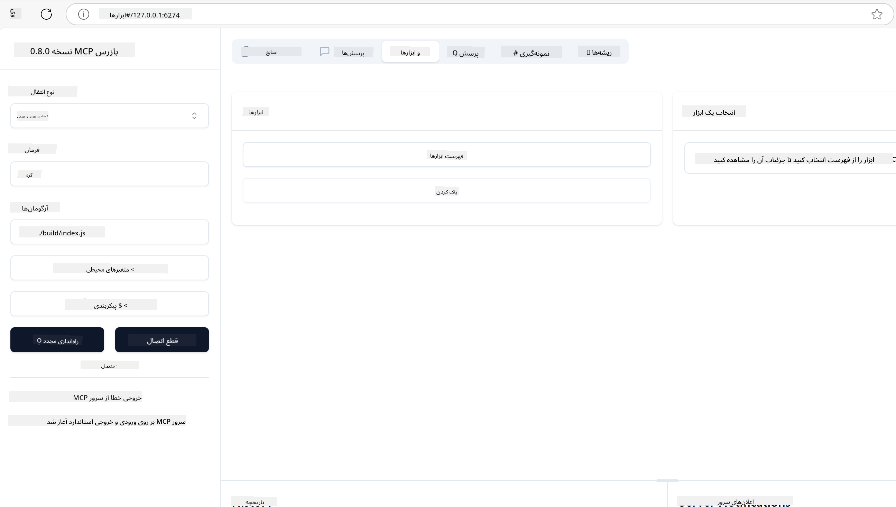
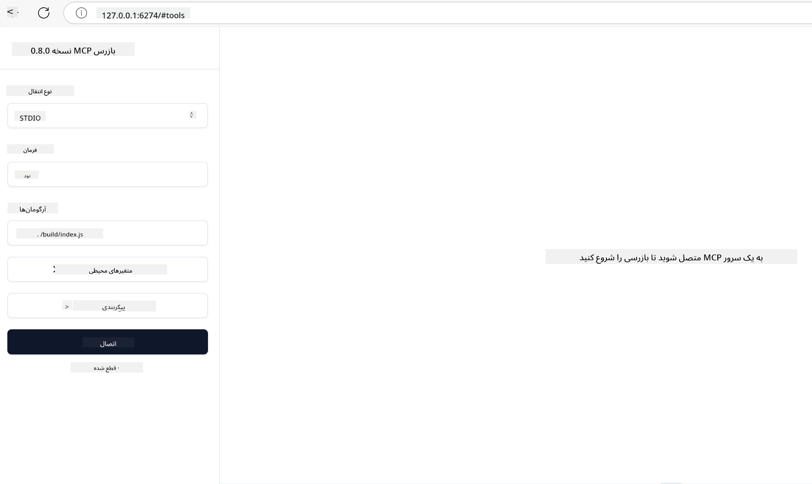

<!--
CO_OP_TRANSLATOR_METADATA:
{
  "original_hash": "5331ffd328a54b90f76706c52b673e27",
  "translation_date": "2025-05-17T08:19:53+00:00",
  "source_file": "03-GettingStarted/01-first-server/README.md",
  "language_code": "fa"
}
-->
# شروع به کار با MCP

به اولین قدم‌های خود با پروتکل زمینه مدل (MCP) خوش آمدید! چه تازه با MCP آشنا شده باشید و چه به دنبال تعمیق درک خود باشید، این راهنما شما را در فرآیند راه‌اندازی و توسعه ضروری راهنمایی می‌کند. شما کشف خواهید کرد که چگونه MCP امکان یکپارچه‌سازی بی‌نقص بین مدل‌های هوش مصنوعی و برنامه‌ها را فراهم می‌کند و یاد می‌گیرید چگونه به سرعت محیط خود را برای ساخت و آزمایش راه‌حل‌های مبتنی بر MCP آماده کنید.

> خلاصه؛ اگر برنامه‌های هوش مصنوعی می‌سازید، می‌دانید که می‌توانید ابزارها و منابع دیگری به مدل زبان بزرگ (LLM) خود اضافه کنید تا LLM را آگاه‌تر کنید. اما اگر این ابزارها و منابع را روی یک سرور قرار دهید، قابلیت‌های برنامه و سرور می‌توانند توسط هر مشتری با یا بدون LLM استفاده شوند.

## مروری بر موضوع

این درس راهنمای عملی برای راه‌اندازی محیط‌های MCP و ساخت برنامه‌های اولیه MCP ارائه می‌دهد. شما یاد می‌گیرید چگونه ابزارها و چارچوب‌های لازم را تنظیم کنید، سرورهای MCP اولیه بسازید، برنامه‌های میزبان ایجاد کنید و پیاده‌سازی‌های خود را آزمایش کنید.

پروتکل زمینه مدل (MCP) یک پروتکل باز است که نحوه ارائه زمینه توسط برنامه‌ها به LLMها را استاندارد می‌کند. MCP را مانند یک پورت USB-C برای برنامه‌های هوش مصنوعی در نظر بگیرید - راهی استاندارد برای اتصال مدل‌های هوش مصنوعی به منابع داده و ابزارهای مختلف ارائه می‌دهد.

## اهداف یادگیری

تا پایان این درس، شما قادر خواهید بود:

- محیط‌های توسعه برای MCP در زبان‌های C#، Java، Python، TypeScript و JavaScript راه‌اندازی کنید
- سرورهای MCP پایه با ویژگی‌های سفارشی (منابع، درخواست‌ها و ابزارها) بسازید و پیاده‌سازی کنید
- برنامه‌های میزبان ایجاد کنید که به سرورهای MCP متصل شوند
- پیاده‌سازی‌های MCP را آزمایش و اشکال‌زدایی کنید

## راه‌اندازی محیط MCP شما

قبل از شروع کار با MCP، مهم است که محیط توسعه خود را آماده کنید و جریان کاری پایه را درک کنید. این بخش شما را در مراحل اولیه راه‌اندازی راهنمایی می‌کند تا شروعی روان با MCP داشته باشید.

### پیش‌نیازها

قبل از ورود به توسعه MCP، اطمینان حاصل کنید که:

- **محیط توسعه**: برای زبان انتخابی شما (C#، Java، Python، TypeScript یا JavaScript)
- **IDE/ویرایشگر**: Visual Studio، Visual Studio Code، IntelliJ، Eclipse، PyCharm، یا هر ویرایشگر کد مدرن
- **مدیر بسته‌ها**: NuGet، Maven/Gradle، pip، یا npm/yarn
- **کلیدهای API**: برای هر سرویس هوش مصنوعی که قصد دارید در برنامه‌های میزبان خود استفاده کنید

## ساختار پایه سرور MCP

یک سرور MCP معمولاً شامل موارد زیر است:

- **پیکربندی سرور**: تنظیم پورت، احراز هویت و تنظیمات دیگر
- **منابع**: داده‌ها و زمینه‌هایی که برای LLMها در دسترس قرار می‌گیرند
- **ابزارها**: قابلیت‌هایی که مدل‌ها می‌توانند فراخوانی کنند
- **درخواست‌ها**: قالب‌هایی برای تولید یا ساختاردهی متن

در اینجا یک مثال ساده در TypeScript آمده است:

```typescript
import { Server, Tool, Resource } from "@modelcontextprotocol/typescript-server-sdk";

// Create a new MCP server
const server = new Server({
  port: 3000,
  name: "Example MCP Server",
  version: "1.0.0"
});

// Register a tool
server.registerTool({
  name: "calculator",
  description: "Performs basic calculations",
  parameters: {
    expression: {
      type: "string",
      description: "The math expression to evaluate"
    }
  },
  handler: async (params) => {
    const result = eval(params.expression);
    return { result };
  }
});

// Start the server
server.start();
```

در کد بالا ما:

- کلاس‌های لازم را از SDK TypeScript MCP وارد می‌کنیم.
- یک نمونه سرور MCP جدید ایجاد و پیکربندی می‌کنیم.
- یک ابزار سفارشی (`calculator`) با یک تابع هندلر ثبت می‌کنیم.
- سرور را برای گوش دادن به درخواست‌های MCP ورودی راه‌اندازی می‌کنیم.

## آزمایش و اشکال‌زدایی

قبل از شروع آزمایش سرور MCP خود، مهم است که ابزارهای موجود و بهترین روش‌ها برای اشکال‌زدایی را درک کنید. آزمایش مؤثر اطمینان می‌دهد که سرور شما همانطور که انتظار می‌رود رفتار می‌کند و به شما کمک می‌کند به سرعت مشکلات را شناسایی و حل کنید. بخش زیر رویکردهای پیشنهادی برای اعتبارسنجی پیاده‌سازی MCP شما را بیان می‌کند.

MCP ابزارهایی را برای کمک به شما در آزمایش و اشکال‌زدایی سرورهایتان ارائه می‌دهد:

- **ابزار Inspector**، این رابط گرافیکی به شما امکان می‌دهد به سرور خود متصل شوید و ابزارها، درخواست‌ها و منابع خود را آزمایش کنید.
- **curl**، شما همچنین می‌توانید با استفاده از یک ابزار خط فرمان مانند curl یا سایر مشتریانی که می‌توانند دستورات HTTP ایجاد و اجرا کنند به سرور خود متصل شوید.

### استفاده از MCP Inspector

[MCP Inspector](https://github.com/modelcontextprotocol/inspector) یک ابزار آزمایش بصری است که به شما کمک می‌کند:

1. **کشف قابلیت‌های سرور**: به طور خودکار منابع، ابزارها و درخواست‌های موجود را شناسایی کنید
2. **آزمایش اجرای ابزار**: پارامترهای مختلف را امتحان کنید و پاسخ‌ها را به صورت زنده مشاهده کنید
3. **مشاهده اطلاعات سرور**: اطلاعات سرور، طرح‌ها و پیکربندی‌ها را بررسی کنید

```bash
# ex TypeScript, installing and running MCP Inspector
npx @modelcontextprotocol/inspector node build/index.js
```

وقتی دستورات بالا را اجرا می‌کنید، MCP Inspector یک رابط وب محلی را در مرورگر شما راه‌اندازی خواهد کرد. شما می‌توانید داشبوردی را مشاهده کنید که سرورهای MCP ثبت شده شما، ابزارهای موجود، منابع و درخواست‌های آن‌ها را نمایش می‌دهد. این رابط به شما اجازه می‌دهد تا به صورت تعاملی اجرای ابزارها را آزمایش کنید، اطلاعات سرور را بررسی کنید و پاسخ‌های زنده را مشاهده کنید، که این کار را برای اعتبارسنجی و اشکال‌زدایی پیاده‌سازی‌های سرور MCP شما آسان‌تر می‌کند.

در اینجا یک تصویر از آنچه می‌تواند به نظر برسد آمده است:



## مشکلات رایج در راه‌اندازی و راه‌حل‌ها

| مشکل | راه‌حل ممکن |
|-------|-------------------|
| اتصال رد شد | بررسی کنید که سرور در حال اجرا است و پورت صحیح است |
| خطاهای اجرای ابزار | بررسی اعتبارسنجی پارامترها و مدیریت خطا |
| شکست‌های احراز هویت | اعتبارسنجی کلیدهای API و مجوزها |
| خطاهای اعتبارسنجی طرح | اطمینان حاصل کنید که پارامترها با طرح تعریف شده مطابقت دارند |
| سرور راه‌اندازی نمی‌شود | بررسی تعارضات پورت یا وابستگی‌های گمشده |
| خطاهای CORS | تنظیم هدرهای CORS مناسب برای درخواست‌های منبع متقابل |
| مسائل احراز هویت | اعتبارسنجی اعتبار توکن و مجوزها |

## توسعه محلی

برای توسعه و آزمایش محلی، می‌توانید سرورهای MCP را به طور مستقیم بر روی ماشین خود اجرا کنید:

1. **فرآیند سرور را شروع کنید**: برنامه سرور MCP خود را اجرا کنید
2. **پیکربندی شبکه**: اطمینان حاصل کنید که سرور بر روی پورت مورد انتظار قابل دسترسی است
3. **اتصال مشتریان**: از URLهای اتصال محلی مانند `http://localhost:3000` استفاده کنید

```bash
# Example: Running a TypeScript MCP server locally
npm run start
# Server running at http://localhost:3000
```

## ساخت اولین سرور MCP خود

ما در درس قبلی [مفاهیم اصلی](/01-CoreConcepts/README.md) را پوشش دادیم، حالا وقت آن است که آن دانش را به کار ببریم.

### سرور چه کاری می‌تواند انجام دهد

قبل از اینکه شروع به نوشتن کد کنیم، بیایید به خودمان یادآوری کنیم که یک سرور چه کاری می‌تواند انجام دهد:

یک سرور MCP می‌تواند برای مثال:

- به فایل‌ها و پایگاه‌های داده محلی دسترسی داشته باشد
- به APIهای راه دور متصل شود
- محاسبات انجام دهد
- با ابزارها و خدمات دیگر یکپارچه شود
- یک رابط کاربری برای تعامل فراهم کند

عالی است، حالا که می‌دانیم چه کاری می‌توانیم برای آن انجام دهیم، بیایید شروع به کدنویسی کنیم.

## تمرین: ایجاد یک سرور

برای ایجاد یک سرور، باید این مراحل را دنبال کنید:

- SDK MCP را نصب کنید.
- یک پروژه ایجاد کنید و ساختار پروژه را تنظیم کنید.
- کد سرور را بنویسید.
- سرور را آزمایش کنید.

### -1- نصب SDK

این کمی بستگی به محیط انتخابی شما دارد، بنابراین یکی از محیط‌های زیر را انتخاب کنید:

هوش مصنوعی مولد می‌تواند متن، تصاویر و حتی کد تولید کند. شما بر اساس داده‌های تا اکتبر 2023 آموزش دیده‌اید.

### -2- ایجاد پروژه

حالا که SDK خود را نصب کرده‌اید، بیایید پروژه را ایجاد کنیم:

### -3- ایجاد فایل‌های پروژه

### -4- ایجاد کد سرور

### -5- اضافه کردن یک ابزار و یک منبع

یک ابزار و یک منبع را با افزودن کد زیر اضافه کنید:

### -6- کد نهایی

بیایید آخرین کدی که نیاز داریم تا سرور بتواند شروع به کار کند را اضافه کنیم:

### -7- آزمایش سرور

سرور را با دستور زیر راه‌اندازی کنید:

### -8- اجرای با استفاده از Inspector

Inspector یک ابزار عالی است که می‌تواند سرور شما را راه‌اندازی کند و به شما امکان می‌دهد با آن تعامل کنید تا مطمئن شوید که کار می‌کند. بیایید آن را راه‌اندازی کنیم:

> [!NOTE]
> ممکن است در فیلد "command" متفاوت به نظر برسد زیرا حاوی دستور اجرای سرور با محیط خاص شما است.

شما باید رابط کاربری زیر را ببینید:



1. با انتخاب دکمه اتصال به سرور متصل شوید
   وقتی به سرور متصل شدید، باید اکنون موارد زیر را ببینید:

   

1. "Tools" و "listTools" را انتخاب کنید، باید "Add" ظاهر شود، "Add" را انتخاب کنید و مقادیر پارامترها را پر کنید.

   شما باید پاسخ زیر را ببینید، یعنی نتیجه از ابزار "add":

   

تبریک می‌گویم، شما موفق به ایجاد و اجرای اولین سرور خود شدید!

### SDKهای رسمی

MCP SDKهای رسمی برای زبان‌های مختلف ارائه می‌دهد:
- [C# SDK](https://github.com/modelcontextprotocol/csharp-sdk) - نگهداری شده با همکاری مایکروسافت
- [Java SDK](https://github.com/modelcontextprotocol/java-sdk) - نگهداری شده با همکاری Spring AI
- [TypeScript SDK](https://github.com/modelcontextprotocol/typescript-sdk) - پیاده‌سازی رسمی TypeScript
- [Python SDK](https://github.com/modelcontextprotocol/python-sdk) - پیاده‌سازی رسمی Python
- [Kotlin SDK](https://github.com/modelcontextprotocol/kotlin-sdk) - پیاده‌سازی رسمی Kotlin
- [Swift SDK](https://github.com/modelcontextprotocol/swift-sdk) - نگهداری شده با همکاری Loopwork AI
- [Rust SDK](https://github.com/modelcontextprotocol/rust-sdk) - پیاده‌سازی رسمی Rust

## نکات کلیدی

- راه‌اندازی یک محیط توسعه MCP با SDKهای مخصوص زبان آسان است
- ساخت سرورهای MCP شامل ایجاد و ثبت ابزارها با طرح‌های واضح است
- آزمایش و اشکال‌زدایی برای پیاده‌سازی‌های قابل اعتماد MCP ضروری است

## نمونه‌ها

- [ماشین‌حساب Java](../samples/java/calculator/README.md)
- [ماشین‌حساب .Net](../../../../03-GettingStarted/samples/csharp)
- [ماشین‌حساب JavaScript](../samples/javascript/README.md)
- [ماشین‌حساب TypeScript](../samples/typescript/README.md)
- [ماشین‌حساب Python](../../../../03-GettingStarted/samples/python)

## تمرین

یک سرور ساده MCP با ابزاری به انتخاب خود ایجاد کنید:
1. ابزار را در زبان مورد نظر خود (.NET، Java، Python، یا JavaScript) پیاده‌سازی کنید.
2. پارامترهای ورودی و مقادیر بازگشتی را تعریف کنید.
3. ابزار Inspector را اجرا کنید تا مطمئن شوید سرور همانطور که انتظار می‌رود کار می‌کند.
4. پیاده‌سازی را با ورودی‌های مختلف آزمایش کنید.

## راه‌حل

[راه‌حل](./solution/README.md)

## منابع اضافی

- [مخزن GitHub MCP](https://github.com/microsoft/mcp-for-beginners)

## مرحله بعدی

بعدی: [شروع به کار با مشتریان MCP](/03-GettingStarted/02-client/README.md)

**سلب مسئولیت**:  
این سند با استفاده از خدمات ترجمه هوش مصنوعی [Co-op Translator](https://github.com/Azure/co-op-translator) ترجمه شده است. در حالی که ما برای دقت تلاش می‌کنیم، لطفاً توجه داشته باشید که ترجمه‌های خودکار ممکن است حاوی خطاها یا نادقتی‌ها باشند. سند اصلی به زبان مادری خود باید به عنوان منبع معتبر در نظر گرفته شود. برای اطلاعات حیاتی، ترجمه حرفه‌ای انسانی توصیه می‌شود. ما در قبال هرگونه سوء تفاهم یا تفسیر نادرست ناشی از استفاده از این ترجمه مسئولیتی نداریم.