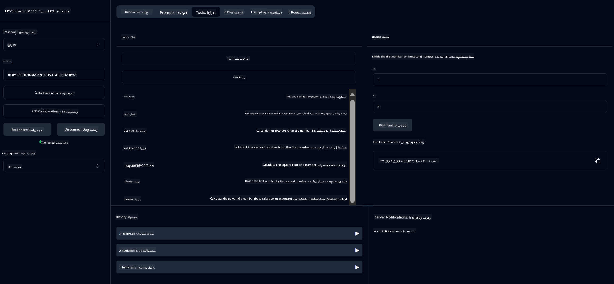

<!--
CO_OP_TRANSLATOR_METADATA:
{
  "original_hash": "ed9cab32cc67c12d8969b407aa47100a",
  "translation_date": "2025-07-13T17:52:08+00:00",
  "source_file": "03-GettingStarted/01-first-server/solution/java/README.md",
  "language_code": "fa"
}
-->
# سرویس ماشین حساب پایه MCP

این سرویس عملیات پایه ماشین حساب را از طریق پروتکل Model Context (MCP) با استفاده از Spring Boot و انتقال WebFlux ارائه می‌دهد. این سرویس به عنوان یک مثال ساده برای مبتدیانی که می‌خواهند با پیاده‌سازی‌های MCP آشنا شوند طراحی شده است.

برای اطلاعات بیشتر، به مستندات مرجع [MCP Server Boot Starter](https://docs.spring.io/spring-ai/reference/api/mcp/mcp-server-boot-starter-docs.html) مراجعه کنید.


## استفاده از سرویس

این سرویس نقاط پایانی API زیر را از طریق پروتکل MCP ارائه می‌دهد:

- `add(a, b)`: جمع دو عدد
- `subtract(a, b)`: تفریق عدد دوم از عدد اول
- `multiply(a, b)`: ضرب دو عدد
- `divide(a, b)`: تقسیم عدد اول بر عدد دوم (با بررسی صفر بودن مخرج)
- `power(base, exponent)`: محاسبه توان یک عدد
- `squareRoot(number)`: محاسبه ریشه دوم (با بررسی عدد منفی)
- `modulus(a, b)`: محاسبه باقی‌مانده تقسیم
- `absolute(number)`: محاسبه قدر مطلق


## وابستگی‌ها

این پروژه به وابستگی‌های کلیدی زیر نیاز دارد:

```xml
<dependency>
    <groupId>org.springframework.ai</groupId>
    <artifactId>spring-ai-starter-mcp-server-webflux</artifactId>
</dependency>
```

## ساخت پروژه

پروژه را با استفاده از Maven بسازید:
```bash
./mvnw clean install -DskipTests
```

## اجرای سرور

### استفاده از Java

```bash
java -jar target/calculator-server-0.0.1-SNAPSHOT.jar
```

### استفاده از MCP Inspector

MCP Inspector ابزاری مفید برای تعامل با سرویس‌های MCP است. برای استفاده از آن با این سرویس ماشین حساب:

1. **نصب و اجرای MCP Inspector** در یک پنجره ترمینال جدید:
   ```bash
   npx @modelcontextprotocol/inspector
   ```

2. **دسترسی به رابط وب** با کلیک روی آدرسی که برنامه نمایش می‌دهد (معمولاً http://localhost:6274)

3. **پیکربندی اتصال**:
   - نوع انتقال را روی "SSE" تنظیم کنید
   - آدرس URL را به نقطه پایانی SSE سرور در حال اجرای خود تنظیم کنید: `http://localhost:8080/sse`
   - روی "Connect" کلیک کنید

4. **استفاده از ابزارها**:
   - روی "List Tools" کلیک کنید تا عملیات‌های ماشین حساب موجود را ببینید
   - یک ابزار را انتخاب کرده و روی "Run Tool" کلیک کنید تا عملیات اجرا شود



**سلب مسئولیت**:  
این سند با استفاده از سرویس ترجمه هوش مصنوعی [Co-op Translator](https://github.com/Azure/co-op-translator) ترجمه شده است. در حالی که ما در تلاش برای دقت هستیم، لطفاً توجه داشته باشید که ترجمه‌های خودکار ممکن است حاوی خطاها یا نواقصی باشند. سند اصلی به زبان بومی خود باید به عنوان منبع معتبر در نظر گرفته شود. برای اطلاعات حیاتی، ترجمه حرفه‌ای انسانی توصیه می‌شود. ما مسئول هیچ گونه سوءتفاهم یا تفسیر نادرستی که از استفاده این ترجمه ناشی شود، نیستیم.