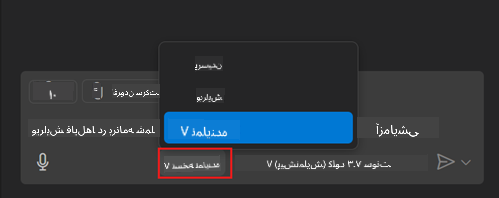
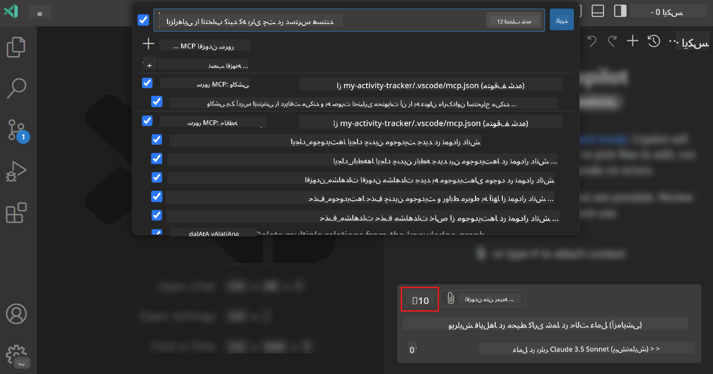
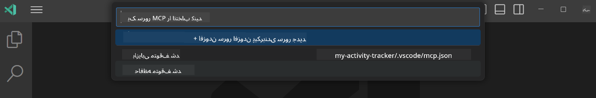
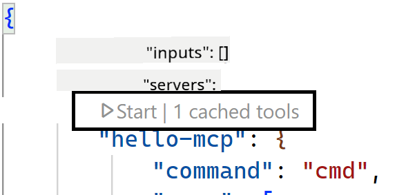
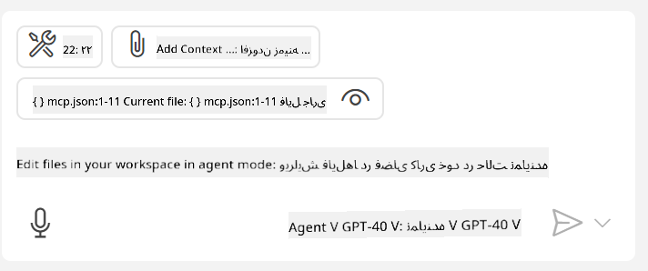

<!--
CO_OP_TRANSLATOR_METADATA:
{
  "original_hash": "d940b5e0af75e3a3a4d1c3179120d1d9",
  "translation_date": "2025-08-26T17:11:01+00:00",
  "source_file": "03-GettingStarted/04-vscode/README.md",
  "language_code": "fa"
}
-->
# استفاده از سرور در حالت Agent گیت‌هاب کوپایلوت

ویژوال استودیو کد و گیت‌هاب کوپایلوت می‌توانند به عنوان یک کلاینت عمل کرده و از یک سرور MCP استفاده کنند. شاید بپرسید چرا باید این کار را انجام دهیم؟ خب، این به این معناست که هر قابلیتی که سرور MCP دارد، اکنون می‌تواند از داخل محیط توسعه شما (IDE) استفاده شود. تصور کنید که مثلاً سرور MCP گیت‌هاب را اضافه کنید؛ این به شما امکان می‌دهد گیت‌هاب را از طریق دستورات طبیعی کنترل کنید، به جای تایپ دستورات خاص در ترمینال. یا هر چیزی که به طور کلی تجربه توسعه‌دهنده را بهبود بخشد و همه این‌ها با زبان طبیعی کنترل شود. حالا متوجه مزیت این کار می‌شوید، درست است؟

## مرور کلی

این درس نحوه استفاده از ویژوال استودیو کد و حالت Agent گیت‌هاب کوپایلوت به عنوان کلاینت برای سرور MCP را پوشش می‌دهد.

## اهداف آموزشی

در پایان این درس، شما قادر خواهید بود:

- از یک سرور MCP از طریق ویژوال استودیو کد استفاده کنید.
- قابلیت‌هایی مانند ابزارها را از طریق گیت‌هاب کوپایلوت اجرا کنید.
- ویژوال استودیو کد را برای یافتن و مدیریت سرور MCP خود پیکربندی کنید.

## استفاده

شما می‌توانید سرور MCP خود را به دو روش کنترل کنید:

- رابط کاربری: در ادامه این فصل خواهید دید که چگونه این کار انجام می‌شود.
- ترمینال: امکان کنترل از طریق ترمینال با استفاده از دستور `code` وجود دارد:

  برای افزودن یک سرور MCP به پروفایل کاربری خود، از گزینه خط فرمان --add-mcp استفاده کنید و پیکربندی JSON سرور را به شکل {\"name\":\"server-name\",\"command\":...} ارائه دهید.

  ```
  code --add-mcp "{\"name\":\"my-server\",\"command\": \"uvx\",\"args\": [\"mcp-server-fetch\"]}"
  ```

### تصاویر

  
  
  

در بخش‌های بعدی بیشتر درباره استفاده از رابط کاربری صحبت خواهیم کرد.

## رویکرد

در اینجا نحوه رویکرد به این موضوع در سطح بالا آمده است:

- یک فایل برای یافتن سرور MCP خود پیکربندی کنید.
- سرور را راه‌اندازی/متصل کنید تا قابلیت‌های آن را فهرست کند.
- از این قابلیت‌ها از طریق رابط چت گیت‌هاب کوپایلوت استفاده کنید.

عالی، حالا که جریان کار را درک کردیم، بیایید با یک تمرین استفاده از سرور MCP از طریق ویژوال استودیو کد را امتحان کنیم.

## تمرین: استفاده از سرور

در این تمرین، ما ویژوال استودیو کد را پیکربندی می‌کنیم تا سرور MCP شما را پیدا کند و بتواند از طریق رابط چت گیت‌هاب کوپایلوت استفاده شود.

### -0- پیش‌نیاز: فعال کردن کشف سرور MCP

ممکن است نیاز باشد قابلیت کشف سرورهای MCP را فعال کنید.

1. به مسیر `File -> Preferences -> Settings` در ویژوال استودیو کد بروید.

1. عبارت "MCP" را جستجو کنید و گزینه `chat.mcp.discovery.enabled` را در فایل settings.json فعال کنید.

### -1- ایجاد فایل پیکربندی

ابتدا یک فایل پیکربندی در ریشه پروژه خود ایجاد کنید. شما به فایلی به نام MCP.json نیاز دارید که باید در پوشه‌ای به نام .vscode قرار گیرد. ساختار آن باید به این شکل باشد:

```text
.vscode
|-- mcp.json
```

حالا بیایید ببینیم چگونه می‌توان یک ورودی سرور اضافه کرد.

### -2- پیکربندی سرور

محتوای زیر را به فایل *mcp.json* اضافه کنید:

```json
{
    "inputs": [],
    "servers": {
       "hello-mcp": {
           "command": "node",
           "args": [
               "build/index.js"
           ]
       }
    }
}
```

مثال بالا یک نمونه ساده از راه‌اندازی سروری نوشته شده با Node.js است. برای سایر محیط‌های اجرایی، دستور مناسب برای راه‌اندازی سرور را با استفاده از `command` و `args` مشخص کنید.

### -3- راه‌اندازی سرور

حالا که یک ورودی اضافه کرده‌اید، بیایید سرور را راه‌اندازی کنیم:

1. ورودی خود را در فایل *mcp.json* پیدا کنید و مطمئن شوید که آیکون "پخش" (play) را مشاهده می‌کنید:

    

1. روی آیکون "پخش" کلیک کنید. باید مشاهده کنید که تعداد ابزارهای موجود در آیکون ابزار گیت‌هاب کوپایلوت افزایش می‌یابد. اگر روی این آیکون ابزار کلیک کنید، لیستی از ابزارهای ثبت‌شده را مشاهده خواهید کرد. می‌توانید هر ابزار را بسته به نیاز خود فعال/غیرفعال کنید:

  

1. برای اجرای یک ابزار، یک دستور (prompt) تایپ کنید که با توضیحات یکی از ابزارهای شما مطابقت داشته باشد، مثلاً دستوری مانند "add 22 to 1":

  

  باید پاسخی مانند 23 دریافت کنید.

## تکلیف

سعی کنید یک ورودی سرور به فایل *mcp.json* خود اضافه کنید و مطمئن شوید که می‌توانید سرور را راه‌اندازی/متوقف کنید. همچنین مطمئن شوید که می‌توانید با ابزارهای سرور خود از طریق رابط چت گیت‌هاب کوپایلوت ارتباط برقرار کنید.

## راه‌حل

[راه‌حل](./solution/README.md)

## نکات کلیدی

نکات کلیدی این فصل عبارتند از:

- ویژوال استودیو کد یک کلاینت عالی است که به شما امکان می‌دهد از چندین سرور MCP و ابزارهای آن‌ها استفاده کنید.
- رابط چت گیت‌هاب کوپایلوت راهی است که از طریق آن با سرورها تعامل می‌کنید.
- می‌توانید از کاربر ورودی‌هایی مانند کلیدهای API درخواست کنید که هنگام پیکربندی ورودی سرور در فایل *mcp.json* به سرور MCP ارسال شوند.

## نمونه‌ها

- [ماشین حساب جاوا](../samples/java/calculator/README.md)  
- [ماشین حساب .Net](../../../../03-GettingStarted/samples/csharp)  
- [ماشین حساب جاوااسکریپت](../samples/javascript/README.md)  
- [ماشین حساب تایپ‌اسکریپت](../samples/typescript/README.md)  
- [ماشین حساب پایتون](../../../../03-GettingStarted/samples/python)  

## منابع اضافی

- [مستندات ویژوال استودیو](https://code.visualstudio.com/docs/copilot/chat/mcp-servers)

## مرحله بعدی

- بعدی: [ایجاد یک سرور stdio](../05-stdio-server/README.md)  

---

**سلب مسئولیت**:  
این سند با استفاده از سرویس ترجمه هوش مصنوعی [Co-op Translator](https://github.com/Azure/co-op-translator) ترجمه شده است. در حالی که ما تلاش می‌کنیم دقت را حفظ کنیم، لطفاً توجه داشته باشید که ترجمه‌های خودکار ممکن است شامل خطاها یا نادرستی‌ها باشند. سند اصلی به زبان اصلی آن باید به عنوان منبع معتبر در نظر گرفته شود. برای اطلاعات حساس، توصیه می‌شود از ترجمه حرفه‌ای انسانی استفاده کنید. ما مسئولیتی در قبال سوء تفاهم‌ها یا تفسیرهای نادرست ناشی از استفاده از این ترجمه نداریم.