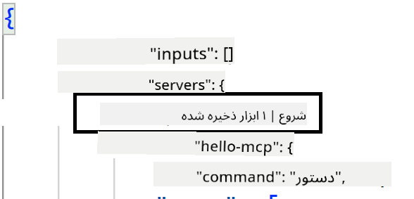
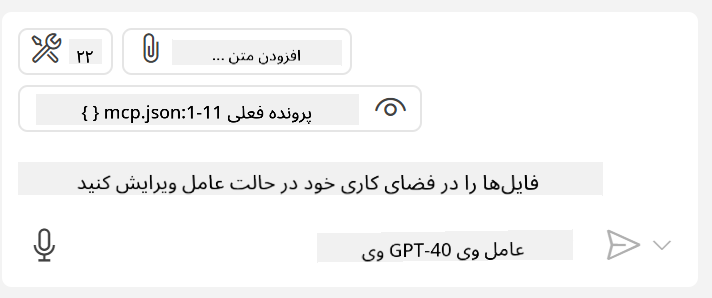

<!--
CO_OP_TRANSLATOR_METADATA:
{
  "original_hash": "c37fabfbc0dcbc9a4afb6d17e7d3be9f",
  "translation_date": "2025-05-17T11:01:13+00:00",
  "source_file": "03-GettingStarted/04-vscode/README.md",
  "language_code": "fa"
}
-->
بیایید در بخش‌های بعدی بیشتر در مورد چگونگی استفاده از رابط بصری صحبت کنیم.

## روش

در اینجا نحوه رویکرد به این موضوع در سطح بالا آورده شده است:

- یک فایل را پیکربندی کنید تا سرور MCP ما را پیدا کند.
- سرور مذکور را راه‌اندازی/متصل کنید تا قابلیت‌های آن را فهرست کند.
- از قابلیت‌های مذکور از طریق رابط چت GitHub Copilot استفاده کنید.

عالی، حالا که جریان کار را درک کردیم، بیایید با استفاده از یک تمرین، از یک سرور MCP از طریق Visual Studio Code استفاده کنیم.

## تمرین: استفاده از یک سرور

در این تمرین، ما Visual Studio Code را پیکربندی خواهیم کرد تا سرور MCP شما را پیدا کند تا بتوان از رابط چت GitHub Copilot استفاده کرد.

### -0- مرحله پیش‌نیاز، فعال کردن کشف سرور MCP

ممکن است نیاز باشد کشف سرورهای MCP را فعال کنید.

1. به `File -> Preferences -> Settings` in Visual Studio Code.

1. Search for "MCP" and enable `chat.mcp.discovery.enabled` در فایل settings.json بروید.

### -1- ایجاد فایل پیکربندی

با ایجاد یک فایل پیکربندی در ریشه پروژه خود شروع کنید، شما به یک فایل به نام MCP.json نیاز دارید و باید آن را در پوشه‌ای به نام .vscode قرار دهید. باید به این شکل باشد:

```text
.vscode
|-- mcp.json
```

بعد، بیایید ببینیم چگونه می‌توانیم یک ورودی سرور اضافه کنیم.

### -2- پیکربندی یک سرور

محتوای زیر را به *mcp.json* اضافه کنید:

```json
{
    "inputs": [],
    "servers": {
       "hello-mcp": {
           "command": "cmd",
           "args": [
               "/c", "node", "<absolute path>\\build\\index.js"
           ]
       }
    }
}
```

در بالا یک مثال ساده از نحوه راه‌اندازی یک سرور نوشته شده در Node.js آورده شده است، برای سایر محیط‌های اجرایی، دستور مناسب برای راه‌اندازی سرور را با استفاده از `command` and `args` مشخص کنید.

### -3- راه‌اندازی سرور

حالا که یک ورودی اضافه کرده‌اید، بیایید سرور را راه‌اندازی کنیم:

1. ورودی خود را در *mcp.json* پیدا کنید و مطمئن شوید که آیکون "پخش" را پیدا کنید:

    

1. روی آیکون "پخش" کلیک کنید، باید آیکون ابزارها در چت GitHub Copilot تعداد ابزارهای موجود را افزایش دهد. اگر روی آیکون ابزارها کلیک کنید، لیستی از ابزارهای ثبت شده را خواهید دید. می‌توانید هر ابزار را بسته به اینکه می‌خواهید GitHub Copilot از آنها به عنوان زمینه استفاده کند، بررسی/بررسی نکردن کنید:

  

1. برای اجرای یک ابزار، یک پیام بنویسید که می‌دانید با توضیحات یکی از ابزارهای شما مطابقت دارد، به عنوان مثال یک پیام مانند "اضافه کردن 22 به 1":

  

  باید پاسخی ببینید که 23 می‌گوید.

## تکلیف

سعی کنید یک ورودی سرور به فایل *mcp.json* خود اضافه کنید و مطمئن شوید که می‌توانید سرور را شروع/متوقف کنید. همچنین مطمئن شوید که می‌توانید با ابزارهای سرور خود از طریق رابط چت GitHub Copilot ارتباط برقرار کنید.

## راه حل

[راه حل](./solution/README.md)

## نکات کلیدی

نکات کلیدی این فصل به شرح زیر است:

- Visual Studio Code یک کلاینت عالی است که به شما اجازه می‌دهد از چندین سرور MCP و ابزارهای آنها استفاده کنید.
- رابط چت GitHub Copilot نحوه تعامل شما با سرورها است.
- می‌توانید از کاربر برای ورودی‌هایی مانند کلیدهای API که می‌توانند هنگام پیکربندی ورودی سرور در فایل *mcp.json* به سرور MCP منتقل شوند، درخواست کنید.

## نمونه‌ها

- [ماشین حساب جاوا](../samples/java/calculator/README.md)
- [.Net ماشین حساب](../../../../03-GettingStarted/samples/csharp)
- [ماشین حساب جاوااسکریپت](../samples/javascript/README.md)
- [ماشین حساب تایپ‌اسکریپت](../samples/typescript/README.md)
- [ماشین حساب پایتون](../../../../03-GettingStarted/samples/python) 

## منابع اضافی

- [مستندات Visual Studio](https://code.visualstudio.com/docs/copilot/chat/mcp-servers)

## مرحله بعدی

- بعدی: [ایجاد یک سرور SSE](/03-GettingStarted/05-sse-server/README.md)

**سلب مسئولیت**:  
این سند با استفاده از سرویس ترجمه هوش مصنوعی [Co-op Translator](https://github.com/Azure/co-op-translator) ترجمه شده است. در حالی که ما برای دقت تلاش می‌کنیم، لطفاً توجه داشته باشید که ترجمه‌های خودکار ممکن است حاوی خطاها یا نادرستی‌ها باشند. سند اصلی به زبان مادری خود باید به عنوان منبع معتبر در نظر گرفته شود. برای اطلاعات حساس، ترجمه حرفه‌ای انسانی توصیه می‌شود. ما در قبال هرگونه سوءتفاهم یا تفسیر نادرست ناشی از استفاده از این ترجمه مسئولیتی نداریم.