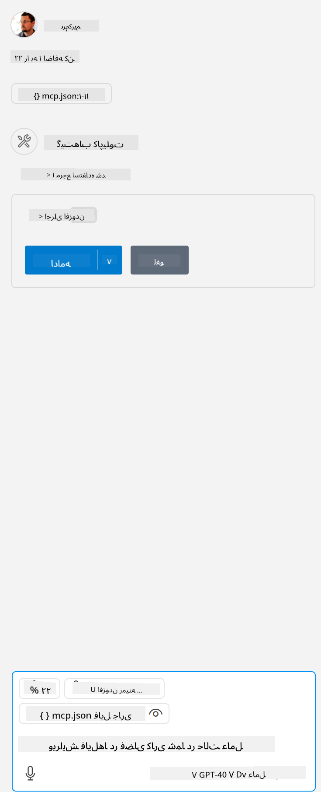

<!--
CO_OP_TRANSLATOR_METADATA:
{
  "original_hash": "5ef8f5821c1a04f7b1fc4f15098ecab8",
  "translation_date": "2025-07-13T19:39:12+00:00",
  "source_file": "03-GettingStarted/04-vscode/solution/README.md",
  "language_code": "fa"
}
-->
این معادل اجرای دستوری مانند این است: `node build/index.js`.

- این ورودی سرور را تغییر دهید تا متناسب با محل فایل سرور شما باشد یا با آنچه برای راه‌اندازی سرور شما بسته به زمان اجرای انتخابی و محل سرور لازم است، مطابقت داشته باشد.

## استفاده از قابلیت‌ها در سرور

- روی آیکون `play` کلیک کنید، پس از اینکه فایل *mcp.json* را به پوشه *./vscode* اضافه کردید،

    مشاهده خواهید کرد که آیکون ابزار تغییر می‌کند و تعداد ابزارهای در دسترس افزایش می‌یابد. آیکون ابزار درست بالای کادر چت در GitHub Copilot قرار دارد.

## اجرای یک ابزار

- در پنجره چت خود متنی وارد کنید که با توضیح ابزار شما مطابقت داشته باشد. برای مثال برای فعال کردن ابزار `add` چیزی شبیه به "add 3 to 20" تایپ کنید.

    باید ابزاری را بالای کادر متن چت ببینید که به شما نشان می‌دهد برای اجرای ابزار باید آن را انتخاب کنید، مانند تصویر زیر:

    

    انتخاب ابزار باید نتیجه عددی "23" را نشان دهد اگر متن شما مانند مثالی که قبلاً گفتیم باشد.

**سلب مسئولیت**:  
این سند با استفاده از سرویس ترجمه هوش مصنوعی [Co-op Translator](https://github.com/Azure/co-op-translator) ترجمه شده است. در حالی که ما در تلاش برای دقت هستیم، لطفاً توجه داشته باشید که ترجمه‌های خودکار ممکن است حاوی خطاها یا نواقصی باشند. سند اصلی به زبان بومی خود باید به عنوان منبع معتبر در نظر گرفته شود. برای اطلاعات حیاتی، ترجمه حرفه‌ای انسانی توصیه می‌شود. ما مسئول هیچ گونه سوءتفاهم یا تفسیر نادرستی که از استفاده این ترجمه ناشی شود، نیستیم.