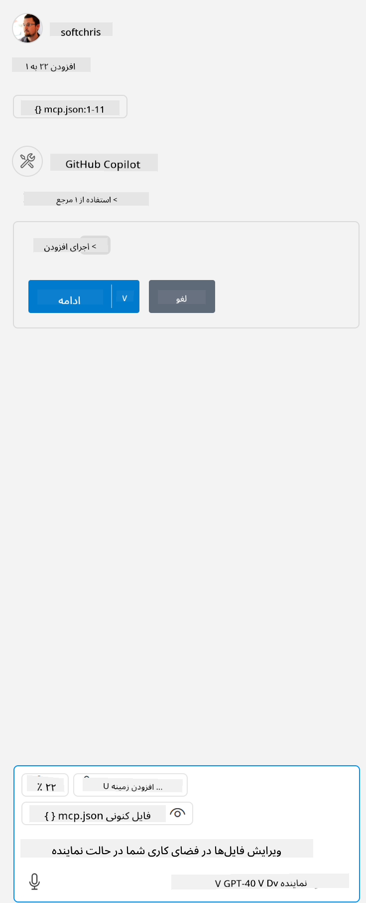

<!--
CO_OP_TRANSLATOR_METADATA:
{
  "original_hash": "96e08a8c1049dab757deb64cce4ea1e8",
  "translation_date": "2025-05-17T11:18:21+00:00",
  "source_file": "03-GettingStarted/04-vscode/solution/README.md",
  "language_code": "fa"
}
-->
# اجرای نمونه

در اینجا فرض می‌کنیم که شما قبلاً یک کد سرور عملیاتی دارید. لطفاً یک سرور از یکی از فصل‌های قبلی پیدا کنید.

## تنظیم mcp.json

این فایل برای مرجع استفاده می‌شود، [mcp.json](../../../../../03-GettingStarted/04-vscode/solution/mcp.json).

ورودی سرور را به گونه‌ای تغییر دهید که مسیر مطلق به سرور شما را نشان دهد، شامل فرمان کامل لازم برای اجرا.

در فایل نمونه‌ای که در بالا به آن اشاره شد، ورودی سرور به شکل زیر است:

```json
"hello-mcp": {
    "command": "cmd",
    "args": [
        "/c", "node", "<absolute path>\\build\\index.js"
    ]
}
```

این معادل اجرای فرمانی مانند این است: `cmd /c node <absolute path>\\build\index.js`. 

- Change this server entry to fit where your server file is located or to what's needed to startup your server depending on your chosen runtime and server location.

## Consume the features in the server

- Click the `play` icon, once you've added *mcp.json* to *./vscode* folder, 

    Observe the tooling icon change to increase the number of available tools. Tooling icon is located right above the chat field in GitHub Copilot.

## Run a tool

- Type a prompt in your chat window that matches the description of your tool. For example to trigger the tool `add` چیزی شبیه "اضافه کردن ۳ به ۲۰" بنویسید.

    شما باید ابزاری را بالای جعبه متن چت مشاهده کنید که نشان می‌دهد باید برای اجرای ابزار انتخاب کنید، مانند این تصویر:

    

    انتخاب ابزار باید نتیجه‌ای عددی تولید کند که می‌گوید "۲۳" اگر درخواست شما مانند آنچه که قبلاً ذکر کردیم باشد.

**سلب مسئولیت**:  
این سند با استفاده از سرویس ترجمه هوش مصنوعی [Co-op Translator](https://github.com/Azure/co-op-translator) ترجمه شده است. در حالی که ما برای دقت تلاش می‌کنیم، لطفاً توجه داشته باشید که ترجمه‌های خودکار ممکن است حاوی خطاها یا نادرستی‌هایی باشند. سند اصلی به زبان بومی آن باید به عنوان منبع معتبر در نظر گرفته شود. برای اطلاعات حیاتی، ترجمه حرفه‌ای انسانی توصیه می‌شود. ما مسئولیتی در قبال هرگونه سوء تفاهم یا تفسیر نادرست ناشی از استفاده از این ترجمه نداریم.