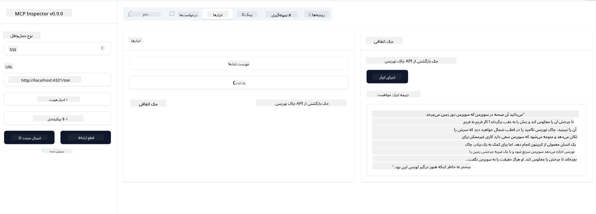

<!--
CO_OP_TRANSLATOR_METADATA:
{
  "original_hash": "0a8086dc4bf89448f83e7936db972c42",
  "translation_date": "2025-05-17T11:26:44+00:00",
  "source_file": "03-GettingStarted/05-sse-server/README.md",
  "language_code": "fa"
}
-->
# سرور SSE

SSE (رویدادهای ارسال شده توسط سرور) یک استاندارد برای استریم سرور به مشتری است که به سرورها اجازه می‌دهد تا به‌روزرسانی‌های لحظه‌ای را از طریق HTTP به مشتریان ارسال کنند. این ویژگی به‌ویژه برای برنامه‌هایی که نیاز به به‌روزرسانی‌های زنده دارند مانند برنامه‌های چت، اعلان‌ها یا فیدهای داده لحظه‌ای بسیار مفید است. همچنین، سرور شما می‌تواند توسط چندین مشتری به طور همزمان استفاده شود زیرا روی یک سرور زندگی می‌کند که می‌تواند به عنوان مثال در جایی از ابر اجرا شود.

## مروری کلی

این درس به نحوه ساخت و استفاده از سرورهای SSE می‌پردازد.

## اهداف یادگیری

تا پایان این درس، شما قادر خواهید بود:

- یک سرور SSE بسازید.
- سرور SSE را با استفاده از Inspector اشکال‌زدایی کنید.
- سرور SSE را با استفاده از Visual Studio Code مصرف کنید.

## SSE، چگونه کار می‌کند

SSE یکی از دو نوع حمل و نقل پشتیبانی شده است. شما قبلاً اولین نوع stdio را در درس‌های قبلی مشاهده کرده‌اید. تفاوت به شرح زیر است:

- SSE نیاز دارد که شما دو چیز را مدیریت کنید: اتصال و پیام‌ها.
- از آنجا که این یک سرور است که می‌تواند در هر جایی زندگی کند، شما باید این موضوع را در نحوه کار با ابزارهایی مانند Inspector و Visual Studio منعکس کنید. به این معنی که به جای اینکه بگویید چگونه سرور را شروع کنید، به نقطه پایانی اشاره می‌کنید که می‌تواند یک اتصال برقرار کند. به کد نمونه زیر نگاه کنید:
شما تا داده‌های اکتبر 2023 آموزش دیده‌اید.

حالا که کمی بیشتر درباره SSE می‌دانیم، بیایید در ادامه یک سرور SSE بسازیم.

## تمرین: ایجاد یک سرور SSE

برای ساخت سرورمان، باید دو نکته را در نظر داشته باشیم:

- باید از یک وب سرور برای نمایش نقاط پایانی برای اتصال و پیام‌ها استفاده کنیم.
- سرورمان را مانند زمانی که از stdio استفاده می‌کردیم با ابزارها، منابع و درخواست‌ها بسازیم.

### -1- ایجاد یک نمونه سرور

برای ساخت سرورمان، از همان نوع‌ها مانند stdio استفاده می‌کنیم. اما برای حمل و نقل، باید SSE را انتخاب کنیم.

بیایید در ادامه مسیرهای مورد نیاز را اضافه کنیم.

### -2- افزودن مسیرها

بیایید مسیرهایی را اضافه کنیم که اتصال و پیام‌های ورودی را مدیریت کنند:

بیایید قابلیت‌ها را به سرور اضافه کنیم.

### -3- افزودن قابلیت‌های سرور

حالا که همه چیز مربوط به SSE را تعریف کرده‌ایم، بیایید قابلیت‌های سرور مانند ابزارها، درخواست‌ها و منابع را اضافه کنیم.

کد کامل شما باید به این شکل باشد:

عالی، ما یک سرور با استفاده از SSE داریم، بیایید در ادامه آن را آزمایش کنیم.

## تمرین: اشکال‌زدایی یک سرور SSE با Inspector

Inspector یک ابزار عالی است که در درس قبلی [ایجاد اولین سرور خود](/03-GettingStarted/01-first-server/README.md) مشاهده کردیم. بیایید ببینیم آیا می‌توانیم حتی اینجا از Inspector استفاده کنیم:

### -1- اجرای Inspector

برای اجرای Inspector، ابتدا باید یک سرور SSE در حال اجرا داشته باشید، بنابراین بیایید این کار را انجام دهیم:

1. سرور را اجرا کنید

1. Inspector را اجرا کنید

    > ![NOTE]
    > این را در یک پنجره ترمینال جداگانه نسبت به سرور اجرا کنید. همچنین توجه داشته باشید که باید فرمان زیر را برای تطابق با URLی که سرور شما اجرا می‌شود تنظیم کنید.

    ```sh
    npx @modelcontextprotocol/inspector --cli http://localhost:8000/sse --method tools/list
    ```

    اجرای Inspector در همه زمان‌ها یکسان به نظر می‌رسد. توجه کنید که به جای اینکه مسیر سرور و فرمانی برای شروع سرور را ارائه دهیم، URLی که سرور در آن اجرا می‌شود و همچنین مسیر `/sse` را مشخص می‌کنیم.

### -2- امتحان کردن ابزار

سرور را با انتخاب SSE در لیست کشویی و پر کردن فیلد URL که سرور شما در آن اجرا می‌شود، به عنوان مثال http:localhost:4321/sse متصل کنید. حالا روی دکمه "Connect" کلیک کنید. مانند قبل، ابزارها را لیست کنید، یک ابزار انتخاب کنید و مقادیر ورودی را ارائه دهید. شما باید نتیجه‌ای مانند زیر مشاهده کنید:



عالی، شما قادر به کار با Inspector هستید، بیایید ببینیم چگونه می‌توانیم با Visual Studio Code کار کنیم.

## وظیفه

سعی کنید سرور خود را با قابلیت‌های بیشتری بسازید. به [این صفحه](https://api.chucknorris.io/) مراجعه کنید تا به عنوان مثال ابزاری اضافه کنید که یک API را فراخوانی کند، شما تصمیم می‌گیرید که سرور چگونه باید باشد. لذت ببرید :)

## راه‌حل

[راه‌حل](./solution/README.md) اینجا یک راه‌حل ممکن با کد کاری است.

## نکات کلیدی

نکات کلیدی این فصل به شرح زیر است:

- SSE دومین نوع حمل و نقل پشتیبانی شده بعد از stdio است.
- برای پشتیبانی از SSE، باید اتصالات ورودی و پیام‌ها را با استفاده از یک چارچوب وب مدیریت کنید.
- شما می‌توانید از هر دو Inspector و Visual Studio Code برای مصرف سرور SSE استفاده کنید، درست مانند سرورهای stdio. توجه کنید که کمی بین stdio و SSE تفاوت وجود دارد. برای SSE، شما باید سرور را جداگانه راه‌اندازی کنید و سپس ابزار Inspector خود را اجرا کنید. برای ابزار Inspector، تفاوت‌هایی نیز وجود دارد که باید URL را مشخص کنید.

## نمونه‌ها

- [ماشین حساب جاوا](../samples/java/calculator/README.md)
- [ماشین حساب .Net](../../../../03-GettingStarted/samples/csharp)
- [ماشین حساب جاوا اسکریپت](../samples/javascript/README.md)
- [ماشین حساب تایپ اسکریپت](../samples/typescript/README.md)
- [ماشین حساب پایتون](../../../../03-GettingStarted/samples/python)

## منابع اضافی

- [SSE](https://developer.mozilla.org/en-US/docs/Web/API/Server-sent_events)

## مرحله بعدی

- بعدی: [شروع به کار با ابزارک AI برای VSCode](/03-GettingStarted/06-aitk/README.md)

**سلب مسئولیت**:  
این سند با استفاده از سرویس ترجمه هوش مصنوعی [Co-op Translator](https://github.com/Azure/co-op-translator) ترجمه شده است. در حالی که ما تلاش می‌کنیم تا دقت را حفظ کنیم، لطفاً توجه داشته باشید که ترجمه‌های خودکار ممکن است حاوی خطاها یا نادرستی‌ها باشند. سند اصلی به زبان اصلی آن باید به عنوان منبع معتبر در نظر گرفته شود. برای اطلاعات حساس، توصیه می‌شود از ترجمه انسانی حرفه‌ای استفاده کنید. ما مسئولیتی در قبال هرگونه سوء تفاهم یا سوء تفسیر ناشی از استفاده از این ترجمه نداریم.