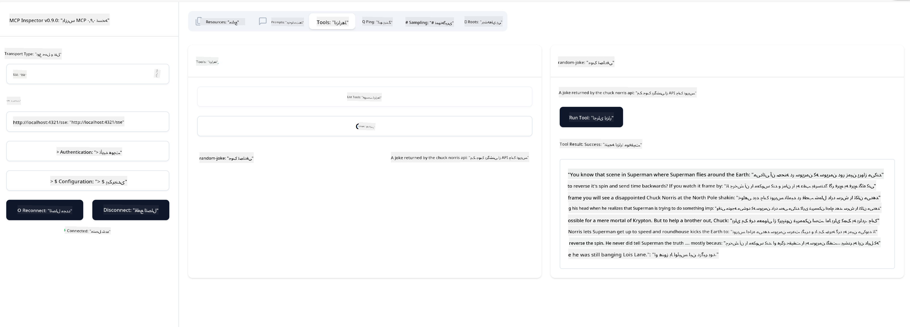

<!--
CO_OP_TRANSLATOR_METADATA:
{
  "original_hash": "1681ca3633aeb49ee03766abdbb94a93",
  "translation_date": "2025-06-17T21:55:12+00:00",
  "source_file": "03-GettingStarted/05-sse-server/README.md",
  "language_code": "fa"
}
-->
حالا که کمی بیشتر درباره SSE می‌دانیم، بیایید یک سرور SSE بسازیم.

## تمرین: ایجاد یک سرور SSE

برای ساخت سرورمان، باید دو نکته را در نظر داشته باشیم:

- باید از یک وب سرور برای ارائه نقاط اتصال (endpoints) برای اتصال و پیام‌ها استفاده کنیم.
- سرور را همانطور که معمولاً با ابزارها، منابع و پرامپت‌ها هنگام استفاده از stdio می‌ساختیم، بسازیم.

### -1- ایجاد یک نمونه سرور

برای ساخت سرور، از همان نوع‌ها مانند stdio استفاده می‌کنیم. با این تفاوت که برای نوع انتقال (transport)، باید SSE را انتخاب کنیم.

---

حالا بیایید مسیرهای مورد نیاز را اضافه کنیم.

### -2- اضافه کردن مسیرها

بیایید مسیرهایی اضافه کنیم که مسئول اتصال و دریافت پیام‌ها باشند:

---

حالا بیایید قابلیت‌هایی به سرور اضافه کنیم.

### -3- افزودن قابلیت‌های سرور

حالا که همه چیز مربوط به SSE تعریف شده، بیایید قابلیت‌هایی مثل ابزارها، پرامپت‌ها و منابع را به سرور اضافه کنیم.

---

کد کامل شما باید به این شکل باشد:

---

عالی است، ما یک سرور با استفاده از SSE داریم، حالا بیایید آن را امتحان کنیم.

## تمرین: اشکال‌زدایی سرور SSE با Inspector

Inspector ابزاری عالی است که در درس قبلی [ساخت اولین سرور خود](/03-GettingStarted/01-first-server/README.md) دیدیم. بیایید ببینیم آیا می‌توانیم Inspector را اینجا هم استفاده کنیم:

### -1- اجرای Inspector

برای اجرای Inspector، ابتدا باید یک سرور SSE در حال اجرا داشته باشید، پس بیایید این کار را انجام دهیم:

1. سرور را اجرا کنید

---

1. Inspector را اجرا کنید

    > [!NOTE]
    > این دستور را در یک پنجره ترمینال جداگانه نسبت به جایی که سرور در حال اجرا است اجرا کنید. همچنین توجه داشته باشید که باید دستور زیر را متناسب با URL که سرور شما روی آن اجرا می‌شود تنظیم کنید.

    ```sh
    npx @modelcontextprotocol/inspector --cli http://localhost:8000/sse --method tools/list
    ```

    اجرای Inspector در تمام محیط‌ها مشابه است. توجه کنید که به جای ارسال مسیر سرور و دستور شروع سرور، URL که سرور روی آن اجرا می‌شود را ارسال می‌کنیم و همچنین مسیر `/sse` را مشخص می‌کنیم.

### -2- آزمایش ابزار

با انتخاب SSE از لیست کشویی و وارد کردن آدرس URL جایی که سرورتان در حال اجرا است، مثلاً http://localhost:4321/sse، به سرور متصل شوید. سپس روی دکمه "Connect" کلیک کنید. مانند قبل، ابزارها را لیست کنید، یک ابزار انتخاب کنید و ورودی‌ها را وارد کنید. باید نتیجه‌ای شبیه تصویر زیر ببینید:



عالی است، شما می‌توانید با Inspector کار کنید، حالا بیایید ببینیم چگونه می‌توانیم با Visual Studio Code کار کنیم.

## تمرین

سعی کنید سرورتان را با قابلیت‌های بیشتر توسعه دهید. به [این صفحه](https://api.chucknorris.io/) مراجعه کنید تا مثلاً ابزاری اضافه کنید که یک API را فراخوانی کند. تصمیم با شماست که سرور چگونه باشد. خوش بگذرد :)

## راه‌حل

[راه‌حل](./solution/README.md) اینجا یک راه‌حل ممکن با کد عملی آورده شده است.

## نکات کلیدی

نکات کلیدی این فصل عبارتند از:

- SSE دومین نوع انتقال پشتیبانی شده بعد از stdio است.
- برای پشتیبانی از SSE باید اتصالات و پیام‌های ورودی را با استفاده از یک فریم‌ورک وب مدیریت کنید.
- می‌توانید از هر دو Inspector و Visual Studio Code برای استفاده از سرور SSE استفاده کنید، درست مانند سرورهای stdio. توجه کنید که تفاوت‌هایی بین stdio و SSE وجود دارد. برای SSE باید سرور را جداگانه راه‌اندازی کنید و سپس ابزار Inspector را اجرا کنید. همچنین برای Inspector باید URL سرور را مشخص کنید.

## نمونه‌ها

- [ماشین حساب جاوا](../samples/java/calculator/README.md)
- [ماشین حساب .Net](../../../../03-GettingStarted/samples/csharp)
- [ماشین حساب جاوااسکریپت](../samples/javascript/README.md)
- [ماشین حساب تایپ‌اسکریپت](../samples/typescript/README.md)
- [ماشین حساب پایتون](../../../../03-GettingStarted/samples/python)

## منابع اضافی

- [SSE](https://developer.mozilla.org/en-US/docs/Web/API/Server-sent_events)

## مرحله بعد

- بعدی: [پخش HTTP با MCP (HTTP قابل پخش)](/03-GettingStarted/06-http-streaming/README.md)

**سلب مسئولیت**:  
این سند با استفاده از سرویس ترجمه هوش مصنوعی [Co-op Translator](https://github.com/Azure/co-op-translator) ترجمه شده است. در حالی که ما برای دقت تلاش می‌کنیم، لطفاً توجه داشته باشید که ترجمه‌های خودکار ممکن است حاوی اشتباهات یا نواقصی باشند. سند اصلی به زبان مادری خود باید به عنوان منبع معتبر در نظر گرفته شود. برای اطلاعات حیاتی، ترجمه حرفه‌ای انسانی توصیه می‌شود. ما مسئول هیچ گونه سوءتفاهم یا تفسیر نادرستی که از استفاده این ترجمه ناشی شود، نیستیم.