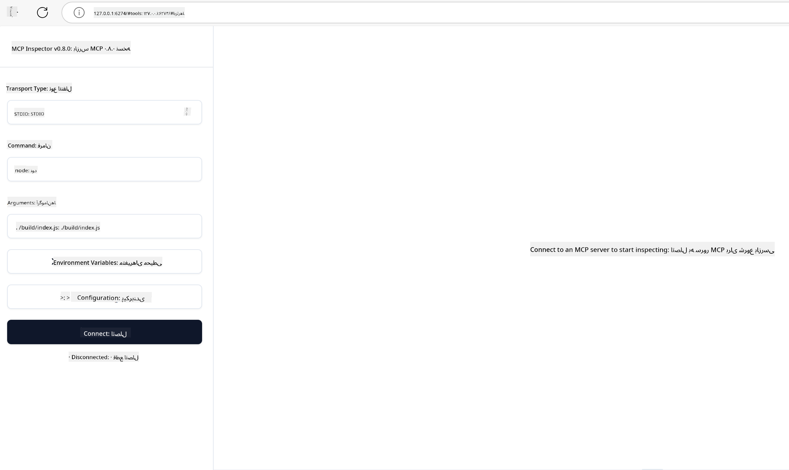

<!--
CO_OP_TRANSLATOR_METADATA:
{
  "original_hash": "4e34e34e84f013e73c7eaa6d09884756",
  "translation_date": "2025-07-13T21:57:09+00:00",
  "source_file": "03-GettingStarted/08-testing/README.md",
  "language_code": "fa"
}
-->
## تست و اشکال‌زدایی

قبل از شروع به تست سرور MCP خود، مهم است که ابزارهای موجود و بهترین روش‌های اشکال‌زدایی را بشناسید. تست مؤثر تضمین می‌کند که سرور شما طبق انتظار عمل می‌کند و به شما کمک می‌کند مشکلات را سریع‌تر شناسایی و رفع کنید. بخش زیر روش‌های پیشنهادی برای اعتبارسنجی پیاده‌سازی MCP شما را توضیح می‌دهد.

## مرور کلی

این درس نحوه انتخاب روش تست مناسب و مؤثرترین ابزار تست را پوشش می‌دهد.

## اهداف یادگیری

در پایان این درس، شما قادر خواهید بود:

- روش‌های مختلف تست را شرح دهید.
- از ابزارهای مختلف برای تست مؤثر کد خود استفاده کنید.

## تست سرورهای MCP

MCP ابزارهایی برای کمک به تست و اشکال‌زدایی سرورهای شما فراهم می‌کند:

- **MCP Inspector**: ابزاری خط فرمان که هم به صورت CLI و هم به صورت ابزار بصری قابل اجرا است.
- **تست دستی**: می‌توانید از ابزاری مانند curl برای ارسال درخواست‌های وب استفاده کنید، اما هر ابزاری که بتواند HTTP اجرا کند مناسب است.
- **تست واحد**: امکان استفاده از فریم‌ورک تست دلخواه خود برای تست ویژگی‌های سرور و کلاینت وجود دارد.

### استفاده از MCP Inspector

ما قبلاً نحوه استفاده از این ابزار را در درس‌های قبل توضیح داده‌ایم، اما اجازه دهید کمی به صورت کلی درباره آن صحبت کنیم. این ابزار با Node.js ساخته شده و می‌توانید با اجرای دستور `npx` آن را به طور موقت دانلود و نصب کنید و پس از اتمام اجرای درخواست، خودکار پاک می‌شود.

[MCP Inspector](https://github.com/modelcontextprotocol/inspector) به شما کمک می‌کند:

- **کشف قابلیت‌های سرور**: منابع، ابزارها و پرامپت‌های موجود را به صورت خودکار شناسایی کنید
- **تست اجرای ابزارها**: پارامترهای مختلف را امتحان کنید و پاسخ‌ها را به صورت زنده مشاهده کنید
- **مشاهده متادیتای سرور**: اطلاعات سرور، اسکیم‌ها و تنظیمات را بررسی کنید

یک اجرای معمولی از این ابزار به شکل زیر است:

```bash
npx @modelcontextprotocol/inspector node build/index.js
```

دستور بالا یک MCP و رابط بصری آن را راه‌اندازی می‌کند و یک رابط وب محلی در مرورگر شما باز می‌کند. انتظار می‌رود داشبوردی ببینید که سرورهای MCP ثبت‌شده، ابزارها، منابع و پرامپت‌های موجود را نمایش می‌دهد. این رابط به شما امکان می‌دهد اجرای ابزارها را به صورت تعاملی تست کنید، متادیتای سرور را بررسی کنید و پاسخ‌های زنده را مشاهده کنید که اعتبارسنجی و اشکال‌زدایی پیاده‌سازی‌های MCP شما را آسان‌تر می‌کند.

نمایی از آن به این شکل است: 

همچنین می‌توانید این ابزار را در حالت CLI اجرا کنید که در این صورت باید ویژگی `--cli` را اضافه کنید. در اینجا نمونه‌ای از اجرای ابزار در حالت "CLI" که همه ابزارهای سرور را فهرست می‌کند آمده است:

```sh
npx @modelcontextprotocol/inspector --cli node build/index.js --method tools/list
```

### تست دستی

علاوه بر اجرای ابزار inspector برای تست قابلیت‌های سرور، روش مشابه دیگری این است که از کلاینتی که توانایی استفاده از HTTP را دارد، مانند curl، استفاده کنید.

با curl می‌توانید سرورهای MCP را مستقیماً با درخواست‌های HTTP تست کنید:

```bash
# Example: Test server metadata
curl http://localhost:3000/v1/metadata

# Example: Execute a tool
curl -X POST http://localhost:3000/v1/tools/execute \
  -H "Content-Type: application/json" \
  -d '{"name": "calculator", "parameters": {"expression": "2+2"}}'
```

همانطور که در مثال بالا با curl مشاهده می‌کنید، از درخواست POST برای فراخوانی یک ابزار با استفاده از بار داده‌ای شامل نام ابزار و پارامترهای آن استفاده می‌کنید. روشی را انتخاب کنید که برای شما مناسب‌تر است. ابزارهای CLI معمولاً سریع‌تر هستند و قابلیت اسکریپت‌نویسی دارند که در محیط‌های CI/CD بسیار مفید است.

### تست واحد

برای ابزارها و منابع خود تست واحد ایجاد کنید تا مطمئن شوید طبق انتظار کار می‌کنند. در اینجا نمونه‌ای از کد تست آورده شده است.

```python
import pytest

from mcp.server.fastmcp import FastMCP
from mcp.shared.memory import (
    create_connected_server_and_client_session as create_session,
)

# Mark the whole module for async tests
pytestmark = pytest.mark.anyio


async def test_list_tools_cursor_parameter():
    """Test that the cursor parameter is accepted for list_tools.

    Note: FastMCP doesn't currently implement pagination, so this test
    only verifies that the cursor parameter is accepted by the client.
    """

 server = FastMCP("test")

    # Create a couple of test tools
    @server.tool(name="test_tool_1")
    async def test_tool_1() -> str:
        """First test tool"""
        return "Result 1"

    @server.tool(name="test_tool_2")
    async def test_tool_2() -> str:
        """Second test tool"""
        return "Result 2"

    async with create_session(server._mcp_server) as client_session:
        # Test without cursor parameter (omitted)
        result1 = await client_session.list_tools()
        assert len(result1.tools) == 2

        # Test with cursor=None
        result2 = await client_session.list_tools(cursor=None)
        assert len(result2.tools) == 2

        # Test with cursor as string
        result3 = await client_session.list_tools(cursor="some_cursor_value")
        assert len(result3.tools) == 2

        # Test with empty string cursor
        result4 = await client_session.list_tools(cursor="")
        assert len(result4.tools) == 2
    
```

کد بالا موارد زیر را انجام می‌دهد:

- از فریم‌ورک pytest استفاده می‌کند که به شما اجازه می‌دهد تست‌ها را به صورت توابع ایجاد کرده و از دستورات assert استفاده کنید.
- یک MCP Server با دو ابزار مختلف ایجاد می‌کند.
- با استفاده از دستور `assert` بررسی می‌کند که شرایط خاصی برآورده شده‌اند.

می‌توانید فایل کامل را در [اینجا](https://github.com/modelcontextprotocol/python-sdk/blob/main/tests/client/test_list_methods_cursor.py) مشاهده کنید.

با استفاده از فایل بالا، می‌توانید سرور خود را تست کنید تا مطمئن شوید قابلیت‌ها به درستی ایجاد شده‌اند.

تمام SDKهای اصلی بخش‌های مشابهی برای تست دارند که می‌توانید آن‌ها را با محیط اجرایی انتخابی خود تطبیق دهید.

## نمونه‌ها

- [ماشین حساب جاوا](../samples/java/calculator/README.md)
- [ماشین حساب .Net](../../../../03-GettingStarted/samples/csharp)
- [ماشین حساب جاوااسکریپت](../samples/javascript/README.md)
- [ماشین حساب تایپ‌اسکریپت](../samples/typescript/README.md)
- [ماشین حساب پایتون](../../../../03-GettingStarted/samples/python)

## منابع اضافی

- [Python SDK](https://github.com/modelcontextprotocol/python-sdk)

## مرحله بعد

- بعدی: [استقرار](../09-deployment/README.md)

**سلب مسئولیت**:  
این سند با استفاده از سرویس ترجمه هوش مصنوعی [Co-op Translator](https://github.com/Azure/co-op-translator) ترجمه شده است. در حالی که ما در تلاش برای دقت هستیم، لطفاً توجه داشته باشید که ترجمه‌های خودکار ممکن است حاوی خطاها یا نادرستی‌هایی باشند. سند اصلی به زبان بومی خود باید به عنوان منبع معتبر در نظر گرفته شود. برای اطلاعات حیاتی، ترجمه حرفه‌ای انسانی توصیه می‌شود. ما مسئول هیچ گونه سوءتفاهم یا تفسیر نادرستی که از استفاده این ترجمه ناشی شود، نیستیم.