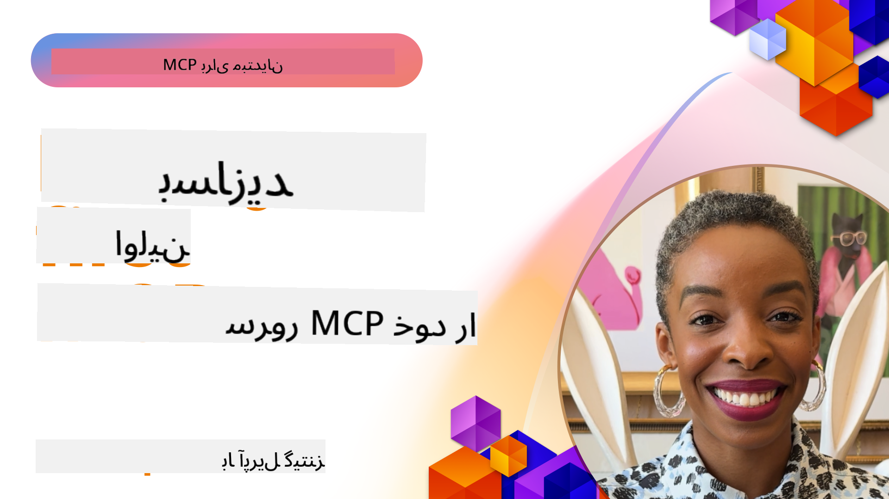

<!--
CO_OP_TRANSLATOR_METADATA:
{
  "original_hash": "1197b6dbde36773e04a5ae826557fdb9",
  "translation_date": "2025-08-26T17:10:30+00:00",
  "source_file": "03-GettingStarted/README.md",
  "language_code": "fa"
}
-->
## شروع به کار  

_(برای مشاهده ویدئوی این درس روی تصویر بالا کلیک کنید)_

این بخش شامل چندین درس است:

- **1 اولین سرور شما**، در این درس اول، یاد می‌گیرید که چگونه اولین سرور خود را ایجاد کنید و با ابزار بازرس آن را بررسی کنید، که روشی ارزشمند برای تست و اشکال‌زدایی سرور شماست، [به درس](01-first-server/README.md)

- **2 کلاینت**، در این درس یاد می‌گیرید که چگونه یک کلاینت بنویسید که بتواند به سرور شما متصل شود، [به درس](02-client/README.md)

- **3 کلاینت با LLM**، یک روش بهتر برای نوشتن کلاینت این است که یک LLM به آن اضافه کنید تا بتواند با سرور شما "مذاکره" کند که چه کاری انجام دهد، [به درس](03-llm-client/README.md)

- **4 استفاده از حالت Agent در GitHub Copilot در Visual Studio Code**. در اینجا، به اجرای سرور MCP خود از داخل Visual Studio Code می‌پردازیم، [به درس](04-vscode/README.md)

- **5 سرور با انتقال stdio**. انتقال stdio استاندارد توصیه‌شده برای ارتباط سرور به کلاینت MCP در مشخصات فعلی است که ارتباط امن مبتنی بر زیر‌فرآیند را فراهم می‌کند، [به درس](05-stdio-server/README.md)

- **6 استریم HTTP با MCP (HTTP قابل استریم)**. درباره استریم مدرن HTTP، اعلان‌های پیشرفت، و نحوه پیاده‌سازی سرورها و کلاینت‌های MCP مقیاس‌پذیر و بلادرنگ با استفاده از HTTP قابل استریم بیاموزید، [به درس](06-http-streaming/README.md)

- **7 استفاده از ابزارهای هوش مصنوعی برای VSCode** برای استفاده و تست کلاینت‌ها و سرورهای MCP شما، [به درس](07-aitk/README.md)

- **8 تست کردن**. در اینجا به‌ویژه بر روی روش‌های مختلف تست سرور و کلاینت خود تمرکز خواهیم کرد، [به درس](08-testing/README.md)

- **9 استقرار**. این فصل به روش‌های مختلف استقرار راه‌حل‌های MCP شما می‌پردازد، [به درس](09-deployment/README.md)

پروتکل Model Context Protocol (MCP) یک پروتکل باز است که استانداردی برای نحوه ارائه زمینه به LLMها توسط برنامه‌ها فراهم می‌کند. MCP را مانند یک پورت USB-C برای برنامه‌های هوش مصنوعی تصور کنید - این پروتکل یک روش استاندارد برای اتصال مدل‌های هوش مصنوعی به منابع داده و ابزارهای مختلف ارائه می‌دهد.

## اهداف یادگیری

در پایان این درس، شما قادر خواهید بود:

- محیط‌های توسعه برای MCP را در زبان‌های C#، Java، Python، TypeScript و JavaScript تنظیم کنید
- سرورهای MCP پایه با ویژگی‌های سفارشی (منابع، پرامپت‌ها و ابزارها) بسازید و مستقر کنید
- برنامه‌های میزبان ایجاد کنید که به سرورهای MCP متصل شوند
- پیاده‌سازی‌های MCP را تست و اشکال‌زدایی کنید
- چالش‌های رایج در تنظیمات را درک کرده و راه‌حل‌های آن‌ها را بیابید
- پیاده‌سازی‌های MCP خود را به خدمات محبوب LLM متصل کنید

## تنظیم محیط MCP شما

قبل از شروع کار با MCP، مهم است که محیط توسعه خود را آماده کنید و جریان کاری پایه را درک کنید. این بخش شما را از طریق مراحل اولیه تنظیم راهنمایی می‌کند تا شروعی روان با MCP داشته باشید.

### پیش‌نیازها

قبل از ورود به توسعه MCP، اطمینان حاصل کنید که موارد زیر را دارید:

- **محیط توسعه**: برای زبان انتخابی شما (C#، Java، Python، TypeScript یا JavaScript)
- **IDE/ویرایشگر**: Visual Studio، Visual Studio Code، IntelliJ، Eclipse، PyCharm یا هر ویرایشگر کد مدرن
- **مدیر بسته‌ها**: NuGet، Maven/Gradle، pip یا npm/yarn
- **کلیدهای API**: برای هر سرویس هوش مصنوعی که قصد دارید در برنامه‌های میزبان خود استفاده کنید

### SDKهای رسمی

در فصل‌های آینده، راه‌حل‌هایی را خواهید دید که با استفاده از Python، TypeScript، Java و .NET ساخته شده‌اند. در اینجا تمام SDKهای رسمی پشتیبانی‌شده آورده شده است.

MCP SDKهای رسمی برای زبان‌های مختلف ارائه می‌دهد:
- [C# SDK](https://github.com/modelcontextprotocol/csharp-sdk) - با همکاری مایکروسافت نگهداری می‌شود
- [Java SDK](https://github.com/modelcontextprotocol/java-sdk) - با همکاری Spring AI نگهداری می‌شود
- [TypeScript SDK](https://github.com/modelcontextprotocol/typescript-sdk) - پیاده‌سازی رسمی TypeScript
- [Python SDK](https://github.com/modelcontextprotocol/python-sdk) - پیاده‌سازی رسمی Python
- [Kotlin SDK](https://github.com/modelcontextprotocol/kotlin-sdk) - پیاده‌سازی رسمی Kotlin
- [Swift SDK](https://github.com/modelcontextprotocol/swift-sdk) - با همکاری Loopwork AI نگهداری می‌شود
- [Rust SDK](https://github.com/modelcontextprotocol/rust-sdk) - پیاده‌سازی رسمی Rust

## نکات کلیدی

- تنظیم محیط توسعه MCP با استفاده از SDKهای مخصوص زبان ساده است
- ساخت سرورهای MCP شامل ایجاد و ثبت ابزارها با طرح‌های مشخص است
- کلاینت‌های MCP به سرورها و مدل‌ها متصل می‌شوند تا قابلیت‌های بیشتری را به کار گیرند
- تست و اشکال‌زدایی برای پیاده‌سازی‌های قابل‌اعتماد MCP ضروری است
- گزینه‌های استقرار از توسعه محلی تا راه‌حل‌های مبتنی بر ابر متغیر است

## تمرین

ما مجموعه‌ای از نمونه‌ها داریم که تمرینات موجود در تمام فصل‌های این بخش را تکمیل می‌کند. علاوه بر این، هر فصل تمرین‌ها و تکالیف خاص خود را نیز دارد.

- [ماشین‌حساب جاوا](./samples/java/calculator/README.md)
- [ماشین‌حساب .Net](../../../03-GettingStarted/samples/csharp)
- [ماشین‌حساب جاوااسکریپت](./samples/javascript/README.md)
- [ماشین‌حساب تایپ‌اسکریپت](./samples/typescript/README.md)
- [ماشین‌حساب پایتون](../../../03-GettingStarted/samples/python)

## منابع اضافی

- [ساخت Agentها با استفاده از Model Context Protocol در Azure](https://learn.microsoft.com/azure/developer/ai/intro-agents-mcp)
- [MCP از راه دور با Azure Container Apps (Node.js/TypeScript/JavaScript)](https://learn.microsoft.com/samples/azure-samples/mcp-container-ts/mcp-container-ts/)
- [.NET OpenAI MCP Agent](https://learn.microsoft.com/samples/azure-samples/openai-mcp-agent-dotnet/openai-mcp-agent-dotnet/)

## مرحله بعدی

بعدی: [ایجاد اولین سرور MCP شما](01-first-server/README.md)

---

**سلب مسئولیت**:  
این سند با استفاده از سرویس ترجمه هوش مصنوعی [Co-op Translator](https://github.com/Azure/co-op-translator) ترجمه شده است. در حالی که ما تلاش می‌کنیم دقت را حفظ کنیم، لطفاً توجه داشته باشید که ترجمه‌های خودکار ممکن است شامل خطاها یا نادرستی‌ها باشند. سند اصلی به زبان اصلی آن باید به عنوان منبع معتبر در نظر گرفته شود. برای اطلاعات حساس، توصیه می‌شود از ترجمه حرفه‌ای انسانی استفاده کنید. ما مسئولیتی در قبال سوء تفاهم‌ها یا تفسیرهای نادرست ناشی از استفاده از این ترجمه نداریم.