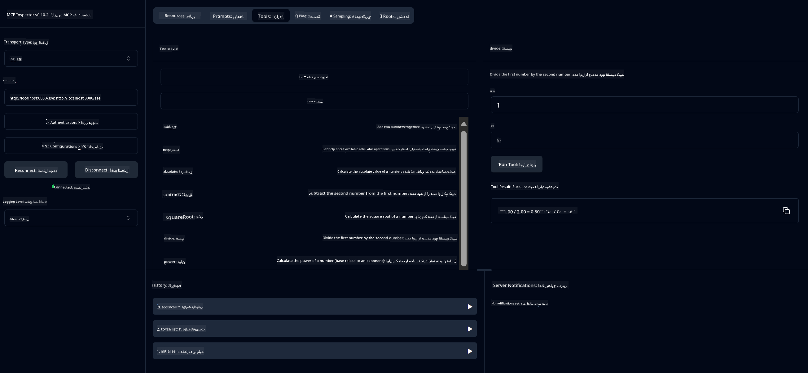

<!--
CO_OP_TRANSLATOR_METADATA:
{
  "original_hash": "13231e9951b68efd9df8c56bd5cdb27e",
  "translation_date": "2025-07-13T22:21:41+00:00",
  "source_file": "03-GettingStarted/samples/java/calculator/README.md",
  "language_code": "fa"
}
-->
# سرویس ماشین‌حساب پایه MCP

این سرویس عملیات پایه ماشین‌حساب را از طریق پروتکل Model Context (MCP) با استفاده از Spring Boot و انتقال WebFlux ارائه می‌دهد. این سرویس به عنوان یک مثال ساده برای مبتدیانی که می‌خواهند با پیاده‌سازی‌های MCP آشنا شوند طراحی شده است.

برای اطلاعات بیشتر، به مستندات مرجع [MCP Server Boot Starter](https://docs.spring.io/spring-ai/reference/api/mcp/mcp-server-boot-starter-docs.html) مراجعه کنید.

## مرور کلی

این سرویس موارد زیر را نمایش می‌دهد:
- پشتیبانی از SSE (رویدادهای ارسال شده از سرور)
- ثبت خودکار ابزارها با استفاده از انوتیشن `@Tool` در Spring AI
- عملکردهای پایه ماشین‌حساب:
  - جمع، تفریق، ضرب، تقسیم
  - محاسبه توان و جذر
  - محاسبه باقی‌مانده (مدولوس) و قدر مطلق
  - تابع راهنما برای توضیح عملیات‌ها

## ویژگی‌ها

این سرویس ماشین‌حساب امکانات زیر را ارائه می‌دهد:

1. **عملیات حسابی پایه**:
   - جمع دو عدد
   - تفریق یک عدد از عدد دیگر
   - ضرب دو عدد
   - تقسیم یک عدد بر عدد دیگر (با بررسی تقسیم بر صفر)

2. **عملیات پیشرفته**:
   - محاسبه توان (بالا بردن پایه به توان)
   - محاسبه جذر (با بررسی عدد منفی)
   - محاسبه باقی‌مانده تقسیم
   - محاسبه قدر مطلق

3. **سیستم راهنما**:
   - تابع راهنمای داخلی که تمام عملیات‌های موجود را توضیح می‌دهد

## استفاده از سرویس

این سرویس از طریق پروتکل MCP نقاط انتهایی API زیر را ارائه می‌دهد:

- `add(a, b)`: جمع دو عدد
- `subtract(a, b)`: تفریق عدد دوم از اول
- `multiply(a, b)`: ضرب دو عدد
- `divide(a, b)`: تقسیم عدد اول بر دوم (با بررسی صفر بودن مخرج)
- `power(base, exponent)`: محاسبه توان یک عدد
- `squareRoot(number)`: محاسبه جذر (با بررسی عدد منفی)
- `modulus(a, b)`: محاسبه باقی‌مانده تقسیم
- `absolute(number)`: محاسبه قدر مطلق
- `help()`: دریافت اطلاعات درباره عملیات‌های موجود

## کلاینت تست

یک کلاینت تست ساده در بسته `com.microsoft.mcp.sample.client` گنجانده شده است. کلاس `SampleCalculatorClient` عملیات‌های موجود در سرویس ماشین‌حساب را نشان می‌دهد.

## استفاده از کلاینت LangChain4j

این پروژه شامل یک کلاینت نمونه LangChain4j در `com.microsoft.mcp.sample.client.LangChain4jClient` است که نحوه ادغام سرویس ماشین‌حساب با LangChain4j و مدل‌های GitHub را نشان می‌دهد:

### پیش‌نیازها

1. **تنظیم توکن GitHub**:
   
   برای استفاده از مدل‌های هوش مصنوعی GitHub (مانند phi-4)، نیاز به یک توکن دسترسی شخصی GitHub دارید:

   الف. به تنظیمات حساب GitHub خود بروید: https://github.com/settings/tokens
   
   ب. روی "Generate new token" → "Generate new token (classic)" کلیک کنید
   
   ج. به توکن خود یک نام توصیفی بدهید
   
   د. موارد زیر را انتخاب کنید:
      - `repo` (کنترل کامل مخازن خصوصی)
      - `read:org` (خواندن عضویت در سازمان و تیم، خواندن پروژه‌های سازمان)
      - `gist` (ایجاد گیس‌ها)
      - `user:email` (دسترسی به آدرس‌های ایمیل کاربر (فقط خواندنی))
   
   ه. روی "Generate token" کلیک کرده و توکن جدید را کپی کنید
   
   و. آن را به عنوان یک متغیر محیطی تنظیم کنید:
      
      در ویندوز:
      ```
      set GITHUB_TOKEN=your-github-token
      ```
      
      در macOS/Linux:
      ```bash
      export GITHUB_TOKEN=your-github-token
      ```

   ز. برای تنظیم دائمی، آن را از طریق تنظیمات سیستم به متغیرهای محیطی اضافه کنید

2. وابستگی LangChain4j GitHub را به پروژه خود اضافه کنید (قبلاً در pom.xml گنجانده شده است):
   ```xml
   <dependency>
       <groupId>dev.langchain4j</groupId>
       <artifactId>langchain4j-github</artifactId>
       <version>${langchain4j.version}</version>
   </dependency>
   ```

3. اطمینان حاصل کنید که سرور ماشین‌حساب روی `localhost:8080` در حال اجرا است

### اجرای کلاینت LangChain4j

این مثال موارد زیر را نشان می‌دهد:
- اتصال به سرور MCP ماشین‌حساب از طریق انتقال SSE
- استفاده از LangChain4j برای ایجاد یک چت‌بات که از عملیات ماشین‌حساب بهره می‌برد
- ادغام با مدل‌های هوش مصنوعی GitHub (اکنون با مدل phi-4)

کلاینت نمونه پرسش‌های زیر را برای نمایش عملکرد ارسال می‌کند:
1. محاسبه جمع دو عدد
2. یافتن جذر یک عدد
3. دریافت اطلاعات راهنما درباره عملیات‌های موجود در ماشین‌حساب

مثال را اجرا کنید و خروجی کنسول را بررسی کنید تا ببینید مدل هوش مصنوعی چگونه از ابزارهای ماشین‌حساب برای پاسخ به پرسش‌ها استفاده می‌کند.

### پیکربندی مدل GitHub

کلاینت LangChain4j برای استفاده از مدل phi-4 GitHub با تنظیمات زیر پیکربندی شده است:

```java
ChatLanguageModel model = GitHubChatModel.builder()
    .apiKey(System.getenv("GITHUB_TOKEN"))
    .timeout(Duration.ofSeconds(60))
    .modelName("phi-4")
    .logRequests(true)
    .logResponses(true)
    .build();
```

برای استفاده از مدل‌های مختلف GitHub، کافی است پارامتر `modelName` را به مدل پشتیبانی شده دیگری تغییر دهید (مثلاً "claude-3-haiku-20240307"، "llama-3-70b-8192" و غیره).

## وابستگی‌ها

پروژه به وابستگی‌های کلیدی زیر نیاز دارد:

```xml
<!-- For MCP Server -->
<dependency>
    <groupId>org.springframework.ai</groupId>
    <artifactId>spring-ai-starter-mcp-server-webflux</artifactId>
</dependency>

<!-- For LangChain4j integration -->
<dependency>
    <groupId>dev.langchain4j</groupId>
    <artifactId>langchain4j-mcp</artifactId>
    <version>${langchain4j.version}</version>
</dependency>

<!-- For GitHub models support -->
<dependency>
    <groupId>dev.langchain4j</groupId>
    <artifactId>langchain4j-github</artifactId>
    <version>${langchain4j.version}</version>
</dependency>
```

## ساخت پروژه

پروژه را با استفاده از Maven بسازید:
```bash
./mvnw clean install -DskipTests
```

## اجرای سرور

### استفاده از جاوا

```bash
java -jar target/calculator-server-0.0.1-SNAPSHOT.jar
```

### استفاده از MCP Inspector

MCP Inspector ابزاری مفید برای تعامل با سرویس‌های MCP است. برای استفاده از آن با این سرویس ماشین‌حساب:

1. **نصب و اجرای MCP Inspector** در یک پنجره ترمینال جدید:
   ```bash
   npx @modelcontextprotocol/inspector
   ```

2. **دسترسی به رابط وب** با کلیک روی URL نمایش داده شده توسط برنامه (معمولاً http://localhost:6274)

3. **پیکربندی اتصال**:
   - نوع انتقال را روی "SSE" تنظیم کنید
   - URL را به نقطه انتهایی SSE سرور در حال اجرای خود تنظیم کنید: `http://localhost:8080/sse`
   - روی "Connect" کلیک کنید

4. **استفاده از ابزارها**:
   - روی "List Tools" کلیک کنید تا عملیات‌های ماشین‌حساب موجود را ببینید
   - یک ابزار را انتخاب کرده و روی "Run Tool" کلیک کنید تا عملیات اجرا شود



### استفاده از داکر

پروژه شامل یک Dockerfile برای استقرار در کانتینر است:

1. **ساخت ایمیج داکر**:
   ```bash
   docker build -t calculator-mcp-service .
   ```

2. **اجرای کانتینر داکر**:
   ```bash
   docker run -p 8080:8080 calculator-mcp-service
   ```

این کار:
- یک ایمیج چندمرحله‌ای داکر با Maven 3.9.9 و Eclipse Temurin 24 JDK می‌سازد
- یک ایمیج بهینه‌شده کانتینر ایجاد می‌کند
- سرویس را روی پورت 8080 در دسترس قرار می‌دهد
- سرویس ماشین‌حساب MCP را داخل کانتینر اجرا می‌کند

پس از اجرای کانتینر، می‌توانید به سرویس در `http://localhost:8080` دسترسی داشته باشید.

## عیب‌یابی

### مشکلات رایج با توکن GitHub

1. **مشکلات مجوز توکن**: اگر خطای 403 Forbidden دریافت کردید، بررسی کنید که توکن شما مجوزهای لازم را طبق پیش‌نیازها دارد.

2. **توکن یافت نشد**: اگر خطای "No API key found" دریافت کردید، مطمئن شوید متغیر محیطی GITHUB_TOKEN به درستی تنظیم شده است.

3. **محدودیت نرخ**: API گیت‌هاب محدودیت‌هایی دارد. اگر با خطای محدودیت نرخ (کد وضعیت 429) مواجه شدید، چند دقیقه صبر کنید و دوباره تلاش کنید.

4. **انقضای توکن**: توکن‌های GitHub ممکن است منقضی شوند. اگر پس از مدتی خطاهای احراز هویت دریافت کردید، توکن جدید بسازید و متغیر محیطی را به‌روزرسانی کنید.

اگر به کمک بیشتری نیاز داشتید، مستندات [LangChain4j](https://github.com/langchain4j/langchain4j) یا [مستندات API گیت‌هاب](https://docs.github.com/en/rest) را بررسی کنید.

**سلب مسئولیت**:  
این سند با استفاده از سرویس ترجمه هوش مصنوعی [Co-op Translator](https://github.com/Azure/co-op-translator) ترجمه شده است. در حالی که ما در تلاش برای دقت هستیم، لطفاً توجه داشته باشید که ترجمه‌های خودکار ممکن است حاوی خطاها یا نادرستی‌هایی باشند. سند اصلی به زبان بومی خود باید به عنوان منبع معتبر در نظر گرفته شود. برای اطلاعات حیاتی، ترجمه حرفه‌ای انسانی توصیه می‌شود. ما مسئول هیچ گونه سوءتفاهم یا تفسیر نادرستی که از استفاده این ترجمه ناشی شود، نیستیم.