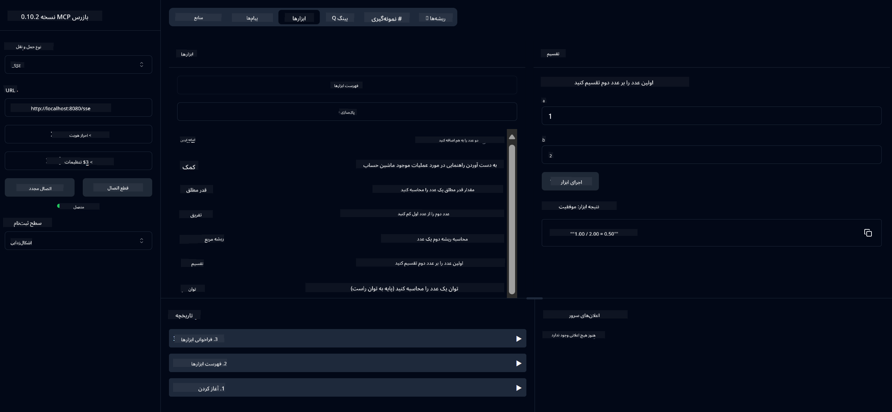

<!--
CO_OP_TRANSLATOR_METADATA:
{
  "original_hash": "13231e9951b68efd9df8c56bd5cdb27e",
  "translation_date": "2025-05-17T13:05:35+00:00",
  "source_file": "03-GettingStarted/samples/java/calculator/README.md",
  "language_code": "fa"
}
-->
# سرویس محاسبه‌گر پایه MCP

این سرویس عملیات محاسبه‌گر پایه را از طریق پروتکل مدل کانتکست (MCP) با استفاده از Spring Boot و انتقال WebFlux ارائه می‌دهد. این به عنوان یک مثال ساده برای مبتدیانی که در حال یادگیری پیاده‌سازی‌های MCP هستند، طراحی شده است.

برای اطلاعات بیشتر، به مستندات مرجع [MCP Server Boot Starter](https://docs.spring.io/spring-ai/reference/api/mcp/mcp-server-boot-starter-docs.html) مراجعه کنید.

## مرور کلی

این سرویس نشان می‌دهد:
- پشتیبانی از SSE (رویدادهای ارسال‌شده توسط سرور)
- ثبت خودکار ابزار با استفاده از توضیحات `@Tool` Spring AI
- عملکردهای محاسبه‌گر پایه:
  - جمع، تفریق، ضرب، تقسیم
  - محاسبه توان و جذر
  - باقی‌مانده (مدول) و مقدار مطلق
  - عملکرد کمک برای توضیحات عملیات

## ویژگی‌ها

این سرویس محاسبه‌گر قابلیت‌های زیر را ارائه می‌دهد:

1. **عملیات ریاضی پایه**:
   - جمع دو عدد
   - تفریق یک عدد از عدد دیگر
   - ضرب دو عدد
   - تقسیم یک عدد بر عدد دیگر (با بررسی تقسیم بر صفر)

2. **عملیات پیشرفته**:
   - محاسبه توان (بالا بردن پایه به توان)
   - محاسبه جذر (با بررسی عدد منفی)
   - محاسبه باقی‌مانده (مدول)
   - محاسبه مقدار مطلق

3. **سیستم کمک**:
   - عملکرد کمک داخلی که همه عملیات موجود را توضیح می‌دهد

## استفاده از سرویس

این سرویس نقاط انتهایی API زیر را از طریق پروتکل MCP فراهم می‌کند:

- `add(a, b)`: جمع دو عدد
- `subtract(a, b)`: تفریق عدد دوم از عدد اول
- `multiply(a, b)`: ضرب دو عدد
- `divide(a, b)`: تقسیم عدد اول بر عدد دوم (با بررسی صفر)
- `power(base, exponent)`: محاسبه توان یک عدد
- `squareRoot(number)`: محاسبه جذر (با بررسی عدد منفی)
- `modulus(a, b)`: محاسبه باقی‌مانده در هنگام تقسیم
- `absolute(number)`: محاسبه مقدار مطلق
- `help()`: دریافت اطلاعات درباره عملیات موجود

## مشتری آزمایشی

یک مشتری آزمایشی ساده در بسته `com.microsoft.mcp.sample.client` گنجانده شده است. کلاس `SampleCalculatorClient` عملیات موجود سرویس محاسبه‌گر را نشان می‌دهد.

## استفاده از مشتری LangChain4j

پروژه شامل یک مثال مشتری LangChain4j در `com.microsoft.mcp.sample.client.LangChain4jClient` است که نشان می‌دهد چگونه سرویس محاسبه‌گر را با LangChain4j و مدل‌های GitHub ادغام کنید:

### پیش‌نیازها

1. **تنظیم توکن GitHub**:

   برای استفاده از مدل‌های AI GitHub (مانند phi-4)، به یک توکن دسترسی شخصی GitHub نیاز دارید:

   a. به تنظیمات حساب GitHub خود بروید: https://github.com/settings/tokens

   b. روی "Generate new token" → "Generate new token (classic)" کلیک کنید

   c. به توکن خود یک نام توصیفی بدهید

   d. دامنه‌های زیر را انتخاب کنید:
      - `repo` (کنترل کامل بر مخازن خصوصی)
      - `read:org` (خواندن عضویت سازمان و تیم، خواندن پروژه‌های سازمان)
      - `gist` (ایجاد گیس‌ها)
      - `user:email` (دسترسی به آدرس‌های ایمیل کاربر (فقط خواندنی))

   e. روی "Generate token" کلیک کنید و توکن جدید خود را کپی کنید

   f. آن را به عنوان یک متغیر محیطی تنظیم کنید:

      در ویندوز:
      ```
      set GITHUB_TOKEN=your-github-token
      ```

      در macOS/Linux:
      ```bash
      export GITHUB_TOKEN=your-github-token
      ```

   g. برای تنظیم پایدار، آن را از طریق تنظیمات سیستم به متغیرهای محیطی خود اضافه کنید

2. وابستگی GitHub LangChain4j را به پروژه خود اضافه کنید (در pom.xml گنجانده شده است):
   ```xml
   <dependency>
       <groupId>dev.langchain4j</groupId>
       <artifactId>langchain4j-github</artifactId>
       <version>${langchain4j.version}</version>
   </dependency>
   ```

3. مطمئن شوید که سرور محاسبه‌گر در `localhost:8080` در حال اجرا است

### اجرای مشتری LangChain4j

این مثال نشان می‌دهد:
- اتصال به سرور محاسبه‌گر MCP از طریق انتقال SSE
- استفاده از LangChain4j برای ایجاد یک چت بات که از عملیات محاسبه‌گر استفاده می‌کند
- ادغام با مدل‌های AI GitHub (اکنون با استفاده از مدل phi-4)

مشتری پرسش‌های نمونه زیر را ارسال می‌کند تا عملکرد را نشان دهد:
1. محاسبه جمع دو عدد
2. پیدا کردن جذر یک عدد
3. دریافت اطلاعات کمک درباره عملیات محاسبه‌گر موجود

مثال را اجرا کنید و خروجی کنسول را بررسی کنید تا ببینید چگونه مدل AI از ابزارهای محاسبه‌گر برای پاسخ به پرسش‌ها استفاده می‌کند.

### تنظیمات مدل GitHub

مشتری LangChain4j برای استفاده از مدل phi-4 GitHub با تنظیمات زیر پیکربندی شده است:

```java
ChatLanguageModel model = GitHubChatModel.builder()
    .apiKey(System.getenv("GITHUB_TOKEN"))
    .timeout(Duration.ofSeconds(60))
    .modelName("phi-4")
    .logRequests(true)
    .logResponses(true)
    .build();
```

برای استفاده از مدل‌های مختلف GitHub، به سادگی پارامتر `modelName` را به مدل دیگری که پشتیبانی می‌شود تغییر دهید (مثلاً "claude-3-haiku-20240307"، "llama-3-70b-8192"، و غیره).

## وابستگی‌ها

پروژه به وابستگی‌های کلیدی زیر نیاز دارد:

```xml
<!-- For MCP Server -->
<dependency>
    <groupId>org.springframework.ai</groupId>
    <artifactId>spring-ai-starter-mcp-server-webflux</artifactId>
</dependency>

<!-- For LangChain4j integration -->
<dependency>
    <groupId>dev.langchain4j</groupId>
    <artifactId>langchain4j-mcp</artifactId>
    <version>${langchain4j.version}</version>
</dependency>

<!-- For GitHub models support -->
<dependency>
    <groupId>dev.langchain4j</groupId>
    <artifactId>langchain4j-github</artifactId>
    <version>${langchain4j.version}</version>
</dependency>
```

## ساخت پروژه

پروژه را با استفاده از Maven بسازید:
```bash
./mvnw clean install -DskipTests
```

## اجرای سرور

### استفاده از جاوا

```bash
java -jar target/calculator-server-0.0.1-SNAPSHOT.jar
```

### استفاده از MCP Inspector

MCP Inspector یک ابزار مفید برای تعامل با خدمات MCP است. برای استفاده از آن با این سرویس محاسبه‌گر:

1. **نصب و اجرای MCP Inspector** در یک پنجره ترمینال جدید:
   ```bash
   npx @modelcontextprotocol/inspector
   ```

2. **دسترسی به رابط کاربری وب** با کلیک بر روی URL نمایش داده شده توسط برنامه (معمولاً http://localhost:6274)

3. **پیکربندی اتصال**:
   - نوع انتقال را به "SSE" تنظیم کنید
   - URL را به نقطه پایانی SSE سرور در حال اجرای خود تنظیم کنید: `http://localhost:8080/sse`
   - روی "Connect" کلیک کنید

4. **استفاده از ابزارها**:
   - روی "List Tools" کلیک کنید تا عملیات محاسبه‌گر موجود را ببینید
   - یک ابزار را انتخاب کنید و روی "Run Tool" کلیک کنید تا یک عملیات را اجرا کنید



### استفاده از Docker

پروژه شامل یک Dockerfile برای استقرار کانتینری شده است:

1. **ساخت تصویر Docker**:
   ```bash
   docker build -t calculator-mcp-service .
   ```

2. **اجرای کانتینر Docker**:
   ```bash
   docker run -p 8080:8080 calculator-mcp-service
   ```

این کار:
- یک تصویر Docker چند مرحله‌ای با Maven 3.9.9 و Eclipse Temurin 24 JDK می‌سازد
- یک تصویر کانتینر بهینه‌سازی شده ایجاد می‌کند
- سرویس را در پورت 8080 در دسترس قرار می‌دهد
- سرویس محاسبه‌گر MCP را در داخل کانتینر شروع می‌کند

شما می‌توانید به سرویس در `http://localhost:8080` دسترسی پیدا کنید زمانی که کانتینر در حال اجرا است.

## رفع اشکال

### مسائل رایج با توکن GitHub

1. **مشکلات مجوز توکن**: اگر خطای 403 Forbidden دریافت کردید، بررسی کنید که توکن شما مجوزهای صحیح را همان‌طور که در پیش‌نیازها توضیح داده شده است، داشته باشد.

2. **توکن یافت نشد**: اگر خطای "No API key found" دریافت کردید، مطمئن شوید که متغیر محیطی GITHUB_TOKEN به درستی تنظیم شده است.

3. **محدودیت نرخ**: API GitHub محدودیت نرخ دارد. اگر با خطای محدودیت نرخ (کد وضعیت 429) مواجه شدید، چند دقیقه صبر کنید و دوباره تلاش کنید.

4. **انقضای توکن**: توکن‌های GitHub ممکن است منقضی شوند. اگر پس از مدتی خطاهای احراز هویت دریافت کردید، توکن جدیدی تولید کنید و متغیر محیطی خود را به‌روز کنید.

اگر به کمک بیشتری نیاز دارید، مستندات [LangChain4j](https://github.com/langchain4j/langchain4j) یا [GitHub API documentation](https://docs.github.com/en/rest) را بررسی کنید.

**سلب مسئولیت**:  
این سند با استفاده از سرویس ترجمه هوش مصنوعی [Co-op Translator](https://github.com/Azure/co-op-translator) ترجمه شده است. در حالی که ما برای دقت تلاش می‌کنیم، لطفاً توجه داشته باشید که ترجمه‌های خودکار ممکن است حاوی اشتباهات یا نادرستی‌ها باشند. سند اصلی به زبان اصلی آن باید به عنوان منبع معتبر در نظر گرفته شود. برای اطلاعات حیاتی، ترجمه انسانی حرفه‌ای توصیه می‌شود. ما مسئولیتی در قبال سوء تفاهم یا تفسیر نادرست ناشی از استفاده از این ترجمه نداریم.