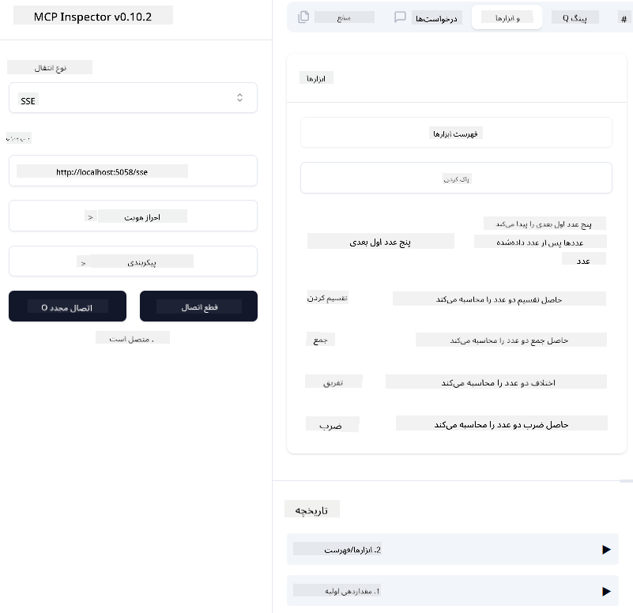
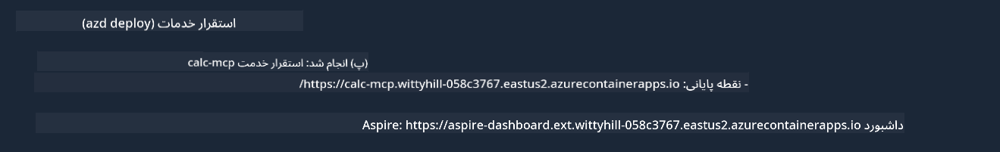

<!--
CO_OP_TRANSLATOR_METADATA:
{
  "original_hash": "5020a3e1a1c7f30c00f9e37f1fa208e3",
  "translation_date": "2025-05-17T14:05:26+00:00",
  "source_file": "04-PracticalImplementation/samples/csharp/README.md",
  "language_code": "fa"
}
-->
# نمونه

مثال قبلی نشان می‌دهد که چگونه می‌توان از یک پروژه محلی .NET با نوع `sdio` استفاده کرد و چگونه سرور را به‌صورت محلی در یک کانتینر اجرا کرد. این راه‌حل در بسیاری از موارد مناسب است. با این حال، می‌تواند مفید باشد که سرور به‌صورت راه دور، مانند محیط ابری اجرا شود. اینجاست که نوع `http` وارد عمل می‌شود.

نگاهی به راه‌حل موجود در پوشه `04-PracticalImplementation` بیندازید، ممکن است به نظر برسد که پیچیده‌تر از مثال قبلی است. اما در واقع این‌طور نیست. اگر به پروژه `src/mcpserver/mcpserver.csproj` با دقت نگاه کنید، خواهید دید که عمدتاً همان کد مثال قبلی است. تنها تفاوت این است که ما از کتابخانه متفاوت `ModelContextProtocol.AspNetCore` برای مدیریت درخواست‌های HTTP استفاده می‌کنیم. و ما روش `IsPrime` را تغییر داده‌ایم تا خصوصی شود، فقط برای نشان دادن اینکه می‌توانید روش‌های خصوصی در کد خود داشته باشید. بقیه کد همانند قبل است.

پروژه‌های دیگر از [.NET Aspire](https://learn.microsoft.com/dotnet/aspire/get-started/aspire-overview) هستند. داشتن .NET Aspire در راه‌حل تجربه توسعه‌دهنده را در هنگام توسعه و آزمایش بهبود می‌بخشد و به مشاهده‌پذیری کمک می‌کند. برای اجرای سرور ضروری نیست، اما داشتن آن در راه‌حل شما یک عمل خوب است.

## سرور را به‌صورت محلی راه‌اندازی کنید

1. از VS Code (با افزونه C# DevKit)، راه‌حل `04-PracticalImplementation\samples\csharp\src\Calculator-chap4.sln` را باز کنید.
2. کلید `F5` را فشار دهید تا سرور شروع شود. باید یک مرورگر وب با داشبورد .NET Aspire باز شود.

یا

1. از یک ترمینال، به پوشه `04-PracticalImplementation\samples\csharp\src` بروید.
2. فرمان زیر را برای شروع سرور اجرا کنید:
   ```bash
    dotnet run --project .\AppHost
   ```

3. از داشبورد، URL `http` را یادداشت کنید. باید چیزی شبیه به `http://localhost:5058/`.

## Test `SSE` با ModelContext Protocol Inspector باشد.

اگر Node.js 22.7.5 و بالاتر دارید، می‌توانید از ModelContext Protocol Inspector برای آزمایش سرور خود استفاده کنید.

سرور را شروع کرده و فرمان زیر را در یک ترمینال اجرا کنید:

```bash
npx @modelcontextprotocol/inspector@latest
```



- `SSE` as the Transport type. SSE stand for Server-Sent Events. 
- In the Url field, enter the URL of the server noted earlier,and append `/sse` را انتخاب کنید. باید `http` باشد (نه `https`) something like `http://localhost:5058/sse`.
- select the Connect button.

A nice thing about the Inspector is that it provide a nice visibility on what is happening.

- Try listing the availables tools
- Try some of them, it should works just like before.


## Test `SSE` with Github Copilot Chat in VS Code

To use the `SSE` transport with Github Copilot Chat, change the configuration of the `mcp-calc` که قبلاً ایجاد شده است تا به این صورت باشد:

```json
"mcp-calc": {
    "type": "sse",
    "url": "http://localhost:5058/sse"
}
```

چند آزمایش انجام دهید:
- از 3 عدد اول بعد از 6780 بپرسید. توجه کنید که Copilot از ابزارهای جدید `NextFivePrimeNumbers` استفاده می‌کند و فقط 3 عدد اول را بازمی‌گرداند.
- از 7 عدد اول بعد از 111 بپرسید تا ببینید چه اتفاقی می‌افتد.

# سرور را به Azure منتقل کنید

بیایید سرور را به Azure منتقل کنیم تا افراد بیشتری بتوانند از آن استفاده کنند.

از یک ترمینال، به پوشه `04-PracticalImplementation\samples\csharp\src` بروید و فرمان زیر را اجرا کنید:

```bash
azd init
```

این کار چند فایل محلی ایجاد می‌کند تا پیکربندی منابع Azure و زیرساخت شما به‌عنوان کد (IaC) را ذخیره کند.

سپس، فرمان زیر را برای انتقال سرور به Azure اجرا کنید:

```bash
azd up
```

پس از اتمام انتقال، باید پیامی مانند این مشاهده کنید:



به داشبورد Aspire بروید و URL `HTTP` را یادداشت کنید تا از آن در MCP Inspector و در چت Github Copilot استفاده کنید.

## مرحله بعد چیست؟

ما انواع مختلف انتقال و ابزارهای آزمایش را امتحان می‌کنیم و همچنین سرور MCP خود را به Azure منتقل می‌کنیم. اما اگر سرور ما نیاز به دسترسی به منابع خصوصی داشته باشد چه؟ به‌عنوان مثال، یک پایگاه داده یا یک API خصوصی؟ در فصل بعد، خواهیم دید که چگونه می‌توانیم امنیت سرور خود را بهبود بخشیم.

**سلب مسئولیت**:  
این سند با استفاده از سرویس ترجمه هوش مصنوعی [Co-op Translator](https://github.com/Azure/co-op-translator) ترجمه شده است. در حالی که ما برای دقت تلاش می‌کنیم، لطفاً آگاه باشید که ترجمه‌های خودکار ممکن است شامل خطاها یا نادرستی‌ها باشند. سند اصلی به زبان بومی آن باید به عنوان منبع معتبر در نظر گرفته شود. برای اطلاعات حیاتی، ترجمه حرفه‌ای انسانی توصیه می‌شود. ما مسئولیتی در قبال سوءتفاهم‌ها یا تفسیرهای نادرست ناشی از استفاده از این ترجمه نداریم.