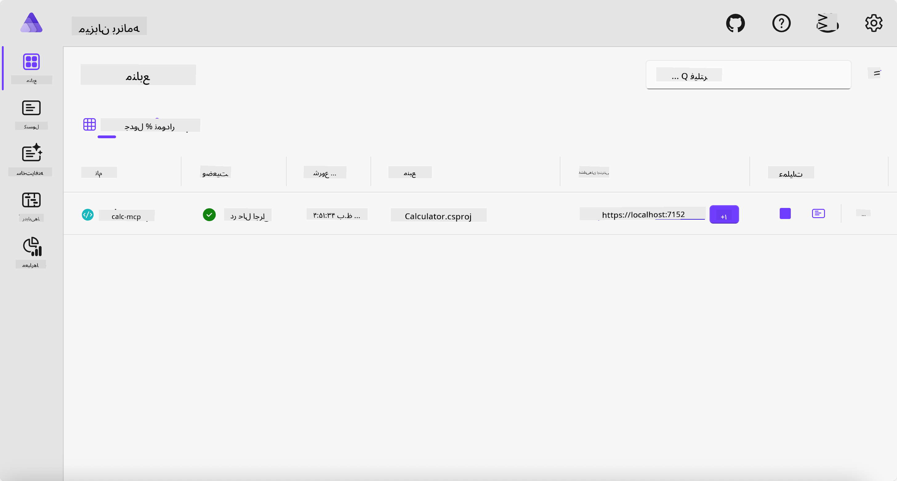
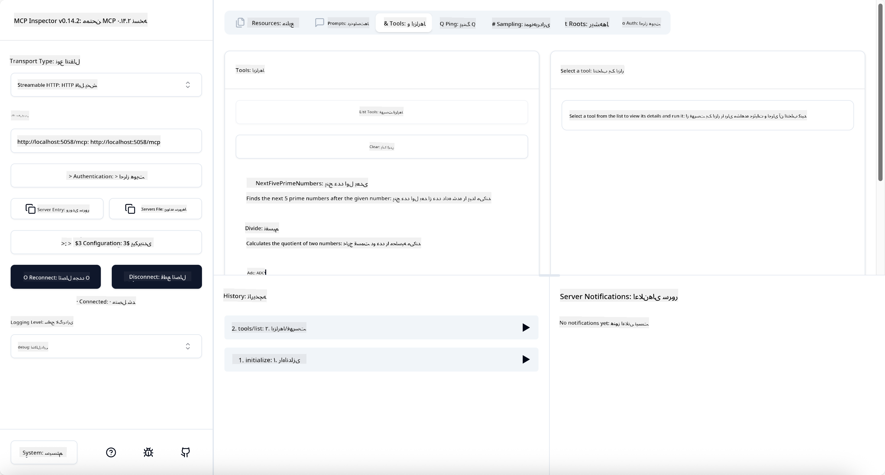
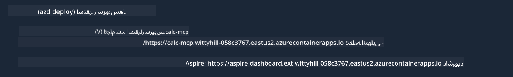

<!--
CO_OP_TRANSLATOR_METADATA:
{
  "original_hash": "0bc7bd48f55f1565f1d95ccb2c16f728",
  "translation_date": "2025-07-13T23:03:54+00:00",
  "source_file": "04-PracticalImplementation/samples/csharp/README.md",
  "language_code": "fa"
}
-->
# نمونه

مثال قبلی نشان می‌دهد چگونه می‌توان از یک پروژه محلی .NET با نوع `stdio` استفاده کرد و سرور را به صورت محلی در یک کانتینر اجرا کرد. این راه‌حل در بسیاری از موقعیت‌ها مناسب است. اما گاهی اوقات مفید است که سرور به صورت راه دور، مثلاً در یک محیط ابری، اجرا شود. اینجاست که نوع `http` وارد می‌شود.

اگر به راه‌حل موجود در پوشه `04-PracticalImplementation` نگاه کنید، ممکن است بسیار پیچیده‌تر از نمونه قبلی به نظر برسد. اما در واقع اینطور نیست. اگر دقیق‌تر به پروژه `src/Calculator` نگاه کنید، خواهید دید که بیشتر کد همان کد نمونه قبلی است. تنها تفاوت این است که ما از کتابخانه متفاوت `ModelContextProtocol.AspNetCore` برای مدیریت درخواست‌های HTTP استفاده می‌کنیم. همچنین متد `IsPrime` را به صورت private تغییر داده‌ایم، فقط برای نشان دادن اینکه می‌توانید متدهای خصوصی در کد خود داشته باشید. بقیه کد همان کد قبلی است.

سایر پروژه‌ها از [.NET Aspire](https://learn.microsoft.com/dotnet/aspire/get-started/aspire-overview) هستند. داشتن .NET Aspire در راه‌حل، تجربه توسعه‌دهنده را هنگام توسعه و تست بهبود می‌بخشد و به مشاهده‌پذیری کمک می‌کند. اجرای سرور بدون آن الزامی نیست، اما داشتن آن در راه‌حل یک روش خوب است.

## اجرای سرور به صورت محلی

1. از VS Code (با افزونه C# DevKit) به دایرکتوری `04-PracticalImplementation/samples/csharp` بروید.
1. دستور زیر را برای راه‌اندازی سرور اجرا کنید:

   ```bash
    dotnet watch run --project ./src/AppHost
   ```

1. وقتی مرورگر وب داشبورد .NET Aspire را باز کرد، آدرس `http` را یادداشت کنید. باید چیزی شبیه به `http://localhost:5058/` باشد.

   

## تست Streamable HTTP با MCP Inspector

اگر Node.js نسخه 22.7.5 یا بالاتر دارید، می‌توانید از MCP Inspector برای تست سرور خود استفاده کنید.

سرور را اجرا کنید و دستور زیر را در ترمینال وارد کنید:

```bash
npx @modelcontextprotocol/inspector http://localhost:5058
```



- نوع Transport را روی `Streamable HTTP` انتخاب کنید.
- در فیلد Url، آدرس سرور که قبلاً یادداشت کردید را وارد کنید و `/mcp` را به آن اضافه کنید. باید `http` باشد (نه `https`) و چیزی شبیه به `http://localhost:5058/mcp`.
- دکمه Connect را بزنید.

یکی از نکات خوب Inspector این است که دید خوبی نسبت به اتفاقات در حال رخ دادن ارائه می‌دهد.

- سعی کنید ابزارهای موجود را لیست کنید
- چندتا از آن‌ها را امتحان کنید، باید مثل قبل کار کنند.

## تست سرور MCP با GitHub Copilot Chat در VS Code

برای استفاده از انتقال Streamable HTTP با GitHub Copilot Chat، پیکربندی سرور `calc-mcp` که قبلاً ساخته شده را به شکل زیر تغییر دهید:

```jsonc
// .vscode/mcp.json
{
  "servers": {
    "calc-mcp": {
      "type": "http",
      "url": "http://localhost:5058/mcp"
    }
  }
}
```

چند تست انجام دهید:

- درخواست "3 عدد اول بعد از 6780" را بدهید. ببینید چگونه Copilot از ابزارهای جدید `NextFivePrimeNumbers` استفاده می‌کند و فقط 3 عدد اول را برمی‌گرداند.
- درخواست "7 عدد اول بعد از 111" را بدهید تا ببینید چه اتفاقی می‌افتد.
- درخواست "جان 24 آب‌نبات دارد و می‌خواهد آن‌ها را بین 3 فرزندش تقسیم کند. هر بچه چند آب‌نبات دارد؟" را بدهید تا نتیجه را ببینید.

## استقرار سرور در Azure

بیایید سرور را در Azure مستقر کنیم تا افراد بیشتری بتوانند از آن استفاده کنند.

از ترمینال به پوشه `04-PracticalImplementation/samples/csharp` بروید و دستور زیر را اجرا کنید:

```bash
azd up
```

پس از پایان استقرار، باید پیامی شبیه به این ببینید:



آدرس URL را بردارید و در MCP Inspector و GitHub Copilot Chat استفاده کنید.

```jsonc
// .vscode/mcp.json
{
  "servers": {
    "calc-mcp": {
      "type": "http",
      "url": "https://calc-mcp.gentleriver-3977fbcf.australiaeast.azurecontainerapps.io/mcp"
    }
  }
}
```

## مرحله بعدی چیست؟

ما انواع مختلف انتقال و ابزارهای تست را امتحان کردیم. همچنین سرور MCP شما را در Azure مستقر کردیم. اما اگر سرور ما نیاز به دسترسی به منابع خصوصی داشته باشد، مثلاً یک پایگاه داده یا API خصوصی؟ در فصل بعدی خواهیم دید چگونه می‌توانیم امنیت سرور خود را بهبود دهیم.

**سلب مسئولیت**:  
این سند با استفاده از سرویس ترجمه هوش مصنوعی [Co-op Translator](https://github.com/Azure/co-op-translator) ترجمه شده است. در حالی که ما در تلاش برای دقت هستیم، لطفاً توجه داشته باشید که ترجمه‌های خودکار ممکن است حاوی خطاها یا نادرستی‌هایی باشند. سند اصلی به زبان بومی خود باید به عنوان منبع معتبر در نظر گرفته شود. برای اطلاعات حیاتی، ترجمه حرفه‌ای انسانی توصیه می‌شود. ما مسئول هیچ گونه سوءتفاهم یا تفسیر نادرستی که از استفاده این ترجمه ناشی شود، نیستیم.