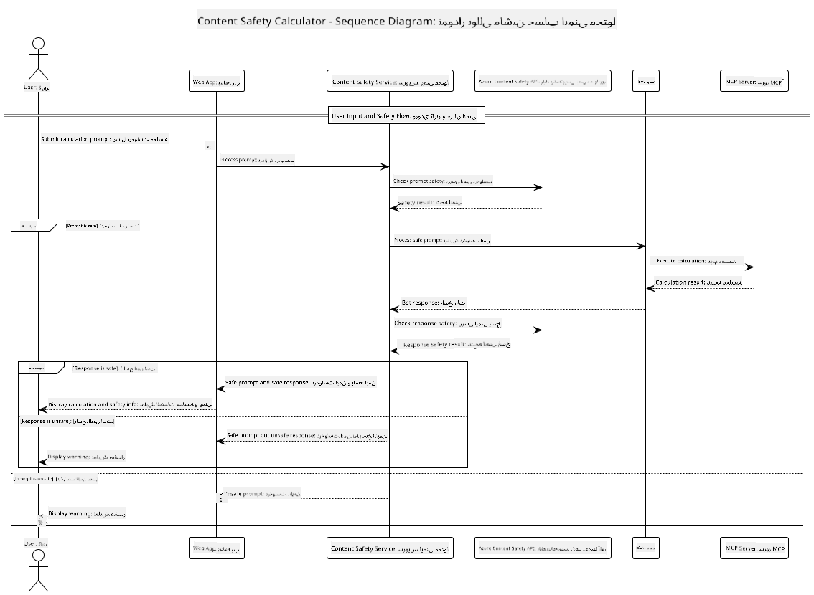

<!--
CO_OP_TRANSLATOR_METADATA:
{
  "original_hash": "e5ea5e7582f70008ea9bec3b3820f20a",
  "translation_date": "2025-07-13T23:12:13+00:00",
  "source_file": "04-PracticalImplementation/samples/java/containerapp/README.md",
  "language_code": "fa"
}
-->
## معماری سیستم

این پروژه یک برنامه وب را نشان می‌دهد که قبل از ارسال درخواست‌های کاربر به سرویس ماشین‌حساب از طریق Model Context Protocol (MCP)، بررسی ایمنی محتوا را انجام می‌دهد.



### نحوه عملکرد

1. **ورودی کاربر**: کاربر یک درخواست محاسباتی را در رابط وب وارد می‌کند  
2. **بررسی ایمنی محتوا (ورودی)**: درخواست توسط Azure Content Safety API تحلیل می‌شود  
3. **تصمیم‌گیری ایمنی (ورودی)**:  
   - اگر محتوا ایمن باشد (شدت < ۲ در همه دسته‌ها)، به ماشین‌حساب ارسال می‌شود  
   - اگر محتوا به عنوان بالقوه مضر علامت‌گذاری شود، فرایند متوقف شده و هشدار بازگردانده می‌شود  
4. **ادغام با ماشین‌حساب**: محتوای ایمن توسط LangChain4j پردازش شده و با سرور ماشین‌حساب MCP ارتباط برقرار می‌کند  
5. **بررسی ایمنی محتوا (خروجی)**: پاسخ ربات توسط Azure Content Safety API تحلیل می‌شود  
6. **تصمیم‌گیری ایمنی (خروجی)**:  
   - اگر پاسخ ربات ایمن باشد، به کاربر نمایش داده می‌شود  
   - اگر پاسخ ربات به عنوان بالقوه مضر علامت‌گذاری شود، با هشدار جایگزین می‌شود  
7. **پاسخ**: نتایج (در صورت ایمن بودن) همراه با هر دو تحلیل ایمنی به کاربر نمایش داده می‌شود

## استفاده از Model Context Protocol (MCP) با سرویس‌های ماشین‌حساب

این پروژه نحوه استفاده از Model Context Protocol (MCP) برای فراخوانی سرویس‌های ماشین‌حساب MCP از طریق LangChain4j را نشان می‌دهد. پیاده‌سازی از یک سرور MCP محلی که روی پورت ۸۰۸۰ اجرا می‌شود برای ارائه عملیات ماشین‌حساب استفاده می‌کند.

### راه‌اندازی سرویس Azure Content Safety

قبل از استفاده از ویژگی‌های ایمنی محتوا، باید یک منبع سرویس Azure Content Safety ایجاد کنید:

1. وارد [Azure Portal](https://portal.azure.com) شوید  
2. روی "Create a resource" کلیک کرده و "Content Safety" را جستجو کنید  
3. "Content Safety" را انتخاب کرده و روی "Create" کلیک کنید  
4. یک نام یکتا برای منبع خود وارد کنید  
5. اشتراک و گروه منابع خود را انتخاب کنید (یا یک گروه جدید بسازید)  
6. یک منطقه پشتیبانی شده را انتخاب کنید (برای جزئیات به [Region availability](https://azure.microsoft.com/en-us/global-infrastructure/services/?products=cognitive-services) مراجعه کنید)  
7. یک سطح قیمت‌گذاری مناسب انتخاب کنید  
8. روی "Create" کلیک کنید تا منبع مستقر شود  
9. پس از اتمام استقرار، روی "Go to resource" کلیک کنید  
10. در پنل سمت چپ، زیر "Resource Management"، گزینه "Keys and Endpoint" را انتخاب کنید  
11. یکی از کلیدها و آدرس endpoint را برای استفاده در مرحله بعد کپی کنید

### پیکربندی متغیرهای محیطی

متغیر محیطی `GITHUB_TOKEN` را برای احراز هویت مدل‌های GitHub تنظیم کنید:  
```sh
export GITHUB_TOKEN=<your_github_token>
```

برای ویژگی‌های ایمنی محتوا، موارد زیر را تنظیم کنید:  
```sh
export CONTENT_SAFETY_ENDPOINT=<your_content_safety_endpoint>
export CONTENT_SAFETY_KEY=<your_content_safety_key>
```

این متغیرهای محیطی توسط برنامه برای احراز هویت با سرویس Azure Content Safety استفاده می‌شوند. اگر این متغیرها تنظیم نشوند، برنامه از مقادیر جایگزین برای اهداف نمایشی استفاده می‌کند، اما ویژگی‌های ایمنی محتوا به درستی کار نخواهند کرد.

### راه‌اندازی سرور ماشین‌حساب MCP

قبل از اجرای کلاینت، باید سرور ماشین‌حساب MCP را در حالت SSE روی localhost:8080 راه‌اندازی کنید.

## توضیحات پروژه

این پروژه ادغام Model Context Protocol (MCP) با LangChain4j برای فراخوانی سرویس‌های ماشین‌حساب را نشان می‌دهد. ویژگی‌های کلیدی شامل:

- استفاده از MCP برای اتصال به سرویس ماشین‌حساب جهت عملیات ریاضی پایه  
- بررسی ایمنی محتوا در دو لایه، هم روی درخواست‌های کاربر و هم پاسخ‌های ربات  
- ادغام با مدل gpt-4.1-nano گیت‌هاب از طریق LangChain4j  
- استفاده از Server-Sent Events (SSE) برای انتقال MCP

## ادغام ایمنی محتوا

این پروژه شامل ویژگی‌های جامع ایمنی محتوا است تا اطمینان حاصل شود که هم ورودی‌های کاربر و هم پاسخ‌های سیستم عاری از محتوای مضر هستند:

1. **بررسی ورودی**: همه درخواست‌های کاربر برای دسته‌های محتوای مضر مانند سخنان نفرت‌انگیز، خشونت، خودآسیبی و محتوای جنسی قبل از پردازش تحلیل می‌شوند.  
2. **بررسی خروجی**: حتی هنگام استفاده از مدل‌های احتمالا بدون فیلتر، سیستم همه پاسخ‌های تولید شده را از طریق همان فیلترهای ایمنی محتوا قبل از نمایش به کاربر بررسی می‌کند.

این رویکرد دو لایه تضمین می‌کند که سیستم در هر شرایطی ایمن باقی بماند و کاربران را از ورودی‌های مضر و خروجی‌های احتمالا مشکل‌ساز تولید شده توسط هوش مصنوعی محافظت کند.

## کلاینت وب

برنامه شامل یک رابط وب کاربرپسند است که به کاربران امکان تعامل با سیستم Content Safety Calculator را می‌دهد:

### ویژگی‌های رابط وب

- فرم ساده و شهودی برای وارد کردن درخواست‌های محاسباتی  
- اعتبارسنجی ایمنی محتوا در دو لایه (ورودی و خروجی)  
- بازخورد لحظه‌ای درباره ایمنی درخواست و پاسخ  
- نشانگرهای رنگی ایمنی برای تفسیر آسان  
- طراحی تمیز و واکنش‌گرا که روی دستگاه‌های مختلف به خوبی کار می‌کند  
- نمونه درخواست‌های ایمن برای راهنمایی کاربران

### استفاده از کلاینت وب

1. برنامه را اجرا کنید:  
   ```sh
   mvn spring-boot:run
   ```

2. مرورگر خود را باز کرده و به `http://localhost:8087` بروید

3. یک درخواست محاسباتی در کادر متن وارد کنید (مثلاً "محاسبه مجموع ۲۴.۵ و ۱۷.۳")

4. روی "Submit" کلیک کنید تا درخواست شما پردازش شود

5. نتایج را مشاهده کنید که شامل موارد زیر است:  
   - تحلیل ایمنی محتوای درخواست شما  
   - نتیجه محاسبه (اگر درخواست ایمن بود)  
   - تحلیل ایمنی محتوای پاسخ ربات  
   - هر گونه هشدار ایمنی در صورت علامت‌گذاری ورودی یا خروجی

کلاینت وب به طور خودکار هر دو فرایند بررسی ایمنی محتوا را مدیریت می‌کند و اطمینان می‌دهد که همه تعاملات ایمن و مناسب باشند، صرف‌نظر از اینکه کدام مدل هوش مصنوعی استفاده می‌شود.

**سلب مسئولیت**:  
این سند با استفاده از سرویس ترجمه هوش مصنوعی [Co-op Translator](https://github.com/Azure/co-op-translator) ترجمه شده است. در حالی که ما در تلاش برای دقت هستیم، لطفاً توجه داشته باشید که ترجمه‌های خودکار ممکن است حاوی خطاها یا نواقصی باشند. سند اصلی به زبان بومی خود باید به عنوان منبع معتبر در نظر گرفته شود. برای اطلاعات حیاتی، ترجمه حرفه‌ای انسانی توصیه می‌شود. ما مسئول هیچ گونه سوءتفاهم یا تفسیر نادرستی که از استفاده از این ترجمه ناشی شود، نیستیم.