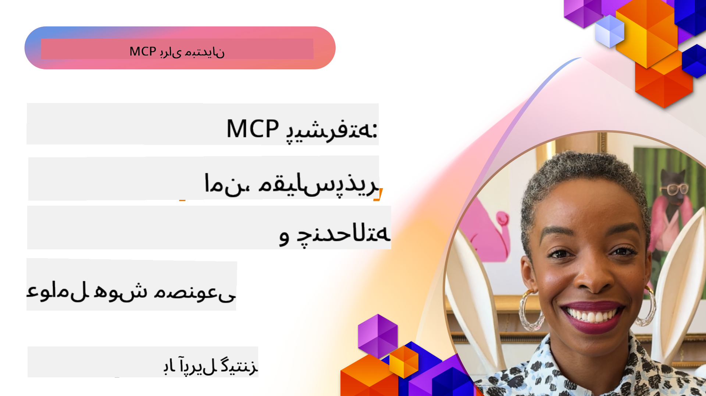

<!--
CO_OP_TRANSLATOR_METADATA:
{
  "original_hash": "d204bc94ea6027d06a703b21b711ca57",
  "translation_date": "2025-07-29T01:09:37+00:00",
  "source_file": "05-AdvancedTopics/README.md",
  "language_code": "fa"
}
-->
# موضوعات پیشرفته در MCP

_(برای مشاهده ویدئوی این درس روی تصویر بالا کلیک کنید)_

این فصل مجموعه‌ای از موضوعات پیشرفته در پیاده‌سازی پروتکل زمینه مدل (MCP) را پوشش می‌دهد، از جمله ادغام چند‌حالته، مقیاس‌پذیری، بهترین روش‌های امنیتی و ادغام در سطح سازمانی. این موضوعات برای ساخت برنامه‌های MCP قوی و آماده تولید که بتوانند نیازهای سیستم‌های مدرن هوش مصنوعی را برآورده کنند، حیاتی هستند.

## مرور کلی

این درس مفاهیم پیشرفته در پیاده‌سازی پروتکل زمینه مدل را بررسی می‌کند و بر ادغام چند‌حالته، مقیاس‌پذیری، بهترین روش‌های امنیتی و ادغام در سطح سازمانی تمرکز دارد. این موضوعات برای ساخت برنامه‌های MCP در سطح تولید که بتوانند نیازهای پیچیده محیط‌های سازمانی را مدیریت کنند، ضروری هستند.

## اهداف یادگیری

در پایان این درس، شما قادر خواهید بود:

- قابلیت‌های چند‌حالته را در چارچوب‌های MCP پیاده‌سازی کنید
- معماری‌های MCP مقیاس‌پذیر برای سناریوهای با تقاضای بالا طراحی کنید
- بهترین روش‌های امنیتی مطابق با اصول امنیتی MCP را اعمال کنید
- MCP را با سیستم‌ها و چارچوب‌های هوش مصنوعی سازمانی ادغام کنید
- عملکرد و قابلیت اطمینان را در محیط‌های تولید بهینه کنید

## درس‌ها و پروژه‌های نمونه

| لینک | عنوان | توضیحات |
|------|-------|-------------|
| [5.1 ادغام با Azure](./mcp-integration/README.md) | ادغام با Azure | یاد بگیرید چگونه MCP Server خود را در Azure ادغام کنید |
| [5.2 نمونه چند‌حالته](./mcp-multi-modality/README.md) | نمونه‌های چند‌حالته MCP | نمونه‌هایی برای پاسخ‌های صوتی، تصویری و چند‌حالته |
| [5.3 نمونه OAuth2 MCP](../../../05-AdvancedTopics/mcp-oauth2-demo) | دموی OAuth2 MCP | برنامه مینیمال Spring Boot که OAuth2 را با MCP نشان می‌دهد، هم به عنوان سرور مجوز و هم سرور منابع. شامل صدور امن توکن، نقاط پایانی محافظت‌شده، استقرار در Azure Container Apps و ادغام مدیریت API. |
| [5.4 زمینه‌های ریشه](./mcp-root-contexts/README.md) | زمینه‌های ریشه | اطلاعات بیشتر درباره زمینه‌های ریشه و نحوه پیاده‌سازی آنها |
| [5.5 مسیریابی](./mcp-routing/README.md) | مسیریابی | یادگیری انواع مختلف مسیریابی |
| [5.6 نمونه‌گیری](./mcp-sampling/README.md) | نمونه‌گیری | یادگیری نحوه کار با نمونه‌گیری |
| [5.7 مقیاس‌پذیری](./mcp-scaling/README.md) | مقیاس‌پذیری | اطلاعات درباره مقیاس‌پذیری |
| [5.8 امنیت](./mcp-security/README.md) | امنیت | امنیت MCP Server خود را تضمین کنید |
| [5.9 نمونه جستجوی وب](./web-search-mcp/README.md) | جستجوی وب MCP | سرور و کلاینت MCP با Python که با SerpAPI برای جستجوی وب، اخبار، محصولات و پرسش و پاسخ در زمان واقعی ادغام می‌شود. نشان‌دهنده هماهنگی چند‌ابزار، ادغام API خارجی و مدیریت خطاهای قوی. |
| [5.10 پخش زنده](./mcp-realtimestreaming/README.md) | پخش زنده | پخش داده‌های زنده در دنیای امروز که نیاز به دسترسی فوری به اطلاعات برای تصمیم‌گیری به موقع دارد، ضروری شده است. |
| [5.11 جستجوی وب در زمان واقعی](./mcp-realtimesearch/README.md) | جستجوی وب | نحوه تغییر جستجوی وب در زمان واقعی توسط MCP با ارائه رویکرد استاندارد برای مدیریت زمینه در مدل‌های هوش مصنوعی، موتورهای جستجو و برنامه‌ها. |
| [5.12 احراز هویت Entra ID برای سرورهای پروتکل زمینه مدل](./mcp-security-entra/README.md) | احراز هویت Entra ID | Microsoft Entra ID یک راه‌حل مدیریت هویت و دسترسی مبتنی بر ابر ارائه می‌دهد که کمک می‌کند فقط کاربران و برنامه‌های مجاز بتوانند با سرور MCP شما تعامل داشته باشند. |
| [5.13 ادغام عامل Azure AI Foundry](./mcp-foundry-agent-integration/README.md) | ادغام Azure AI Foundry | یاد بگیرید چگونه سرورهای پروتکل زمینه مدل را با عوامل Azure AI Foundry ادغام کنید، که امکان هماهنگی ابزارهای قدرتمند و قابلیت‌های هوش مصنوعی سازمانی با اتصالات استاندارد به منابع داده خارجی را فراهم می‌کند. |
| [5.14 مهندسی زمینه](./mcp-contextengineering/README.md) | مهندسی زمینه | فرصت‌های آینده تکنیک‌های مهندسی زمینه برای سرورهای MCP، از جمله بهینه‌سازی زمینه، مدیریت زمینه پویا و استراتژی‌های مهندسی مؤثر درخواست در چارچوب‌های MCP. |

## منابع اضافی

برای اطلاعات به‌روز درباره موضوعات پیشرفته MCP، به موارد زیر مراجعه کنید:
- [مستندات MCP](https://modelcontextprotocol.io/)
- [مشخصات MCP](https://spec.modelcontextprotocol.io/)
- [مخزن GitHub](https://github.com/modelcontextprotocol)

## نکات کلیدی

- پیاده‌سازی‌های چند‌حالته MCP قابلیت‌های هوش مصنوعی را فراتر از پردازش متن گسترش می‌دهند
- مقیاس‌پذیری برای استقرارهای سازمانی ضروری است و می‌توان از طریق مقیاس‌پذیری افقی و عمودی به آن پرداخت
- اقدامات امنیتی جامع از داده‌ها محافظت کرده و دسترسی مناسب را تضمین می‌کنند
- ادغام سازمانی با پلتفرم‌هایی مانند Azure OpenAI و Microsoft AI Foundry قابلیت‌های MCP را افزایش می‌دهد
- پیاده‌سازی‌های پیشرفته MCP از معماری‌های بهینه و مدیریت دقیق منابع بهره‌مند می‌شوند

## تمرین

یک پیاده‌سازی MCP در سطح سازمانی برای یک مورد استفاده خاص طراحی کنید:

1. نیازهای چند‌حالته برای مورد استفاده خود را شناسایی کنید
2. کنترل‌های امنیتی مورد نیاز برای حفاظت از داده‌های حساس را مشخص کنید
3. یک معماری مقیاس‌پذیر طراحی کنید که بتواند بارهای متغیر را مدیریت کند
4. نقاط ادغام با سیستم‌های هوش مصنوعی سازمانی را برنامه‌ریزی کنید
5. گلوگاه‌های احتمالی عملکرد و استراتژی‌های کاهش آنها را مستند کنید

## منابع اضافی

- [مستندات Azure OpenAI](https://learn.microsoft.com/en-us/azure/ai-services/openai/)
- [مستندات Microsoft AI Foundry](https://learn.microsoft.com/en-us/ai-services/)

---

## مرحله بعدی

- [5.1 ادغام MCP](./mcp-integration/README.md)

**سلب مسئولیت**:  
این سند با استفاده از سرویس ترجمه هوش مصنوعی [Co-op Translator](https://github.com/Azure/co-op-translator) ترجمه شده است. در حالی که ما تلاش می‌کنیم دقت را حفظ کنیم، لطفاً توجه داشته باشید که ترجمه‌های خودکار ممکن است شامل خطاها یا نادرستی‌ها باشند. سند اصلی به زبان اصلی آن باید به عنوان منبع معتبر در نظر گرفته شود. برای اطلاعات حساس، توصیه می‌شود از ترجمه حرفه‌ای انسانی استفاده کنید. ما مسئولیتی در قبال سوء تفاهم‌ها یا تفسیرهای نادرست ناشی از استفاده از این ترجمه نداریم.