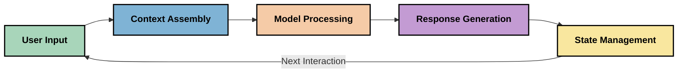
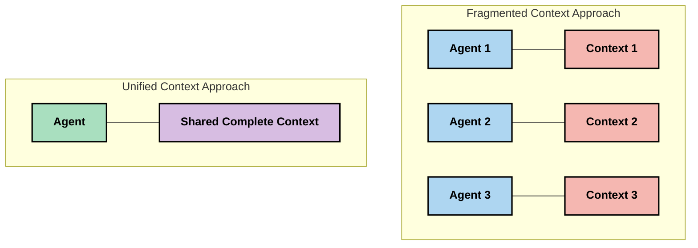
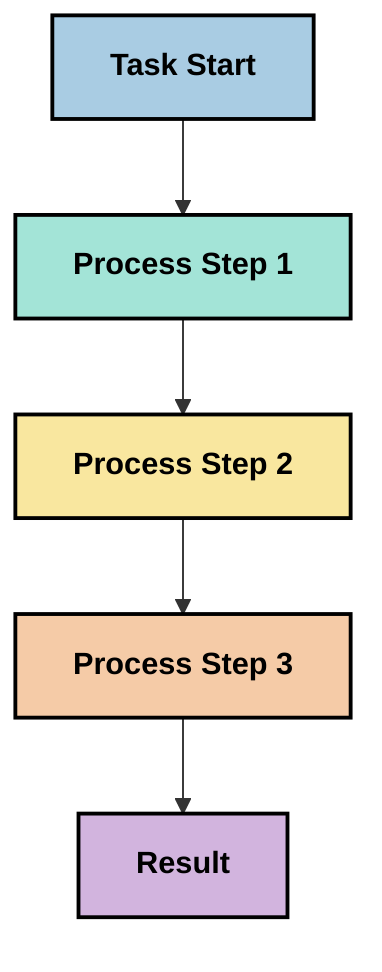
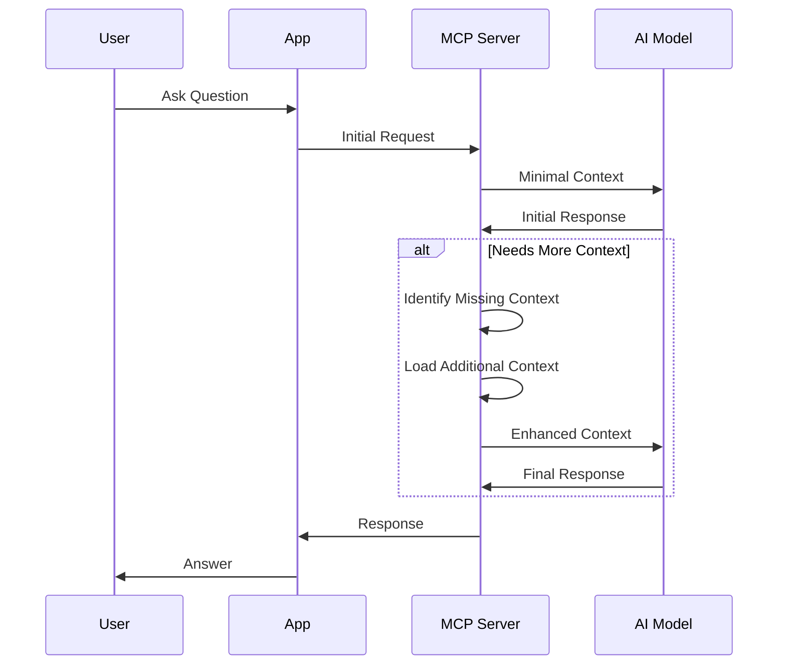
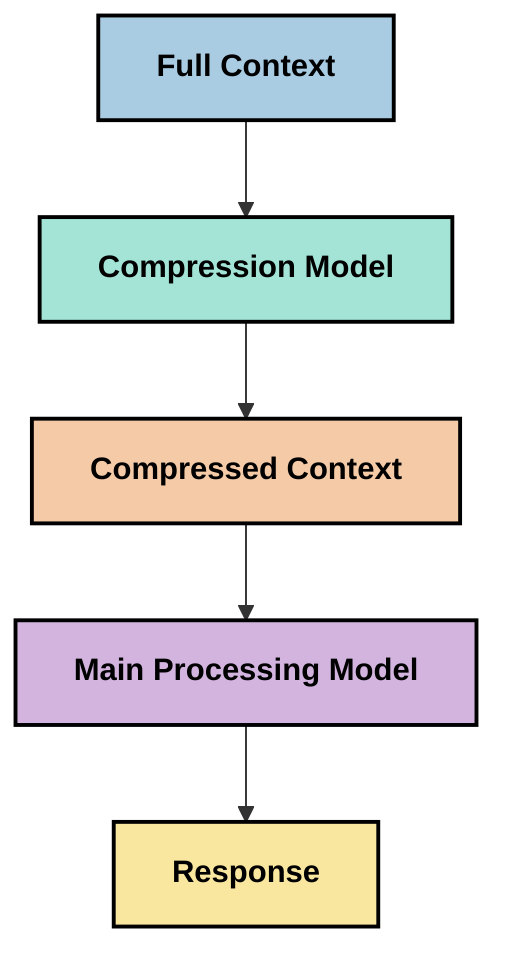

<!--
CO_OP_TRANSLATOR_METADATA:
{
  "original_hash": "5762e8e74dd99d8b7dbb31e69a82561e",
  "translation_date": "2025-07-16T23:01:52+00:00",
  "source_file": "05-AdvancedTopics/mcp-contextengineering/README.md",
  "language_code": "fa"
}
-->
# مهندسی زمینه: مفهومی نوظهور در اکوسیستم MCP

## مرور کلی

مهندسی زمینه مفهومی نوظهور در حوزه هوش مصنوعی است که به بررسی نحوه ساختاردهی، ارائه و نگهداری اطلاعات در طول تعاملات بین مشتریان و خدمات هوش مصنوعی می‌پردازد. با پیشرفت اکوسیستم پروتکل زمینه مدل (MCP)، درک چگونگی مدیریت مؤثر زمینه اهمیت فزاینده‌ای پیدا می‌کند. این ماژول مفهوم مهندسی زمینه را معرفی کرده و کاربردهای بالقوه آن را در پیاده‌سازی‌های MCP بررسی می‌کند.

## اهداف یادگیری

در پایان این ماژول، شما قادر خواهید بود:

- مفهوم نوظهور مهندسی زمینه و نقش احتمالی آن در برنامه‌های MCP را درک کنید
- چالش‌های کلیدی مدیریت زمینه که طراحی پروتکل MCP به آن‌ها می‌پردازد را شناسایی کنید
- تکنیک‌هایی برای بهبود عملکرد مدل از طریق مدیریت بهتر زمینه بررسی کنید
- رویکردهایی برای اندازه‌گیری و ارزیابی اثربخشی زمینه در نظر بگیرید
- این مفاهیم نوظهور را برای بهبود تجربه‌های هوش مصنوعی از طریق چارچوب MCP به کار ببرید

## معرفی مهندسی زمینه

مهندسی زمینه مفهومی نوظهور است که بر طراحی و مدیریت هدفمند جریان اطلاعات بین کاربران، برنامه‌ها و مدل‌های هوش مصنوعی تمرکز دارد. برخلاف حوزه‌های تثبیت‌شده‌ای مانند مهندسی پرامپت، مهندسی زمینه هنوز توسط فعالان این حوزه تعریف می‌شود و آن‌ها در تلاشند چالش‌های منحصر به فرد ارائه اطلاعات مناسب به مدل‌های هوش مصنوعی در زمان مناسب را حل کنند.

با پیشرفت مدل‌های زبان بزرگ (LLMها)، اهمیت زمینه به طور فزاینده‌ای آشکار شده است. کیفیت، مرتبط بودن و ساختار زمینه‌ای که ارائه می‌دهیم مستقیماً بر خروجی‌های مدل تأثیر می‌گذارد. مهندسی زمینه این رابطه را بررسی کرده و به دنبال توسعه اصولی برای مدیریت مؤثر زمینه است.

> «در سال ۲۰۲۵، مدل‌های موجود بسیار هوشمند هستند. اما حتی هوشمندترین انسان هم بدون زمینه‌ای که بر اساس آن از او خواسته شده کار کند، نمی‌تواند به طور مؤثر وظیفه‌اش را انجام دهد... «مهندسی زمینه» سطح بعدی مهندسی پرامپت است. این درباره انجام خودکار این کار در یک سیستم پویا است.» — والدن یان، Cognition AI

مهندسی زمینه ممکن است شامل موارد زیر باشد:

1. **انتخاب زمینه**: تعیین اینکه چه اطلاعاتی برای یک وظیفه خاص مرتبط است
2. **ساختاردهی زمینه**: سازماندهی اطلاعات برای حداکثر درک مدل
3. **ارائه زمینه**: بهینه‌سازی نحوه و زمان ارسال اطلاعات به مدل‌ها
4. **نگهداری زمینه**: مدیریت وضعیت و تحول زمینه در طول زمان
5. **ارزیابی زمینه**: اندازه‌گیری و بهبود اثربخشی زمینه

این حوزه‌های تمرکز به ویژه برای اکوسیستم MCP مرتبط هستند که روشی استاندارد برای ارائه زمینه به LLMها توسط برنامه‌ها فراهم می‌کند.

## دیدگاه سفر زمینه

یکی از راه‌های تجسم مهندسی زمینه، دنبال کردن مسیر اطلاعات در یک سیستم MCP است:



### مراحل کلیدی در سفر زمینه:

1. **ورودی کاربر**: اطلاعات خام از کاربر (متن، تصاویر، اسناد)
2. **تجمیع زمینه**: ترکیب ورودی کاربر با زمینه سیستم، تاریخچه گفتگو و سایر اطلاعات بازیابی شده
3. **پردازش مدل**: مدل هوش مصنوعی زمینه تجمیع شده را پردازش می‌کند
4. **تولید پاسخ**: مدل بر اساس زمینه ارائه شده خروجی تولید می‌کند
5. **مدیریت وضعیت**: سیستم وضعیت داخلی خود را بر اساس تعامل به‌روزرسانی می‌کند

این دیدگاه ماهیت پویا زمینه در سیستم‌های هوش مصنوعی را برجسته کرده و سوالات مهمی درباره بهترین روش مدیریت اطلاعات در هر مرحله مطرح می‌کند.

## اصول نوظهور در مهندسی زمینه

با شکل‌گیری حوزه مهندسی زمینه، برخی اصول اولیه توسط فعالان این حوزه مطرح شده است. این اصول می‌توانند در انتخاب‌های پیاده‌سازی MCP راهنمایی کنند:

### اصل ۱: به اشتراک‌گذاری کامل زمینه

زمینه باید به طور کامل بین تمام اجزای یک سیستم به اشتراک گذاشته شود، نه اینکه در میان چند عامل یا فرایند پراکنده باشد. وقتی زمینه توزیع شده باشد، تصمیمات گرفته شده در بخشی از سیستم ممکن است با تصمیمات بخش‌های دیگر در تضاد باشد.



در برنامه‌های MCP، این به معنای طراحی سیستم‌هایی است که زمینه به صورت یکپارچه در کل زنجیره جریان داشته باشد، نه اینکه به بخش‌های جداگانه تقسیم شود.

### اصل ۲: درک اینکه هر عمل حامل تصمیمات ضمنی است

هر عملی که مدل انجام می‌دهد، تصمیمات ضمنی درباره نحوه تفسیر زمینه را در بر دارد. وقتی چندین جزء بر زمینه‌های مختلف عمل می‌کنند، این تصمیمات ضمنی ممکن است با هم در تضاد باشند و به نتایج ناسازگار منجر شوند.

این اصل پیامدهای مهمی برای برنامه‌های MCP دارد:
- ترجیح پردازش خطی وظایف پیچیده به جای اجرای موازی با زمینه پراکنده
- اطمینان از اینکه همه نقاط تصمیم‌گیری به همان اطلاعات زمینه‌ای دسترسی دارند
- طراحی سیستم‌هایی که مراحل بعدی بتوانند کل زمینه تصمیمات قبلی را ببینند

### اصل ۳: تعادل بین عمق زمینه و محدودیت‌های پنجره زمینه

با طولانی‌تر شدن گفتگوها و فرایندها، پنجره‌های زمینه پر می‌شوند. مهندسی زمینه مؤثر به دنبال راهکارهایی برای مدیریت این تعارض بین جامعیت زمینه و محدودیت‌های فنی است.

رویکردهای احتمالی شامل:
- فشرده‌سازی زمینه که اطلاعات ضروری را حفظ کرده و در عین حال مصرف توکن را کاهش می‌دهد
- بارگذاری تدریجی زمینه بر اساس مرتبط بودن با نیازهای فعلی
- خلاصه‌سازی تعاملات قبلی در حالی که تصمیمات و حقایق کلیدی حفظ می‌شوند

## چالش‌های زمینه و طراحی پروتکل MCP

پروتکل زمینه مدل (MCP) با آگاهی از چالش‌های منحصر به فرد مدیریت زمینه طراحی شده است. درک این چالش‌ها به توضیح جنبه‌های کلیدی طراحی پروتکل MCP کمک می‌کند:

### چالش ۱: محدودیت‌های پنجره زمینه

اکثر مدل‌های هوش مصنوعی اندازه پنجره زمینه ثابتی دارند که میزان اطلاعات قابل پردازش همزمان را محدود می‌کند.

**پاسخ طراحی MCP:**  
- پروتکل از زمینه ساختاریافته مبتنی بر منابع پشتیبانی می‌کند که می‌توان به طور مؤثر به آن‌ها ارجاع داد  
- منابع می‌توانند صفحه‌بندی شده و به صورت تدریجی بارگذاری شوند

### چالش ۲: تعیین مرتبط بودن

تشخیص اینکه کدام اطلاعات برای گنجاندن در زمینه مرتبط‌تر است، دشوار است.

**پاسخ طراحی MCP:**  
- ابزارهای انعطاف‌پذیر امکان بازیابی پویا اطلاعات بر اساس نیاز را فراهم می‌کنند  
- پرامپت‌های ساختاریافته سازماندهی یکنواخت زمینه را ممکن می‌سازند

### چالش ۳: پایداری زمینه

مدیریت وضعیت در طول تعاملات نیازمند پیگیری دقیق زمینه است.

**پاسخ طراحی MCP:**  
- مدیریت جلسه استاندارد شده  
- الگوهای تعامل مشخص برای تحول زمینه

### چالش ۴: زمینه چندرسانه‌ای

انواع مختلف داده‌ها (متن، تصویر، داده ساختاریافته) نیازمند روش‌های متفاوتی برای مدیریت هستند.

**پاسخ طراحی MCP:**  
- طراحی پروتکل انواع مختلف محتوا را پشتیبانی می‌کند  
- نمایش استاندارد اطلاعات چندرسانه‌ای

### چالش ۵: امنیت و حریم خصوصی

زمینه اغلب شامل اطلاعات حساس است که باید محافظت شود.

**پاسخ طراحی MCP:**  
- مرزهای واضح بین مسئولیت‌های مشتری و سرور  
- گزینه‌های پردازش محلی برای کاهش افشای داده‌ها

درک این چالش‌ها و نحوه پاسخ MCP به آن‌ها پایه‌ای برای بررسی تکنیک‌های پیشرفته‌تر مهندسی زمینه فراهم می‌کند.

## رویکردهای نوظهور مهندسی زمینه

با توسعه حوزه مهندسی زمینه، چند رویکرد امیدوارکننده در حال ظهور است. این‌ها نمایانگر تفکر فعلی هستند و احتمالاً با کسب تجربه بیشتر در پیاده‌سازی‌های MCP تکامل خواهند یافت.

### ۱. پردازش خطی تک‌ریسمانی

برخلاف معماری‌های چندعاملی که زمینه را توزیع می‌کنند، برخی فعالان متوجه شده‌اند که پردازش خطی تک‌ریسمانی نتایج سازگارتر تولید می‌کند. این با اصل حفظ زمینه یکپارچه همسو است.



اگرچه این رویکرد ممکن است نسبت به پردازش موازی کمتر کارآمد به نظر برسد، اما اغلب نتایج منسجم‌تر و قابل اطمینان‌تری ارائه می‌دهد زیرا هر مرحله بر درک کامل تصمیمات قبلی بنا شده است.

### ۲. تقسیم‌بندی و اولویت‌بندی زمینه

شکستن زمینه‌های بزرگ به قطعات قابل مدیریت و اولویت‌بندی مهم‌ترین بخش‌ها.

```python
# Conceptual Example: Context Chunking and Prioritization
def process_with_chunked_context(documents, query):
    # 1. Break documents into smaller chunks
    chunks = chunk_documents(documents)
    
    # 2. Calculate relevance scores for each chunk
    scored_chunks = [(chunk, calculate_relevance(chunk, query)) for chunk in chunks]
    
    # 3. Sort chunks by relevance score
    sorted_chunks = sorted(scored_chunks, key=lambda x: x[1], reverse=True)
    
    # 4. Use the most relevant chunks as context
    context = create_context_from_chunks([chunk for chunk, score in sorted_chunks[:5]])
    
    # 5. Process with the prioritized context
    return generate_response(context, query)
```

مفهوم بالا نشان می‌دهد چگونه می‌توان اسناد بزرگ را به قطعات قابل مدیریت تقسیم کرد و فقط مرتبط‌ترین بخش‌ها را برای زمینه انتخاب نمود. این رویکرد می‌تواند به کار در محدودیت‌های پنجره زمینه کمک کند و در عین حال از پایگاه‌های دانش بزرگ بهره ببرد.

### ۳. بارگذاری تدریجی زمینه

بارگذاری تدریجی زمینه به جای بارگذاری همه آن به صورت همزمان.



بارگذاری تدریجی زمینه با حداقل زمینه شروع می‌شود و تنها در صورت نیاز گسترش می‌یابد. این می‌تواند مصرف توکن را برای پرسش‌های ساده به طور قابل توجهی کاهش دهد و در عین حال توانایی پاسخ به سوالات پیچیده را حفظ کند.

### ۴. فشرده‌سازی و خلاصه‌سازی زمینه

کاهش اندازه زمینه در حالی که اطلاعات ضروری حفظ می‌شود.



فشرده‌سازی زمینه بر موارد زیر تمرکز دارد:  
- حذف اطلاعات تکراری  
- خلاصه‌سازی محتوای طولانی  
- استخراج حقایق و جزئیات کلیدی  
- حفظ عناصر حیاتی زمینه  
- بهینه‌سازی برای صرفه‌جویی در توکن

این رویکرد به ویژه برای حفظ گفتگوهای طولانی در پنجره‌های زمینه یا پردازش مؤثر اسناد بزرگ ارزشمند است. برخی فعالان از مدل‌های تخصصی برای فشرده‌سازی زمینه و خلاصه‌سازی تاریخچه گفتگو استفاده می‌کنند.

## ملاحظات اکتشافی مهندسی زمینه

در حین کاوش در حوزه نوظهور مهندسی زمینه، چند نکته قابل توجه است که هنگام کار با پیاده‌سازی‌های MCP باید در نظر گرفته شود. این‌ها بهترین شیوه‌های قطعی نیستند بلکه حوزه‌هایی برای اکتشاف هستند که ممکن است به بهبود در کاربرد خاص شما منجر شوند.

### اهداف زمینه خود را مشخص کنید

قبل از پیاده‌سازی راهکارهای پیچیده مدیریت زمینه، به وضوح بیان کنید که چه چیزی می‌خواهید به دست آورید:  
- مدل به چه اطلاعات خاصی برای موفقیت نیاز دارد؟  
- کدام اطلاعات ضروری و کدام مکمل هستند؟  
- محدودیت‌های عملکرد شما چیست (تاخیر، محدودیت توکن، هزینه‌ها)؟

### رویکردهای لایه‌ای زمینه را بررسی کنید

برخی فعالان موفقیت را با زمینه‌ای که در لایه‌های مفهومی سازماندهی شده یافته‌اند:  
- **لایه اصلی**: اطلاعات ضروری که مدل همیشه به آن نیاز دارد  
- **لایه موقعیتی**: زمینه خاص تعامل فعلی  
- **لایه پشتیبان**: اطلاعات اضافی که ممکن است مفید باشد  
- **لایه جایگزین**: اطلاعاتی که فقط در صورت نیاز دسترسی پیدا می‌شود

### استراتژی‌های بازیابی را بررسی کنید

اثربخشی زمینه اغلب به نحوه بازیابی اطلاعات بستگی دارد:  
- جستجوی معنایی و تعبیه‌ها برای یافتن اطلاعات مرتبط مفهومی  
- جستجوی مبتنی بر کلیدواژه برای جزئیات خاص  
- رویکردهای ترکیبی که چند روش بازیابی را با هم ترکیب می‌کنند  
- فیلتر کردن متادیتا برای محدود کردن دامنه بر اساس دسته‌بندی‌ها، تاریخ‌ها یا منابع

### با انسجام زمینه آزمایش کنید

ساختار و جریان زمینه ممکن است بر درک مدل تأثیر بگذارد:  
- گروه‌بندی اطلاعات مرتبط کنار هم  
- استفاده از قالب‌بندی و سازماندهی یکنواخت  
- حفظ ترتیب منطقی یا زمانی در صورت لزوم  
- اجتناب از اطلاعات متناقض

### معایب معماری‌های چندعاملی را بسنجید

اگرچه معماری‌های چندعاملی در بسیاری از چارچوب‌های هوش مصنوعی محبوب هستند، اما چالش‌های قابل توجهی برای مدیریت زمینه دارند:  
- پراکندگی زمینه می‌تواند به تصمیمات ناسازگار بین عوامل منجر شود  
- پردازش موازی ممکن است تضادهایی ایجاد کند که حل آن دشوار است  
- سربار ارتباطی بین عوامل می‌تواند مزایای عملکرد را خنثی کند  
- مدیریت وضعیت پیچیده برای حفظ انسجام لازم است

در بسیاری موارد، رویکرد تک‌عاملی با مدیریت جامع زمینه ممکن است نتایج قابل اطمینان‌تری نسبت به چند عامل تخصصی با زمینه پراکنده ارائه دهد.

### روش‌های ارزیابی را توسعه دهید

برای بهبود مهندسی زمینه در طول زمان، در نظر بگیرید چگونه موفقیت را اندازه‌گیری خواهید کرد:  
- آزمایش A/B با ساختارهای مختلف زمینه  
- پایش مصرف توکن و زمان پاسخ  
- پیگیری رضایت کاربران و نرخ تکمیل وظایف  
- تحلیل موارد شکست استراتژی‌های زمینه برای درک بهبودهای ممکن

این ملاحظات حوزه‌های فعال اکتشاف در فضای مهندسی زمینه را نشان می‌دهند. با بلوغ این حوزه، الگوها و شیوه‌های قطعی‌تری احتمالاً شکل خواهند گرفت.

## اندازه‌گیری اثربخشی زمینه: چارچوبی در حال تحول

با ظهور مهندسی زمینه به عنوان یک مفهوم، فعالان شروع به بررسی نحوه اندازه‌گیری اثربخشی آن کرده‌اند. چارچوب تثبیت‌شده‌ای هنوز وجود ندارد، اما معیارهای مختلفی در نظر گرفته می‌شود که می‌تواند راهنمای کارهای آینده باشد.

### ابعاد احتمالی اندازه‌گیری

#### ۱. ملاحظات کارایی ورودی

- **نسبت زمینه به پاسخ**: چه مقدار زمینه نسبت به اندازه پاسخ لازم است؟  
- **استفاده از توکن**: چه درصدی از توکن‌های زمینه ارائه شده بر پاسخ تأثیر می‌گذارند؟  
- **کاهش زمینه**: چقدر می‌توان اطلاعات خام را فشرده کرد؟

#### ۲. ملاحظات عملکرد

- **تأثیر تأخیر**: مدیریت زمینه چگونه بر زمان پاسخ تأثیر می‌گذارد؟  
- **اقتصاد توکن**: آیا مصرف توکن بهینه است؟  
- **دقت بازیابی**: اطلاعات بازیابی شده چقدر مرتبط است؟  
- **استفاده از منابع**: چه منابع محاسباتی مورد نیاز است؟

#### ۳. ملاحظات کیفیت

- **مرتبط بودن پاسخ**: پاسخ چقدر به پرسش مرتبط است؟  
- **دقت واقعی**: آیا مدیریت زمینه صحت واقعی را بهبود می‌بخشد؟  
- **سازگاری**: پاسخ‌ها در پرسش‌های مشابه چقدر سازگار هستند؟  
- **نرخ توهم‌زایی**: آیا زمینه بهتر توهم‌زایی مدل را کاهش می‌دهد؟

#### ۴. ملاحظات تجربه کاربری

- **نرخ پیگیری**: کاربران چند بار نیاز به توضیح بیشتر دارند؟  
- **تکمیل وظیفه**: آیا کاربران به اهداف خود می‌رسند؟  
- **شاخص‌های رضایت**: کاربران تجربه خود را چگونه ارزیابی می‌کنند؟

### رویکردهای اکتشافی برای اندازه‌گیری

هنگام آزمایش مهندسی زمینه در پیاده‌سازی‌های MCP، این رویکردهای اکتشافی را در نظر بگیرید:

1. **مقایسه‌های پایه**: ابتدا با رویکردهای ساده زمینه یک پایه بسازید و سپس روش‌های پیچیده‌تر را آزمایش کنید  
2. **تغییرات تدریجی**: هر بار یک جنبه از مدیریت زمینه را تغییر دهید تا اثر آن را جدا کنید  
3. **ارزیابی متمرکز بر کاربر**: ترکیب معیارهای کمی با بازخورد کیفی کاربران  
4. **تحلیل شکست**: بررسی مواردی که استراتژی‌های زمینه شکست می‌خورند برای درک بهبودهای ممکن  
5. **ارزیابی چندبعدی**: سنجش تعادل بین کارایی، کیفیت و تجربه کاربری

این رویکرد تجربی و چندوجهی با ماهیت نوظهور مهندسی زمینه همخوانی دارد.

## سخنان پایانی

مهندسی زمینه حوزه‌ای نوظهور است که ممکن است در برنامه‌های مؤثر MCP نقش مرکزی ایفا کند. با توجه دقیق به نحوه جریان اطلاعات در سیستم خود، می‌توانید تجربه‌های هوش مصنوعی کارآمدتر، دقیق‌تر و ارزشمندتری برای کاربران ایجاد کنید.

تکنیک‌ها و رویکردهای مطرح شده در این ماژول نمایانگر تفکر اولیه در این حوزه هستند و نه شیوه‌های تثبیت‌شده. مهندسی زمینه ممکن است به یک رشته تعریف‌شده‌تر تبدیل شود با پیشرفت قابلیت‌های هوش مصنوعی و تعمیق درک ما. فعلاً آزمایش همراه با اندازه‌گیری دقیق به نظر می‌رسد بهترین روش باشد.

## جهت‌گیری‌های احتمالی آینده

حوزه مهندسی زمینه هنوز در مراحل اولیه است، اما چند جهت‌گیری امیدوارکننده در حال ظهور است:

- اصول مهندسی زمینه ممکن است تأثیر قابل توجهی بر عملکرد مدل، کارایی، تجربه کاربری و قابلیت اطمینان داشته باشند  
- رویکردهای تک‌ریسمانی با مدیریت جامع زمینه ممکن است در بسیاری از موارد بهتر از معماری‌های چندعاملی عمل کنند  
-
- [وب‌سایت پروتکل مدل کانتکست](https://modelcontextprotocol.io/)
- [مشخصات پروتکل مدل کانتکست](https://github.com/modelcontextprotocol/modelcontextprotocol)
- [مستندات MCP](https://modelcontextprotocol.io/docs)
- [SDK سی‌شارپ MCP](https://github.com/modelcontextprotocol/csharp-sdk)
- [SDK پایتون MCP](https://github.com/modelcontextprotocol/python-sdk)
- [SDK تایپ‌اسکریپت MCP](https://github.com/modelcontextprotocol/typescript-sdk)
- [بازرس MCP](https://github.com/modelcontextprotocol/inspector) - ابزار تست بصری برای سرورهای MCP

### مقالات مهندسی کانتکست
- [از ساخت چندعامل خودداری کنید: اصول مهندسی کانتکست](https://cognition.ai/blog/dont-build-multi-agents) - دیدگاه‌های Walden Yan درباره اصول مهندسی کانتکست
- [راهنمای عملی برای ساخت عوامل](https://cdn.openai.com/business-guides-and-resources/a-practical-guide-to-building-agents.pdf) - راهنمای OpenAI برای طراحی مؤثر عوامل
- [ساخت عوامل مؤثر](https://www.anthropic.com/engineering/building-effective-agents) - رویکرد Anthropic در توسعه عوامل

### پژوهش‌های مرتبط
- [تقویت بازیابی پویا برای مدل‌های زبان بزرگ](https://arxiv.org/abs/2310.01487) - پژوهشی درباره روش‌های بازیابی پویا
- [گم‌شده در میان: چگونه مدل‌های زبان از کانتکست‌های طولانی استفاده می‌کنند](https://arxiv.org/abs/2307.03172) - پژوهش مهم درباره الگوهای پردازش کانتکست
- [تولید تصویر سلسله‌مراتبی مبتنی بر متن با استفاده از CLIP Latents](https://arxiv.org/abs/2204.06125) - مقاله DALL-E 2 با دیدگاه‌هایی درباره ساختاردهی کانتکست
- [بررسی نقش کانتکست در معماری‌های مدل زبان بزرگ](https://aclanthology.org/2023.findings-emnlp.124/) - پژوهش جدید درباره مدیریت کانتکست
- [همکاری چندعامله: یک مرور](https://arxiv.org/abs/2304.03442) - پژوهشی درباره سیستم‌های چندعامله و چالش‌های آن‌ها

### منابع اضافی
- [تکنیک‌های بهینه‌سازی پنجره کانتکست](https://learn.microsoft.com/en-us/azure/ai-services/openai/concepts/context-window)
- [تکنیک‌های پیشرفته RAG](https://www.microsoft.com/en-us/research/blog/retrieval-augmented-generation-rag-and-frontier-models/)
- [مستندات Semantic Kernel](https://github.com/microsoft/semantic-kernel)
- [ابزار هوش مصنوعی برای مدیریت کانتکست](https://github.com/microsoft/aitoolkit)

## مرحله بعدی چیست
- [۶. مشارکت‌های جامعه](../../06-CommunityContributions/README.md)

**سلب مسئولیت**:  
این سند با استفاده از سرویس ترجمه هوش مصنوعی [Co-op Translator](https://github.com/Azure/co-op-translator) ترجمه شده است. در حالی که ما در تلاش برای دقت هستیم، لطفاً توجه داشته باشید که ترجمه‌های خودکار ممکن است حاوی خطاها یا نواقصی باشند. سند اصلی به زبان بومی خود باید به عنوان منبع معتبر در نظر گرفته شود. برای اطلاعات حیاتی، ترجمه حرفه‌ای انسانی توصیه می‌شود. ما مسئول هیچ گونه سوءتفاهم یا تفسیر نادرستی که از استفاده این ترجمه ناشی شود، نیستیم.