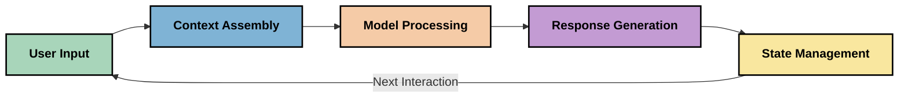
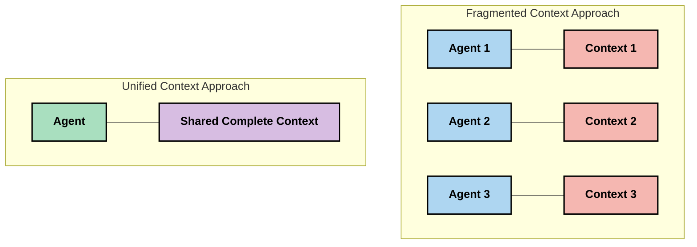
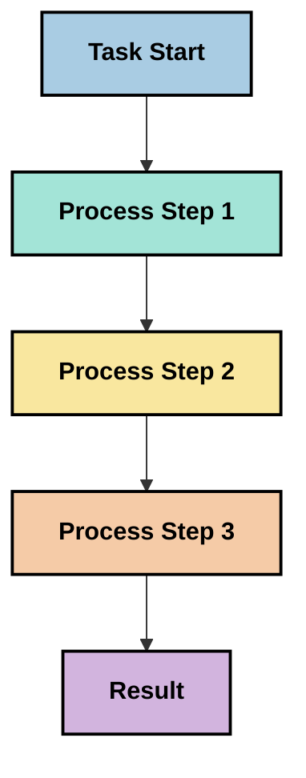
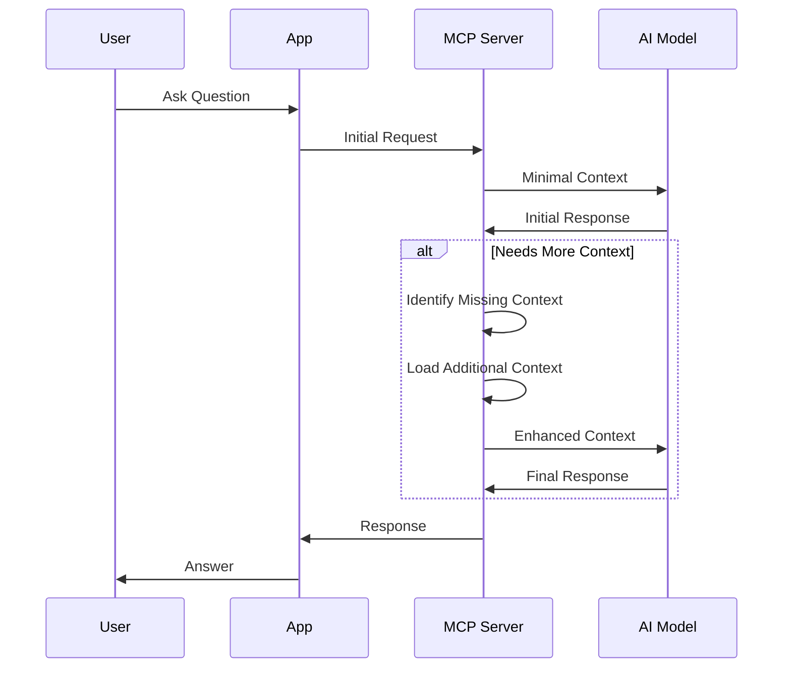
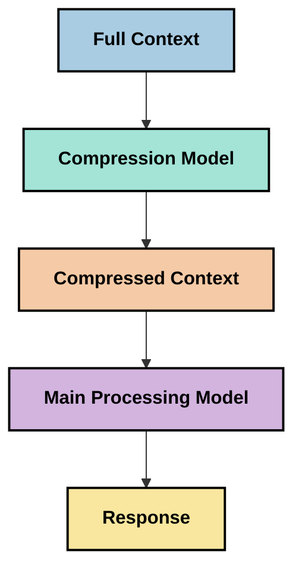

<!--
CO_OP_TRANSLATOR_METADATA:
{
  "original_hash": "fd169ca3071b81b5ee282e194bc823df",
  "translation_date": "2025-09-15T19:46:30+00:00",
  "source_file": "05-AdvancedTopics/mcp-contextengineering/README.md",
  "language_code": "fa"
}
-->
# مهندسی زمینه: یک مفهوم نوظهور در اکوسیستم MCP

## مرور کلی

مهندسی زمینه یک مفهوم نوظهور در حوزه هوش مصنوعی است که به بررسی نحوه ساختاردهی، ارائه و نگهداری اطلاعات در تعاملات بین مشتریان و خدمات هوش مصنوعی می‌پردازد. با تکامل اکوسیستم پروتکل زمینه مدل (MCP)، درک نحوه مدیریت مؤثر زمینه اهمیت بیشتری پیدا می‌کند. این ماژول مفهوم مهندسی زمینه را معرفی کرده و کاربردهای بالقوه آن در پیاده‌سازی‌های MCP را بررسی می‌کند.

## اهداف یادگیری

در پایان این ماژول، شما قادر خواهید بود:

- مفهوم نوظهور مهندسی زمینه و نقش بالقوه آن در کاربردهای MCP را درک کنید
- چالش‌های کلیدی در مدیریت زمینه که طراحی پروتکل MCP به آن‌ها می‌پردازد را شناسایی کنید
- تکنیک‌هایی برای بهبود عملکرد مدل از طریق مدیریت بهتر زمینه بررسی کنید
- رویکردهایی برای اندازه‌گیری و ارزیابی اثربخشی زمینه در نظر بگیرید
- این مفاهیم نوظهور را برای بهبود تجربه‌های هوش مصنوعی از طریق چارچوب MCP به کار ببرید

## مقدمه‌ای بر مهندسی زمینه

مهندسی زمینه یک مفهوم نوظهور است که بر طراحی و مدیریت هدفمند جریان اطلاعات بین کاربران، برنامه‌ها و مدل‌های هوش مصنوعی تمرکز دارد. برخلاف حوزه‌های تثبیت‌شده‌ای مانند مهندسی درخواست، مهندسی زمینه هنوز توسط متخصصان تعریف می‌شود، زیرا آن‌ها تلاش می‌کنند چالش‌های منحصر به فرد ارائه اطلاعات مناسب به مدل‌های هوش مصنوعی در زمان مناسب را حل کنند.

با تکامل مدل‌های زبان بزرگ (LLM)، اهمیت زمینه به طور فزاینده‌ای آشکار شده است. کیفیت، ارتباط و ساختار زمینه‌ای که ارائه می‌دهیم، به طور مستقیم بر خروجی‌های مدل تأثیر می‌گذارد. مهندسی زمینه این رابطه را بررسی کرده و به دنبال توسعه اصولی برای مدیریت مؤثر زمینه است.

> "در سال ۲۰۲۵، مدل‌های موجود بسیار هوشمند هستند. اما حتی باهوش‌ترین انسان بدون زمینه‌ای که به او داده می‌شود نمی‌تواند کار خود را به طور مؤثر انجام دهد... 'مهندسی زمینه' سطح بعدی مهندسی درخواست است. این کار به صورت خودکار در یک سیستم پویا انجام می‌شود." — والدن یان، Cognition AI

مهندسی زمینه ممکن است شامل موارد زیر باشد:

1. **انتخاب زمینه**: تعیین اینکه چه اطلاعاتی برای یک وظیفه خاص مرتبط هستند
2. **ساختاردهی زمینه**: سازماندهی اطلاعات برای به حداکثر رساندن درک مدل
3. **ارائه زمینه**: بهینه‌سازی نحوه و زمان ارسال اطلاعات به مدل‌ها
4. **نگهداری زمینه**: مدیریت وضعیت و تکامل زمینه در طول زمان
5. **ارزیابی زمینه**: اندازه‌گیری و بهبود اثربخشی زمینه

این حوزه‌های تمرکز به ویژه برای اکوسیستم MCP که راهی استاندارد برای برنامه‌ها جهت ارائه زمینه به LLM‌ها فراهم می‌کند، مرتبط هستند.

## چشم‌انداز سفر زمینه

یکی از راه‌های تجسم مهندسی زمینه، ردیابی سفر اطلاعات در یک سیستم MCP است:



### مراحل کلیدی در سفر زمینه:

1. **ورودی کاربر**: اطلاعات خام از کاربر (متن، تصاویر، اسناد)
2. **مونتاژ زمینه**: ترکیب ورودی کاربر با زمینه سیستم، تاریخچه مکالمه و سایر اطلاعات بازیابی‌شده
3. **پردازش مدل**: مدل هوش مصنوعی زمینه مونتاژ شده را پردازش می‌کند
4. **تولید پاسخ**: مدل بر اساس زمینه ارائه‌شده خروجی تولید می‌کند
5. **مدیریت وضعیت**: سیستم وضعیت داخلی خود را بر اساس تعامل به‌روزرسانی می‌کند

این چشم‌انداز ماهیت پویا زمینه در سیستم‌های هوش مصنوعی را برجسته کرده و سوالات مهمی درباره نحوه مدیریت بهترین اطلاعات در هر مرحله مطرح می‌کند.

## اصول نوظهور در مهندسی زمینه

با شکل‌گیری حوزه مهندسی زمینه، برخی اصول اولیه توسط متخصصان در حال ظهور هستند. این اصول ممکن است به انتخاب‌های پیاده‌سازی MCP کمک کنند:

### اصل ۱: زمینه را به طور کامل به اشتراک بگذارید

زمینه باید به طور کامل بین همه اجزای یک سیستم به اشتراک گذاشته شود و نه اینکه در میان چندین عامل یا فرآیند پراکنده شود. هنگامی که زمینه توزیع می‌شود، تصمیماتی که در یک بخش از سیستم گرفته می‌شود ممکن است با تصمیمات گرفته‌شده در جای دیگر تضاد داشته باشد.



در کاربردهای MCP، این اصل پیشنهاد می‌کند که سیستم‌هایی طراحی شوند که زمینه به طور یکپارچه در کل خط لوله جریان داشته باشد و نه اینکه بخش‌بندی شود.

### اصل ۲: تشخیص دهید که اقدامات تصمیمات ضمنی را به همراه دارند

هر اقدامی که یک مدل انجام می‌دهد، تصمیمات ضمنی درباره نحوه تفسیر زمینه را در بر دارد. هنگامی که چندین جزء بر اساس زمینه‌های مختلف عمل می‌کنند، این تصمیمات ضمنی ممکن است تضاد ایجاد کنند و منجر به نتایج ناسازگار شوند.

این اصل پیامدهای مهمی برای کاربردهای MCP دارد:
- پردازش خطی وظایف پیچیده را به جای اجرای موازی با زمینه‌های پراکنده ترجیح دهید
- اطمینان حاصل کنید که همه نقاط تصمیم‌گیری به اطلاعات زمینه‌ای یکسان دسترسی دارند
- سیستم‌هایی طراحی کنید که مراحل بعدی بتوانند زمینه کامل تصمیمات قبلی را ببینند

### اصل ۳: تعادل عمق زمینه با محدودیت‌های پنجره

با طولانی‌تر شدن مکالمات و فرآیندها، پنجره‌های زمینه در نهایت پر می‌شوند. مهندسی زمینه مؤثر رویکردهایی را برای مدیریت این تنش بین زمینه جامع و محدودیت‌های فنی بررسی می‌کند.

رویکردهای بالقوه‌ای که در حال بررسی هستند شامل موارد زیر می‌شوند:
- فشرده‌سازی زمینه که اطلاعات ضروری را حفظ کرده و استفاده از توکن‌ها را کاهش می‌دهد
- بارگذاری تدریجی زمینه بر اساس ارتباط با نیازهای فعلی
- خلاصه‌سازی تعاملات قبلی در حالی که تصمیمات و حقایق کلیدی را حفظ می‌کند

## چالش‌های زمینه و طراحی پروتکل MCP

پروتکل زمینه مدل (MCP) با آگاهی از چالش‌های منحصر به فرد مدیریت زمینه طراحی شده است. درک این چالش‌ها به توضیح جنبه‌های کلیدی طراحی پروتکل MCP کمک می‌کند:

### چالش ۱: محدودیت‌های پنجره زمینه
بیشتر مدل‌های هوش مصنوعی اندازه‌های پنجره زمینه ثابتی دارند که میزان اطلاعاتی که می‌توانند در یک زمان پردازش کنند را محدود می‌کند.

**پاسخ طراحی MCP:** 
- پروتکل از زمینه ساختاریافته و مبتنی بر منابع که می‌توان به طور کارآمد به آن‌ها ارجاع داد، پشتیبانی می‌کند
- منابع می‌توانند صفحه‌بندی شده و به صورت تدریجی بارگذاری شوند

### چالش ۲: تعیین ارتباط
تعیین اینکه کدام اطلاعات برای گنجاندن در زمینه مرتبط‌تر هستند دشوار است.

**پاسخ طراحی MCP:**
- ابزارهای انعطاف‌پذیر امکان بازیابی پویا اطلاعات بر اساس نیاز را فراهم می‌کنند
- درخواست‌های ساختاریافته سازماندهی زمینه‌ای سازگار را امکان‌پذیر می‌سازند

### چالش ۳: پایداری زمینه
مدیریت وضعیت در تعاملات نیازمند ردیابی دقیق زمینه است.

**پاسخ طراحی MCP:**
- مدیریت جلسه استاندارد شده
- الگوهای تعامل به وضوح تعریف‌شده برای تکامل زمینه

### چالش ۴: زمینه چندوجهی
انواع مختلف داده (متن، تصاویر، داده‌های ساختاریافته) نیازمند مدیریت متفاوت هستند.

**پاسخ طراحی MCP:**
- طراحی پروتکل انواع مختلف محتوا را در بر می‌گیرد
- نمایش استاندارد اطلاعات چندوجهی

### چالش ۵: امنیت و حریم خصوصی
زمینه اغلب شامل اطلاعات حساس است که باید محافظت شوند.

**پاسخ طراحی MCP:**
- مرزهای واضح بین مسئولیت‌های مشتری و سرور
- گزینه‌های پردازش محلی برای به حداقل رساندن افشای داده‌ها

درک این چالش‌ها و نحوه پاسخ MCP به آن‌ها پایه‌ای برای بررسی تکنیک‌های پیشرفته‌تر مهندسی زمینه فراهم می‌کند.

## رویکردهای نوظهور مهندسی زمینه

با توسعه حوزه مهندسی زمینه، چندین رویکرد امیدوارکننده در حال ظهور هستند. این‌ها نمایانگر تفکر فعلی هستند و نه بهترین شیوه‌های تثبیت‌شده، و احتمالاً با کسب تجربه بیشتر در پیاده‌سازی‌های MCP تکامل خواهند یافت.

### ۱. پردازش خطی تک‌نخی

در مقابل معماری‌های چندعاملی که زمینه را توزیع می‌کنند، برخی متخصصان دریافتند که پردازش خطی تک‌نخی نتایج سازگارتری تولید می‌کند. این با اصل حفظ زمینه یکپارچه همسو است.



در حالی که این رویکرد ممکن است کمتر از پردازش موازی کارآمد به نظر برسد، اغلب نتایج منسجم‌تر و قابل‌اعتمادتری تولید می‌کند زیرا هر مرحله بر اساس درک کامل تصمیمات قبلی ساخته می‌شود.

### ۲. تقسیم‌بندی و اولویت‌بندی زمینه

تقسیم زمینه‌های بزرگ به قطعات قابل مدیریت و اولویت‌بندی آنچه مهم‌تر است.

```python
# Conceptual Example: Context Chunking and Prioritization
def process_with_chunked_context(documents, query):
    # 1. Break documents into smaller chunks
    chunks = chunk_documents(documents)
    
    # 2. Calculate relevance scores for each chunk
    scored_chunks = [(chunk, calculate_relevance(chunk, query)) for chunk in chunks]
    
    # 3. Sort chunks by relevance score
    sorted_chunks = sorted(scored_chunks, key=lambda x: x[1], reverse=True)
    
    # 4. Use the most relevant chunks as context
    context = create_context_from_chunks([chunk for chunk, score in sorted_chunks[:5]])
    
    # 5. Process with the prioritized context
    return generate_response(context, query)
```

مفهوم بالا نشان می‌دهد که چگونه می‌توان اسناد بزرگ را به قطعات قابل مدیریت تقسیم کرد و فقط بخش‌های مرتبط‌تر را برای زمینه انتخاب کرد. این رویکرد می‌تواند به کار در محدودیت‌های پنجره زمینه کمک کند و در عین حال از پایگاه‌های دانش بزرگ بهره‌مند شود.

### ۳. بارگذاری تدریجی زمینه

بارگذاری زمینه به صورت تدریجی و بر اساس نیاز به جای بارگذاری همه اطلاعات به یکباره.



بارگذاری تدریجی زمینه با حداقل زمینه شروع می‌شود و فقط در صورت نیاز گسترش می‌یابد. این می‌تواند استفاده از توکن‌ها را برای پرسش‌های ساده به طور قابل توجهی کاهش دهد و در عین حال توانایی رسیدگی به سوالات پیچیده را حفظ کند.

### ۴. فشرده‌سازی و خلاصه‌سازی زمینه

کاهش اندازه زمینه در حالی که اطلاعات ضروری حفظ می‌شود.



فشرده‌سازی زمینه بر موارد زیر تمرکز دارد:
- حذف اطلاعات تکراری
- خلاصه‌سازی محتوای طولانی
- استخراج حقایق و جزئیات کلیدی
- حفظ عناصر زمینه‌ای حیاتی
- بهینه‌سازی برای کارایی توکن‌ها

این رویکرد می‌تواند به ویژه برای حفظ مکالمات طولانی در پنجره‌های زمینه یا پردازش اسناد بزرگ به طور کارآمد ارزشمند باشد. برخی متخصصان از مدل‌های تخصصی به طور خاص برای فشرده‌سازی زمینه و خلاصه‌سازی تاریخچه مکالمه استفاده می‌کنند.

## ملاحظات اکتشافی مهندسی زمینه

در حالی که حوزه مهندسی زمینه را بررسی می‌کنیم، چندین ملاحظه هنگام کار با پیاده‌سازی‌های MCP ارزشمند هستند. این‌ها بهترین شیوه‌های تجویزی نیستند بلکه حوزه‌های اکتشافی هستند که ممکن است در مورد استفاده خاص شما بهبودهایی ایجاد کنند.

### اهداف زمینه خود را در نظر بگیرید

قبل از پیاده‌سازی راه‌حل‌های پیچیده مدیریت زمینه، به وضوح مشخص کنید که چه چیزی را می‌خواهید به دست آورید:
- مدل برای موفقیت به چه اطلاعات خاصی نیاز دارد؟
- کدام اطلاعات ضروری هستند و کدام مکمل؟
- محدودیت‌های عملکرد شما چیست (زمان تأخیر، محدودیت‌های توکن، هزینه‌ها)؟

### رویکردهای زمینه لایه‌ای را بررسی کنید

برخی متخصصان با زمینه‌ای که در لایه‌های مفهومی مرتب شده است موفقیت پیدا کرده‌اند:
- **لایه اصلی**: اطلاعات ضروری که مدل همیشه به آن نیاز دارد
- **لایه موقعیتی**: زمینه خاص تعامل فعلی
- **لایه پشتیبانی**: اطلاعات اضافی که ممکن است مفید باشد
- **لایه پشتیبان**: اطلاعاتی که فقط در صورت نیاز به آن دسترسی پیدا می‌شود

### استراتژی‌های بازیابی را بررسی کنید

اثربخشی زمینه شما اغلب به نحوه بازیابی اطلاعات بستگی دارد:
- جستجوی معنایی و تعبیه‌ها برای یافتن اطلاعات مرتبط مفهومی
- جستجوی مبتنی بر کلمات کلیدی برای جزئیات واقعی خاص
- رویکردهای ترکیبی که چندین روش بازیابی را ترکیب می‌کنند
- فیلتر کردن متاداده برای محدود کردن دامنه بر اساس دسته‌بندی‌ها، تاریخ‌ها یا منابع

### با انسجام زمینه آزمایش کنید

ساختار و جریان زمینه شما ممکن است بر درک مدل تأثیر بگذارد:
- گروه‌بندی اطلاعات مرتبط با هم
- استفاده از قالب‌بندی و سازماندهی سازگار
- حفظ ترتیب منطقی یا زمانی در صورت مناسب بودن
- اجتناب از اطلاعات متناقض

### مزایا و معایب معماری‌های چندعاملی را بسنجید

در حالی که معماری‌های چندعاملی در بسیاری از چارچوب‌های هوش مصنوعی محبوب هستند، آن‌ها چالش‌های قابل توجهی برای مدیریت زمینه به همراه دارند:
- پراکندگی زمینه می‌تواند منجر به تصمیمات ناسازگار بین عوامل شود
- پردازش موازی ممکن است تضادهایی ایجاد کند که حل آن‌ها دشوار است
- سربار ارتباطی بین عوامل می‌تواند مزایای عملکرد را خنثی کند
- مدیریت وضعیت پیچیده برای حفظ انسجام مورد نیاز است

در بسیاری از موارد، یک رویکرد تک‌عاملی با مدیریت زمینه جامع ممکن است نتایج قابل‌اعتمادتری نسبت به چندین عامل تخصصی با زمینه پراکنده تولید کند.

### روش‌های ارزیابی را توسعه دهید

برای بهبود مهندسی زمینه در طول زمان، در نظر بگیرید که چگونه موفقیت را اندازه‌گیری خواهید کرد:
- آزمایش A/B ساختارهای مختلف زمینه
- نظارت بر استفاده از توکن‌ها و زمان‌های پاسخ
- ردیابی رضایت کاربران و نرخ تکمیل وظایف
- تجزیه و تحلیل زمان و دلایل شکست استراتژی‌های زمینه

این ملاحظات نمایانگر حوزه‌های فعال اکتشاف در فضای مهندسی زمینه هستند. با بلوغ این حوزه، الگوها و شیوه‌های قطعی‌تر احتمالاً ظاهر خواهند شد.

## اندازه‌گیری اثربخشی زمینه: یک چارچوب در حال تکامل

با ظهور مهندسی زمینه به عنوان یک مفهوم، متخصصان شروع به بررسی کرده‌اند که چگونه ممکن است اثربخشی آن را اندازه‌گیری کنیم. هنوز هیچ چارچوب تثبیت‌شده‌ای وجود ندارد، اما ابعاد مختلفی در حال بررسی هستند که می‌توانند به هدایت کارهای آینده کمک کنند.

### ابعاد بالقوه اندازه‌گیری

#### ۱. ملاحظات کارایی ورودی

- **نسبت زمینه به پاسخ**: چه مقدار زمینه نسبت به اندازه پاسخ مورد نیاز است؟
- **استفاده از توکن‌ها**: چه درصدی از توکن‌های زمینه ارائه‌شده بر پاسخ تأثیر می‌گذارند؟
- **کاهش زمینه**: چگونه ممکن است اطلاعات خام را به طور مؤثر فشرده کنیم؟

#### ۲. ملاحظات عملکرد

- **تأثیر زمان تأخیر**: مدیریت زمینه چگونه بر زمان پاسخ تأثیر می‌گذارد؟
- **اقتصاد توکن‌ها**: آیا ما استفاده از توکن‌ها را به طور مؤثر بهینه می‌کنیم؟
- **دقت بازیابی**: اطلاعات بازیابی‌شده چقدر مرتبط هستند؟
- **استفاده از منابع**: چه منابع محاسباتی مورد نیاز هستند؟

#### ۳. ملاحظات کیفیت

- **ارتباط پاسخ**: پاسخ چقدر به پرسش مربوط است؟
- **دقت واقعی**: آیا مدیریت زمینه دقت واقعی را بهبود می‌بخشد؟
- **انسجام**: آیا پاسخ‌ها در پرسش‌های مشابه سازگار هستند؟
- **نرخ توهم**: آیا زمینه بهتر نرخ توهم مدل را کاهش می‌دهد؟

#### ۴. ملاحظات تجربه کاربر

- **نرخ پیگیری**: کاربران چند بار نیاز به توضیح دارند؟
- **تکمیل وظیفه**: آیا کاربران اهداف خود را با موفقیت انجام می‌دهند؟
- **شاخص‌های رضایت**: کاربران تجربه خود را چگونه ارزیابی می‌کنند؟

### رویکردهای اکتشافی برای اندازه‌گیری

هنگام آزمایش مهندسی زمینه در پیاده‌سازی‌های MCP، این رویکردهای اکتشافی را در نظر بگیرید:

1. **مقایسه‌های پایه**: یک پایه با رویکردهای ساده زمینه ایجاد کنید قبل از آزمایش روش‌های پیچیده‌تر

2. **تغییرات تدریجی**: یک جنبه از مدیریت زمینه را در هر زمان تغییر دهید تا اثرات آن را جدا کنید

3. **ارزیابی متمرکز بر کاربر**: معیارهای کمی را با بازخورد کیفی کاربران ترکیب کنید

4. **تحلیل شکست**: مواردی که استراتژی‌های زمینه شکست می‌خورند را بررسی کنید تا بهبودهای بالقوه را درک کنید

5. **ارزیابی چندبعدی**: تجارت بین کارایی، کیفیت و تجربه کاربر را در نظر بگیرید

این رویکرد تجربی و چندوجهی به اندازه‌گیری با ماهیت نوظهور مهندسی زمینه همسو است.

## افکار پایانی

مهندسی زمینه یک حوزه نوظهور است که ممکن است برای کاربردهای مؤثر MCP مرکزی باشد. با در نظر گرفتن دقیق نحوه جریان اطلاعات در سیستم خود، می‌توانید تجربه‌های هوش مصنوعی ایجاد کنید که کارآمدتر، دقیق‌تر و ارزشمندتر برای کاربران باشد.

تکنیک‌ها و رویکردهای مطرح‌شده در این ماژول نمایانگر تفکر اولیه در این حوزه هستند و نه شیوه‌های تثبیت‌شده. مهندسی زمینه ممکن است به یک رشته تعریف‌شده‌تر تبدیل شود زیرا قابلیت‌های هوش مصنوعی تکامل می‌یابند و درک ما عمیق‌تر می‌شود. در حال حاضر، آزمایش همراه با اندازه‌گیری دقیق به نظر می‌رسد که مؤثرترین رویکرد باشد.

## جهت‌های
- [وب‌سایت پروتکل مدل کانتکست](https://modelcontextprotocol.io/)
- [مشخصات پروتکل مدل کانتکست](https://github.com/modelcontextprotocol/modelcontextprotocol)
- [مستندات MCP](https://modelcontextprotocol.io/docs)
- [SDK MCP برای C#](https://github.com/modelcontextprotocol/csharp-sdk)
- [SDK MCP برای Python](https://github.com/modelcontextprotocol/python-sdk)
- [SDK MCP برای TypeScript](https://github.com/modelcontextprotocol/typescript-sdk)
- [بازرس MCP](https://github.com/modelcontextprotocol/inspector) - ابزار تست بصری برای سرورهای MCP

### مقالات مهندسی کانتکست
- [چند عامل نسازید: اصول مهندسی کانتکست](https://cognition.ai/blog/dont-build-multi-agents) - دیدگاه‌های والدن یان درباره اصول مهندسی کانتکست
- [راهنمای عملی برای ساخت عوامل](https://cdn.openai.com/business-guides-and-resources/a-practical-guide-to-building-agents.pdf) - راهنمای OpenAI برای طراحی مؤثر عوامل
- [ساخت عوامل مؤثر](https://www.anthropic.com/engineering/building-effective-agents) - رویکرد Anthropic به توسعه عوامل

### تحقیقات مرتبط
- [تقویت بازیابی پویا برای مدل‌های زبانی بزرگ](https://arxiv.org/abs/2310.01487) - تحقیق درباره روش‌های بازیابی پویا
- [گم‌شده در وسط: چگونه مدل‌های زبانی کانتکست‌های طولانی را استفاده می‌کنند](https://arxiv.org/abs/2307.03172) - تحقیق مهم درباره الگوهای پردازش کانتکست
- [تولید تصویر شرطی متنی سلسله‌مراتبی با CLIP Latents](https://arxiv.org/abs/2204.06125) - مقاله DALL-E 2 با دیدگاه‌هایی درباره ساختاردهی کانتکست
- [بررسی نقش کانتکست در معماری‌های مدل‌های زبانی بزرگ](https://aclanthology.org/2023.findings-emnlp.124/) - تحقیق اخیر درباره مدیریت کانتکست
- [همکاری چند عاملی: یک مرور](https://arxiv.org/abs/2304.03442) - تحقیق درباره سیستم‌های چند عاملی و چالش‌های آن‌ها

### منابع اضافی
- [تکنیک‌های بهینه‌سازی پنجره کانتکست](https://learn.microsoft.com/en-us/azure/ai-services/openai/concepts/context-window)
- [تکنیک‌های پیشرفته RAG](https://www.microsoft.com/en-us/research/blog/retrieval-augmented-generation-rag-and-frontier-models/)
- [مستندات Semantic Kernel](https://github.com/microsoft/semantic-kernel)
- [ابزار AI برای مدیریت کانتکست](https://github.com/microsoft/aitoolkit)

## مرحله بعدی

- [5.15 حمل‌ونقل سفارشی MCP](../mcp-transport/README.md)

---

**سلب مسئولیت**:  
این سند با استفاده از سرویس ترجمه هوش مصنوعی [Co-op Translator](https://github.com/Azure/co-op-translator) ترجمه شده است. در حالی که ما تلاش می‌کنیم دقت را حفظ کنیم، لطفاً توجه داشته باشید که ترجمه‌های خودکار ممکن است شامل خطاها یا نادرستی‌ها باشند. سند اصلی به زبان اصلی آن باید به عنوان منبع معتبر در نظر گرفته شود. برای اطلاعات حساس، توصیه می‌شود از ترجمه حرفه‌ای انسانی استفاده کنید. ما مسئولیتی در قبال سوء تفاهم‌ها یا تفسیرهای نادرست ناشی از استفاده از این ترجمه نداریم.