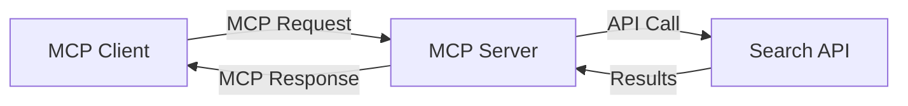
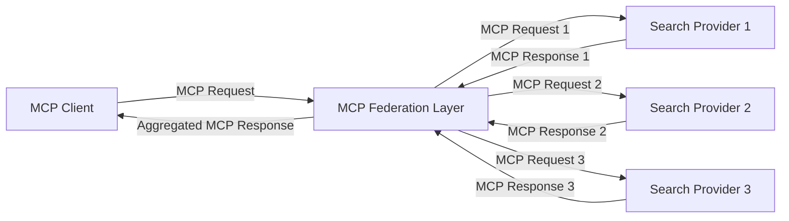
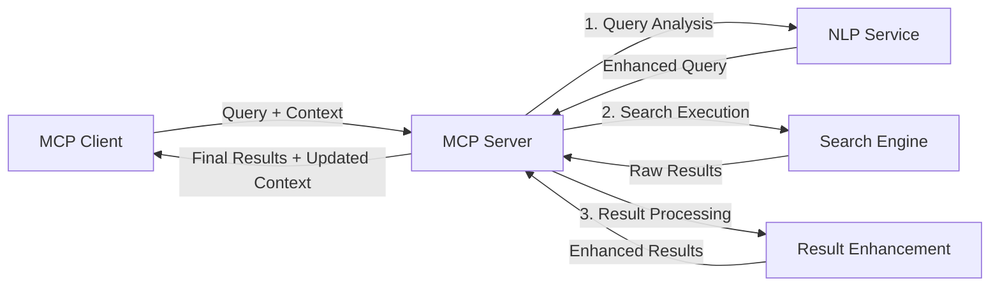

<!--
CO_OP_TRANSLATOR_METADATA:
{
  "original_hash": "333a03e51f90bdf3e6f1ba1694c73f36",
  "translation_date": "2025-07-16T22:26:58+00:00",
  "source_file": "05-AdvancedTopics/mcp-realtimesearch/README.md",
  "language_code": "fa"
}
-->
## توضیحات مربوط به نمونه‌های کد

> **نکته مهم**: نمونه‌های کد زیر نحوه‌ی ادغام پروتکل مدل کانتکست (MCP) با قابلیت جستجوی وب را نشان می‌دهند. اگرچه این نمونه‌ها از الگوها و ساختارهای SDKهای رسمی MCP پیروی می‌کنند، اما برای اهداف آموزشی ساده‌سازی شده‌اند.
> 
> این نمونه‌ها شامل موارد زیر هستند:
> 
> 1. **پیاده‌سازی پایتون**: یک پیاده‌سازی سرور FastMCP که ابزار جستجوی وب را فراهم می‌کند و به یک API جستجوی خارجی متصل می‌شود. این مثال مدیریت صحیح طول عمر، کنترل کانتکست و پیاده‌سازی ابزار را مطابق الگوهای [SDK رسمی MCP پایتون](https://github.com/modelcontextprotocol/python-sdk) نشان می‌دهد. سرور از انتقال HTTP قابل استریم که جایگزین انتقال SSE قدیمی برای استقرارهای تولیدی شده است، استفاده می‌کند.
> 
> 2. **پیاده‌سازی جاوااسکریپت**: پیاده‌سازی TypeScript/JavaScript با استفاده از الگوی FastMCP از [SDK رسمی MCP TypeScript](https://github.com/modelcontextprotocol/typescript-sdk) برای ایجاد سرور جستجو با تعاریف ابزار مناسب و اتصال کلاینت‌ها. این نمونه‌ها از جدیدترین الگوهای مدیریت نشست و حفظ کانتکست پیروی می‌کنند.
> 
> این نمونه‌ها برای استفاده در محیط تولید نیازمند افزودن مدیریت خطا، احراز هویت و کدهای خاص ادغام API هستند. نقاط انتهایی API جستجو که نشان داده شده‌اند (`https://api.search-service.example/search`) فقط نمونه هستند و باید با نقاط انتهایی واقعی سرویس جستجو جایگزین شوند.
> 
> برای جزئیات کامل پیاده‌سازی و جدیدترین روش‌ها، لطفاً به [مشخصات رسمی MCP](https://spec.modelcontextprotocol.io/) و مستندات SDK مراجعه کنید.

## مفاهیم اصلی

### چارچوب پروتکل مدل کانتکست (MCP)

در پایه، پروتکل مدل کانتکست روشی استاندارد برای تبادل کانتکست بین مدل‌های هوش مصنوعی، برنامه‌ها و سرویس‌ها فراهم می‌کند. در جستجوی وب به صورت بلادرنگ، این چارچوب برای ایجاد تجربه‌های جستجوی چندمرحله‌ای و منسجم ضروری است. اجزای کلیدی شامل موارد زیر هستند:

1. **معماری کلاینت-سرور**: MCP جداسازی واضحی بین کلاینت‌های جستجو (درخواست‌دهنده‌ها) و سرورهای جستجو (ارائه‌دهنده‌ها) برقرار می‌کند که امکان مدل‌های استقرار انعطاف‌پذیر را فراهم می‌آورد.

2. **ارتباط JSON-RPC**: این پروتکل از JSON-RPC برای تبادل پیام استفاده می‌کند که با فناوری‌های وب سازگار است و پیاده‌سازی آن در پلتفرم‌های مختلف آسان است.

3. **مدیریت کانتکست**: MCP روش‌های ساختاریافته‌ای برای حفظ، به‌روزرسانی و بهره‌برداری از کانتکست جستجو در تعاملات متعدد تعریف می‌کند.

4. **تعاریف ابزار**: قابلیت‌های جستجو به صورت ابزارهای استاندارد با پارامترها و مقادیر بازگشتی مشخص ارائه می‌شوند.

5. **پشتیبانی از استریمینگ**: پروتکل از ارسال نتایج به صورت استریم پشتیبانی می‌کند که برای جستجوی بلادرنگ که نتایج ممکن است به تدریج برسند، ضروری است.

### الگوهای ادغام جستجوی وب

هنگام ادغام MCP با جستجوی وب، چند الگو شکل می‌گیرند:

#### 1. ادغام مستقیم ارائه‌دهنده جستجو

در این الگو، سرور MCP مستقیماً با یک یا چند API جستجو ارتباط برقرار می‌کند، درخواست‌های MCP را به فراخوانی‌های خاص API ترجمه کرده و نتایج را به صورت پاسخ‌های MCP قالب‌بندی می‌کند.

#### 2. جستجوی فدرال با حفظ کانتکست

این الگو کوئری‌های جستجو را بین چند ارائه‌دهنده جستجوی سازگار با MCP توزیع می‌کند، که هر کدام ممکن است در انواع مختلف محتوا یا قابلیت‌های جستجو تخصص داشته باشند، در حالی که یک کانتکست یکپارچه حفظ می‌شود.

#### 3. زنجیره جستجوی بهبود یافته با کانتکست

در این الگو، فرایند جستجو به چند مرحله تقسیم می‌شود و کانتکست در هر مرحله غنی‌تر می‌شود که منجر به نتایج به‌مراتب مرتبط‌تر می‌گردد.

### اجزای کانتکست جستجو

در جستجوی وب مبتنی بر MCP، کانتکست معمولاً شامل موارد زیر است:

- **تاریخچه کوئری‌ها**: کوئری‌های جستجوی قبلی در جلسه
- **ترجیحات کاربر**: زبان، منطقه، تنظیمات جستجوی ایمن
- **تاریخچه تعاملات**: نتایجی که کلیک شده‌اند، زمان صرف شده روی نتایج
- **پارامترهای جستجو**: فیلترها، ترتیب مرتب‌سازی و سایر تغییردهنده‌های جستجو
- **دانش حوزه‌ای**: کانتکست موضوعی مرتبط با جستجو
- **کانتکست زمانی**: عوامل مرتبط با زمان
- **ترجیحات منبع**: منابع اطلاعاتی مورد اعتماد یا ترجیح داده شده

## موارد استفاده و کاربردها

### پژوهش و جمع‌آوری اطلاعات

MCP جریان‌های کاری پژوهشی را با موارد زیر بهبود می‌بخشد:

- حفظ کانتکست پژوهش در جلسات جستجو
- امکان کوئری‌های پیچیده‌تر و مرتبط‌تر با کانتکست
- پشتیبانی از فدراسیون جستجو در چند منبع
- تسهیل استخراج دانش از نتایج جستجو

### پایش اخبار و روندهای بلادرنگ

جستجوی مبتنی بر MCP مزایایی برای پایش اخبار دارد:

- کشف نزدیک به بلادرنگ اخبار نوظهور
- فیلتر کردن کانتکست‌محور اطلاعات مرتبط
- ردیابی موضوعات و موجودیت‌ها در منابع متعدد
- هشدارهای خبری شخصی‌سازی شده بر اساس کانتکست کاربر

### مرور و پژوهش تقویت‌شده با هوش مصنوعی

MCP امکانات جدیدی برای مرور تقویت‌شده با هوش مصنوعی ایجاد می‌کند:

- پیشنهادات جستجوی کانتکست‌محور بر اساس فعالیت جاری مرورگر
- ادغام بی‌وقفه جستجوی وب با دستیاران مبتنی بر مدل‌های زبانی بزرگ
- پالایش جستجوی چندمرحله‌ای با حفظ کانتکست
- بهبود بررسی صحت و اعتبارسنجی اطلاعات

## روندها و نوآوری‌های آینده

### تکامل MCP در جستجوی وب

با نگاه به آینده، انتظار می‌رود MCP به موارد زیر بپردازد:

- **جستجوی چندرسانه‌ای**: ادغام جستجوی متن، تصویر، صدا و ویدئو با حفظ کانتکست
- **جستجوی غیرمتمرکز**: پشتیبانی از اکوسیستم‌های جستجوی توزیع‌شده و فدرال
- **حریم خصوصی جستجو**: مکانیزم‌های جستجوی حفظ حریم خصوصی با آگاهی از زمینه  
- **درک پرس‌وجو**: تجزیه و تحلیل عمیق معنایی پرس‌وجوهای جستجوی زبان طبیعی  

### پیشرفت‌های احتمالی در فناوری

فناوری‌های نوظهوری که آینده جستجوی MCP را شکل خواهند داد:

1. **معماری‌های جستجوی عصبی**: سیستم‌های جستجوی مبتنی بر تعبیه که برای MCP بهینه شده‌اند  
2. **زمینه جستجوی شخصی‌سازی‌شده**: یادگیری الگوهای جستجوی کاربران به صورت فردی در طول زمان  
3. **ادغام نمودار دانش**: جستجوی زمینه‌ای تقویت‌شده با نمودارهای دانش حوزه‌ای  
4. **زمینه چندرسانه‌ای**: حفظ زمینه در میان حالت‌های مختلف جستجو  

## تمرین‌های عملی

### تمرین ۱: راه‌اندازی یک خط لوله جستجوی پایه MCP

در این تمرین، خواهید آموخت چگونه:  
- یک محیط جستجوی پایه MCP را پیکربندی کنید  
- هندلرهای زمینه را برای جستجوی وب پیاده‌سازی کنید  
- حفظ زمینه را در طول تکرارهای جستجو آزمایش و اعتبارسنجی کنید  

### تمرین ۲: ساخت دستیار پژوهشی با جستجوی MCP

یک برنامه کامل بسازید که:  
- سوالات پژوهشی زبان طبیعی را پردازش می‌کند  
- جستجوهای وب با آگاهی از زمینه انجام می‌دهد  
- اطلاعات را از منابع متعدد ترکیب می‌کند  
- یافته‌های پژوهشی سازمان‌یافته را ارائه می‌دهد  

### تمرین ۳: پیاده‌سازی فدراسیون جستجوی چندمنبعی با MCP

تمرین پیشرفته شامل:  
- ارسال پرس‌وجو با آگاهی از زمینه به چند موتور جستجو  
- رتبه‌بندی و تجمیع نتایج  
- حذف تکراری‌های زمینه‌ای نتایج جستجو  
- مدیریت متادیتای خاص هر منبع  

## منابع اضافی

- [Model Context Protocol Specification](https://spec.modelcontextprotocol.io/) - مشخصات رسمی MCP و مستندات پروتکل  
- [Model Context Protocol Documentation](https://modelcontextprotocol.io/) - آموزش‌ها و راهنمای پیاده‌سازی دقیق  
- [MCP Python SDK](https://github.com/modelcontextprotocol/python-sdk) - پیاده‌سازی رسمی MCP به زبان پایتون  
- [MCP TypeScript SDK](https://github.com/modelcontextprotocol/typescript-sdk) - پیاده‌سازی رسمی MCP به زبان تایپ‌اسکریپت  
- [MCP Reference Servers](https://github.com/modelcontextprotocol/servers) - پیاده‌سازی‌های مرجع سرورهای MCP  
- [Bing Web Search API Documentation](https://learn.microsoft.com/en-us/bing/search-apis/bing-web-search/overview) - API جستجوی وب مایکروسافت  
- [Google Custom Search JSON API](https://developers.google.com/custom-search/v1/overview) - موتور جستجوی برنامه‌پذیر گوگل  
- [SerpAPI Documentation](https://serpapi.com/search-api) - API صفحه نتایج موتور جستجو  
- [Meilisearch Documentation](https://www.meilisearch.com/docs) - موتور جستجوی متن‌باز  
- [Elasticsearch Documentation](https://www.elastic.co/guide/index.html) - موتور جستجو و تحلیل توزیع‌شده  
- [LangChain Documentation](https://python.langchain.com/docs/get_started/introduction) - ساخت برنامه با مدل‌های زبان بزرگ  

## نتایج یادگیری

با تکمیل این ماژول، قادر خواهید بود:  

- اصول جستجوی وب در زمان واقعی و چالش‌های آن را درک کنید  
- توضیح دهید چگونه Model Context Protocol (MCP) قابلیت‌های جستجوی وب در زمان واقعی را بهبود می‌بخشد  
- راه‌حل‌های جستجو مبتنی بر MCP را با استفاده از فریم‌ورک‌ها و APIهای محبوب پیاده‌سازی کنید  
- معماری‌های جستجوی مقیاس‌پذیر و با عملکرد بالا را با MCP طراحی و پیاده‌سازی کنید  
- مفاهیم MCP را در موارد استفاده مختلف از جمله جستجوی معنایی، دستیار پژوهشی و مرور تقویت‌شده با هوش مصنوعی به کار ببرید  
- روندهای نوظهور و نوآوری‌های آینده در فناوری‌های جستجوی مبتنی بر MCP را ارزیابی کنید  

### ملاحظات اعتماد و ایمنی

هنگام پیاده‌سازی راه‌حل‌های جستجوی وب مبتنی بر MCP، این اصول مهم از مشخصات MCP را به خاطر بسپارید:  

1. **رضایت و کنترل کاربر**: کاربران باید به‌طور صریح رضایت دهند و تمام دسترسی‌ها و عملیات داده‌ها را درک کنند. این موضوع به‌ویژه برای پیاده‌سازی‌های جستجوی وب که ممکن است به منابع داده خارجی دسترسی داشته باشند اهمیت دارد.  

2. **حریم خصوصی داده‌ها**: اطمینان حاصل کنید که پرس‌وجوها و نتایج جستجو به‌درستی مدیریت می‌شوند، به‌خصوص زمانی که ممکن است شامل اطلاعات حساس باشند. کنترل‌های دسترسی مناسب برای حفاظت از داده‌های کاربران اعمال کنید.  

3. **ایمنی ابزارها**: مجوزدهی و اعتبارسنجی مناسب برای ابزارهای جستجو پیاده‌سازی کنید، زیرا این ابزارها می‌توانند از طریق اجرای کد دلخواه خطرات امنیتی ایجاد کنند. توصیف رفتار ابزارها باید غیرقابل اعتماد در نظر گرفته شود مگر اینکه از سرور مورد اعتماد دریافت شده باشد.  

4. **مستندسازی شفاف**: مستندات واضحی درباره قابلیت‌ها، محدودیت‌ها و ملاحظات امنیتی پیاده‌سازی جستجوی مبتنی بر MCP ارائه دهید، مطابق با راهنمای پیاده‌سازی مشخصات MCP.  

5. **جریان‌های رضایت قوی**: جریان‌های رضایت و مجوزدهی محکمی بسازید که به‌وضوح توضیح دهند هر ابزار چه کاری انجام می‌دهد قبل از اینکه اجازه استفاده از آن داده شود، به‌ویژه برای ابزارهایی که با منابع وب خارجی تعامل دارند.  

برای جزئیات کامل درباره امنیت و ملاحظات اعتماد MCP، به [مستندات رسمی](https://modelcontextprotocol.io/specification/2025-03-26#security-and-trust-%26-safety) مراجعه کنید.  

## مرحله بعد  

- [5.12 احراز هویت Entra ID برای سرورهای Model Context Protocol](../mcp-security-entra/README.md)

**سلب مسئولیت**:  
این سند با استفاده از سرویس ترجمه هوش مصنوعی [Co-op Translator](https://github.com/Azure/co-op-translator) ترجمه شده است. در حالی که ما در تلاش برای دقت هستیم، لطفاً توجه داشته باشید که ترجمه‌های خودکار ممکن است حاوی خطاها یا نواقصی باشند. سند اصلی به زبان بومی خود باید به عنوان منبع معتبر در نظر گرفته شود. برای اطلاعات حیاتی، ترجمه حرفه‌ای انسانی توصیه می‌شود. ما مسئول هیچ گونه سوءتفاهم یا تفسیر نادرستی که از استفاده این ترجمه ناشی شود، نیستیم.