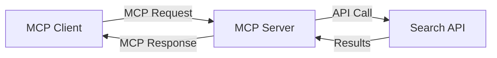
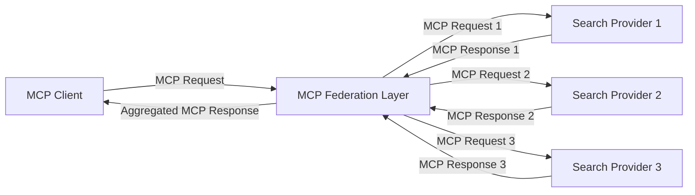
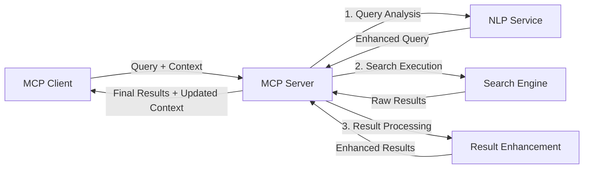

<!--
CO_OP_TRANSLATOR_METADATA:
{
  "original_hash": "16bef2c93c6a86d4ca6a8ce9e120e384",
  "translation_date": "2025-06-12T22:39:59+00:00",
  "source_file": "05-AdvancedTopics/mcp-realtimesearch/README.md",
  "language_code": "fa"
}
-->
## توضیحات نمونه‌های کد

> **توجه مهم**: نمونه‌های کد زیر ادغام پروتکل مدل کانتکست (MCP) با قابلیت جستجوی وب را نشان می‌دهند. اگرچه این نمونه‌ها از الگوها و ساختارهای SDK رسمی MCP پیروی می‌کنند، اما برای اهداف آموزشی ساده‌سازی شده‌اند.
> 
> این نمونه‌ها شامل موارد زیر هستند:
> 
> 1. **پیاده‌سازی پایتون**: یک سرور FastMCP که ابزار جستجوی وب ارائه می‌دهد و به یک API جستجوی خارجی متصل می‌شود. این نمونه مدیریت صحیح طول عمر، کنترل کانتکست و پیاده‌سازی ابزار را طبق الگوهای [SDK رسمی MCP پایتون](https://github.com/modelcontextprotocol/python-sdk) نشان می‌دهد. سرور از انتقال HTTP قابل استریم که جایگزین انتقال SSE قدیمی برای استقرارهای تولیدی شده است، استفاده می‌کند.
> 
> 2. **پیاده‌سازی جاوااسکریپت**: یک پیاده‌سازی TypeScript/JavaScript با استفاده از الگوی FastMCP از [SDK رسمی MCP TypeScript](https://github.com/modelcontextprotocol/typescript-sdk) برای ایجاد سرور جستجو با تعاریف ابزار و اتصال کلاینت به شکل صحیح. این نمونه از جدیدترین الگوهای مدیریت نشست و حفظ کانتکست پیروی می‌کند.
> 
> این نمونه‌ها برای استفاده در محیط تولید به مدیریت خطا، احراز هویت و کد یکپارچه‌سازی API خاص بیشتری نیاز دارند. نقاط انتهایی API جستجو نشان داده شده (`https://api.search-service.example/search`) صرفاً نمونه هستند و باید با نقاط انتهایی سرویس‌های جستجوی واقعی جایگزین شوند.
> 
> برای جزئیات کامل پیاده‌سازی و به‌روزرسانی‌های جدیدتر، لطفاً به [مشخصات رسمی MCP](https://spec.modelcontextprotocol.io/) و مستندات SDK مراجعه کنید.

## مفاهیم اصلی

### چارچوب پروتکل مدل کانتکست (MCP)

در بنیاد خود، پروتکل مدل کانتکست روشی استاندارد برای تبادل کانتکست بین مدل‌های هوش مصنوعی، برنامه‌ها و سرویس‌ها فراهم می‌کند. در جستجوی وب در زمان واقعی، این چارچوب برای ایجاد تجربه‌های جستجوی چندمرحله‌ای و منسجم ضروری است. اجزای کلیدی شامل:

1. **معماری کلاینت-سرور**: MCP جداسازی واضحی بین کلاینت‌های جستجو (درخواست‌دهنده‌ها) و سرورهای جستجو (ارائه‌دهنده‌ها) برقرار می‌کند و امکان مدل‌های استقرار انعطاف‌پذیر را فراهم می‌سازد.

2. **ارتباط JSON-RPC**: این پروتکل از JSON-RPC برای تبادل پیام استفاده می‌کند که با فناوری‌های وب سازگار و در پلتفرم‌های مختلف به راحتی قابل پیاده‌سازی است.

3. **مدیریت کانتکست**: MCP روش‌های ساختاریافته‌ای برای حفظ، به‌روزرسانی و بهره‌برداری از کانتکست جستجو در تعاملات متعدد تعریف می‌کند.

4. **تعاریف ابزار**: قابلیت‌های جستجو به صورت ابزارهای استاندارد با پارامترها و مقادیر بازگشتی مشخص ارائه می‌شوند.

5. **پشتیبانی از استریمینگ**: پروتکل از نتایج استریم‌شونده پشتیبانی می‌کند که برای جستجوی زمان واقعی که نتایج به صورت تدریجی می‌رسند، ضروری است.

### الگوهای ادغام جستجوی وب

هنگام ادغام MCP با جستجوی وب، چند الگوی معمول مشاهده می‌شود:

#### 1. ادغام مستقیم ارائه‌دهنده جستجو

در این الگو، سرور MCP مستقیماً با یک یا چند API جستجو ارتباط برقرار می‌کند، درخواست‌های MCP را به تماس‌های خاص API ترجمه کرده و نتایج را به صورت پاسخ‌های MCP قالب‌بندی می‌کند.

#### 2. جستجوی فدرال با حفظ کانتکست

این الگو کوئری‌های جستجو را بین چند ارائه‌دهنده جستجوی سازگار با MCP توزیع می‌کند که هرکدام ممکن است در انواع مختلف محتوا یا قابلیت‌های جستجو تخصص داشته باشند، در حالی که کانتکست یکپارچه حفظ می‌شود.

#### 3. زنجیره جستجوی بهبود یافته با کانتکست

در این الگو، فرایند جستجو به چند مرحله تقسیم می‌شود و در هر مرحله کانتکست غنی‌تر می‌شود که در نهایت به نتایج به‌مراتب مرتبط‌تر منجر می‌شود.

### اجزای کانتکست جستجو

در جستجوی وب مبتنی بر MCP، کانتکست معمولاً شامل موارد زیر است:

- **تاریخچه کوئری**: کوئری‌های جستجوی قبلی در نشست
- **ترجیحات کاربر**: زبان، منطقه، تنظیمات جستجوی ایمن
- **تاریخچه تعاملات**: نتایجی که کلیک شده‌اند، زمان صرف شده روی نتایج
- **پارامترهای جستجو**: فیلترها، ترتیب مرتب‌سازی و سایر تغییر دهنده‌های جستجو
- **دانش حوزه‌ای**: کانتکست موضوعی مرتبط با جستجو
- **کانتکست زمانی**: عوامل مرتبط با زمان
- **ترجیحات منابع**: منابع اطلاعاتی مورد اعتماد یا ترجیح داده شده

## موارد استفاده و کاربردها

### پژوهش و جمع‌آوری اطلاعات

MCP با موارد زیر جریان‌های کاری پژوهشی را بهبود می‌بخشد:

- حفظ کانتکست پژوهش در طول نشست‌های جستجو
- امکان کوئری‌های پیشرفته‌تر و مرتبط‌تر با کانتکست
- پشتیبانی از فدراسیون جستجوی چندمنبعی
- تسهیل استخراج دانش از نتایج جستجو

### رصد اخبار و روندهای زمان واقعی

جستجوی مبتنی بر MCP مزایای زیر را برای رصد اخبار ارائه می‌دهد:

- کشف اخبار نوظهور تقریباً در زمان واقعی
- فیلتر کردن کانتکست‌محور اطلاعات مرتبط
- ردیابی موضوعات و موجودیت‌ها در منابع متعدد
- هشدارهای خبری شخصی‌سازی شده بر اساس کانتکست کاربر

### مرور و پژوهش با کمک هوش مصنوعی

MCP امکانات جدیدی برای مرور با کمک هوش مصنوعی ایجاد می‌کند:

- پیشنهادات جستجوی کانتکست‌محور بر اساس فعالیت مرورگر جاری
- ادغام بدون درز جستجوی وب با دستیاران مبتنی بر مدل‌های زبانی بزرگ
- پالایش چندمرحله‌ای جستجو با حفظ کانتکست
- بهبود صحت‌سنجی و بررسی حقایق

## روندها و نوآوری‌های آینده

### تحول MCP در جستجوی وب

در آینده انتظار داریم MCP به موارد زیر بپردازد:

- **جستجوی چندرسانه‌ای**: ادغام جستجوی متن، تصویر، صوت و ویدئو با حفظ کانتکست
- **جستجوی غیرمتمرکز**: پشتیبانی از اکوسیستم‌های جستجوی توزیع‌شده و فدرال
- **حریم خصوصی در جستجو**: مکانیزم‌های حفظ حریم خصوصی کانتکست‌محور
- **درک کوئری**: تجزیه معنایی عمیق کوئری‌های جستجوی زبان طبیعی

### پیشرفت‌های احتمالی در فناوری

فناوری‌های نوظهوری که آینده جستجوی MCP را شکل خواهند داد:

1. **معماری‌های جستجوی عصبی**: سیستم‌های جستجوی مبتنی بر تعبیه که برای MCP بهینه شده‌اند
2. **کانتکست جستجوی شخصی‌سازی شده**: یادگیری الگوهای جستجوی فردی کاربران در طول زمان
3. **ادغام گراف دانش**: جستجوی کانتکست‌محور تقویت‌شده با گراف‌های دانش حوزه‌ای
4. **کانتکست میان‌مدالی**: حفظ کانتکست در میان حالت‌های مختلف جستجو

## تمرین‌های عملی

### تمرین ۱: راه‌اندازی یک خط لوله جستجوی MCP پایه

در این تمرین خواهید آموخت چگونه:
- محیط جستجوی MCP پایه را پیکربندی کنید
- کنترل‌کننده‌های کانتکست برای جستجوی وب پیاده‌سازی کنید
- حفظ کانتکست در طول تکرارهای جستجو را آزمایش و اعتبارسنجی کنید

### تمرین ۲: ساخت دستیار پژوهش با جستجوی MCP

یک برنامه کامل بسازید که:
- سوالات پژوهشی زبان طبیعی را پردازش کند
- جستجوهای وب کانتکست‌محور انجام دهد
- اطلاعات را از منابع متعدد ترکیب کند
- یافته‌های پژوهشی سازمان‌یافته ارائه دهد

### تمرین ۳: پیاده‌سازی فدراسیون جستجوی چندمنبعی با MCP

تمرین پیشرفته شامل:
- ارسال کوئری‌های کانتکست‌محور به چند موتور جستجو
- رتبه‌بندی و تجمیع نتایج
- حذف تکراری‌های کانتکست‌محور نتایج جستجو
- مدیریت متادیتای خاص منابع

## منابع اضافی

- [مشخصات پروتکل مدل کانتکست](https://spec.modelcontextprotocol.io/) - مشخصات رسمی MCP و مستندات پروتکل جامع
- [مستندات پروتکل مدل کانتکست](https://modelcontextprotocol.io/) - آموزش‌ها و راهنماهای پیاده‌سازی
- [SDK پایتون MCP](https://github.com/modelcontextprotocol/python-sdk) - پیاده‌سازی رسمی پایتون پروتکل MCP
- [SDK تایپ‌اسکریپت MCP](https://github.com/modelcontextprotocol/typescript-sdk) - پیاده‌سازی رسمی تایپ‌اسکریپت پروتکل MCP
- [سرورهای مرجع MCP](https://github.com/modelcontextprotocol/servers) - پیاده‌سازی‌های مرجع سرور MCP
- [مستندات Bing Web Search API](https://learn.microsoft.com/en-us/bing/search-apis/bing-web-search/overview) - API جستجوی وب مایکروسافت
- [Google Custom Search JSON API](https://developers.google.com/custom-search/v1/overview) - موتور جستجوی برنامه‌پذیر گوگل
- [مستندات SerpAPI](https://serpapi.com/search-api) - API صفحه نتایج موتور جستجو
- [مستندات Meilisearch](https://www.meilisearch.com/docs) - موتور جستجوی متن‌باز
- [مستندات Elasticsearch](https://www.elastic.co/guide/index.html) - موتور جستجو و تحلیل توزیع‌شده
- [مستندات LangChain](https://python.langchain.com/docs/get_started/introduction) - ساخت برنامه با مدل‌های زبانی بزرگ

## نتایج یادگیری

با اتمام این ماژول قادر خواهید بود:

- اصول جستجوی وب در زمان واقعی و چالش‌های آن را درک کنید
- توضیح دهید چگونه پروتکل مدل کانتکست (MCP) قابلیت‌های جستجوی وب در زمان واقعی را بهبود می‌بخشد
- راه‌حل‌های جستجوی مبتنی بر MCP را با استفاده از فریم‌ورک‌ها و APIهای محبوب پیاده‌سازی کنید
- معماری‌های جستجوی مقیاس‌پذیر و با کارایی بالا را با MCP طراحی و استقرار دهید
- مفاهیم MCP را در موارد استفاده مختلف از جمله جستجوی معنایی، دستیار پژوهش و مرور تقویت‌شده با هوش مصنوعی به کار ببرید
- روندها و نوآوری‌های آینده در فناوری‌های جستجوی مبتنی بر MCP را ارزیابی کنید

### ملاحظات اعتماد و ایمنی

هنگام پیاده‌سازی راه‌حل‌های جستجوی وب مبتنی بر MCP، اصول مهم زیر از مشخصات MCP را به خاطر داشته باشید:

1. **رضایت و کنترل کاربر**: کاربران باید به طور صریح رضایت دهند و همه دسترسی‌ها و عملیات داده را درک کنند. این موضوع به ویژه برای پیاده‌سازی‌های جستجوی وب که ممکن است به منابع داده خارجی دسترسی داشته باشند اهمیت دارد.

2. **حریم خصوصی داده‌ها**: اطمینان از مدیریت مناسب کوئری‌ها و نتایج جستجو، به خصوص زمانی که ممکن است اطلاعات حساس در آنها وجود داشته باشد. اجرای کنترل‌های دسترسی مناسب برای حفاظت از داده‌های کاربران ضروری است.

3. **ایمنی ابزارها**: پیاده‌سازی مجوز و اعتبارسنجی مناسب برای ابزارهای جستجو، چرا که این ابزارها می‌توانند از طریق اجرای کد دلخواه ریسک‌های امنیتی ایجاد کنند. توضیحات رفتار ابزار باید مورد اعتماد نباشد مگر آنکه از سرور معتبر دریافت شده باشد.

4. **مستندسازی شفاف**: ارائه مستندات روشن درباره قابلیت‌ها، محدودیت‌ها و ملاحظات امنیتی پیاده‌سازی جستجوی مبتنی بر MCP، طبق راهنمایی‌های مشخصات MCP.

5. **جریان‌های رضایت قوی**: ساخت جریان‌های رضایت و مجوزدهی مقاوم که پیش از استفاده هر ابزار به روشنی توضیح دهند ابزار چه کاری انجام می‌دهد، به ویژه برای ابزارهایی که با منابع وب خارجی تعامل دارند.

برای جزئیات کامل درباره امنیت و ملاحظات اعتماد MCP، به [مستندات رسمی](https://modelcontextprotocol.io/specification/2025-03-26#security-and-trust-%26-safety) مراجعه کنید.

## گام بعدی

- [۶. مشارکت‌های جامعه](../../06-CommunityContributions/README.md)

**سلب مسئولیت**:  
این سند با استفاده از سرویس ترجمه هوش مصنوعی [Co-op Translator](https://github.com/Azure/co-op-translator) ترجمه شده است. در حالی که ما در تلاش برای دقت هستیم، لطفاً توجه داشته باشید که ترجمه‌های خودکار ممکن است حاوی اشتباهات یا نواقص باشند. سند اصلی به زبان مادری خود باید به عنوان منبع معتبر در نظر گرفته شود. برای اطلاعات حیاتی، ترجمه حرفه‌ای انسانی توصیه می‌شود. ما در قبال هرگونه سوءتفاهم یا تفسیر نادرست ناشی از استفاده از این ترجمه مسئولیتی نداریم.