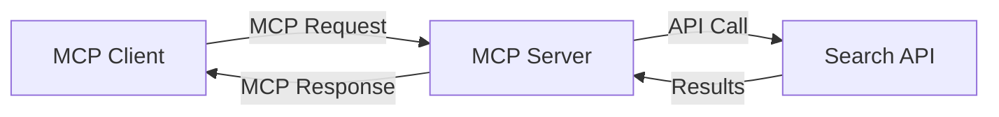
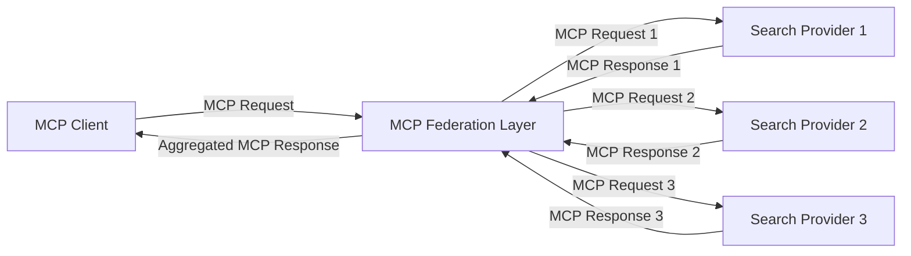
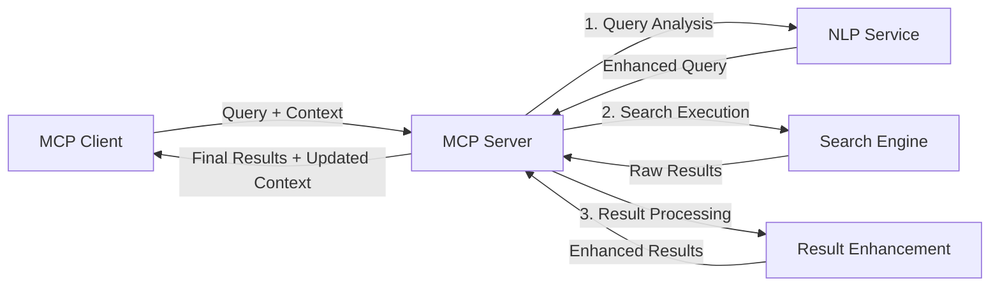

<!--
CO_OP_TRANSLATOR_METADATA:
{
  "original_hash": "eb12652eb7bd17f2193b835a344425c6",
  "translation_date": "2025-06-26T13:39:29+00:00",
  "source_file": "05-AdvancedTopics/mcp-realtimesearch/README.md",
  "language_code": "fa"
}
-->
## سلب مسئولیت نمونه‌های کد

> **توجه مهم**: نمونه‌های کد زیر نشان‌دهنده‌ی ادغام پروتکل مدل کانتکست (MCP) با قابلیت جستجوی وب هستند. در حالی که این نمونه‌ها الگوها و ساختارهای SDKهای رسمی MCP را دنبال می‌کنند، برای اهداف آموزشی ساده‌سازی شده‌اند.
> 
> این نمونه‌ها موارد زیر را نشان می‌دهند:
> 
> 1. **پیاده‌سازی پایتون**: پیاده‌سازی سرور FastMCP که ابزار جستجوی وب ارائه می‌دهد و به یک API جستجوی خارجی متصل می‌شود. این مثال مدیریت صحیح طول عمر، کنترل کانتکست و پیاده‌سازی ابزار را مطابق با الگوهای [SDK رسمی پایتون MCP](https://github.com/modelcontextprotocol/python-sdk) نشان می‌دهد. سرور از انتقال HTTP قابل استریم که جایگزین انتقال SSE قدیمی برای استفاده‌های تولیدی شده است، استفاده می‌کند.
> 
> 2. **پیاده‌سازی جاوااسکریپت**: پیاده‌سازی TypeScript/JavaScript با استفاده از الگوی FastMCP از [SDK رسمی TypeScript MCP](https://github.com/modelcontextprotocol/typescript-sdk) برای ساخت سرور جستجو با تعریف ابزارهای مناسب و اتصال کلاینت‌ها. این پیاده‌سازی جدیدترین الگوهای مدیریت نشست و حفظ کانتکست را دنبال می‌کند.
> 
> این نمونه‌ها برای استفاده در محیط تولید به کنترل خطاهای بیشتر، احراز هویت و کدهای خاص ادغام API نیاز دارند. نقاط انتهایی API جستجو نشان داده شده (`https://api.search-service.example/search`) فقط نمونه هستند و باید با نقاط انتهایی واقعی سرویس‌های جستجو جایگزین شوند.
> 
> برای جزئیات کامل پیاده‌سازی و روش‌های به‌روز، لطفاً به [مشخصات رسمی MCP](https://spec.modelcontextprotocol.io/) و مستندات SDK مراجعه کنید.

## مفاهیم اصلی

### چارچوب پروتکل مدل کانتکست (MCP)

در پایه، پروتکل مدل کانتکست روشی استاندارد برای تبادل کانتکست بین مدل‌های هوش مصنوعی، برنامه‌ها و سرویس‌ها فراهم می‌کند. در جستجوی وب به‌صورت بلادرنگ، این چارچوب برای ایجاد تجربه‌های جستجوی چندمرحله‌ای منسجم ضروری است. اجزای کلیدی عبارتند از:

1. **معماری کلاینت-سرور**: MCP جداسازی واضحی بین کلاینت‌های جستجو (درخواست‌کننده‌ها) و سرورهای جستجو (ارائه‌دهنده‌ها) برقرار می‌کند که امکان مدل‌های استقرار منعطف را فراهم می‌سازد.

2. **ارتباط JSON-RPC**: این پروتکل از JSON-RPC برای تبادل پیام استفاده می‌کند که با فناوری‌های وب سازگار است و پیاده‌سازی آن در پلتفرم‌های مختلف آسان است.

3. **مدیریت کانتکست**: MCP روش‌های ساختاریافته‌ای برای حفظ، به‌روزرسانی و استفاده از کانتکست جستجو در چند تعامل تعریف می‌کند.

4. **تعاریف ابزار**: قابلیت‌های جستجو به صورت ابزارهای استاندارد شده با پارامترها و مقادیر بازگشتی مشخص ارائه می‌شوند.

5. **پشتیبانی از استریمینگ**: این پروتکل از ارسال نتایج به صورت استریم پشتیبانی می‌کند که برای جستجوی بلادرنگ که نتایج به تدریج می‌رسند ضروری است.

### الگوهای ادغام جستجوی وب

هنگام ادغام MCP با جستجوی وب، چند الگو شکل می‌گیرند:

#### 1. ادغام مستقیم ارائه‌دهنده جستجو

در این الگو، سرور MCP مستقیماً با یک یا چند API جستجو ارتباط برقرار می‌کند، درخواست‌های MCP را به تماس‌های مخصوص API ترجمه می‌کند و نتایج را به صورت پاسخ‌های MCP قالب‌بندی می‌کند.

#### 2. جستجوی فدرال با حفظ کانتکست

این الگو پرس‌وجوهای جستجو را در میان چند ارائه‌دهنده جستجو سازگار با MCP توزیع می‌کند که هرکدام ممکن است در انواع مختلف محتوا یا قابلیت‌های جستجو تخصص داشته باشند، در حالی که یک کانتکست یکپارچه حفظ می‌شود.

#### 3. زنجیره جستجو با تقویت کانتکست

در این الگو، فرآیند جستجو به چند مرحله تقسیم می‌شود و کانتکست در هر مرحله غنی‌سازی می‌شود که در نتیجه نتایج به تدریج مرتبط‌تر می‌شوند.

### اجزای کانتکست جستجو

در جستجوی وب مبتنی بر MCP، کانتکست معمولاً شامل موارد زیر است:

- **تاریخچه پرس‌وجو**: پرس‌وجوهای قبلی در جلسه جستجو
- **ترجیحات کاربر**: زبان، منطقه، تنظیمات جستجوی ایمن
- **تاریخچه تعامل**: نتایجی که کلیک شده‌اند، مدت زمان صرف شده روی نتایج
- **پارامترهای جستجو**: فیلترها، ترتیب مرتب‌سازی و سایر اصلاح‌کننده‌های جستجو
- **دانش حوزه‌ای**: کانتکست مربوط به موضوع خاص مرتبط با جستجو
- **کانتکست زمانی**: عوامل مرتبط با زمان
- **ترجیحات منبع**: منابع اطلاعاتی معتبر یا ترجیح داده شده

## موارد استفاده و کاربردها

### پژوهش و گردآوری اطلاعات

MCP جریان‌های کاری پژوهشی را با موارد زیر بهبود می‌بخشد:

- حفظ کانتکست پژوهش در جلسات جستجو
- امکان پرس‌وجوهای پیچیده‌تر و مرتبط‌تر از نظر کانتکست
- پشتیبانی از فدراسیون جستجو از چند منبع
- تسهیل استخراج دانش از نتایج جستجو

### پایش اخبار و روندهای بلادرنگ

جستجوی مبتنی بر MCP مزایایی برای پایش اخبار دارد:

- کشف نزدیک به بلادرنگ داستان‌های خبری نوظهور
- فیلتر کانتکست‌محور اطلاعات مرتبط
- ردیابی موضوعات و موجودیت‌ها در منابع متعدد
- هشدارهای خبری شخصی‌سازی شده بر اساس کانتکست کاربر

### مرور و پژوهش تقویت‌شده با هوش مصنوعی

MCP امکانات جدیدی برای مرور تقویت‌شده با هوش مصنوعی فراهم می‌کند:

- پیشنهادات جستجوی کانتکست‌محور بر اساس فعالیت جاری مرورگر
- ادغام بدون درز جستجوی وب با دستیاران مبتنی بر مدل‌های زبانی بزرگ (LLM)
- پالایش چندمرحله‌ای جستجو با حفظ کانتکست
- بهبود بررسی صحت و تأیید اطلاعات

## روندها و نوآوری‌های آینده

### تکامل MCP در جستجوی وب

در آینده، انتظار می‌رود MCP به موارد زیر بپردازد:

- **جستجوی چندرسانه‌ای**: ادغام جستجوی متن، تصویر، صدا و ویدئو با حفظ کانتکست
- **جستجوی غیرمتمرکز**: پشتیبانی از اکوسیستم‌های جستجوی توزیع‌شده و فدرال
- **حریم خصوصی در جستجو**: مکانیزم‌های حفظ حریم خصوصی آگاه به کانتکست
- **درک پرس‌وجو**: تحلیل معنایی عمیق پرس‌وجوهای زبان طبیعی

### پیشرفت‌های احتمالی در فناوری

فناوری‌های نوظهوری که آینده جستجوی MCP را شکل می‌دهند:

1. **معماری‌های جستجوی عصبی**: سیستم‌های جستجو مبتنی بر جاسازی که برای MCP بهینه شده‌اند
2. **کانتکست جستجوی شخصی‌سازی شده**: یادگیری الگوهای جستجوی کاربران به مرور زمان
3. **ادغام گراف دانش**: جستجوی کانتکست‌محور با کمک گراف‌های دانش حوزه‌ای
4. **کانتکست میان‌مدلی**: حفظ کانتکست در میان حالت‌های مختلف جستجو

## تمرین‌های عملی

### تمرین ۱: راه‌اندازی یک خط لوله جستجوی MCP پایه

در این تمرین، شما یاد می‌گیرید چگونه:
- یک محیط جستجوی MCP پایه پیکربندی کنید
- کنترل‌کننده‌های کانتکست برای جستجوی وب پیاده‌سازی کنید
- حفظ کانتکست را در طول تکرارهای جستجو تست و اعتبارسنجی کنید

### تمرین ۲: ساخت دستیار پژوهش با جستجوی MCP

یک برنامه کامل بسازید که:
- سوالات پژوهشی زبان طبیعی را پردازش کند
- جستجوی وب آگاه به کانتکست انجام دهد
- اطلاعات را از منابع متعدد ترکیب کند
- یافته‌های پژوهشی سازمان‌یافته ارائه دهد

### تمرین ۳: پیاده‌سازی فدراسیون جستجوی چندمنبع با MCP

تمرین پیشرفته شامل:
- ارسال پرس‌وجوهای آگاه به کانتکست به چند موتور جستجو
- رتبه‌بندی و تجمیع نتایج
- حذف تکراری‌های کانتکست‌محور نتایج جستجو
- مدیریت متادیتای خاص منبع

## منابع اضافی

- [مشخصات پروتکل مدل کانتکست](https://spec.modelcontextprotocol.io/) - مشخصات رسمی MCP و مستندات دقیق پروتکل
- [مستندات پروتکل مدل کانتکست](https://modelcontextprotocol.io/) - آموزش‌ها و راهنمای پیاده‌سازی جامع
- [SDK پایتون MCP](https://github.com/modelcontextprotocol/python-sdk) - پیاده‌سازی رسمی پروتکل MCP به زبان پایتون
- [SDK تایپ‌اسکریپت MCP](https://github.com/modelcontextprotocol/typescript-sdk) - پیاده‌سازی رسمی پروتکل MCP به زبان تایپ‌اسکریپت
- [سرورهای مرجع MCP](https://github.com/modelcontextprotocol/servers) - پیاده‌سازی‌های مرجع سرورهای MCP
- [مستندات Bing Web Search API](https://learn.microsoft.com/en-us/bing/search-apis/bing-web-search/overview) - API جستجوی وب مایکروسافت
- [Google Custom Search JSON API](https://developers.google.com/custom-search/v1/overview) - موتور جستجوی برنامه‌پذیر گوگل
- [مستندات SerpAPI](https://serpapi.com/search-api) - API صفحه نتایج موتور جستجو
- [مستندات Meilisearch](https://www.meilisearch.com/docs) - موتور جستجوی متن‌باز
- [مستندات Elasticsearch](https://www.elastic.co/guide/index.html) - موتور جستجو و تحلیل توزیع‌شده
- [مستندات LangChain](https://python.langchain.com/docs/get_started/introduction) - ساخت برنامه با مدل‌های زبانی بزرگ

## نتایج یادگیری

با اتمام این ماژول، شما قادر خواهید بود:

- اصول جستجوی وب بلادرنگ و چالش‌های آن را درک کنید
- توضیح دهید چگونه پروتکل مدل کانتکست (MCP) قابلیت‌های جستجوی وب بلادرنگ را بهبود می‌بخشد
- راه‌حل‌های جستجو مبتنی بر MCP را با استفاده از فریم‌ورک‌ها و APIهای محبوب پیاده‌سازی کنید
- معماری‌های جستجوی مقیاس‌پذیر و با عملکرد بالا را با MCP طراحی و پیاده‌سازی کنید
- مفاهیم MCP را در موارد استفاده مختلف از جمله جستجوی معنایی، دستیار پژوهش و مرور تقویت‌شده با هوش مصنوعی به کار ببرید
- روندهای نوظهور و نوآوری‌های آینده در فناوری‌های جستجوی مبتنی بر MCP را ارزیابی کنید

### ملاحظات اعتماد و ایمنی

هنگام پیاده‌سازی راه‌حل‌های جستجوی وب مبتنی بر MCP، این اصول مهم از مشخصات MCP را به خاطر بسپارید:

1. **رضایت و کنترل کاربر**: کاربران باید به‌صورت صریح رضایت دهند و همه دسترسی‌ها و عملیات داده را درک کنند. این موضوع به ویژه برای پیاده‌سازی‌های جستجوی وب که ممکن است به منابع داده خارجی دسترسی داشته باشند اهمیت دارد.

2. **حریم خصوصی داده‌ها**: اطمینان حاصل کنید که پرس‌وجوها و نتایج جستجو به‌طور مناسب مدیریت می‌شوند، به‌خصوص زمانی که ممکن است شامل اطلاعات حساس باشند. کنترل‌های دسترسی مناسب برای حفاظت از داده‌های کاربران پیاده‌سازی کنید.

3. **ایمنی ابزارها**: مجوزدهی و اعتبارسنجی مناسب برای ابزارهای جستجو پیاده‌سازی کنید، زیرا آن‌ها می‌توانند از طریق اجرای کد دلخواه ریسک‌های امنیتی ایجاد کنند. توصیف رفتار ابزارها باید مورد اعتماد تلقی نشود مگر اینکه از سرور معتبر دریافت شده باشد.

4. **مستندسازی شفاف**: مستندات واضحی درباره قابلیت‌ها، محدودیت‌ها و ملاحظات امنیتی پیاده‌سازی جستجوی مبتنی بر MCP ارائه دهید، مطابق با راهنمای پیاده‌سازی مشخصات MCP.

5. **روندهای رضایت قوی**: روندهای رضایت و مجوزدهی قوی بسازید که به‌روشنی توضیح دهند هر ابزار چه کاری انجام می‌دهد قبل از مجوزدهی استفاده از آن، به‌ویژه برای ابزارهایی که با منابع وب خارجی تعامل دارند.

برای جزئیات کامل درباره امنیت و ملاحظات اعتماد MCP، به [مستندات رسمی](https://modelcontextprotocol.io/specification/2025-03-26#security-and-trust-%26-safety) مراجعه کنید.

## مرحله بعدی

- [5.11 احراز هویت Entra ID برای سرورهای پروتکل مدل کانتکست](../mcp-security-entra/README.md)

**سلب مسئولیت**:  
این سند با استفاده از سرویس ترجمه هوش مصنوعی [Co-op Translator](https://github.com/Azure/co-op-translator) ترجمه شده است. در حالی که ما در تلاش برای دقت هستیم، لطفاً توجه داشته باشید که ترجمه‌های خودکار ممکن است حاوی اشتباهات یا نادرستی‌هایی باشند. سند اصلی به زبان مادری آن باید به عنوان منبع معتبر در نظر گرفته شود. برای اطلاعات حیاتی، توصیه می‌شود از ترجمه حرفه‌ای انسانی استفاده شود. ما مسئول هیچ گونه سوءتفاهم یا تفسیر نادرستی که ناشی از استفاده از این ترجمه باشد، نیستیم.