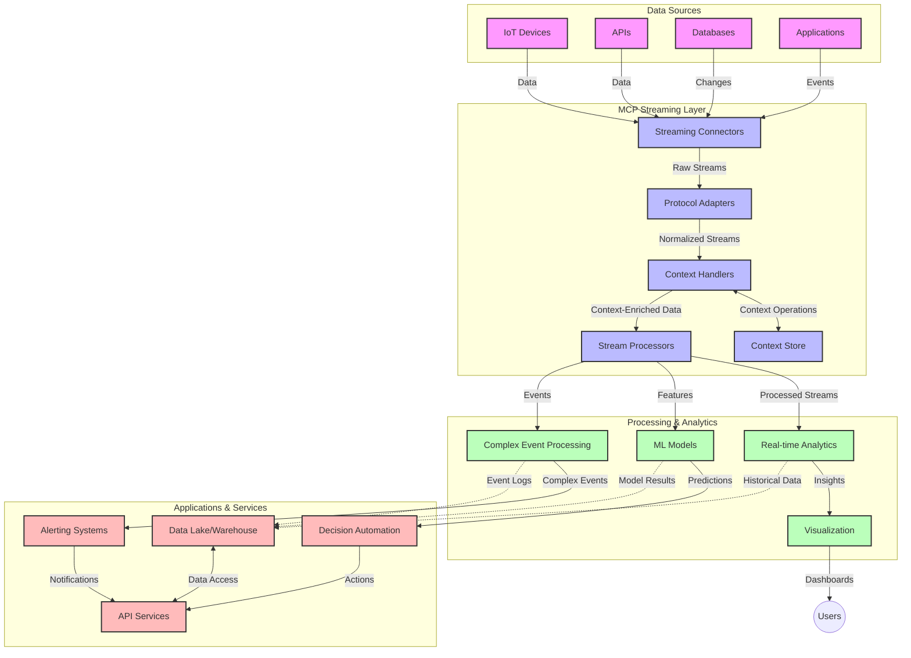

<!--
CO_OP_TRANSLATOR_METADATA:
{
  "original_hash": "b41174ac781ebf228b2043cbdfc09105",
  "translation_date": "2025-06-12T00:15:51+00:00",
  "source_file": "05-AdvancedTopics/mcp-realtimestreaming/README.md",
  "language_code": "fa"
}
-->
# پروتکل مدل کانتکست برای جریان داده‌های بلادرنگ

## مرور کلی

جریان داده‌های بلادرنگ در دنیای امروز که مبتنی بر داده است، به یک ضرورت تبدیل شده است؛ جایی که کسب‌وکارها و برنامه‌ها نیاز دارند به اطلاعات به‌صورت فوری دسترسی داشته باشند تا تصمیمات به‌موقع اتخاذ کنند. پروتکل مدل کانتکست (MCP) گامی مهم در بهینه‌سازی فرآیندهای جریان بلادرنگ است که کارایی پردازش داده، حفظ انسجام کانتکست و بهبود عملکرد کلی سیستم را ارتقا می‌دهد.

این ماژول بررسی می‌کند که چگونه MCP جریان داده‌های بلادرنگ را با ارائه رویکردی استاندارد برای مدیریت کانتکست در مدل‌های هوش مصنوعی، پلتفرم‌های جریان داده و برنامه‌ها متحول می‌کند.

## مقدمه‌ای بر جریان داده‌های بلادرنگ

جریان داده‌های بلادرنگ یک الگوی فناوری است که امکان انتقال، پردازش و تحلیل مداوم داده‌ها را همزمان با تولید آن‌ها فراهم می‌کند و به سیستم‌ها اجازه می‌دهد به اطلاعات جدید به سرعت واکنش نشان دهند. برخلاف پردازش دسته‌ای سنتی که روی مجموعه داده‌های ایستا عمل می‌کند، جریان داده‌ها به‌صورت پیوسته و در حال حرکت پردازش می‌شود و با کمترین تأخیر بینش‌ها و اقدامات را ارائه می‌دهد.

### مفاهیم کلیدی جریان داده‌های بلادرنگ:

- **جریان پیوسته داده**: داده‌ها به‌صورت جریان مداوم و بی‌پایان از رویدادها یا رکوردها پردازش می‌شوند.
- **پردازش با تأخیر کم**: سیستم‌ها به‌گونه‌ای طراحی شده‌اند که زمان بین تولید داده و پردازش آن را به حداقل برسانند.
- **مقیاس‌پذیری**: معماری‌های جریان باید بتوانند حجم و سرعت متغیر داده‌ها را مدیریت کنند.
- **تحمل خطا**: سیستم‌ها باید در برابر خطاها مقاوم باشند تا جریان داده‌ها بدون وقفه حفظ شود.
- **پردازش حالت‌دار**: حفظ کانتکست در طول رویدادها برای تحلیل معنادار ضروری است.

### پروتکل مدل کانتکست و جریان بلادرنگ

پروتکل مدل کانتکست (MCP) به چند چالش حیاتی در محیط‌های جریان بلادرنگ پاسخ می‌دهد:

1. **تداوم کانتکست**: MCP استانداردی برای حفظ کانتکست در اجزای توزیع‌شده جریان فراهم می‌کند و تضمین می‌کند که مدل‌های هوش مصنوعی و گره‌های پردازشی به کانتکست تاریخی و محیطی مرتبط دسترسی داشته باشند.

2. **مدیریت بهینه حالت**: با ارائه مکانیزم‌های ساختاریافته برای انتقال کانتکست، MCP بار مدیریت حالت در خطوط جریان را کاهش می‌دهد.

3. **تعامل‌پذیری**: MCP زبان مشترکی برای اشتراک‌گذاری کانتکست بین فناوری‌های مختلف جریان و مدل‌های هوش مصنوعی ایجاد می‌کند که امکان معماری‌های منعطف و قابل توسعه‌تر را فراهم می‌آورد.

4. **کانتکست بهینه‌شده برای جریان**: پیاده‌سازی‌های MCP می‌توانند اولویت‌بندی کنند کدام عناصر کانتکست برای تصمیم‌گیری بلادرنگ اهمیت بیشتری دارند و بهینه‌سازی عملکرد و دقت را تضمین کنند.

5. **پردازش تطبیقی**: با مدیریت درست کانتکست از طریق MCP، سیستم‌های جریان می‌توانند پردازش را بر اساس شرایط و الگوهای در حال تغییر داده‌ها به‌صورت پویا تنظیم کنند.

در برنامه‌های مدرن، از شبکه‌های حسگر IoT گرفته تا پلتفرم‌های معاملات مالی، ادغام MCP با فناوری‌های جریان داده امکان پردازش هوشمندتر و آگاه از کانتکست را فراهم می‌کند که می‌تواند به موقع به شرایط پیچیده و در حال تحول پاسخ دهد.

## اهداف یادگیری

در پایان این درس، شما قادر خواهید بود:

- اصول جریان داده‌های بلادرنگ و چالش‌های آن را درک کنید
- توضیح دهید چگونه پروتکل مدل کانتکست (MCP) جریان داده‌های بلادرنگ را بهبود می‌بخشد
- راه‌حل‌های جریان مبتنی بر MCP را با استفاده از چارچوب‌های محبوبی مانند Kafka و Pulsar پیاده‌سازی کنید
- معماری‌های جریان مقاوم در برابر خطا و با عملکرد بالا را با MCP طراحی و پیاده‌سازی کنید
- مفاهیم MCP را در موارد کاربردی IoT، معاملات مالی و تحلیل‌های مبتنی بر هوش مصنوعی به کار ببرید
- روندهای نوظهور و نوآوری‌های آینده در فناوری‌های جریان مبتنی بر MCP را ارزیابی کنید

### تعریف و اهمیت

جریان داده‌های بلادرنگ شامل تولید، پردازش و تحویل مداوم داده‌ها با تأخیر بسیار کم است. برخلاف پردازش دسته‌ای که داده‌ها به‌صورت گروهی جمع‌آوری و پردازش می‌شوند، داده‌های جریان به‌صورت تدریجی و همزمان با رسیدن پردازش می‌شوند و امکان دریافت بینش‌ها و انجام اقدامات فوری را فراهم می‌کنند.

ویژگی‌های کلیدی جریان داده‌های بلادرنگ عبارتند از:

- **تأخیر کم**: پردازش و تحلیل داده‌ها در بازه میلی‌ثانیه تا ثانیه
- **جریان پیوسته**: جریان بدون وقفه داده‌ها از منابع مختلف
- **پردازش فوری**: تحلیل داده‌ها در لحظه رسیدن به جای پردازش دسته‌ای
- **معماری مبتنی بر رویداد**: واکنش به رویدادها در زمان وقوع

### چالش‌ها در جریان داده‌های سنتی

روش‌های سنتی جریان داده با محدودیت‌های متعددی مواجه‌اند:

1. **از دست دادن کانتکست**: دشواری در حفظ کانتکست در سیستم‌های توزیع‌شده
2. **مشکلات مقیاس‌پذیری**: چالش در مقیاس‌گذاری برای مدیریت حجم و سرعت بالای داده‌ها
3. **پیچیدگی یکپارچه‌سازی**: مشکلات تعامل بین سیستم‌های مختلف
4. **مدیریت تأخیر**: تعادل بین توان عملیاتی و زمان پردازش
5. **ثبات داده‌ها**: اطمینان از دقت و کامل بودن داده‌ها در طول جریان

## آشنایی با پروتکل مدل کانتکست (MCP)

### MCP چیست؟

پروتکل مدل کانتکست (MCP) یک پروتکل ارتباطی استاندارد است که برای تسهیل تعامل کارآمد بین مدل‌های هوش مصنوعی و برنامه‌ها طراحی شده است. در زمینه جریان داده‌های بلادرنگ، MCP چارچوبی برای:

- حفظ کانتکست در سراسر خط داده
- استانداردسازی قالب‌های تبادل داده
- بهینه‌سازی انتقال مجموعه داده‌های بزرگ
- بهبود ارتباط مدل به مدل و مدل به برنامه فراهم می‌کند

### اجزاء اصلی و معماری

معماری MCP برای جریان بلادرنگ شامل چند جزء کلیدی است:

1. **مدیران کانتکست**: مدیریت و حفظ اطلاعات کانتکست در سراسر خط جریان
2. **پردازشگرهای جریان**: پردازش جریان داده‌های ورودی با استفاده از تکنیک‌های آگاه از کانتکست
3. **مبدل‌های پروتکل**: تبدیل بین پروتکل‌های مختلف جریان در حالی که کانتکست حفظ می‌شود
4. **ذخیره‌ساز کانتکست**: ذخیره و بازیابی بهینه اطلاعات کانتکست
5. **اتصالات جریان**: اتصال به پلتفرم‌های مختلف جریان (Kafka، Pulsar، Kinesis و غیره)



### چگونه MCP پردازش داده‌های بلادرنگ را بهبود می‌بخشد

MCP به چالش‌های جریان سنتی پاسخ می‌دهد از طریق:

- **یکپارچگی کانتکست**: حفظ روابط بین نقاط داده در سراسر خط جریان
- **انتقال بهینه**: کاهش افزونگی در تبادل داده با مدیریت هوشمند کانتکست
- **رابط‌های استاندارد**: ارائه APIهای یکسان برای اجزای جریان
- **کاهش تأخیر**: کمینه کردن بار پردازشی با مدیریت کارآمد کانتکست
- **افزایش مقیاس‌پذیری**: پشتیبانی از مقیاس‌گذاری افقی در حالی که کانتکست حفظ می‌شود

## یکپارچه‌سازی و پیاده‌سازی

سیستم‌های جریان داده‌های بلادرنگ نیازمند طراحی و پیاده‌سازی معماری دقیق برای حفظ همزمان عملکرد و انسجام کانتکست هستند. پروتکل مدل کانتکست رویکردی استاندارد برای ادغام مدل‌های هوش مصنوعی و فناوری‌های جریان ارائه می‌دهد که امکان خطوط پردازش پیشرفته و آگاه از کانتکست را فراهم می‌کند.

### مرور کلی یکپارچه‌سازی MCP در معماری‌های جریان

پیاده‌سازی MCP در محیط‌های جریان بلادرنگ شامل نکات کلیدی زیر است:

1. **سریال‌سازی و انتقال کانتکست**: MCP مکانیزم‌های مؤثری برای رمزگذاری اطلاعات کانتکست در بسته‌های داده جریان ارائه می‌دهد تا کانتکست ضروری در سراسر خط پردازش دنبال شود. این شامل قالب‌های سریال‌سازی استاندارد بهینه‌شده برای انتقال جریان است.

2. **پردازش حالت‌دار جریان**: MCP پردازش حالت‌دار هوشمندانه‌تری را با حفظ نمایش کانتکست سازگار در گره‌های پردازشی ممکن می‌سازد. این موضوع به‌ویژه در معماری‌های جریان توزیع‌شده که مدیریت حالت چالش‌برانگیز است، اهمیت دارد.

3. **زمان رویداد در مقابل زمان پردازش**: پیاده‌سازی‌های MCP در سیستم‌های جریان باید چالش معمول تمایز بین زمان وقوع رویداد و زمان پردازش آن را حل کنند. این پروتکل می‌تواند کانتکست زمانی را که معنای زمان رویداد را حفظ می‌کند، در بر گیرد.

4. **مدیریت فشار معکوس**: با استانداردسازی مدیریت کانتکست، MCP به مدیریت فشار معکوس در سیستم‌های جریان کمک می‌کند و امکان ارتباط مؤثر توان پردازشی اجزا و تنظیم جریان را فراهم می‌آورد.

5. **پنجره‌بندی و تجمیع کانتکست**: MCP عملیات پنجره‌بندی پیشرفته‌تری را با ارائه نمایش‌های ساختاریافته از کانتکست زمانی و رابطه‌ای تسهیل می‌کند که امکان تجمیع معنادارتر در جریان رویدادها را فراهم می‌سازد.

6. **پردازش دقیقاً یک بار**: در سیستم‌های جریان که نیاز به معنای دقیقاً یک بار دارند، MCP می‌تواند متادیتای پردازش را در بر گیرد تا به ردیابی و تأیید وضعیت پردازش در اجزای توزیع‌شده کمک کند.

پیاده‌سازی MCP در فناوری‌های مختلف جریان، رویکردی یکپارچه برای مدیریت کانتکست ایجاد می‌کند که نیاز به کدهای یکپارچه‌سازی سفارشی را کاهش می‌دهد و توانایی سیستم برای حفظ کانتکست معنادار در طول جریان داده‌ها را افزایش می‌دهد.

### MCP در چارچوب‌های مختلف جریان داده

این نمونه‌ها بر اساس مشخصات فعلی MCP که بر پروتکل JSON-RPC با مکانیزم‌های انتقال متمایز تمرکز دارد، ارائه شده‌اند. کد نشان می‌دهد چگونه می‌توان انتقال‌های سفارشی ایجاد کرد که پلتفرم‌های جریان مانند Kafka و Pulsar را در حالی که سازگاری کامل با پروتکل MCP حفظ می‌شود، ادغام کنند.

این نمونه‌ها طراحی شده‌اند تا نشان دهند چگونه پلتفرم‌های جریان می‌توانند با MCP ادغام شوند تا پردازش داده‌های بلادرنگ را ارائه دهند در حالی که آگاهی کانتکست که محور MCP است حفظ می‌شود. این رویکرد تضمین می‌کند نمونه کدها به‌طور دقیق وضعیت فعلی مشخصات MCP تا ژوئن ۲۰۲۵ را منعکس کنند.

MCP می‌تواند با چارچوب‌های جریان محبوب از جمله:

#### ادغام Apache Kafka

```python
import asyncio
import json
from typing import Dict, Any, Optional
from confluent_kafka import Consumer, Producer, KafkaError
from mcp.client import Client, ClientCapabilities
from mcp.core.message import JsonRpcMessage
from mcp.core.transports import Transport

# Custom transport class to bridge MCP with Kafka
class KafkaMCPTransport(Transport):
    def __init__(self, bootstrap_servers: str, input_topic: str, output_topic: str):
        self.bootstrap_servers = bootstrap_servers
        self.input_topic = input_topic
        self.output_topic = output_topic
        self.producer = Producer({'bootstrap.servers': bootstrap_servers})
        self.consumer = Consumer({
            'bootstrap.servers': bootstrap_servers,
            'group.id': 'mcp-client-group',
            'auto.offset.reset': 'earliest'
        })
        self.message_queue = asyncio.Queue()
        self.running = False
        self.consumer_task = None
        
    async def connect(self):
        """Connect to Kafka and start consuming messages"""
        self.consumer.subscribe([self.input_topic])
        self.running = True
        self.consumer_task = asyncio.create_task(self._consume_messages())
        return self
        
    async def _consume_messages(self):
        """Background task to consume messages from Kafka and queue them for processing"""
        while self.running:
            try:
                msg = self.consumer.poll(1.0)
                if msg is None:
                    await asyncio.sleep(0.1)
                    continue
                
                if msg.error():
                    if msg.error().code() == KafkaError._PARTITION_EOF:
                        continue
                    print(f"Consumer error: {msg.error()}")
                    continue
                
                # Parse the message value as JSON-RPC
                try:
                    message_str = msg.value().decode('utf-8')
                    message_data = json.loads(message_str)
                    mcp_message = JsonRpcMessage.from_dict(message_data)
                    await self.message_queue.put(mcp_message)
                except Exception as e:
                    print(f"Error parsing message: {e}")
            except Exception as e:
                print(f"Error in consumer loop: {e}")
                await asyncio.sleep(1)
    
    async def read(self) -> Optional[JsonRpcMessage]:
        """Read the next message from the queue"""
        try:
            message = await self.message_queue.get()
            return message
        except Exception as e:
            print(f"Error reading message: {e}")
            return None
    
    async def write(self, message: JsonRpcMessage) -> None:
        """Write a message to the Kafka output topic"""
        try:
            message_json = json.dumps(message.to_dict())
            self.producer.produce(
                self.output_topic,
                message_json.encode('utf-8'),
                callback=self._delivery_report
            )
            self.producer.poll(0)  # Trigger callbacks
        except Exception as e:
            print(f"Error writing message: {e}")
    
    def _delivery_report(self, err, msg):
        """Kafka producer delivery callback"""
        if err is not None:
            print(f'Message delivery failed: {err}')
        else:
            print(f'Message delivered to {msg.topic()} [{msg.partition()}]')
    
    async def close(self) -> None:
        """Close the transport"""
        self.running = False
        if self.consumer_task:
            self.consumer_task.cancel()
            try:
                await self.consumer_task
            except asyncio.CancelledError:
                pass
        self.consumer.close()
        self.producer.flush()

# Example usage of the Kafka MCP transport
async def kafka_mcp_example():
    # Create MCP client with Kafka transport
    client = Client(
        {"name": "kafka-mcp-client", "version": "1.0.0"},
        ClientCapabilities({})
    )
    
    # Create and connect the Kafka transport
    transport = KafkaMCPTransport(
        bootstrap_servers="localhost:9092",
        input_topic="mcp-responses",
        output_topic="mcp-requests"
    )
    
    await client.connect(transport)
    
    try:
        # Initialize the MCP session
        await client.initialize()
        
        # Example of executing a tool via MCP
        response = await client.execute_tool(
            "process_data",
            {
                "data": "sample data",
                "metadata": {
                    "source": "sensor-1",
                    "timestamp": "2025-06-12T10:30:00Z"
                }
            }
        )
        
        print(f"Tool execution response: {response}")
        
        # Clean shutdown
        await client.shutdown()
    finally:
        await transport.close()

# Run the example
if __name__ == "__main__":
    asyncio.run(kafka_mcp_example())
```

#### پیاده‌سازی Apache Pulsar

```python
import asyncio
import json
import pulsar
from typing import Dict, Any, Optional
from mcp.core.message import JsonRpcMessage
from mcp.core.transports import Transport
from mcp.server import Server, ServerOptions
from mcp.server.tools import Tool, ToolExecutionContext, ToolMetadata

# Create a custom MCP transport that uses Pulsar
class PulsarMCPTransport(Transport):
    def __init__(self, service_url: str, request_topic: str, response_topic: str):
        self.service_url = service_url
        self.request_topic = request_topic
        self.response_topic = response_topic
        self.client = pulsar.Client(service_url)
        self.producer = self.client.create_producer(response_topic)
        self.consumer = self.client.subscribe(
            request_topic,
            "mcp-server-subscription",
            consumer_type=pulsar.ConsumerType.Shared
        )
        self.message_queue = asyncio.Queue()
        self.running = False
        self.consumer_task = None
    
    async def connect(self):
        """Connect to Pulsar and start consuming messages"""
        self.running = True
        self.consumer_task = asyncio.create_task(self._consume_messages())
        return self
    
    async def _consume_messages(self):
        """Background task to consume messages from Pulsar and queue them for processing"""
        while self.running:
            try:
                # Non-blocking receive with timeout
                msg = self.consumer.receive(timeout_millis=500)
                
                # Process the message
                try:
                    message_str = msg.data().decode('utf-8')
                    message_data = json.loads(message_str)
                    mcp_message = JsonRpcMessage.from_dict(message_data)
                    await self.message_queue.put(mcp_message)
                    
                    # Acknowledge the message
                    self.consumer.acknowledge(msg)
                except Exception as e:
                    print(f"Error processing message: {e}")
                    # Negative acknowledge if there was an error
                    self.consumer.negative_acknowledge(msg)
            except Exception as e:
                # Handle timeout or other exceptions
                await asyncio.sleep(0.1)
    
    async def read(self) -> Optional[JsonRpcMessage]:
        """Read the next message from the queue"""
        try:
            message = await self.message_queue.get()
            return message
        except Exception as e:
            print(f"Error reading message: {e}")
            return None
    
    async def write(self, message: JsonRpcMessage) -> None:
        """Write a message to the Pulsar output topic"""
        try:
            message_json = json.dumps(message.to_dict())
            self.producer.send(message_json.encode('utf-8'))
        except Exception as e:
            print(f"Error writing message: {e}")
    
    async def close(self) -> None:
        """Close the transport"""
        self.running = False
        if self.consumer_task:
            self.consumer_task.cancel()
            try:
                await self.consumer_task
            except asyncio.CancelledError:
                pass
        self.consumer.close()
        self.producer.close()
        self.client.close()

# Define a sample MCP tool that processes streaming data
@Tool(
    name="process_streaming_data",
    description="Process streaming data with context preservation",
    metadata=ToolMetadata(
        required_capabilities=["streaming"]
    )
)
async def process_streaming_data(
    ctx: ToolExecutionContext,
    data: str,
    source: str,
    priority: str = "medium"
) -> Dict[str, Any]:
    """
    Process streaming data while preserving context
    
    Args:
        ctx: Tool execution context
        data: The data to process
        source: The source of the data
        priority: Priority level (low, medium, high)
        
    Returns:
        Dict containing processed results and context information
    """
    # Example processing that leverages MCP context
    print(f"Processing data from {source} with priority {priority}")
    
    # Access conversation context from MCP
    conversation_id = ctx.conversation_id if hasattr(ctx, 'conversation_id') else "unknown"
    
    # Return results with enhanced context
    return {
        "processed_data": f"Processed: {data}",
        "context": {
            "conversation_id": conversation_id,
            "source": source,
            "priority": priority,
            "processing_timestamp": ctx.get_current_time_iso()
        }
    }

# Example MCP server implementation using Pulsar transport
async def run_mcp_server_with_pulsar():
    # Create MCP server
    server = Server(
        {"name": "pulsar-mcp-server", "version": "1.0.0"},
        ServerOptions(
            capabilities={"streaming": True}
        )
    )
    
    # Register our tool
    server.register_tool(process_streaming_data)
    
    # Create and connect Pulsar transport
    transport = PulsarMCPTransport(
        service_url="pulsar://localhost:6650",
        request_topic="mcp-requests",
        response_topic="mcp-responses"
    )
    
    try:
        # Start the server with the Pulsar transport
        await server.run(transport)
    finally:
        await transport.close()

# Run the server
if __name__ == "__main__":
    asyncio.run(run_mcp_server_with_pulsar())
```

### بهترین روش‌ها برای استقرار

هنگام پیاده‌سازی MCP برای جریان بلادرنگ:

1. **طراحی برای تحمل خطا**:
   - پیاده‌سازی مدیریت خطای مناسب
   - استفاده از صف‌های پیام‌های مرده برای پیام‌های ناموفق
   - طراحی پردازشگرهای ایدمپوته

2. **بهینه‌سازی عملکرد**:
   - تنظیم اندازه‌های بافر مناسب
   - استفاده از بسته‌بندی داده‌ها در صورت لزوم
   - پیاده‌سازی مکانیزم‌های فشار معکوس

3. **نظارت و مشاهده**:
   - پیگیری معیارهای پردازش جریان
   - نظارت بر انتشار کانتکست
   - تنظیم هشدار برای ناهنجاری‌ها

4. **امنیت جریان‌ها**:
   - رمزنگاری داده‌های حساس
   - استفاده از احراز هویت و مجوزدهی
   - اعمال کنترل‌های دسترسی مناسب

### MCP در IoT و محاسبات لبه

MCP جریان داده‌های IoT را با موارد زیر بهبود می‌بخشد:

- حفظ کانتکست دستگاه در سراسر خط پردازش
- امکان جریان داده کارآمد از لبه به ابر
- پشتیبانی از تحلیل بلادرنگ روی داده‌های IoT
- تسهیل ارتباط دستگاه به دستگاه با کانتکست

مثال: شبکه‌های حسگر شهر هوشمند  
```
Sensors → Edge Gateways → MCP Stream Processors → Real-time Analytics → Automated Responses
```

### نقش در تراکنش‌های مالی و معاملات فرکانس بالا

MCP مزایای قابل توجهی برای جریان داده‌های مالی ارائه می‌دهد:

- پردازش با تأخیر فوق‌العاده کم برای تصمیمات معاملاتی
- حفظ کانتکست تراکنش در سراسر پردازش
- پشتیبانی از پردازش رویدادهای پیچیده با آگاهی کانتکست
- تضمین ثبات داده‌ها در سیستم‌های معاملاتی توزیع‌شده

### ارتقاء تحلیل‌های داده مبتنی بر هوش مصنوعی

MCP امکانات جدیدی برای تحلیل‌های جریان فراهم می‌کند:

- آموزش و استنتاج مدل در زمان واقعی
- یادگیری مستمر از داده‌های جریان
- استخراج ویژگی‌های آگاه از کانتکست
- خطوط استنتاج چندمدلی با حفظ کانتکست

## روندها و نوآوری‌های آینده

### تکامل MCP در محیط‌های بلادرنگ

در آینده انتظار می‌رود MCP به سمت موارد زیر توسعه یابد:

- **ادغام محاسبات کوانتومی**: آماده‌سازی برای سیستم‌های جریان مبتنی بر کوانتوم
- **پردازش بومی لبه**: انتقال بیشتر پردازش آگاه از کانتکست به دستگاه‌های لبه
- **مدیریت خودکار جریان**: خطوط جریان خودبهینه‌شونده
- **جریان فدرال**: پردازش توزیع‌شده همراه با حفظ حریم خصوصی

### پیشرفت‌های احتمالی فناوری

فناوری‌های نوظهوری که آینده جریان MCP را شکل می‌دهند:

1. **پروتکل‌های جریان بهینه‌شده برای هوش مصنوعی**: پروتکل‌های سفارشی مخصوص بارهای کاری هوش مصنوعی
2. **ادغام محاسبات نورو‌مورفیک**: محاسبات الهام‌گرفته از مغز برای پردازش جریان
3. **جریان بدون سرور**: جریان مقیاس‌پذیر و مبتنی بر رویداد بدون مدیریت زیرساخت
4. **ذخیره‌سازهای کانتکست توزیع‌شده**: مدیریت کانتکست جهانی توزیع‌شده و با ثبات بالا

## تمرین‌های عملی

### تمرین ۱: راه‌اندازی یک خط جریان MCP پایه

در این تمرین، خواهید آموخت چگونه:

- یک محیط جریان MCP پایه را پیکربندی کنید
- مدیران کانتکست را برای پردازش جریان پیاده‌سازی کنید
- حفظ کانتکست را آزمایش و اعتبارسنجی کنید

### تمرین ۲: ساخت داشبورد تحلیل بلادرنگ

یک برنامه کامل ایجاد کنید که:

- داده‌های جریان را با استفاده از MCP دریافت کند
- جریان را در حالی که کانتکست حفظ می‌شود پردازش کند
- نتایج را به‌صورت بلادرنگ نمایش دهد

### تمرین ۳: پیاده‌سازی پردازش رویداد پیچیده با MCP

تمرین پیشرفته شامل:

- شناسایی الگو در جریان‌ها
- همبستگی کانتکستی در چند جریان
- تولید رویدادهای پیچیده با حفظ کانتکست

## منابع اضافی

- [Model Context Protocol Specification](https://github.com/modelcontextprotocol) - مشخصات رسمی MCP و مستندات
- [Apache Kafka Documentation](https://kafka.apache.org/documentation/) - یادگیری در مورد Kafka برای پردازش جریان
- [Apache Pulsar](https://pulsar.apache.org/) - پلتفرم پیام‌رسانی و جریان داده یکپارچه
- [Streaming Systems: The What, Where, When, and How of Large-Scale Data Processing](https://www.oreilly.com/library/view/streaming-systems/9781491983867/) - کتاب جامع درباره معماری‌های جریان
- [Microsoft Azure Event Hubs](https://learn.microsoft.com/azure/event-hubs/event-hubs-about) - سرویس مدیریت جریان رویداد
- [MLflow Documentation](https://mlflow.org/docs/latest/index.html) - برای پیگیری و استقرار مدل‌های یادگیری ماشین
- [Real-Time Analytics with Apache Storm](https://storm.apache.org/releases/current/index.html) - چارچوب پردازش بلادرنگ
- [Flink ML](https://nightlies.apache.org/flink/flink-ml-docs-master/) - کتابخانه یادگیری ماشین برای Apache Flink
- [LangChain Documentation](https://python.langchain.com/docs/get_started/introduction) - ساخت برنامه‌ها با مدل‌های زبان بزرگ (LLM)

## نتایج یادگیری

با تکمیل این ماژول، شما قادر خواهید بود:

- اصول جریان داده‌های بلادرنگ و چالش‌های آن را درک کنید
- توضیح دهید چگونه پروتکل مدل کانتکست (MCP) جریان داده‌های بلادرنگ را

**سلب مسئولیت**:  
این سند با استفاده از سرویس ترجمه هوش مصنوعی [Co-op Translator](https://github.com/Azure/co-op-translator) ترجمه شده است. در حالی که ما در تلاش برای دقت هستیم، لطفاً توجه داشته باشید که ترجمه‌های خودکار ممکن است شامل خطاها یا نادرستی‌هایی باشند. سند اصلی به زبان مادری آن باید به عنوان منبع معتبر در نظر گرفته شود. برای اطلاعات حیاتی، ترجمه حرفه‌ای انسانی توصیه می‌شود. ما مسئول هیچ گونه سوءتفاهم یا تفسیر نادرست ناشی از استفاده از این ترجمه نیستیم.