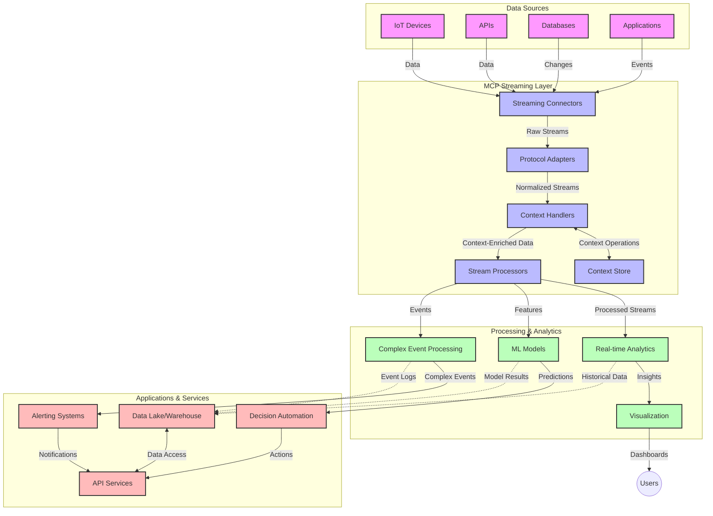

<!--
CO_OP_TRANSLATOR_METADATA:
{
  "original_hash": "195f7287638b77a549acadd96c8f981c",
  "translation_date": "2025-06-12T21:58:55+00:00",
  "source_file": "05-AdvancedTopics/mcp-realtimestreaming/README.md",
  "language_code": "fa"
}
-->
# پروتکل مدل کانتکست برای پخش داده‌های بلادرنگ

## مرور کلی

پخش داده‌های بلادرنگ در دنیای امروزی که محوریت آن داده‌ها است، اهمیت زیادی یافته است؛ جایی که کسب‌وکارها و برنامه‌ها نیازمند دسترسی فوری به اطلاعات برای اتخاذ تصمیمات به موقع هستند. پروتکل مدل کانتکست (MCP) پیشرفت قابل توجهی در بهینه‌سازی فرآیندهای پخش بلادرنگ ایجاد کرده، کارایی پردازش داده‌ها را افزایش می‌دهد، یکپارچگی کانتکست را حفظ می‌کند و عملکرد کلی سیستم را بهبود می‌بخشد.

این ماژول بررسی می‌کند که چگونه MCP با ارائه رویکردی استاندارد برای مدیریت کانتکست در میان مدل‌های هوش مصنوعی، پلتفرم‌های پخش و برنامه‌ها، پخش داده‌های بلادرنگ را متحول می‌کند.

## معرفی پخش داده‌های بلادرنگ

پخش داده‌های بلادرنگ یک الگوی فناوری است که انتقال، پردازش و تحلیل مداوم داده‌ها را در همان لحظه تولید آن‌ها امکان‌پذیر می‌سازد و به سیستم‌ها اجازه می‌دهد بلافاصله به اطلاعات جدید واکنش نشان دهند. برخلاف پردازش دسته‌ای سنتی که روی داده‌های ایستا عمل می‌کند، پخش داده‌ها به صورت جریان در حرکت انجام می‌شود و با تأخیر بسیار کم، بینش‌ها و واکنش‌ها را ارائه می‌دهد.

### مفاهیم اصلی پخش داده‌های بلادرنگ:

- **جریان مداوم داده‌ها**: داده‌ها به صورت جریانی پیوسته و بی‌پایان از رویدادها یا رکوردها پردازش می‌شوند.
- **پردازش با تأخیر کم**: سیستم‌ها به گونه‌ای طراحی شده‌اند که زمان بین تولید داده و پردازش را به حداقل برسانند.
- **قابلیت مقیاس‌پذیری**: معماری‌های پخش باید توانایی مدیریت حجم و سرعت متغیر داده‌ها را داشته باشند.
- **تحمل خطا**: سیستم‌ها باید در برابر خطاها مقاوم باشند تا جریان داده‌ها بدون وقفه حفظ شود.
- **پردازش حالت‌دار**: حفظ کانتکست در طول رویدادها برای تحلیل‌های معنادار حیاتی است.

### پروتکل مدل کانتکست و پخش بلادرنگ

پروتکل مدل کانتکست (MCP) به چندین چالش مهم در محیط‌های پخش بلادرنگ پاسخ می‌دهد:

1. **تداوم کانتکست**: MCP نحوه حفظ کانتکست در اجزای توزیع‌شده پخش را استاندارد می‌کند و اطمینان می‌دهد که مدل‌های هوش مصنوعی و گره‌های پردازشی به کانتکست مرتبط تاریخی و محیطی دسترسی دارند.

2. **مدیریت کارآمد حالت**: با ارائه مکانیزم‌های ساختارمند برای انتقال کانتکست، MCP بار مدیریت حالت در خطوط لوله پخش را کاهش می‌دهد.

3. **تعامل‌پذیری**: MCP زبان مشترکی برای به اشتراک‌گذاری کانتکست بین فناوری‌های مختلف پخش و مدل‌های هوش مصنوعی ایجاد می‌کند و معماری‌های انعطاف‌پذیر و قابل توسعه‌تری فراهم می‌آورد.

4. **کانتکست بهینه‌شده برای پخش**: پیاده‌سازی‌های MCP می‌توانند عناصر کانتکست مهم‌تر برای تصمیم‌گیری بلادرنگ را اولویت‌بندی کنند و عملکرد و دقت را بهینه سازند.

5. **پردازش تطبیقی**: با مدیریت صحیح کانتکست از طریق MCP، سیستم‌های پخش می‌توانند پردازش را بر اساس شرایط و الگوهای متغیر داده به صورت پویا تنظیم کنند.

در برنامه‌های مدرن از شبکه‌های حسگر IoT تا پلتفرم‌های معاملات مالی، ادغام MCP با فناوری‌های پخش امکان پردازش هوشمندانه‌تر و آگاه به کانتکست را فراهم می‌کند که می‌تواند به طور مناسب به موقعیت‌های پیچیده و در حال تغییر بلادرنگ پاسخ دهد.

## اهداف آموزشی

تا پایان این درس، شما قادر خواهید بود:

- اصول پخش داده‌های بلادرنگ و چالش‌های آن را درک کنید
- توضیح دهید چگونه پروتکل مدل کانتکست (MCP) پخش داده‌های بلادرنگ را بهبود می‌بخشد
- راهکارهای پخش مبتنی بر MCP را با استفاده از چارچوب‌های محبوب مانند Kafka و Pulsar پیاده‌سازی کنید
- معماری‌های پخش با تحمل خطا و عملکرد بالا را با MCP طراحی و مستقر نمایید
- مفاهیم MCP را در موارد استفاده IoT، معاملات مالی و تحلیل‌های مبتنی بر هوش مصنوعی به کار ببرید
- روندهای نوظهور و نوآوری‌های آینده در فناوری‌های پخش مبتنی بر MCP را ارزیابی کنید

### تعریف و اهمیت

پخش داده‌های بلادرنگ شامل تولید، پردازش و تحویل مداوم داده‌ها با تأخیر بسیار کم است. برخلاف پردازش دسته‌ای که داده‌ها به صورت گروهی جمع‌آوری و پردازش می‌شوند، داده‌های پخش به تدریج و هنگام رسیدن پردازش می‌شوند و امکان دریافت بینش‌ها و واکنش‌های فوری را فراهم می‌کنند.

ویژگی‌های کلیدی پخش داده‌های بلادرنگ عبارتند از:

- **تأخیر کم**: پردازش و تحلیل داده‌ها در عرض میلی‌ثانیه تا چند ثانیه
- **جریان مداوم**: جریان‌های بدون وقفه داده از منابع مختلف
- **پردازش فوری**: تحلیل داده‌ها هنگام رسیدن به جای پردازش دسته‌ای
- **معماری رویدادمحور**: واکنش به رویدادها به محض وقوع

### چالش‌ها در پخش داده‌های سنتی

روش‌های سنتی پخش داده با محدودیت‌های متعددی مواجه‌اند:

1. **از دست رفتن کانتکست**: دشواری حفظ کانتکست در سیستم‌های توزیع‌شده
2. **مشکلات مقیاس‌پذیری**: چالش در گسترش برای مدیریت داده‌های حجیم و سریع
3. **پیچیدگی یکپارچه‌سازی**: مشکلات تعامل بین سیستم‌های مختلف
4. **مدیریت تأخیر**: تعادل بین توان عملیاتی و زمان پردازش
5. **یکنواختی داده‌ها**: تضمین دقت و کامل بودن داده‌ها در سراسر جریان

## درک پروتکل مدل کانتکست (MCP)

### MCP چیست؟

پروتکل مدل کانتکست (MCP) یک پروتکل ارتباطی استاندارد است که برای تسهیل تعامل کارآمد بین مدل‌های هوش مصنوعی و برنامه‌ها طراحی شده است. در زمینه پخش داده‌های بلادرنگ، MCP چارچوبی فراهم می‌کند برای:

- حفظ کانتکست در سراسر خط لوله داده
- استانداردسازی فرمت‌های تبادل داده
- بهینه‌سازی انتقال داده‌های حجیم
- ارتقاء ارتباط مدل به مدل و مدل به برنامه

### اجزا و معماری اصلی

معماری MCP برای پخش بلادرنگ شامل اجزای کلیدی زیر است:

1. **مدیران کانتکست**: مدیریت و حفظ اطلاعات کانتکست در طول خط لوله پخش
2. **پردازنده‌های جریان**: پردازش داده‌های ورودی با تکنیک‌های آگاه به کانتکست
3. **مبدل‌های پروتکل**: تبدیل بین پروتکل‌های مختلف پخش با حفظ کانتکست
4. **ذخیره‌ساز کانتکست**: ذخیره و بازیابی کارآمد اطلاعات کانتکست
5. **کانکتورهای پخش**: اتصال به پلتفرم‌های مختلف پخش (Kafka، Pulsar، Kinesis و غیره)



### چگونه MCP پردازش داده‌های بلادرنگ را بهبود می‌بخشد

MCP چالش‌های پخش سنتی را از طریق موارد زیر حل می‌کند:

- **یکپارچگی کانتکست**: حفظ روابط بین نقاط داده در کل خط لوله
- **انتقال بهینه**: کاهش افزونگی در تبادل داده با مدیریت هوشمند کانتکست
- **رابط‌های استاندارد**: ارائه APIهای یکسان برای اجزای پخش
- **کاهش تأخیر**: به حداقل رساندن سربار پردازش با مدیریت کارآمد کانتکست
- **افزایش مقیاس‌پذیری**: پشتیبانی از مقیاس‌پذیری افقی همراه با حفظ کانتکست

## ادغام و پیاده‌سازی

سیستم‌های پخش داده‌های بلادرنگ نیازمند طراحی و پیاده‌سازی معماری دقیق برای حفظ همزمان عملکرد و یکپارچگی کانتکست هستند. پروتکل مدل کانتکست رویکردی استاندارد برای ادغام مدل‌های هوش مصنوعی و فناوری‌های پخش ارائه می‌دهد که امکان ایجاد خطوط لوله پردازش پیشرفته و آگاه به کانتکست را فراهم می‌کند.

### مرور کلی ادغام MCP در معماری‌های پخش

پیاده‌سازی MCP در محیط‌های پخش بلادرنگ شامل ملاحظات کلیدی زیر است:

1. **سریال‌سازی و انتقال کانتکست**: MCP مکانیزم‌های کارآمدی برای رمزگذاری اطلاعات کانتکست در بسته‌های داده پخش فراهم می‌کند تا اطمینان حاصل شود کانتکست ضروری همراه داده در کل خط لوله پردازش حفظ می‌شود. این شامل فرمت‌های سریال‌سازی استاندارد بهینه‌شده برای انتقال پخش است.

2. **پردازش حالت‌دار جریان**: MCP پردازش حالت‌دار هوشمندانه‌تری را با حفظ نمای کانتکست سازگار در گره‌های پردازشی ممکن می‌سازد. این موضوع در معماری‌های پخش توزیع‌شده که مدیریت حالت به طور سنتی چالش‌برانگیز است، بسیار ارزشمند است.

3. **زمان رویداد در مقابل زمان پردازش**: پیاده‌سازی‌های MCP در سیستم‌های پخش باید چالش تمایز بین زمان وقوع رویدادها و زمان پردازش آن‌ها را برطرف کنند. این پروتکل می‌تواند کانتکست زمانی را که معنای زمان رویداد را حفظ می‌کند، در بر گیرد.

4. **مدیریت فشار معکوس**: با استانداردسازی مدیریت کانتکست، MCP به کنترل فشار معکوس در سیستم‌های پخش کمک می‌کند و امکان ارتباط توانایی‌های پردازشی اجزا و تنظیم جریان را فراهم می‌آورد.

5. **پنجره‌بندی و تجمیع کانتکست**: MCP عملیات پنجره‌بندی پیشرفته‌تری را با ارائه نمای ساختارمند از کانتکست‌های زمانی و رابطه‌ای تسهیل می‌کند که امکان تجمیع‌های معنادار در جریان رویدادها را فراهم می‌آورد.

6. **پردازش دقیقاً یک بار**: در سیستم‌های پخش که نیازمند معنای دقیقاً یک بار هستند، MCP می‌تواند متادیتای پردازش را برای کمک به ردیابی و تأیید وضعیت پردازش در اجزای توزیع‌شده در بر گیرد.

پیاده‌سازی MCP در فناوری‌های مختلف پخش رویکردی یکپارچه برای مدیریت کانتکست ایجاد می‌کند، نیاز به کدهای ادغام سفارشی را کاهش می‌دهد و توانایی سیستم در حفظ کانتکست معنادار هنگام جریان داده در خط لوله را افزایش می‌دهد.

### MCP در چارچوب‌های مختلف پخش داده

این مثال‌ها بر اساس مشخصات فعلی MCP که بر پروتکل JSON-RPC با مکانیزم‌های انتقال متمایز تمرکز دارد، ارائه شده‌اند. کدها نشان می‌دهند چگونه می‌توان انتقال‌های سفارشی را پیاده‌سازی کرد که پلتفرم‌های پخش مانند Kafka و Pulsar را با حفظ سازگاری کامل با پروتکل MCP ادغام می‌کنند.

این نمونه‌ها طراحی شده‌اند تا نشان دهند چگونه پلتفرم‌های پخش می‌توانند با MCP ادغام شوند تا پردازش داده‌های بلادرنگ را همراه با حفظ آگاهی کانتکست که محور MCP است، ارائه دهند. این رویکرد تضمین می‌کند نمونه‌های کد به طور دقیق وضعیت فعلی مشخصات MCP تا ژوئن ۲۰۲۵ را منعکس کنند.

MCP می‌تواند با چارچوب‌های پخش محبوب از جمله:

#### ادغام Apache Kafka

```python
import asyncio
import json
from typing import Dict, Any, Optional
from confluent_kafka import Consumer, Producer, KafkaError
from mcp.client import Client, ClientCapabilities
from mcp.core.message import JsonRpcMessage
from mcp.core.transports import Transport

# Custom transport class to bridge MCP with Kafka
class KafkaMCPTransport(Transport):
    def __init__(self, bootstrap_servers: str, input_topic: str, output_topic: str):
        self.bootstrap_servers = bootstrap_servers
        self.input_topic = input_topic
        self.output_topic = output_topic
        self.producer = Producer({'bootstrap.servers': bootstrap_servers})
        self.consumer = Consumer({
            'bootstrap.servers': bootstrap_servers,
            'group.id': 'mcp-client-group',
            'auto.offset.reset': 'earliest'
        })
        self.message_queue = asyncio.Queue()
        self.running = False
        self.consumer_task = None
        
    async def connect(self):
        """Connect to Kafka and start consuming messages"""
        self.consumer.subscribe([self.input_topic])
        self.running = True
        self.consumer_task = asyncio.create_task(self._consume_messages())
        return self
        
    async def _consume_messages(self):
        """Background task to consume messages from Kafka and queue them for processing"""
        while self.running:
            try:
                msg = self.consumer.poll(1.0)
                if msg is None:
                    await asyncio.sleep(0.1)
                    continue
                
                if msg.error():
                    if msg.error().code() == KafkaError._PARTITION_EOF:
                        continue
                    print(f"Consumer error: {msg.error()}")
                    continue
                
                # Parse the message value as JSON-RPC
                try:
                    message_str = msg.value().decode('utf-8')
                    message_data = json.loads(message_str)
                    mcp_message = JsonRpcMessage.from_dict(message_data)
                    await self.message_queue.put(mcp_message)
                except Exception as e:
                    print(f"Error parsing message: {e}")
            except Exception as e:
                print(f"Error in consumer loop: {e}")
                await asyncio.sleep(1)
    
    async def read(self) -> Optional[JsonRpcMessage]:
        """Read the next message from the queue"""
        try:
            message = await self.message_queue.get()
            return message
        except Exception as e:
            print(f"Error reading message: {e}")
            return None
    
    async def write(self, message: JsonRpcMessage) -> None:
        """Write a message to the Kafka output topic"""
        try:
            message_json = json.dumps(message.to_dict())
            self.producer.produce(
                self.output_topic,
                message_json.encode('utf-8'),
                callback=self._delivery_report
            )
            self.producer.poll(0)  # Trigger callbacks
        except Exception as e:
            print(f"Error writing message: {e}")
    
    def _delivery_report(self, err, msg):
        """Kafka producer delivery callback"""
        if err is not None:
            print(f'Message delivery failed: {err}')
        else:
            print(f'Message delivered to {msg.topic()} [{msg.partition()}]')
    
    async def close(self) -> None:
        """Close the transport"""
        self.running = False
        if self.consumer_task:
            self.consumer_task.cancel()
            try:
                await self.consumer_task
            except asyncio.CancelledError:
                pass
        self.consumer.close()
        self.producer.flush()

# Example usage of the Kafka MCP transport
async def kafka_mcp_example():
    # Create MCP client with Kafka transport
    client = Client(
        {"name": "kafka-mcp-client", "version": "1.0.0"},
        ClientCapabilities({})
    )
    
    # Create and connect the Kafka transport
    transport = KafkaMCPTransport(
        bootstrap_servers="localhost:9092",
        input_topic="mcp-responses",
        output_topic="mcp-requests"
    )
    
    await client.connect(transport)
    
    try:
        # Initialize the MCP session
        await client.initialize()
        
        # Example of executing a tool via MCP
        response = await client.execute_tool(
            "process_data",
            {
                "data": "sample data",
                "metadata": {
                    "source": "sensor-1",
                    "timestamp": "2025-06-12T10:30:00Z"
                }
            }
        )
        
        print(f"Tool execution response: {response}")
        
        # Clean shutdown
        await client.shutdown()
    finally:
        await transport.close()

# Run the example
if __name__ == "__main__":
    asyncio.run(kafka_mcp_example())
```

#### پیاده‌سازی Apache Pulsar

```python
import asyncio
import json
import pulsar
from typing import Dict, Any, Optional
from mcp.core.message import JsonRpcMessage
from mcp.core.transports import Transport
from mcp.server import Server, ServerOptions
from mcp.server.tools import Tool, ToolExecutionContext, ToolMetadata

# Create a custom MCP transport that uses Pulsar
class PulsarMCPTransport(Transport):
    def __init__(self, service_url: str, request_topic: str, response_topic: str):
        self.service_url = service_url
        self.request_topic = request_topic
        self.response_topic = response_topic
        self.client = pulsar.Client(service_url)
        self.producer = self.client.create_producer(response_topic)
        self.consumer = self.client.subscribe(
            request_topic,
            "mcp-server-subscription",
            consumer_type=pulsar.ConsumerType.Shared
        )
        self.message_queue = asyncio.Queue()
        self.running = False
        self.consumer_task = None
    
    async def connect(self):
        """Connect to Pulsar and start consuming messages"""
        self.running = True
        self.consumer_task = asyncio.create_task(self._consume_messages())
        return self
    
    async def _consume_messages(self):
        """Background task to consume messages from Pulsar and queue them for processing"""
        while self.running:
            try:
                # Non-blocking receive with timeout
                msg = self.consumer.receive(timeout_millis=500)
                
                # Process the message
                try:
                    message_str = msg.data().decode('utf-8')
                    message_data = json.loads(message_str)
                    mcp_message = JsonRpcMessage.from_dict(message_data)
                    await self.message_queue.put(mcp_message)
                    
                    # Acknowledge the message
                    self.consumer.acknowledge(msg)
                except Exception as e:
                    print(f"Error processing message: {e}")
                    # Negative acknowledge if there was an error
                    self.consumer.negative_acknowledge(msg)
            except Exception as e:
                # Handle timeout or other exceptions
                await asyncio.sleep(0.1)
    
    async def read(self) -> Optional[JsonRpcMessage]:
        """Read the next message from the queue"""
        try:
            message = await self.message_queue.get()
            return message
        except Exception as e:
            print(f"Error reading message: {e}")
            return None
    
    async def write(self, message: JsonRpcMessage) -> None:
        """Write a message to the Pulsar output topic"""
        try:
            message_json = json.dumps(message.to_dict())
            self.producer.send(message_json.encode('utf-8'))
        except Exception as e:
            print(f"Error writing message: {e}")
    
    async def close(self) -> None:
        """Close the transport"""
        self.running = False
        if self.consumer_task:
            self.consumer_task.cancel()
            try:
                await self.consumer_task
            except asyncio.CancelledError:
                pass
        self.consumer.close()
        self.producer.close()
        self.client.close()

# Define a sample MCP tool that processes streaming data
@Tool(
    name="process_streaming_data",
    description="Process streaming data with context preservation",
    metadata=ToolMetadata(
        required_capabilities=["streaming"]
    )
)
async def process_streaming_data(
    ctx: ToolExecutionContext,
    data: str,
    source: str,
    priority: str = "medium"
) -> Dict[str, Any]:
    """
    Process streaming data while preserving context
    
    Args:
        ctx: Tool execution context
        data: The data to process
        source: The source of the data
        priority: Priority level (low, medium, high)
        
    Returns:
        Dict containing processed results and context information
    """
    # Example processing that leverages MCP context
    print(f"Processing data from {source} with priority {priority}")
    
    # Access conversation context from MCP
    conversation_id = ctx.conversation_id if hasattr(ctx, 'conversation_id') else "unknown"
    
    # Return results with enhanced context
    return {
        "processed_data": f"Processed: {data}",
        "context": {
            "conversation_id": conversation_id,
            "source": source,
            "priority": priority,
            "processing_timestamp": ctx.get_current_time_iso()
        }
    }

# Example MCP server implementation using Pulsar transport
async def run_mcp_server_with_pulsar():
    # Create MCP server
    server = Server(
        {"name": "pulsar-mcp-server", "version": "1.0.0"},
        ServerOptions(
            capabilities={"streaming": True}
        )
    )
    
    # Register our tool
    server.register_tool(process_streaming_data)
    
    # Create and connect Pulsar transport
    transport = PulsarMCPTransport(
        service_url="pulsar://localhost:6650",
        request_topic="mcp-requests",
        response_topic="mcp-responses"
    )
    
    try:
        # Start the server with the Pulsar transport
        await server.run(transport)
    finally:
        await transport.close()

# Run the server
if __name__ == "__main__":
    asyncio.run(run_mcp_server_with_pulsar())
```

### بهترین شیوه‌ها برای استقرار

هنگام پیاده‌سازی MCP برای پخش بلادرنگ:

1. **طراحی برای تحمل خطا**:
   - پیاده‌سازی مدیریت خطای مناسب
   - استفاده از صف‌های پیام مرده برای پیام‌های ناموفق
   - طراحی پردازنده‌های ایدمپوتنت

2. **بهینه‌سازی عملکرد**:
   - پیکربندی اندازه‌های بافر مناسب
   - استفاده از پردازش دسته‌ای در مواقع لازم
   - پیاده‌سازی مکانیزم‌های فشار معکوس

3. **نظارت و مشاهده**:
   - ردیابی معیارهای پردازش جریان
   - نظارت بر انتشار کانتکست
   - راه‌اندازی هشدار برای ناهنجاری‌ها

4. **امن‌سازی جریان‌ها**:
   - پیاده‌سازی رمزنگاری برای داده‌های حساس
   - استفاده از احراز هویت و مجوزدهی
   - اعمال کنترل‌های دسترسی مناسب

### MCP در اینترنت اشیاء و محاسبات لبه

MCP پخش داده‌های IoT را با موارد زیر بهبود می‌بخشد:

- حفظ کانتکست دستگاه در سراسر خط لوله پردازش
- امکان پخش داده‌های کارآمد از لبه به ابر
- پشتیبانی از تحلیل‌های بلادرنگ روی جریان‌های داده IoT
- تسهیل ارتباط دستگاه به دستگاه با کانتکست

مثال: شبکه‌های حسگر شهر هوشمند  
```
Sensors → Edge Gateways → MCP Stream Processors → Real-time Analytics → Automated Responses
```

### نقش در معاملات مالی و معاملات با فرکانس بالا

MCP مزایای قابل توجهی برای پخش داده‌های مالی فراهم می‌کند:

- پردازش با تأخیر فوق‌العاده کم برای تصمیمات معاملاتی
- حفظ کانتکست تراکنش در سراسر پردازش
- پشتیبانی از پردازش رویدادهای پیچیده با آگاهی کانتکست
- تضمین یکنواختی داده‌ها در سیستم‌های معاملاتی توزیع‌شده

### ارتقاء تحلیل‌های داده مبتنی بر هوش مصنوعی

MCP امکانات جدیدی برای تحلیل‌های پخش ایجاد می‌کند:

- آموزش و استنتاج مدل بلادرنگ
- یادگیری مستمر از داده‌های پخش
- استخراج ویژگی آگاه به کانتکست
- خطوط لوله استنتاج چندمدلی با حفظ کانتکست

## روندها و نوآوری‌های آینده

### تکامل MCP در محیط‌های بلادرنگ

با نگاه به آینده، انتظار می‌رود MCP به گونه‌ای توسعه یابد که:

- **ادغام محاسبات کوانتومی**: آماده‌سازی برای سیستم‌های پخش مبتنی بر کوانتوم
- **پردازش بومی لبه**: انتقال بیشتر پردازش آگاه به کانتکست به دستگاه‌های لبه
- **مدیریت خودکار جریان**: بهینه‌سازی خودکار خطوط لوله پخش
- **پخش فدرال**: پردازش توزیع‌شده با حفظ حریم خصوصی

### پیشرفت‌های بالقوه در فناوری

فناوری‌های نوظهوری که آینده پخش MCP را شکل می‌دهند:

1. **پروتکل‌های پخش بهینه‌شده برای هوش مصنوعی**: پروتکل‌های سفارشی برای بارهای کاری هوش مصنوعی
2. **ادغام محاسبات نورومورفیک**: محاسبات الهام‌گرفته از مغز برای پردازش جریان
3. **پخش بدون سرور**: پخش مقیاس‌پذیر و رویدادمحور بدون مدیریت زیرساخت
4. **ذخیره‌سازهای کانتکست توزیع‌شده**: مدیریت کانتکست به صورت جهانی توزیع‌شده و در عین حال بسیار سازگار

## تمرین‌های عملی

### تمرین ۱: راه‌اندازی خط لوله پخش MCP پایه

در این تمرین یاد می‌گیرید چگونه:

- محیط پخش MCP پایه را پیکربندی کنید
- مدیران کانتکست برای پردازش جریان پیاده‌سازی کنید
- حفظ کانتکست را تست و اعتبارسنجی کنید

### تمرین ۲: ساخت داشبورد تحلیل بلادرنگ

یک برنامه کامل بسازید که:

- داده‌های پخش را با استفاده از MCP دریافت کند
- جریان را در حالی که کانتکست حفظ شده پردازش کند
- نتایج را به صورت بلادرنگ نمایش دهد

### تمرین ۳: پیاده‌سازی پردازش رویداد پیچیده با MCP

تمرین پیشرفته شامل:

- تشخیص الگو در جریان‌ها
- همبستگی کانتکست میان چند جریان
- تولید رویدادهای پیچیده با حفظ کانتکست

## منابع بیشتر

- [Model Context Protocol Specification](https://github.com/modelcontextprotocol) - مشخصات و مستندات رسمی MCP  
- [Apache Kafka Documentation](https://kafka.apache.org/documentation/) - آموزش Kafka برای پردازش جریان  
- [Apache Pulsar](https://pulsar.apache.org/) - پلتفرم پیام‌رسانی و پخش یکپارچه  
- [Streaming Systems: The What, Where, When, and How of Large-Scale Data Processing](https://www.oreilly.com/library/view/streaming-systems/9781491983867/) - کتاب جامع درباره معماری‌های پخش  
- [Microsoft Azure Event Hubs](https://learn.microsoft.com/azure/event-hubs/event-hubs-about) - سرویس مدیریت پخش رویداد  
- [MLflow Documentation](https://mlflow.org/docs/latest/index.html) - برای ردیابی و استقرار مدل‌های ML  
- [Real-Time Analytics with Apache Storm](https://storm.apache.org/releases/current/index.html) - چارچوب پردازش بلادرنگ  
- [Flink ML](https://nightlies.apache.org/flink/flink-ml-docs-master/) - کتابخانه یادگیری ماشین برای Apache Fl

**سلب مسئولیت**:  
این سند با استفاده از سرویس ترجمه هوش مصنوعی [Co-op Translator](https://github.com/Azure/co-op-translator) ترجمه شده است. در حالی که ما در تلاش برای دقت هستیم، لطفاً توجه داشته باشید که ترجمه‌های خودکار ممکن است حاوی اشتباهات یا نواقصی باشند. سند اصلی به زبان اصلی آن باید به عنوان منبع معتبر در نظر گرفته شود. برای اطلاعات حیاتی، ترجمه حرفه‌ای انسانی توصیه می‌شود. ما مسئول هیچ‌گونه سوءتفاهم یا تفسیر نادرستی که ناشی از استفاده از این ترجمه باشد، نیستیم.