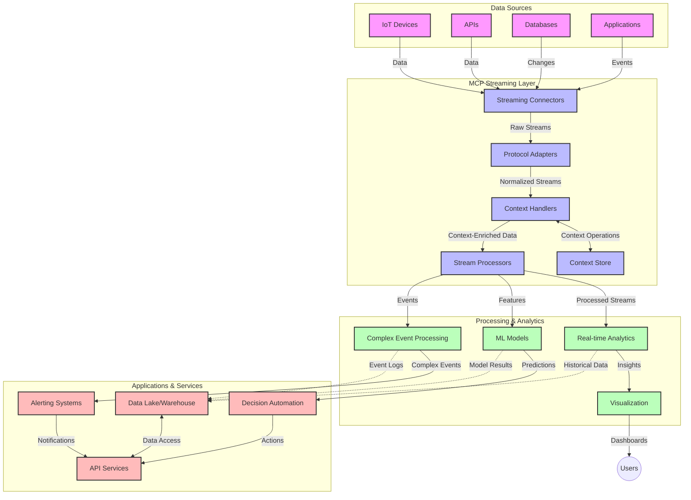

<!--
CO_OP_TRANSLATOR_METADATA:
{
  "original_hash": "68c518dbff8a3b127ed2aa934054c56c",
  "translation_date": "2025-06-11T16:57:24+00:00",
  "source_file": "05-AdvancedTopics/mcp-realtimestreaming/README.md",
  "language_code": "fa"
}
-->
# پروتکل مدل زمینه برای پخش داده‌های زمان واقعی

## مرور کلی

پخش داده‌های زمان واقعی در دنیای امروز که مبتنی بر داده است، اهمیت زیادی پیدا کرده است، جایی که کسب‌وکارها و برنامه‌ها به دسترسی فوری به اطلاعات برای اتخاذ تصمیمات به موقع نیاز دارند. پروتکل مدل زمینه (MCP) پیشرفت مهمی در بهینه‌سازی این فرایندهای پخش زمان واقعی به شمار می‌رود که باعث افزایش کارایی پردازش داده‌ها، حفظ انسجام زمینه‌ای و بهبود عملکرد کلی سیستم می‌شود.

این ماژول بررسی می‌کند که چگونه MCP با ارائه رویکردی استاندارد برای مدیریت زمینه در میان مدل‌های هوش مصنوعی، پلتفرم‌های پخش و برنامه‌ها، پخش داده‌های زمان واقعی را متحول می‌کند.

## معرفی پخش داده‌های زمان واقعی

پخش داده‌های زمان واقعی یک الگوی فناوری است که امکان انتقال، پردازش و تحلیل مداوم داده‌ها را به محض تولید فراهم می‌کند و به سیستم‌ها اجازه می‌دهد فوراً به اطلاعات جدید واکنش نشان دهند. بر خلاف پردازش دسته‌ای سنتی که روی داده‌های ایستا عمل می‌کند، پخش داده‌ها در حال حرکت پردازش می‌شود و با کمترین تأخیر بینش‌ها و اقدامات را ارائه می‌دهد.

### مفاهیم اصلی پخش داده‌های زمان واقعی:

- **جریان پیوسته داده**: داده به صورت جریان پیوسته و بی‌پایان از رویدادها یا رکوردها پردازش می‌شود.
- **پردازش با تأخیر کم**: سیستم‌ها به گونه‌ای طراحی شده‌اند که زمان بین تولید و پردازش داده را به حداقل برسانند.
- **مقیاس‌پذیری**: معماری‌های پخش باید بتوانند حجم و سرعت متغیر داده‌ها را مدیریت کنند.
- **تحمل خطا**: سیستم‌ها باید در برابر خطاها مقاوم باشند تا جریان داده بدون وقفه حفظ شود.
- **پردازش حالت‌دار**: حفظ زمینه بین رویدادها برای تحلیل معنادار بسیار مهم است.

### پروتکل مدل زمینه و پخش زمان واقعی

پروتکل مدل زمینه (MCP) به چندین چالش کلیدی در محیط‌های پخش زمان واقعی می‌پردازد:

1. **پیوستگی زمینه‌ای**: MCP استانداردسازی نحوه حفظ زمینه در میان اجزای پخش توزیع‌شده را فراهم می‌کند تا مدل‌های هوش مصنوعی و گره‌های پردازشی به زمینه‌های تاریخی و محیطی مرتبط دسترسی داشته باشند.

2. **مدیریت مؤثر حالت**: با ارائه مکانیزم‌های ساختارمند برای انتقال زمینه، MCP بار مدیریت حالت در خطوط لوله پخش را کاهش می‌دهد.

3. **قابلیت همکاری**: MCP زبان مشترکی برای به اشتراک‌گذاری زمینه بین فناوری‌های پخش متنوع و مدل‌های هوش مصنوعی ایجاد می‌کند و امکان معماری‌های انعطاف‌پذیرتر و توسعه‌پذیرتر را فراهم می‌سازد.

4. **زمینه بهینه‌شده برای پخش**: پیاده‌سازی‌های MCP می‌توانند عناصر زمینه‌ای مرتبط‌تر برای تصمیم‌گیری زمان واقعی را اولویت‌بندی کنند و عملکرد و دقت را بهینه نمایند.

5. **پردازش تطبیقی**: با مدیریت مناسب زمینه از طریق MCP، سیستم‌های پخش می‌توانند بر اساس شرایط و الگوهای در حال تغییر داده‌ها، پردازش را به صورت پویا تنظیم کنند.

در برنامه‌های مدرن از شبکه‌های حسگر اینترنت اشیا تا پلتفرم‌های معاملات مالی، ادغام MCP با فناوری‌های پخش امکان پردازش هوشمندتر و آگاه به زمینه را فراهم می‌کند که می‌تواند به طور مناسب به موقعیت‌های پیچیده و در حال تحول در زمان واقعی پاسخ دهد.

## اهداف یادگیری

تا پایان این درس، قادر خواهید بود:

- اصول پخش داده‌های زمان واقعی و چالش‌های آن را درک کنید
- توضیح دهید چگونه پروتکل مدل زمینه (MCP) پخش داده‌های زمان واقعی را بهبود می‌بخشد
- راه‌حل‌های پخش مبتنی بر MCP را با استفاده از چارچوب‌های محبوب مانند Kafka و Pulsar پیاده‌سازی کنید
- معماری‌های پخش مقاوم در برابر خطا و با عملکرد بالا را با MCP طراحی و مستقر نمایید
- مفاهیم MCP را در موارد استفاده اینترنت اشیا، معاملات مالی و تحلیل‌های مبتنی بر هوش مصنوعی به کار ببرید
- روندهای نوظهور و نوآوری‌های آینده در فناوری‌های پخش مبتنی بر MCP را ارزیابی کنید

### تعریف و اهمیت

پخش داده‌های زمان واقعی شامل تولید، پردازش و تحویل مداوم داده‌ها با کمترین تأخیر است. برخلاف پردازش دسته‌ای که داده‌ها به صورت گروهی جمع‌آوری و پردازش می‌شوند، داده‌های پخش به صورت تدریجی و به محض رسیدن پردازش می‌شوند و امکان دریافت بینش‌ها و اقدامات فوری را فراهم می‌آورند.

ویژگی‌های کلیدی پخش داده‌های زمان واقعی عبارتند از:

- **تاخیر کم**: پردازش و تحلیل داده‌ها در عرض میلی‌ثانیه تا چند ثانیه
- **جریان پیوسته**: جریان‌های بدون وقفه داده از منابع مختلف
- **پردازش فوری**: تحلیل داده‌ها به محض رسیدن به جای پردازش دسته‌ای
- **معماری مبتنی بر رویداد**: واکنش به رویدادها در زمان وقوع

### چالش‌های پخش داده‌های سنتی

رویکردهای سنتی پخش داده با محدودیت‌های متعددی مواجه‌اند:

1. **از دست دادن زمینه**: دشواری حفظ زمینه در سیستم‌های توزیع‌شده
2. **مشکلات مقیاس‌پذیری**: چالش در گسترش برای مدیریت حجم و سرعت بالای داده
3. **پیچیدگی یکپارچگی**: مشکلات در تعامل میان سیستم‌های مختلف
4. **مدیریت تأخیر**: تعادل بین توان عملیاتی و زمان پردازش
5. **یکپارچگی داده**: اطمینان از دقت و کامل بودن داده‌ها در سراسر جریان

## آشنایی با پروتکل مدل زمینه (MCP)

### MCP چیست؟

پروتکل مدل زمینه (MCP) یک پروتکل ارتباطی استاندارد است که برای تسهیل تعامل مؤثر بین مدل‌های هوش مصنوعی و برنامه‌ها طراحی شده است. در زمینه پخش داده‌های زمان واقعی، MCP چارچوبی برای:

- حفظ زمینه در سراسر خط لوله داده
- استانداردسازی قالب‌های تبادل داده
- بهینه‌سازی انتقال مجموعه داده‌های بزرگ
- ارتقاء ارتباط مدل به مدل و مدل به برنامه

فراهم می‌کند.

### اجزا و معماری اصلی

معماری MCP برای پخش زمان واقعی شامل چندین جزء کلیدی است:

1. **مدیران زمینه**: مدیریت و حفظ اطلاعات زمینه‌ای در سراسر خط لوله پخش
2. **پردازشگرهای جریان**: پردازش جریان‌های داده ورودی با استفاده از تکنیک‌های آگاه به زمینه
3. **تبدیل‌کننده‌های پروتکل**: تبدیل بین پروتکل‌های مختلف پخش در حالی که زمینه حفظ می‌شود
4. **ذخیره‌ساز زمینه**: ذخیره و بازیابی کارآمد اطلاعات زمینه‌ای
5. **کانکتورهای پخش**: اتصال به پلتفرم‌های مختلف پخش (Kafka، Pulsar، Kinesis و غیره)



### چگونه MCP پردازش داده‌های زمان واقعی را بهبود می‌بخشد

MCP چالش‌های پخش سنتی را از طریق موارد زیر برطرف می‌کند:

- **انسجام زمینه‌ای**: حفظ روابط بین نقاط داده در سراسر خط لوله
- **انتقال بهینه**: کاهش تکرار در تبادل داده‌ها با مدیریت هوشمند زمینه
- **رابط‌های استاندارد**: ارائه APIهای یکسان برای اجزای پخش
- **کاهش تأخیر**: کمینه‌سازی بار پردازشی از طریق مدیریت کارآمد زمینه
- **افزایش مقیاس‌پذیری**: پشتیبانی از مقیاس‌پذیری افقی در حالی که زمینه حفظ می‌شود

## ادغام و پیاده‌سازی

سیستم‌های پخش داده‌های زمان واقعی نیازمند طراحی و پیاده‌سازی معماری دقیق برای حفظ همزمان عملکرد و انسجام زمینه‌ای هستند. پروتکل مدل زمینه رویکردی استاندارد برای ادغام مدل‌های هوش مصنوعی و فناوری‌های پخش ارائه می‌دهد که امکان خطوط لوله پردازش پیشرفته‌تر و آگاه به زمینه را فراهم می‌کند.

### مرور ادغام MCP در معماری‌های پخش

پیاده‌سازی MCP در محیط‌های پخش زمان واقعی شامل ملاحظات کلیدی زیر است:

1. **سریال‌سازی و انتقال زمینه**: MCP مکانیزم‌های کارآمدی برای رمزگذاری اطلاعات زمینه در بسته‌های داده پخش فراهم می‌کند تا زمینه ضروری در سراسر خط لوله پردازش دنبال شود. این شامل قالب‌های سریال‌سازی استاندارد شده و بهینه‌شده برای انتقال پخش است.

2. **پردازش جریان حالت‌دار**: MCP پردازش حالت‌دار هوشمندتری را با حفظ نمایندگی ثابت زمینه در میان گره‌های پردازشی ممکن می‌سازد. این موضوع به ویژه در معماری‌های پخش توزیع‌شده که مدیریت حالت چالش‌برانگیز است، ارزشمند است.

3. **زمان رویداد در مقابل زمان پردازش**: پیاده‌سازی‌های MCP در سیستم‌های پخش باید چالش معمول تمایز بین زمان وقوع رویدادها و زمان پردازش آنها را حل کنند. این پروتکل می‌تواند زمینه زمانی را که معناشناسی زمان رویداد را حفظ می‌کند، دربرگیرد.

4. **مدیریت فشار برگشتی**: با استانداردسازی مدیریت زمینه، MCP به کنترل فشار برگشتی در سیستم‌های پخش کمک می‌کند و به اجزا امکان می‌دهد توان پردازشی خود را اعلام و جریان را تنظیم کنند.

5. **پنجره‌بندی و تجمیع زمینه**: MCP عملیات پنجره‌بندی پیچیده‌تری را با ارائه نمایندگی‌های ساختارمند از زمینه‌های زمانی و رابطه‌ای تسهیل می‌کند و امکان تجمیع‌های معنادارتر در جریان رویدادها را فراهم می‌آورد.

6. **پردازش دقیقاً یک‌بار**: در سیستم‌های پخش که به معنای دقیقاً یک‌بار نیاز دارند، MCP می‌تواند متادیتای پردازش را برای کمک به پیگیری و تأیید وضعیت پردازش در میان اجزای توزیع‌شده دربرگیرد.

اجرای MCP در فناوری‌های مختلف پخش رویکردی یکپارچه برای مدیریت زمینه ایجاد می‌کند که نیاز به کد ادغام سفارشی را کاهش داده و توانایی سیستم را در حفظ زمینه معنادار هنگام جریان داده افزایش می‌دهد.

### MCP در چارچوب‌های مختلف پخش داده

MCP می‌تواند با چارچوب‌های پخش محبوب از جمله:

#### ادغام Apache Kafka

```python
from mcp_streaming import MCPKafkaConnector

# Initialize MCP Kafka connector
connector = MCPKafkaConnector(
    bootstrap_servers='localhost:9092',
    context_preservation=True
)

# Create a context-aware consumer
consumer = connector.create_consumer('input-topic')

# Process streaming data with context
for message in consumer:
    context = message.get_context()
    data = message.get_value()
    
    # Process with context awareness
    result = process_with_context(data, context)
    
    # Produce output with preserved context
    connector.produce('output-topic', result, context=context)
```

#### پیاده‌سازی Apache Pulsar

```python
from mcp_streaming import MCPPulsarClient

# Initialize MCP Pulsar client
client = MCPPulsarClient('pulsar://localhost:6650')

# Subscribe with context awareness
consumer = client.subscribe('input-topic', 'subscription-name', 
                           context_enabled=True)

# Process messages with context preservation
while True:
    message = consumer.receive()
    context = message.get_context()
    
    # Process with context
    result = process_with_context(message.data(), context)
    
    # Acknowledge the message
    consumer.acknowledge(message)
    
    # Send result with preserved context
    producer = client.create_producer('output-topic')
    producer.send(result, context=context)
```

### بهترین شیوه‌ها برای استقرار

هنگام پیاده‌سازی MCP برای پخش زمان واقعی:

1. **طراحی برای تحمل خطا**:
   - پیاده‌سازی مدیریت خطای مناسب
   - استفاده از صف‌های پیام مرده برای پیام‌های ناموفق
   - طراحی پردازشگرهای ایمن در برابر اجرای چندباره

2. **بهینه‌سازی برای عملکرد**:
   - پیکربندی اندازه‌های بافر مناسب
   - استفاده از دسته‌بندی (batching) در صورت امکان
   - پیاده‌سازی مکانیزم‌های فشار برگشتی

3. **نظارت و مشاهده**:
   - رصد معیارهای پردازش جریان
   - پایش انتشار زمینه
   - راه‌اندازی هشدار برای ناهنجاری‌ها

4. **امنیت جریان‌ها**:
   - پیاده‌سازی رمزنگاری برای داده‌های حساس
   - استفاده از احراز هویت و مجوزدهی
   - اعمال کنترل‌های دسترسی مناسب

### MCP در اینترنت اشیا و محاسبات لبه

MCP پخش داده‌های اینترنت اشیا را با موارد زیر بهبود می‌بخشد:

- حفظ زمینه دستگاه در سراسر خط لوله پردازش
- امکان پخش داده کارآمد از لبه به ابر
- پشتیبانی از تحلیل‌های زمان واقعی روی جریان‌های داده اینترنت اشیا
- تسهیل ارتباط دستگاه به دستگاه با زمینه

مثال: شبکه‌های حسگر شهر هوشمند  
```
Sensors → Edge Gateways → MCP Stream Processors → Real-time Analytics → Automated Responses
```

### نقش در معاملات مالی و معاملات با فرکانس بالا

MCP مزایای قابل توجهی برای پخش داده‌های مالی فراهم می‌کند:

- پردازش با تأخیر فوق‌العاده کم برای تصمیم‌گیری‌های معاملاتی
- حفظ زمینه تراکنش در سراسر پردازش
- پشتیبانی از پردازش رویدادهای پیچیده با آگاهی زمینه‌ای
- تضمین یکپارچگی داده‌ها در سیستم‌های معاملاتی توزیع‌شده

### ارتقاء تحلیل‌های داده مبتنی بر هوش مصنوعی

MCP امکانات جدیدی برای تحلیل‌های پخش ایجاد می‌کند:

- آموزش و استنتاج مدل به صورت زمان واقعی
- یادگیری مستمر از داده‌های پخش شده
- استخراج ویژگی آگاه به زمینه
- خطوط لوله استنتاج چندمدلی با حفظ زمینه

## روندها و نوآوری‌های آینده

### تکامل MCP در محیط‌های زمان واقعی

در آینده انتظار می‌رود MCP به مسائل زیر بپردازد:

- **ادغام محاسبات کوانتومی**: آماده‌سازی برای سیستم‌های پخش مبتنی بر کوانتوم
- **پردازش بومی لبه**: انتقال بیشتر پردازش آگاه به زمینه به دستگاه‌های لبه
- **مدیریت خودکار جریان‌ها**: خطوط لوله پخش خودبهینه‌شونده
- **پخش فدراسیون‌شده**: پردازش توزیع‌شده در حالی که حریم خصوصی حفظ می‌شود

### پیشرفت‌های بالقوه در فناوری

فناوری‌های نوظهوری که آینده پخش MCP را شکل می‌دهند:

1. **پروتکل‌های پخش بهینه‌شده برای هوش مصنوعی**: پروتکل‌های سفارشی طراحی شده مخصوص بارهای کاری هوش مصنوعی
2. **ادغام محاسبات نورو مورفیک**: محاسبات الهام‌گرفته از مغز برای پردازش جریان
3. **پخش بدون سرور**: پخش مقیاس‌پذیر و مبتنی بر رویداد بدون مدیریت زیرساخت
4. **ذخیره‌سازهای زمینه توزیع‌شده**: مدیریت زمینه به صورت جهانی توزیع‌شده و در عین حال بسیار منسجم

## تمرین‌های عملی

### تمرین ۱: راه‌اندازی خط لوله پخش پایه MCP

در این تمرین، یاد می‌گیرید چگونه:

- محیط پخش پایه MCP را پیکربندی کنید
- مدیران زمینه را برای پردازش جریان پیاده‌سازی کنید
- حفظ زمینه را تست و اعتبارسنجی نمایید

### تمرین ۲: ساخت داشبورد تحلیل زمان واقعی

یک برنامه کامل بسازید که:

- داده‌های پخش را با استفاده از MCP دریافت می‌کند
- جریان را در حالی که زمینه حفظ می‌شود پردازش می‌کند
- نتایج را به صورت زمان واقعی نمایش می‌دهد

### تمرین ۳: پیاده‌سازی پردازش رویداد پیچیده با MCP

تمرین پیشرفته شامل:

- تشخیص الگو در جریان‌ها
- همبستگی زمینه‌ای بین چندین جریان
- تولید رویدادهای پیچیده با زمینه حفظ‌شده

## منابع بیشتر

- [Model Context Protocol Specification](https://github.com/microsoft/model-context-protocol) - مشخصات رسمی و مستندات MCP
- [Apache Kafka Documentation](https://kafka.apache.org/documentation/) - آموزش Kafka برای پردازش جریان
- [Apache Pulsar](https://pulsar.apache.org/) - پلتفرم پیام‌رسانی و پخش یکپارچه
- [Streaming Systems: The What, Where, When, and How of Large-Scale Data Processing](https://www.oreilly.com/library/view/streaming-systems/9781491983867/) - کتاب جامع درباره معماری‌های پخش
- [Microsoft Azure Event Hubs](https://learn.microsoft.com/en-us/azure/event-hubs/event-hubs-about) - سرویس مدیریت شده پخش رویداد
- [MLflow Documentation](https://mlflow.org/docs/latest/index.html) - برای ردیابی و استقرار مدل‌های یادگیری ماشین
- [Real-Time Analytics with Apache Storm](https://storm.apache.org/releases/current/index.html) - چارچوب پردازش محاسبات زمان واقعی
- [Flink ML](https://nightlies.apache.org/flink/flink-ml-docs-master/) - کتابخانه یادگیری ماشین برای Apache Flink
- [LangChain Documentation](https://python.langchain.com/docs/get_started/introduction) - ساخت برنامه با مدل‌های زبانی بزرگ (LLM)

## نتایج یادگیری

با اتمام این ماژول، قادر خواهید بود:

- اصول پخش داده‌های زمان واقعی و چالش‌های آن را درک کنید
- توضیح دهید چگونه پروتکل مدل زمینه (MCP) پخش داده‌های زمان واقعی را بهبود می‌بخشد
- راه‌حل‌های پخش مبتنی بر MCP را با استفاده از چارچوب‌های محبوب مانند Kafka و Pulsar پیاده‌سازی کنید
- معماری‌های پخش مقاوم در برابر خطا و با عملکرد بالا را با MCP طراحی و مستقر نمایید
- مفاهیم MCP را در موارد استفاده اینترنت اشیا، معاملات مالی و تحلیل‌های مبتنی بر هوش مصنوعی به کار ببرید
- روندهای نوظهور و نوآوری‌های آینده در فناوری‌های پخش مبتنی بر MCP را ارزیابی کنید

## گام بعدی

- [6. مشارکت‌های جامعه](../../06-CommunityContributions/README.md)

**سلب مسئولیت**:  
این سند با استفاده از سرویس ترجمه هوش مصنوعی [Co-op Translator](https://github.com/Azure/co-op-translator) ترجمه شده است. در حالی که ما برای دقت تلاش می‌کنیم، لطفاً توجه داشته باشید که ترجمه‌های خودکار ممکن است حاوی خطاها یا نواقصی باشند. سند اصلی به زبان بومی خود باید به عنوان منبع معتبر در نظر گرفته شود. برای اطلاعات حیاتی، ترجمه حرفه‌ای انسانی توصیه می‌شود. ما مسئول هیچ گونه سوءتفاهم یا برداشت نادرست ناشی از استفاده از این ترجمه نیستیم.