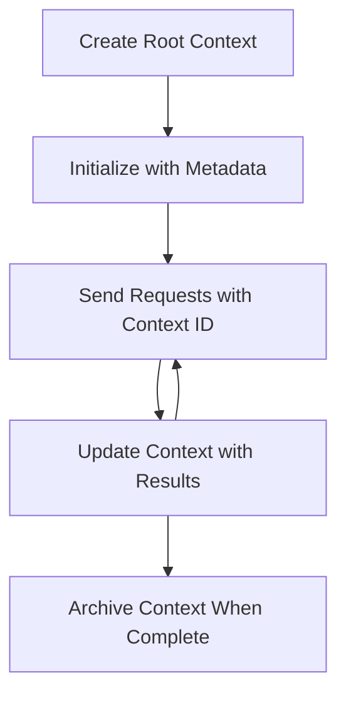

<!--
CO_OP_TRANSLATOR_METADATA:
{
  "original_hash": "ebdb86db46113f1cbd59ce4c74caaa79",
  "translation_date": "2025-07-16T22:25:24+00:00",
  "source_file": "05-AdvancedTopics/mcp-root-contexts/README.md",
  "language_code": "fa"
}
-->
# زمینه‌های ریشه‌ای MCP

زمینه‌های ریشه‌ای یک مفهوم اساسی در پروتکل مدل کانتکست هستند که لایه‌ای پایدار برای حفظ تاریخچه گفتگو و وضعیت مشترک در چندین درخواست و جلسه فراهم می‌کنند.

## مقدمه

در این درس، نحوه ایجاد، مدیریت و استفاده از زمینه‌های ریشه‌ای در MCP را بررسی خواهیم کرد.

## اهداف یادگیری

در پایان این درس، شما قادر خواهید بود:

- هدف و ساختار زمینه‌های ریشه‌ای را درک کنید
- زمینه‌های ریشه‌ای را با استفاده از کتابخانه‌های کلاینت MCP ایجاد و مدیریت کنید
- زمینه‌های ریشه‌ای را در برنامه‌های .NET، Java، JavaScript و Python پیاده‌سازی کنید
- از زمینه‌های ریشه‌ای برای گفتگوهای چندمرحله‌ای و مدیریت وضعیت استفاده کنید
- بهترین روش‌ها را برای مدیریت زمینه‌های ریشه‌ای به کار ببرید

## درک زمینه‌های ریشه‌ای

زمینه‌های ریشه‌ای به عنوان ظرف‌هایی عمل می‌کنند که تاریخچه و وضعیت یک سری تعاملات مرتبط را نگه می‌دارند. آن‌ها امکان می‌دهند:

- **پایداری گفتگو**: حفظ گفتگوهای چندمرحله‌ای منسجم
- **مدیریت حافظه**: ذخیره و بازیابی اطلاعات در طول تعاملات
- **مدیریت وضعیت**: پیگیری پیشرفت در جریان‌های کاری پیچیده
- **اشتراک‌گذاری زمینه**: اجازه دادن به چندین کلاینت برای دسترسی به وضعیت یکسان گفتگو

در MCP، زمینه‌های ریشه‌ای ویژگی‌های کلیدی زیر را دارند:

- هر زمینه ریشه‌ای یک شناسه یکتا دارد.
- می‌توانند شامل تاریخچه گفتگو، ترجیحات کاربر و سایر فراداده‌ها باشند.
- می‌توان آن‌ها را ایجاد، دسترسی و آرشیو کرد.
- از کنترل دسترسی دقیق و مجوزها پشتیبانی می‌کنند.

## چرخه عمر زمینه ریشه‌ای



## کار با زمینه‌های ریشه‌ای

در اینجا مثالی از نحوه ایجاد و مدیریت زمینه‌های ریشه‌ای آورده شده است.

### پیاده‌سازی C#

```csharp
// .NET Example: Root Context Management
using Microsoft.Mcp.Client;
using System;
using System.Threading.Tasks;
using System.Collections.Generic;

public class RootContextExample
{
    private readonly IMcpClient _client;
    private readonly IRootContextManager _contextManager;
    
    public RootContextExample(IMcpClient client, IRootContextManager contextManager)
    {
        _client = client;
        _contextManager = contextManager;
    }
    
    public async Task DemonstrateRootContextAsync()
    {
        // 1. Create a new root context
        var contextResult = await _contextManager.CreateRootContextAsync(new RootContextCreateOptions
        {
            Name = "Customer Support Session",
            Metadata = new Dictionary<string, string>
            {
                ["CustomerName"] = "Acme Corporation",
                ["PriorityLevel"] = "High",
                ["Domain"] = "Cloud Services"
            }
        });
        
        string contextId = contextResult.ContextId;
        Console.WriteLine($"Created root context with ID: {contextId}");
        
        // 2. First interaction using the context
        var response1 = await _client.SendPromptAsync(
            "I'm having issues scaling my web service deployment in the cloud.", 
            new SendPromptOptions { RootContextId = contextId }
        );
        
        Console.WriteLine($"First response: {response1.GeneratedText}");
        
        // Second interaction - the model will have access to the previous conversation
        var response2 = await _client.SendPromptAsync(
            "Yes, we're using containerized deployments with Kubernetes.", 
            new SendPromptOptions { RootContextId = contextId }
        );
        
        Console.WriteLine($"Second response: {response2.GeneratedText}");
        
        // 3. Add metadata to the context based on conversation
        await _contextManager.UpdateContextMetadataAsync(contextId, new Dictionary<string, string>
        {
            ["TechnicalEnvironment"] = "Kubernetes",
            ["IssueType"] = "Scaling"
        });
        
        // 4. Get context information
        var contextInfo = await _contextManager.GetRootContextInfoAsync(contextId);
        
        Console.WriteLine("Context Information:");
        Console.WriteLine($"- Name: {contextInfo.Name}");
        Console.WriteLine($"- Created: {contextInfo.CreatedAt}");
        Console.WriteLine($"- Messages: {contextInfo.MessageCount}");
        
        // 5. When the conversation is complete, archive the context
        await _contextManager.ArchiveRootContextAsync(contextId);
        Console.WriteLine($"Archived context {contextId}");
    }
}
```

در کد بالا ما:

1. یک زمینه ریشه‌ای برای جلسه پشتیبانی مشتری ایجاد کردیم.
2. چندین پیام در آن زمینه ارسال کردیم تا مدل بتواند وضعیت را حفظ کند.
3. زمینه را با فراداده‌های مرتبط بر اساس گفتگو به‌روزرسانی کردیم.
4. اطلاعات زمینه را برای درک تاریخچه گفتگو بازیابی کردیم.
5. پس از پایان گفتگو، زمینه را آرشیو کردیم.

## مثال: پیاده‌سازی زمینه ریشه‌ای برای تحلیل مالی

در این مثال، یک زمینه ریشه‌ای برای جلسه تحلیل مالی ایجاد می‌کنیم و نشان می‌دهیم چگونه وضعیت را در چندین تعامل حفظ کنیم.

### پیاده‌سازی Java

```java
// Java Example: Root Context Implementation
package com.example.mcp.contexts;

import com.mcp.client.McpClient;
import com.mcp.client.ContextManager;
import com.mcp.models.RootContext;
import com.mcp.models.McpResponse;

import java.util.HashMap;
import java.util.Map;
import java.util.UUID;

public class RootContextsDemo {
    private final McpClient client;
    private final ContextManager contextManager;
    
    public RootContextsDemo(String serverUrl) {
        this.client = new McpClient.Builder()
            .setServerUrl(serverUrl)
            .build();
            
        this.contextManager = new ContextManager(client);
    }
    
    public void demonstrateRootContext() throws Exception {
        // Create context metadata
        Map<String, String> metadata = new HashMap<>();
        metadata.put("projectName", "Financial Analysis");
        metadata.put("userRole", "Financial Analyst");
        metadata.put("dataSource", "Q1 2025 Financial Reports");
        
        // 1. Create a new root context
        RootContext context = contextManager.createRootContext("Financial Analysis Session", metadata);
        String contextId = context.getId();
        
        System.out.println("Created context: " + contextId);
        
        // 2. First interaction
        McpResponse response1 = client.sendPrompt(
            "Analyze the trends in Q1 financial data for our technology division",
            contextId
        );
        
        System.out.println("First response: " + response1.getGeneratedText());
        
        // 3. Update context with important information gained from response
        contextManager.addContextMetadata(contextId, 
            Map.of("identifiedTrend", "Increasing cloud infrastructure costs"));
        
        // Second interaction - using the same context
        McpResponse response2 = client.sendPrompt(
            "What's driving the increase in cloud infrastructure costs?",
            contextId
        );
        
        System.out.println("Second response: " + response2.getGeneratedText());
        
        // 4. Generate a summary of the analysis session
        McpResponse summaryResponse = client.sendPrompt(
            "Summarize our analysis of the technology division financials in 3-5 key points",
            contextId
        );
        
        // Store the summary in context metadata
        contextManager.addContextMetadata(contextId, 
            Map.of("analysisSummary", summaryResponse.getGeneratedText()));
            
        // Get updated context information
        RootContext updatedContext = contextManager.getRootContext(contextId);
        
        System.out.println("Context Information:");
        System.out.println("- Created: " + updatedContext.getCreatedAt());
        System.out.println("- Last Updated: " + updatedContext.getLastUpdatedAt());
        System.out.println("- Analysis Summary: " + 
            updatedContext.getMetadata().get("analysisSummary"));
            
        // 5. Archive context when done
        contextManager.archiveContext(contextId);
        System.out.println("Context archived");
    }
}
```

در کد بالا ما:

1. یک زمینه ریشه‌ای برای جلسه تحلیل مالی ایجاد کردیم.
2. چندین پیام در آن زمینه ارسال کردیم تا مدل بتواند وضعیت را حفظ کند.
3. زمینه را با فراداده‌های مرتبط بر اساس گفتگو به‌روزرسانی کردیم.
4. خلاصه‌ای از جلسه تحلیل تولید کرده و در فراداده‌های زمینه ذخیره کردیم.
5. پس از پایان گفتگو، زمینه را آرشیو کردیم.

## مثال: مدیریت زمینه ریشه‌ای

مدیریت مؤثر زمینه‌های ریشه‌ای برای حفظ تاریخچه و وضعیت گفتگو حیاتی است. در ادامه مثالی از نحوه پیاده‌سازی مدیریت زمینه ریشه‌ای آورده شده است.

### پیاده‌سازی JavaScript

```javascript
// JavaScript Example: Managing MCP Root Contexts
const { McpClient, RootContextManager } = require('@mcp/client');

class ContextSession {
  constructor(serverUrl, apiKey = null) {
    // Initialize the MCP client
    this.client = new McpClient({
      serverUrl,
      apiKey
    });
    
    // Initialize context manager
    this.contextManager = new RootContextManager(this.client);
  }
  
  /**
   * Create a new conversation context
   * @param {string} sessionName - Name of the conversation session
   * @param {Object} metadata - Additional metadata for the context
   * @returns {Promise<string>} - Context ID
   */
  async createConversationContext(sessionName, metadata = {}) {
    try {
      const contextResult = await this.contextManager.createRootContext({
        name: sessionName,
        metadata: {
          ...metadata,
          createdAt: new Date().toISOString(),
          status: 'active'
        }
      });
      
      console.log(`Created root context '${sessionName}' with ID: ${contextResult.id}`);
      return contextResult.id;
    } catch (error) {
      console.error('Error creating root context:', error);
      throw error;
    }
  }
  
  /**
   * Send a message in an existing context
   * @param {string} contextId - The root context ID
   * @param {string} message - The user's message
   * @param {Object} options - Additional options
   * @returns {Promise<Object>} - Response data
   */
  async sendMessage(contextId, message, options = {}) {
    try {
      // Send the message using the specified context
      const response = await this.client.sendPrompt(message, {
        rootContextId: contextId,
        temperature: options.temperature || 0.7,
        allowedTools: options.allowedTools || []
      });
      
      // Optionally store important insights from the conversation
      if (options.storeInsights) {
        await this.storeConversationInsights(contextId, message, response.generatedText);
      }
      
      return {
        message: response.generatedText,
        toolCalls: response.toolCalls || [],
        contextId
      };
    } catch (error) {
      console.error(`Error sending message in context ${contextId}:`, error);
      throw error;
    }
  }
  
  /**
   * Store important insights from a conversation
   * @param {string} contextId - The root context ID
   * @param {string} userMessage - User's message
   * @param {string} aiResponse - AI's response
   */
  async storeConversationInsights(contextId, userMessage, aiResponse) {
    try {
      // Extract potential insights (in a real app, this would be more sophisticated)
      const combinedText = userMessage + "\n" + aiResponse;
      
      // Simple heuristic to identify potential insights
      const insightWords = ["important", "key point", "remember", "significant", "crucial"];
      
      const potentialInsights = combinedText
        .split(".")
        .filter(sentence => 
          insightWords.some(word => sentence.toLowerCase().includes(word))
        )
        .map(sentence => sentence.trim())
        .filter(sentence => sentence.length > 10);
      
      // Store insights in context metadata
      if (potentialInsights.length > 0) {
        const insights = {};
        potentialInsights.forEach((insight, index) => {
          insights[`insight_${Date.now()}_${index}`] = insight;
        });
        
        await this.contextManager.updateContextMetadata(contextId, insights);
        console.log(`Stored ${potentialInsights.length} insights in context ${contextId}`);
      }
    } catch (error) {
      console.warn('Error storing conversation insights:', error);
      // Non-critical error, so just log warning
    }
  }
  
  /**
   * Get summary information about a context
   * @param {string} contextId - The root context ID
   * @returns {Promise<Object>} - Context information
   */
  async getContextInfo(contextId) {
    try {
      const contextInfo = await this.contextManager.getContextInfo(contextId);
      
      return {
        id: contextInfo.id,
        name: contextInfo.name,
        created: new Date(contextInfo.createdAt).toLocaleString(),
        lastUpdated: new Date(contextInfo.lastUpdatedAt).toLocaleString(),
        messageCount: contextInfo.messageCount,
        metadata: contextInfo.metadata,
        status: contextInfo.status
      };
    } catch (error) {
      console.error(`Error getting context info for ${contextId}:`, error);
      throw error;
    }
  }
  
  /**
   * Generate a summary of the conversation in a context
   * @param {string} contextId - The root context ID
   * @returns {Promise<string>} - Generated summary
   */
  async generateContextSummary(contextId) {
    try {
      // Ask the model to generate a summary of the conversation so far
      const response = await this.client.sendPrompt(
        "Please summarize our conversation so far in 3-4 sentences, highlighting the main points discussed.",
        { rootContextId: contextId, temperature: 0.3 }
      );
      
      // Store the summary in context metadata
      await this.contextManager.updateContextMetadata(contextId, {
        conversationSummary: response.generatedText,
        summarizedAt: new Date().toISOString()
      });
      
      return response.generatedText;
    } catch (error) {
      console.error(`Error generating context summary for ${contextId}:`, error);
      throw error;
    }
  }
  
  /**
   * Archive a context when it's no longer needed
   * @param {string} contextId - The root context ID
   * @returns {Promise<Object>} - Result of the archive operation
   */
  async archiveContext(contextId) {
    try {
      // Generate a final summary before archiving
      const summary = await this.generateContextSummary(contextId);
      
      // Archive the context
      await this.contextManager.archiveContext(contextId);
      
      return {
        status: "archived",
        contextId,
        summary
      };
    } catch (error) {
      console.error(`Error archiving context ${contextId}:`, error);
      throw error;
    }
  }
}

// Example usage
async function demonstrateContextSession() {
  const session = new ContextSession('https://mcp-server-example.com');
  
  try {
    // 1. Create a new context for a product support conversation
    const contextId = await session.createConversationContext(
      'Product Support - Database Performance',
      {
        customer: 'Globex Corporation',
        product: 'Enterprise Database',
        severity: 'Medium',
        supportAgent: 'AI Assistant'
      }
    );
    
    // 2. First message in the conversation
    const response1 = await session.sendMessage(
      contextId,
      "I'm experiencing slow query performance on our database cluster after the latest update.",
      { storeInsights: true }
    );
    console.log('Response 1:', response1.message);
    
    // Follow-up message in the same context
    const response2 = await session.sendMessage(
      contextId,
      "Yes, we've already checked the indexes and they seem to be properly configured.",
      { storeInsights: true }
    );
    console.log('Response 2:', response2.message);
    
    // 3. Get information about the context
    const contextInfo = await session.getContextInfo(contextId);
    console.log('Context Information:', contextInfo);
    
    // 4. Generate and display conversation summary
    const summary = await session.generateContextSummary(contextId);
    console.log('Conversation Summary:', summary);
    
    // 5. Archive the context when done
    const archiveResult = await session.archiveContext(contextId);
    console.log('Archive Result:', archiveResult);
    
    // 6. Handle any errors gracefully
  } catch (error) {
    console.error('Error in context session demonstration:', error);
  }
}

demonstrateContextSession();
```

در کد بالا ما:

1. یک زمینه ریشه‌ای برای گفتگو پشتیبانی محصول با تابع `createConversationContext` ایجاد کردیم. در این مورد، زمینه درباره مشکلات عملکرد پایگاه داده است.

2. چندین پیام در آن زمینه ارسال کردیم تا مدل بتواند وضعیت را با تابع `sendMessage` حفظ کند. پیام‌ها درباره عملکرد کند کوئری‌ها و پیکربندی ایندکس‌ها هستند.

3. زمینه را با فراداده‌های مرتبط بر اساس گفتگو به‌روزرسانی کردیم.

4. خلاصه‌ای از گفتگو تولید کرده و در فراداده‌های زمینه با تابع `generateContextSummary` ذخیره کردیم.

5. پس از پایان گفتگو، زمینه را با تابع `archiveContext` آرشیو کردیم.

6. خطاها را به‌خوبی مدیریت کردیم تا پایداری حفظ شود.

## زمینه ریشه‌ای برای کمک چندمرحله‌ای

در این مثال، یک زمینه ریشه‌ای برای جلسه کمک چندمرحله‌ای ایجاد می‌کنیم و نشان می‌دهیم چگونه وضعیت را در چندین تعامل حفظ کنیم.

### پیاده‌سازی Python

```python
# Python Example: Root Context for Multi-Turn Assistance
import asyncio
from datetime import datetime
from mcp_client import McpClient, RootContextManager

class AssistantSession:
    def __init__(self, server_url, api_key=None):
        self.client = McpClient(server_url=server_url, api_key=api_key)
        self.context_manager = RootContextManager(self.client)
    
    async def create_session(self, name, user_info=None):
        """Create a new root context for an assistant session"""
        metadata = {
            "session_type": "assistant",
            "created_at": datetime.now().isoformat(),
        }
        
        # Add user information if provided
        if user_info:
            metadata.update({f"user_{k}": v for k, v in user_info.items()})
            
        # Create the root context
        context = await self.context_manager.create_root_context(name, metadata)
        return context.id
    
    async def send_message(self, context_id, message, tools=None):
        """Send a message within a root context"""
        # Create options with context ID
        options = {
            "root_context_id": context_id
        }
        
        # Add tools if specified
        if tools:
            options["allowed_tools"] = tools
        
        # Send the prompt within the context
        response = await self.client.send_prompt(message, options)
        
        # Update context metadata with conversation progress
        await self.context_manager.update_context_metadata(
            context_id,
            {
                f"message_{datetime.now().timestamp()}": message[:50] + "...",
                "last_interaction": datetime.now().isoformat()
            }
        )
        
        return response
    
    async def get_conversation_history(self, context_id):
        """Retrieve conversation history from a context"""
        context_info = await self.context_manager.get_context_info(context_id)
        messages = await self.client.get_context_messages(context_id)
        
        return {
            "context_info": context_info,
            "messages": messages
        }
    
    async def end_session(self, context_id):
        """End an assistant session by archiving the context"""
        # Generate a summary prompt first
        summary_response = await self.client.send_prompt(
            "Please summarize our conversation and any key points or decisions made.",
            {"root_context_id": context_id}
        )
        
        # Store summary in metadata
        await self.context_manager.update_context_metadata(
            context_id,
            {
                "summary": summary_response.generated_text,
                "ended_at": datetime.now().isoformat(),
                "status": "completed"
            }
        )
        
        # Archive the context
        await self.context_manager.archive_context(context_id)
        
        return {
            "status": "completed",
            "summary": summary_response.generated_text
        }

# Example usage
async def demo_assistant_session():
    assistant = AssistantSession("https://mcp-server-example.com")
    
    # 1. Create session
    context_id = await assistant.create_session(
        "Technical Support Session",
        {"name": "Alex", "technical_level": "advanced", "product": "Cloud Services"}
    )
    print(f"Created session with context ID: {context_id}")
    
    # 2. First interaction
    response1 = await assistant.send_message(
        context_id, 
        "I'm having trouble with the auto-scaling feature in your cloud platform.",
        ["documentation_search", "diagnostic_tool"]
    )
    print(f"Response 1: {response1.generated_text}")
    
    # Second interaction in the same context
    response2 = await assistant.send_message(
        context_id,
        "Yes, I've already checked the configuration settings you mentioned, but it's still not working."
    )
    print(f"Response 2: {response2.generated_text}")
    
    # 3. Get history
    history = await assistant.get_conversation_history(context_id)
    print(f"Session has {len(history['messages'])} messages")
    
    # 4. End session
    end_result = await assistant.end_session(context_id)
    print(f"Session ended with summary: {end_result['summary']}")

if __name__ == "__main__":
    asyncio.run(demo_assistant_session())
```

در کد بالا ما:

1. یک زمینه ریشه‌ای برای جلسه پشتیبانی فنی با تابع `create_session` ایجاد کردیم. زمینه شامل اطلاعات کاربر مانند نام و سطح فنی است.

2. چندین پیام در آن زمینه ارسال کردیم تا مدل بتواند وضعیت را با تابع `send_message` حفظ کند. پیام‌ها درباره مشکلات ویژگی مقیاس‌گذاری خودکار هستند.

3. تاریخچه گفتگو را با تابع `get_conversation_history` بازیابی کردیم که اطلاعات زمینه و پیام‌ها را فراهم می‌کند.

4. جلسه را با آرشیو کردن زمینه و تولید خلاصه با تابع `end_session` پایان دادیم. خلاصه نکات کلیدی گفتگو را ثبت می‌کند.

## بهترین روش‌ها برای زمینه ریشه‌ای

در اینجا چند بهترین روش برای مدیریت مؤثر زمینه‌های ریشه‌ای آورده شده است:

- **ایجاد زمینه‌های متمرکز**: برای اهداف یا حوزه‌های مختلف گفتگو، زمینه‌های ریشه‌ای جداگانه ایجاد کنید تا وضوح حفظ شود.

- **تنظیم سیاست‌های انقضا**: سیاست‌هایی برای آرشیو یا حذف زمینه‌های قدیمی پیاده‌سازی کنید تا مدیریت ذخیره‌سازی و رعایت سیاست‌های نگهداری داده‌ها انجام شود.

- **ذخیره فراداده‌های مرتبط**: از فراداده‌های زمینه برای ذخیره اطلاعات مهم درباره گفتگو که ممکن است بعداً مفید باشد استفاده کنید.

- **استفاده مداوم از شناسه‌های زمینه**: پس از ایجاد زمینه، شناسه آن را به طور مداوم برای همه درخواست‌های مرتبط استفاده کنید تا پیوستگی حفظ شود.

- **تولید خلاصه‌ها**: وقتی زمینه بزرگ می‌شود، تولید خلاصه‌ها را در نظر بگیرید تا اطلاعات ضروری ثبت شده و اندازه زمینه مدیریت شود.

- **پیاده‌سازی کنترل دسترسی**: برای سیستم‌های چندکاربره، کنترل‌های دسترسی مناسب را برای حفظ حریم خصوصی و امنیت زمینه‌های گفتگو اعمال کنید.

- **مدیریت محدودیت‌های زمینه**: از محدودیت‌های اندازه زمینه آگاه باشید و استراتژی‌هایی برای مدیریت گفتگوهای بسیار طولانی پیاده‌سازی کنید.

- **آرشیو پس از اتمام**: پس از پایان گفتگوها، زمینه‌ها را آرشیو کنید تا منابع آزاد شده و تاریخچه گفتگو حفظ شود.

## مرحله بعد

- [5.5 Routing](../mcp-routing/README.md)

**سلب مسئولیت**:  
این سند با استفاده از سرویس ترجمه هوش مصنوعی [Co-op Translator](https://github.com/Azure/co-op-translator) ترجمه شده است. در حالی که ما در تلاش برای دقت هستیم، لطفاً توجه داشته باشید که ترجمه‌های خودکار ممکن است حاوی خطاها یا نواقصی باشند. سند اصلی به زبان بومی خود باید به عنوان منبع معتبر در نظر گرفته شود. برای اطلاعات حیاتی، ترجمه حرفه‌ای انسانی توصیه می‌شود. ما مسئول هیچ گونه سوءتفاهم یا تفسیر نادرستی که از استفاده از این ترجمه ناشی شود، نیستیم.