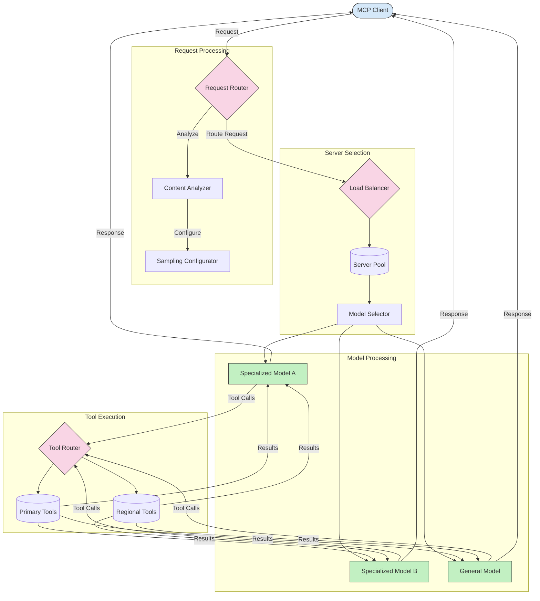

<!--
CO_OP_TRANSLATOR_METADATA:
{
  "original_hash": "af40eab7bd6ebf7e607f982a5506a5b5",
  "translation_date": "2025-06-12T21:59:45+00:00",
  "source_file": "05-AdvancedTopics/mcp-routing/README.md",
  "language_code": "fa"
}
-->
## معماری نمونه‌گیری و مسیردهی در MCP

نمونه‌گیری یک بخش حیاتی از پروتکل مدل کانتکست (MCP) است که امکان پردازش و مسیردهی بهینه درخواست‌ها را فراهم می‌کند. این فرایند شامل تحلیل درخواست‌های ورودی برای تعیین مناسب‌ترین مدل یا سرویس برای پاسخگویی به آن‌ها بر اساس معیارهای مختلفی مانند نوع محتوا، زمینه کاربر و بار سیستم است.

نمونه‌گیری و مسیردهی می‌توانند با هم ترکیب شوند تا معماری قدرتمندی ایجاد کنند که بهینه‌سازی استفاده از منابع و تضمین دسترسی بالا را ممکن سازد. فرایند نمونه‌گیری می‌تواند برای طبقه‌بندی درخواست‌ها استفاده شود، در حالی که مسیردهی آن‌ها را به مدل‌ها یا سرویس‌های مناسب هدایت می‌کند.

نمودار زیر نشان می‌دهد که چگونه نمونه‌گیری و مسیردهی در یک معماری جامع MCP با هم کار می‌کنند:

## مرحله بعدی

- [5.6 نمونه‌گیری](../mcp-sampling/README.md)

**سلب مسئولیت**:  
این سند با استفاده از سرویس ترجمه هوش مصنوعی [Co-op Translator](https://github.com/Azure/co-op-translator) ترجمه شده است. در حالی که ما برای دقت تلاش می‌کنیم، لطفاً توجه داشته باشید که ترجمه‌های خودکار ممکن است حاوی اشتباهات یا نواقصی باشند. سند اصلی به زبان بومی خود باید به عنوان منبع معتبر در نظر گرفته شود. برای اطلاعات حیاتی، ترجمه حرفه‌ای انسانی توصیه می‌شود. ما مسئول هیچ گونه سوءتفاهم یا برداشت نادرستی که ناشی از استفاده از این ترجمه باشد، نیستیم.