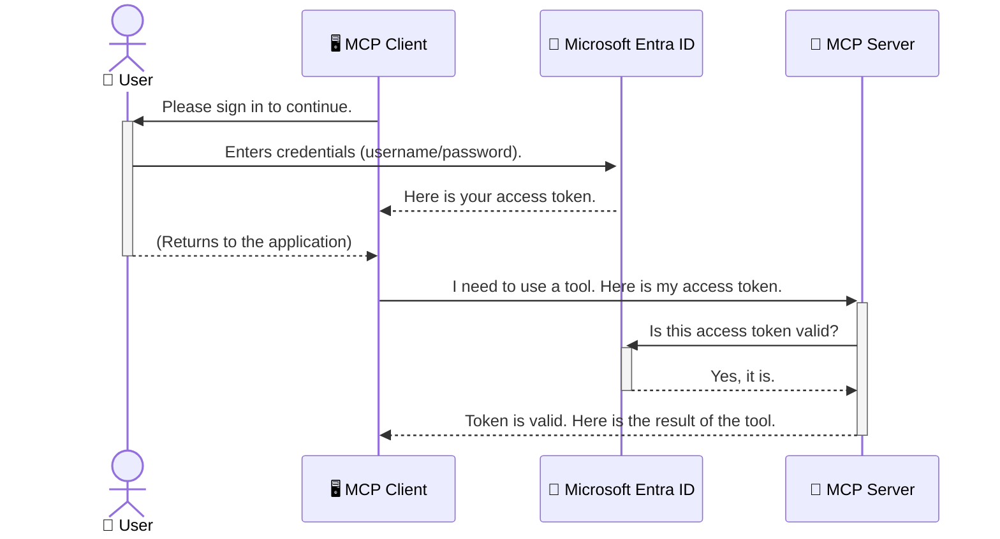

<!--
CO_OP_TRANSLATOR_METADATA:
{
  "original_hash": "6e562d7e5a77c8982da4aa8f762ad1d8",
  "translation_date": "2025-07-14T02:49:37+00:00",
  "source_file": "05-AdvancedTopics/mcp-security-entra/README.md",
  "language_code": "fa"
}
-->
# ایمن‌سازی جریان‌های کاری هوش مصنوعی: احراز هویت Entra ID برای سرورهای پروتکل مدل کانتکست

## مقدمه  
ایمن نگه داشتن سرور پروتکل مدل کانتکست (MCP) به اندازه قفل کردن در ورودی خانه‌تان اهمیت دارد. باز گذاشتن سرور MCP شما، ابزارها و داده‌هایتان را در معرض دسترسی غیرمجاز قرار می‌دهد که می‌تواند منجر به نقض امنیت شود. Microsoft Entra ID یک راهکار قدرتمند مدیریت هویت و دسترسی مبتنی بر ابر ارائه می‌دهد که تضمین می‌کند تنها کاربران و برنامه‌های مجاز بتوانند با سرور MCP شما تعامل داشته باشند. در این بخش، خواهید آموخت چگونه با استفاده از احراز هویت Entra ID، جریان‌های کاری هوش مصنوعی خود را محافظت کنید.

## اهداف یادگیری  
تا پایان این بخش، قادر خواهید بود:

- اهمیت ایمن‌سازی سرورهای MCP را درک کنید.  
- اصول پایه Microsoft Entra ID و احراز هویت OAuth 2.0 را توضیح دهید.  
- تفاوت بین کلاینت‌های عمومی و محرمانه را تشخیص دهید.  
- احراز هویت Entra ID را در سناریوهای سرور MCP محلی (کلاینت عمومی) و راه دور (کلاینت محرمانه) پیاده‌سازی کنید.  
- بهترین شیوه‌های امنیتی را هنگام توسعه جریان‌های کاری هوش مصنوعی به کار ببرید.

## امنیت و MCP  

همانطور که در ورودی خانه‌تان را باز نمی‌گذارید، نباید سرور MCP خود را برای دسترسی هر کسی باز بگذارید. ایمن‌سازی جریان‌های کاری هوش مصنوعی برای ساخت برنامه‌های مقاوم، قابل اعتماد و ایمن ضروری است. این فصل شما را با استفاده از Microsoft Entra ID برای ایمن‌سازی سرورهای MCP آشنا می‌کند تا فقط کاربران و برنامه‌های مجاز بتوانند به ابزارها و داده‌های شما دسترسی داشته باشند.

## چرا امنیت برای سرورهای MCP اهمیت دارد  

تصور کنید سرور MCP شما ابزاری دارد که می‌تواند ایمیل ارسال کند یا به پایگاه داده مشتریان دسترسی پیدا کند. سرور بدون امنیت به این معنی است که هر کسی می‌تواند از آن ابزار استفاده کند که منجر به دسترسی غیرمجاز به داده‌ها، ارسال هرزنامه یا فعالیت‌های مخرب دیگر می‌شود.

با پیاده‌سازی احراز هویت، اطمینان حاصل می‌کنید که هر درخواست به سرور شما تأیید شده است و هویت کاربر یا برنامه درخواست‌کننده را تأیید می‌کند. این اولین و مهم‌ترین گام در ایمن‌سازی جریان‌های کاری هوش مصنوعی شماست.

## معرفی Microsoft Entra ID  

[**Microsoft Entra ID**](https://adoption.microsoft.com/microsoft-security/entra/) یک سرویس مدیریت هویت و دسترسی مبتنی بر ابر است. آن را مانند یک نگهبان امنیتی جهانی برای برنامه‌های خود تصور کنید. این سرویس فرآیند پیچیده تأیید هویت کاربران (احراز هویت) و تعیین مجوزهای آن‌ها (مجوزدهی) را مدیریت می‌کند.

با استفاده از Entra ID می‌توانید:

- ورود امن کاربران را فعال کنید.  
- از APIها و سرویس‌ها محافظت کنید.  
- سیاست‌های دسترسی را از یک نقطه مرکزی مدیریت کنید.

برای سرورهای MCP، Entra ID راهکاری قدرتمند و مورد اعتماد برای مدیریت دسترسی به قابلیت‌های سرور شما فراهم می‌کند.

---

## درک جادوی کار: نحوه عملکرد احراز هویت Entra ID  

Entra ID از استانداردهای باز مانند **OAuth 2.0** برای مدیریت احراز هویت استفاده می‌کند. اگرچه جزئیات ممکن است پیچیده باشد، مفهوم اصلی ساده است و می‌توان آن را با یک تشبیه فهمید.

### معرفی ساده OAuth 2.0: کلید پارکینگ  

OAuth 2.0 را مانند یک سرویس پارکینگ برای ماشین خود در نظر بگیرید. وقتی به رستوران می‌رسید، کلید اصلی ماشین خود را به پارکبان نمی‌دهید. در عوض، یک **کلید پارکینگ** می‌دهید که دسترسی محدودی دارد — می‌تواند ماشین را روشن کند و درها را قفل کند، اما نمی‌تواند صندوق عقب یا داشبورد را باز کند.

در این تشبیه:

- **شما** همان **کاربر** هستید.  
- **ماشین شما** همان **سرور MCP** با ابزارها و داده‌های ارزشمندش است.  
- **پارکبان** همان **Microsoft Entra ID** است.  
- **نگهبان پارکینگ** همان **کلاینت MCP** (برنامه‌ای که می‌خواهد به سرور دسترسی پیدا کند) است.  
- **کلید پارکینگ** همان **توکن دسترسی** است.

توکن دسترسی رشته‌ای امن از متن است که کلاینت MCP پس از ورود شما از Entra ID دریافت می‌کند. سپس کلاینت این توکن را با هر درخواست به سرور MCP ارائه می‌دهد. سرور می‌تواند توکن را تأیید کند تا اطمینان حاصل شود درخواست معتبر است و کلاینت مجوزهای لازم را دارد، بدون اینکه نیازی به مدیریت مستقیم اطلاعات ورود شما (مانند رمز عبور) باشد.

### جریان احراز هویت  

نحوه عملکرد این فرآیند به صورت عملی:



### معرفی کتابخانه احراز هویت مایکروسافت (MSAL)  

قبل از ورود به کد، مهم است که یک جزء کلیدی که در مثال‌ها خواهید دید را معرفی کنیم: **کتابخانه احراز هویت مایکروسافت (MSAL)**.

MSAL کتابخانه‌ای است که توسط مایکروسافت توسعه یافته و کار توسعه‌دهندگان را برای مدیریت احراز هویت بسیار آسان‌تر می‌کند. به جای اینکه خودتان کد پیچیده مدیریت توکن‌های امنیتی، ورود کاربران و تازه‌سازی نشست‌ها را بنویسید، MSAL این کارها را انجام می‌دهد.

استفاده از کتابخانه‌ای مانند MSAL به شدت توصیه می‌شود زیرا:

- **امن است:** پروتکل‌ها و بهترین شیوه‌های امنیتی استاندارد صنعت را پیاده‌سازی می‌کند و ریسک آسیب‌پذیری‌ها را کاهش می‌دهد.  
- **توسعه را ساده می‌کند:** پیچیدگی‌های پروتکل‌های OAuth 2.0 و OpenID Connect را پنهان می‌کند و به شما اجازه می‌دهد با چند خط کد احراز هویت قدرتمند به برنامه خود اضافه کنید.  
- **نگهداری می‌شود:** مایکروسافت به طور فعال MSAL را به‌روزرسانی می‌کند تا تهدیدات امنیتی جدید و تغییرات پلتفرم را پوشش دهد.

MSAL از زبان‌ها و چارچوب‌های متنوعی مانند .NET، JavaScript/TypeScript، Python، Java، Go و پلتفرم‌های موبایل مانند iOS و Android پشتیبانی می‌کند. این یعنی می‌توانید الگوهای احراز هویت یکسانی را در کل فناوری خود به کار ببرید.

برای اطلاعات بیشتر درباره MSAL، می‌توانید مستندات رسمی [بررسی کلی MSAL](https://learn.microsoft.com/entra/identity-platform/msal-overview) را مطالعه کنید.

---

## ایمن‌سازی سرور MCP با Entra ID: راهنمای گام به گام  

حالا بیایید ببینیم چگونه یک سرور MCP محلی (که از طریق `stdio` ارتباط برقرار می‌کند) را با استفاده از Entra ID ایمن کنیم. این مثال از یک **کلاینت عمومی** استفاده می‌کند که برای برنامه‌هایی که روی دستگاه کاربر اجرا می‌شوند، مانند برنامه دسکتاپ یا سرور توسعه محلی، مناسب است.

### سناریو ۱: ایمن‌سازی سرور MCP محلی (با کلاینت عمومی)  

در این سناریو، سرور MCP به صورت محلی اجرا می‌شود، از طریق `stdio` ارتباط برقرار می‌کند و از Entra ID برای احراز هویت کاربر قبل از اجازه دسترسی به ابزارهایش استفاده می‌کند. سرور یک ابزار دارد که اطلاعات پروفایل کاربر را از Microsoft Graph API دریافت می‌کند.

#### ۱. راه‌اندازی برنامه در Entra ID  

قبل از نوشتن کد، باید برنامه خود را در Microsoft Entra ID ثبت کنید. این کار به Entra ID اطلاع می‌دهد که برنامه شما وجود دارد و اجازه استفاده از سرویس احراز هویت را می‌دهد.

1. به **[پورتال Microsoft Entra](https://entra.microsoft.com/)** بروید.  
2. به بخش **App registrations** رفته و روی **New registration** کلیک کنید.  
3. به برنامه خود یک نام بدهید (مثلاً "My Local MCP Server").  
4. برای **Supported account types** گزینه **Accounts in this organizational directory only** را انتخاب کنید.  
5. می‌توانید برای این مثال، **Redirect URI** را خالی بگذارید.  
6. روی **Register** کلیک کنید.

پس از ثبت، شناسه‌های **Application (client) ID** و **Directory (tenant) ID** را یادداشت کنید. این‌ها را در کد خود نیاز خواهید داشت.

#### ۲. کد: بررسی اجزای کلیدی  

بیایید بخش‌های اصلی کد که احراز هویت را مدیریت می‌کنند بررسی کنیم. کد کامل این مثال در پوشه [Entra ID - Local - WAM](https://github.com/Azure-Samples/mcp-auth-servers/tree/main/src/entra-id-local-wam) در مخزن [mcp-auth-servers GitHub](https://github.com/Azure-Samples/mcp-auth-servers) موجود است.

**`AuthenticationService.cs`**

این کلاس مسئول مدیریت تعامل با Entra ID است.

- **`CreateAsync`**: این متد `PublicClientApplication` از MSAL را مقداردهی اولیه می‌کند. این کلاس با `clientId` و `tenantId` برنامه شما پیکربندی شده است.  
- **`WithBroker`**: این امکان استفاده از یک بروکر (مانند Windows Web Account Manager) را فعال می‌کند که تجربه ورود یکپارچه و امن‌تری فراهم می‌کند.  
- **`AcquireTokenAsync`**: متد اصلی است. ابتدا تلاش می‌کند توکن را به صورت بی‌صدا دریافت کند (یعنی اگر کاربر قبلاً وارد شده باشد، نیازی به ورود مجدد نیست). اگر توکن بی‌صدا قابل دریافت نباشد، کاربر را برای ورود تعاملی راهنمایی می‌کند.

```csharp
// Simplified for clarity
public static async Task<AuthenticationService> CreateAsync(ILogger<AuthenticationService> logger)
{
    var msalClient = PublicClientApplicationBuilder
        .Create(_clientId) // Your Application (client) ID
        .WithAuthority(AadAuthorityAudience.AzureAdMyOrg)
        .WithTenantId(_tenantId) // Your Directory (tenant) ID
        .WithBroker(new BrokerOptions(BrokerOptions.OperatingSystems.Windows))
        .Build();

    // ... cache registration ...

    return new AuthenticationService(logger, msalClient);
}

public async Task<string> AcquireTokenAsync()
{
    try
    {
        // Try silent authentication first
        var accounts = await _msalClient.GetAccountsAsync();
        var account = accounts.FirstOrDefault();

        AuthenticationResult? result = null;

        if (account != null)
        {
            result = await _msalClient.AcquireTokenSilent(_scopes, account).ExecuteAsync();
        }
        else
        {
            // If no account, or silent fails, go interactive
            result = await _msalClient.AcquireTokenInteractive(_scopes).ExecuteAsync();
        }

        return result.AccessToken;
    }
    catch (Exception ex)
    {
        _logger.LogError(ex, "An error occurred while acquiring the token.");
        throw; // Optionally rethrow the exception for higher-level handling
    }
}
```

**`Program.cs`**

در اینجا سرور MCP راه‌اندازی شده و سرویس احراز هویت یکپارچه می‌شود.

- **`AddSingleton<AuthenticationService>`**: این سرویس را در کانتینر تزریق وابستگی ثبت می‌کند تا بخش‌های دیگر برنامه (مانند ابزار ما) بتوانند از آن استفاده کنند.  
- ابزار **`GetUserDetailsFromGraph`**: این ابزار به نمونه‌ای از `AuthenticationService` نیاز دارد. قبل از انجام هر کاری، متد `authService.AcquireTokenAsync()` را فراخوانی می‌کند تا توکن دسترسی معتبر دریافت کند. اگر احراز هویت موفق باشد، از توکن برای فراخوانی Microsoft Graph API و دریافت جزئیات کاربر استفاده می‌کند.

```csharp
// Simplified for clarity
[McpServerTool(Name = "GetUserDetailsFromGraph")]
public static async Task<string> GetUserDetailsFromGraph(
    AuthenticationService authService)
{
    try
    {
        // This will trigger the authentication flow
        var accessToken = await authService.AcquireTokenAsync();

        // Use the token to create a GraphServiceClient
        var graphClient = new GraphServiceClient(
            new BaseBearerTokenAuthenticationProvider(new TokenProvider(authService)));

        var user = await graphClient.Me.GetAsync();

        return System.Text.Json.JsonSerializer.Serialize(user);
    }
    catch (Exception ex)
    {
        return $"Error: {ex.Message}";
    }
}
```

#### ۳. نحوه عملکرد کلی  

1. وقتی کلاینت MCP می‌خواهد از ابزار `GetUserDetailsFromGraph` استفاده کند، ابتدا این ابزار `AcquireTokenAsync` را فراخوانی می‌کند.  
2. `AcquireTokenAsync` کتابخانه MSAL را برای بررسی وجود توکن معتبر فعال می‌کند.  
3. اگر توکنی یافت نشود، MSAL از طریق بروکر کاربر را برای ورود با حساب Entra ID راهنمایی می‌کند.  
4. پس از ورود کاربر، Entra ID توکن دسترسی صادر می‌کند.  
5. ابزار توکن را دریافت کرده و از آن برای فراخوانی امن Microsoft Graph API استفاده می‌کند.  
6. جزئیات کاربر به کلاینت MCP بازگردانده می‌شود.

این فرآیند تضمین می‌کند که تنها کاربران احراز هویت شده می‌توانند از ابزار استفاده کنند و به این ترتیب سرور MCP محلی شما به طور مؤثر ایمن می‌شود.

### سناریو ۲: ایمن‌سازی سرور MCP راه دور (با کلاینت محرمانه)  

وقتی سرور MCP شما روی یک ماشین راه دور (مانند سرور ابری) اجرا می‌شود و از پروتکلی مانند HTTP Streaming استفاده می‌کند، نیازهای امنیتی متفاوت است. در این حالت باید از **کلاینت محرمانه** و **Authorization Code Flow** استفاده کنید. این روش امن‌تر است چون اسرار برنامه هرگز در مرورگر افشا نمی‌شود.

این مثال از یک سرور MCP مبتنی بر TypeScript استفاده می‌کند که با Express.js درخواست‌های HTTP را مدیریت می‌کند.

#### ۱. راه‌اندازی برنامه در Entra ID  

تنظیمات در Entra ID مشابه کلاینت عمومی است، اما با یک تفاوت کلیدی: باید یک **client secret** ایجاد کنید.

1. به **[پورتال Microsoft Entra](https://entra.microsoft.com/)** بروید.  
2. در ثبت برنامه خود، به تب **Certificates & secrets** بروید.  
3. روی **New client secret** کلیک کنید، توضیحی وارد کنید و روی **Add** کلیک کنید.  
4. **مهم:** مقدار secret را فوراً کپی کنید. بعداً نمی‌توانید آن را ببینید.  
5. همچنین باید یک **Redirect URI** پیکربندی کنید. به تب **Authentication** بروید، روی **Add a platform** کلیک کنید، گزینه **Web** را انتخاب کرده و URI بازگشت برنامه خود را وارد کنید (مثلاً `http://localhost:3001/auth/callback`).

> **⚠️ نکته مهم امنیتی:** برای برنامه‌های تولیدی، مایکروسافت به شدت توصیه می‌کند از روش‌های احراز هویت بدون استفاده از secret مانند **Managed Identity** یا **Workload Identity Federation** به جای client secret استفاده کنید. client secretها ریسک امنیتی دارند چون ممکن است افشا یا به خطر بیفتند. Managed identityها رویکرد امن‌تری هستند چون نیازی به ذخیره اعتبارنامه‌ها در کد یا پیکربندی شما ندارند.  
>  
> برای اطلاعات بیشتر درباره managed identityها و نحوه پیاده‌سازی آن‌ها، به [مروری بر Managed identities برای منابع Azure](https://learn.microsoft.com/entra/identity/managed-identities-azure-resources/overview) مراجعه کنید.

#### ۲. کد: بررسی اجزای کلیدی  

این مثال از رویکرد مبتنی بر نشست (session) استفاده می‌کند. وقتی کاربر احراز هویت می‌شود، سرور توکن دسترسی و توکن تازه‌سازی را در نشست ذخیره می‌کند و به کاربر یک توکن نشست می‌دهد. این توکن نشست برای درخواست‌های بعدی استفاده می‌شود. کد کامل این مثال در پوشه [Entra ID - Confidential client](https://github.com/Azure-Samples/mcp-auth-servers/tree/main/src/entra-id-cca-session) در مخزن [mcp-auth-servers GitHub](https://github.com/Azure-Samples/mcp-auth-servers) موجود است.

**`Server.ts`**

این فایل سرور Express و لایه انتقال MCP را راه‌اندازی می‌کند.

- **`requireBearerAuth`**: این یک middleware است که از نقاط انتهایی `/sse` و `/message` محافظت می‌کند. این middleware وجود توکن bearer معتبر در هدر `Authorization` درخواست را بررسی می‌کند.  
- **`EntraIdServerAuthProvider`**: این یک کلاس سفارشی است که رابط `McpServerAuthorizationProvider` را پیاده‌سازی می‌کند. مسئول مدیریت جریان OAuth 2.0 است.  
- **`/auth/callback`**: این نقطه انتهایی، بازگشت از Entra ID پس از احراز هویت کاربر را مدیریت می‌کند. کد مجوز را با توکن دسترسی و توکن تازه‌سازی مبادله می‌کند.

```typescript
// Simplified for clarity
const app = express();
const { server } = createServer();
const provider = new EntraIdServerAuthProvider();

// Protect the SSE endpoint
app.get("/sse", requireBearerAuth({
  provider,
  requiredScopes: ["User.Read"]
}), async (req, res) => {
  // ... connect to the transport ...
});

// Protect the message endpoint
app.post("/message", requireBearerAuth({
  provider,
  requiredScopes: ["User.Read"]
}), async (req, res) => {
  // ... handle the message ...
});

// Handle the OAuth 2.0 callback
app.get("/auth/callback", (req, res) => {
  provider.handleCallback(req.query.code, req.query.state)
    .then(result => {
      // ... handle success or failure ...
    });
});
```

**`Tools.ts`**

این فایل ابزارهایی را که سرور MCP ارائه می‌دهد تعریف می‌کند. ابزار `getUserDetails` مشابه نمونه قبلی است، اما توکن دسترسی را از نشست دریافت می‌کند.

```typescript
// Simplified for clarity
server.setRequestHandler(CallToolRequestSchema, async (request) => {
  const { name } = request.params;
  const context = request.params?.context as { token?: string } | undefined;
  const sessionToken = context?.token;

  if (name === ToolName.GET_USER_DETAILS) {
    if (!sessionToken) {
      throw new AuthenticationError("Authentication token is missing or invalid. Ensure the token is provided in the request context.");
    }

    // Get the Entra ID token from the session store
    const tokenData = tokenStore.getToken(sessionToken);
    const entraIdToken = tokenData.accessToken;

    const graphClient = Client.init({
      authProvider: (done) => {
        done(null, entraIdToken);
      }
    });

    const user = await graphClient.api('/me').get();

    // ... return user details ...
  }
});
```

**`auth/EntraIdServerAuthProvider.ts`**

این کلاس منطق زیر را مدیریت می‌کند:

- هدایت کاربر به صفحه ورود Entra ID.  
- مبادله کد مجوز با توکن دسترسی.  
- ذخیره توکن‌ها در `tokenStore`.  
- تازه‌سازی توکن دسترسی هنگام انقضا.

#### ۳. نحوه عملکرد کلی  

1. وقتی کاربر برای اولین بار تلاش می‌کند به سرور MCP متصل شود، middleware `requireBearerAuth` می‌بیند که نشست معتبری ندارد و او را به صفحه ورود Entra ID هدایت می‌کند.  
2. کاربر با حساب Entra ID خود وارد می‌شود.  
3. Entra ID کاربر را به نقطه انتهایی `/auth/callback` با کد مجوز هدایت می‌کند.
4. سرور کد را با یک access token و یک refresh token مبادله می‌کند، آن‌ها را ذخیره می‌کند و یک session token ایجاد می‌کند که به کلاینت ارسال می‌شود.  
5. کلاینت اکنون می‌تواند از این session token در هدر `Authorization` برای همه درخواست‌های بعدی به سرور MCP استفاده کند.  
6. وقتی ابزار `getUserDetails` فراخوانی می‌شود، از session token برای یافتن access token مربوط به Entra ID استفاده می‌کند و سپس با آن به Microsoft Graph API فراخوانی می‌زند.

این روند نسبت به جریان کلاینت عمومی پیچیده‌تر است، اما برای نقاط انتهایی که در معرض اینترنت قرار دارند ضروری است. از آنجا که سرورهای MCP راه دور از طریق اینترنت عمومی قابل دسترسی هستند، نیاز به تدابیر امنیتی قوی‌تری برای محافظت در برابر دسترسی غیرمجاز و حملات احتمالی دارند.

## بهترین شیوه‌های امنیتی

- **همیشه از HTTPS استفاده کنید**: ارتباط بین کلاینت و سرور را رمزنگاری کنید تا توکن‌ها در برابر رهگیری محافظت شوند.  
- **اجرای کنترل دسترسی مبتنی بر نقش (RBAC)**: فقط بررسی نکنید که کاربر احراز هویت شده است؛ بلکه بررسی کنید که چه مجوزهایی دارد. می‌توانید نقش‌ها را در Entra ID تعریف کرده و در سرور MCP خود آن‌ها را بررسی کنید.  
- **نظارت و حسابرسی**: همه رویدادهای احراز هویت را ثبت کنید تا بتوانید فعالیت‌های مشکوک را شناسایی و پاسخ دهید.  
- **مدیریت محدودیت نرخ و کنترل بار**: Microsoft Graph و سایر APIها محدودیت نرخ را برای جلوگیری از سوءاستفاده اعمال می‌کنند. در سرور MCP خود مکانیزم backoff نمایی و منطق تکرار را پیاده‌سازی کنید تا پاسخ‌های HTTP 429 (درخواست‌های بیش از حد) را به‌خوبی مدیریت کنید. همچنین می‌توانید داده‌های پر استفاده را کش کنید تا تعداد تماس‌های API کاهش یابد.  
- **ذخیره‌سازی امن توکن‌ها**: access token و refresh token را به‌صورت امن ذخیره کنید. برای برنامه‌های محلی از مکانیزم‌های ذخیره‌سازی امن سیستم استفاده کنید. برای برنامه‌های سروری، استفاده از ذخیره‌سازی رمزنگاری شده یا سرویس‌های مدیریت کلید امن مانند Azure Key Vault را در نظر بگیرید.  
- **مدیریت انقضای توکن**: access tokenها عمر محدودی دارند. با استفاده از refresh tokenها، به‌صورت خودکار توکن‌ها را تازه کنید تا تجربه کاربری بدون نیاز به احراز هویت مجدد حفظ شود.  
- **استفاده از Azure API Management را در نظر بگیرید**: در حالی که پیاده‌سازی امنیت مستقیماً در سرور MCP کنترل دقیق‌تری به شما می‌دهد، API Gatewayهایی مانند Azure API Management می‌توانند بسیاری از این مسائل امنیتی را به‌صورت خودکار مدیریت کنند، از جمله احراز هویت، مجوزدهی، محدودیت نرخ و نظارت. آن‌ها یک لایه امنیتی متمرکز بین کلاینت‌ها و سرورهای MCP شما فراهم می‌کنند. برای جزئیات بیشتر درباره استفاده از API Gatewayها با MCP، به [Azure API Management Your Auth Gateway For MCP Servers](https://techcommunity.microsoft.com/blog/integrationsonazureblog/azure-api-management-your-auth-gateway-for-mcp-servers/4402690) مراجعه کنید.

## نکات کلیدی

- ایمن‌سازی سرور MCP برای حفاظت از داده‌ها و ابزارهای شما حیاتی است.  
- Microsoft Entra ID راه‌حلی قوی و مقیاس‌پذیر برای احراز هویت و مجوزدهی ارائه می‌دهد.  
- برای برنامه‌های محلی از **public client** و برای سرورهای راه دور از **confidential client** استفاده کنید.  
- **Authorization Code Flow** امن‌ترین گزینه برای برنامه‌های وب است.

## تمرین

1. به سرور MCP که ممکن است بسازید فکر کنید. آیا سرور محلی خواهد بود یا راه دور؟  
2. بر اساس پاسخ خود، از public client استفاده می‌کنید یا confidential client؟  
3. سرور MCP شما چه مجوزهایی را برای انجام عملیات روی Microsoft Graph درخواست خواهد کرد؟

## تمرین‌های عملی

### تمرین ۱: ثبت یک برنامه در Entra ID  
به پورتال Microsoft Entra بروید.  
یک برنامه جدید برای سرور MCP خود ثبت کنید.  
شناسه برنامه (client ID) و شناسه دایرکتوری (tenant ID) را یادداشت کنید.

### تمرین ۲: ایمن‌سازی سرور MCP محلی (Public Client)  
- از مثال کد برای ادغام MSAL (Microsoft Authentication Library) جهت احراز هویت کاربر استفاده کنید.  
- جریان احراز هویت را با فراخوانی ابزار MCP که جزئیات کاربر را از Microsoft Graph می‌گیرد، تست کنید.

### تمرین ۳: ایمن‌سازی سرور MCP راه دور (Confidential Client)  
- یک confidential client در Entra ID ثبت کرده و یک client secret ایجاد کنید.  
- سرور MCP مبتنی بر Express.js خود را برای استفاده از Authorization Code Flow پیکربندی کنید.  
- نقاط انتهایی محافظت شده را تست کرده و دسترسی مبتنی بر توکن را تأیید کنید.

### تمرین ۴: اعمال بهترین شیوه‌های امنیتی  
- HTTPS را برای سرور محلی یا راه دور خود فعال کنید.  
- کنترل دسترسی مبتنی بر نقش (RBAC) را در منطق سرور خود پیاده‌سازی کنید.  
- مدیریت انقضای توکن و ذخیره‌سازی امن توکن‌ها را اضافه کنید.

## منابع

1. **مستندات کلی MSAL**  
   یاد بگیرید چگونه Microsoft Authentication Library (MSAL) امکان دریافت امن توکن را در پلتفرم‌های مختلف فراهم می‌کند:  
   [MSAL Overview on Microsoft Learn](https://learn.microsoft.com/en-gb/entra/msal/overview)

2. **مخزن GitHub Azure-Samples/mcp-auth-servers**  
   پیاده‌سازی‌های نمونه سرورهای MCP که جریان‌های احراز هویت را نشان می‌دهند:  
   [Azure-Samples/mcp-auth-servers on GitHub](https://github.com/Azure-Samples/mcp-auth-servers)

3. **مروری بر Managed Identities برای منابع Azure**  
   نحوه حذف نیاز به اسرار با استفاده از managed identities اختصاص داده شده به سیستم یا کاربر را بیاموزید:  
   [Managed Identities Overview on Microsoft Learn](https://learn.microsoft.com/en-us/entra/identity/managed-identities-azure-resources/)

4. **Azure API Management: دروازه احراز هویت شما برای سرورهای MCP**  
   بررسی عمیق استفاده از APIM به عنوان دروازه امن OAuth2 برای سرورهای MCP:  
   [Azure API Management Your Auth Gateway For MCP Servers](https://techcommunity.microsoft.com/blog/integrationsonazureblog/azure-api-management-your-auth-gateway-for-mcp-servers/4402690)

5. **مرجع مجوزهای Microsoft Graph**  
   فهرست کامل مجوزهای واگذار شده و برنامه‌ای برای Microsoft Graph:  
   [Microsoft Graph Permissions Reference](https://learn.microsoft.com/zh-tw/graph/permissions-reference)

## نتایج یادگیری  
پس از اتمام این بخش، قادر خواهید بود:

- توضیح دهید چرا احراز هویت برای سرورهای MCP و جریان‌های کاری هوش مصنوعی حیاتی است.  
- احراز هویت Entra ID را برای سناریوهای سرور MCP محلی و راه دور راه‌اندازی و پیکربندی کنید.  
- نوع کلاینت مناسب (public یا confidential) را بر اساس نحوه استقرار سرور خود انتخاب کنید.  
- شیوه‌های برنامه‌نویسی امن از جمله ذخیره‌سازی توکن و مجوزدهی مبتنی بر نقش را پیاده‌سازی کنید.  
- با اطمینان سرور MCP و ابزارهای آن را در برابر دسترسی غیرمجاز محافظت کنید.

## مرحله بعدی

- [5.13 ادغام پروتکل مدل کانتکست (MCP) با Azure AI Foundry](../mcp-foundry-agent-integration/README.md)

**سلب مسئولیت**:  
این سند با استفاده از سرویس ترجمه هوش مصنوعی [Co-op Translator](https://github.com/Azure/co-op-translator) ترجمه شده است. در حالی که ما در تلاش برای دقت هستیم، لطفاً توجه داشته باشید که ترجمه‌های خودکار ممکن است حاوی خطاها یا نادرستی‌هایی باشند. سند اصلی به زبان بومی خود باید به عنوان منبع معتبر در نظر گرفته شود. برای اطلاعات حیاتی، ترجمه حرفه‌ای انسانی توصیه می‌شود. ما مسئول هیچ گونه سوءتفاهم یا تفسیر نادرستی که از استفاده این ترجمه ناشی شود، نیستیم.