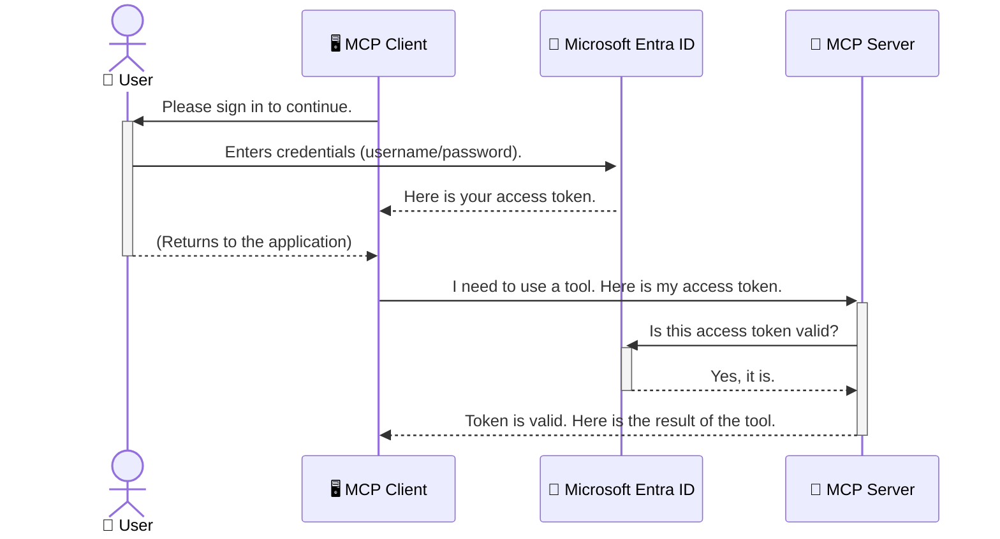

<!--
CO_OP_TRANSLATOR_METADATA:
{
  "original_hash": "6e562d7e5a77c8982da4aa8f762ad1d8",
  "translation_date": "2025-07-02T08:56:26+00:00",
  "source_file": "05-AdvancedTopics/mcp-security-entra/README.md",
  "language_code": "fa"
}
-->
# ایمن‌سازی گردش‌کارهای هوش مصنوعی: احراز هویت Entra ID برای سرورهای پروتکل مدل کانتکست

## مقدمه  
ایمن نگه داشتن سرور Model Context Protocol (MCP) به اندازه قفل کردن در ورودی خانه‌تان اهمیت دارد. باز گذاشتن سرور MCP ابزارها و داده‌های شما را در معرض دسترسی غیرمجاز قرار می‌دهد که می‌تواند به نفوذهای امنیتی منجر شود. مایکروسافت Entra ID یک راهکار قدرتمند مدیریت هویت و دسترسی مبتنی بر ابر ارائه می‌دهد که تضمین می‌کند تنها کاربران و برنامه‌های مجاز قادر به تعامل با سرور MCP شما باشند. در این بخش، یاد می‌گیرید چگونه گردش‌کارهای هوش مصنوعی خود را با استفاده از احراز هویت Entra ID محافظت کنید.

## اهداف یادگیری  
تا پایان این بخش، قادر خواهید بود:

- اهمیت ایمن‌سازی سرورهای MCP را درک کنید.  
- اصول اولیه Microsoft Entra ID و احراز هویت OAuth 2.0 را توضیح دهید.  
- تفاوت بین کلاینت‌های عمومی و محرمانه را تشخیص دهید.  
- احراز هویت Entra ID را در سناریوهای سرور MCP محلی (کلاینت عمومی) و راه‌دور (کلاینت محرمانه) پیاده‌سازی کنید.  
- بهترین روش‌های امنیتی را هنگام توسعه گردش‌کارهای هوش مصنوعی به کار ببرید.

## امنیت و MCP  

همانطور که درِ خانه‌تان را باز نمی‌گذارید، نباید سرور MCP خود را بدون محافظت در دسترس همه قرار دهید. ایمن‌سازی گردش‌کارهای هوش مصنوعی برای ساخت برنامه‌های قابل اعتماد، مقاوم و ایمن ضروری است. این فصل به شما نشان می‌دهد چگونه با استفاده از Microsoft Entra ID سرورهای MCP خود را ایمن کنید تا فقط کاربران و برنامه‌های مجاز بتوانند با ابزارها و داده‌های شما تعامل داشته باشند.

## چرا امنیت برای سرورهای MCP اهمیت دارد  

تصور کنید سرور MCP شما ابزاری دارد که می‌تواند ایمیل ارسال کند یا به پایگاه داده مشتریان دسترسی پیدا کند. یک سرور بدون امنیت به این معنی است که هر کسی می‌تواند از آن ابزار استفاده کند و این می‌تواند منجر به دسترسی غیرمجاز به داده‌ها، ارسال هرزنامه یا فعالیت‌های مخرب دیگر شود.

با پیاده‌سازی احراز هویت، اطمینان حاصل می‌کنید که هر درخواست به سرور شما تأیید شده است و هویت کاربر یا برنامه درخواست‌کننده تایید می‌شود. این اولین و مهم‌ترین گام برای ایمن‌سازی گردش‌کارهای هوش مصنوعی شماست.

## معرفی Microsoft Entra ID  

[**Microsoft Entra ID**](https://adoption.microsoft.com/microsoft-security/entra/) یک سرویس مدیریت هویت و دسترسی مبتنی بر ابر است. می‌توانید آن را به عنوان نگهبان امنیتی همه‌کاره برای برنامه‌های خود تصور کنید. این سرویس فرآیند پیچیده تأیید هویت کاربران (احراز هویت) و تعیین مجوزهای آن‌ها (مجوزدهی) را مدیریت می‌کند.

با استفاده از Entra ID، می‌توانید:

- ورود امن کاربران را فعال کنید.  
- از APIها و سرویس‌ها محافظت کنید.  
- سیاست‌های دسترسی را از یک مکان مرکزی مدیریت کنید.

برای سرورهای MCP، Entra ID راهکاری قدرتمند و قابل اعتماد برای مدیریت دسترسی به قابلیت‌های سرور شما ارائه می‌دهد.

---

## درک جادوی کارکرد احراز هویت Entra ID  

Entra ID از استانداردهای باز مانند **OAuth 2.0** برای مدیریت احراز هویت استفاده می‌کند. اگرچه جزئیات ممکن است پیچیده باشد، مفهوم اصلی ساده است و با یک تشبیه قابل درک است.

### معرفی ساده OAuth 2.0: کلید پارکینگ  

OAuth 2.0 را مانند خدمات پارکینگ ماشین تصور کنید. وقتی به رستوران می‌روید، کلید اصلی ماشین خود را به پارکبان نمی‌دهید. بلکه یک **کلید پارکینگ** به او می‌دهید که دسترسی محدودی دارد — می‌تواند ماشین را روشن کند و درها را قفل کند، اما نمی‌تواند صندوق عقب یا داشبورد را باز کند.

در این تشبیه:

- **شما** همان **کاربر** هستید.  
- **ماشین شما** سرور **MCP** با ابزارها و داده‌های ارزشمند است.  
- **پارکبان** همان **Microsoft Entra ID** است.  
- **نگهبان پارکینگ** همان **کلاینت MCP** (برنامه‌ای که می‌خواهد به سرور دسترسی پیدا کند) است.  
- **کلید پارکینگ** همان **توکن دسترسی (Access Token)** است.

توکن دسترسی یک رشته متنی امن است که کلاینت MCP پس از ورود شما از Entra ID دریافت می‌کند. کلاینت این توکن را با هر درخواست به سرور MCP ارائه می‌دهد. سرور می‌تواند توکن را تأیید کند تا مطمئن شود درخواست معتبر است و کلاینت مجوزهای لازم را دارد، بدون اینکه نیاز باشد رمز عبور یا اطلاعات حساس شما را مدیریت کند.

### جریان احراز هویت  

فرآیند به این صورت عمل می‌کند:



### معرفی کتابخانه احراز هویت مایکروسافت (MSAL)  

قبل از ورود به کد، مهم است که یک مؤلفه کلیدی را معرفی کنیم که در مثال‌ها خواهید دید: کتابخانه احراز هویت مایکروسافت (**MSAL**).

MSAL کتابخانه‌ای است که توسط مایکروسافت توسعه یافته و کار توسعه‌دهندگان را برای مدیریت احراز هویت بسیار ساده‌تر می‌کند. به جای اینکه خودتان کد پیچیده مدیریت توکن‌های امنیتی، ورود به سیستم و تازه‌سازی جلسات را بنویسید، MSAL این کارهای سنگین را بر عهده می‌گیرد.

استفاده از کتابخانه‌ای مانند MSAL بسیار توصیه می‌شود زیرا:

- **امن است:** پروتکل‌های استاندارد صنعت و بهترین شیوه‌های امنیتی را پیاده‌سازی می‌کند و ریسک آسیب‌پذیری‌ها را کاهش می‌دهد.  
- **توسعه را ساده می‌کند:** پیچیدگی‌های OAuth 2.0 و OpenID Connect را پنهان می‌کند و به شما اجازه می‌دهد با چند خط کد احراز هویت قدرتمند به برنامه خود اضافه کنید.  
- **به‌روزرسانی می‌شود:** مایکروسافت به‌طور فعال MSAL را برای مقابله با تهدیدات امنیتی جدید و تغییرات پلتفرم به‌روزرسانی می‌کند.

MSAL از زبان‌ها و چارچوب‌های متنوعی مانند .NET، JavaScript/TypeScript، Python، Java، Go و پلتفرم‌های موبایل iOS و Android پشتیبانی می‌کند. این یعنی می‌توانید از الگوهای احراز هویت یکسان در کل فناوری خود استفاده کنید.

برای کسب اطلاعات بیشتر درباره MSAL، می‌توانید مستندات رسمی [MSAL overview documentation](https://learn.microsoft.com/entra/identity-platform/msal-overview) را مطالعه کنید.

---

## ایمن‌سازی سرور MCP با Entra ID: راهنمای گام به گام  

اکنون بیایید نحوه ایمن‌سازی یک سرور MCP محلی (که از طریق `stdio`) using Entra ID. This example uses a **public client**, which is suitable for applications running on a user's machine, like a desktop app or a local development server.

### Scenario 1: Securing a Local MCP Server (with a Public Client)

In this scenario, we'll look at an MCP server that runs locally, communicates over `stdio`, and uses Entra ID to authenticate the user before allowing access to its tools. The server will have a single tool that fetches the user's profile information from the Microsoft Graph API.

#### 1. Setting Up the Application in Entra ID

Before writing any code, you need to register your application in Microsoft Entra ID. This tells Entra ID about your application and grants it permission to use the authentication service.

1. Navigate to the **[Microsoft Entra portal](https://entra.microsoft.com/)**.
2. Go to **App registrations** and click **New registration**.
3. Give your application a name (e.g., "My Local MCP Server").
4. For **Supported account types**, select **Accounts in this organizational directory only**.
5. You can leave the **Redirect URI** blank for this example.
6. Click **Register**.

Once registered, take note of the **Application (client) ID** and **Directory (tenant) ID**. You'll need these in your code.

#### 2. The Code: A Breakdown

Let's look at the key parts of the code that handle authentication. The full code for this example is available in the [Entra ID - Local - WAM](https://github.com/Azure-Samples/mcp-auth-servers/tree/main/src/entra-id-local-wam) folder of the [mcp-auth-servers GitHub repository](https://github.com/Azure-Samples/mcp-auth-servers).

**`AuthenticationService.cs`**

This class is responsible for handling the interaction with Entra ID.

- **`CreateAsync`**: This method initializes the `PublicClientApplication` from the MSAL (Microsoft Authentication Library). It's configured with your application's `clientId` and `tenantId`.
- **`WithBroker`**: This enables the use of a broker (like the Windows Web Account Manager), which provides a more secure and seamless single sign-on experience.
- **`AcquireTokenAsync` ارتباط برقرار می‌کند) را بررسی کنیم: این متد اصلی است. ابتدا سعی می‌کند به صورت بی‌صدا توکن بگیرد (یعنی کاربر نیازی به ورود مجدد نداشته باشد اگر جلسه معتبر قبلاً وجود داشته باشد). اگر توکن بی‌صدا قابل دریافت نباشد، کاربر به صورت تعاملی باید وارد شود.

```csharp
// Simplified for clarity
public static async Task<AuthenticationService> CreateAsync(ILogger<AuthenticationService> logger)
{
    var msalClient = PublicClientApplicationBuilder
        .Create(_clientId) // Your Application (client) ID
        .WithAuthority(AadAuthorityAudience.AzureAdMyOrg)
        .WithTenantId(_tenantId) // Your Directory (tenant) ID
        .WithBroker(new BrokerOptions(BrokerOptions.OperatingSystems.Windows))
        .Build();

    // ... cache registration ...

    return new AuthenticationService(logger, msalClient);
}

public async Task<string> AcquireTokenAsync()
{
    try
    {
        // Try silent authentication first
        var accounts = await _msalClient.GetAccountsAsync();
        var account = accounts.FirstOrDefault();

        AuthenticationResult? result = null;

        if (account != null)
        {
            result = await _msalClient.AcquireTokenSilent(_scopes, account).ExecuteAsync();
        }
        else
        {
            // If no account, or silent fails, go interactive
            result = await _msalClient.AcquireTokenInteractive(_scopes).ExecuteAsync();
        }

        return result.AccessToken;
    }
    catch (Exception ex)
    {
        _logger.LogError(ex, "An error occurred while acquiring the token.");
        throw; // Optionally rethrow the exception for higher-level handling
    }
}
```

**`Program.cs`**

This is where the MCP server is set up and the authentication service is integrated.

- **`AddSingleton<AuthenticationService>`**: This registers the `AuthenticationService` with the dependency injection container, so it can be used by other parts of the application (like our tool).
- **`GetUserDetailsFromGraph` tool**: This tool requires an instance of `AuthenticationService`. Before it does anything, it calls `authService.AcquireTokenAsync()` برای گرفتن توکن دسترسی معتبر استفاده می‌شود. اگر احراز هویت موفق باشد، از توکن برای فراخوانی Microsoft Graph API و دریافت جزئیات کاربر استفاده می‌کند.

```csharp
// Simplified for clarity
[McpServerTool(Name = "GetUserDetailsFromGraph")]
public static async Task<string> GetUserDetailsFromGraph(
    AuthenticationService authService)
{
    try
    {
        // This will trigger the authentication flow
        var accessToken = await authService.AcquireTokenAsync();

        // Use the token to create a GraphServiceClient
        var graphClient = new GraphServiceClient(
            new BaseBearerTokenAuthenticationProvider(new TokenProvider(authService)));

        var user = await graphClient.Me.GetAsync();

        return System.Text.Json.JsonSerializer.Serialize(user);
    }
    catch (Exception ex)
    {
        return $"Error: {ex.Message}";
    }
}
```

#### ۳. نحوه کارکرد همه با هم  

1. وقتی کلاینت MCP سعی می‌کند از متد `GetUserDetailsFromGraph` tool, the tool first calls `AcquireTokenAsync`.
2. `AcquireTokenAsync` triggers the MSAL library to check for a valid token.
3. If no token is found, MSAL, through the broker, will prompt the user to sign in with their Entra ID account.
4. Once the user signs in, Entra ID issues an access token.
5. The tool receives the token and uses it to make a secure call to the Microsoft Graph API.
6. The user's details are returned to the MCP client.

This process ensures that only authenticated users can use the tool, effectively securing your local MCP server.

### Scenario 2: Securing a Remote MCP Server (with a Confidential Client)

When your MCP server is running on a remote machine (like a cloud server) and communicates over a protocol like HTTP Streaming, the security requirements are different. In this case, you should use a **confidential client** and the **Authorization Code Flow**. This is a more secure method because the application's secrets are never exposed to the browser.

This example uses a TypeScript-based MCP server that uses Express.js to handle HTTP requests.

#### 1. Setting Up the Application in Entra ID

The setup in Entra ID is similar to the public client, but with one key difference: you need to create a **client secret**.

1. Navigate to the **[Microsoft Entra portal](https://entra.microsoft.com/)**.
2. In your app registration, go to the **Certificates & secrets** tab.
3. Click **New client secret**, give it a description, and click **Add**.
4. **Important:** Copy the secret value immediately. You will not be able to see it again.
5. You also need to configure a **Redirect URI**. Go to the **Authentication** tab, click **Add a platform**, select **Web**, and enter the redirect URI for your application (e.g., `http://localhost:3001/auth/callback`).

> **⚠️ Important Security Note:** For production applications, Microsoft strongly recommends using **secretless authentication** methods such as **Managed Identity** or **Workload Identity Federation** instead of client secrets. Client secrets pose security risks as they can be exposed or compromised. Managed identities provide a more secure approach by eliminating the need to store credentials in your code or configuration.
>
> For more information about managed identities and how to implement them, see the [Managed identities for Azure resources overview](https://learn.microsoft.com/entra/identity/managed-identities-azure-resources/overview).

#### 2. The Code: A Breakdown

This example uses a session-based approach. When the user authenticates, the server stores the access token and refresh token in a session and gives the user a session token. This session token is then used for subsequent requests. The full code for this example is available in the [Entra ID - Confidential client](https://github.com/Azure-Samples/mcp-auth-servers/tree/main/src/entra-id-cca-session) folder of the [mcp-auth-servers GitHub repository](https://github.com/Azure-Samples/mcp-auth-servers).

**`Server.ts`**

This file sets up the Express server and the MCP transport layer.

- **`requireBearerAuth`**: This is middleware that protects the `/sse` and `/message` endpoints. It checks for a valid bearer token in the `Authorization` header of the request.
- **`EntraIdServerAuthProvider`**: This is a custom class that implements the `McpServerAuthorizationProvider` interface. It's responsible for handling the OAuth 2.0 flow.
- **`/auth/callback` استفاده کند: این نقطه انتهایی ریدایرکت از Entra ID پس از احراز هویت کاربر را مدیریت می‌کند. این کد مجوز را به توکن دسترسی و توکن تازه‌سازی تبدیل می‌کند.

```typescript
// Simplified for clarity
const app = express();
const { server } = createServer();
const provider = new EntraIdServerAuthProvider();

// Protect the SSE endpoint
app.get("/sse", requireBearerAuth({
  provider,
  requiredScopes: ["User.Read"]
}), async (req, res) => {
  // ... connect to the transport ...
});

// Protect the message endpoint
app.post("/message", requireBearerAuth({
  provider,
  requiredScopes: ["User.Read"]
}), async (req, res) => {
  // ... handle the message ...
});

// Handle the OAuth 2.0 callback
app.get("/auth/callback", (req, res) => {
  provider.handleCallback(req.query.code, req.query.state)
    .then(result => {
      // ... handle success or failure ...
    });
});
```

**`Tools.ts`**

This file defines the tools that the MCP server provides. The `getUserDetails` ابزاری مشابه نمونه قبلی است، اما توکن دسترسی را از نشست (session) می‌گیرد.

```typescript
// Simplified for clarity
server.setRequestHandler(CallToolRequestSchema, async (request) => {
  const { name } = request.params;
  const context = request.params?.context as { token?: string } | undefined;
  const sessionToken = context?.token;

  if (name === ToolName.GET_USER_DETAILS) {
    if (!sessionToken) {
      throw new AuthenticationError("Authentication token is missing or invalid. Ensure the token is provided in the request context.");
    }

    // Get the Entra ID token from the session store
    const tokenData = tokenStore.getToken(sessionToken);
    const entraIdToken = tokenData.accessToken;

    const graphClient = Client.init({
      authProvider: (done) => {
        done(null, entraIdToken);
      }
    });

    const user = await graphClient.api('/me').get();

    // ... return user details ...
  }
});
```

**`auth/EntraIdServerAuthProvider.ts`**

This class handles the logic for:

- Redirecting the user to the Entra ID sign-in page.
- Exchanging the authorization code for an access token.
- Storing the tokens in the `tokenStore`.
- Refreshing the access token when it expires.

#### 3. How It All Works Together

1. When a user first tries to connect to the MCP server, the `requireBearerAuth` middleware will see that they don't have a valid session and will redirect them to the Entra ID sign-in page.
2. The user signs in with their Entra ID account.
3. Entra ID redirects the user back to the `/auth/callback` endpoint with an authorization code.
4. The server exchanges the code for an access token and a refresh token, stores them, and creates a session token which is sent to the client.
5. The client can now use this session token in the `Authorization` header for all future requests to the MCP server.
6. When the `getUserDetails` وقتی فراخوانی می‌شود، از توکن نشست برای یافتن توکن دسترسی Entra ID استفاده می‌کند و سپس با آن توکن Microsoft Graph API را فراخوانی می‌کند.

این جریان پیچیده‌تر از جریان کلاینت عمومی است، اما برای نقاط انتهایی قابل دسترس از اینترنت لازم است. از آنجا که سرورهای MCP راه‌دور از طریق اینترنت عمومی قابل دسترسی هستند، به اقدامات امنیتی قوی‌تری برای محافظت در برابر دسترسی غیرمجاز و حملات احتمالی نیاز دارند.

## بهترین شیوه‌های امنیتی  

- **همیشه از HTTPS استفاده کنید:** ارتباط بین کلاینت و سرور را رمزنگاری کنید تا توکن‌ها در مسیر رهگیری نشوند.  
- **پیاده‌سازی کنترل دسترسی مبتنی بر نقش (RBAC):** فقط بررسی نکنید که کاربر احراز هویت شده است؛ بلکه بررسی کنید که مجاز به انجام چه کاری است. می‌توانید نقش‌ها را در Entra ID تعریف کرده و در سرور MCP خود آنها را بررسی کنید.  
- **نظارت و حسابرسی:** تمام رویدادهای احراز هویت را ثبت کنید تا بتوانید فعالیت‌های مشکوک را شناسایی و واکنش نشان دهید.  
- **مدیریت محدودیت نرخ و کاهش بار:** Microsoft Graph و سایر APIها محدودیت نرخ را برای جلوگیری از سوءاستفاده اجرا می‌کنند. در سرور MCP خود منطق بازگشت نمایی و تلاش مجدد را برای پاسخ‌های HTTP 429 (درخواست‌های بیش از حد) پیاده کنید. همچنین، داده‌های پرکاربرد را کش کنید تا تماس‌های API کاهش یابد.  
- **ذخیره‌سازی امن توکن‌ها:** توکن‌های دسترسی و تازه‌سازی را به صورت امن ذخیره کنید. برای برنامه‌های محلی از مکانیزم‌های ذخیره‌سازی امن سیستم استفاده کنید. برای برنامه‌های سروری، ذخیره‌سازی رمزنگاری‌شده یا سرویس‌های مدیریت کلید امن مانند Azure Key Vault را در نظر بگیرید.  
- **مدیریت انقضای توکن:** توکن‌های دسترسی عمر محدودی دارند. با استفاده از توکن‌های تازه‌سازی، به صورت خودکار توکن‌ها را به‌روزرسانی کنید تا تجربه کاربری بدون نیاز به ورود مجدد حفظ شود.  
- **استفاده از Azure API Management را در نظر بگیرید:** در حالی که پیاده‌سازی امنیت مستقیماً در سرور MCP کنترل دقیق‌تری می‌دهد، دروازه‌های API مانند Azure API Management می‌توانند بسیاری از نگرانی‌های امنیتی از جمله احراز هویت، مجوزدهی، محدودیت نرخ و نظارت را به صورت خودکار مدیریت کنند. این دروازه‌ها لایه امنیتی متمرکزی بین کلاینت‌ها و سرورهای MCP شما ایجاد می‌کنند. برای جزئیات بیشتر در مورد استفاده از دروازه‌های API با MCP، به [Azure API Management Your Auth Gateway For MCP Servers](https://techcommunity.microsoft.com/blog/integrationsonazureblog/azure-api-management-your-auth-gateway-for-mcp-servers/4402690) مراجعه کنید.

## نکات کلیدی  

- ایمن‌سازی سرور MCP برای محافظت از داده‌ها و ابزارهای شما حیاتی است.  
- Microsoft Entra ID راهکاری قدرتمند و مقیاس‌پذیر برای احراز هویت و مجوزدهی ارائه می‌دهد.  
- برای برنامه‌های محلی از کلاینت **عمومی** و برای سرورهای راه‌دور از کلاینت **محرمانه** استفاده کنید.  
- جریان **Authorization Code** امن‌ترین گزینه برای برنامه‌های وب است.

## تمرین  

1. به سرور MCP که ممکن است بسازید فکر کنید. آیا این سرور محلی است یا راه‌دور؟  
2. بر اساس پاسخ خود، از کلاینت عمومی استفاده می‌کنید یا محرمانه؟  
3. سرور MCP شما برای انجام عملیات روی Microsoft Graph چه مجوزی درخواست خواهد کرد؟

## تمرین‌های عملی  

### تمرین ۱: ثبت یک برنامه در Entra ID  
به پرتال Microsoft Entra مراجعه کنید.  
یک برنامه جدید برای سرور MCP خود ثبت کنید.  
شناسه برنامه (client ID) و شناسه دایرکتوری (tenant ID) را یادداشت کنید.

### تمرین ۲: ایمن‌سازی سرور MCP محلی (کلاینت عمومی)  
- مثال کد را دنبال کنید تا MSAL (کتابخانه احراز هویت مایکروسافت) را برای احراز هویت کاربر ادغام کنید.  
- جریان احراز هویت را با فراخوانی ابزاری که جزئیات کاربر را از Microsoft Graph می‌گیرد، آزمایش کنید.

### تمرین ۳: ایمن‌سازی سرور MCP راه‌دور (کلاینت محرمانه)  
- یک کلاینت محرمانه در Entra ID ثبت کنید و یک راز کلاینت ایجاد کنید.  
- سرور MCP خود را با Express.js برای استفاده از Authorization Code Flow پیکربندی کنید.  
- نقاط انتهایی محافظت‌شده را تست کرده و دسترسی مبتنی بر توکن را تأیید کنید.

### تمرین ۴: اعمال بهترین شیوه‌های امنیتی  
- HTTPS را برای سرور محلی یا راه‌دور خود فعال کنید.  
- کنترل دسترسی مبتنی بر نقش (RBAC) را در منطق سرور پیاده کنید.  
- مدیریت انقضای توکن و ذخیره‌سازی امن توکن‌ها را اضافه کنید.

## منابع  

1. **مستندات معرفی MSAL**  
   یاد بگیرید چگونه کتابخانه احراز هویت مایکروسافت (MSAL) دریافت توکن امن را در پلتفرم‌های مختلف امکان‌پذیر می‌کند:  
   [MSAL Overview on Microsoft Learn](https://learn.microsoft.com/en-gb/entra/msal/overview)

2. **مخزن GitHub نمونه‌های MCP Auth Servers**  
   پیاده‌سازی‌های مرجع سرورهای MCP که جریان‌های احراز هویت را نشان می‌دهند:  
   [Azure-Samples/mcp-auth-servers on GitHub](https://github.com/Azure-Samples/mcp-auth-servers)

3. **معرفی Managed Identities برای منابع Azure**  
   درک کنید چگونه می‌توان با استفاده از هویت‌های مدیریت‌شده سیستمی یا کاربری، اسرار را حذف کرد:  
   [Managed Identities Overview on Microsoft Learn](https://learn.microsoft.com/en-us/entra/identity/managed-identities-azure-resources/)

4. **Azure API Management: دروازه احراز هویت شما برای سرورهای MCP**  
   بررسی عمیق استفاده از APIM به عنوان دروازه امن OAuth2 برای سرورهای MCP:  
   [Azure API Management Your Auth Gateway For MCP Servers](https://techcommunity.microsoft.com/blog/integrationsonazureblog/azure-api-management-your-auth-gateway-for-mcp-servers/4402690)

5. **مرجع مجوزهای Microsoft Graph**  
   فهرست جامع مجوزهای واگذار شده و برنامه‌ای برای Microsoft Graph:  
   [Microsoft Graph Permissions Reference](https://learn.microsoft.com/zh-tw/graph/permissions-reference)

## نتایج یادگیری  
پس از تکمیل این بخش، قادر خواهید بود:

- اهمیت احراز هویت برای سرورهای MCP و گردش‌کارهای هوش مصنوعی را توضیح دهید.  
- احراز هویت Entra ID را برای سناریوهای سرور MCP محلی و راه‌دور تنظیم و پیکربندی کنید.  
- نوع کلاینت مناسب (عمومی یا محرمانه) را بر اساس استقرار سرور خود انتخاب کنید.  
- شیوه‌های کدنویسی امن از جمله ذخیره‌سازی توکن و مجوزدهی مبتنی بر نقش را پیاده‌سازی کنید.  
- با اطمینان سرور MCP و ابزارهای آن را از دسترسی غیرمجاز محافظت کنید.

## مرحله بعد  

- [5.13 ادغام پروتکل مدل کانتکست (MCP) با Azure AI Foundry](../mcp-foundry-agent-integration/README.md)

**سلب مسئولیت**:  
این سند با استفاده از سرویس ترجمه هوش مصنوعی [Co-op Translator](https://github.com/Azure/co-op-translator) ترجمه شده است. در حالی که ما در تلاش برای دقت هستیم، لطفاً توجه داشته باشید که ترجمه‌های خودکار ممکن است حاوی خطاها یا نادرستی‌هایی باشند. سند اصلی به زبان مادری خود باید به عنوان منبع معتبر در نظر گرفته شود. برای اطلاعات حیاتی، ترجمه حرفه‌ای انسانی توصیه می‌شود. ما مسئول هیچ گونه سوءتفاهم یا تفسیر نادرست ناشی از استفاده از این ترجمه نیستیم.