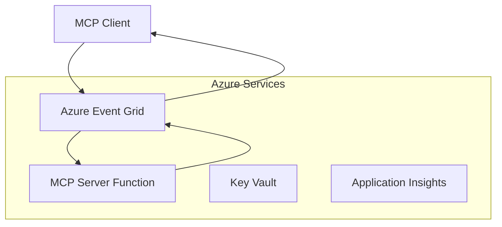
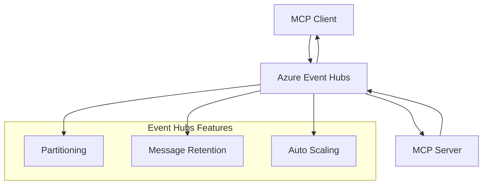

<!--
CO_OP_TRANSLATOR_METADATA:
{
  "original_hash": "c71c60af76120a517809a6cfba47e9a3",
  "translation_date": "2025-09-15T21:28:18+00:00",
  "source_file": "05-AdvancedTopics/mcp-transport/README.md",
  "language_code": "fa"
}
-->
# راهنمای پیشرفته پیاده‌سازی حمل‌ونقل‌های سفارشی MCP

پروتکل مدل کانتکست (MCP) انعطاف‌پذیری در مکانیزم‌های حمل‌ونقل را فراهم می‌کند و امکان پیاده‌سازی‌های سفارشی برای محیط‌های تخصصی سازمانی را می‌دهد. این راهنمای پیشرفته به بررسی پیاده‌سازی‌های حمل‌ونقل سفارشی با استفاده از Azure Event Grid و Azure Event Hubs به عنوان مثال‌های عملی برای ساخت راه‌حل‌های مقیاس‌پذیر و مبتنی بر ابر MCP می‌پردازد.

## مقدمه

در حالی که حمل‌ونقل‌های استاندارد MCP (stdio و HTTP streaming) برای اکثر موارد استفاده مناسب هستند، محیط‌های سازمانی اغلب به مکانیزم‌های حمل‌ونقل تخصصی برای بهبود مقیاس‌پذیری، قابلیت اطمینان و ادغام با زیرساخت‌های ابری موجود نیاز دارند. حمل‌ونقل‌های سفارشی به MCP امکان استفاده از خدمات پیام‌رسانی مبتنی بر ابر برای ارتباطات غیرهمزمان، معماری‌های مبتنی بر رویداد و پردازش توزیع‌شده را می‌دهند.

این درس به بررسی پیاده‌سازی‌های پیشرفته حمل‌ونقل بر اساس آخرین مشخصات MCP (2025-06-18)، خدمات پیام‌رسانی Azure و الگوهای ادغام سازمانی می‌پردازد.

### **معماری حمل‌ونقل MCP**

**از مشخصات MCP (2025-06-18):**

- **حمل‌ونقل‌های استاندارد**: stdio (توصیه‌شده)، HTTP streaming (برای سناریوهای راه دور)
- **حمل‌ونقل‌های سفارشی**: هر حمل‌ونقلی که پروتکل تبادل پیام MCP را پیاده‌سازی کند
- **فرمت پیام**: JSON-RPC 2.0 با افزونه‌های خاص MCP
- **ارتباط دوطرفه**: ارتباط کامل دوطرفه برای اعلان‌ها و پاسخ‌ها مورد نیاز است

## اهداف آموزشی

در پایان این درس پیشرفته، شما قادر خواهید بود:

- **درک الزامات حمل‌ونقل سفارشی**: پیاده‌سازی پروتکل MCP بر روی هر لایه حمل‌ونقل در حالی که سازگاری حفظ شود
- **ساخت حمل‌ونقل Azure Event Grid**: ایجاد سرورهای MCP مبتنی بر رویداد با استفاده از Azure Event Grid برای مقیاس‌پذیری بدون سرور
- **پیاده‌سازی حمل‌ونقل Azure Event Hubs**: طراحی راه‌حل‌های MCP با توان بالا با استفاده از Azure Event Hubs برای جریان‌سازی بلادرنگ
- **کاربرد الگوهای سازمانی**: ادغام حمل‌ونقل‌های سفارشی با زیرساخت و مدل‌های امنیتی Azure موجود
- **مدیریت قابلیت اطمینان حمل‌ونقل**: پیاده‌سازی دوام پیام، ترتیب‌دهی و مدیریت خطا برای سناریوهای سازمانی
- **بهینه‌سازی عملکرد**: طراحی راه‌حل‌های حمل‌ونقل برای نیازهای مقیاس، تأخیر و توان عملیاتی

## **الزامات حمل‌ونقل**

### **الزامات اصلی از مشخصات MCP (2025-06-18):**

```yaml
Message Protocol:
  format: "JSON-RPC 2.0 with MCP extensions"
  bidirectional: "Full duplex communication required"
  ordering: "Message ordering must be preserved per session"
  
Transport Layer:
  reliability: "Transport MUST handle connection failures gracefully"
  security: "Transport MUST support secure communication"
  identification: "Each session MUST have unique identifier"
  
Custom Transport:
  compliance: "MUST implement complete MCP message exchange"
  extensibility: "MAY add transport-specific features"
  interoperability: "MUST maintain protocol compatibility"
```

## **پیاده‌سازی حمل‌ونقل Azure Event Grid**

Azure Event Grid یک سرویس مسیریابی رویداد بدون سرور ارائه می‌دهد که برای معماری‌های مبتنی بر رویداد MCP ایده‌آل است. این پیاده‌سازی نشان می‌دهد که چگونه می‌توان سیستم‌های MCP مقیاس‌پذیر و کم‌اتصال ایجاد کرد.

### **نمای کلی معماری**



### **پیاده‌سازی C# - حمل‌ونقل Event Grid**

```csharp
using Azure.Messaging.EventGrid;
using Microsoft.Extensions.Azure;
using System.Text.Json;

public class EventGridMcpTransport : IMcpTransport
{
    private readonly EventGridPublisherClient _publisher;
    private readonly string _topicEndpoint;
    private readonly string _clientId;
    
    public EventGridMcpTransport(string topicEndpoint, string accessKey, string clientId)
    {
        _publisher = new EventGridPublisherClient(
            new Uri(topicEndpoint), 
            new AzureKeyCredential(accessKey));
        _topicEndpoint = topicEndpoint;
        _clientId = clientId;
    }
    
    public async Task SendMessageAsync(McpMessage message)
    {
        var eventGridEvent = new EventGridEvent(
            subject: $"mcp/{_clientId}",
            eventType: "MCP.MessageReceived",
            dataVersion: "1.0",
            data: JsonSerializer.Serialize(message))
        {
            Id = Guid.NewGuid().ToString(),
            EventTime = DateTimeOffset.UtcNow
        };
        
        await _publisher.SendEventAsync(eventGridEvent);
    }
    
    public async Task<McpMessage> ReceiveMessageAsync(CancellationToken cancellationToken)
    {
        // Event Grid is push-based, so implement webhook receiver
        // This would typically be handled by Azure Functions trigger
        throw new NotImplementedException("Use EventGridTrigger in Azure Functions");
    }
}

// Azure Function for receiving Event Grid events
[FunctionName("McpEventGridReceiver")]
public async Task<IActionResult> HandleEventGridMessage(
    [EventGridTrigger] EventGridEvent eventGridEvent,
    ILogger log)
{
    try
    {
        var mcpMessage = JsonSerializer.Deserialize<McpMessage>(
            eventGridEvent.Data.ToString());
        
        // Process MCP message
        var response = await _mcpServer.ProcessMessageAsync(mcpMessage);
        
        // Send response back via Event Grid
        await _transport.SendMessageAsync(response);
        
        return new OkResult();
    }
    catch (Exception ex)
    {
        log.LogError(ex, "Error processing Event Grid MCP message");
        return new BadRequestResult();
    }
}
```

### **پیاده‌سازی TypeScript - حمل‌ونقل Event Grid**

```typescript
import { EventGridPublisherClient, AzureKeyCredential } from "@azure/eventgrid";
import { McpTransport, McpMessage } from "./mcp-types";

export class EventGridMcpTransport implements McpTransport {
    private publisher: EventGridPublisherClient;
    private clientId: string;
    
    constructor(
        private topicEndpoint: string,
        private accessKey: string,
        clientId: string
    ) {
        this.publisher = new EventGridPublisherClient(
            topicEndpoint,
            new AzureKeyCredential(accessKey)
        );
        this.clientId = clientId;
    }
    
    async sendMessage(message: McpMessage): Promise<void> {
        const event = {
            id: crypto.randomUUID(),
            source: `mcp-client-${this.clientId}`,
            type: "MCP.MessageReceived",
            time: new Date(),
            data: message
        };
        
        await this.publisher.sendEvents([event]);
    }
    
    // Event-driven receive via Azure Functions
    onMessage(handler: (message: McpMessage) => Promise<void>): void {
        // Implementation would use Azure Functions Event Grid trigger
        // This is a conceptual interface for the webhook receiver
    }
}

// Azure Functions implementation
import { app, InvocationContext, EventGridEvent } from "@azure/functions";

app.eventGrid("mcpEventGridHandler", {
    handler: async (event: EventGridEvent, context: InvocationContext) => {
        try {
            const mcpMessage = event.data as McpMessage;
            
            // Process MCP message
            const response = await mcpServer.processMessage(mcpMessage);
            
            // Send response via Event Grid
            await transport.sendMessage(response);
            
        } catch (error) {
            context.error("Error processing MCP message:", error);
            throw error;
        }
    }
});
```

### **پیاده‌سازی Python - حمل‌ونقل Event Grid**

```python
from azure.eventgrid import EventGridPublisherClient, EventGridEvent
from azure.core.credentials import AzureKeyCredential
import asyncio
import json
from typing import Callable, Optional
import uuid
from datetime import datetime

class EventGridMcpTransport:
    def __init__(self, topic_endpoint: str, access_key: str, client_id: str):
        self.client = EventGridPublisherClient(
            topic_endpoint, 
            AzureKeyCredential(access_key)
        )
        self.client_id = client_id
        self.message_handler: Optional[Callable] = None
    
    async def send_message(self, message: dict) -> None:
        """Send MCP message via Event Grid"""
        event = EventGridEvent(
            data=message,
            subject=f"mcp/{self.client_id}",
            event_type="MCP.MessageReceived",
            data_version="1.0"
        )
        
        await self.client.send(event)
    
    def on_message(self, handler: Callable[[dict], None]) -> None:
        """Register message handler for incoming events"""
        self.message_handler = handler

# Azure Functions implementation
import azure.functions as func
import logging

def main(event: func.EventGridEvent) -> None:
    """Azure Functions Event Grid trigger for MCP messages"""
    try:
        # Parse MCP message from Event Grid event
        mcp_message = json.loads(event.get_body().decode('utf-8'))
        
        # Process MCP message
        response = process_mcp_message(mcp_message)
        
        # Send response back via Event Grid
        # (Implementation would create new Event Grid client)
        
    except Exception as e:
        logging.error(f"Error processing MCP Event Grid message: {e}")
        raise
```

## **پیاده‌سازی حمل‌ونقل Azure Event Hubs**

Azure Event Hubs قابلیت‌های جریان‌سازی بلادرنگ با توان بالا را برای سناریوهای MCP که نیاز به تأخیر کم و حجم پیام بالا دارند، فراهم می‌کند.

### **نمای کلی معماری**



### **پیاده‌سازی C# - حمل‌ونقل Event Hubs**

```csharp
using Azure.Messaging.EventHubs;
using Azure.Messaging.EventHubs.Producer;
using Azure.Messaging.EventHubs.Consumer;
using System.Text;

public class EventHubsMcpTransport : IMcpTransport, IDisposable
{
    private readonly EventHubProducerClient _producer;
    private readonly EventHubConsumerClient _consumer;
    private readonly string _consumerGroup;
    private readonly CancellationTokenSource _cancellationTokenSource;
    
    public EventHubsMcpTransport(
        string connectionString, 
        string eventHubName,
        string consumerGroup = "$Default")
    {
        _producer = new EventHubProducerClient(connectionString, eventHubName);
        _consumer = new EventHubConsumerClient(
            consumerGroup, 
            connectionString, 
            eventHubName);
        _consumerGroup = consumerGroup;
        _cancellationTokenSource = new CancellationTokenSource();
    }
    
    public async Task SendMessageAsync(McpMessage message)
    {
        var messageBody = JsonSerializer.Serialize(message);
        var eventData = new EventData(Encoding.UTF8.GetBytes(messageBody));
        
        // Add MCP-specific properties
        eventData.Properties.Add("MessageType", message.Method ?? "response");
        eventData.Properties.Add("MessageId", message.Id);
        eventData.Properties.Add("Timestamp", DateTimeOffset.UtcNow);
        
        await _producer.SendAsync(new[] { eventData });
    }
    
    public async Task StartReceivingAsync(
        Func<McpMessage, Task> messageHandler)
    {
        await foreach (PartitionEvent partitionEvent in _consumer.ReadEventsAsync(
            _cancellationTokenSource.Token))
        {
            try
            {
                var messageBody = Encoding.UTF8.GetString(
                    partitionEvent.Data.EventBody.ToArray());
                var mcpMessage = JsonSerializer.Deserialize<McpMessage>(messageBody);
                
                await messageHandler(mcpMessage);
            }
            catch (Exception ex)
            {
                // Handle deserialization or processing errors
                Console.WriteLine($"Error processing message: {ex.Message}");
            }
        }
    }
    
    public void Dispose()
    {
        _cancellationTokenSource?.Cancel();
        _producer?.DisposeAsync().AsTask().Wait();
        _consumer?.DisposeAsync().AsTask().Wait();
        _cancellationTokenSource?.Dispose();
    }
}
```

### **پیاده‌سازی TypeScript - حمل‌ونقل Event Hubs**

```typescript
import { 
    EventHubProducerClient, 
    EventHubConsumerClient, 
    EventData 
} from "@azure/event-hubs";

export class EventHubsMcpTransport implements McpTransport {
    private producer: EventHubProducerClient;
    private consumer: EventHubConsumerClient;
    private isReceiving = false;
    
    constructor(
        private connectionString: string,
        private eventHubName: string,
        private consumerGroup: string = "$Default"
    ) {
        this.producer = new EventHubProducerClient(
            connectionString, 
            eventHubName
        );
        this.consumer = new EventHubConsumerClient(
            consumerGroup,
            connectionString,
            eventHubName
        );
    }
    
    async sendMessage(message: McpMessage): Promise<void> {
        const eventData: EventData = {
            body: JSON.stringify(message),
            properties: {
                messageType: message.method || "response",
                messageId: message.id,
                timestamp: new Date().toISOString()
            }
        };
        
        await this.producer.sendBatch([eventData]);
    }
    
    async startReceiving(
        messageHandler: (message: McpMessage) => Promise<void>
    ): Promise<void> {
        if (this.isReceiving) return;
        
        this.isReceiving = true;
        
        const subscription = this.consumer.subscribe({
            processEvents: async (events, context) => {
                for (const event of events) {
                    try {
                        const messageBody = event.body as string;
                        const mcpMessage: McpMessage = JSON.parse(messageBody);
                        
                        await messageHandler(mcpMessage);
                        
                        // Update checkpoint for at-least-once delivery
                        await context.updateCheckpoint(event);
                    } catch (error) {
                        console.error("Error processing Event Hubs message:", error);
                    }
                }
            },
            processError: async (err, context) => {
                console.error("Event Hubs error:", err);
            }
        });
    }
    
    async close(): Promise<void> {
        this.isReceiving = false;
        await this.producer.close();
        await this.consumer.close();
    }
}
```

### **پیاده‌سازی Python - حمل‌ونقل Event Hubs**

```python
from azure.eventhub import EventHubProducerClient, EventHubConsumerClient
from azure.eventhub import EventData
import json
import asyncio
from typing import Callable, Dict, Any
import logging

class EventHubsMcpTransport:
    def __init__(
        self, 
        connection_string: str, 
        eventhub_name: str,
        consumer_group: str = "$Default"
    ):
        self.producer = EventHubProducerClient.from_connection_string(
            connection_string, 
            eventhub_name=eventhub_name
        )
        self.consumer = EventHubConsumerClient.from_connection_string(
            connection_string,
            consumer_group=consumer_group,
            eventhub_name=eventhub_name
        )
        self.is_receiving = False
    
    async def send_message(self, message: Dict[str, Any]) -> None:
        """Send MCP message via Event Hubs"""
        event_data = EventData(json.dumps(message))
        
        # Add MCP-specific properties
        event_data.properties = {
            "messageType": message.get("method", "response"),
            "messageId": message.get("id"),
            "timestamp": "2025-01-14T10:30:00Z"  # Use actual timestamp
        }
        
        async with self.producer:
            event_data_batch = await self.producer.create_batch()
            event_data_batch.add(event_data)
            await self.producer.send_batch(event_data_batch)
    
    async def start_receiving(
        self, 
        message_handler: Callable[[Dict[str, Any]], None]
    ) -> None:
        """Start receiving MCP messages from Event Hubs"""
        if self.is_receiving:
            return
        
        self.is_receiving = True
        
        async with self.consumer:
            await self.consumer.receive(
                on_event=self._on_event_received(message_handler),
                starting_position="-1"  # Start from beginning
            )
    
    def _on_event_received(self, handler: Callable):
        """Internal event handler wrapper"""
        async def handle_event(partition_context, event):
            try:
                # Parse MCP message from Event Hubs event
                message_body = event.body_as_str(encoding='UTF-8')
                mcp_message = json.loads(message_body)
                
                # Process MCP message
                await handler(mcp_message)
                
                # Update checkpoint for at-least-once delivery
                await partition_context.update_checkpoint(event)
                
            except Exception as e:
                logging.error(f"Error processing Event Hubs message: {e}")
        
        return handle_event
    
    async def close(self) -> None:
        """Clean up transport resources"""
        self.is_receiving = False
        await self.producer.close()
        await self.consumer.close()
```

## **الگوهای پیشرفته حمل‌ونقل**

### **دوام و قابلیت اطمینان پیام**

```csharp
// Implementing message durability with retry logic
public class ReliableTransportWrapper : IMcpTransport
{
    private readonly IMcpTransport _innerTransport;
    private readonly RetryPolicy _retryPolicy;
    
    public async Task SendMessageAsync(McpMessage message)
    {
        await _retryPolicy.ExecuteAsync(async () =>
        {
            try
            {
                await _innerTransport.SendMessageAsync(message);
            }
            catch (TransportException ex) when (ex.IsRetryable)
            {
                // Log and retry
                throw;
            }
        });
    }
}
```

### **ادغام امنیت حمل‌ونقل**

```csharp
// Integrating Azure Key Vault for transport security
public class SecureTransportFactory
{
    private readonly SecretClient _keyVaultClient;
    
    public async Task<IMcpTransport> CreateEventGridTransportAsync()
    {
        var accessKey = await _keyVaultClient.GetSecretAsync("EventGridAccessKey");
        var topicEndpoint = await _keyVaultClient.GetSecretAsync("EventGridTopic");
        
        return new EventGridMcpTransport(
            topicEndpoint.Value.Value,
            accessKey.Value.Value,
            Environment.MachineName
        );
    }
}
```

### **نظارت و مشاهده‌پذیری حمل‌ونقل**

```csharp
// Adding telemetry to custom transports
public class ObservableTransport : IMcpTransport
{
    private readonly IMcpTransport _transport;
    private readonly ILogger _logger;
    private readonly TelemetryClient _telemetryClient;
    
    public async Task SendMessageAsync(McpMessage message)
    {
        using var activity = Activity.StartActivity("MCP.Transport.Send");
        activity?.SetTag("transport.type", "EventGrid");
        activity?.SetTag("message.method", message.Method);
        
        var stopwatch = Stopwatch.StartNew();
        
        try
        {
            await _transport.SendMessageAsync(message);
            
            _telemetryClient.TrackDependency(
                "EventGrid",
                "SendMessage",
                DateTime.UtcNow.Subtract(stopwatch.Elapsed),
                stopwatch.Elapsed,
                true
            );
        }
        catch (Exception ex)
        {
            _telemetryClient.TrackException(ex);
            throw;
        }
    }
}
```

## **سناریوهای ادغام سازمانی**

### **سناریو ۱: پردازش توزیع‌شده MCP**

استفاده از Azure Event Grid برای توزیع درخواست‌های MCP در میان چندین گره پردازشی:

```yaml
Architecture:
  - MCP Client sends requests to Event Grid topic
  - Multiple Azure Functions subscribe to process different tool types
  - Results aggregated and returned via separate response topic
  
Benefits:
  - Horizontal scaling based on message volume
  - Fault tolerance through redundant processors
  - Cost optimization with serverless compute
```

### **سناریو ۲: جریان‌سازی بلادرنگ MCP**

استفاده از Azure Event Hubs برای تعاملات MCP با فرکانس بالا:

```yaml
Architecture:
  - MCP Client streams continuous requests via Event Hubs
  - Stream Analytics processes and routes messages
  - Multiple consumers handle different aspect of processing
  
Benefits:
  - Low latency for real-time scenarios
  - High throughput for batch processing
  - Built-in partitioning for parallel processing
```

### **سناریو ۳: معماری حمل‌ونقل ترکیبی**

ترکیب چندین حمل‌ونقل برای موارد استفاده مختلف:

```csharp
public class HybridMcpTransport : IMcpTransport
{
    private readonly IMcpTransport _realtimeTransport; // Event Hubs
    private readonly IMcpTransport _batchTransport;    // Event Grid
    private readonly IMcpTransport _fallbackTransport; // HTTP Streaming
    
    public async Task SendMessageAsync(McpMessage message)
    {
        // Route based on message characteristics
        var transport = message.Method switch
        {
            "tools/call" when IsRealtime(message) => _realtimeTransport,
            "resources/read" when IsBatch(message) => _batchTransport,
            _ => _fallbackTransport
        };
        
        await transport.SendMessageAsync(message);
    }
}
```

## **بهینه‌سازی عملکرد**

### **بسته‌بندی پیام برای Event Grid**

```csharp
public class BatchingEventGridTransport : IMcpTransport
{
    private readonly List<McpMessage> _messageBuffer = new();
    private readonly Timer _flushTimer;
    private const int MaxBatchSize = 100;
    
    public async Task SendMessageAsync(McpMessage message)
    {
        lock (_messageBuffer)
        {
            _messageBuffer.Add(message);
            
            if (_messageBuffer.Count >= MaxBatchSize)
            {
                _ = Task.Run(FlushMessages);
            }
        }
    }
    
    private async Task FlushMessages()
    {
        List<McpMessage> toSend;
        lock (_messageBuffer)
        {
            toSend = new List<McpMessage>(_messageBuffer);
            _messageBuffer.Clear();
        }
        
        if (toSend.Any())
        {
            var events = toSend.Select(CreateEventGridEvent);
            await _publisher.SendEventsAsync(events);
        }
    }
}
```

### **استراتژی پارتیشن‌بندی برای Event Hubs**

```csharp
public class PartitionedEventHubsTransport : IMcpTransport
{
    public async Task SendMessageAsync(McpMessage message)
    {
        // Partition by client ID for session affinity
        var partitionKey = ExtractClientId(message);
        
        var eventData = new EventData(JsonSerializer.SerializeToUtf8Bytes(message))
        {
            PartitionKey = partitionKey
        };
        
        await _producer.SendAsync(new[] { eventData });
    }
}
```

## **آزمایش حمل‌ونقل‌های سفارشی**

### **آزمایش واحد با Test Doubles**

```csharp
[Test]
public async Task EventGridTransport_SendMessage_PublishesCorrectEvent()
{
    // Arrange
    var mockPublisher = new Mock<EventGridPublisherClient>();
    var transport = new EventGridMcpTransport(mockPublisher.Object);
    var message = new McpMessage { Method = "tools/list", Id = "test-123" };
    
    // Act
    await transport.SendMessageAsync(message);
    
    // Assert
    mockPublisher.Verify(
        x => x.SendEventAsync(
            It.Is<EventGridEvent>(e => 
                e.EventType == "MCP.MessageReceived" &&
                e.Subject == "mcp/test-client"
            )
        ),
        Times.Once
    );
}
```

### **آزمایش یکپارچه با Azure Test Containers**

```csharp
[Test]
public async Task EventHubsTransport_IntegrationTest()
{
    // Using Testcontainers for integration testing
    var eventHubsContainer = new EventHubsContainer()
        .WithEventHub("test-hub");
    
    await eventHubsContainer.StartAsync();
    
    var transport = new EventHubsMcpTransport(
        eventHubsContainer.GetConnectionString(),
        "test-hub"
    );
    
    // Test message round-trip
    var sentMessage = new McpMessage { Method = "test", Id = "123" };
    McpMessage receivedMessage = null;
    
    await transport.StartReceivingAsync(msg => {
        receivedMessage = msg;
        return Task.CompletedTask;
    });
    
    await transport.SendMessageAsync(sentMessage);
    await Task.Delay(1000); // Allow for message processing
    
    Assert.That(receivedMessage?.Id, Is.EqualTo("123"));
}
```

## **بهترین شیوه‌ها و دستورالعمل‌ها**

### **اصول طراحی حمل‌ونقل**

1. **ایدپوتنسی**: اطمینان حاصل کنید که پردازش پیام ایدپوتنت است تا با پیام‌های تکراری مقابله شود  
2. **مدیریت خطا**: پیاده‌سازی مدیریت خطای جامع و صف‌های پیام مرده  
3. **نظارت**: افزودن تله‌متری دقیق و بررسی سلامت  
4. **امنیت**: استفاده از هویت‌های مدیریت‌شده و دسترسی با کمترین امتیاز  
5. **عملکرد**: طراحی بر اساس نیازهای خاص تأخیر و توان عملیاتی  

### **توصیه‌های خاص Azure**

1. **استفاده از هویت مدیریت‌شده**: از رشته‌های اتصال در محیط تولید اجتناب کنید  
2. **پیاده‌سازی مدارشکن‌ها**: محافظت در برابر قطعی‌های خدمات Azure  
3. **نظارت بر هزینه‌ها**: حجم پیام و هزینه‌های پردازش را پیگیری کنید  
4. **برنامه‌ریزی برای مقیاس**: استراتژی‌های پارتیشن‌بندی و مقیاس‌گذاری را زودتر طراحی کنید  
5. **آزمایش کامل**: از Azure DevTest Labs برای آزمایش جامع استفاده کنید  

## **نتیجه‌گیری**

حمل‌ونقل‌های سفارشی MCP سناریوهای قدرتمند سازمانی را با استفاده از خدمات پیام‌رسانی Azure امکان‌پذیر می‌کنند. با پیاده‌سازی حمل‌ونقل‌های Event Grid یا Event Hubs، می‌توانید راه‌حل‌های MCP مقیاس‌پذیر و قابل‌اعتمادی ایجاد کنید که به‌طور یکپارچه با زیرساخت Azure موجود ادغام شوند.

مثال‌های ارائه‌شده الگوهای آماده تولید را برای پیاده‌سازی حمل‌ونقل‌های سفارشی در حالی که سازگاری با پروتکل MCP و بهترین شیوه‌های Azure حفظ می‌شود، نشان می‌دهند.

## **منابع اضافی**

- [مشخصات MCP 2025-06-18](https://spec.modelcontextprotocol.io/specification/2025-06-18/)  
- [مستندات Azure Event Grid](https://docs.microsoft.com/azure/event-grid/)  
- [مستندات Azure Event Hubs](https://docs.microsoft.com/azure/event-hubs/)  
- [Azure Functions Event Grid Trigger](https://docs.microsoft.com/azure/azure-functions/functions-bindings-event-grid)  
- [Azure SDK برای .NET](https://github.com/Azure/azure-sdk-for-net)  
- [Azure SDK برای TypeScript](https://github.com/Azure/azure-sdk-for-js)  
- [Azure SDK برای Python](https://github.com/Azure/azure-sdk-for-python)  

---

> *این راهنما بر الگوهای عملی پیاده‌سازی برای سیستم‌های تولیدی MCP تمرکز دارد. همیشه پیاده‌سازی‌های حمل‌ونقل را بر اساس نیازهای خاص خود و محدودیت‌های خدمات Azure اعتبارسنجی کنید.*  
> **استاندارد فعلی**: این راهنما الزامات حمل‌ونقل و الگوهای پیشرفته حمل‌ونقل برای محیط‌های سازمانی را بر اساس [مشخصات MCP 2025-06-18](https://spec.modelcontextprotocol.io/specification/2025-06-18/) منعکس می‌کند.

## گام بعدی
- [6. مشارکت‌های جامعه](../../06-CommunityContributions/README.md)

---

**سلب مسئولیت**:  
این سند با استفاده از سرویس ترجمه هوش مصنوعی [Co-op Translator](https://github.com/Azure/co-op-translator) ترجمه شده است. در حالی که ما تلاش می‌کنیم دقت را حفظ کنیم، لطفاً توجه داشته باشید که ترجمه‌های خودکار ممکن است شامل خطاها یا نادرستی‌ها باشند. سند اصلی به زبان اصلی آن باید به عنوان منبع معتبر در نظر گرفته شود. برای اطلاعات حساس، توصیه می‌شود از ترجمه حرفه‌ای انسانی استفاده کنید. ما مسئولیتی در قبال سوء تفاهم‌ها یا تفسیرهای نادرست ناشی از استفاده از این ترجمه نداریم.