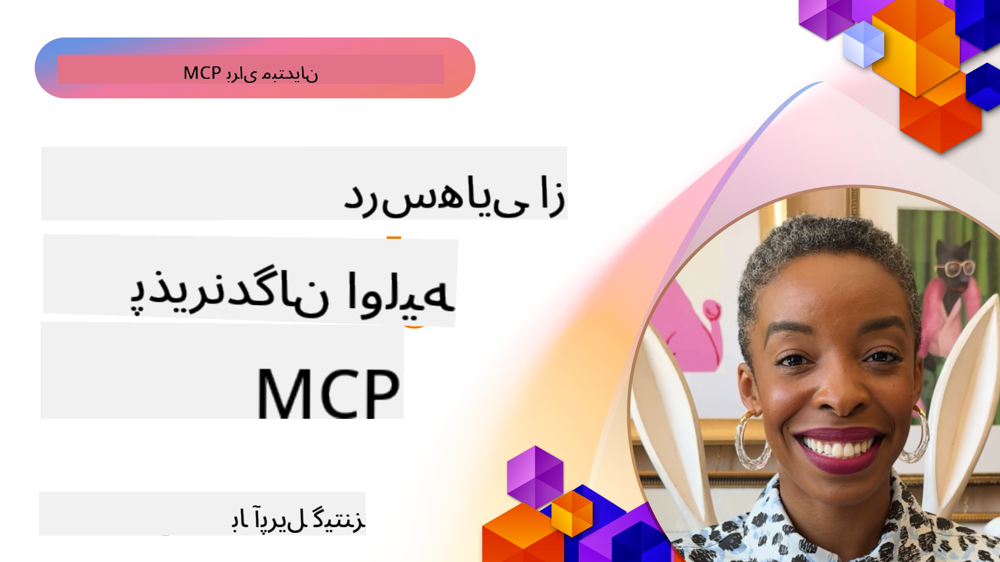

<!--
CO_OP_TRANSLATOR_METADATA:
{
  "original_hash": "41f16dac486d2086a53bc644a01cbe42",
  "translation_date": "2025-08-18T11:58:43+00:00",
  "source_file": "07-LessonsfromEarlyAdoption/README.md",
  "language_code": "fa"
}
-->
# 🌟 درس‌هایی از کاربران اولیه

[](https://youtu.be/jds7dSmNptE)

_(برای مشاهده ویدئوی این درس، روی تصویر بالا کلیک کنید)_

## 🎯 محتوای این ماژول

این ماژول بررسی می‌کند که چگونه سازمان‌ها و توسعه‌دهندگان واقعی از پروتکل Model Context Protocol (MCP) برای حل چالش‌های واقعی و پیشبرد نوآوری استفاده می‌کنند. از طریق مطالعات موردی دقیق و پروژه‌های عملی، شما خواهید دید که چگونه MCP امکان یکپارچه‌سازی امن و مقیاس‌پذیر هوش مصنوعی را فراهم می‌کند که مدل‌های زبانی، ابزارها و داده‌های سازمانی را به هم متصل می‌کند.

### 📚 مشاهده MCP در عمل

می‌خواهید این اصول را در ابزارهای آماده تولید مشاهده کنید؟ به [**10 سرور MCP مایکروسافت که بهره‌وری توسعه‌دهندگان را متحول کرده‌اند**](microsoft-mcp-servers.md) مراجعه کنید، که سرورهای واقعی MCP مایکروسافت را که امروز می‌توانید استفاده کنید، به نمایش می‌گذارد.

## مرور کلی

این درس بررسی می‌کند که چگونه کاربران اولیه از پروتکل Model Context Protocol (MCP) برای حل چالش‌های واقعی و پیشبرد نوآوری در صنایع مختلف استفاده کرده‌اند. از طریق مطالعات موردی دقیق و پروژه‌های عملی، شما خواهید دید که چگونه MCP امکان یکپارچه‌سازی استاندارد، امن و مقیاس‌پذیر هوش مصنوعی را فراهم می‌کند—مدل‌های زبانی بزرگ، ابزارها و داده‌های سازمانی را در یک چارچوب یکپارچه متصل می‌کند. شما تجربه عملی در طراحی و ساخت راه‌حل‌های مبتنی بر MCP کسب خواهید کرد، از الگوهای پیاده‌سازی اثبات‌شده یاد خواهید گرفت و بهترین روش‌ها برای استقرار MCP در محیط‌های تولیدی را کشف خواهید کرد. این درس همچنین به روندهای نوظهور، جهت‌گیری‌های آینده و منابع متن‌باز اشاره می‌کند تا به شما کمک کند در خط مقدم فناوری MCP و اکوسیستم در حال تکامل آن باقی بمانید.

## اهداف یادگیری

- تحلیل پیاده‌سازی‌های واقعی MCP در صنایع مختلف
- طراحی و ساخت برنامه‌های کامل مبتنی بر MCP
- بررسی روندهای نوظهور و جهت‌گیری‌های آینده در فناوری MCP
- اعمال بهترین روش‌ها در سناریوهای توسعه واقعی

## پیاده‌سازی‌های واقعی MCP

### مطالعه موردی 1: خودکارسازی پشتیبانی مشتری سازمانی

یک شرکت چندملیتی یک راه‌حل مبتنی بر MCP را برای استانداردسازی تعاملات هوش مصنوعی در سیستم‌های پشتیبانی مشتری خود پیاده‌سازی کرد. این راه‌حل به آن‌ها امکان داد:

- ایجاد یک رابط یکپارچه برای چندین ارائه‌دهنده LLM
- حفظ مدیریت یکپارچه درخواست‌ها در بخش‌های مختلف
- پیاده‌سازی کنترل‌های امنیتی و انطباق قوی
- تغییر آسان بین مدل‌های مختلف هوش مصنوعی بر اساس نیازهای خاص

**پیاده‌سازی فنی:**

```python
# Python MCP server implementation for customer support
import logging
import asyncio
from modelcontextprotocol import create_server, ServerConfig
from modelcontextprotocol.server import MCPServer
from modelcontextprotocol.transports import create_http_transport
from modelcontextprotocol.resources import ResourceDefinition
from modelcontextprotocol.prompts import PromptDefinition
from modelcontextprotocol.tool import ToolDefinition

# Configure logging
logging.basicConfig(level=logging.INFO)

async def main():
    # Create server configuration
    config = ServerConfig(
        name="Enterprise Customer Support Server",
        version="1.0.0",
        description="MCP server for handling customer support inquiries"
    )
    
    # Initialize MCP server
    server = create_server(config)
    
    # Register knowledge base resources
    server.resources.register(
        ResourceDefinition(
            name="customer_kb",
            description="Customer knowledge base documentation"
        ),
        lambda params: get_customer_documentation(params)
    )
    
    # Register prompt templates
    server.prompts.register(
        PromptDefinition(
            name="support_template",
            description="Templates for customer support responses"
        ),
        lambda params: get_support_templates(params)
    )
    
    # Register support tools
    server.tools.register(
        ToolDefinition(
            name="ticketing",
            description="Create and update support tickets"
        ),
        handle_ticketing_operations
    )
    
    # Start server with HTTP transport
    transport = create_http_transport(port=8080)
    await server.run(transport)

if __name__ == "__main__":
    asyncio.run(main())
```

**نتایج:** کاهش 30 درصدی هزینه‌های مدل، بهبود 45 درصدی در ثبات پاسخ‌ها، و افزایش انطباق در عملیات جهانی.

### مطالعه موردی 2: دستیار تشخیصی در حوزه سلامت

یک ارائه‌دهنده خدمات سلامت زیرساخت MCP را برای یکپارچه‌سازی چندین مدل هوش مصنوعی تخصصی پزشکی توسعه داد، در حالی که اطمینان حاصل کرد که داده‌های حساس بیماران محافظت شده باقی می‌مانند:

- تغییر بی‌وقفه بین مدل‌های عمومی و تخصصی پزشکی
- کنترل‌های سختگیرانه حریم خصوصی و ردگیری
- یکپارچه‌سازی با سیستم‌های موجود پرونده الکترونیکی سلامت (EHR)
- مهندسی درخواست‌های یکپارچه برای اصطلاحات پزشکی

**پیاده‌سازی فنی:**

```csharp
// C# MCP host application implementation in healthcare application
using Microsoft.Extensions.DependencyInjection;
using ModelContextProtocol.SDK.Client;
using ModelContextProtocol.SDK.Security;
using ModelContextProtocol.SDK.Resources;

public class DiagnosticAssistant
{
    private readonly MCPHostClient _mcpClient;
    private readonly PatientContext _patientContext;
    
    public DiagnosticAssistant(PatientContext patientContext)
    {
        _patientContext = patientContext;
        
        // Configure MCP client with healthcare-specific settings
        var clientOptions = new ClientOptions
        {
            Name = "Healthcare Diagnostic Assistant",
            Version = "1.0.0",
            Security = new SecurityOptions
            {
                Encryption = EncryptionLevel.Medical,
                AuditEnabled = true
            }
        };
        
        _mcpClient = new MCPHostClientBuilder()
            .WithOptions(clientOptions)
            .WithTransport(new HttpTransport("https://healthcare-mcp.example.org"))
            .WithAuthentication(new HIPAACompliantAuthProvider())
            .Build();
    }
    
    public async Task<DiagnosticSuggestion> GetDiagnosticAssistance(
        string symptoms, string patientHistory)
    {
        // Create request with appropriate resources and tool access
        var resourceRequest = new ResourceRequest
        {
            Name = "patient_records",
            Parameters = new Dictionary<string, object>
            {
                ["patientId"] = _patientContext.PatientId,
                ["requestingProvider"] = _patientContext.ProviderId
            }
        };
        
        // Request diagnostic assistance using appropriate prompt
        var response = await _mcpClient.SendPromptRequestAsync(
            promptName: "diagnostic_assistance",
            parameters: new Dictionary<string, object>
            {
                ["symptoms"] = symptoms,
                patientHistory = patientHistory,
                relevantGuidelines = _patientContext.GetRelevantGuidelines()
            });
            
        return DiagnosticSuggestion.FromMCPResponse(response);
    }
}
```

**نتایج:** پیشنهادات تشخیصی بهبود یافته برای پزشکان، در حالی که انطباق کامل با HIPAA حفظ شد و کاهش قابل توجهی در تغییرات بین سیستم‌ها.

### مطالعه موردی 3: تحلیل ریسک در خدمات مالی

یک موسسه مالی MCP را برای استانداردسازی فرآیندهای تحلیل ریسک در بخش‌های مختلف پیاده‌سازی کرد:

- ایجاد یک رابط یکپارچه برای مدل‌های ریسک اعتباری، تشخیص تقلب، و ریسک سرمایه‌گذاری
- پیاده‌سازی کنترل‌های دسترسی سختگیرانه و نسخه‌بندی مدل‌ها
- اطمینان از قابلیت حسابرسی تمام توصیه‌های هوش مصنوعی
- حفظ فرمت داده‌های یکپارچه در سیستم‌های متنوع

**پیاده‌سازی فنی:**

```java
// Java MCP server for financial risk assessment
import org.mcp.server.*;
import org.mcp.security.*;

public class FinancialRiskMCPServer {
    public static void main(String[] args) {
        // Create MCP server with financial compliance features
        MCPServer server = new MCPServerBuilder()
            .withModelProviders(
                new ModelProvider("risk-assessment-primary", new AzureOpenAIProvider()),
                new ModelProvider("risk-assessment-audit", new LocalLlamaProvider())
            )
            .withPromptTemplateDirectory("./compliance/templates")
            .withAccessControls(new SOCCompliantAccessControl())
            .withDataEncryption(EncryptionStandard.FINANCIAL_GRADE)
            .withVersionControl(true)
            .withAuditLogging(new DatabaseAuditLogger())
            .build();
            
        server.addRequestValidator(new FinancialDataValidator());
        server.addResponseFilter(new PII_RedactionFilter());
        
        server.start(9000);
        
        System.out.println("Financial Risk MCP Server running on port 9000");
    }
}
```

**نتایج:** افزایش انطباق قانونی، کاهش 40 درصدی چرخه‌های استقرار مدل، و بهبود ثبات ارزیابی ریسک در بخش‌ها.

### مطالعه موردی 4: سرور MCP Playwright مایکروسافت برای خودکارسازی مرورگر

مایکروسافت [سرور MCP Playwright](https://github.com/microsoft/playwright-mcp) را توسعه داد تا امکان خودکارسازی امن و استاندارد مرورگر از طریق پروتکل Model Context Protocol را فراهم کند. این سرور آماده تولید به عوامل هوش مصنوعی و LLM‌ها اجازه می‌دهد تا با مرورگرهای وب به صورت کنترل‌شده، قابل حسابرسی و قابل توسعه تعامل داشته باشند—امکان استفاده‌هایی مانند تست خودکار وب، استخراج داده‌ها، و گردش کارهای انتها به انتها.

> **🎯 ابزار آماده تولید**
> 
> این مطالعه موردی یک سرور واقعی MCP را نشان می‌دهد که امروز می‌توانید استفاده کنید! درباره سرور MCP Playwright و 9 سرور دیگر MCP آماده تولید مایکروسافت در [**راهنمای سرورهای MCP مایکروسافت**](microsoft-mcp-servers.md#8--playwright-mcp-server) بیشتر بدانید.

**ویژگی‌های کلیدی:**
- ارائه قابلیت‌های خودکارسازی مرورگر (ناوبری، پر کردن فرم‌ها، گرفتن اسکرین‌شات و غیره) به عنوان ابزارهای MCP
- پیاده‌سازی کنترل‌های دسترسی سختگیرانه و محیط‌های ایزوله برای جلوگیری از اقدامات غیرمجاز
- ارائه گزارش‌های حسابرسی دقیق برای تمام تعاملات مرورگر
- پشتیبانی از یکپارچه‌سازی با Azure OpenAI و سایر ارائه‌دهندگان LLM برای خودکارسازی مبتنی بر عوامل
- قدرت‌دهی به قابلیت‌های مرورگر GitHub Copilot

**پیاده‌سازی فنی:**

```typescript
// TypeScript: Registering Playwright browser automation tools in an MCP server
import { createServer, ToolDefinition } from 'modelcontextprotocol';
import { launch } from 'playwright';

const server = createServer({
  name: 'Playwright MCP Server',
  version: '1.0.0',
  description: 'MCP server for browser automation using Playwright'
});

// Register a tool for navigating to a URL and capturing a screenshot
server.tools.register(
  new ToolDefinition({
    name: 'navigate_and_screenshot',
    description: 'Navigate to a URL and capture a screenshot',
    parameters: {
      url: { type: 'string', description: 'The URL to visit' }
    }
  }),
  async ({ url }) => {
    const browser = await launch();
    const page = await browser.newPage();
    await page.goto(url);
    const screenshot = await page.screenshot();
    await browser.close();
    return { screenshot };
  }
);

// Start the MCP server
server.listen(8080);
```

**نتایج:**

- امکان خودکارسازی امن و برنامه‌ریزی‌شده مرورگر برای عوامل هوش مصنوعی و LLM‌ها
- کاهش تلاش‌های تست دستی و بهبود پوشش تست برای برنامه‌های وب
- ارائه یک چارچوب قابل استفاده مجدد و قابل توسعه برای یکپارچه‌سازی ابزارهای مبتنی بر مرورگر در محیط‌های سازمانی
- قدرت‌دهی به قابلیت‌های مرورگر GitHub Copilot

**مراجع:**

- [مخزن GitHub سرور MCP Playwright](https://github.com/microsoft/playwright-mcp)
- [راه‌حل‌های هوش مصنوعی و خودکارسازی مایکروسافت](https://azure.microsoft.com/en-us/products/ai-services/)

### مطالعه موردی 5: Azure MCP – پروتکل Model Context سازمانی به عنوان یک سرویس

سرور Azure MCP ([https://aka.ms/azmcp](https://aka.ms/azmcp)) پیاده‌سازی مدیریت‌شده و سازمانی پروتکل Model Context توسط مایکروسافت است که برای ارائه قابلیت‌های سرور MCP مقیاس‌پذیر، امن و منطبق به عنوان یک سرویس ابری طراحی شده است. Azure MCP به سازمان‌ها امکان می‌دهد سرورهای MCP را به سرعت مستقر، مدیریت و یکپارچه کنند و با خدمات هوش مصنوعی، داده‌ها و امنیت Azure تعامل داشته باشند، هزینه‌های عملیاتی را کاهش دهند و پذیرش هوش مصنوعی را تسریع کنند.

> **🎯 ابزار آماده تولید**
> 
> این یک سرور واقعی MCP است که امروز می‌توانید استفاده کنید! درباره سرور MCP Azure AI Foundry در [**راهنمای سرورهای MCP مایکروسافت**](microsoft-mcp-servers.md) بیشتر بدانید.

- میزبانی سرور MCP کاملاً مدیریت‌شده با مقیاس‌پذیری، نظارت و امنیت داخلی
- یکپارچه‌سازی بومی با Azure OpenAI، Azure AI Search و سایر خدمات Azure
- احراز هویت و مجوز سازمانی از طریق Microsoft Entra ID
- پشتیبانی از ابزارهای سفارشی، قالب‌های درخواست، و اتصال‌دهنده‌های منابع
- انطباق با الزامات امنیتی و قانونی سازمانی

**پیاده‌سازی فنی:**

```yaml
# Example: Azure MCP server deployment configuration (YAML)
apiVersion: mcp.microsoft.com/v1
kind: McpServer
metadata:
  name: enterprise-mcp-server
spec:
  modelProviders:
    - name: azure-openai
      type: AzureOpenAI
      endpoint: https://<your-openai-resource>.openai.azure.com/
      apiKeySecret: <your-azure-keyvault-secret>
  tools:
    - name: document_search
      type: AzureAISearch
      endpoint: https://<your-search-resource>.search.windows.net/
      apiKeySecret: <your-azure-keyvault-secret>
  authentication:
    type: EntraID
    tenantId: <your-tenant-id>
  monitoring:
    enabled: true
    logAnalyticsWorkspace: <your-log-analytics-id>
```

**نتایج:**  
- کاهش زمان ارزش‌گذاری برای پروژه‌های هوش مصنوعی سازمانی با ارائه یک پلتفرم سرور MCP آماده استفاده و منطبق
- ساده‌سازی یکپارچه‌سازی LLM‌ها، ابزارها و منابع داده سازمانی
- افزایش امنیت، قابلیت مشاهده، و کارایی عملیاتی برای بارهای کاری MCP
- بهبود کیفیت کد با بهترین روش‌های SDK Azure و الگوهای احراز هویت فعلی

**مراجع:**  
- [مستندات Azure MCP](https://aka.ms/azmcp)
- [مخزن GitHub سرور MCP Azure](https://github.com/Azure/azure-mcp)
- [خدمات هوش مصنوعی Azure](https://azure.microsoft.com/en-us/products/ai-services/)
- [مرکز MCP مایکروسافت](https://mcp.azure.com)

### مطالعه موردی 6: NLWeb

MCP (پروتکل Model Context) یک پروتکل نوظهور برای چت‌بات‌ها و دستیارهای هوش مصنوعی است تا با ابزارها تعامل داشته باشند. هر نمونه NLWeb نیز یک سرور MCP است که از یک روش اصلی، ask، پشتیبانی می‌کند که برای پرسیدن سوال از یک وب‌سایت به زبان طبیعی استفاده می‌شود. پاسخ بازگشتی از schema.org، یک واژگان گسترده برای توصیف داده‌های وب، استفاده می‌کند. به طور کلی، MCP همان NLWeb است که Http به HTML است. NLWeb پروتکل‌ها، فرمت‌های Schema.org، و نمونه کدها را ترکیب می‌کند تا به سایت‌ها کمک کند این نقاط پایانی را به سرعت ایجاد کنند، که هم برای انسان‌ها از طریق رابط‌های مکالمه‌ای و هم برای ماشین‌ها از طریق تعامل طبیعی عامل به عامل مفید است.

دو جزء متمایز در NLWeb وجود دارد:
- یک پروتکل، بسیار ساده برای شروع، برای تعامل با یک سایت به زبان طبیعی و یک فرمت، که از json و schema.org برای پاسخ بازگشتی استفاده می‌کند. برای جزئیات بیشتر به مستندات REST API مراجعه کنید.
- یک پیاده‌سازی ساده از (1) که از نشانه‌گذاری موجود استفاده می‌کند، برای سایت‌هایی که می‌توانند به عنوان لیست‌های آیتم‌ها (محصولات، دستورالعمل‌ها، جاذبه‌ها، نظرات و غیره) انتزاع شوند. همراه با مجموعه‌ای از ویجت‌های رابط کاربری، سایت‌ها می‌توانند به راحتی رابط‌های مکالمه‌ای برای محتوای خود ارائه دهند. برای جزئیات بیشتر در مورد نحوه کار این فرآیند، به مستندات Life of a chat query مراجعه کنید.

**مراجع:**  
- [مستندات Azure MCP](https://aka.ms/azmcp)
- [NLWeb](https://github.com/microsoft/NlWeb)

### مطالعه موردی 7: سرور MCP Azure AI Foundry – یکپارچه‌سازی عوامل هوش مصنوعی سازمانی

سرورهای MCP Azure AI Foundry نشان می‌دهند که چگونه MCP می‌تواند برای هماهنگی و مدیریت عوامل هوش مصنوعی و گردش کارها در محیط‌های سازمانی استفاده شود. با یکپارچه‌سازی MCP با Azure AI Foundry، سازمان‌ها می‌توانند تعاملات عامل‌ها را استاندارد کنند، از مدیریت گردش کار Foundry بهره‌مند شوند، و استقرارهای امن و مقیاس‌پذیر را تضمین کنند.

> **🎯 ابزار آماده تولید**
> 
> این یک سرور واقعی MCP است که امروز می‌توانید استفاده کنید! درباره سرور MCP Azure AI Foundry در [**راهنمای سرورهای MCP مایکروسافت**](microsoft-mcp-servers.md#9--azure-ai-foundry-mcp-server) بیشتر بدانید.

**ویژگی‌های کلیدی:**
- دسترسی جامع به اکوسیستم هوش مصنوعی Azure، از جمله کاتالوگ مدل‌ها و مدیریت استقرار
- ایندکس‌گذاری دانش با Azure AI Search برای برنامه‌های RAG
- ابزارهای ارزیابی عملکرد مدل هوش مصنوعی و تضمین کیفیت
- یکپارچه‌سازی با کاتالوگ و آزمایشگاه‌های Azure AI Foundry برای مدل‌های تحقیقاتی پیشرفته
- قابلیت‌های مدیریت و ارزیابی عوامل برای سناریوهای تولیدی

**نتایج:**
- نمونه‌سازی سریع و نظارت قوی بر گردش کارهای عوامل هوش مصنوعی
- یکپارچه‌سازی بی‌وقفه با خدمات هوش مصنوعی Azure برای سناریوهای پیشرفته
- رابط یکپارچه برای ساخت، استقرار، و نظارت بر خطوط لوله عوامل
- بهبود امنیت، انطباق، و کارایی عملیاتی برای سازمان‌ها
- تسریع پذیرش هوش مصنوعی در حالی که کنترل فرآیندهای پیچیده مبتنی بر عوامل حفظ می‌شود

**مراجع:**
- [مخزن GitHub سرور MCP Azure AI Foundry](https://github.com/azure-ai-foundry/mcp-foundry)
- [یکپارچه‌سازی عوامل هوش مصنوعی Azure با MCP (وبلاگ Foundry مایکروسافت)](https://devblogs.microsoft.com/foundry/integrating-azure-ai-agents-mcp/)

### مطالعه موردی 8: زمین بازی MCP Foundry – آزمایش و نمونه‌سازی

زمین بازی MCP Foundry یک محیط آماده استفاده برای آزمایش سرورهای MCP و یکپارچه‌سازی‌های Azure AI Foundry ارائه می‌دهد. توسعه‌دهندگان می‌توانند به سرعت نمونه‌سازی، آزمایش، و ارزیابی مدل‌های هوش مصنوعی و گردش کارهای عوامل را با استفاده از منابع موجود در کاتالوگ و آزمایشگاه‌های Azure AI Foundry انجام دهند. این زمین بازی راه‌اندازی را ساده می‌کند، پروژه‌های نمونه ارائه می‌دهد، و از توسعه مشترک پشتیبانی می‌کند، که باعث می‌شود با حداقل پیچیدگی، بهترین روش‌ها و سناریوهای جدید را کشف کنید. این ابزار به ویژه برای تیم‌هایی که به دنبال اعتبارسنجی ایده‌ها، اشتراک‌گذاری آزمایش‌ها، و تسریع یادگیری هستند مفید است، بدون نیاز به زیرساخت پیچیده. با کاهش موانع ورود، زمین بازی به نوآوری و مشارکت‌های جامعه در اکوسیستم MCP و Azure AI Foundry کمک می‌کند.

**مراجع:**

- [مخزن GitHub زمین بازی MCP Foundry](https://github.com/azure-ai-foundry/foundry-mcp-playground)

### مطالعه موردی 9: سرور MCP مستندات Microsoft Learn – دسترسی به مستندات با قدرت هوش مصنوعی

سرور MCP مستندات Microsoft Learn یک سرویس میزبانی‌شده ابری است که به دستیارهای هوش مصنوعی امکان دسترسی بلادرنگ به مستندات رسمی مایکروسافت از طریق پروتکل Model Context را می‌دهد. این سرور آماده تولید به اکوسیستم جامع Microsoft Learn متصل می‌شود و جستجوی معنایی در تمام منابع رسمی مایکروسافت را امکان‌پذیر می‌کند.
> **🎯 ابزار آماده برای تولید**
> 
> این یک سرور واقعی MCP است که می‌توانید همین امروز از آن استفاده کنید! برای اطلاعات بیشتر درباره سرور MCP مستندات Microsoft Learn به [**راهنمای سرورهای MCP مایکروسافت**](microsoft-mcp-servers.md#1--microsoft-learn-docs-mcp-server) مراجعه کنید.
**ویژگی‌های کلیدی:**
- دسترسی لحظه‌ای به مستندات رسمی مایکروسافت، مستندات Azure و مستندات Microsoft 365
- قابلیت‌های جستجوی معنایی پیشرفته که زمینه و قصد را درک می‌کند
- اطلاعات همیشه به‌روز با انتشار محتوای Microsoft Learn
- پوشش جامع در Microsoft Learn، مستندات Azure و منابع Microsoft 365
- ارائه حداکثر ۱۰ بخش محتوای با کیفیت بالا همراه با عناوین مقالات و URL‌ها

**چرا این موضوع حیاتی است:**
- مشکل "دانش قدیمی AI" برای فناوری‌های مایکروسافت را حل می‌کند
- اطمینان از دسترسی دستیارهای هوش مصنوعی به آخرین ویژگی‌های .NET، C#، Azure و Microsoft 365
- ارائه اطلاعات معتبر و رسمی برای تولید دقیق کد
- ضروری برای توسعه‌دهندگانی که با فناوری‌های در حال تحول سریع مایکروسافت کار می‌کنند

**نتایج:**
- بهبود چشمگیر دقت کد تولید شده توسط هوش مصنوعی برای فناوری‌های مایکروسافت
- کاهش زمان صرف شده برای جستجوی مستندات و بهترین روش‌ها
- افزایش بهره‌وری توسعه‌دهندگان با بازیابی مستندات آگاه از زمینه
- یکپارچگی بی‌وقفه با جریان‌های کاری توسعه بدون ترک محیط IDE

**مراجع:**
- [مخزن GitHub سرور MCP مستندات Microsoft Learn](https://github.com/MicrosoftDocs/mcp)
- [مستندات Microsoft Learn](https://learn.microsoft.com/)

## پروژه‌های عملی

### پروژه ۱: ساخت یک سرور MCP چند ارائه‌دهنده

**هدف:** ایجاد یک سرور MCP که بتواند درخواست‌ها را بر اساس معیارهای خاص به چندین ارائه‌دهنده مدل هوش مصنوعی هدایت کند.

**نیازمندی‌ها:**

- پشتیبانی از حداقل سه ارائه‌دهنده مدل مختلف (مانند OpenAI، Anthropic، مدل‌های محلی)
- پیاده‌سازی مکانیزم مسیریابی بر اساس متادیتای درخواست
- ایجاد یک سیستم پیکربندی برای مدیریت اعتبارنامه‌های ارائه‌دهنده
- افزودن کش برای بهینه‌سازی عملکرد و هزینه‌ها
- ساخت یک داشبورد ساده برای نظارت بر استفاده

**مراحل پیاده‌سازی:**

1. زیرساخت اولیه سرور MCP را راه‌اندازی کنید
2. آداپتورهای ارائه‌دهنده را برای هر سرویس مدل هوش مصنوعی پیاده‌سازی کنید
3. منطق مسیریابی را بر اساس ویژگی‌های درخواست ایجاد کنید
4. مکانیزم‌های کش را برای درخواست‌های مکرر اضافه کنید
5. داشبورد نظارتی را توسعه دهید
6. با الگوهای مختلف درخواست آزمایش کنید

**فناوری‌ها:** انتخاب از Python (.NET/Java/Python بر اساس ترجیح شما)، Redis برای کش، و یک فریم‌ورک وب ساده برای داشبورد.

### پروژه ۲: سیستم مدیریت درخواست‌های سازمانی

**هدف:** توسعه یک سیستم مبتنی بر MCP برای مدیریت، نسخه‌بندی و استقرار قالب‌های درخواست در سراسر سازمان.

**نیازمندی‌ها:**

- ایجاد یک مخزن مرکزی برای قالب‌های درخواست
- پیاده‌سازی سیستم نسخه‌بندی و جریان‌های کاری تأیید
- ساخت قابلیت‌های آزمایش قالب با ورودی‌های نمونه
- توسعه کنترل‌های دسترسی مبتنی بر نقش
- ایجاد یک API برای بازیابی و استقرار قالب‌ها

**مراحل پیاده‌سازی:**

1. طراحی طرح پایگاه داده برای ذخیره قالب‌ها
2. ایجاد API اصلی برای عملیات CRUD قالب‌ها
3. سیستم نسخه‌بندی را پیاده‌سازی کنید
4. جریان کاری تأیید را بسازید
5. چارچوب آزمایش را توسعه دهید
6. یک رابط وب ساده برای مدیریت ایجاد کنید
7. با یک سرور MCP یکپارچه کنید

**فناوری‌ها:** انتخاب فریم‌ورک بک‌اند، پایگاه داده SQL یا NoSQL، و یک فریم‌ورک فرانت‌اند برای رابط مدیریت.

### پروژه ۳: پلتفرم تولید محتوا مبتنی بر MCP

**هدف:** ساخت یک پلتفرم تولید محتوا که از MCP برای ارائه نتایج سازگار در انواع مختلف محتوا استفاده کند.

**نیازمندی‌ها:**

- پشتیبانی از فرمت‌های مختلف محتوا (پست‌های وبلاگ، رسانه‌های اجتماعی، متن‌های بازاریابی)
- پیاده‌سازی تولید مبتنی بر قالب با گزینه‌های سفارشی‌سازی
- ایجاد سیستم بازبینی و بازخورد محتوا
- ردیابی معیارهای عملکرد محتوا
- پشتیبانی از نسخه‌بندی و تکرار محتوا

**مراحل پیاده‌سازی:**

1. زیرساخت کلاینت MCP را راه‌اندازی کنید
2. قالب‌هایی برای انواع مختلف محتوا ایجاد کنید
3. خط تولید محتوا را بسازید
4. سیستم بازبینی را پیاده‌سازی کنید
5. سیستم ردیابی معیارها را توسعه دهید
6. یک رابط کاربری برای مدیریت قالب‌ها و تولید محتوا ایجاد کنید

**فناوری‌ها:** زبان برنامه‌نویسی، فریم‌ورک وب، و سیستم پایگاه داده مورد نظر شما.

## مسیرهای آینده برای فناوری MCP

### روندهای نوظهور

1. **MCP چند‌وجهی**
   - گسترش MCP برای استانداردسازی تعاملات با مدل‌های تصویر، صوت و ویدئو
   - توسعه قابلیت‌های استدلال بین‌وجهی
   - قالب‌های درخواست استاندارد برای وجه‌های مختلف

2. **زیرساخت فدرال MCP**
   - شبکه‌های توزیع شده MCP که می‌توانند منابع را بین سازمان‌ها به اشتراک بگذارند
   - پروتکل‌های استاندارد برای اشتراک امن مدل‌ها
   - تکنیک‌های محاسباتی حفظ حریم خصوصی

3. **بازارهای MCP**
   - اکوسیستم‌هایی برای اشتراک و کسب درآمد از قالب‌ها و افزونه‌های MCP
   - فرآیندهای تضمین کیفیت و صدور گواهینامه
   - یکپارچگی با بازارهای مدل

4. **MCP برای محاسبات لبه**
   - تطبیق استانداردهای MCP برای دستگاه‌های لبه با منابع محدود
   - پروتکل‌های بهینه‌سازی شده برای محیط‌های کم‌پهنای باند
   - پیاده‌سازی‌های تخصصی MCP برای اکوسیستم‌های IoT

5. **چارچوب‌های نظارتی**
   - توسعه افزونه‌های MCP برای رعایت مقررات
   - مسیرهای حسابرسی استاندارد و رابط‌های توضیح‌پذیری
   - یکپارچگی با چارچوب‌های نوظهور حاکمیت هوش مصنوعی

### راه‌حل‌های MCP از مایکروسافت

مایکروسافت و Azure چندین مخزن متن‌باز برای کمک به توسعه‌دهندگان در پیاده‌سازی MCP در سناریوهای مختلف ایجاد کرده‌اند:

#### سازمان مایکروسافت

1. [playwright-mcp](https://github.com/microsoft/playwright-mcp) - یک سرور MCP Playwright برای اتوماسیون و آزمایش مرورگر
2. [files-mcp-server](https://github.com/microsoft/files-mcp-server) - پیاده‌سازی سرور MCP OneDrive برای آزمایش محلی و مشارکت جامعه
3. [NLWeb](https://github.com/microsoft/NlWeb) - مجموعه‌ای از پروتکل‌های باز و ابزارهای متن‌باز مرتبط برای ایجاد لایه‌ای بنیادی برای وب هوش مصنوعی

#### سازمان Azure-Samples

1. [mcp](https://github.com/Azure-Samples/mcp) - لینک‌هایی به نمونه‌ها، ابزارها و منابع برای ساخت و یکپارچه‌سازی سرورهای MCP در Azure با استفاده از زبان‌های مختلف
2. [mcp-auth-servers](https://github.com/Azure-Samples/mcp-auth-servers) - سرورهای مرجع MCP که احراز هویت را با مشخصات فعلی پروتکل زمینه مدل نشان می‌دهند
3. [remote-mcp-functions](https://github.com/Azure-Samples/remote-mcp-functions) - صفحه فرود برای پیاده‌سازی‌های سرور MCP از راه دور در Azure Functions با لینک به مخازن زبان خاص
4. [remote-mcp-functions-python](https://github.com/Azure-Samples/remote-mcp-functions-python) - قالب شروع سریع برای ساخت و استقرار سرورهای MCP سفارشی از راه دور با استفاده از Azure Functions با Python
5. [remote-mcp-functions-dotnet](https://github.com/Azure-Samples/remote-mcp-functions-dotnet) - قالب شروع سریع برای ساخت و استقرار سرورهای MCP سفارشی از راه دور با استفاده از Azure Functions با .NET/C#
6. [remote-mcp-functions-typescript](https://github.com/Azure-Samples/remote-mcp-functions-typescript) - قالب شروع سریع برای ساخت و استقرار سرورهای MCP سفارشی از راه دور با استفاده از Azure Functions با TypeScript
7. [remote-mcp-apim-functions-python](https://github.com/Azure-Samples/remote-mcp-apim-functions-python) - مدیریت API Azure به عنوان دروازه هوش مصنوعی برای سرورهای MCP از راه دور با استفاده از Python
8. [AI-Gateway](https://github.com/Azure-Samples/AI-Gateway) - آزمایش‌های APIM ❤️ AI شامل قابلیت‌های MCP، یکپارچه‌سازی با Azure OpenAI و AI Foundry

این مخازن پیاده‌سازی‌ها، قالب‌ها و منابع مختلفی برای کار با پروتکل زمینه مدل در زبان‌های برنامه‌نویسی مختلف و خدمات Azure ارائه می‌دهند. آن‌ها طیف وسیعی از موارد استفاده از پیاده‌سازی‌های اولیه سرور تا احراز هویت، استقرار ابری و سناریوهای یکپارچه‌سازی سازمانی را پوشش می‌دهند.

#### دایرکتوری منابع MCP

[دایرکتوری منابع MCP](https://github.com/microsoft/mcp/tree/main/Resources) در مخزن رسمی MCP مایکروسافت مجموعه‌ای از منابع نمونه، قالب‌های درخواست و تعاریف ابزار را برای استفاده با سرورهای پروتکل زمینه مدل ارائه می‌دهد. این دایرکتوری برای کمک به توسعه‌دهندگان در شروع سریع با MCP طراحی شده است و بلوک‌های سازنده قابل استفاده مجدد و نمونه‌های بهترین روش‌ها را ارائه می‌دهد:

- **قالب‌های درخواست:** قالب‌های آماده برای وظایف و سناریوهای رایج هوش مصنوعی که می‌توانند برای پیاده‌سازی‌های سرور MCP شما تطبیق داده شوند.
- **تعاریف ابزار:** نمونه‌هایی از طرح‌های ابزار و متادیتا برای استانداردسازی یکپارچه‌سازی و فراخوانی ابزار در سرورهای مختلف MCP.
- **نمونه‌های منابع:** نمونه‌هایی از تعاریف منابع برای اتصال به منابع داده، API‌ها و خدمات خارجی در چارچوب MCP.
- **پیاده‌سازی‌های مرجع:** نمونه‌های عملی که نشان می‌دهند چگونه منابع، درخواست‌ها و ابزارها را در پروژه‌های واقعی MCP ساختاردهی و سازماندهی کنید.

این منابع توسعه را تسریع می‌کنند، استانداردسازی را ترویج می‌دهند و به اطمینان از بهترین روش‌ها هنگام ساخت و استقرار راه‌حل‌های مبتنی بر MCP کمک می‌کنند.

#### دایرکتوری منابع MCP

- [منابع MCP (قالب‌های نمونه، ابزارها و تعاریف منابع)](https://github.com/microsoft/mcp/tree/main/Resources)

### فرصت‌های تحقیقاتی

- تکنیک‌های بهینه‌سازی درخواست کارآمد در چارچوب‌های MCP
- مدل‌های امنیتی برای استقرارهای چند‌مستأجری MCP
- معیارهای عملکرد در پیاده‌سازی‌های مختلف MCP
- روش‌های تأیید رسمی برای سرورهای MCP

## نتیجه‌گیری

پروتکل زمینه مدل (MCP) به سرعت آینده یکپارچه‌سازی هوش مصنوعی استاندارد، امن و قابل همکاری را در صنایع مختلف شکل می‌دهد. از طریق مطالعات موردی و پروژه‌های عملی در این درس، مشاهده کردید که چگونه پذیرندگان اولیه—از جمله مایکروسافت و Azure—از MCP برای حل چالش‌های واقعی، تسریع پذیرش هوش مصنوعی و اطمینان از رعایت مقررات، امنیت و مقیاس‌پذیری استفاده می‌کنند. رویکرد ماژولار MCP به سازمان‌ها امکان می‌دهد مدل‌های زبان بزرگ، ابزارها و داده‌های سازمانی را در یک چارچوب یکپارچه و قابل حسابرسی متصل کنند. همان‌طور که MCP به تکامل خود ادامه می‌دهد، مشارکت در جامعه، بررسی منابع متن‌باز و اعمال بهترین روش‌ها کلید ساخت راه‌حل‌های هوش مصنوعی قوی و آماده برای آینده خواهد بود.

## منابع اضافی

- [مخزن GitHub MCP Foundry](https://github.com/azure-ai-foundry/mcp-foundry)
- [زمین بازی MCP Foundry](https://github.com/azure-ai-foundry/foundry-mcp-playground)
- [یکپارچه‌سازی عوامل Azure AI با MCP (وبلاگ Microsoft Foundry)](https://devblogs.microsoft.com/foundry/integrating-azure-ai-agents-mcp/)
- [مخزن GitHub MCP (مایکروسافت)](https://github.com/microsoft/mcp)
- [دایرکتوری منابع MCP (قالب‌های نمونه، ابزارها و تعاریف منابع)](https://github.com/microsoft/mcp/tree/main/Resources)
- [جامعه و مستندات MCP](https://modelcontextprotocol.io/introduction)
- [مستندات MCP Azure](https://aka.ms/azmcp)
- [مخزن GitHub سرور MCP Playwright](https://github.com/microsoft/playwright-mcp)
- [سرور MCP فایل‌ها (OneDrive)](https://github.com/microsoft/files-mcp-server)
- [نمونه‌های MCP Azure](https://github.com/Azure-Samples/mcp)
- [سرورهای احراز هویت MCP (نمونه‌های Azure)](https://github.com/Azure-Samples/mcp-auth-servers)
- [توابع MCP از راه دور (نمونه‌های Azure)](https://github.com/Azure-Samples/remote-mcp-functions)
- [توابع MCP از راه دور Python (نمونه‌های Azure)](https://github.com/Azure-Samples/remote-mcp-functions-python)
- [توابع MCP از راه دور .NET (نمونه‌های Azure)](https://github.com/Azure-Samples/remote-mcp-functions-dotnet)
- [توابع MCP از راه دور TypeScript (نمونه‌های Azure)](https://github.com/Azure-Samples/remote-mcp-functions-typescript)
- [توابع MCP APIM از راه دور Python (نمونه‌های Azure)](https://github.com/Azure-Samples/remote-mcp-apim-functions-python)
- [AI-Gateway (نمونه‌های Azure)](https://github.com/Azure-Samples/AI-Gateway)
- [راه‌حل‌های هوش مصنوعی و اتوماسیون مایکروسافت](https://azure.microsoft.com/en-us/products/ai-services/)

## تمرین‌ها

1. یکی از مطالعات موردی را تحلیل کنید و یک رویکرد پیاده‌سازی جایگزین پیشنهاد دهید.
2. یکی از ایده‌های پروژه را انتخاب کنید و یک مشخصات فنی دقیق ایجاد کنید.
3. یک صنعت که در مطالعات موردی پوشش داده نشده است را تحقیق کنید و مشخص کنید چگونه MCP می‌تواند چالش‌های خاص آن را حل کند.
4. یکی از مسیرهای آینده را بررسی کنید و یک مفهوم برای یک افزونه جدید MCP برای پشتیبانی از آن ایجاد کنید.

بعدی: [سرور MCP مایکروسافت](../07-LessonsfromEarlyAdoption/microsoft-mcp-servers.md)

**سلب مسئولیت**:  
این سند با استفاده از سرویس ترجمه هوش مصنوعی [Co-op Translator](https://github.com/Azure/co-op-translator) ترجمه شده است. در حالی که ما برای دقت تلاش می‌کنیم، لطفاً توجه داشته باشید که ترجمه‌های خودکار ممکن است شامل خطاها یا نادرستی‌هایی باشند. سند اصلی به زبان اصلی آن باید به عنوان منبع معتبر در نظر گرفته شود. برای اطلاعات حساس، ترجمه انسانی حرفه‌ای توصیه می‌شود. ما هیچ مسئولیتی در قبال سوءتفاهم‌ها یا تفسیرهای نادرست ناشی از استفاده از این ترجمه نداریم.