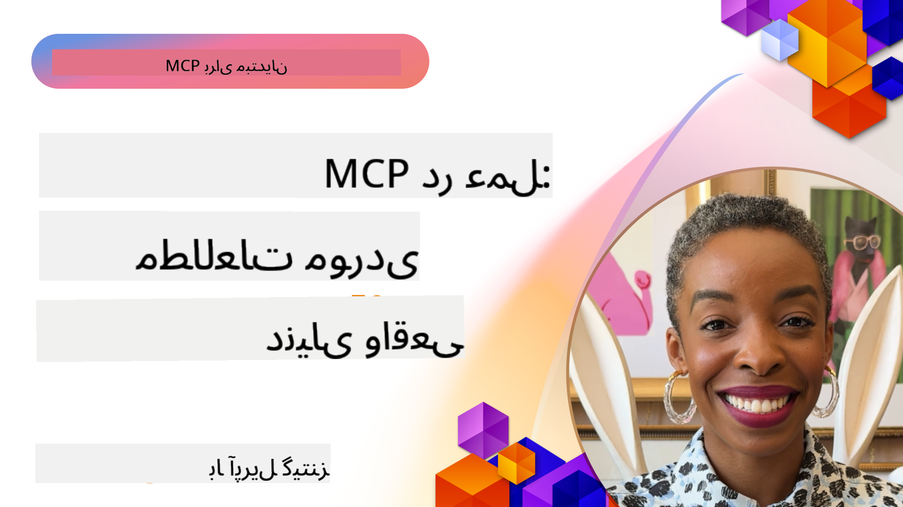

<!--
CO_OP_TRANSLATOR_METADATA:
{
  "original_hash": "1611dc5f6a2a35a789fc4c95fc5bfbe8",
  "translation_date": "2025-09-26T17:43:34+00:00",
  "source_file": "09-CaseStudy/README.md",
  "language_code": "fa"
}
-->
# MCP در عمل: مطالعات موردی واقعی

_(برای مشاهده ویدئوی این درس روی تصویر بالا کلیک کنید)_

پروتکل مدل کانتکست (MCP) در حال تغییر نحوه تعامل برنامه‌های هوش مصنوعی با داده‌ها، ابزارها و خدمات است. این بخش مطالعات موردی واقعی را ارائه می‌دهد که کاربردهای عملی MCP را در سناریوهای مختلف سازمانی نشان می‌دهد.

## مرور کلی

این بخش نمونه‌های ملموسی از پیاده‌سازی‌های MCP را به نمایش می‌گذارد و نشان می‌دهد که چگونه سازمان‌ها از این پروتکل برای حل چالش‌های پیچیده کسب‌وکار استفاده می‌کنند. با بررسی این مطالعات موردی، شما به درک انعطاف‌پذیری، مقیاس‌پذیری و مزایای عملی MCP در سناریوهای واقعی دست خواهید یافت.

## اهداف کلیدی یادگیری

با بررسی این مطالعات موردی، شما:

- درک خواهید کرد که چگونه MCP می‌تواند برای حل مشکلات خاص کسب‌وکار به کار گرفته شود
- با الگوهای مختلف یکپارچه‌سازی و رویکردهای معماری آشنا خواهید شد
- بهترین روش‌ها برای پیاده‌سازی MCP در محیط‌های سازمانی را خواهید شناخت
- به چالش‌ها و راه‌حل‌های مواجه شده در پیاده‌سازی‌های واقعی پی خواهید برد
- فرصت‌هایی برای استفاده از الگوهای مشابه در پروژه‌های خود شناسایی خواهید کرد

## مطالعات موردی برجسته

### 1. [نمایش مرجع Azure AI Travel Agents](./travelagentsample.md)

این مطالعه موردی راه‌حل جامع مرجع مایکروسافت را بررسی می‌کند که نشان می‌دهد چگونه می‌توان یک برنامه چندعاملی هوش مصنوعی برای برنامه‌ریزی سفر با استفاده از MCP، Azure OpenAI و Azure AI Search ساخت. این پروژه شامل موارد زیر است:

- هماهنگی چندعاملی از طریق MCP
- یکپارچه‌سازی داده‌های سازمانی با Azure AI Search
- معماری امن و مقیاس‌پذیر با استفاده از خدمات Azure
- ابزارهای قابل توسعه با اجزای قابل استفاده مجدد MCP
- تجربه کاربری مکالمه‌ای با قدرت Azure OpenAI

جزئیات معماری و پیاده‌سازی بینش‌های ارزشمندی در مورد ساخت سیستم‌های پیچیده چندعاملی با MCP به عنوان لایه هماهنگی ارائه می‌دهد.

### 2. [به‌روزرسانی آیتم‌های Azure DevOps با داده‌های YouTube](./UpdateADOItemsFromYT.md)

این مطالعه موردی کاربرد عملی MCP را برای خودکارسازی فرآیندهای کاری نشان می‌دهد. این مثال نشان می‌دهد که چگونه ابزارهای MCP می‌توانند برای:

- استخراج داده‌ها از پلتفرم‌های آنلاین (مانند YouTube)
- به‌روزرسانی آیتم‌های کاری در سیستم‌های Azure DevOps
- ایجاد جریان‌های کاری خودکار قابل تکرار
- یکپارچه‌سازی داده‌ها در سیستم‌های مختلف

این مثال نشان می‌دهد که حتی پیاده‌سازی‌های نسبتاً ساده MCP می‌توانند با خودکارسازی وظایف روزمره و بهبود سازگاری داده‌ها در سیستم‌ها، بهره‌وری قابل توجهی ایجاد کنند.

### 3. [بازیابی مستندات در زمان واقعی با MCP](./docs-mcp/README.md)

این مطالعه موردی شما را در اتصال یک کلاینت کنسول پایتون به یک سرور MCP برای بازیابی و ثبت مستندات مایکروسافت در زمان واقعی و مبتنی بر کانتکست راهنمایی می‌کند. شما یاد خواهید گرفت که چگونه:

- به یک سرور MCP با استفاده از کلاینت پایتون و SDK رسمی MCP متصل شوید
- از کلاینت‌های HTTP استریمینگ برای بازیابی داده‌های کارآمد و در زمان واقعی استفاده کنید
- ابزارهای مستندات را روی سرور فراخوانی کرده و پاسخ‌ها را مستقیماً در کنسول ثبت کنید
- مستندات به‌روز مایکروسافت را بدون ترک ترمینال در جریان کاری خود ادغام کنید

این فصل شامل یک تکلیف عملی، نمونه کد کاری حداقلی و لینک‌هایی به منابع اضافی برای یادگیری عمیق‌تر است. برای درک نحوه تغییر دسترسی به مستندات و بهره‌وری توسعه‌دهنده در محیط‌های مبتنی بر کنسول، به فصل کامل و کد مرتبط مراجعه کنید.

### 4. [برنامه وب تولیدکننده برنامه مطالعه تعاملی با MCP](./docs-mcp/README.md)

این مطالعه موردی نشان می‌دهد که چگونه می‌توان یک برنامه وب تعاملی با استفاده از Chainlit و پروتکل مدل کانتکست (MCP) برای تولید برنامه‌های مطالعه شخصی‌سازی‌شده برای هر موضوع ساخت. کاربران می‌توانند موضوعی (مانند "گواهینامه AI-900") و مدت زمان مطالعه (مثلاً ۸ هفته) را مشخص کنند و برنامه هفته به هفته محتوای پیشنهادی دریافت کنند. Chainlit یک رابط چت مکالمه‌ای فراهم می‌کند که تجربه را جذاب و تطبیقی می‌سازد.

- برنامه وب مکالمه‌ای با قدرت Chainlit
- درخواست‌های کاربر محور برای موضوع و مدت زمان
- توصیه‌های محتوای هفته به هفته با استفاده از MCP
- پاسخ‌های تطبیقی و در زمان واقعی در یک رابط چت

این پروژه نشان می‌دهد که چگونه هوش مصنوعی مکالمه‌ای و MCP می‌توانند برای ایجاد ابزارهای آموزشی پویا و کاربر محور در یک محیط وب مدرن ترکیب شوند.

### 5. [مستندات درون ویرایشگر با سرور MCP در VS Code](./docs-mcp/README.md)

این مطالعه موردی نشان می‌دهد که چگونه می‌توانید مستندات Microsoft Learn Docs را مستقیماً به محیط VS Code خود بیاورید—بدون نیاز به تغییر تب‌های مرورگر! شما خواهید دید که چگونه:

- مستندات را فوراً در VS Code با استفاده از پانل MCP یا پالت دستورات جستجو و مطالعه کنید
- مستندات را ارجاع داده و لینک‌ها را مستقیماً به فایل‌های README یا مارک‌داون دوره خود وارد کنید
- از GitHub Copilot و MCP به طور همزمان برای جریان‌های کاری مستندات و کدنویسی با قدرت هوش مصنوعی استفاده کنید
- مستندات خود را با بازخورد در زمان واقعی و دقت منابع مایکروسافت اعتبارسنجی و بهبود دهید
- MCP را با جریان‌های کاری GitHub برای اعتبارسنجی مستندات پیوسته ادغام کنید

پیاده‌سازی شامل موارد زیر است:

- مثال پیکربندی `.vscode/mcp.json` برای راه‌اندازی آسان
- راهنمای تصویری مبتنی بر اسکرین‌شات از تجربه درون ویرایشگر
- نکات ترکیب Copilot و MCP برای حداکثر بهره‌وری

این سناریو برای نویسندگان دوره، نویسندگان مستندات و توسعه‌دهندگانی که می‌خواهند در ویرایشگر خود متمرکز بمانند و با مستندات، Copilot و ابزارهای اعتبارسنجی کار کنند—همه با قدرت MCP—ایده‌آل است.

### 6. [ایجاد سرور MCP با APIM](./apimsample.md)

این مطالعه موردی یک راهنمای گام‌به‌گام برای ایجاد یک سرور MCP با استفاده از مدیریت API Azure (APIM) ارائه می‌دهد. این راهنما شامل موارد زیر است:

- راه‌اندازی یک سرور MCP در مدیریت API Azure
- نمایش عملیات API به عنوان ابزارهای MCP
- پیکربندی سیاست‌ها برای محدودیت نرخ و امنیت
- آزمایش سرور MCP با استفاده از Visual Studio Code و GitHub Copilot

این مثال نشان می‌دهد که چگونه می‌توان از قابلیت‌های Azure برای ایجاد یک سرور MCP قدرتمند استفاده کرد که می‌تواند در برنامه‌های مختلف به کار گرفته شود و یکپارچگی سیستم‌های هوش مصنوعی با API‌های سازمانی را بهبود بخشد.

### 7. [رجیستری MCP GitHub — تسریع یکپارچه‌سازی عامل‌ها](https://github.com/mcp)

این مطالعه موردی بررسی می‌کند که چگونه رجیستری MCP GitHub، که در سپتامبر ۲۰۲۵ راه‌اندازی شد، به یک چالش حیاتی در اکوسیستم هوش مصنوعی پاسخ می‌دهد: کشف و استقرار پراکنده سرورهای پروتکل مدل کانتکست (MCP).

#### مرور کلی
**رجیستری MCP** مشکل پراکندگی سرورهای MCP در مخازن و رجیستری‌ها را حل می‌کند که قبلاً یکپارچه‌سازی را کند و مستعد خطا می‌کرد. این سرورها به عامل‌های هوش مصنوعی امکان تعامل با سیستم‌های خارجی مانند API‌ها، پایگاه‌های داده و منابع مستندات را می‌دهند.

#### بیان مسئله
توسعه‌دهندگانی که جریان‌های کاری عامل‌محور ایجاد می‌کردند با چالش‌های زیر مواجه بودند:
- **کشف ضعیف** سرورهای MCP در پلتفرم‌های مختلف
- **سوالات تنظیمات تکراری** پراکنده در انجمن‌ها و مستندات
- **ریسک‌های امنیتی** ناشی از منابع تأیید نشده و غیرقابل اعتماد
- **عدم استانداردسازی** در کیفیت و سازگاری سرورها

#### معماری راه‌حل
رجیستری MCP GitHub سرورهای MCP معتبر را با ویژگی‌های کلیدی متمرکز می‌کند:
- **نصب با یک کلیک** برای تنظیم آسان در VS Code
- **مرتب‌سازی بر اساس سیگنال‌ها** با ستاره‌ها، فعالیت و اعتبارسنجی جامعه
- **یکپارچه‌سازی مستقیم** با GitHub Copilot و سایر ابزارهای سازگار با MCP
- **مدل مشارکت باز** که به جامعه و شرکای سازمانی امکان مشارکت می‌دهد

#### تأثیر کسب‌وکار
رجیستری بهبودهای قابل اندازه‌گیری ارائه داده است:
- **شروع سریع‌تر** برای توسعه‌دهندگانی که از ابزارهایی مانند سرور MCP Microsoft Learn استفاده می‌کنند که مستندات رسمی را مستقیماً به عامل‌ها استریم می‌کند
- **بهره‌وری بهبود یافته** با سرورهای تخصصی مانند `github-mcp-server` که اتوماسیون طبیعی زبان GitHub (ایجاد PR، اجرای مجدد CI، اسکن کد) را امکان‌پذیر می‌کند
- **اعتماد قوی‌تر به اکوسیستم** از طریق لیست‌های منتخب و استانداردهای پیکربندی شفاف

#### ارزش استراتژیک
برای متخصصانی که در مدیریت چرخه عمر عامل‌ها و جریان‌های کاری قابل بازتولید تخصص دارند، رجیستری MCP ارائه می‌دهد:
- **قابلیت‌های استقرار عامل‌های ماژولار** با اجزای استاندارد
- **خطوط لوله ارزیابی پشتیبانی‌شده توسط رجیستری** برای آزمایش و اعتبارسنجی سازگار
- **تعامل‌پذیری بین ابزارها** که یکپارچه‌سازی بدون مشکل در پلتفرم‌های مختلف هوش مصنوعی را امکان‌پذیر می‌کند

این مطالعه موردی نشان می‌دهد که رجیستری MCP فقط یک دایرکتوری نیست—بلکه یک پلتفرم بنیادی برای یکپارچه‌سازی مدل‌های مقیاس‌پذیر و استقرار سیستم‌های عامل‌محور در دنیای واقعی است.

## نتیجه‌گیری

این هفت مطالعه موردی جامع، انعطاف‌پذیری قابل توجه و کاربردهای عملی پروتکل مدل کانتکست را در سناریوهای واقعی مختلف نشان می‌دهند. از سیستم‌های پیچیده برنامه‌ریزی سفر چندعاملی و مدیریت API سازمانی گرفته تا جریان‌های کاری مستندات ساده‌شده و رجیستری انقلابی MCP GitHub، این مثال‌ها نشان می‌دهند که MCP یک روش استاندارد و مقیاس‌پذیر برای اتصال سیستم‌های هوش مصنوعی به ابزارها، داده‌ها و خدمات مورد نیاز برای ارائه ارزش استثنایی فراهم می‌کند.

مطالعات موردی ابعاد مختلف پیاده‌سازی MCP را پوشش می‌دهند:
- **یکپارچه‌سازی سازمانی**: مدیریت API Azure و اتوماسیون Azure DevOps
- **هماهنگی چندعاملی**: برنامه‌ریزی سفر با عامل‌های هماهنگ‌شده هوش مصنوعی
- **بهره‌وری توسعه‌دهنده**: یکپارچه‌سازی VS Code و دسترسی به مستندات در زمان واقعی
- **توسعه اکوسیستم**: رجیستری MCP GitHub به عنوان یک پلتفرم بنیادی
- **کاربردهای آموزشی**: تولیدکننده برنامه مطالعه تعاملی و رابط‌های مکالمه‌ای

با مطالعه این پیاده‌سازی‌ها، شما به بینش‌های حیاتی در مورد:
- **الگوهای معماری** برای مقیاس‌ها و موارد استفاده مختلف
- **استراتژی‌های پیاده‌سازی** که عملکرد را با قابلیت نگهداری متعادل می‌کنند
- **ملاحظات امنیت و مقیاس‌پذیری** برای استقرارهای تولیدی
- **بهترین روش‌ها** برای توسعه سرور MCP و یکپارچه‌سازی کلاینت
- **تفکر اکوسیستمی** برای ساخت راه‌حل‌های هوش مصنوعی متصل

این مثال‌ها به طور جمعی نشان می‌دهند که MCP فقط یک چارچوب نظری نیست بلکه یک پروتکل بالغ و آماده تولید است که راه‌حل‌های عملی برای چالش‌های پیچیده کسب‌وکار ارائه می‌دهد. چه در حال ساخت ابزارهای خودکار ساده باشید یا سیستم‌های پیچیده چندعاملی، الگوها و رویکردهای نشان داده شده در اینجا پایه محکمی برای پروژه‌های MCP شما فراهم می‌کنند.

## منابع اضافی

- [مخزن GitHub Azure AI Travel Agents](https://github.com/Azure-Samples/azure-ai-travel-agents)
- [ابزار MCP Azure DevOps](https://github.com/microsoft/azure-devops-mcp)
- [ابزار MCP Playwright](https://github.com/microsoft/playwright-mcp)
- [سرور MCP مستندات مایکروسافت](https://github.com/MicrosoftDocs/mcp)
- [رجیستری MCP GitHub — تسریع یکپارچه‌سازی عامل‌ها](https://github.com/mcp)
- [نمونه‌های جامعه MCP](https://github.com/microsoft/mcp)

بعدی: آزمایش عملی [ساده‌سازی جریان‌های کاری هوش مصنوعی: ساخت سرور MCP با ابزار هوش مصنوعی](../10-StreamliningAIWorkflowsBuildingAnMCPServerWithAIToolkit/README.md)

---

