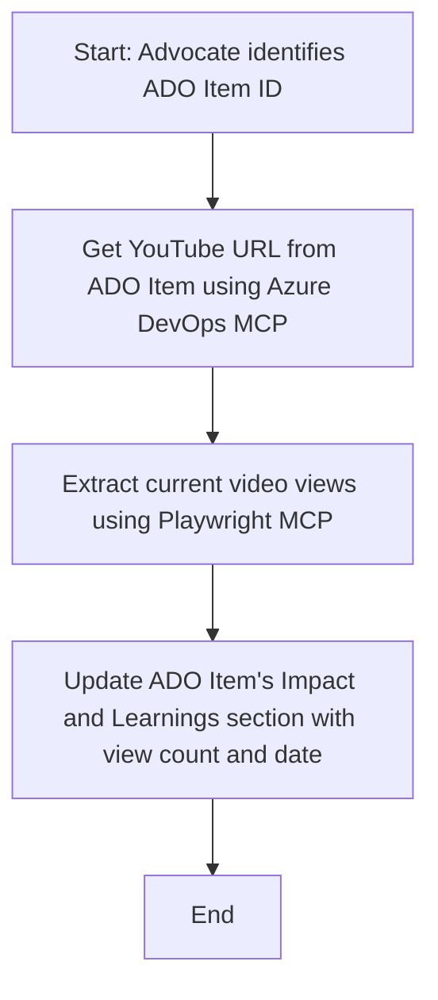

<!--
CO_OP_TRANSLATOR_METADATA:
{
  "original_hash": "14a2dfbea55ef735660a06bd6bdfe5f3",
  "translation_date": "2025-07-14T06:09:03+00:00",
  "source_file": "09-CaseStudy/UpdateADOItemsFromYT.md",
  "language_code": "fa"
}
-->
# مطالعه موردی: به‌روزرسانی آیتم‌های Azure DevOps با داده‌های YouTube با استفاده از MCP

> **سلب مسئولیت:** ابزارها و گزارش‌های آنلاین موجودی وجود دارند که می‌توانند فرآیند به‌روزرسانی آیتم‌های Azure DevOps با داده‌های پلتفرم‌هایی مانند YouTube را به‌صورت خودکار انجام دهند. سناریوی زیر صرفاً به‌عنوان یک نمونه کاربردی ارائه شده است تا نشان دهد چگونه ابزارهای MCP می‌توانند برای وظایف اتوماسیون و یکپارچه‌سازی به کار گرفته شوند.

## مرور کلی

این مطالعه موردی یک نمونه از نحوه استفاده از پروتکل مدل کانتکست (MCP) و ابزارهای آن برای خودکارسازی فرآیند به‌روزرسانی آیتم‌های کاری Azure DevOps (ADO) با اطلاعاتی که از پلتفرم‌های آنلاین مانند YouTube به دست می‌آید را نشان می‌دهد. سناریوی توصیف شده تنها یکی از نمونه‌های گسترده‌تر قابلیت‌های این ابزارها است که می‌توان آن را برای نیازهای مشابه اتوماسیون به‌کار برد.

در این مثال، یک Advocate جلسات آنلاین را با استفاده از آیتم‌های ADO پیگیری می‌کند، که هر آیتم شامل یک آدرس ویدئوی YouTube است. با بهره‌گیری از ابزارهای MCP، Advocate می‌تواند آیتم‌های ADO را به‌صورت تکرارشونده و خودکار با جدیدترین معیارهای ویدئو، مانند تعداد بازدیدها، به‌روز نگه دارد. این روش می‌تواند به سایر مواردی تعمیم یابد که نیاز به یکپارچه‌سازی اطلاعات از منابع آنلاین به ADO یا سیستم‌های دیگر وجود دارد.

## سناریو

یک Advocate مسئول پیگیری تأثیر جلسات آنلاین و تعاملات جامعه است. هر جلسه به‌عنوان یک آیتم کاری ADO در پروژه 'DevRel' ثبت می‌شود و آیتم کاری شامل فیلدی برای آدرس ویدئوی YouTube است. برای گزارش دقیق‌تر میزان دسترسی جلسه، Advocate باید آیتم ADO را با تعداد فعلی بازدیدهای ویدئو و تاریخ دریافت این اطلاعات به‌روزرسانی کند.

## ابزارهای استفاده شده

- [Azure DevOps MCP](https://github.com/microsoft/azure-devops-mcp): امکان دسترسی برنامه‌نویسی و به‌روزرسانی آیتم‌های کاری ADO از طریق MCP را فراهم می‌کند.
- [Playwright MCP](https://github.com/microsoft/playwright-mcp): عملیات مرورگر را خودکار می‌کند تا داده‌های زنده از صفحات وب، مانند آمار ویدئوهای YouTube، استخراج شود.

## روند گام به گام

1. **شناسایی آیتم ADO**: با شناسه آیتم کاری ADO (مثلاً 1234) در پروژه 'DevRel' شروع کنید.
2. **دریافت آدرس YouTube**: با استفاده از ابزار Azure DevOps MCP، آدرس ویدئوی YouTube را از آیتم کاری دریافت کنید.
3. **استخراج تعداد بازدیدها**: با استفاده از ابزار Playwright MCP به آدرس YouTube بروید و تعداد بازدیدهای فعلی را استخراج کنید.
4. **به‌روزرسانی آیتم ADO**: تعداد بازدیدهای جدید و تاریخ دریافت آن را در بخش 'Impact and Learnings' آیتم کاری ADO با استفاده از ابزار Azure DevOps MCP ثبت کنید.

## نمونه درخواست

```bash
- Work with the ADO Item ID: 1234
- The project is '2025-Awesome'
- Get the YouTube URL for the ADO item
- Use Playwright to get the current views from the YouTube video
- Update the ADO item with the current video views and the updated date of the information
```

## نمودار جریان Mermaid



## پیاده‌سازی فنی

- **هماهنگی MCP**: این روند توسط یک سرور MCP هماهنگ می‌شود که استفاده از هر دو ابزار Azure DevOps MCP و Playwright MCP را مدیریت می‌کند.
- **اتوماسیون**: این فرآیند می‌تواند به‌صورت دستی اجرا شود یا به‌طور زمان‌بندی شده برای به‌روزرسانی منظم آیتم‌های ADO تنظیم گردد.
- **قابلیت توسعه**: همین الگو می‌تواند برای به‌روزرسانی آیتم‌های ADO با معیارهای آنلاین دیگر (مانند لایک‌ها، نظرات) یا از پلتفرم‌های دیگر گسترش یابد.

## نتایج و تأثیر

- **کارایی**: با خودکارسازی دریافت و به‌روزرسانی معیارهای ویدئو، تلاش دستی Advocates را کاهش می‌دهد.
- **دقت**: اطمینان می‌دهد که آیتم‌های ADO جدیدترین داده‌های موجود از منابع آنلاین را منعکس می‌کنند.
- **تکرارپذیری**: یک روند قابل استفاده مجدد برای سناریوهای مشابه با منابع داده یا معیارهای دیگر فراهم می‌کند.

## منابع

- [Azure DevOps MCP](https://github.com/microsoft/azure-devops-mcp)
- [Playwright MCP](https://github.com/microsoft/playwright-mcp)
- [Model Context Protocol (MCP)](https://modelcontextprotocol.io/)

**سلب مسئولیت**:  
این سند با استفاده از سرویس ترجمه هوش مصنوعی [Co-op Translator](https://github.com/Azure/co-op-translator) ترجمه شده است. در حالی که ما در تلاش برای دقت هستیم، لطفاً توجه داشته باشید که ترجمه‌های خودکار ممکن است حاوی خطاها یا نادرستی‌هایی باشند. سند اصلی به زبان بومی خود باید به عنوان منبع معتبر در نظر گرفته شود. برای اطلاعات حیاتی، ترجمه حرفه‌ای انسانی توصیه می‌شود. ما مسئول هیچ گونه سوءتفاهم یا تفسیر نادرستی که از استفاده از این ترجمه ناشی شود، نیستیم.