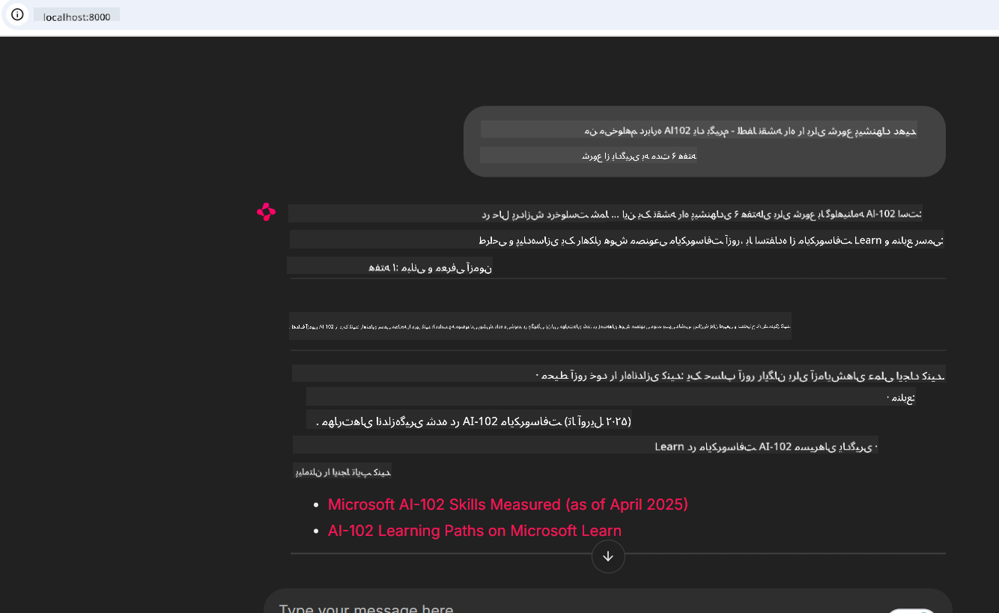

<!--
CO_OP_TRANSLATOR_METADATA:
{
  "original_hash": "4319d291c9d124ecafea52b3d04bfa0e",
  "translation_date": "2025-07-14T06:18:27+00:00",
  "source_file": "09-CaseStudy/docs-mcp/README.md",
  "language_code": "fa"
}
-->
# مطالعه موردی: اتصال به سرور Microsoft Learn Docs MCP از یک کلاینت

تا به حال شده بین سایت‌های مستندات، Stack Overflow و تب‌های بی‌پایان موتور جستجو دست و پنجه نرم کنید، در حالی که سعی دارید مشکلی در کد خود را حل کنید؟ شاید یک مانیتور دوم فقط برای مستندات داشته باشید یا دائم بین IDE و مرورگر خود با Alt+Tab جابجا شوید. آیا بهتر نیست مستندات را مستقیماً وارد جریان کاری خود کنید—یکپارچه شده در برنامه‌ها، IDE یا حتی ابزارهای سفارشی خودتان؟ در این مطالعه موردی، به شما نشان می‌دهیم چگونه دقیقاً این کار را با اتصال مستقیم به سرور Microsoft Learn Docs MCP از برنامه کلاینت خود انجام دهید.

## مرور کلی

توسعه مدرن فقط نوشتن کد نیست—بلکه یافتن اطلاعات درست در زمان مناسب است. مستندات همه جا هستند، اما به ندرت جایی که بیشترین نیاز را دارید: داخل ابزارها و جریان‌های کاری شما. با یکپارچه‌سازی دریافت مستندات مستقیماً در برنامه‌هایتان، می‌توانید زمان صرفه‌جویی کنید، جابجایی بین زمینه‌ها را کاهش دهید و بهره‌وری را افزایش دهید. در این بخش، به شما نشان می‌دهیم چگونه یک کلاینت را به سرور Microsoft Learn Docs MCP متصل کنید تا بتوانید مستندات زمان واقعی و متناسب با زمینه را بدون ترک برنامه خود دریافت کنید.

ما روند برقراری اتصال، ارسال درخواست و مدیریت پاسخ‌های استریمینگ را به صورت کارآمد مرور خواهیم کرد. این روش نه تنها جریان کاری شما را ساده‌تر می‌کند، بلکه درهای ساخت ابزارهای هوشمندتر و مفیدتر برای توسعه‌دهندگان را باز می‌کند.

## اهداف یادگیری

چرا این کار را انجام می‌دهیم؟ چون بهترین تجربه‌های توسعه‌دهنده آن‌هایی هستند که اصطکاک را حذف می‌کنند. تصور کنید دنیایی که ویرایشگر کد، چت‌بات یا برنامه وب شما بتواند بلافاصله به سوالات مستنداتی شما پاسخ دهد، با استفاده از جدیدترین محتواهای Microsoft Learn. تا پایان این فصل، شما خواهید دانست چگونه:

- اصول ارتباط سرور-کلاینت MCP برای مستندات را درک کنید
- یک برنامه کنسول یا وب برای اتصال به سرور Microsoft Learn Docs MCP پیاده‌سازی کنید
- از کلاینت‌های HTTP استریمینگ برای دریافت مستندات در زمان واقعی استفاده کنید
- پاسخ‌های مستندات را در برنامه خود ثبت و تفسیر کنید

خواهید دید چگونه این مهارت‌ها به شما کمک می‌کنند ابزارهایی بسازید که نه تنها واکنشی، بلکه واقعاً تعاملی و متناسب با زمینه باشند.

## سناریو ۱ - دریافت مستندات زمان واقعی با MCP

در این سناریو، به شما نشان می‌دهیم چگونه یک کلاینت را به سرور Microsoft Learn Docs MCP متصل کنید تا بتوانید مستندات زمان واقعی و متناسب با زمینه را بدون ترک برنامه خود دریافت کنید.

بیایید این را عملی کنیم. وظیفه شما نوشتن برنامه‌ای است که به سرور Microsoft Learn Docs MCP متصل شود، ابزار `microsoft_docs_search` را فراخوانی کند و پاسخ استریمینگ را در کنسول ثبت کند.

### چرا این روش؟
چون پایه‌ای برای ساخت یکپارچه‌سازی‌های پیشرفته‌تر است—چه بخواهید یک چت‌بات، افزونه IDE یا داشبورد وب را راه‌اندازی کنید.

کد و دستورالعمل‌های این سناریو را در پوشه [`solution`](./solution/README.md) این مطالعه موردی خواهید یافت. مراحل شما را در راه‌اندازی اتصال راهنمایی می‌کند:
- استفاده از SDK رسمی MCP و کلاینت HTTP قابل استریم برای اتصال
- فراخوانی ابزار `microsoft_docs_search` با پارامتر جستجو برای دریافت مستندات
- پیاده‌سازی ثبت مناسب و مدیریت خطا
- ایجاد رابط تعاملی کنسول برای اجازه دادن به کاربران جهت وارد کردن چندین پرسش جستجو

این سناریو نشان می‌دهد چگونه:
- به سرور Docs MCP متصل شوید
- یک پرسش ارسال کنید
- نتایج را تجزیه و چاپ کنید

نمونه‌ای از اجرای راه‌حل ممکن است به این شکل باشد:

```
Prompt> What is Azure Key Vault?
Answer> Azure Key Vault is a cloud service for securely storing and accessing secrets. ...
```

در ادامه نمونه‌ای حداقلی از راه‌حل آمده است. کد کامل و جزئیات در پوشه solution موجود است.

<details>
<summary>پایتون</summary>

```python
import asyncio
from mcp.client.streamable_http import streamablehttp_client
from mcp import ClientSession

async def main():
    async with streamablehttp_client("https://learn.microsoft.com/api/mcp") as (read_stream, write_stream, _):
        async with ClientSession(read_stream, write_stream) as session:
            await session.initialize()
            result = await session.call_tool("microsoft_docs_search", {"query": "Azure Functions best practices"})
            print(result.content)

if __name__ == "__main__":
    asyncio.run(main())
```

- برای پیاده‌سازی کامل و ثبت لاگ‌ها، به [`scenario1.py`](../../../../09-CaseStudy/docs-mcp/solution/python/scenario1.py) مراجعه کنید.
- برای دستورالعمل نصب و استفاده، فایل [`README.md`](./solution/python/README.md) در همان پوشه را ببینید.
</details>

## سناریو ۲ - برنامه وب تولید برنامه مطالعه تعاملی با MCP

در این سناریو، یاد می‌گیرید چگونه Docs MCP را در یک پروژه توسعه وب ادغام کنید. هدف این است که کاربران بتوانند مستندات Microsoft Learn را مستقیماً از طریق رابط وب جستجو کنند و مستندات به صورت فوری در برنامه یا سایت شما در دسترس باشد.

خواهید دید چگونه:
- یک برنامه وب راه‌اندازی کنید
- به سرور Docs MCP متصل شوید
- ورودی کاربر را مدیریت و نتایج را نمایش دهید

نمونه‌ای از اجرای راه‌حل ممکن است به این شکل باشد:

```
User> I want to learn about AI102 - so suggest the roadmap to get it started from learn for 6 weeks

Assistant> Here’s a detailed 6-week roadmap to start your preparation for the AI-102: Designing and Implementing a Microsoft Azure AI Solution certification, using official Microsoft resources and focusing on exam skills areas:

---
## Week 1: Introduction & Fundamentals
- **Understand the Exam**: Review the [AI-102 exam skills outline](https://learn.microsoft.com/en-us/credentials/certifications/exams/ai-102/).
- **Set up Azure**: Sign up for a free Azure account if you don't have one.
- **Learning Path**: [Introduction to Azure AI services](https://learn.microsoft.com/en-us/training/modules/intro-to-azure-ai/)
- **Focus**: Get familiar with Azure portal, AI capabilities, and necessary tools.

....more weeks of the roadmap...

Let me know if you want module-specific recommendations or need more customized weekly tasks!
```

در ادامه نمونه‌ای حداقلی از راه‌حل آمده است. کد کامل و جزئیات در پوشه solution موجود است.



<details>
<summary>پایتون (Chainlit)</summary>

Chainlit یک فریم‌ورک برای ساخت برنامه‌های وب هوش مصنوعی مکالمه‌ای است. این فریم‌ورک ساخت چت‌بات‌ها و دستیارهای تعاملی که می‌توانند ابزارهای MCP را فراخوانی کرده و نتایج را در زمان واقعی نمایش دهند، آسان می‌کند. برای نمونه‌سازی سریع و رابط‌های کاربرپسند ایده‌آل است.

```python
import chainlit as cl
import requests

MCP_URL = "https://learn.microsoft.com/api/mcp"

@cl.on_message
def handle_message(message):
    query = {"question": message}
    response = requests.post(MCP_URL, json=query)
    if response.ok:
        result = response.json()
        cl.Message(content=result.get("answer", "No answer found.")).send()
    else:
        cl.Message(content="Error: " + response.text).send()
```

- برای پیاده‌سازی کامل، به [`scenario2.py`](../../../../09-CaseStudy/docs-mcp/solution/python/scenario2.py) مراجعه کنید.
- برای دستورالعمل راه‌اندازی و اجرا، فایل [`README.md`](./solution/python/README.md) را ببینید.
</details>

## سناریو ۳: مستندات درون ویرایشگر با سرور MCP در VS Code

اگر می‌خواهید مستندات Microsoft Learn را مستقیماً داخل VS Code خود داشته باشید (به جای جابجایی بین تب‌های مرورگر)، می‌توانید از سرور MCP در ویرایشگر خود استفاده کنید. این امکان را به شما می‌دهد که:
- مستندات را در VS Code جستجو و بخوانید بدون ترک محیط کدنویسی.
- مستندات را ارجاع داده و لینک‌ها را مستقیماً در فایل‌های README یا دوره خود وارد کنید.
- از GitHub Copilot و MCP به صورت ترکیبی برای جریان کاری مستندات هوشمند و یکپارچه بهره ببرید.

**خواهید دید چگونه:**
- یک فایل معتبر `.vscode/mcp.json` به ریشه فضای کاری خود اضافه کنید (نمونه در ادامه).
- پنل MCP را باز کنید یا از command palette در VS Code برای جستجو و درج مستندات استفاده کنید.
- مستندات را مستقیماً در فایل‌های markdown خود هنگام کار ارجاع دهید.
- این جریان کاری را با GitHub Copilot ترکیب کنید تا بهره‌وری بیشتری داشته باشید.

نمونه‌ای از نحوه راه‌اندازی سرور MCP در VS Code:

```json
{
  "servers": {
    "LearnDocsMCP": {
      "url": "https://learn.microsoft.com/api/mcp"
    }
  }
}
```

</details>

> برای راهنمایی کامل با تصاویر و گام به گام، به [`README.md`](./solution/scenario3/README.md) مراجعه کنید.


این روش برای هر کسی که دوره‌های فنی می‌سازد، مستندات می‌نویسد یا کدی با نیازهای ارجاع مکرر توسعه می‌دهد، ایده‌آل است.

## نکات کلیدی

یکپارچه‌سازی مستندات مستقیماً در ابزارهای شما فقط یک راحتی نیست—بلکه تغییردهنده بازی در بهره‌وری است. با اتصال به سرور Microsoft Learn Docs MCP از کلاینت خود، می‌توانید:

- جابجایی بین کد و مستندات را حذف کنید
- مستندات به‌روز و متناسب با زمینه را در زمان واقعی دریافت کنید
- ابزارهای توسعه‌دهنده هوشمندتر و تعاملی‌تری بسازید

این مهارت‌ها به شما کمک می‌کنند راه‌حل‌هایی بسازید که نه تنها کارآمد، بلکه لذت‌بخش برای استفاده باشند.

## منابع اضافی

برای تعمیق دانش خود، این منابع رسمی را بررسی کنید:

- [Microsoft Learn Docs MCP Server (GitHub)](https://github.com/MicrosoftDocs/mcp)
- [شروع کار با Azure MCP Server (mcp-python)](https://learn.microsoft.com/en-us/azure/developer/azure-mcp-server/get-started#create-the-python-app)
- [Azure MCP Server چیست؟](https://learn.microsoft.com/en-us/azure/developer/azure-mcp-server/)
- [معرفی Model Context Protocol (MCP)](https://modelcontextprotocol.io/introduction)
- [افزودن افزونه‌ها از یک MCP Server (پایتون)](https://learn.microsoft.com/en-us/semantic-kernel/concepts/plugins/adding-mcp-plugins)

**سلب مسئولیت**:  
این سند با استفاده از سرویس ترجمه هوش مصنوعی [Co-op Translator](https://github.com/Azure/co-op-translator) ترجمه شده است. در حالی که ما در تلاش برای دقت هستیم، لطفاً توجه داشته باشید که ترجمه‌های خودکار ممکن است حاوی خطاها یا نادرستی‌هایی باشند. سند اصلی به زبان بومی خود باید به عنوان منبع معتبر در نظر گرفته شود. برای اطلاعات حیاتی، ترجمه حرفه‌ای انسانی توصیه می‌شود. ما مسئول هیچ گونه سوءتفاهم یا تفسیر نادرستی که از استفاده این ترجمه ناشی شود، نیستیم.