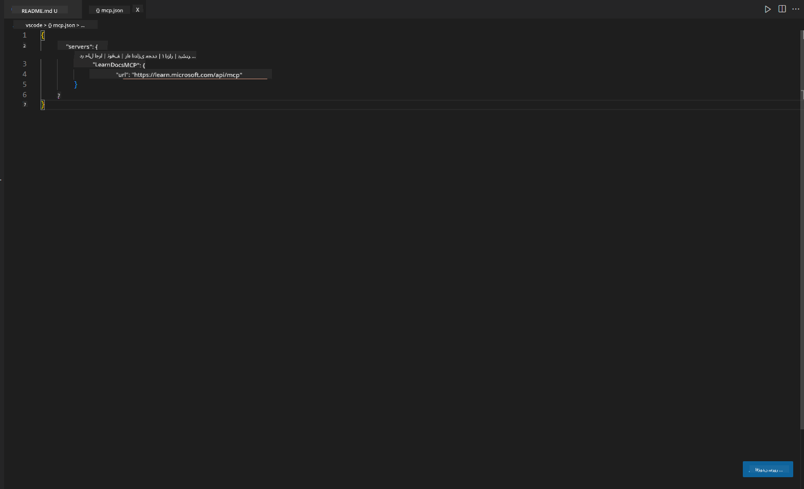
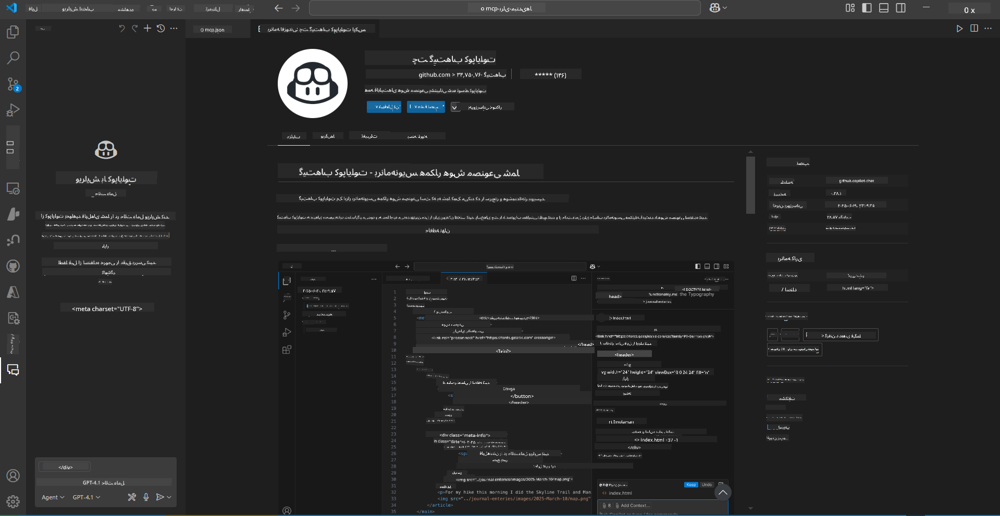
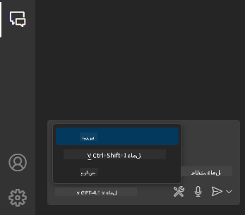
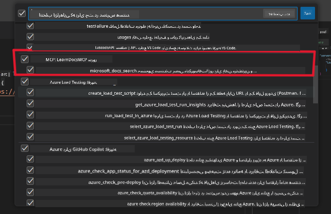
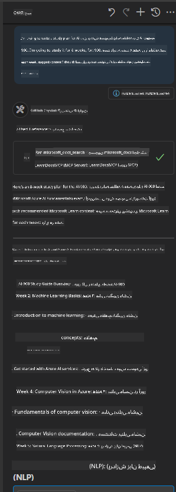
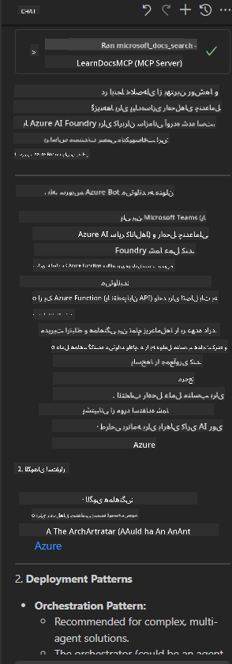

<!--
CO_OP_TRANSLATOR_METADATA:
{
  "original_hash": "db532b1ec386c9ce38c791653dc3c881",
  "translation_date": "2025-07-14T06:46:59+00:00",
  "source_file": "09-CaseStudy/docs-mcp/solution/scenario3/README.md",
  "language_code": "fa"
}
-->
# سناریو ۳: مستندات درون ویرایشگر با سرور MCP در VS Code

## مرور کلی

در این سناریو، یاد می‌گیرید چگونه مستندات Microsoft Learn را مستقیماً به محیط Visual Studio Code خود با استفاده از سرور MCP بیاورید. به جای اینکه مدام بین تب‌های مرورگر جابجا شوید و دنبال مستندات بگردید، می‌توانید مستندات رسمی را مستقیماً داخل ویرایشگر خود جستجو، مشاهده و ارجاع دهید. این روش روند کاری شما را ساده‌تر می‌کند، تمرکزتان را حفظ می‌کند و امکان یکپارچگی بی‌وقفه با ابزارهایی مثل GitHub Copilot را فراهم می‌آورد.

- جستجو و خواندن مستندات داخل VS Code بدون ترک محیط کدنویسی.
- ارجاع به مستندات و درج لینک‌ها مستقیماً در فایل README یا فایل‌های دوره.
- استفاده همزمان از GitHub Copilot و MCP برای یک روند کاری مستندسازی هوشمند و یکپارچه.

## اهداف یادگیری

تا پایان این فصل، شما خواهید فهمید چگونه سرور MCP را در VS Code راه‌اندازی و استفاده کنید تا روند مستندسازی و توسعه خود را بهبود بخشید. شما قادر خواهید بود:

- فضای کاری خود را برای استفاده از سرور MCP جهت جستجوی مستندات پیکربندی کنید.
- مستندات را مستقیماً از داخل VS Code جستجو و درج کنید.
- قدرت GitHub Copilot و MCP را برای یک روند کاری پربازده‌تر و تقویت‌شده با هوش مصنوعی ترکیب کنید.

این مهارت‌ها به شما کمک می‌کند تمرکز خود را حفظ کنید، کیفیت مستندات را بهبود دهید و بهره‌وری خود را به عنوان توسعه‌دهنده یا نویسنده فنی افزایش دهید.

## راه‌حل

برای دسترسی به مستندات درون ویرایشگر، یک سری مراحل را دنبال خواهید کرد که سرور MCP را با VS Code و GitHub Copilot یکپارچه می‌کند. این راه‌حل برای نویسندگان دوره، نویسندگان مستندات و توسعه‌دهندگانی که می‌خواهند هنگام کار با مستندات و Copilot تمرکز خود را در ویرایشگر حفظ کنند، ایده‌آل است.

- به سرعت لینک‌های ارجاعی را هنگام نوشتن مستندات دوره یا پروژه به README اضافه کنید.
- از Copilot برای تولید کد و از MCP برای یافتن و ارجاع فوری مستندات مرتبط استفاده کنید.
- در ویرایشگر خود متمرکز بمانید و بهره‌وری خود را افزایش دهید.

### راهنمای گام به گام

برای شروع، مراحل زیر را دنبال کنید. برای هر مرحله می‌توانید یک اسکرین‌شات از پوشه assets اضافه کنید تا روند کار به صورت تصویری نشان داده شود.

1. **پیکربندی MCP را اضافه کنید:**
   در ریشه پروژه خود، یک فایل `.vscode/mcp.json` بسازید و پیکربندی زیر را اضافه کنید:
   ```json
   {
     "servers": {
       "LearnDocsMCP": {
         "url": "https://learn.microsoft.com/api/mcp"
       }
     }
   }
   ```
   این پیکربندی به VS Code می‌گوید چگونه به [`Microsoft Learn Docs MCP server`](https://github.com/MicrosoftDocs/mcp) متصل شود.
   
   
    
2. **پنل گفتگوی GitHub Copilot را باز کنید:**
   اگر افزونه GitHub Copilot را نصب ندارید، به بخش Extensions در VS Code بروید و آن را نصب کنید. می‌توانید آن را مستقیماً از [بازار Visual Studio Code](https://marketplace.visualstudio.com/items?itemName=GitHub.copilot-chat) دانلود کنید. سپس پنل گفتگوی Copilot را از نوار کناری باز کنید.

   

3. **حالت agent را فعال کنید و ابزارها را بررسی کنید:**
   در پنل گفتگوی Copilot، حالت agent را فعال کنید.

   

   پس از فعال کردن حالت agent، مطمئن شوید که سرور MCP به عنوان یکی از ابزارهای موجود فهرست شده است. این تضمین می‌کند که عامل Copilot بتواند به سرور مستندات دسترسی داشته باشد و اطلاعات مرتبط را دریافت کند.
   
   
4. **یک گفتگوی جدید شروع کنید و عامل را راهنمایی کنید:**
   در پنل گفتگوی Copilot یک گفتگوی جدید باز کنید. اکنون می‌توانید سوالات مستنداتی خود را به عامل بدهید. عامل از سرور MCP برای دریافت و نمایش مستندات مرتبط Microsoft Learn مستقیماً در ویرایشگر شما استفاده خواهد کرد.

   - *"من می‌خواهم یک برنامه مطالعه برای موضوع X بنویسم. قصد دارم آن را در ۸ هفته مطالعه کنم، برای هر هفته محتوایی که باید مطالعه کنم را پیشنهاد بده."*

   

5. **پرسش زنده:**

   > بیایید یک پرسش زنده از بخش [#get-help](https://discord.gg/D6cRhjHWSC) در دیسکورد Azure AI Foundry برداریم ([مشاهده پیام اصلی](https://discord.com/channels/1113626258182504448/1385498306720829572)):
   
   *"من دنبال پاسخ‌هایی هستم درباره نحوه استقرار یک راه‌حل چندعاملی با عوامل هوش مصنوعی توسعه یافته در Azure AI Foundry. می‌بینم که روش استقرار مستقیمی وجود ندارد، مثل کانال‌های Copilot Studio. پس راه‌های مختلف برای انجام این استقرار برای کاربران سازمانی که بخواهند تعامل داشته باشند و کار را انجام دهند چیست؟
مقالات و بلاگ‌های زیادی وجود دارد که می‌گویند می‌توانیم از سرویس Azure Bot برای این کار استفاده کنیم که به عنوان پلی بین MS Teams و عوامل Azure AI Foundry عمل کند، خب آیا این کار جواب می‌دهد اگر یک Azure bot راه‌اندازی کنم که به Orchestrator Agent در Azure AI Foundry از طریق Azure function متصل شود تا هماهنگی را انجام دهد یا باید برای هر یک از عوامل هوش مصنوعی که بخشی از راه‌حل چندعاملی هستند، Azure function جداگانه بسازم تا هماهنگی در Bot framework انجام شود؟ هر پیشنهاد دیگری هم خوش‌آمد است."*

   

   عامل با لینک‌ها و خلاصه‌های مستندات مرتبط پاسخ خواهد داد که می‌توانید مستقیماً در فایل‌های markdown خود درج کنید یا به عنوان مرجع در کد استفاده نمایید.
   
### نمونه پرسش‌ها

در اینجا چند پرسش نمونه آورده شده است که می‌توانید امتحان کنید. این پرسش‌ها نشان می‌دهند چگونه سرور MCP و Copilot می‌توانند با هم کار کنند تا مستندات و ارجاعات فوری و متناسب با زمینه را بدون ترک VS Code فراهم کنند:

- "نحوه استفاده از تریگرهای Azure Functions را نشان بده."
- "یک لینک به مستندات رسمی Azure Key Vault درج کن."
- "بهترین روش‌ها برای ایمن‌سازی منابع Azure چیست؟"
- "یک راه‌اندازی سریع برای سرویس‌های Azure AI پیدا کن."

این پرسش‌ها نشان می‌دهند چگونه سرور MCP و Copilot می‌توانند با هم کار کنند تا مستندات و ارجاعات فوری و متناسب با زمینه را بدون ترک VS Code فراهم کنند.

---

**سلب مسئولیت**:  
این سند با استفاده از سرویس ترجمه هوش مصنوعی [Co-op Translator](https://github.com/Azure/co-op-translator) ترجمه شده است. در حالی که ما در تلاش برای دقت هستیم، لطفاً توجه داشته باشید که ترجمه‌های خودکار ممکن است حاوی خطاها یا نادرستی‌هایی باشند. سند اصلی به زبان بومی خود باید به عنوان منبع معتبر در نظر گرفته شود. برای اطلاعات حیاتی، ترجمه حرفه‌ای انسانی توصیه می‌شود. ما مسئول هیچ گونه سوءتفاهم یا تفسیر نادرستی که از استفاده این ترجمه ناشی شود، نیستیم.