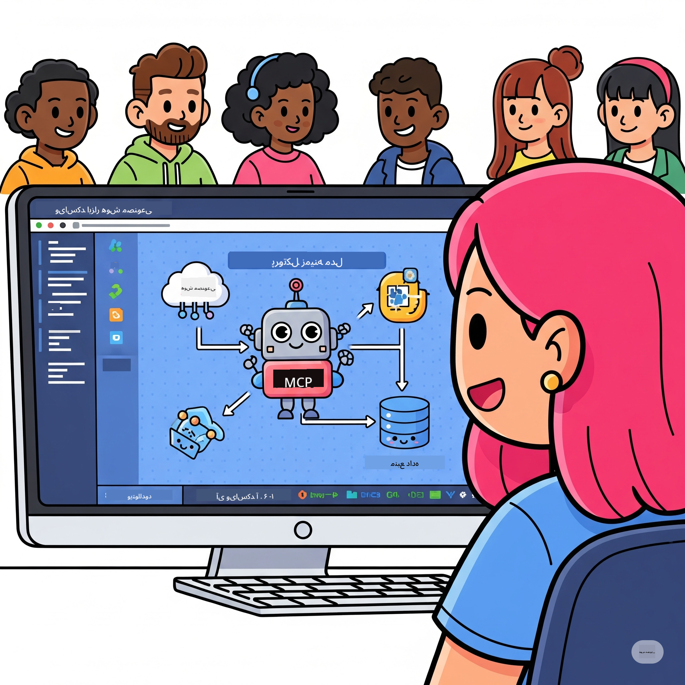
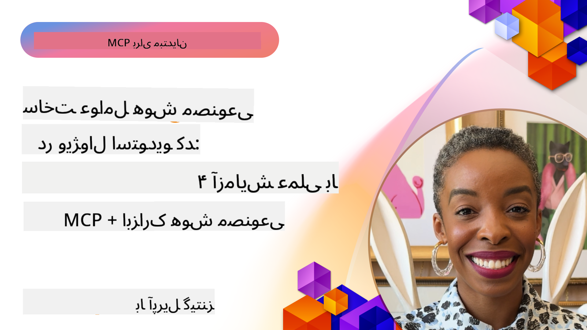

<!--
CO_OP_TRANSLATOR_METADATA:
{
  "original_hash": "1b000fd6e1b04c047578bfc5d07d54eb",
  "translation_date": "2025-07-29T01:18:01+00:00",
  "source_file": "10-StreamliningAIWorkflowsBuildingAnMCPServerWithAIToolkit/README.md",
  "language_code": "fa"
}
-->
# ساده‌سازی جریان‌های کاری هوش مصنوعی: ساخت سرور MCP با AI Toolkit

  
  

## 🎯 مرور کلی

_(برای مشاهده ویدئوی این درس روی تصویر بالا کلیک کنید)_

به کارگاه **Model Context Protocol (MCP)** خوش آمدید! این کارگاه عملی جامع، دو فناوری پیشرفته را برای تحول در توسعه برنامه‌های هوش مصنوعی ترکیب می‌کند:

- **🔗 Model Context Protocol (MCP)**: یک استاندارد باز برای یکپارچه‌سازی بی‌دردسر ابزارهای هوش مصنوعی  
- **🛠️ AI Toolkit برای Visual Studio Code (AITK)**: افزونه قدرتمند مایکروسافت برای توسعه هوش مصنوعی  

### 🎓 آنچه خواهید آموخت

تا پایان این کارگاه، مهارت ساخت برنامه‌های هوشمندی را خواهید آموخت که مدل‌های هوش مصنوعی را با ابزارها و خدمات دنیای واقعی پیوند می‌دهند. از تست خودکار گرفته تا یکپارچه‌سازی API‌های سفارشی، مهارت‌های عملی برای حل چالش‌های پیچیده کسب‌وکار به دست خواهید آورد.

## 🏗️ پشته فناوری

### 🔌 Model Context Protocol (MCP)

MCP مانند **"USB-C برای هوش مصنوعی"** است - یک استاندارد جهانی که مدل‌های هوش مصنوعی را به ابزارها و منابع داده خارجی متصل می‌کند.

**✨ ویژگی‌های کلیدی:**

- 🔄 **یکپارچه‌سازی استاندارد**: رابط جهانی برای اتصال ابزارهای هوش مصنوعی  
- 🏛️ **معماری انعطاف‌پذیر**: سرورهای محلی و راه دور از طریق stdio/SSE  
- 🧰 **اکوسیستم غنی**: ابزارها، پرامپت‌ها و منابع در یک پروتکل  
- 🔒 **آماده برای سازمان‌ها**: امنیت و قابلیت اطمینان داخلی  

**🎯 چرا MCP مهم است:**  
همان‌طور که USB-C آشفتگی کابل‌ها را از بین برد، MCP پیچیدگی یکپارچه‌سازی‌های هوش مصنوعی را حذف می‌کند. یک پروتکل، امکانات بی‌نهایت.

### 🤖 AI Toolkit برای Visual Studio Code (AITK)

افزونه پیشرو مایکروسافت برای توسعه هوش مصنوعی که VS Code را به یک مرکز قدرت هوش مصنوعی تبدیل می‌کند.

**🚀 قابلیت‌های اصلی:**

- 📦 **کاتالوگ مدل**: دسترسی به مدل‌ها از Azure AI، GitHub، Hugging Face، Ollama  
- ⚡ **استنتاج محلی**: اجرای بهینه‌شده ONNX برای CPU/GPU/NPU  
- 🏗️ **سازنده عامل**: توسعه بصری عوامل هوش مصنوعی با یکپارچه‌سازی MCP  
- 🎭 **چندوجهی**: پشتیبانی از متن، تصویر و خروجی ساختاریافته  

**💡 مزایای توسعه:**

- استقرار مدل بدون نیاز به پیکربندی  
- مهندسی پرامپت بصری  
- محیط تست بلادرنگ  
- یکپارچه‌سازی بی‌دردسر سرور MCP  

## 📚 مسیر یادگیری

### [🚀 ماژول ۱: اصول AI Toolkit](./lab1/README.md)

**مدت زمان**: ۱۵ دقیقه  

- 🛠️ نصب و پیکربندی AI Toolkit برای VS Code  
- 🗂️ کاوش در کاتالوگ مدل (بیش از ۱۰۰ مدل از GitHub، ONNX، OpenAI، Anthropic، Google)  
- 🎮 تسلط بر محیط تعاملی برای تست بلادرنگ مدل  
- 🤖 ساخت اولین عامل هوش مصنوعی با سازنده عامل  
- 📊 ارزیابی عملکرد مدل با معیارهای داخلی (F1، ارتباط، شباهت، انسجام)  
- ⚡ یادگیری قابلیت‌های پردازش دسته‌ای و پشتیبانی چندوجهی  

**🎯 نتیجه یادگیری**: ایجاد یک عامل هوش مصنوعی کاربردی با درک جامع از قابلیت‌های AITK  

### [🌐 ماژول ۲: اصول MCP با AI Toolkit](./lab2/README.md)

**مدت زمان**: ۲۰ دقیقه  

- 🧠 تسلط بر معماری و مفاهیم Model Context Protocol (MCP)  
- 🌐 کاوش در اکوسیستم سرور MCP مایکروسافت  
- 🤖 ساخت یک عامل خودکارسازی مرورگر با استفاده از سرور MCP Playwright  
- 🔧 یکپارچه‌سازی سرورهای MCP با سازنده عامل AI Toolkit  
- 📊 پیکربندی و تست ابزارهای MCP در عوامل خود  
- 🚀 صادرات و استقرار عوامل مجهز به MCP برای استفاده در تولید  

**🎯 نتیجه یادگیری**: استقرار یک عامل هوش مصنوعی تقویت‌شده با ابزارهای خارجی از طریق MCP  

### [🔧 ماژول ۳: توسعه پیشرفته MCP با AI Toolkit](./lab3/README.md)

**مدت زمان**: ۲۰ دقیقه  

- 💻 ایجاد سرورهای MCP سفارشی با استفاده از AI Toolkit  
- 🐍 پیکربندی و استفاده از جدیدترین SDK پایتون MCP (نسخه ۱.۹.۳)  
- 🔍 راه‌اندازی و استفاده از MCP Inspector برای اشکال‌زدایی  
- 🛠️ ساخت یک سرور MCP آب‌وهوا با جریان‌های کاری اشکال‌زدایی حرفه‌ای  
- 🧪 اشکال‌زدایی سرورهای MCP در محیط‌های سازنده عامل و MCP Inspector  

**🎯 نتیجه یادگیری**: توسعه و اشکال‌زدایی سرورهای MCP سفارشی با ابزارهای مدرن  

### [🐙 ماژول ۴: توسعه عملی MCP - سرور کلون سفارشی GitHub](./lab4/README.md)

**مدت زمان**: ۳۰ دقیقه  

- 🏗️ ساخت یک سرور MCP کلون GitHub واقعی برای جریان‌های کاری توسعه  
- 🔄 پیاده‌سازی کلونینگ هوشمند مخزن با اعتبارسنجی و مدیریت خطا  
- 📁 ایجاد مدیریت هوشمند دایرکتوری و یکپارچه‌سازی VS Code  
- 🤖 استفاده از حالت عامل GitHub Copilot با ابزارهای سفارشی MCP  
- 🛡️ اعمال قابلیت اطمینان آماده تولید و سازگاری چندپلتفرمی  

**🎯 نتیجه یادگیری**: استقرار یک سرور MCP آماده تولید که جریان‌های کاری توسعه واقعی را ساده می‌کند  

## 💡 کاربردها و تأثیرات دنیای واقعی

### 🏢 موارد استفاده سازمانی

#### 🔄 خودکارسازی DevOps

تحول در جریان کاری توسعه با خودکارسازی هوشمند:  

- **مدیریت هوشمند مخزن**: بررسی کد و تصمیمات ادغام مبتنی بر هوش مصنوعی  
- **CI/CD هوشمند**: بهینه‌سازی خودکار خط لوله بر اساس تغییرات کد  
- **اولویت‌بندی مشکلات**: طبقه‌بندی و تخصیص خودکار باگ‌ها  

#### 🧪 انقلاب تضمین کیفیت

ارتقای تست با خودکارسازی مبتنی بر هوش مصنوعی:  

- **تولید تست هوشمند**: ایجاد مجموعه‌های تست جامع به‌صورت خودکار  
- **تست رگرسیون بصری**: تشخیص تغییرات UI با هوش مصنوعی  
- **نظارت بر عملکرد**: شناسایی و حل مشکلات به‌صورت پیشگیرانه  

#### 📊 هوشمندی در جریان داده

ساخت جریان‌های پردازش داده هوشمندتر:  

- **فرآیندهای ETL تطبیقی**: تبدیل داده‌های خودبهینه‌شونده  
- **تشخیص ناهنجاری**: نظارت بلادرنگ بر کیفیت داده‌ها  
- **مسیر‌یابی هوشمند**: مدیریت هوشمند جریان داده  

#### 🎧 ارتقای تجربه مشتری

ایجاد تعاملات استثنایی با مشتری:  

- **پشتیبانی آگاه از زمینه**: عوامل هوش مصنوعی با دسترسی به تاریخچه مشتری  
- **حل مشکلات پیشگیرانه**: خدمات مشتری پیش‌بینی‌کننده  
- **یکپارچه‌سازی چندکاناله**: تجربه هوش مصنوعی یکپارچه در پلتفرم‌ها  

## 🛠️ پیش‌نیازها و تنظیمات

### 💻 الزامات سیستم

| مؤلفه | نیازمندی | توضیحات |  
|-----------|-------------|-------|  
| **سیستم‌عامل** | ویندوز ۱۰+، macOS 10.15+، لینوکس | هر سیستم‌عامل مدرن |  
| **Visual Studio Code** | آخرین نسخه پایدار | موردنیاز برای AITK |  
| **Node.js** | نسخه ۱۸.۰+ و npm | برای توسعه سرور MCP |  
| **پایتون** | ۳.۱۰+ | اختیاری برای سرورهای MCP پایتون |  
| **حافظه** | حداقل ۸ گیگابایت RAM | ۱۶ گیگابایت برای مدل‌های محلی توصیه می‌شود |  

### 🔧 محیط توسعه

#### افزونه‌های پیشنهادی VS Code

- **AI Toolkit** (ms-windows-ai-studio.windows-ai-studio)  
- **Python** (ms-python.python)  
- **Python Debugger** (ms-python.debugpy)  
- **GitHub Copilot** (GitHub.copilot) - اختیاری اما مفید  

#### ابزارهای اختیاری

- **uv**: مدیر بسته مدرن پایتون  
- **MCP Inspector**: ابزار اشکال‌زدایی بصری برای سرورهای MCP  
- **Playwright**: برای مثال‌های خودکارسازی وب  

## 🎖️ نتایج یادگیری و مسیر گواهینامه

### 🏆 چک‌لیست تسلط بر مهارت‌ها

با تکمیل این کارگاه، در موارد زیر مهارت خواهید یافت:

#### 🎯 شایستگی‌های اصلی

- [ ] **تسلط بر پروتکل MCP**: درک عمیق از معماری و الگوهای پیاده‌سازی  
- [ ] **مهارت در AITK**: استفاده در سطح کارشناسی از AI Toolkit برای توسعه سریع  
- [ ] **توسعه سرور سفارشی**: ساخت، استقرار و نگهداری سرورهای MCP تولیدی  
- [ ] **یکپارچه‌سازی ابزارها**: اتصال بی‌دردسر هوش مصنوعی با جریان‌های کاری توسعه موجود  
- [ ] **کاربرد حل مسئله**: اعمال مهارت‌های آموخته‌شده برای چالش‌های واقعی کسب‌وکار  

#### 🔧 مهارت‌های فنی

- [ ] تنظیم و پیکربندی AI Toolkit در VS Code  
- [ ] طراحی و پیاده‌سازی سرورهای MCP سفارشی  
- [ ] یکپارچه‌سازی مدل‌های GitHub با معماری MCP  
- [ ] ساخت جریان‌های کاری تست خودکار با Playwright  
- [ ] استقرار عوامل هوش مصنوعی برای استفاده در تولید  
- [ ] اشکال‌زدایی و بهینه‌سازی عملکرد سرور MCP  

#### 🚀 قابلیت‌های پیشرفته

- [ ] معماری یکپارچه‌سازی‌های هوش مصنوعی در مقیاس سازمانی  
- [ ] پیاده‌سازی بهترین شیوه‌های امنیتی برای برنامه‌های هوش مصنوعی  
- [ ] طراحی معماری‌های سرور MCP مقیاس‌پذیر  
- [ ] ایجاد زنجیره‌های ابزار سفارشی برای حوزه‌های خاص  
- [ ] راهنمایی دیگران در توسعه بومی هوش مصنوعی  

## 📖 منابع اضافی

- [مشخصات MCP](https://modelcontextprotocol.io/docs)  
- [مخزن GitHub AI Toolkit](https://github.com/microsoft/vscode-ai-toolkit)  
- [مجموعه سرورهای نمونه MCP](https://github.com/modelcontextprotocol/servers)  
- [راهنمای بهترین شیوه‌ها](https://modelcontextprotocol.io/docs/best-practices)  

---

**🚀 آماده‌اید جریان کاری توسعه هوش مصنوعی خود را متحول کنید؟**

بیایید با MCP و AI Toolkit آینده برنامه‌های هوشمند را با هم بسازیم!  

**سلب مسئولیت**:  
این سند با استفاده از سرویس ترجمه هوش مصنوعی [Co-op Translator](https://github.com/Azure/co-op-translator) ترجمه شده است. در حالی که ما تلاش می‌کنیم دقت را حفظ کنیم، لطفاً توجه داشته باشید که ترجمه‌های خودکار ممکن است شامل خطاها یا نادرستی‌ها باشند. سند اصلی به زبان اصلی آن باید به عنوان منبع معتبر در نظر گرفته شود. برای اطلاعات حساس، توصیه می‌شود از ترجمه حرفه‌ای انسانی استفاده کنید. ما مسئولیتی در قبال سوء تفاهم‌ها یا تفسیرهای نادرست ناشی از استفاده از این ترجمه نداریم.