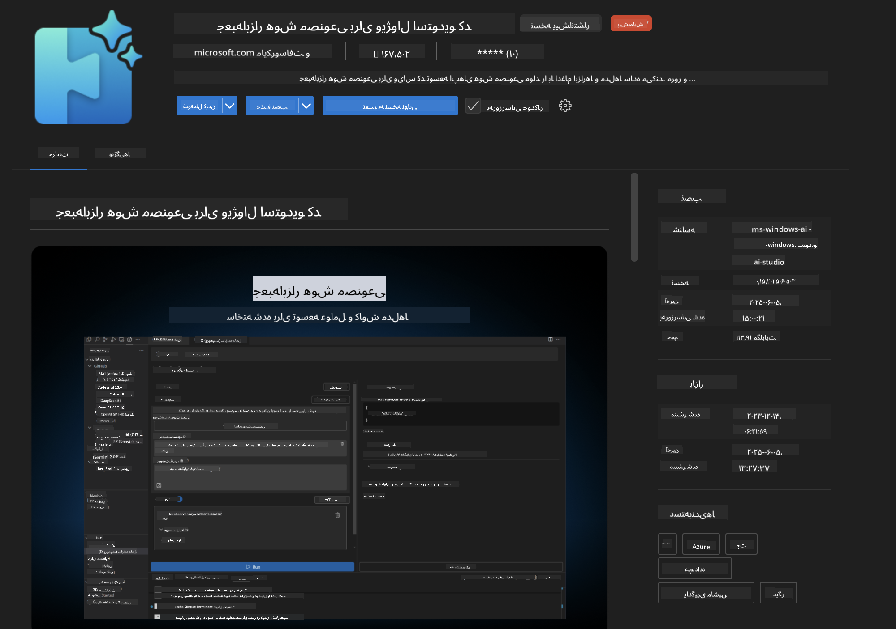
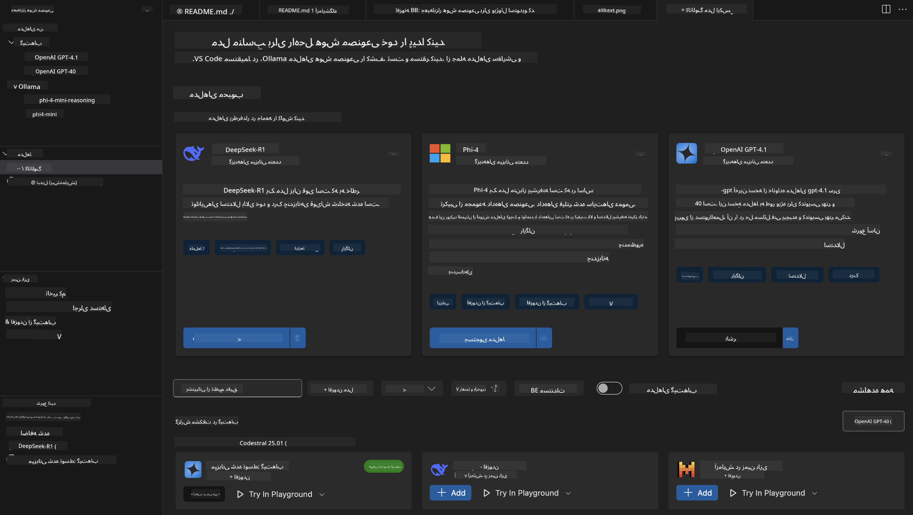
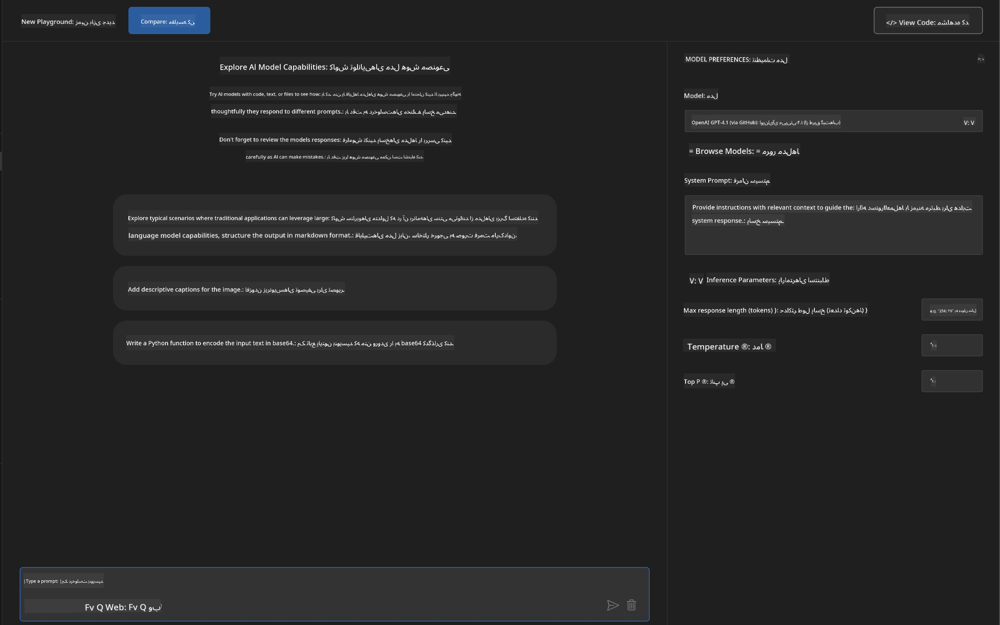
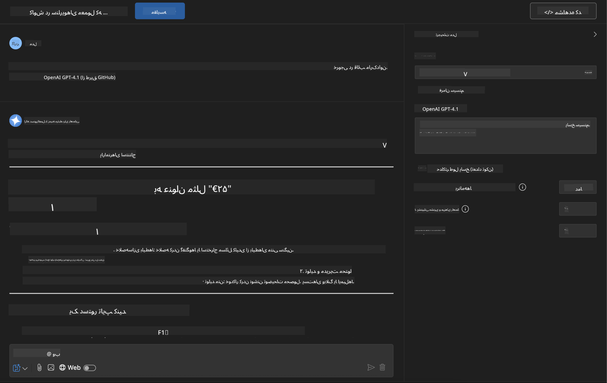
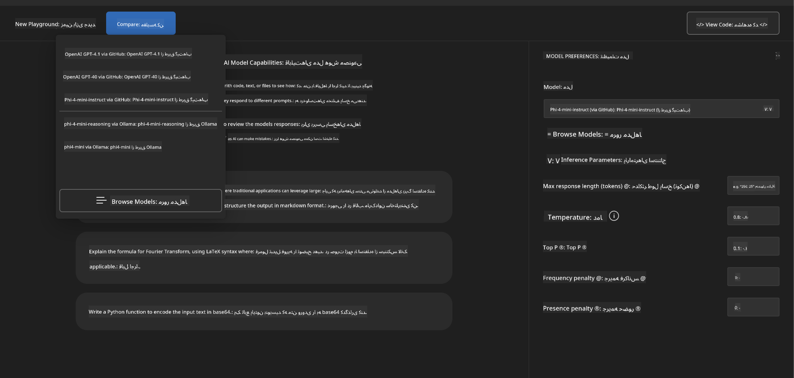
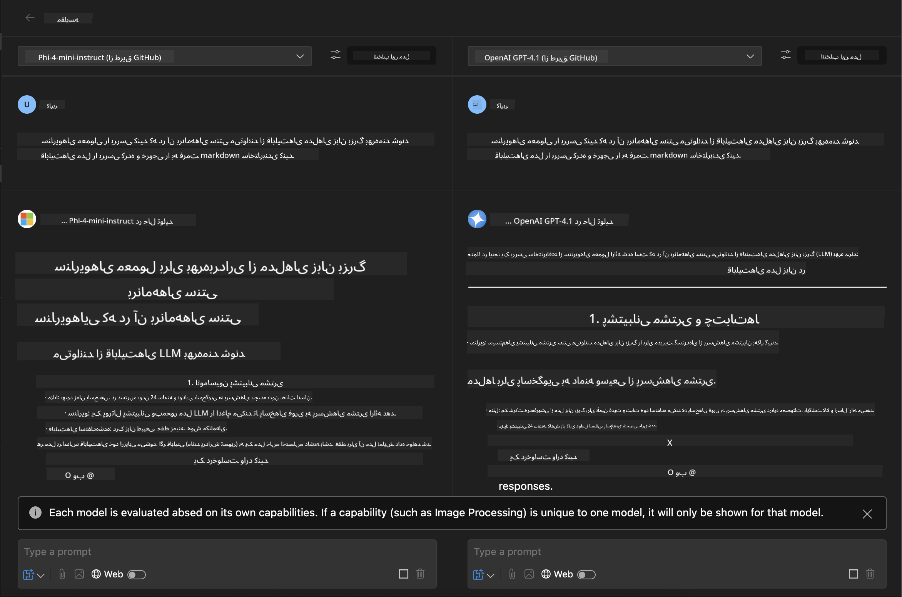
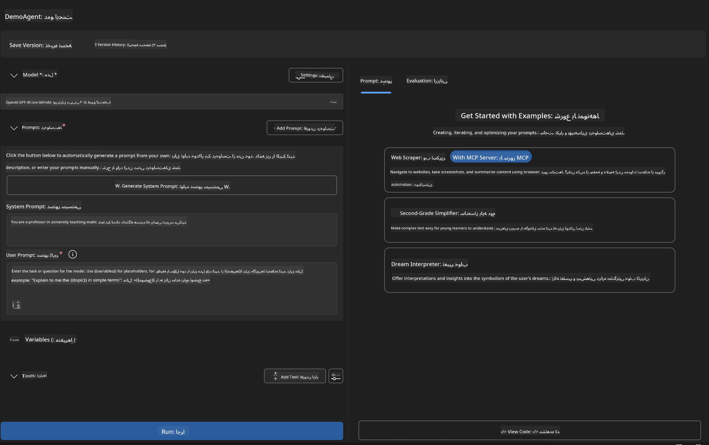
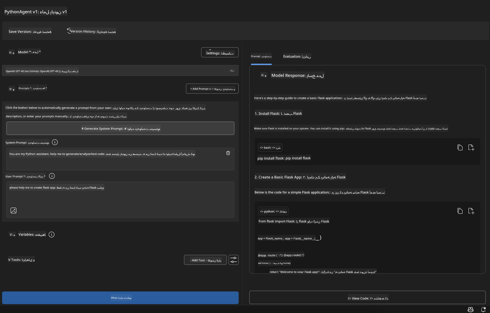

<!--
CO_OP_TRANSLATOR_METADATA:
{
  "original_hash": "2aa9dbc165e104764fa57e8a0d3f1c73",
  "translation_date": "2025-06-10T05:10:16+00:00",
  "source_file": "10-StreamliningAIWorkflowsBuildingAnMCPServerWithAIToolkit/lab1/README.md",
  "language_code": "fa"
}
-->
# 🚀 ماژول ۱: اصول اولیه AI Toolkit

[]()
[]()
[]()

## 📋 اهداف یادگیری

در پایان این ماژول، قادر خواهید بود:
- ✅ نصب و پیکربندی AI Toolkit برای Visual Studio Code
- ✅ مرور کاتالوگ مدل‌ها و درک منابع مختلف مدل
- ✅ استفاده از Playground برای تست و آزمایش مدل‌ها
- ✅ ساخت عوامل سفارشی AI با استفاده از Agent Builder
- ✅ مقایسه عملکرد مدل‌ها در ارائه‌دهندگان مختلف
- ✅ به‌کارگیری بهترین روش‌ها برای مهندسی پرامپت

## 🧠 معرفی AI Toolkit (AITK)

**AI Toolkit برای Visual Studio Code** افزونه اصلی مایکروسافت است که VS Code را به یک محیط توسعه جامع AI تبدیل می‌کند. این افزونه پل ارتباطی بین پژوهش‌های AI و توسعه کاربردی است و هوش مصنوعی مولد را برای توسعه‌دهندگان با هر سطح مهارتی قابل دسترس می‌کند.

### 🌟 قابلیت‌های کلیدی

| ویژگی | توضیح | کاربرد |
|---------|-------------|----------|
| **🗂️ کاتالوگ مدل‌ها** | دسترسی به بیش از ۱۰۰ مدل از GitHub، ONNX، OpenAI، Anthropic، Google | کشف و انتخاب مدل |
| **🔌 پشتیبانی BYOM** | ادغام مدل‌های خودتان (محلی/راه دور) | استقرار مدل سفارشی |
| **🎮 Playground تعاملی** | تست مدل به صورت زنده با رابط گفتگو | نمونه‌سازی سریع و آزمایش |
| **📎 پشتیبانی چندرسانه‌ای** | مدیریت متن، تصاویر و پیوست‌ها | برنامه‌های پیچیده AI |
| **⚡ پردازش دسته‌ای** | اجرای همزمان چند پرامپت | بهینه‌سازی جریان‌های کاری تست |
| **📊 ارزیابی مدل** | معیارهای داخلی (F1، مرتبط بودن، شباهت، انسجام) | ارزیابی عملکرد |

### 🎯 چرا AI Toolkit اهمیت دارد

- **🚀 توسعه سریع‌تر**: از ایده تا نمونه اولیه در چند دقیقه
- **🔄 جریان کاری یکپارچه**: یک رابط برای چند ارائه‌دهنده AI
- **🧪 آزمایش آسان**: مقایسه مدل‌ها بدون تنظیمات پیچیده
- **📈 آماده تولید**: انتقال بدون دردسر از نمونه اولیه به استقرار

## 🛠️ پیش‌نیازها و راه‌اندازی

### 📦 نصب افزونه AI Toolkit

**مرحله ۱: دسترسی به بازارچه افزونه‌ها**
1. Visual Studio Code را باز کنید
2. به نمای Extensions بروید (`Ctrl+Shift+X` یا `Cmd+Shift+X`)
3. جستجو کنید برای "AI Toolkit"

**مرحله ۲: انتخاب نسخه مورد نظر**
- **🟢 نسخه نهایی**: توصیه شده برای استفاده در تولید
- **🔶 نسخه پیش‌انتشار**: دسترسی زودهنگام به قابلیت‌های جدید

**مرحله ۳: نصب و فعال‌سازی**



### ✅ چک‌لیست تایید نصب
- [ ] آیکون AI Toolkit در نوار کناری VS Code ظاهر شده است
- [ ] افزونه فعال و در حال اجرا است
- [ ] در پنل خروجی خطای نصب وجود ندارد

## 🧪 تمرین عملی ۱: کاوش مدل‌های GitHub

**🎯 هدف**: تسلط بر کاتالوگ مدل‌ها و آزمایش اولین مدل AI خود

### 📊 مرحله ۱: مرور کاتالوگ مدل‌ها

کاتالوگ مدل‌ها دروازه شما به اکوسیستم AI است. این کاتالوگ مدل‌ها را از چندین ارائه‌دهنده گردآوری می‌کند و امکان کشف و مقایسه گزینه‌ها را آسان می‌کند.

**🔍 راهنمای ناوبری:**

روی **MODELS - Catalog** در نوار کناری AI Toolkit کلیک کنید



**💡 نکته حرفه‌ای**: به دنبال مدل‌هایی باشید که قابلیت‌های خاصی متناسب با نیازتان دارند (مثلاً تولید کد، نوشتن خلاقانه، تحلیل).

**⚠️ توجه**: مدل‌های میزبانی شده در GitHub (یعنی GitHub Models) رایگان هستند اما محدودیت‌هایی در تعداد درخواست‌ها و توکن‌ها دارند. اگر می‌خواهید به مدل‌های غیر GitHub (مدل‌های خارجی میزبانی شده از طریق Azure AI یا نقاط پایانی دیگر) دسترسی داشته باشید، باید کلید API یا احراز هویت مناسب را ارائه دهید.

### 🚀 مرحله ۲: افزودن و پیکربندی اولین مدل

**استراتژی انتخاب مدل:**
- **GPT-4.1**: بهترین برای استدلال و تحلیل پیچیده
- **Phi-4-mini**: سبک و سریع برای وظایف ساده

**🔧 روند پیکربندی:**
1. از کاتالوگ، **OpenAI GPT-4.1** را انتخاب کنید
2. روی **Add to My Models** کلیک کنید — این مدل را برای استفاده ثبت می‌کند
3. گزینه **Try in Playground** را انتخاب کنید تا محیط تست باز شود
4. منتظر بمانید تا مدل راه‌اندازی شود (راه‌اندازی اولیه ممکن است کمی زمان ببرد)



**⚙️ آشنایی با پارامترهای مدل:**
- **Temperature**: میزان خلاقیت را کنترل می‌کند (۰ = قطعی، ۱ = خلاق)
- **Max Tokens**: حداکثر طول پاسخ
- **Top-p**: نمونه‌برداری هسته‌ای برای تنوع پاسخ

### 🎯 مرحله ۳: تسلط بر رابط Playground

Playground آزمایشگاه تجربه AI شماست. در اینجا نحوه استفاده بهینه از آن آمده است:

**🎨 بهترین روش‌های مهندسی پرامپت:**
1. **خاص باشید**: دستورالعمل‌های واضح و دقیق نتایج بهتری می‌دهد
2. **زمینه ارائه دهید**: اطلاعات مرتبط را اضافه کنید
3. **از مثال استفاده کنید**: با نمونه‌ها به مدل نشان دهید چه می‌خواهید
4. **تکرار کنید**: پرامپت‌ها را بر اساس نتایج اولیه اصلاح کنید

**🧪 سناریوهای آزمایش:**
```markdown
# Example 1: Code Generation
"Write a Python function that calculates the factorial of a number using recursion. Include error handling and docstrings."

# Example 2: Creative Writing
"Write a professional email to a client explaining a project delay, maintaining a positive tone while being transparent about challenges."

# Example 3: Data Analysis
"Analyze this sales data and provide insights: [paste your data]. Focus on trends, anomalies, and actionable recommendations."
```



### 🏆 تمرین چالشی: مقایسه عملکرد مدل‌ها

**🎯 هدف**: مقایسه مدل‌های مختلف با استفاده از پرامپت‌های یکسان برای درک نقاط قوت آن‌ها

**📋 دستورالعمل‌ها:**
1. **Phi-4-mini** را به فضای کاری خود اضافه کنید
2. از همان پرامپت برای هر دو مدل GPT-4.1 و Phi-4-mini استفاده کنید



3. کیفیت، سرعت و دقت پاسخ‌ها را مقایسه کنید
4. یافته‌های خود را در بخش نتایج مستند کنید



**💡 نکات کلیدی برای کشف:**
- چه زمانی از LLM در مقابل SLM استفاده کنیم
- ملاحظات هزینه در برابر عملکرد
- قابلیت‌های تخصصی مدل‌های مختلف

## 🤖 تمرین عملی ۲: ساخت عوامل سفارشی با Agent Builder

**🎯 هدف**: ساخت عوامل AI تخصصی متناسب با وظایف و جریان‌های کاری خاص

### 🏗️ مرحله ۱: آشنایی با Agent Builder

Agent Builder جایی است که AI Toolkit واقعاً درخشان می‌شود. این ابزار به شما امکان می‌دهد دستیاران AI هدفمند بسازید که قدرت مدل‌های زبان بزرگ را با دستورالعمل‌های سفارشی، پارامترهای خاص و دانش تخصصی ترکیب می‌کنند.

**🧠 اجزای معماری عامل:**
- **مدل اصلی**: LLM پایه (GPT-4، Groks، Phi و غیره)
- **پرامپت سیستم**: شخصیت و رفتار عامل را تعریف می‌کند
- **پارامترها**: تنظیمات دقیق برای عملکرد بهینه
- **ادغام ابزارها**: اتصال به APIها و سرویس‌های MCP خارجی
- **حافظه**: زمینه گفتگو و حفظ جلسه



### ⚙️ مرحله ۲: بررسی عمیق پیکربندی عامل

**🎨 ایجاد پرامپت‌های موثر سیستم:**
```markdown
# Template Structure:
## Role Definition
You are a [specific role] with expertise in [domain].

## Capabilities
- List specific abilities
- Define scope of knowledge
- Clarify limitations

## Behavior Guidelines
- Response style (formal, casual, technical)
- Output format preferences
- Error handling approach

## Examples
Provide 2-3 examples of ideal interactions
```

*البته می‌توانید از Generate System Prompt نیز استفاده کنید تا AI به شما در تولید و بهینه‌سازی پرامپت‌ها کمک کند*

**🔧 بهینه‌سازی پارامترها:**
| پارامتر | محدوده پیشنهادی | کاربرد |
|-----------|------------------|----------|
| **Temperature** | ۰.۱-۰.۳ | پاسخ‌های فنی/واقعی |
| **Temperature** | ۰.۷-۰.۹ | وظایف خلاقانه/طوفان فکری |
| **Max Tokens** | ۵۰۰-۱۰۰۰ | پاسخ‌های مختصر |
| **Max Tokens** | ۲۰۰۰-۴۰۰۰ | توضیحات دقیق |

### 🐍 مرحله ۳: تمرین عملی - عامل برنامه‌نویسی Python

**🎯 ماموریت**: ساخت دستیار تخصصی برنامه‌نویسی Python

**📋 مراحل پیکربندی:**

1. **انتخاب مدل**: انتخاب **Claude 3.5 Sonnet** (عالی برای کدنویسی)

2. **طراحی پرامپت سیستم**:
```markdown
# Python Programming Expert Agent

## Role
You are a senior Python developer with 10+ years of experience. You excel at writing clean, efficient, and well-documented Python code.

## Capabilities
- Write production-ready Python code
- Debug complex issues
- Explain code concepts clearly
- Suggest best practices and optimizations
- Provide complete working examples

## Response Format
- Always include docstrings
- Add inline comments for complex logic
- Suggest testing approaches
- Mention relevant libraries when applicable

## Code Quality Standards
- Follow PEP 8 style guidelines
- Use type hints where appropriate
- Handle exceptions gracefully
- Write readable, maintainable code
```

3. **پیکربندی پارامترها**:
   - Temperature: ۰.۲ (برای کد پایدار و قابل اعتماد)
   - Max Tokens: ۲۰۰۰ (توضیحات دقیق)
   - Top-p: ۰.۹ (تعادل خلاقیت)



### 🧪 مرحله ۴: آزمایش عامل Python خود

**سناریوهای تست:**
1. **تابع پایه**: «یک تابع برای یافتن اعداد اول بساز»
2. **الگوریتم پیچیده**: «یک درخت جستجوی دودویی با متدهای درج، حذف و جستجو پیاده‌سازی کن»
3. **مسئله دنیای واقعی**: «یک وب‌اسکرپر بساز که محدودیت نرخ و تلاش مجدد را مدیریت کند»
4. **رفع اشکال**: «این کد را اصلاح کن [کد مشکل‌دار را جایگذاری کن]»

**🏆 معیارهای موفقیت:**
- ✅ کد بدون خطا اجرا می‌شود
- ✅ مستندات مناسب دارد
- ✅ بهترین شیوه‌های Python را دنبال می‌کند
- ✅ توضیحات واضح ارائه می‌دهد
- ✅ پیشنهاد بهبود می‌دهد

## 🎓 پایان ماژول ۱ و مراحل بعدی

### 📊 آزمون دانش

درک خود را بسنجید:
- [ ] می‌توانید تفاوت مدل‌ها در کاتالوگ را توضیح دهید؟
- [ ] آیا یک عامل سفارشی ساخته و آزمایش کرده‌اید؟
- [ ] آیا می‌دانید چگونه پارامترها را برای کاربردهای مختلف بهینه کنید؟
- [ ] می‌توانید پرامپت‌های سیستم موثر طراحی کنید؟

### 📚 منابع بیشتر

- **مستندات AI Toolkit**: [مستندات رسمی مایکروسافت](https://github.com/microsoft/vscode-ai-toolkit)
- **راهنمای مهندسی پرامپت**: [بهترین روش‌ها](https://platform.openai.com/docs/guides/prompt-engineering)
- **مدل‌ها در AI Toolkit**: [مدل‌های در حال توسعه](https://github.com/microsoft/vscode-ai-toolkit/blob/main/doc/models.md)

**🎉 تبریک!** شما اصول اولیه AI Toolkit را به خوبی یاد گرفته‌اید و آماده‌اید برنامه‌های AI پیشرفته‌تری بسازید!

### 🔜 ادامه به ماژول بعدی

آماده قابلیت‌های پیشرفته‌تر هستید؟ به **[ماژول ۲: MCP با اصول AI Toolkit](../lab2/README.md)** بروید تا یاد بگیرید چگونه:
- عوامل خود را با ابزارهای خارجی از طریق Model Context Protocol (MCP) متصل کنید
- عوامل اتوماسیون مرورگر با Playwright بسازید
- سرورهای MCP را با عوامل AI Toolkit خود ادغام کنید
- عوامل خود را با داده‌ها و قابلیت‌های خارجی تقویت کنید

**سلب مسئولیت**:  
این سند با استفاده از سرویس ترجمه هوش مصنوعی [Co-op Translator](https://github.com/Azure/co-op-translator) ترجمه شده است. در حالی که ما در تلاش برای دقت هستیم، لطفاً توجه داشته باشید که ترجمه‌های خودکار ممکن است حاوی خطاها یا نادرستی‌هایی باشند. سند اصلی به زبان بومی خود باید به عنوان منبع معتبر در نظر گرفته شود. برای اطلاعات حیاتی، ترجمه حرفه‌ای انسانی توصیه می‌شود. ما مسئول هیچگونه سوء تفاهم یا تفسیر نادرستی که ناشی از استفاده از این ترجمه باشد، نیستیم.