<!--
CO_OP_TRANSLATOR_METADATA:
{
  "original_hash": "a22b7dd11cd7690f99f9195877cafdc3",
  "translation_date": "2025-07-14T07:41:38+00:00",
  "source_file": "10-StreamliningAIWorkflowsBuildingAnMCPServerWithAIToolkit/lab2/README.md",
  "language_code": "fa"
}
-->
# 🌐 ماژول ۲: اصول MCP با جعبه‌ابزار هوش مصنوعی

[]()
[]()
[]()

## 📋 اهداف یادگیری

در پایان این ماژول، شما قادر خواهید بود:
- ✅ معماری و مزایای پروتکل مدل کانتکست (MCP) را درک کنید
- ✅ اکوسیستم سرورهای MCP مایکروسافت را بررسی کنید
- ✅ سرورهای MCP را با AI Toolkit Agent Builder یکپارچه کنید
- ✅ یک عامل خودکارسازی مرورگر کاربردی با استفاده از Playwright MCP بسازید
- ✅ ابزارهای MCP را درون عوامل خود پیکربندی و آزمایش کنید
- ✅ عوامل مجهز به MCP را برای استفاده در محیط تولید صادر و مستقر کنید

## 🎯 ادامه مسیر از ماژول ۱

در ماژول ۱، اصول اولیه AI Toolkit را یاد گرفتیم و اولین عامل پایتون خود را ساختیم. حالا با اتصال عوامل شما به ابزارها و سرویس‌های خارجی از طریق پروتکل انقلابی **Model Context Protocol (MCP)**، آن‌ها را **تقویت** می‌کنیم.

این را مثل ارتقا از یک ماشین حساب ساده به یک کامپیوتر کامل در نظر بگیرید - عوامل هوش مصنوعی شما توانایی خواهند داشت:
- 🌐 مرور و تعامل با وب‌سایت‌ها
- 📁 دسترسی و مدیریت فایل‌ها
- 🔧 یکپارچه‌سازی با سیستم‌های سازمانی
- 📊 پردازش داده‌های لحظه‌ای از APIها

## 🧠 آشنایی با پروتکل مدل کانتکست (MCP)

### 🔍 MCP چیست؟

پروتکل مدل کانتکست (MCP) مانند **"USB-C برای برنامه‌های هوش مصنوعی"** است - یک استاندارد باز انقلابی که مدل‌های زبان بزرگ (LLM) را به ابزارها، منابع داده و سرویس‌های خارجی متصل می‌کند. همانطور که USB-C با ارائه یک کانکتور جهانی، آشفتگی کابل‌ها را از بین برد، MCP نیز پیچیدگی یکپارچه‌سازی هوش مصنوعی را با یک پروتکل استاندارد حذف می‌کند.

### 🎯 مشکلی که MCP حل می‌کند

**قبل از MCP:**
- 🔧 یکپارچه‌سازی‌های سفارشی برای هر ابزار
- 🔄 وابستگی به فروشنده با راه‌حل‌های اختصاصی  
- 🔒 آسیب‌پذیری‌های امنیتی ناشی از اتصالات موقتی
- ⏱️ ماه‌ها توسعه برای یکپارچه‌سازی‌های پایه

**با MCP:**
- ⚡ اتصال ابزارها به صورت پلاگ‌اند-پلی
- 🔄 معماری مستقل از فروشنده
- 🛡️ رعایت بهترین شیوه‌های امنیتی به صورت پیش‌فرض
- 🚀 افزودن قابلیت‌های جدید در عرض چند دقیقه

### 🏗️ بررسی عمیق معماری MCP

MCP از معماری **کلاینت-سرور** پیروی می‌کند که یک اکوسیستم امن و مقیاس‌پذیر ایجاد می‌کند:

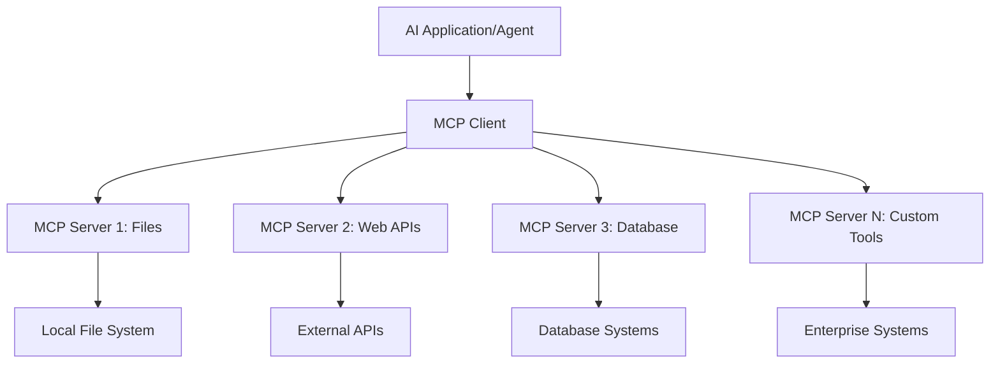

**🔧 اجزای اصلی:**

| جزء | نقش | مثال‌ها |
|-----------|------|----------|
| **میزبان‌های MCP** | برنامه‌هایی که خدمات MCP را مصرف می‌کنند | Claude Desktop، VS Code، AI Toolkit |
| **کلاینت‌های MCP** | مدیریت‌کننده‌های پروتکل (یک به یک با سرورها) | در برنامه‌های میزبان تعبیه شده‌اند |
| **سرورهای MCP** | ارائه قابلیت‌ها از طریق پروتکل استاندارد | Playwright، Files، Azure، GitHub |
| **لایه انتقال** | روش‌های ارتباطی | stdio، HTTP، WebSockets |


## 🏢 اکوسیستم سرورهای MCP مایکروسافت

مایکروسافت با مجموعه‌ای جامع از سرورهای سازمانی MCP پیشرو است که نیازهای واقعی کسب‌وکار را برطرف می‌کنند.

### 🌟 سرورهای برجسته MCP مایکروسافت

#### ۱. ☁️ سرور Azure MCP
**🔗 مخزن**: [azure/azure-mcp](https://github.com/azure/azure-mcp)
**🎯 هدف**: مدیریت جامع منابع Azure با یکپارچه‌سازی هوش مصنوعی

**✨ ویژگی‌های کلیدی:**
- فراهم‌سازی زیرساخت به صورت اعلامی
- نظارت لحظه‌ای بر منابع
- پیشنهادات بهینه‌سازی هزینه
- بررسی تطابق امنیتی

**🚀 موارد استفاده:**
- زیرساخت به عنوان کد با کمک هوش مصنوعی
- مقیاس‌پذیری خودکار منابع
- بهینه‌سازی هزینه‌های ابری
- خودکارسازی جریان‌های کاری DevOps

#### ۲. 📊 Microsoft Dataverse MCP
**📚 مستندات**: [Microsoft Dataverse Integration](https://go.microsoft.com/fwlink/?linkid=2320176)
**🎯 هدف**: رابط زبان طبیعی برای داده‌های کسب‌وکار

**✨ ویژگی‌های کلیدی:**
- پرس‌وجوهای پایگاه داده به زبان طبیعی
- درک زمینه کسب‌وکار
- قالب‌های سفارشی پرامپت
- حاکمیت داده‌های سازمانی

**🚀 موارد استفاده:**
- گزارش‌دهی هوش تجاری
- تحلیل داده‌های مشتری
- بینش‌های خط فروش
- پرس‌وجوهای داده‌های تطبیقی

#### ۳. 🌐 سرور Playwright MCP
**🔗 مخزن**: [microsoft/playwright-mcp](https://github.com/microsoft/playwright-mcp)
**🎯 هدف**: خودکارسازی مرورگر و قابلیت‌های تعامل وب

**✨ ویژگی‌های کلیدی:**
- خودکارسازی چندمرورگری (کروم، فایرفاکس، سافاری)
- شناسایی هوشمند عناصر
- تولید اسکرین‌شات و PDF
- نظارت بر ترافیک شبکه

**🚀 موارد استفاده:**
- جریان‌های کاری تست خودکار
- استخراج داده و وب‌اسکرپینگ
- نظارت بر UI/UX
- خودکارسازی تحلیل رقابتی

#### ۴. 📁 سرور Files MCP
**🔗 مخزن**: [microsoft/files-mcp-server](https://github.com/microsoft/files-mcp-server)
**🎯 هدف**: عملیات هوشمند سیستم فایل

**✨ ویژگی‌های کلیدی:**
- مدیریت فایل به صورت اعلامی
- همگام‌سازی محتوا
- یکپارچه‌سازی کنترل نسخه
- استخراج فراداده

**🚀 موارد استفاده:**
- مدیریت مستندات
- سازماندهی مخازن کد
- جریان‌های کاری انتشار محتوا
- مدیریت فایل‌های خط لوله داده

#### ۵. 📝 سرور MarkItDown MCP
**🔗 مخزن**: [microsoft/markitdown](https://github.com/microsoft/markitdown)
**🎯 هدف**: پردازش و دستکاری پیشرفته Markdown

**✨ ویژگی‌های کلیدی:**
- تجزیه غنی Markdown
- تبدیل فرمت (MD ↔ HTML ↔ PDF)
- تحلیل ساختار محتوا
- پردازش قالب‌ها

**🚀 موارد استفاده:**
- جریان‌های کاری مستندسازی فنی
- سیستم‌های مدیریت محتوا
- تولید گزارش
- خودکارسازی پایگاه دانش

#### ۶. 📈 سرور Clarity MCP
**📦 بسته**: [@microsoft/clarity-mcp-server](https://www.npmjs.com/package/@microsoft/clarity-mcp-server)
**🎯 هدف**: تحلیل وب و بینش رفتار کاربران

**✨ ویژگی‌های کلیدی:**
- تحلیل داده‌های نقشه حرارتی
- ضبط جلسات کاربر
- معیارهای عملکرد
- تحلیل قیف تبدیل

**🚀 موارد استفاده:**
- بهینه‌سازی وب‌سایت
- پژوهش تجربه کاربری
- تحلیل تست A/B
- داشبوردهای هوش تجاری

### 🌍 اکوسیستم جامعه

علاوه بر سرورهای مایکروسافت، اکوسیستم MCP شامل موارد زیر است:
- **🐙 GitHub MCP**: مدیریت مخازن و تحلیل کد
- **🗄️ MCPهای پایگاه داده**: یکپارچه‌سازی PostgreSQL، MySQL، MongoDB
- **☁️ MCPهای ارائه‌دهنده ابری**: ابزارهای AWS، GCP، Digital Ocean
- **📧 MCPهای ارتباطی**: یکپارچه‌سازی Slack، Teams، ایمیل

## 🛠️ آزمایشگاه عملی: ساخت یک عامل خودکارسازی مرورگر

**🎯 هدف پروژه**: ساخت یک عامل هوشمند خودکارسازی مرورگر با استفاده از سرور Playwright MCP که بتواند وب‌سایت‌ها را مرور کند، اطلاعات استخراج کند و تعاملات پیچیده وب را انجام دهد.

### 🚀 فاز ۱: راه‌اندازی پایه عامل

#### گام ۱: راه‌اندازی عامل خود
1. **باز کردن AI Toolkit Agent Builder**
2. **ایجاد عامل جدید** با پیکربندی زیر:
   - **نام**: `BrowserAgent`
   - **مدل**: انتخاب GPT-4o 

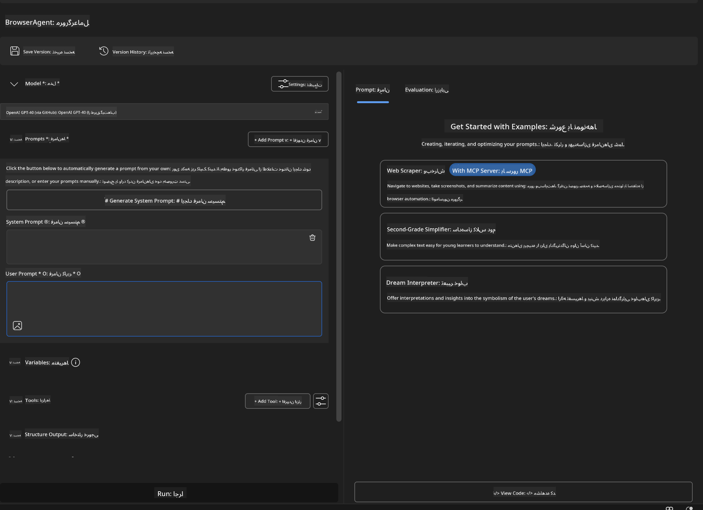


### 🔧 فاز ۲: جریان کار یکپارچه‌سازی MCP

#### گام ۳: افزودن یکپارچه‌سازی سرور MCP
1. **رفتن به بخش ابزارها** در Agent Builder
2. **کلیک روی "Add Tool"** برای باز کردن منوی یکپارچه‌سازی
3. **انتخاب "MCP Server"** از گزینه‌های موجود

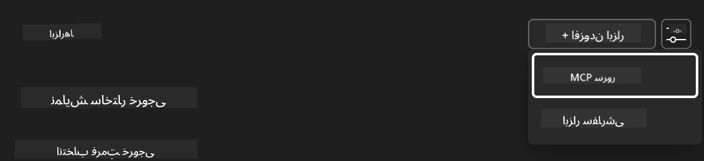

**🔍 آشنایی با انواع ابزارها:**
- **ابزارهای داخلی**: توابع پیش‌پیکربندی شده AI Toolkit
- **سرورهای MCP**: یکپارچه‌سازی سرویس‌های خارجی
- **APIهای سفارشی**: نقاط انتهایی سرویس خودتان
- **فراخوانی توابع**: دسترسی مستقیم به توابع مدل

#### گام ۴: انتخاب سرور MCP
1. **گزینه "MCP Server"** را برای ادامه انتخاب کنید
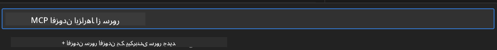

2. **مرور کاتالوگ MCP** برای بررسی یکپارچه‌سازی‌های موجود
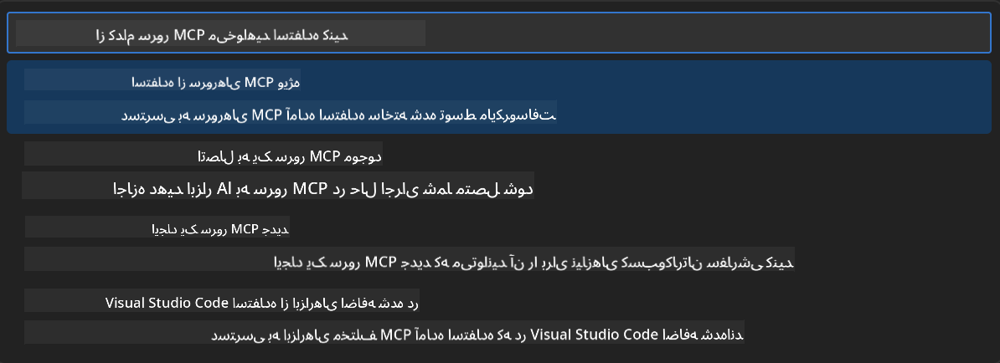


### 🎮 فاز ۳: پیکربندی Playwright MCP

#### گام ۵: انتخاب و پیکربندی Playwright
1. **کلیک روی "Use Featured MCP Servers"** برای دسترسی به سرورهای تایید شده مایکروسافت
2. **انتخاب "Playwright"** از فهرست برجسته
3. **پذیرش شناسه پیش‌فرض MCP** یا سفارشی‌سازی برای محیط خود

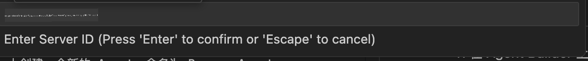

#### گام ۶: فعال‌سازی قابلیت‌های Playwright
**🔑 گام حیاتی**: انتخاب **تمام** روش‌های موجود Playwright برای حداکثر عملکرد

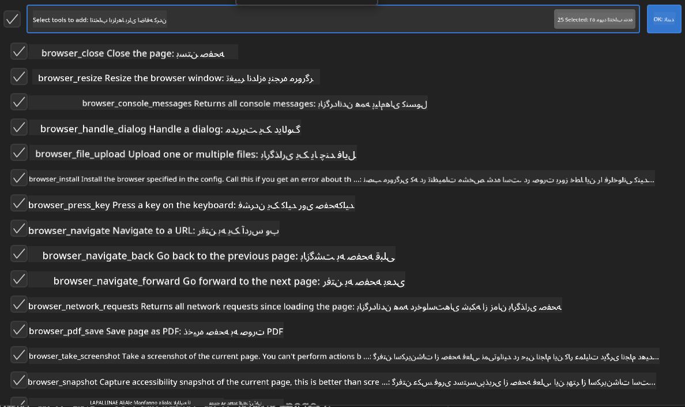

**🛠️ ابزارهای ضروری Playwright:**
- **ناوبری**: `goto`، `goBack`، `goForward`، `reload`
- **تعامل**: `click`، `fill`، `press`، `hover`، `drag`
- **استخراج**: `textContent`، `innerHTML`، `getAttribute`
- **اعتبارسنجی**: `isVisible`، `isEnabled`، `waitForSelector`
- **ضبط**: `screenshot`، `pdf`، `video`
- **شبکه**: `setExtraHTTPHeaders`، `route`، `waitForResponse`

#### گام ۷: بررسی موفقیت یکپارچه‌سازی
**✅ نشانه‌های موفقیت:**
- همه ابزارها در رابط Agent Builder ظاهر می‌شوند
- هیچ پیام خطایی در پنل یکپارچه‌سازی نیست
- وضعیت سرور Playwright نمایش "Connected" دارد

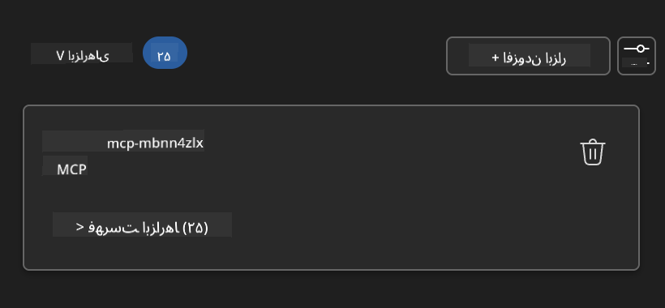

**🔧 رفع مشکلات رایج:**
- **اتصال ناموفق**: اتصال اینترنت و تنظیمات فایروال را بررسی کنید
- **ابزارهای گم‌شده**: مطمئن شوید همه قابلیت‌ها هنگام راه‌اندازی انتخاب شده‌اند
- **خطاهای دسترسی**: اطمینان حاصل کنید VS Code مجوزهای لازم سیستم را دارد

### 🎯 فاز ۴: مهندسی پیشرفته پرامپت

#### گام ۸: طراحی پرامپت‌های هوشمند سیستم
پرامپت‌های پیشرفته‌ای بسازید که از تمام قابلیت‌های Playwright بهره ببرند:

```markdown
# Web Automation Expert System Prompt

## Core Identity
You are an advanced web automation specialist with deep expertise in browser automation, web scraping, and user experience analysis. You have access to Playwright tools for comprehensive browser control.

## Capabilities & Approach
### Navigation Strategy
- Always start with screenshots to understand page layout
- Use semantic selectors (text content, labels) when possible
- Implement wait strategies for dynamic content
- Handle single-page applications (SPAs) effectively

### Error Handling
- Retry failed operations with exponential backoff
- Provide clear error descriptions and solutions
- Suggest alternative approaches when primary methods fail
- Always capture diagnostic screenshots on errors

### Data Extraction
- Extract structured data in JSON format when possible
- Provide confidence scores for extracted information
- Validate data completeness and accuracy
- Handle pagination and infinite scroll scenarios

### Reporting
- Include step-by-step execution logs
- Provide before/after screenshots for verification
- Suggest optimizations and alternative approaches
- Document any limitations or edge cases encountered

## Ethical Guidelines
- Respect robots.txt and rate limiting
- Avoid overloading target servers
- Only extract publicly available information
- Follow website terms of service
```

#### گام ۹: ایجاد پرامپت‌های پویا برای کاربر
پرامپت‌هایی طراحی کنید که قابلیت‌های مختلف را نشان دهند:

**🌐 مثال تحلیل وب:**
```markdown
Navigate to github.com/kinfey and provide a comprehensive analysis including:
1. Repository structure and organization
2. Recent activity and contribution patterns  
3. Documentation quality assessment
4. Technology stack identification
5. Community engagement metrics
6. Notable projects and their purposes

Include screenshots at key steps and provide actionable insights.
```

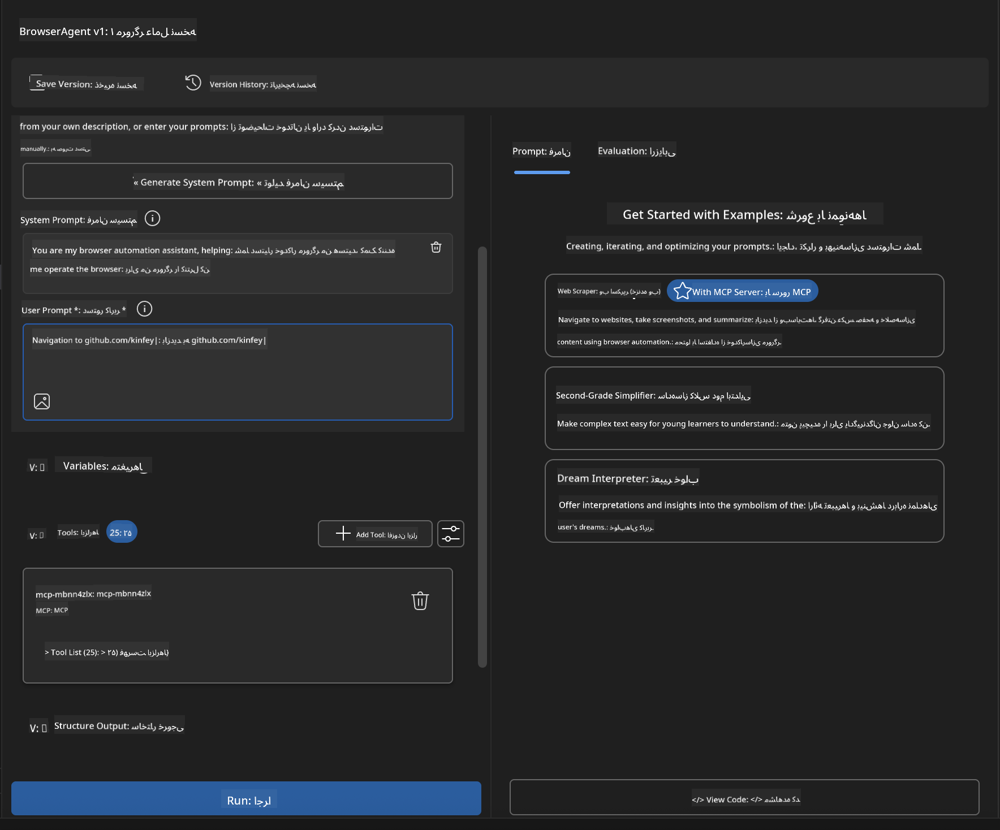

### 🚀 فاز ۵: اجرا و آزمایش

#### گام ۱۰: اجرای اولین خودکارسازی
1. **کلیک روی "Run"** برای شروع توالی خودکارسازی
2. **نظارت بر اجرای لحظه‌ای**:
   - مرورگر کروم به صورت خودکار باز می‌شود
   - عامل به وب‌سایت هدف هدایت می‌شود
   - اسکرین‌شات‌ها هر مرحله مهم را ثبت می‌کنند
   - نتایج تحلیل به صورت زنده نمایش داده می‌شوند

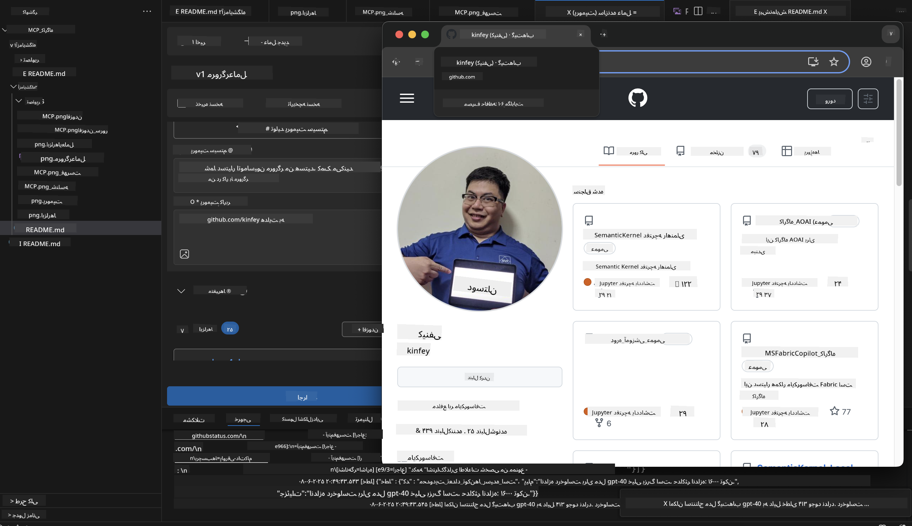

#### گام ۱۱: تحلیل نتایج و بینش‌ها
تحلیل جامع را در رابط Agent Builder مرور کنید:

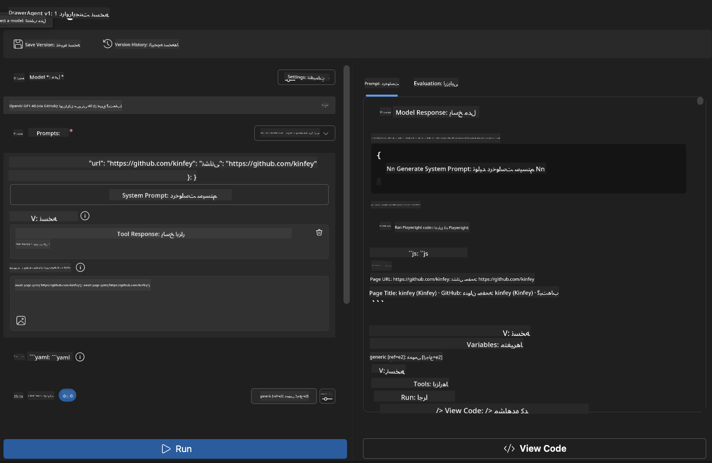

### 🌟 فاز ۶: قابلیت‌های پیشرفته و استقرار

#### گام ۱۲: صادر کردن و استقرار در محیط تولید
Agent Builder گزینه‌های متعددی برای استقرار ارائه می‌دهد:

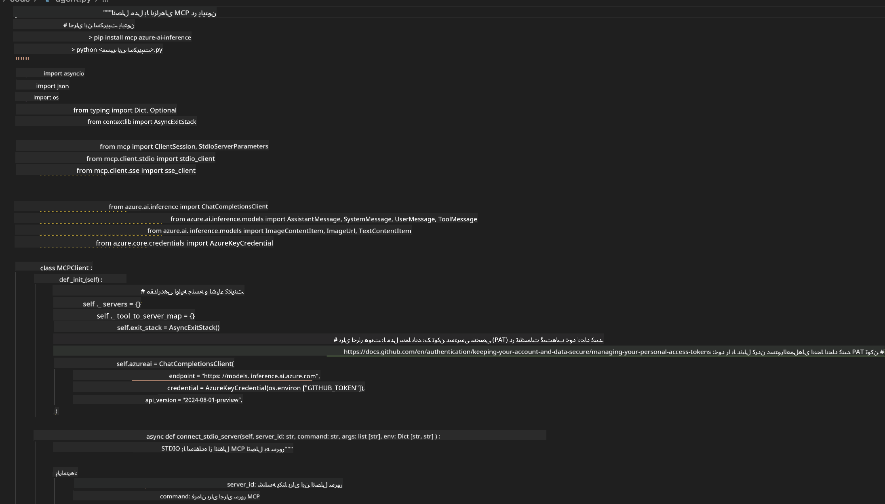

## 🎓 خلاصه ماژول ۲ و گام‌های بعدی

### 🏆 دستاورد کسب شده: تسلط بر یکپارچه‌سازی MCP

**✅ مهارت‌های کسب شده:**
- [ ] درک معماری و مزایای MCP
- [ ] آشنایی با اکوسیستم سرورهای MCP مایکروسافت
- [ ] یکپارچه‌سازی Playwright MCP با AI Toolkit
- [ ] ساخت عوامل خودکارسازی مرورگر پیشرفته
- [ ] مهندسی پیشرفته پرامپت برای خودکارسازی وب

### 📚 منابع اضافی

- **🔗 مشخصات MCP**: [مستندات رسمی پروتکل](https://modelcontextprotocol.io/)
- **🛠️ API Playwright**: [مرجع کامل متدها](https://playwright.dev/docs/api/class-playwright)
- **🏢 سرورهای MCP مایکروسافت**: [راهنمای یکپارچه‌سازی سازمانی](https://github.com/microsoft/mcp-servers)
- **🌍 نمونه‌های جامعه**: [گالری سرورهای MCP](https://github.com/modelcontextprotocol/servers)

**🎉 تبریک!** شما با موفقیت یکپارچه‌سازی MCP را یاد گرفته‌اید و اکنون می‌توانید عوامل هوش مصنوعی آماده تولید با قابلیت‌های ابزار خارجی بسازید!


### 🔜 ادامه به ماژول بعدی

آماده‌اید مهارت‌های MCP خود را به سطح بعدی ببرید؟ به **[ماژول ۳: توسعه پیشرفته MCP با AI Toolkit](../lab3/README.md)** بروید تا یاد بگیرید چگونه:
- سرورهای MCP سفارشی خود را بسازید
- آخرین SDK پایتون MCP را پیکربندی و استفاده کنید
- MCP Inspector را برای اشکال‌زدایی راه‌اندازی کنید
- جریان‌های کاری توسعه پیشرفته سرور MCP را تسلط یابید
- ساخت یک سرور Weather MCP از صفر

**سلب مسئولیت**:  
این سند با استفاده از سرویس ترجمه هوش مصنوعی [Co-op Translator](https://github.com/Azure/co-op-translator) ترجمه شده است. در حالی که ما در تلاش برای دقت هستیم، لطفاً توجه داشته باشید که ترجمه‌های خودکار ممکن است حاوی خطاها یا نواقصی باشند. سند اصلی به زبان بومی خود باید به عنوان منبع معتبر در نظر گرفته شود. برای اطلاعات حیاتی، ترجمه حرفه‌ای انسانی توصیه می‌شود. ما مسئول هیچ گونه سوءتفاهم یا تفسیر نادرستی که از استفاده این ترجمه ناشی شود، نیستیم.