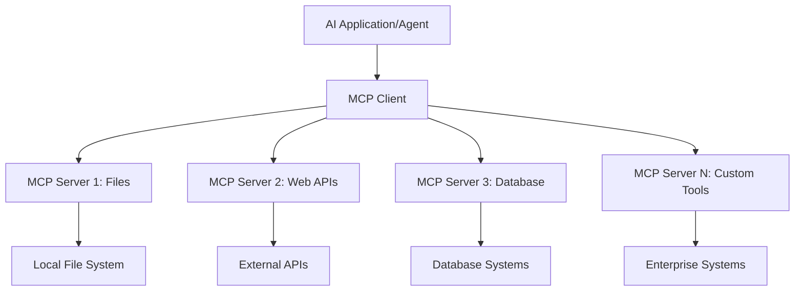

<!--
CO_OP_TRANSLATOR_METADATA:
{
  "original_hash": "a22b7dd11cd7690f99f9195877cafdc3",
  "translation_date": "2025-06-10T05:37:12+00:00",
  "source_file": "10-StreamliningAIWorkflowsBuildingAnMCPServerWithAIToolkit/lab2/README.md",
  "language_code": "fa"
}
-->
# 🌐 ماژول ۲: اصول MCP با کیت ابزار هوش مصنوعی

[]()
[]()
[]()

## 📋 اهداف یادگیری

در پایان این ماژول، قادر خواهید بود:
- ✅ معماری و مزایای پروتکل مدل کانتکست (MCP) را درک کنید
- ✅ اکوسیستم سرورهای MCP مایکروسافت را بررسی کنید
- ✅ سرورهای MCP را با AI Toolkit Agent Builder یکپارچه کنید
- ✅ یک عامل خودکارسازی مرورگر کاربردی با Playwright MCP بسازید
- ✅ ابزارهای MCP را در عوامل خود پیکربندی و تست کنید
- ✅ عوامل مجهز به MCP را برای استفاده در محیط تولید صادر و مستقر کنید

## 🎯 ادامه مسیر از ماژول ۱

در ماژول ۱، اصول کیت ابزار هوش مصنوعی را فراگرفتیم و اولین عامل پایتون خود را ساختیم. حالا با اتصال عوامل خود به ابزارها و سرویس‌های خارجی از طریق پروتکل انقلابی **Model Context Protocol (MCP)**، آنها را به سطح بالاتری می‌بریم.

می‌توانید این را به ارتقا از یک ماشین‌حساب ساده به یک کامپیوتر کامل تشبیه کنید - عوامل هوش مصنوعی شما توانایی‌های زیر را خواهند داشت:
- 🌐 مرور و تعامل با وب‌سایت‌ها
- 📁 دسترسی و مدیریت فایل‌ها
- 🔧 یکپارچه‌سازی با سیستم‌های سازمانی
- 📊 پردازش داده‌های زمان واقعی از APIها

## 🧠 آشنایی با پروتکل مدل کانتکست (MCP)

### 🔍 MCP چیست؟

پروتکل مدل کانتکست (MCP) مانند **"USB-C برای برنامه‌های هوش مصنوعی"** است - یک استاندارد باز انقلابی که مدل‌های زبان بزرگ (LLM) را به ابزارها، منابع داده و سرویس‌های خارجی متصل می‌کند. همانطور که USB-C با ارائه یک کانکتور جهانی، آشفتگی کابل‌ها را حذف کرد، MCP هم با یک پروتکل استاندارد، پیچیدگی یکپارچه‌سازی هوش مصنوعی را از بین می‌برد.

### 🎯 مشکلی که MCP حل می‌کند

**قبل از MCP:**
- 🔧 یکپارچه‌سازی‌های سفارشی برای هر ابزار
- 🔄 وابستگی به فروشنده با راه‌حل‌های اختصاصی  
- 🔒 آسیب‌پذیری‌های امنیتی به دلیل اتصالات غیر استاندارد
- ⏱️ ماه‌ها توسعه برای یکپارچه‌سازی‌های ساده

**با MCP:**
- ⚡ اتصال و استفاده سریع و آسان ابزارها
- 🔄 معماری مستقل از فروشنده
- 🛡️ رعایت بهترین شیوه‌های امنیتی داخلی
- 🚀 افزودن قابلیت‌های جدید در چند دقیقه

### 🏗️ بررسی معماری MCP

MCP از معماری **کلاینت-سرور** پیروی می‌کند که یک اکوسیستم امن و مقیاس‌پذیر ایجاد می‌کند:



**🔧 اجزای اصلی:**

| جزء | نقش | مثال‌ها |
|-----------|------|----------|
| **MCP Hosts** | برنامه‌هایی که از خدمات MCP استفاده می‌کنند | Claude Desktop, VS Code, AI Toolkit |
| **MCP Clients** | هندلرهای پروتکل (هر کدام ۱:۱ با سرورها) | در برنامه‌های میزبان تعبیه شده |
| **MCP Servers** | قابلیت‌ها را از طریق پروتکل استاندارد ارائه می‌دهند | Playwright, Files, Azure, GitHub |
| **Transport Layer** | روش‌های ارتباطی | stdio, HTTP, WebSockets |

## 🏢 اکوسیستم سرورهای MCP مایکروسافت

مایکروسافت با مجموعه‌ای جامع از سرورهای سازمانی پیشرفته، رهبری اکوسیستم MCP را بر عهده دارد که نیازهای واقعی کسب‌وکارها را برطرف می‌کند.

### 🌟 سرورهای برجسته MCP مایکروسافت

#### 1. ☁️ سرور Azure MCP  
**🔗 مخزن**: [azure/azure-mcp](https://github.com/azure/azure-mcp)  
**🎯 هدف**: مدیریت جامع منابع Azure با یکپارچه‌سازی هوش مصنوعی  

**✨ ویژگی‌های کلیدی:**  
- فراهم‌سازی زیرساخت به صورت اعلانی  
- مانیتورینگ منابع در زمان واقعی  
- پیشنهادهای بهینه‌سازی هزینه  
- بررسی انطباق امنیتی  

**🚀 موارد استفاده:**  
- زیرساخت به عنوان کد با کمک هوش مصنوعی  
- مقیاس‌بندی خودکار منابع  
- بهینه‌سازی هزینه‌های ابری  
- خودکارسازی فرآیندهای DevOps  

#### 2. 📊 Microsoft Dataverse MCP  
**📚 مستندات**: [Microsoft Dataverse Integration](https://go.microsoft.com/fwlink/?linkid=2320176)  
**🎯 هدف**: رابط زبان طبیعی برای داده‌های کسب‌وکار  

**✨ ویژگی‌های کلیدی:**  
- پرس‌وجوهای پایگاه داده به زبان طبیعی  
- درک کانتکست کسب‌وکار  
- قالب‌های سفارشی پرامپت  
- حاکمیت داده‌های سازمانی  

**🚀 موارد استفاده:**  
- گزارش‌دهی هوش تجاری  
- تحلیل داده‌های مشتری  
- بینش‌های خط لوله فروش  
- پرس‌وجوهای داده‌های انطباق  

#### 3. 🌐 سرور Playwright MCP  
**🔗 مخزن**: [microsoft/playwright-mcp](https://github.com/microsoft/playwright-mcp)  
**🎯 هدف**: خودکارسازی مرورگر و تعامل وب  

**✨ ویژگی‌های کلیدی:**  
- خودکارسازی مرورگرهای مختلف (کروم، فایرفاکس، سافاری)  
- شناسایی هوشمند عناصر  
- تولید اسکرین‌شات و PDF  
- مانیتورینگ ترافیک شبکه  

**🚀 موارد استفاده:**  
- خودکارسازی تست‌ها  
- استخراج داده از وب  
- مانیتورینگ UI/UX  
- خودکارسازی تحلیل رقابتی  

#### 4. 📁 سرور Files MCP  
**🔗 مخزن**: [microsoft/files-mcp-server](https://github.com/microsoft/files-mcp-server)  
**🎯 هدف**: عملیات هوشمند سیستم فایل  

**✨ ویژگی‌های کلیدی:**  
- مدیریت اعلانی فایل‌ها  
- همگام‌سازی محتوا  
- یکپارچه‌سازی کنترل نسخه  
- استخراج متادیتا  

**🚀 موارد استفاده:**  
- مدیریت مستندات  
- سازماندهی مخازن کد  
- گردش‌های کاری انتشار محتوا  
- مدیریت فایل‌های خط لوله داده  

#### 5. 📝 سرور MarkItDown MCP  
**🔗 مخزن**: [microsoft/markitdown](https://github.com/microsoft/markitdown)  
**🎯 هدف**: پردازش و دستکاری پیشرفته Markdown  

**✨ ویژگی‌های کلیدی:**  
- تجزیه غنی Markdown  
- تبدیل فرمت (MD ↔ HTML ↔ PDF)  
- تحلیل ساختار محتوا  
- پردازش قالب‌ها  

**🚀 موارد استفاده:**  
- گردش‌های کاری مستندسازی فنی  
- سیستم‌های مدیریت محتوا  
- تولید گزارش  
- خودکارسازی پایگاه دانش  

#### 6. 📈 سرور Clarity MCP  
**📦 پکیج**: [@microsoft/clarity-mcp-server](https://www.npmjs.com/package/@microsoft/clarity-mcp-server)  
**🎯 هدف**: تحلیل وب و بینش رفتار کاربران  

**✨ ویژگی‌های کلیدی:**  
- تحلیل داده‌های نقشه حرارتی  
- ضبط جلسات کاربر  
- معیارهای عملکرد  
- تحلیل قیف تبدیل  

**🚀 موارد استفاده:**  
- بهینه‌سازی وب‌سایت  
- تحقیق تجربه کاربری  
- تحلیل تست A/B  
- داشبوردهای هوش تجاری  

### 🌍 اکوسیستم جامعه کاربری

علاوه بر سرورهای مایکروسافت، اکوسیستم MCP شامل موارد زیر است:  
- **🐙 GitHub MCP**: مدیریت مخازن و تحلیل کد  
- **🗄️ MCPهای پایگاه داده**: یکپارچه‌سازی با PostgreSQL، MySQL، MongoDB  
- **☁️ MCPهای ارائه‌دهنده ابری**: ابزارهای AWS، GCP، Digital Ocean  
- **📧 MCPهای ارتباطی**: یکپارچه‌سازی Slack، Teams، ایمیل  

## 🛠️ آزمایشگاه عملی: ساخت یک عامل خودکارسازی مرورگر

**🎯 هدف پروژه**: ساخت یک عامل هوشمند خودکارسازی مرورگر با استفاده از سرور Playwright MCP که بتواند وب‌سایت‌ها را مرور کند، اطلاعات استخراج کند و تعاملات پیچیده وب را انجام دهد.

### 🚀 مرحله ۱: راه‌اندازی پایه عامل

#### مرحله ۱: عامل خود را راه‌اندازی کنید  
1. **باز کردن AI Toolkit Agent Builder**  
2. **ایجاد عامل جدید** با پیکربندی زیر:  
   - **نام**: `BrowserAgent`
   - **Model**: Choose GPT-4o 


### 🔧 Phase 2: MCP Integration Workflow

#### Step 3: Add MCP Server Integration
1. **Navigate to Tools Section** in Agent Builder
2. **Click "Add Tool"** to open the integration menu
3. **Select "MCP Server"** from available options


**🔍 Understanding Tool Types:**
- **Built-in Tools**: Pre-configured AI Toolkit functions
- **MCP Servers**: External service integrations
- **Custom APIs**: Your own service endpoints
- **Function Calling**: Direct model function access

#### Step 4: MCP Server Selection
1. **Choose "MCP Server"** option to proceed


2. **Browse MCP Catalog** to explore available integrations


### 🎮 Phase 3: Playwright MCP Configuration

#### Step 5: Select and Configure Playwright
1. **Click "Use Featured MCP Servers"** to access Microsoft's verified servers
2. **Select "Playwright"** from the featured list
3. **Accept Default MCP ID** or customize for your environment


#### Step 6: Enable Playwright Capabilities
**🔑 Critical Step**: Select **ALL** available Playwright methods for maximum functionality


**🛠️ Essential Playwright Tools:**
- **Navigation**: `goto`, `goBack`, `goForward`, `reload`
- **Interaction**: `click`, `fill`, `press`, `hover`, `drag`
- **Extraction**: `textContent`, `innerHTML`, `getAttribute`
- **Validation**: `isVisible`, `isEnabled`, `waitForSelector`
- **Capture**: `screenshot`, `pdf`, `video`
- **Network**: `setExtraHTTPHeaders`, `route`, `waitForResponse`

#### مرحله ۷: صحت یکپارچه‌سازی را بررسی کنید  
**✅ نشانه‌های موفقیت:**  
- همه ابزارها در رابط Agent Builder ظاهر می‌شوند  
- هیچ پیغام خطایی در پنل یکپارچه‌سازی وجود ندارد  
- وضعیت سرور Playwright نمایش "Connected" دارد  


**🔧 رفع مشکلات رایج:**  
- **اتصال ناموفق**: اتصال اینترنت و تنظیمات فایروال را بررسی کنید  
- **ابزارهای مفقود**: مطمئن شوید همه قابلیت‌ها هنگام راه‌اندازی انتخاب شده‌اند  
- **خطاهای دسترسی**: اطمینان حاصل کنید VS Code دسترسی‌های لازم سیستم را دارد  

### 🎯 مرحله ۴: مهندسی پرامپت پیشرفته

#### مرحله ۸: طراحی پرامپت‌های هوشمند سیستمی  
پرامپت‌های پیشرفته‌ای بسازید که از تمام قابلیت‌های Playwright بهره ببرند:

```markdown
# Web Automation Expert System Prompt

## Core Identity
You are an advanced web automation specialist with deep expertise in browser automation, web scraping, and user experience analysis. You have access to Playwright tools for comprehensive browser control.

## Capabilities & Approach
### Navigation Strategy
- Always start with screenshots to understand page layout
- Use semantic selectors (text content, labels) when possible
- Implement wait strategies for dynamic content
- Handle single-page applications (SPAs) effectively

### Error Handling
- Retry failed operations with exponential backoff
- Provide clear error descriptions and solutions
- Suggest alternative approaches when primary methods fail
- Always capture diagnostic screenshots on errors

### Data Extraction
- Extract structured data in JSON format when possible
- Provide confidence scores for extracted information
- Validate data completeness and accuracy
- Handle pagination and infinite scroll scenarios

### Reporting
- Include step-by-step execution logs
- Provide before/after screenshots for verification
- Suggest optimizations and alternative approaches
- Document any limitations or edge cases encountered

## Ethical Guidelines
- Respect robots.txt and rate limiting
- Avoid overloading target servers
- Only extract publicly available information
- Follow website terms of service
```

#### مرحله ۹: ساخت پرامپت‌های پویا برای کاربر  
پرامپت‌هایی طراحی کنید که قابلیت‌های مختلف را نشان دهند:

**🌐 نمونه تحلیل وب:**  
```markdown
Navigate to github.com/kinfey and provide a comprehensive analysis including:
1. Repository structure and organization
2. Recent activity and contribution patterns  
3. Documentation quality assessment
4. Technology stack identification
5. Community engagement metrics
6. Notable projects and their purposes

Include screenshots at key steps and provide actionable insights.
```


### 🚀 مرحله ۵: اجرا و تست

#### مرحله ۱۰: اجرای اولین خودکارسازی  
1. **روی "Run" کلیک کنید** تا توالی خودکارسازی شروع شود  
2. **نظارت بر اجرای زمان واقعی:**  
   - مرورگر Chrome به صورت خودکار باز می‌شود  
   - عامل به وب‌سایت هدف هدایت می‌شود  
   - اسکرین‌شات‌ها از هر مرحله مهم گرفته می‌شود  
   - نتایج تحلیل به صورت زنده نمایش داده می‌شوند  


#### مرحله ۱۱: تحلیل نتایج و بینش‌ها  
تحلیل جامع را در رابط Agent Builder مرور کنید:


### 🌟 مرحله ۶: قابلیت‌های پیشرفته و استقرار

#### مرحله ۱۲: صادر کردن و استقرار در محیط تولید  
Agent Builder گزینه‌های متعددی برای استقرار ارائه می‌دهد:


## 🎓 خلاصه ماژول ۲ و گام‌های بعدی

### 🏆 دستاورد کسب شده: استاد یکپارچه‌سازی MCP

**✅ مهارت‌های کسب‌شده:**  
- [ ] درک معماری و مزایای MCP  
- [ ] آشنایی با اکوسیستم سرورهای MCP مایکروسافت  
- [ ] یکپارچه‌سازی Playwright MCP با AI Toolkit  
- [ ] ساخت عوامل خودکارسازی مرورگر پیشرفته  
- [ ] مهندسی پرامپت پیشرفته برای خودکارسازی وب  

### 📚 منابع اضافی

- **🔗 مشخصات MCP**: [مستندات رسمی پروتکل](https://modelcontextprotocol.io/)  
- **🛠️ API Playwright**: [مرجع کامل متدها](https://playwright.dev/docs/api/class-playwright)  
- **🏢 سرورهای MCP مایکروسافت**: [راهنمای یکپارچه‌سازی سازمانی](https://github.com/microsoft/mcp-servers)  
- **🌍 نمونه‌های جامعه**: [گالری سرورهای MCP](https://github.com/modelcontextprotocol/servers)  

**🎉 تبریک!** شما با موفقیت یکپارچه‌سازی MCP را یاد گرفته‌اید و حالا می‌توانید عوامل هوش مصنوعی آماده تولید با قابلیت‌های ابزار خارجی بسازید!

### 🔜 ادامه به ماژول بعدی

آماده‌اید مهارت‌های MCP خود را به سطح بعدی ببرید؟ به **[ماژول ۳: توسعه پیشرفته MCP با کیت ابزار هوش مصنوعی](../lab3/README.md)** بروید و یاد بگیرید چگونه:  
- سرورهای MCP سفارشی خود را بسازید  
- جدیدترین SDK پایتون MCP را پیکربندی و استفاده کنید  
- MCP Inspector را برای اشکال‌زدایی راه‌اندازی کنید  
- جریان‌های کاری توسعه پیشرفته سرور MCP را مدیریت کنید  
- یک سرور MCP هواشناسی از صفر بسازید

**سلب مسئولیت**:  
این سند با استفاده از سرویس ترجمه هوش مصنوعی [Co-op Translator](https://github.com/Azure/co-op-translator) ترجمه شده است. در حالی که ما در تلاش برای دقت هستیم، لطفاً توجه داشته باشید که ترجمه‌های خودکار ممکن است حاوی خطاها یا نواقصی باشند. سند اصلی به زبان بومی آن باید به عنوان منبع معتبر در نظر گرفته شود. برای اطلاعات حیاتی، ترجمه حرفه‌ای انسانی توصیه می‌شود. ما مسئول هیچ گونه سوءتفاهم یا تفسیر نادرستی که از استفاده این ترجمه ناشی شود، نیستیم.